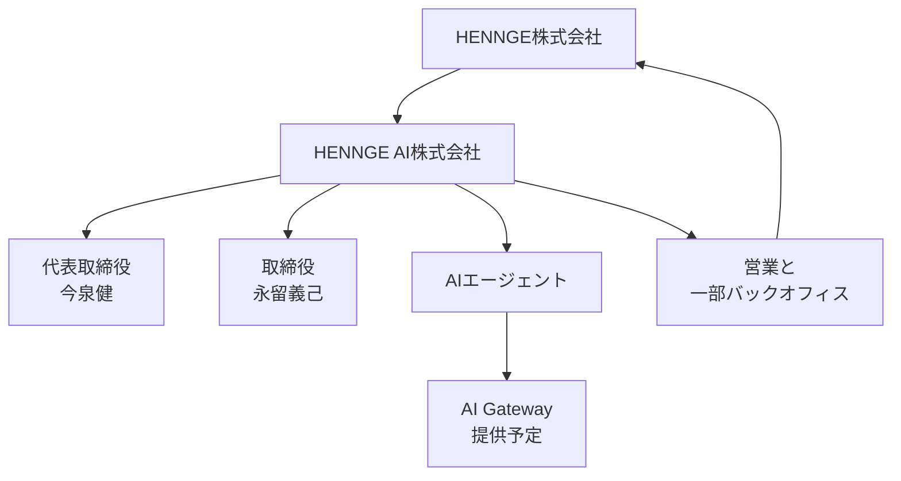

2026年10月1日、HENNGE株式会社（証券コード4475、代表取締役社長 小椋一宏）は、HENNGE AI株式会社の設立を発表した。事業は、企業における AI 利用のガバナンスとコスト管理を支援するサービスの開発・提供である。取締役2人、AI エージェント、本社への委託がどの仕事を持つか、提供予定の AI Gateway が何をするか、対外送信・支払い・サービス停止のどこまでを事前の執行に置けるかを、会社発表と会社法のデフォルトから追える。出資比率と資本金は、同日の会社プレスと適時開示 PDF の別添には無い。

*この記事の全体像。以下、順に解説します。*

## HENNGE AI株式会社とは

HENNGE AI株式会社は、2026年10月1日に設立されたと親会社が発表した株式会社である。所在地は東京都渋谷区南平台町16番28号 Daiwa渋谷スクエアで、親会社本社と同じ住所である。代表取締役は今泉健（親会社執行役員）、取締役は永留義己（親会社取締役副社長）である。英語プレスの氏名は Takeru Imaizumi / Yoshiki Nagatome である。問い合わせ先は Corporate Communication、03-6415-3660、hennge-pr@hennge.com、担当 市嶋である。

事業内容は、AI 関連サービスおよび AI 管理ツールの開発・提供と、コンサルティング（FDE）である。提供予定の AI Gateway は、親会社内で使っているシステムの事業化である。提供開始は、同社の2027年度中（2027年9月まで）と会社は書いている。料金と利用条件は、サービス開始時に知らせる、とプレスが書く。

### AI Gateway の機能計画

AI Gateway の機能計画は5つである。

1. ユーザーやグループ単位のモデル割当。
2. 利用コストの可視化と上限。
3. 全社から個人までの権限制御。
4. HENNGE One の IdP 連携（SSO と端末制御）。
5. 非人間 ID の統合認証。これは将来構想、と注記がある。

連携の例は Claude / ChatGPT、Visual Studio Code、Dify である。

### 取締役、エージェント、本社委託

新会社は、取締役2名以外の従業員を置かない、と会社は書いている。開発・カスタマーサポート・マーケティング・バックオフィスは AI エージェントが担当する。営業と一部バックオフィスは HENNGE 本社へ委託する。組織の説明は「次世代組織モデルの実証実験」である。

今泉の note（2026-10-01 11:00）は、役員は親会社からの兼任で、設立時点で従業員がいない、と書く。組織図は「現在検討している」と書く。規定外動作の監視は「入れていこうと思っています」と書く。結びは親会社の採用案内である。

### 発表が置いている主体

発表が置いている主体は、親会社、子会社、取締役2人、AI エージェント、親会社への委託の5つである。

矢印は、発表文が書く設立、兼任、担当、委託、提供予定の関係である。商品は未発売で、AI Gateway は提供予定として置いている。

## 注意点

見出しの「人間は取締役2人だけ」「従業員ゼロ」は、子会社の雇用名簿の話である。一次資料は同時に、役員兼任、本社委託、監視は今後、組織図は検討中、商品は未発売、と書いている。

### 出資と「国内で初めて」

今泉 note は「HENNGE株式会社の100%子会社」と書く。日本語プレスと 2026-10-01 の適時開示 PDF の別添には、出資比率も資本金も無い。2026-10-01 の適時開示は「本件による当社の連結業績への影響は軽微と見込んでおります」と書く。PDF 本文のこの文は読める。脚注の年数は、テキスト抽出の再確認が残る。

公式会社概要は、海外拠点として台灣惠頂益股份有限公司と HENNGE Inc.（San Francisco）を載せる。小椋コメントの「国内子会社を設立するのは初めて」は、この海外拠点と別の文である。台湾は about 上 2016年10月創立である。第29期報告書の検索抽出では出資100%と読める。資本額はサイトの 29,500,000 NTD と報告書の 27,500千台湾ドルで、突合は未了である。米国 HENNGE Inc. は 2025-03-21 開示で、2025年4月設立予定、出資51%の合弁である。100%子会社とは呼ばない。

法人番号、登記、定款、資本金は、2026-10-03 の国税庁と gBizINFO の公開検索では確認できていない。未掲載は設立無効ではない。親会社の法人番号 2011001034562 は同じ検索で出る。

### 親会社の数字

次の数字は HENNGE AI の稼働実績ではない。

- 契約ユーザー300万以上は HENNGE One の数字である。2026-05-28 の適時開示は「契約ユーザ数300万突破」と書く。契約企業数は 2026年3月末時点で 3,731社である。東証上場企業の約20%は会社の説明である。監査済みとは書いていない。
- 「国内シェアNo.1のクラウドセキュリティ」の脚注は、日本語設立プレスでは ITR の IDaaS 市場におけるベンダー別売上金額で、2025年度（予測）1位、である。市場は本文の「クラウドセキュリティ」より狭い。シェアのパーセントは、レポート本体が購入物のため転記しない。
- 同じ日の適時開示 PDF の脚注は、同じレポートで 2021年度から 2025年度（予測）の5年連続、とテキスト抽出にある。日本語ウェブ脚注は 2025年度（予測）の1位だけを書く。PDF 脚注の年数は再確認が残る。
- アポ率「5%程度」から「約50%」は、永留の 2026-07-14 note にある。話者は親会社パートナーセールスの波多野の自己申告で、20件に1件、10件に5件、という説明が付く。人間は内容の確認と送信ボタンを押す、と書く。第三者計測は無い。設立前の親会社の話である。

二次サイトの証券コード 4470.T や、英語名 Yoshimi は、適時開示の 4475 および英語プレスの Yoshiki と違う。根拠にしない。

### 海外の肩書

海外の「AI CEO」は、肩書の発表として読む。NetDragon は 2022-08-26 に仮想ヒューマノイド Tang Yu を子会社の Rotating CEO とした、と PR する。Dictador は 2022-09-27 に Mika を CEO および board member とした、と PR する。法律上の唯一の代表者を AI にした、という一次は、確認した範囲では見つかっていない。ExtremeTech（2023-09-20）は、人間が重要決定を残す、と Reuters インタビューを伝える。これは二次情報である。署名、免許、口座を理由に止まった一次も、この範囲では見つかっていない。存在しない、とまでは書かない。

## 送信と支払いと停止を分ける

これは法律意見ではない。定款、登記、個別契約は 2026-10-03 時点で未確認である。次の表は、定款に別段の定めが無いときの法定デフォルトである。別段の定めがあれば、そちらが優先する。

### 確認した条文

会社法331条5項は、取締役会設置会社の取締役を3人以上とする。発表上の取締役は2人なので、非取締役会設置と整合する。登記は未確認なので、設置会社ではない、とは断定しない。362条4項は、重要財産と多額の借財を取締役会が各取締役へ委任できない、という設置会社の規律である。

会社法348条2項は、取締役が2人以上なら、定款に別段の定めが無ければ業務は過半数で決める、とする。2人の過半数は両者の一致である。別段の定めは未確認である。348条3項は、支配人の選解任、支店、株主総会の招集事項、内部統制等の体制整備、役員の責任免除を、各取締役へ委任できない、とする。

会社法349条は、代表取締役を定めた場合、他の取締役は当然には代表しない、とする。定めの方法（定款、互選、株主総会）は未確認である。349条4項の代表権は、業務に関する一切の裁判上・裁判外行為である。349条5項は、その権限に加えた制限を善意の第三者に対抗できない、という条である。AI の行為が第三者に効かない根拠にはならない。

会社法331条1項1号は、法人は取締役になれない、とする。330条は、役員との関係を委任とする。423条1項は、任務懈怠の対会社賠償である。350条は、代表者の職務上の第三者損害を会社が賠償する、とする。

会社法10条から14条は、支配人と、特定事項を任された使用人に法定の代理を置く。従業員がいない発表と両立する限り、この法定代理は使えない。親会社の従業員は、子会社と雇用が無ければ子会社の使用人ではない。

会社法351条は、代表取締役が「欠けた」ときの権利義務の残留と、裁判所の一時代表を書く。在任のまま連絡が取れない状態は、この条には無い。354条は、代表権の無い取締役に社長・副社長等の名称を付けると表見代表とする。子会社での永留の表示は「取締役」である。親会社の「取締役副社長」が、子会社の354条を自動で充たすとは限らない。

民法3条は、私権の享有は出生に始まる、とする。3条の2は、意思能力が無ければ法律行為は無効とする。99条は、権限内で本人のためにすることを示してした代理人の意思表示は、本人に直接効力を生ずる、とする。102条は、制限行為能力者という人が代理人になっても、行為能力の制限では取り消せない、という条である。人でないシステムが代理人になる、とは書いていない。103条は、権限の定めが無い代理人を、保存行為と、性質を変えない利用・改良だけに限る。109条と110条は、代理権を与えた旨の表示と、権限があると信じる正当な理由があるときの表見代理である。

設計範囲が明確な自動出力を、会社の道具として会社自身の意思表示とみる整理がある（So & Sato、2026-09-14、一般解説）。判例として確定した線とは確認していない。範囲を外れたときの扱いも、同解説は未確立と書き、民法95条と110条を例示する。

電子署名法2条と3条は、本人だけが行える電子署名がある電磁的記録について、真正成立を推定する。共有 API キーやエージェントのログは、この推定を生まない。都度の意思表示は、紙の実印に限らない。

### 行為ごとの既定

| 行為 | 事前の執行で足りうる範囲 | その場の意思表示が要る範囲 | 署名者が不在のときの既定 |
|---|---|---|---|
| 対外送信 | 事実の通知。代表者が承認した定型の再送。約款どおりの自動応答 | 諾否、見積の確定、債務の承認、契約変更、譲歩。設計範囲が文面で特定できる自動契約は、会社自身の意思表示になりうる。判例の確定は未確認。範囲が曖昧なら、代表者か、名前のある任意代理人がその都度行う | 範囲内は続ける。範囲外は止める。営業委託が代理権を含むかは契約が未確認 |
| 支払い | 代表者が結んだ契約の、上限内の口座振替・カード・API 従量。上限で自動停止する | 新規振込、新規取引先、上限の変更、借入。金額が「重要財産」かは362条の用語であり、2人会社の法定の非委任事項ではない。348条2項の両者一致は、別段の定めが未確認な限り残る | 上限内の既存決済は続ける。新規と上限変更は止める |
| サービス停止 | 顧客が同意した約款の条件どおりの自動停止 | 個別契約の解除通知。相手方サービス（利用中の LLM やクラウド）の解約申入れ | 約款条件どおりは続ける。個別の解除通知はやらない |

署名者不在のときの継続主体は、AI ではない。設立時の権限表で、行為の種類、金額、期間、終了条件を書いて授権した自然人である。授権の仕方は会社法14条ではなく、民法の任意代理である。授権した人がいなければ、枠の外は止める。権限表の改訂は業務決定であり、別段の定めが未確認な限り2人の一致である。エージェントは改訂できない。表を対外的に広く見せると、109条と110条で権限外まで会社が拘束されうる。

### 毎回のクリックを法令が要求する範囲

「対外送信・支払い・停止のたびに、法令が人間のクリックを要求する」とは書かない。確認できた人間のフックは次に限る。

- 犯罪収益移転防止法の特定事業者は、法人顧客の取引時確認で実質的支配者を自然人まで確認する（法4条1項、施行規則11条）。文言の再取得は官庁資料までで、e-Gov 全文の再確認は残る。名宛人は銀行等の特定事業者であり、子会社の従業員が社内支払を毎回押す義務ではない。
- 業として登録が要るときに、申請書へ代表者の氏名が要る、という型はある。電気通信事業の登録申請の代表者氏名は法令転載サイトの記載であり、二次情報である。資金移動業は登録制で、株式会社等であることと役員の欠格が登録拒否事由に含まれる（資金決済法37条、40条。e-Gov API 抜粋）。AI Gateway がその業に当たるかは未確認である。
- 下請法3条は、適用される親事業者に書面、または承諾済みの電磁的提供を求める。資本金は未確認なので、適用自体が未確認である。

## 責任は代表取締役に残る

現在の読みは、新しい法人類型の創設ではなく、取締役2人を公表した株式会社の運営実験である。責任主体は代表取締役に残る。エージェントは、設計した範囲の執行か、範囲が明確なら会社の道具になりうる。後者は一般解説の整理であり、判例の確定は未確認である。範囲外と、署名者不在時の枠外は、授権した自然人か、停止か、のどちらかである。

支持として読める点は4つある。

- プレスが「実証実験」と書き、営業と一部バックオフィスの本社委託を同じ節に置いている。
- 331条1項1号と、取締役は人の委任（330条）であることから、AI を取締役欄に置く読みは条文と合わない。So & Sato も、権利能力の無い AI は就任を承諾できず、「代表取締役 トート1号」という登記は今のところ通らない、と書く。受理例と拒否例の事件番号は、確認した範囲では見つかっていない。
- 電子署名法3条は、本人だけが管理する署名と、共有鍵の送信を分ける。
- 親会社セールスの note でも、送信ボタンは人が押す、と書いている。新会社の証拠ではない。対外送信を人に残す実例ではある。

反証が狭めた点は次である。

- 「定型の既存契約だけが事前で足り、新規は常にその場の自然人」は、道具説より狭い。道具説自体が判例として確定していない。
- 「非取締役会設置会社である」は、取締役2人という発表と331条5項からの推論である。登記が未確認なので、断定はしない。
- 「100%子会社」は今泉 note にある。適時開示 PDF には出資比率が無い。
- 「初めての子会社」とは書けない。台湾拠点と米国の51%合弁が、公式資料にある。
- 最判昭和48年5月22日は、取締役会を構成する取締役の監視義務の判決である。取締役2人の会社の監視義務そのものとしては使わない。最判平成22年7月15日はアパマンショップ事件であり、AI の判例ではない。「見ずに承認した」は重過失の事情になりうる、という解説にとどまる。

登記が3人以上の取締役を示した場合、非取締役会設置という推論と、各自代表の議論は作り直す。定款が代表者1人への業務決定を認めている場合、348条2項の両者一致は表から外す。ただし348条3項の非委任事項は残る。

## 設立時に書いておく7行

設立時の権限表に、次の7行を書く。人が減ることと、契約、停止、課金の署名者が残ることは、別の行にする。

1. 自動で会社の意思表示になりうる範囲を、文面で特定する。テンプレ、金額上限、約款の条番号、相手方の種類まで書く。
2. その範囲の外は、代表取締役か、名前、期間、金額を書いた任意代理人がその都度行う。エージェントは範囲を自分で広げない。
3. 代表者が連絡不能でも在任のままなら、351条には頼らない。授権した自然人が枠内を続ける。枠外は止める。授権が無ければ、最初から枠外は止める。
4. 支払いは上限と自動停止を機械に置く。上限の変更は都度の意思表示にする。
5. サービス停止は、同意済み約款の条件どおりだけを自動にする。個別の解除通知は都度にする。提供開始前でも、表は先に書く。
6. 表の改訂は、定款に別段の定めが無い限り取締役2人の一致にする。エージェントの提案は改訂ではない。
7. 対外的に見せる肩書と代理権の表示範囲を、表の中で別に書く。内部の限定は、善意の第三者へ自動では対抗できない。

親会社へ営業を委託する契約には、代理権の有無、金額、期間、終了条件を同じ表へ写す。写せない間は、親会社の担当者が子会社を当然に代表する、とは扱わない。

## 公開のまま残る確認

次は、2026年10月3日時点で公開資料が閉じていない。

- 商業登記の有料照会。公開 DB の未掲載は、設立の有無を決めない。
- 定款が348条2項の過半数を変えているか。代表取締役の定めの方法。
- 本社委託契約が、子会社を代理する権限を親会社の担当者に与えているか。
- 設計範囲内の自動契約を、裁判所が会社自身の意思表示と扱うか。
- 犯収法の条文全文。AI Gateway の業該当性。下請法の資本金閾値。
- ITR のシェアパーセント。未購入のため空欄のままにする。

## まとめ

HENNGE AI株式会社の発表は、取締役2人を公表した株式会社の運営実験として読める。開発、サポート、マーケティング、バックオフィスをエージェントが担当する、という説明と、営業と一部バックオフィスの本社委託、未発売の AI Gateway は、同じ発表の中にある。責任主体は代表取締役に残る。送信、支払い、停止は、文面で特定した範囲だけを事前の執行にし、範囲外と署名者不在の枠外は、授権した自然人か停止かに置く。出資比率、登記、定款、委託契約の代理権は、公開資料だけでは閉じていない。

この記事が少しでも参考になった、あるいは改善点などがあれば、ぜひリアクションやコメント、SNSでのシェアをいただけると励みになります！

## 参考リンク

- [HENNGE 設立プレス（2026-10-01）](https://hennge.com/jp/info/press/20261001_henngeai/)
- [英語プレス](https://hennge.com/global/info/press/20261001_henngeai/)
- [PR TIMES](https://prtimes.jp/main/html/rd/p/000000367.000007098.html)
- [今泉 note（2026-10-01 11:00）](https://note.com/hennge/n/n02be46228ac5)
- [永留 note（2026-07-14、アポ率の自己申告）](https://note.com/hennge/n/nf06e024ce8ac)
- [適時開示 PDF（2026-10-01）](https://storage.googleapis.com/disclosed-file-bucket-d4575ee/20260930543787/1/general.pdf)
- [契約ユーザー300万（2026-05-28）](https://hennge.com/jp/info/press/20260528_user3m/)
- [ITR 5年連続の会社発表（2026-04-27）](https://hennge.com/jp/info/press/20260427_itr/)
- [会社概要](https://hennge.com/jp/outline/)
- [台湾 about](https://hennge.com/tw/about-us/)
- [米国合弁の適時開示（2025-03-21）](https://www2.jpx.co.jp/disc/44750/140120250318595694.pdf)
- [ITmedia AI+（2026-10-01 18:01）](https://www.itmedia.co.jp/aiplus/article/2610/01/2000001936/)
- [公式 X（2026-10-01）](https://twitter.com/hennge_pr/status/2105492908958785950)
- [会社法（e-Gov）](https://laws.e-gov.go.jp/law/417AC0000000086)
- [民法](https://laws.e-gov.go.jp/law/129AC0000000089)
- [電子署名法](https://laws.e-gov.go.jp/law/412AC0000000102)
- [So & Sato（2026-09-14、一般解説）](https://innovationlaw.jp/ai-ceo-japan-law/)
- [NetDragon PR（2022-08-26）](https://www.prnewswire.com/news-releases/netdragon-appoints-its-first-virtual-ceo-301613062.html)
- [Dictador PR（2022-09-27）](https://www.prnewswire.com/news-releases/dictador-announces-the-first-robot-ceo-in-a-global-company-301634165.html)
- [ExtremeTech（2023-09-20）](https://www.extremetech.com/computing/humanoid-robot-ceo-is-on-247-doesnt-get-weekends-off)
- [犯収法の説明（国土交通省資料）](https://www.mlit.go.jp/totikensangyo/const/content/002005320.pdf)
- [下請法（公正取引委員会）](https://www.jftc.go.jp/shitauke/legislation/act.html)
