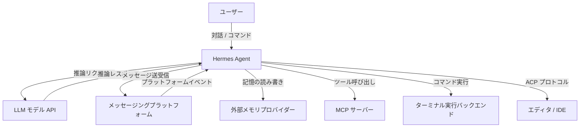
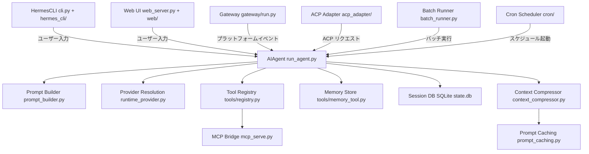
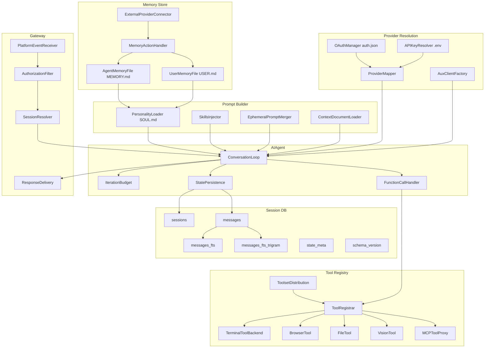
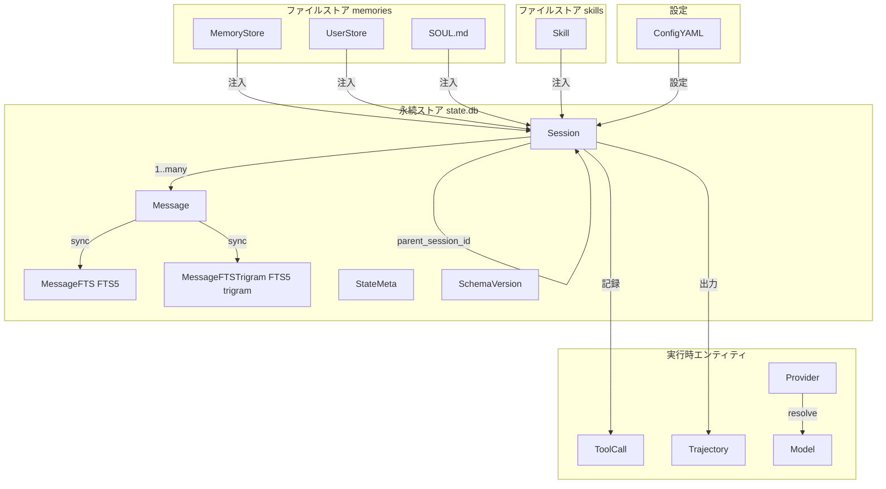
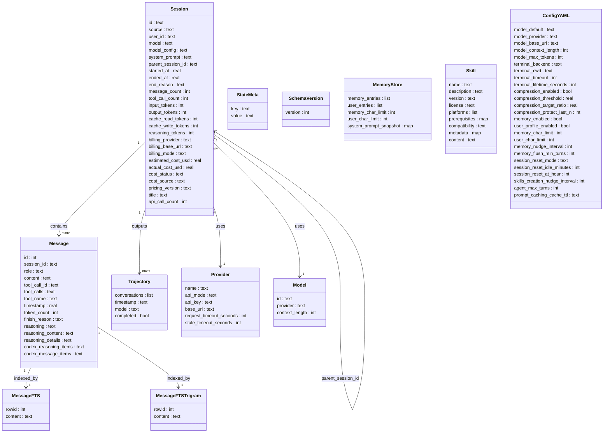

> **検証日**: 2026-05-04 / **対象バージョン**: v0.12.0 系。Hermes Agent は更新が速いため、本記事の数値は時点情報として参照してください。

## この記事の要点

- Nous Research が 2026 年初頭に公開した OSS（MIT ライセンス）の自律型 AI エージェント。
- セッション横断の永続メモリ（SQLite + FTS5）と、自動生成・自己改善されるスキルを内蔵。
- 単一の `hermes` CLI エントリポイントで CLI / Web UI / 18 以上のメッセージングプラットフォームに常駐。
- ターミナル実行を 7 種類のバックエンドから選択可能（local / Docker / SSH / Daytona / Singularity / Modal / Vercel Sandbox）。
- $5 VPS から GPU クラスター・サーバーレスまで広い実行環境に対応。

## 概要

Hermes Agent は、Nous Research が 2026 年初頭に公開したオープンソース（MIT ライセンス）の自律型 AI エージェントです。公式 README では "the only agent with a built-in learning loop"（学習ループを内蔵した唯一のエージェント）と表現しており、「IDE に縛られたコーディングコパイロット」や「API ラッパーのチャットボット」とは一線を画します。

ユーザーのサーバー上で常駐し、タスクの実行履歴からスキル（再利用可能なツール）を自動生成します。セッションをまたいで記憶を蓄積することで、利用期間が長くなるほど能力が向上する設計です。

### 類似ツールとの位置づけ

| ツール                        | カテゴリ                         | 永続メモリ               | 自己進化スキル   | デプロイ形態                                 | モデル選択肢                                      | メッセージング統合                                                  |
| ----------------------------- | -------------------------------- | ------------------------ | ---------------- | -------------------------------------------- | ------------------------------------------------- | ------------------------------------------------------------------- |
| **Hermes Agent**              | 汎用自律エージェント             | あり（SQLite + FTS5）    | あり（自動生成） | VPS / Docker / SSH / Modal 等 7 バックエンド | 18 以上のプロバイダー（OpenRouter 経由 200 以上） | Telegram / Discord / Slack / WhatsApp / Signal / Email など 18 以上 |
| **OpenClaw**                  | 汎用エージェント                 | あり（ファイルベース）   | なし（静的）     | サーバー展開可                               | 複数プロバイダー                                  | 50 以上の channels                                                  |
| **Claude Code**               | コーディング CLI                 | なし（CLAUDE.md で管理） | なし             | ローカル + IDE                               | Anthropic モデルのみ                              | なし（開発者向け CLI のみ）                                         |
| **OpenAI Swarm / Agents SDK** | マルチエージェントフレームワーク | フレームワーク提供（要実装） | なし         | ローカル / サンドボックス                    | OpenAI モデル中心                                 | なし                                                                |
| **LangChain Agent**           | エージェント構築ライブラリ       | フレームワーク提供（要実装、Deep Agents 等） | フレームワーク提供（要実装） | 任意（自前構築）          | 任意（要設定）                                    | なし（要自前実装）                                                  |

- OpenClaw はプラットフォーム統合の幅で優位。Hermes Agent は学習の深さとセキュリティ体制で優位です。
- Claude Code はコーディング性能で最高水準ですが、汎用性はありません。
- LangChain / OpenAI Agents SDK はフレームワークであり、永続メモリや自己進化スキルは実装者が別途構築する必要があります（LangChain Deep Agents 等の派生プロジェクトが該当機能を提供します）。

### Hermes Agent を選ぶ判断軸

- セッションをまたいでユーザー理解を深めたい（メモ・好み・環境を覚えるエージェント）。
- メッセージングアプリから常駐エージェントを操作したい（Telegram / Slack / Email 等）。
- モデルプロバイダーを縛らずに切り替えたい（OpenRouter 経由 200 以上のモデル）。
- 自前のサーバー / Docker / クラウドサンドボックスのいずれでも運用したい。
- IDE 連携や単発のコード生成のみが目的の場合、Claude Code 等の CLI コパイロットの方が軽量です。


## 特徴

### 自己進化スキルシステム

- 複雑なタスクの完了後に、エージェント自身が Python ベースの再利用可能スキルを自動生成します。
- 生成したスキルは以降のタスクで再利用・改善され、同種タスクの処理速度が向上します。
- `hermes-agent-self-evolution` リポジトリでは DSPy + GEPA（Genetic-Pareto Prompt Evolution）による自動最適化も提供されています。

### 永続メモリ

- セッション履歴を SQLite（WAL モード）に保存し、FTS5 全文検索と trigram インデックスで過去の会話を高速に参照できます。
- エージェント自身のメモ（`MEMORY.md`）とユーザープロファイル（`USER.md`）を分離して管理します。
- Honcho による弁証法的ユーザーモデリングを通じて、利用ごとにユーザー理解が深まります。
- 外部メモリプロバイダー（honcho / mem0 / supermemory 等 8 種）への切り替えも可能です。

### マルチプラットフォーム・メッセージング統合

- Telegram / Discord / Slack / WhatsApp / Signal / Email など 18 以上のプラットフォームから利用できます。
- `hermes gateway` コマンドでメッセージングゲートウェイを起動し、常駐エージェントとして運用できます。
- 音声入出力にも対応しており、CLI・メッセージングプラットフォーム双方で音声対話が可能です。

### 柔軟なモデル選択

- OpenAI / Anthropic / OpenRouter / Hugging Face / Kimi / GLM など多数のプロバイダーに対応します。
- プロバイダー間のルーティングとフォールバック機能を内蔵しており、可用性を高めます。
- `hermes model` コマンドでセッション中にモデルを切り替えられます。

### 多様なデプロイ形態

- ローカル / Docker / SSH / Daytona / Modal / Singularity / Vercel Sandbox の 7 バックエンドをサポートします。
- VPS から GPU クラスター、サーバーレスインフラまで幅広い環境に対応します。

### タスク自動化

- 自然言語または cron 式でスケジュールタスクを設定し、任意のプラットフォームに結果を配信できます。
- 子エージェントへの委譲により、複雑なタスクを分割実行できます。
- バッチ処理機能で数百〜数千プロンプトの並列処理に対応します。

### 組み込みツール群

- ターミナル実行 / ブラウザ自動化 / Web 検索 / ファイル操作 / ビジョン / 画像生成など 60 以上の組み込みツール（公式 Built-in Tools Reference では 68 件）と複数のツールセットを内蔵します。
- MCP（Model Context Protocol）サーバーとの統合により、外部ツールを追加できます。
- チェックポイント機能でファイル変更前に自動スナップショットを作成し、ロールバックが可能です。

### カスタマイズ性

- `SOUL.md` でエージェントのパーソナリティを定義できます。
- スキン・テーマ・プラグインにより外観と動作を拡張できます。
- `agentskills.io` と互換性のあるオープン標準スキルを共有・利用できます。


## 構造

### システムコンテキスト図



| 要素名                         | 説明                                                                                                    |
| ------------------------------ | ------------------------------------------------------------------------------------------------------- |
| ユーザー                       | CLI・Web UI・メッセージングアプリ経由で Hermes Agent を操作する人間                                     |
| Hermes Agent                   | 自律型 AI エージェントフレームワーク本体。会話ループ・ツール実行・状態管理を担う                        |
| LLM モデル API                 | OpenRouter / Anthropic / OpenAI / Google Gemini など 18 以上の LLM プロバイダー。推論を提供する         |
| メッセージングプラットフォーム | Telegram / Discord / Slack / WhatsApp / Signal など。Gateway 経由で接続される外部コミュニケーション基盤 |
| 外部メモリプロバイダー         | honcho / mem0 / supermemory など 8 種のサードパーティ記憶サービス。セッション横断の長期記憶を提供する   |
| MCP サーバー                   | Model Context Protocol に対応した外部ツールサーバー。エージェントの能力を拡張する                       |
| ターミナル実行バックエンド     | Local / Docker / SSH / Modal / Daytona / Singularity / Vercel Sandbox。コマンド実行環境を抽象化する     |
| エディタ / IDE                 | Agent Client Protocol (ACP) 経由で接続されるコードエディタや統合開発環境                                |


### コンテナ図



| 要素名              | 説明                                                                                                    |
| ------------------- | ------------------------------------------------------------------------------------------------------- |
| HermesCLI           | TUI を備えたターミナル向けコマンドラインインターフェース。対話セッションのメイン入口                    |
| Web UI              | ブラウザ経由でエージェントを操作するダッシュボード                                                      |
| Gateway             | Telegram / Discord / Slack / WhatsApp / Signal など複数メッセージングプラットフォームへの統合アダプター |
| ACP Adapter         | Agent Client Protocol を実装し、エディタ / IDE との双方向通信を仲介する                                 |
| Batch Runner        | 研究・強化学習用のトラジェクトリを生成するバッチ実行コンテナ                                            |
| AIAgent             | 会話ループを管理するコアオーケストレーター。ツール実行・状態永続化・反復バジェット管理を担う            |
| Prompt Builder      | システムプロンプトをパーソナリティ・メモリ・スキル・コンテキストドキュメントから組み立てる              |
| Provider Resolution | LLM プロバイダーと認証情報を解決し、統一インターフェースで API 呼び出しを提供する                       |
| Tool Registry       | 60 以上の組み込みツール（公式 Built-in Tools Reference では 68 件）と複数のツールセットを管理するレジストリ。インポート時に自己登録される                            |
| Memory Store        | エージェントの個人ノートとユーザープロファイルをファイルベースで管理するメモリ層                        |
| Session DB          | SQLite + FTS5 によるセッションと全メッセージの永続ストレージ                                            |
| Context Compressor  | コンテキストウィンドウが上限に近づいた際に会話履歴を要約・圧縮する                                      |
| Prompt Caching      | Anthropic のキャッシュブレークポイントを適用してトークンコストを削減する                                |
| Cron Scheduler      | 定期実行ジョブを管理し、スケジュール起動で AIAgent を生成する                                           |
| MCP Bridge          | Model Context Protocol サーバーとの接続を仲介し、外部ツールをエージェントに公開する                     |


### コンポーネント図



#### AIAgent

| 要素名              | 説明                                                                                 |
| ------------------- | ------------------------------------------------------------------------------------ |
| ConversationLoop    | エージェントの主制御ループ。LLM 呼び出し → ツール実行 → 応答生成のサイクルを管理する |
| IterationBudget     | 1 セッションあたりの反復回数上限を監視し、無限ループを防止する                       |
| FunctionCallHandler | LLM からのツール呼び出し要求を受け取り、Tool Registry に dispatch する               |
| StatePersistence    | 各ターンのメッセージと状態を Session DB に書き込む                                   |

#### Prompt Builder

| 要素名                | 説明                                                             |
| --------------------- | ---------------------------------------------------------------- |
| PersonalityLoader     | `SOUL.md` からエージェントのペルソナ・アイデンティティを読み込む |
| SkillsInjector        | `skills/` ディレクトリから Python 製スキルをプロンプトに注入する |
| EphemeralPromptMerger | セッション単位の一時システムプロンプトを通常プロンプトに合成する |
| ContextDocumentLoader | 追加コンテキストドキュメントをプロンプトに付加する               |

#### Provider Resolution

| 要素名           | 説明                                                                                         |
| ---------------- | -------------------------------------------------------------------------------------------- |
| ProviderMapper   | `(provider, model)` タプルを API エンドポイントと認証情報にマッピングする                    |
| OAuthManager     | Nous Portal / Anthropic / Google Gemini などの OAuth フローと `auth.json` トークンを管理する |
| APIKeyResolver   | `~/.hermes/.env` から OpenRouter / DeepSeek / Kimi 等の API キーを解決する                   |
| AuxClientFactory | ビジョン処理・文脈圧縮・Web コンテンツ抽出用の補助 LLM クライアントを生成する                |

#### Tool Registry

| 要素名              | 説明                                                                                                |
| ------------------- | --------------------------------------------------------------------------------------------------- |
| ToolRegistrar       | ツールのインポート時に自己登録するメカニズム。60 以上のツール（公式リファレンスでは 68 件）を管理する     |
| ToolsetDistribution | プラットフォーム別のツールセットへの割り当てと配布ルールを定義する                                  |
| TerminalToolBackend | local / docker / ssh / modal / daytona / singularity / vercel_sandbox の 7 バックエンドを抽象化する |
| BrowserTool         | Web 閲覧・スクレイピング・コンテンツ抽出を行うツール群                                              |
| FileTool            | ファイル読み書き・ディレクトリ操作を行うツール群                                                    |
| VisionTool          | 画像認識・スクリーンショット解析を行うツール群                                                      |
| MCPToolProxy        | 外部 MCP サーバーへのプロキシとして機能し、その能力をエージェントに公開する                         |

#### Memory Store

| 要素名                    | 説明                                                                               |
| ------------------------- | ---------------------------------------------------------------------------------- |
| AgentMemoryFile           | エージェント自身のノートを `~/.hermes/memories/MEMORY.md` に保存（上限 2200 文字） |
| UserMemoryFile            | ユーザープロファイルを `~/.hermes/memories/USER.md` に保存（上限 1375 文字）       |
| ExternalProviderConnector | honcho / mem0 / supermemory など 8 種の外部メモリプロバイダーへの接続を管理する    |
| MemoryActionHandler       | add / replace / remove / read の 4 アクションでメモリファイルを操作する            |

#### Session DB

| 要素名               | 説明                                                                                            |
| -------------------- | ----------------------------------------------------------------------------------------------- |
| sessions             | セッション ID・プラットフォーム・モデル設定・トークン数・課金データ・親セッション ID を保持する |
| messages             | ロールベースのメッセージ内容・ツール呼び出し（JSON 文字列）・推論メタデータを保持する           |
| messages_fts         | FTS5 による全文検索仮想テーブル                                                                 |
| messages_fts_trigram | トライグラム tokenizer による FTS5 仮想テーブル。CJK・部分文字列検索に対応する                  |
| state_meta           | セッション横断のキー/バリューメタデータを保持する                                               |
| schema_version       | 現在のスキーマバージョン（v11）を管理するマイグレーション状態テーブル                           |

#### Gateway

| 要素名                | 説明                                                                                   |
| --------------------- | -------------------------------------------------------------------------------------- |
| PlatformEventReceiver | Telegram / Discord / Slack / WhatsApp / Signal からのイベントを受信する                |
| AuthorizationFilter   | ユーザーの認可チェックを行い、不正アクセスをフィルタリングする                         |
| SessionResolver       | プラットフォームユーザーに対応する既存セッションを解決、または新規セッションを生成する |
| ResponseDelivery      | 生成されたレスポンスを元のメッセージングプラットフォームに返却する                     |


## データ

### 概念モデル



| エンティティ      | 説明                                                                 |
| ----------------- | -------------------------------------------------------------------- |
| Session           | 会話セッションのメタデータ・トークン課金情報                         |
| Message           | セッション内のメッセージ履歴（ロール / コンテンツ / ツール呼び出し） |
| MessageFTS        | FTS5 全文検索仮想テーブル（通常テキスト用）                          |
| MessageFTSTrigram | FTS5 全文検索仮想テーブル（CJK / サブストリング用）                  |
| StateMeta         | セッション全体のキー / バリューメタデータ                            |
| SchemaVersion     | DB スキーマのマイグレーション管理（単一行）                          |
| MemoryStore       | エージェントの個人メモ（MEMORY.md）                                  |
| UserStore         | ユーザープロファイルメモ（USER.md）                                  |
| SOUL.md           | エージェントのパーソナリティ・アイデンティティ定義ファイル           |
| Skill             | 再利用可能な手順ドキュメント（SKILL.md）                             |
| ConfigYAML        | cli-config.yaml によるエージェント動作設定                           |
| ToolCall          | ツール呼び出しの記録（Message の一部として保存）                     |
| Trajectory        | ShareGPT 形式のエージェント実行シーケンス（JSONL）                   |
| Provider          | API プロバイダー定義（api_mode + api_key + base_url）                |
| Model             | モデルカタログ（コンテキスト長・トークン推定）                       |


### 情報モデル



| エンティティ      | 主要属性                                               | 備考                                      |
| ----------------- | ------------------------------------------------------ | ----------------------------------------- |
| Session           | id, source, model, billing_*, token_*                  | WAL モード SQLite に永続化                |
| Message           | id, session_id, role, content, tool_calls, reasoning_* | tool_calls は JSON テキスト               |
| MessageFTS        | rowid, content                                         | INSERT / UPDATE / DELETE トリガーで同期   |
| MessageFTSTrigram | rowid, content                                         | CJK / サブストリング用 trigram tokenizer  |
| StateMeta         | key, value                                             | セッション全体の任意メタデータ            |
| SchemaVersion     | version                                                | 現在のバージョン: 11                      |
| MemoryStore       | memory_entries (list), memory_char_limit=2200          | ~/.hermes/memories/MEMORY.md              |
| UserStore         | user_entries (list), user_char_limit=1375              | ~/.hermes/memories/USER.md                |
| Skill             | name, description, version, platforms, content         | ~/.hermes/skills/*/SKILL.md               |
| ConfigYAML        | model_*, terminal_*, compression_*, memory_*, agent_*  | cli-config.yaml                           |
| Trajectory        | conversations (list), timestamp, model, completed      | JSONL（ShareGPT 形式）、DB には保存しない |
| Provider          | name, api_mode, api_key, base_url                      | 18 以上のプロバイダー対応                 |
| Model             | id, provider, context_length                           | OpenRouter 経由で動的取得                 |


## 構築方法

### インストール

- ワンライナーインストーラーが Linux / macOS / WSL2 / Android（Termux）に対応します。
- Python 3.11 の検出・インストールも自動実行されます（手動セットアップ不要）。
- インストール後にシェルを再読み込みして `hermes` コマンドを有効化します。

```bash
curl -fsSL https://raw.githubusercontent.com/NousResearch/hermes-agent/main/scripts/install.sh | bash
source ~/.bashrc
```

- pip から直接インストールする場合（開発用）:

```bash
pip install git+https://github.com/NousResearch/hermes-agent.git
```

- メッセージング機能を含む extras インストール:

```bash
pip install "hermes-agent[messaging]"
```

### 前提条件

- 唯一の手動前提条件は **Git** です。
- Python 3.11 / Node.js v22 / ripgrep / ffmpeg はインストーラーが自動検出・インストールします。
- pip から直接インストールする場合のみ Python 3.11 を手動で用意します。
- Termux 向けには `.[termux]` extras が自動適用されます。

### 初期セットアップ

- `hermes setup` でウィザードを実行するのが最も簡単です。
- 全設定項目をまとめて対話形式で完結できます。

```bash
hermes setup
hermes setup --quick
hermes setup --non-interactive
hermes setup --reset

hermes setup model
hermes setup gateway
```

### モデル・API キー設定

- `hermes model` コマンドで対話的にプロバイダーとモデルを選択します。
- 秘密情報は `~/.hermes/.env` に保存されます（config.yaml と分離）。
- OAuth が必要なプロバイダーはブラウザフローが自動起動します。

```bash
hermes model

hermes config set model anthropic/claude-opus-4.6
hermes config set OPENROUTER_API_KEY sk-or-xxxx

echo 'ANTHROPIC_API_KEY=sk-ant-xxxx' >> ~/.hermes/.env
echo 'SUPERMEMORY_API_KEY=xxxx' >> ~/.hermes/.env
```

主要対応プロバイダー:

- Nous Portal（OAuth）
- Anthropic（Claude モデル、API キー / OAuth）
- OpenRouter（マルチプロバイダー）
- OpenAI / OpenAI Codex（デバイスコード認証）
- DeepSeek、NVIDIA NIM、GitHub Copilot、Hugging Face など

### 設定ファイル ~/.hermes/config.yaml

`~/.hermes/` ディレクトリ構成:

```text
~/.hermes/
├── config.yaml
├── .env
├── auth.json
├── SOUL.md
├── memories/
├── skills/
├── cron/
├── sessions/
└── logs/
```

設定の優先順位（高い順）:

1. CLI コマンド引数
2. config.yaml
3. .env（環境変数）
4. ビルトインデフォルト

設定コマンド:

```bash
hermes config
hermes config edit
hermes config set KEY VAL
hermes config check
hermes config migrate
hermes config path
```

config.yaml 主要設定例:

```yaml
terminal:
  backend: local
  cwd: "."
  timeout: 180
  env_passthrough: []
  persistent_shell: true

memory:
  memory_enabled: true
  user_profile_enabled: true
  memory_char_limit: 2200
  user_char_limit: 1375

agent:
  max_turns: 90
  api_max_retries: 2
  reasoning_effort: ""
  tool_use_enforcement: "auto"
  disabled_toolsets:
    - memory
    - web

compression:
  enabled: true
  threshold: 0.50
  target_ratio: 0.20
  protect_last_n: 20
  hygiene_hard_message_limit: 400

auxiliary:
  vision:
    provider: "auto"
    model: ""
    timeout: 120
  compression:
    model: "google/gemini-3-flash-preview"
    provider: "auto"
    base_url: null
  web_extract:
    provider: "auto"
    model: ""
    timeout: 360

web:
  backend: firecrawl

browser:
  inactivity_timeout: 120
  command_timeout: 30
  record_sessions: false
  cdp_url: ""
  dialog_policy: must_respond

approvals:
  mode: manual

tool_output:
  max_bytes: 50000
  max_lines: 2000
  max_line_length: 2000

file_read_max_chars: 100000

tts:
  provider: "edge"
  speed: 1.0
  edge:
    voice: "en-US-AriaNeural"
    speed: 1.0

timezone: "Asia/Tokyo"

security:
  redact_secrets: false
  tirith_enabled: true
  tirith_timeout: 5
  tirith_fail_open: true
```


## 利用方法

### hermes CLI 基本コマンド

```bash
hermes
hermes --tui

hermes -q "東京の天気は？"
hermes -z "最終回答テキストのみ出力したい質問"

hermes chat --model anthropic/claude-opus-4.6 --toolsets web,terminal
hermes --profile work
hermes --resume abc123
hermes --continue
hermes --worktree
hermes --yolo

hermes doctor
hermes doctor --fix
hermes status
hermes status --deep
hermes dump

hermes sessions list
hermes sessions browse
hermes sessions export
hermes sessions prune

hermes logs
hermes logs -f
hermes logs -n 100 --level WARNING
hermes logs --session abc123

hermes update
hermes update --check

hermes completion bash >> ~/.bashrc
hermes completion zsh >> ~/.zshrc
```

### Python ライブラリでの利用

`run_agent` モジュールの `AIAgent` クラスを使用します。

```python
from run_agent import AIAgent

agent = AIAgent(
    model="anthropic/claude-sonnet-4",
    quiet_mode=True,
)
response = agent.chat("フランスの首都はどこですか？")
print(response)
```

主なコンストラクタ引数:

| 引数                      | 型   | デフォルト                    | 説明                                         |
| ------------------------- | ---- | ----------------------------- | -------------------------------------------- |
| `model`                   | str  | `"anthropic/claude-opus-4.6"` | OpenRouter 形式のモデル指定                  |
| `quiet_mode`              | bool | `False`                       | CLI 出力を抑制                               |
| `enabled_toolsets`        | List | `None`                        | 指定したツールセットのみ有効化               |
| `disabled_toolsets`       | List | `None`                        | 指定したツールセットを無効化                 |
| `ephemeral_system_prompt` | str  | `None`                        | 軌跡に保存されないカスタムシステムプロンプト |
| `max_iterations`          | int  | `90`                          | 会話ごとのツール呼び出し最大回数             |
| `skip_memory`             | bool | `False`                       | True でステートレスな API 用途               |

```python
agent = AIAgent(
    model="anthropic/claude-sonnet-4",
    ephemeral_system_prompt="You are a SQL expert. Only answer database questions.",
    quiet_mode=True,
)
response = agent.chat("JOIN クエリの書き方を教えてください")
```

ツール呼び出しの制御:

```python
agent = AIAgent(
    model="anthropic/claude-sonnet-4",
    enabled_toolsets=["web"],
    quiet_mode=True,
)

agent = AIAgent(
    model="anthropic/claude-sonnet-4",
    disabled_toolsets=["terminal"],
    quiet_mode=True,
)
```

### ターミナルバックエンドの切り替え

`config.yaml` の `terminal.backend` フィールドで切り替えます。

```yaml
terminal:
  backend: docker
```

| バックエンド     | 実行場所               | 特徴                             |
| ---------------- | ---------------------- | -------------------------------- |
| `local`          | ローカルマシン         | デフォルト、隔離なし             |
| `docker`         | Docker コンテナ        | セキュリティ強化、CWD マウント可 |
| `ssh`            | リモートサーバー       | ネットワーク経由での実行         |
| `modal`          | Modal クラウド         | エフェメラル、使用後に消滅       |
| `daytona`        | Daytona ワークスペース | マネージド環境                   |
| `vercel_sandbox` | Vercel マイクロ VM     | スナップショット対応             |
| `singularity`    | Singularity コンテナ   | HPC 環境向け                     |

Python ライブラリからの直接呼び出し:

```python
from tools.terminal_tool import terminal_tool

result = terminal_tool("ls -la", task_id="task_001")

result = terminal_tool(
    "python long_running_script.py",
    background=True,
    notify_on_complete=True,
    task_id="task_001"
)
```

環境変数でのバックエンド指定:

```bash
TERMINAL_ENV=docker hermes
TERMINAL_ENV=modal hermes
TERMINAL_ENV=ssh hermes
```

#### SSH バックエンドの設定例

```yaml
terminal:
  backend: ssh
  ssh_host: "192.168.1.100"
  ssh_user: "ubuntu"
  ssh_key_path: "~/.ssh/id_rsa"
  ssh_port: 22
```

#### Modal バックエンドの設定例

```bash
pip install modal
modal token new
hermes config set terminal.backend modal
```

```yaml
terminal:
  backend: modal
  modal_app_name: "hermes-sandbox"
  modal_image: "nikolaik/python-nodejs:python3.11-nodejs20"
```

### メッセージングゲートウェイ

- 単一ゲートウェイで Telegram、Discord、Slack、WhatsApp など 18 以上のプラットフォームに対応します。
- `hermes gateway setup` でインタラクティブウィザードを実行します。

対応プラットフォーム（主要）:

- Telegram、Discord、Slack、WhatsApp、Signal、SMS、Email
- Home Assistant、Mattermost、Matrix
- DingTalk、Feishu / Lark、WeCom、Weixin、BlueBubbles（iMessage）
- QQ Bot、Yuanbao、Open WebUI

```bash
hermes gateway setup

hermes gateway
hermes gateway start
hermes gateway stop
hermes gateway restart
hermes gateway status

hermes gateway install
sudo hermes gateway install --system
hermes gateway uninstall

hermes gateway start --all
```

セキュリティ設定（`~/.hermes/.env`）:

```bash
TELEGRAM_ALLOWED_USERS=123456789,987654321
DISCORD_ALLOWED_USERS=123456789012345678
GATEWAY_ALLOW_ALL_USERS=true
```

DM ペアリング認証:

```bash
hermes pairing list
hermes pairing approve <platform> <code>
hermes pairing revoke <platform> <user_id>
```

#### Telegram の個別設定例

```bash
echo 'TELEGRAM_BOT_TOKEN=7xxxxxxxxxx:AAF...' >> ~/.hermes/.env
echo 'TELEGRAM_ALLOWED_USERS=123456789' >> ~/.hermes/.env
hermes gateway setup telegram
hermes gateway start
```

#### Email ゲートウェイの設定例

```yaml
email:
  smtp_host: smtp.gmail.com
  smtp_port: 587
  imap_host: imap.gmail.com
  username: user@gmail.com
```

### 外部メモリ provider のセットアップ

8 種類の外部プロバイダーから 1 つを有効化できます（同時に複数は不可）。

| プロバイダー  | 特性                   |
| ------------- | ---------------------- |
| `honcho`      | ユーザーモデリング特化 |
| `openviking`  | 知識グラフ管理         |
| `mem0`        | セマンティック記憶管理 |
| `hindsight`   | 履歴ベースの検索       |
| `holographic` | 多次元記憶             |
| `retaindb`    | 構造化メモリ DB        |
| `byterover`   | コード・技術情報特化   |
| `supermemory` | 汎用セマンティック検索 |

```bash
hermes memory setup
hermes memory status

hermes config set memory.provider supermemory
echo 'SUPERMEMORY_API_KEY=sk-xxxx' >> ~/.hermes/.env

hermes honcho setup
hermes honcho status
hermes honcho map my-project
hermes honcho mode hybrid
```

Python ライブラリからの直接アクセス:

```python
from tools.memory_tool import MemoryStore
from hermes_constants import get_hermes_home

memory = MemoryStore(
    memory_char_limit=2200,
    user_char_limit=1375
)

memory.load_from_disk()
system_prompt_content = memory.get_system_prompt_block()
```

### スキルの利用

スキルは `~/.hermes/skills/` に保存されるプラグインです。

```bash
hermes skills browse
hermes skills search kubernetes
hermes skills search react --source skills-sh

hermes skills inspect openai/skills/k8s
hermes skills install official/security/1password
hermes skills install openai/skills/k8s
hermes skills install skills-sh/vercel-labs/json-render/json-render-react
hermes skills install well-known:https://mintlify.com/docs/.well-known/skills/mintlify
hermes skills install https://sharethis.chat/SKILL.md

hermes skills install <name> --force

hermes skills list
hermes skills check
hermes skills update
hermes skills uninstall k8s
hermes skills audit
hermes skills reset google-workspace
hermes skills reset google-workspace --restore

hermes skills tap   # カスタム skill source を管理（add / list / remove のサブコマンドは hermes skills tap --help で確認）
```

セッション内でのスキル使用（スラッシュコマンド）:

```text
/gif-search funny cats
/axolotl help me fine-tune Llama 3
/github-pr-workflow create a PR for this feature
/plan design a rollout strategy
```

CLI からスキルをプリロードして起動:

```bash
hermes chat --skills github-pr-workflow,1password
```


## 運用

### 起動・停止

ローカル CLI（インタラクティブ）:

```bash
hermes
hermes -c
hermes -z "タスク内容"
hermes --yolo
```

ゲートウェイ（バックグラウンドサービス）:

```bash
hermes gateway install
hermes gateway start
hermes gateway stop
hermes gateway restart
hermes gateway status
hermes gateway run
```

Docker での起動・停止:

```bash
docker run -d \
  --name hermes \
  --restart unless-stopped \
  -v ~/.hermes:/opt/data \
  -p 8642:8642 \
  nousresearch/hermes-agent gateway run

docker stop hermes && docker rm hermes

docker compose up -d
docker compose down
```

### 状態確認・ログ

```bash
hermes status
hermes status --deep

hermes doctor
hermes doctor --fix

hermes dump

hermes logs
hermes logs -f
hermes logs --level WARNING
hermes logs --since 1h
hermes logs --since 30m
```

- ログファイルパス: `~/.hermes/logs/`
- Docker: `docker logs hermes` / `docker compose logs -f`
- リソース確認: `docker stats hermes`

### セッション DB 管理

```bash
hermes sessions list
hermes sessions browse
hermes sessions rename <session_id> "新しいタイトル"
/title My Session Name

hermes sessions delete <session_id>
hermes sessions prune
hermes sessions prune --older-than 30d
```

DB 直接操作:

```bash
ls -la ~/.hermes/state.db

sqlite3 ~/.hermes/state.db "SELECT id, title, started_at FROM sessions ORDER BY started_at DESC LIMIT 10;"

sqlite3 ~/.hermes/state.db "PRAGMA wal_checkpoint(FULL);"
```

- DB パス: `~/.hermes/state.db`（SQLite, WAL モード）
- `HERMES_HOME` 環境変数でパスを変更可能
- 複数の gateway インスタンスを同一 DB に向けない（書き込み競合）

DB 肥大化への対処:

```bash
ls -lh ~/.hermes/state.db

hermes sessions prune --older-than 30d
sqlite3 ~/.hermes/state.db "VACUUM;"

sqlite3 ~/.hermes/state.db "INSERT INTO messages_fts(messages_fts) VALUES('rebuild');"
```

メモリ容量管理:

```bash
/memory read
wc -c ~/.hermes/memories/MEMORY.md
```

### バックアップ・リストア

```bash
hermes backup
hermes backup --quick
hermes import <backup.zip>
hermes profile export
```

### アップデート

```bash
hermes update
hermes update --check
```

Docker の場合:

```bash
docker pull nousresearch/hermes-agent:latest
docker rm -f hermes
docker run -d --name hermes --restart unless-stopped \
  -v ~/.hermes:/opt/data nousresearch/hermes-agent gateway run
```

### 使用量モニタリング

セッション内コマンド:

```text
/usage
/insights
```

CLI:

```bash
hermes insights
hermes sessions list
```

使用量上限の設定:

```yaml
quota:
  daily: 100000
  monthly: 2000000
```


## ベストプラクティス

### メモリ管理

- 2 ファイル構成: `MEMORY.md`（エージェント個人ノート、2,200 文字上限）と `USER.md`（ユーザープロファイル、1,375 文字上限）。
- メモリはセッション開始時に「フローズンスナップショット」としてシステムプロンプトに注入されます。
- セッション中の変更はディスクに即時書き込まれますが、次セッション開始まで反映されません。

保存すべき情報:

- ユーザーの好み・習慣
- 環境の事実（OS、ツールバージョン）
- 誤り訂正・学習済みの教訓
- プロジェクト規約・コーディングスタイル

保存を避けるべき情報:

- 些細な情報・容易に検索できる事実
- 生データのダンプ
- セッション固有の一時情報

容量管理:

- 80% を超えたら関連エントリを統合します。
- 上限超過時はエラーが返ります。
- 重複エントリは自動防止されます。

```python
memory.add(store="memory", content="Python バージョン: 3.11")
memory.replace(store="user", match="旧情報", content="新情報")
memory.remove(store="memory", match="不要なエントリ")
```

### スキル設計

- 5 回以上繰り返す複数ステップのタスクはスキル化を検討します。
- スキル作成例: `"今やったことを deploy-staging というスキルとして保存して"`
- `agent.skills_creation_nudge_interval` で自動提案間隔を制御できます（複数ステップタスクを N 回完了するごとにスキル化プロンプトが挿入されます）。

```yaml
agent:
  skills_creation_nudge_interval: 5
```

DSPy + GEPA による自己最適化（hermes-agent-self-evolution）:

```bash
git clone https://github.com/NousResearch/hermes-agent-self-evolution
cd hermes-agent-self-evolution
pip install -e .
python evolve.py --skill deploy-staging --trials 20
```

環境変数の宣言（SKILL.md フロントマター）:

```yaml
required_environment_variables:
  - name: API_KEY
    prompt: "サービスの API キー"
    help: "https://example.com/api でキー取得"
required_credential_files:
  - path: google_token.json
    description: "Google OAuth2 トークン"
```

不要なスキルをプラットフォームごとに無効化:

```yaml
skills:
  platform_disabled:
    telegram: [unused-skill-a, unused-skill-b]
```

### 料金最適化

モデル切り替え戦略:

- 推論・複雑なタスク → Sonnet / Opus 系
- フォーマット・定型処理 → 軽量モデル（Haiku / Gemini Flash 等）

```yaml
delegation:
  model: "google/gemini-3-flash-preview"
  provider: "openrouter"
```

トークン節約テクニック:

- `/compress`: 会話履歴をサマリーに圧縮
- `AGENTS.md` はコンパクトに保つ
- 並列サブエージェントで独立タスクを分散
- バッチ処理で複数ファイル操作を一括実行

```yaml
quota:
  daily: 100000
```

インフラコスト目安:

| 用途             | 推奨                          | 目安コスト     |
| ---------------- | ----------------------------- | -------------- |
| 個人利用         | VPS 1vCPU / 1GB RAM           | $5/月〜        |
| チーム・常時稼働 | VPS 2vCPU / 4GB RAM           | $10〜20/月     |
| 散発的なタスク   | Modal / Daytona               | 使用時のみ課金 |
| GPU ヘビー利用   | 専用 Lambda VM (A100) $1.39/h | 用量比較検討   |

### セキュリティ

API キー管理:

```bash
chmod 600 ~/.hermes/.env

docker run -it --rm \
  -e ANTHROPIC_API_KEY="sk-ant-..." \
  -v ~/.hermes:/opt/data \
  nousresearch/hermes-agent
```

ゲートウェイのユーザー認可:

```bash
TELEGRAM_ALLOWED_USERS=123456789
DISCORD_ALLOWED_USERS=111222333444555666
SLACK_ALLOWED_USERS=U01ABC123

hermes pairing list
hermes pairing approve telegram ABC12DEF
hermes pairing revoke telegram 123456789
```

サンドボックス選定:

| バックエンド     | 分離レベル             | 推奨用途                   |
| ---------------- | ---------------------- | -------------------------- |
| `local`          | なし                   | 開発・信頼済みユーザー     |
| `ssh`            | リモートマシン         | 別サーバー実行             |
| `docker`         | コンテナ               | 本番ゲートウェイ推奨       |
| `modal`          | クラウドサンドボックス | スケーラブルなクラウド実行 |
| `daytona`        | クラウドサンドボックス | 永続クラウドワークスペース |
| `vercel_sandbox` | クラウド microVM       | クラウド実行＋永続化       |

```yaml
terminal:
  backend: docker
  docker_image: "nikolaik/python-nodejs:python3.11-nodejs20"
  container_memory: 5120
  container_cpu: 1
  container_disk: 51200
  container_persistent: true
```

コマンド承認モード:

```yaml
approvals:
  mode: smart
  timeout: 60
```

ネットワーク分離:

```yaml
security:
  allow_private_urls: false
  website_blocklist:
    enabled: true
    domains:
      - "*.internal.company.com"
```

### 本番デプロイ構成

最小構成（個人・VPS）:

```bash
hermes gateway install
hermes gateway start
```

Docker Compose 本番構成:

```yaml
services:
  hermes:
    image: nousresearch/hermes-agent:latest
    container_name: hermes
    restart: unless-stopped
    command: gateway run
    ports:
      - "8642:8642"
    volumes:
      - ~/.hermes:/opt/data
    deploy:
      resources:
        limits:
          memory: 4G
          cpus: "2.0"
    networks:
      - hermes-net

  dashboard:
    image: nousresearch/hermes-agent:latest
    container_name: hermes-dashboard
    restart: unless-stopped
    command: dashboard --host 0.0.0.0 --insecure
    ports:
      - "9119:9119"
    volumes:
      - ~/.hermes:/opt/data
    environment:
      - GATEWAY_HEALTH_URL=http://hermes:8642
    depends_on:
      - hermes
    deploy:
      resources:
        limits:
          memory: 512M
          cpus: "0.5"
    networks:
      - hermes-net

networks:
  hermes-net:
    driver: bridge
```

AWS Bedrock 統合:

```bash
pip install "hermes-agent[bedrock]"
```

```yaml
bedrock:
  region: us-east-1
  guardrail_id: "abc123"
  guardrail_version: "1"
```

VPS リソース要件:

| リソース             | 最小   | 推奨          |
| -------------------- | ------ | ------------- |
| メモリ               | 1 GB   | 2〜4 GB       |
| CPU                  | 1 コア | 2 コア        |
| ディスク             | 500 MB | 2 GB 以上     |
| ブラウザ自動化使用時 | —      | 2 GB 以上必須 |

本番チェックリスト:

1. 明示的なユーザー許可リストを設定する
2. コンテナバックエンドを使用する（`terminal.backend: docker`）
3. リソース制限を設定する
4. `~/.hermes/.env` をパーミッション 600 で保護する
5. DM ペアリングを有効化する
6. 定期的に `hermes update` を実行する
7. `MESSAGING_CWD` を設定する
8. root 以外のユーザーとして実行する
9. `~/.hermes/logs/` を定期監視する
10. ブラウザ機能を使う場合は `--shm-size=1g` を設定する


## トラブルシューティング

### よくあるエラーと対処

| 症状                                     | 原因                                             | 対処                                                      |
| ---------------------------------------- | ------------------------------------------------ | --------------------------------------------------------- |
| `hermes: command not found`              | PATH が更新されていない                          | `source ~/.bashrc` または新ターミナルを開く               |
| Python バージョンエラー                  | Python 3.11 未満                                 | `sudo apt install python3.12` で更新                      |
| `uv: command not found`                  | uv 未インストール                                | `curl -LsSf https://astral.sh/uv/install.sh \| sh`        |
| `Permission denied`                      | sudo でインストールした                          | sudo なしで `~/.local/bin` に再インストール               |
| node / nvm / pyenv が見つからない        | シェル初期化ファイルが未設定                     | `config.yaml` の `terminal.shell_init_files` に追加       |
| モデルが `/model` に表示されない         | プロバイダーが未設定                             | `hermes model` でプロバイダーを追加                       |
| API キーエラー (401)                     | キーが無効・期限切れ                             | `hermes model` または `~/.hermes/.env` でキーを確認       |
| レート制限 (429)                         | プロバイダーの上限超過                           | 待機、プランアップグレード、または代替プロバイダーに切替  |
| `context length exceeded`                | 会話が長すぎる                                   | `/compress` で圧縮するか新セッションを開始                |
| コンテキストウィンドウ不足               | モデルの最大コンテキストが 64K 未満              | 64K 以上のコンテキストを持つモデルを選択                  |
| ゲートウェイが応答しない                 | サービス停止またはユーザー未認可                 | `hermes gateway status` と `hermes logs` で確認           |
| ゲートウェイが起動しない                 | ポート競合 / 依存関係不足                        | `pip install "hermes-agent[telegram]"` / ポート確認       |
| WSL でゲートウェイが切断される           | systemd が不安定                                 | `hermes gateway run` または tmux で実行                   |
| macOS でゲートウェイが PATH を認識しない | launchd の PATH が最小限                         | `hermes gateway install` を再実行                         |
| Docker コンテナに接続できない            | Docker デーモン停止 / 権限不足                   | `docker info` で確認、`sudo usermod -aG docker $USER`     |
| メモリに追加できない                     | メモリファイルが上限に達した                     | `/memory read` で確認し、不要エントリを削除               |
| メモリが次セッションに引き継がれない     | セッション開始後の変更はスナップショットに未反映 | 次セッション開始時に自動反映される（仕様）                |
| Docker ファイルが root 所有になる        | Docker エージェントが root で書き込む            | `--user $(id -u):$(id -g)` をコンテナ起動時に追加         |
| MCP サーバーが接続しない                 | バイナリ / 依存関係不足                          | `uv pip install -e ".[mcp]"` でインストール確認           |
| MCP ツールが見つからない                 | サーバーが `tools/list` RPC 非対応               | MCP サーバーのログを確認                                  |
| MCP タイムアウト                         | MCP サーバーがクラッシュ                         | サーバーのログをチェックし、再起動                        |
| ツール成功率が低い（ローカルモデル）     | 7B 未満のモデルでツール呼び出しが不安定          | 7B 以上のモデルを使用するか、クラウド API に切替          |
| Bedrock 接続失敗                         | bare モデル ID を使用                            | `us.anthropic.claude-sonnet-4-5-20251001-v1:0` 形式を使用 |
| Bedrock レート制限                       | AWS サービスクォータ超過                         | AWS コンソールでクォータを引き上げる                      |
| APIConnectionError                       | カスタムエンドポイントの不安定                   | `hermes doctor` で確認                                    |
| ゲートウェイがクラッシュループ           | 特定モデルとの互換性問題                         | 別モデルに切替し、`hermes logs` でスタックトレース確認    |
| Windows で `UnicodeEncodeError`          | デフォルトエンコーディングが cp125x              | `encoding="utf-8"` を明示                                 |

診断コマンド早見表:

```bash
hermes doctor
hermes doctor --fix
hermes status --deep
hermes dump
hermes logs -f
docker stats hermes
```


## まとめ

Hermes Agent は、永続メモリと自己進化スキルを内蔵した OSS の自律 AI エージェントであり、SQLite + FTS5 によるセッション横断の長期記憶と、7 系統のターミナルバックエンド・18 以上のメッセージングプラットフォームへの対応を備えています。$5 VPS から GPU クラスター・サーバーレスまで広い実行環境に展開でき、CLI コパイロットとは異なる「常駐して育つ」エージェント像を実装で示しています。

この記事が少しでも参考になった、あるいは改善点などがあれば、ぜひリアクションやコメント、SNSでのシェアをいただけると励みになります！

## 参考リンク

- 公式ドキュメント
  - [Hermes Agent 公式サイト](https://hermes-agent.nousresearch.com/)
  - [Hermes Agent ドキュメント](https://hermes-agent.nousresearch.com/docs/)
  - [機能概要](https://hermes-agent.nousresearch.com/docs/user-guide/features/overview)
  - [アーキテクチャ（開発者ガイド）](https://hermes-agent.nousresearch.com/docs/developer-guide/architecture)
  - [セッションストレージ（開発者ガイド）](https://hermes-agent.nousresearch.com/docs/developer-guide/session-storage)
  - [メモリ機能](https://hermes-agent.nousresearch.com/docs/user-guide/features/memory)
  - [インストールガイド](https://hermes-agent.nousresearch.com/docs/getting-started/installation)
  - [クイックスタート](https://hermes-agent.nousresearch.com/docs/getting-started/quickstart)
  - [設定リファレンス](https://hermes-agent.nousresearch.com/docs/user-guide/configuration)
  - [CLI コマンドリファレンス](https://hermes-agent.nousresearch.com/docs/reference/cli-commands)
  - [Python ライブラリ](https://hermes-agent.nousresearch.com/docs/guides/python-library)
  - [メッセージングゲートウェイ](https://hermes-agent.nousresearch.com/docs/user-guide/messaging)
  - [スキルシステム](https://hermes-agent.nousresearch.com/docs/user-guide/features/skills)
  - [Docker デプロイ](https://hermes-agent.nousresearch.com/docs/user-guide/docker)
  - [セキュリティ](https://hermes-agent.nousresearch.com/docs/user-guide/security)
  - [AWS Bedrock 統合](https://hermes-agent.nousresearch.com/docs/guides/aws-bedrock)
  - [FAQ & トラブルシューティング](https://hermes-agent.nousresearch.com/docs/reference/faq)
  - [Tips & ベストプラクティス](https://hermes-agent.nousresearch.com/docs/guides/tips)
  - [スキルハブ (agentskills.io)](https://agentskills.io)
- GitHub
  - [NousResearch/hermes-agent](https://github.com/nousresearch/hermes-agent)
  - [hermes-agent-self-evolution](https://github.com/NousResearch/hermes-agent-self-evolution)
  - [hermes_state.py](https://github.com/nousresearch/hermes-agent/blob/main/hermes_state.py)
  - [tools/memory_tool.py](https://github.com/nousresearch/hermes-agent/blob/main/tools/memory_tool.py)
  - [tools/skills_tool.py](https://github.com/nousresearch/hermes-agent/blob/main/tools/skills_tool.py)
  - [agent/trajectory.py](https://github.com/nousresearch/hermes-agent/blob/main/agent/trajectory.py)
  - [cli-config.yaml.example](https://github.com/nousresearch/hermes-agent/blob/main/cli-config.yaml.example)
  - [GitHub Issues](https://github.com/NousResearch/hermes-agent/issues)
  - [Docker Hub: nousresearch/hermes-agent](https://hub.docker.com/r/nousresearch/hermes-agent)
- 記事
  - [deepwiki: nousresearch/hermes-agent](https://deepwiki.com/nousresearch/hermes-agent)
