## 概要

非機能要求グレードは、IPA（独立行政法人情報処理推進機構）が策定した、システムの非機能要求を体系的に定義するためのツール群です。

### 策定の背景・経緯

システム開発における非機能要求（性能・信頼性・セキュリティ等）は、機能要求と比べてユーザと開発者の間で認識がずれやすい特性があります。IPA はこの課題に対処するため、2010年に初版を公開しました。

その後、セキュリティ脅威の増大やクラウドコンピューティングに代表されるシステム基盤の多様化が進み、初版では現状のシステム基盤に必要な非機能要求を定義することが困難になりました。IPA はこの変化に対応し、2018年4月に「非機能要求グレード2018」を公開しました。2026年3月時点で、2018年版が最新の公開バージョンです。

### 目的

ユーザと開発者が非機能要求の内容・レベルについて共通認識を持ち、認識齟齬を防止します。

### 2018年改訂のポイント

| 改訂領域 | 内容 |
|---|---|
| セキュリティ | 新たな脅威への対応を追加 |
| 仮想化 | クラウド・仮想化環境に対応する要求を追加 |
| メトリクス数 | 236個から238個へ拡充（2項目追加、20項目変更） |

### 対象とする非機能要求の範囲

機能要求（What / 業務要求）以外のすべての品質特性を対象とします。具体的には、可用性、性能、運用、移行、セキュリティ、環境に関する要求を網羅します。

## 特徴

### 6大項目

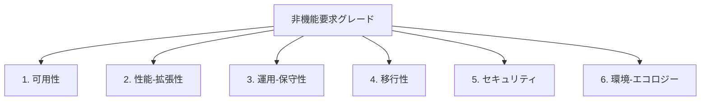

| 要素名 | 説明 |
|---|---|
| 可用性 | サービスを継続的に利用可能な状態に保つための要求 |
| 性能-拡張性 | ユーザ数やデータ増加に対するレスポンス耐性と将来の拡張能力に関する要求 |
| 運用-保守性 | 稼働時間確保、バックアップ方式、運用手順整備など継続的なサービス提供に必要な要求 |
| 移行性 | 旧システムの資産を新システムへ安全に移行する能力に関する要求 |
| セキュリティ | 機密情報へのアクセス制御と不正アクセス防止に関する要求 |
| 環境-エコロジー | サーバ設置環境の耐震性・温湿度管理・省エネ等の環境配慮に関する要求 |

### グレード表の構造

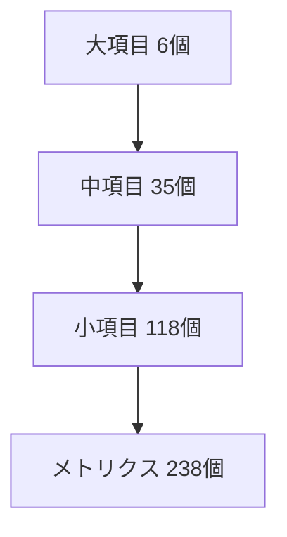

| 要素名 | 説明 |
|---|---|
| 大項目 | 非機能要求の6つのカテゴリ。最上位の分類単位 |
| 中項目 | 大項目を細分化した35の分類 |
| 小項目 | ユーザとベンダの間で合意する118の非機能要求項目 |
| メトリクス | 小項目を定量的に表現する238の指標。レベル0〜5の6段階で評価 |

### モデルシステムによる社会的影響度分類

グレード表は、システムの社会的影響度に応じた3種類の典型モデルシステムに対応しています。

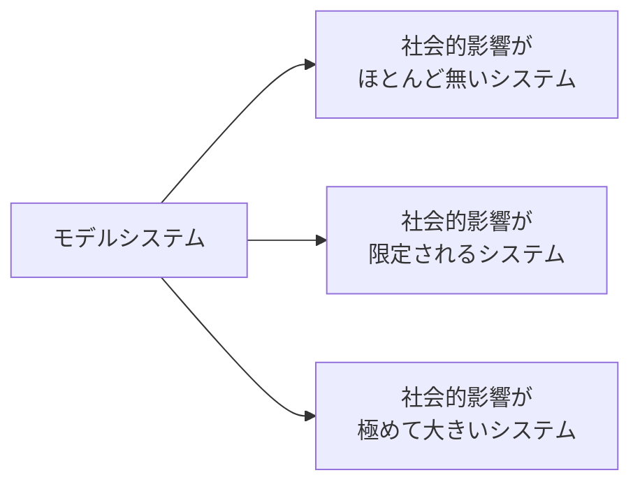

| 要素名 | 説明 |
|---|---|
| 社会的影響がほとんど無いシステム | 障害発生時の影響範囲が限定的なシステム |
| 社会的影響が限定されるシステム | 稼働率99.99%以上（年間1時間未満の停止）が目標となる中規模影響のシステム |
| 社会的影響が極めて大きいシステム | 災害情報配信システム等、広く公衆に影響を与えるシステム |

利用者はまず対象システムに最も近いモデルシステムを選定し、要求レベルの基準値とします。

### 段階的なレベル設定

各メトリクスはレベル0〜5の6段階で評価します。レベルが大きいほど実現の難易度と開発コストが高くなります。

| ステップ | 内容 |
|---|---|
| 1. モデルシステム選定 | 対象システムに最も近いモデルシステムを選定し、基準レベルを確認 |
| 2. 重要項目のレベル決定 | グレード表の重要項目（約100項目）について、品質とコストへの影響を考慮してレベルを決定 |
| 3. 全項目のレベル決定 | 項目一覧（200項目以上）を用いて、残りの項目のレベルを決定 |

### ツール群

非機能要求グレードは複数のドキュメントで構成されます。

| ツール名 | 内容 |
|---|---|
| 利用ガイド - 解説編 | 各項目の定義・解説を記載したリファレンス |
| 利用ガイド - 利用編 | グレード表・樹系図・項目一覧の使い方を説明した手順書 |
| 利用ガイド - 活用編 | プロジェクトへの適用方法と事例を解説したガイド |
| グレード表 | 3つのモデルシステムに対応する重要項目と要求レベルの一覧表 |
| 活用シート | グレード表と項目一覧をまとめた、プロジェクトごとにカスタマイズ可能なシート |
| 樹系図 | 大項目〜小項目の階層関係を俯瞰する図 |
| 研修教材 | 人材育成向けの学習素材 |

## 構造

### システムコンテキスト図

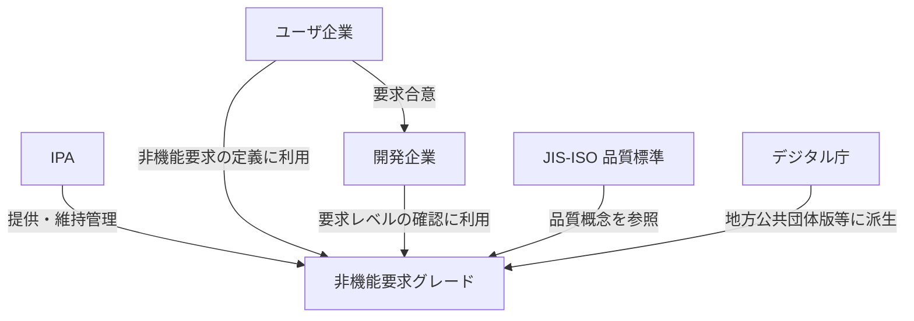

| 要素名 | 説明 |
|---|---|
| ユーザ企業 | システムを発注する企業。非機能要求の定義と合意に利用 |
| 開発企業 | システムを受注・開発する企業。要求レベルの確認と見積りに利用 |
| IPA | 独立行政法人情報処理推進機構。非機能要求グレードを開発・提供・維持管理 |
| 非機能要求グレード | ユーザ企業と開発企業の認識齟齬を防ぐためのツール群 |
| JIS-ISO 品質標準 | JIS X 25010 等のソフトウェア品質標準。品質概念の参照元 |
| デジタル庁 | 地方公共団体情報システム非機能要件の標準など、派生ガイドラインを策定する機関 |

### コンテナ図

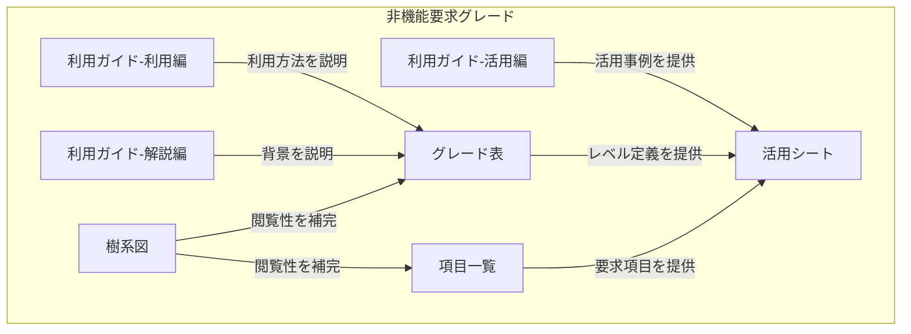

| 要素名 | 説明 |
|---|---|
| 利用ガイド-利用編 | 具体的な利用手順を解説するドキュメント |
| 利用ガイド-解説編 | 背景・目的・概念を解説するドキュメント |
| 利用ガイド-活用編 | 利用シーンに応じた活用事例・ヒントを提供するドキュメント |
| グレード表 | 3つのモデルシステムと主要な非機能要求項目の要求レベルを示す一覧表 |
| 項目一覧 | 非機能要求項目を体系化した一覧表 |
| 樹系図 | 要求項目の検討順を可視化した図 |
| 活用シート | グレード表と項目一覧をまとめたカスタマイズ可能なスプレッドシート |

### コンポーネント図

#### グレード表の内部構造

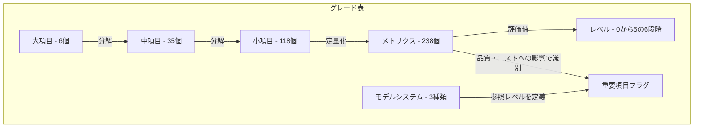

| 要素名 | 説明 |
|---|---|
| 大項目 - 6個 | A可用性、B性能・拡張性、C運用・保守性、D移行性、Eセキュリティ、Fシステム環境・エコロジー |
| 中項目 - 35個 | 大項目を機能別に細分した分類 |
| 小項目 - 118個 | ユーザと開発企業が合意する非機能要求の最小単位 |
| メトリクス - 238個 | 小項目を定量的に表現するための指標 |
| レベル - 0から5の6段階 | メトリクスを評価する段階。レベルが高いほど実現難易度と開発コストが高い |
| 重要項目フラグ | 品質やコストへの影響が特に大きいメトリクスを示す識別子 |
| モデルシステム - 3種類 | 社会的影響の大きさで分類した典型システム |

#### 活用シートの構成要素


| 要素名 | 説明 |
|---|---|
| 項目識別子 | 各メトリクスを一意に特定するための番号（例: A.1.1.1） |
| 大項目列 | 6つの大項目名を示す列 |
| 中項目列 | 35の中項目名を示す列 |
| 小項目列 | 118の小項目名を示す列 |
| メトリクス列 | 238のメトリクス名を示す列 |
| レベル列 - 0から5 | 各レベルの定義内容を示す列（0から5の6列） |
| 要求レベル記入欄 | プロジェクトの要求レベルを記入するための列 |
| 備考欄 | 追記事項や補足説明を記録するための列 |

#### 利用ガイド各編の構成要素

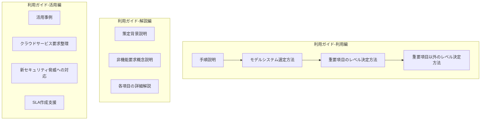

| 要素名 | 説明 |
|---|---|
| 手順説明 | 3段階適用手順を説明する節 |
| モデルシステム選定方法 | 3種のモデルシステムから適切なものを選ぶ方法を解説する節 |
| 重要項目のレベル決定方法 | 重要項目フラグが付いたメトリクスの要求レベルを決定する手順を解説する節 |
| 重要項目以外のレベル決定方法 | 重要項目以外のメトリクスの要求レベルを決定する手順を解説する節 |
| 策定背景説明 | 策定された経緯と目的を説明する節 |
| 非機能要求概念説明 | 非機能要求の定義と機能要求との違いを説明する節 |
| 各項目の詳細解説 | 大項目・中項目・小項目・メトリクスの意味と関係を解説する節 |
| 活用事例 | 利用シーンに応じた実践的な使い方の事例を示す節 |
| クラウドサービス要求整理 | クラウドサービス利用時の非機能要求整理に関する活用事例 |
| 新セキュリティ脅威への対応 | 新たなセキュリティ脅威に対する要求定義の活用事例 |
| SLA作成支援 | クラウドサービス提供者がSLAを作成する際の活用事例 |

## データ

### 概念モデル

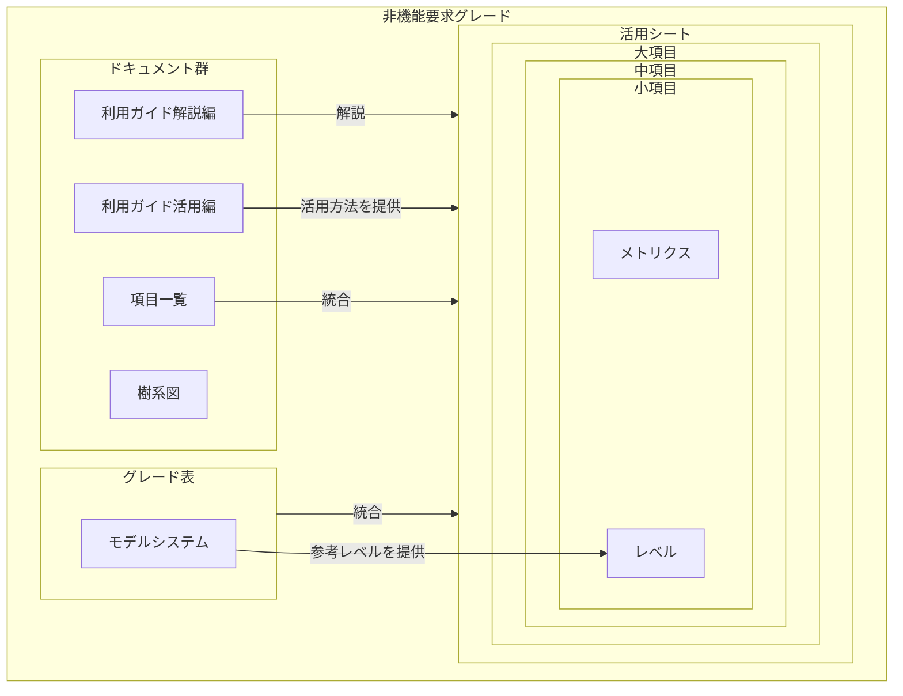

| 要素名 | 説明 |
|---|---|
| 非機能要求グレード | IPA が提供するフレームワーク全体 |
| 利用ガイド解説編 | 背景・仕様を解説するドキュメント |
| 利用ガイド活用編 | 活用シナリオに応じた使い方のヒントを提供するドキュメント |
| 項目一覧 | 非機能要求項目を網羅的にリストアップした一覧表 |
| 樹系図 | 6つの大項目ごとの階層構造を図示したドキュメント |
| グレード表 | 3つのモデルシステムと重要項目の要求レベルを対応付けた表 |
| モデルシステム | 社会的影響度による典型的なシステム分類（3種類） |
| 活用シート | 項目一覧とグレード表を統合したプロジェクト記入用スプレッドシート |
| 大項目 | 非機能要求の最上位分類（6項目） |
| 中項目 | 大項目を細分化した分類（35項目） |
| 小項目 | ユーザとベンダが合意する非機能要求の単位（118項目） |
| メトリクス | 小項目を定量的に表現するための指標（238項目） |
| レベル | メトリクスごとの要求水準（0〜5の6段階） |

### 情報モデル

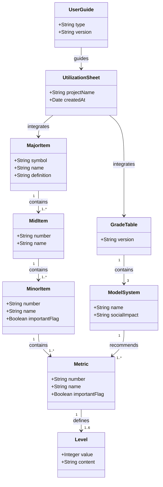

| 要素名 | 主要属性 | 説明 |
|---|---|---|
| MajorItem - 大項目 | symbol, name, definition | 非機能要求の最上位分類。記号はA〜F |
| MidItem - 中項目 | number, name | 大項目を細分化した分類。番号は「A.1」形式 |
| MinorItem - 小項目 | number, name, importantFlag | ユーザとベンダが合意する非機能要求の単位。番号は「A.1.1」形式 |
| Metric - メトリクス | number, name, importantFlag | 小項目を定量的に表現する指標。番号は「A.1.1.1」形式 |
| Level - レベル | value, content | メトリクスの要求水準。値は0〜5の整数 |
| ModelSystem - モデルシステム | name, socialImpact | 社会的影響度で分類した典型的なシステム。3種類 |
| GradeTable - グレード表 | version | 3つのモデルシステムと重要メトリクスの参考レベルを対応付けた表 |
| UtilizationSheet - 活用シート | projectName, createdAt | グレード表と項目一覧を統合したプロジェクト記入用ドキュメント |
| UserGuide - 利用ガイド | type, version | 利用編・解説編・活用編の3種類が存在するドキュメント |

### 大項目一覧

| 記号 | 名称 | 定義 |
|---|---|---|
| A | 可用性 | システムサービスを継続的に利用可能とするための要求 |
| B | 性能・拡張性 | システムの処理性能と将来の拡張に関する要求 |
| C | 運用・保守性 | システムの運用と保守のサービスに関する要求 |
| D | 移行性 | 現行システムからの資産移行に関する要求 |
| E | セキュリティ | 情報システムの安全性の確保に関する要求 |
| F | システム環境・エコロジー | システムの設置環境と環境負荷低減に関する要求 |

### 中項目一覧

| 大項目 | 中項目番号 | 中項目名称 |
|---|---|---|
| A 可用性 | A.1 | 継続性 |
| A 可用性 | A.2 | 耐障害性 |
| A 可用性 | A.3 | 災害対策 |
| A 可用性 | A.4 | 回復性 |
| B 性能・拡張性 | B.1 | 業務処理量 |
| B 性能・拡張性 | B.2 | 性能目標値 |
| B 性能・拡張性 | B.3 | リソース拡張性 |
| B 性能・拡張性 | B.4 | 性能品質保証 |
| C 運用・保守性 | C.1 | 通常運用 |
| C 運用・保守性 | C.2 | 保守運用 |
| C 運用・保守性 | C.3 | 障害時運用 |
| C 運用・保守性 | C.4 | 運用環境 |
| C 運用・保守性 | C.5 | サポート体制 |
| C 運用・保守性 | C.6 | その他の運用管理方針 |
| D 移行性 | D.1 | 移行時期 |
| D 移行性 | D.2 | 移行方式 |
| D 移行性 | D.3 | 移行対象 - 機器 |
| D 移行性 | D.4 | 移行対象 - データ |
| D 移行性 | D.5 | 移行計画 |
| E セキュリティ | E.1 | 前提条件・制約条件 |
| E セキュリティ | E.2 | セキュリティリスク分析 |
| E セキュリティ | E.3 | セキュリティ診断 |
| E セキュリティ | E.4 | セキュリティリスク管理 |
| E セキュリティ | E.5 | アクセス・利用制限 |
| E セキュリティ | E.6 | データ秘匿 |
| E セキュリティ | E.7 | 不正追跡・監視 |
| E セキュリティ | E.8 | ネットワーク対策 |
| E セキュリティ | E.9 | マルウェア対策 |
| E セキュリティ | E.10 | Web対策 |
| E セキュリティ | E.11 | セキュリティインシデント対応 |
| F システム環境・エコロジー | F.1 | システム制約・前提条件 |
| F システム環境・エコロジー | F.2 | システム特性 |
| F システム環境・エコロジー | F.3 | 適合規格 |
| F システム環境・エコロジー | F.4 | 機材設置環境条件 |
| F システム環境・エコロジー | F.5 | 環境マネージメント |

### モデルシステム一覧

| 名称 | 社会的影響度 | 例 |
|---|---|---|
| モデルシステム1 | 社会的影響がほとんど無い | 社内業務システム |
| モデルシステム2 | 社会的影響が限定される | 中規模サービスシステム |
| モデルシステム3 | 社会的影響が極めて大きい | 社会インフラシステム |

### レベル定義

| 値 | 意味 |
|---|---|
| 0 | 規定なし・最低水準 |
| 1 | 低水準 |
| 2 | 標準水準 |
| 3 | 高水準 |
| 4 | 非常に高い水準 |
| 5 | 最高水準（実現難易度・コスト最大） |

レベルの値が大きいほど、実現の難易度が高くなり、一般的に開発コストが増加します。

### 代表的なメトリクスとレベルの具体例

**A.1.1.1 運用時間（通常）- 可用性 > 継続性**

| レベル | 内容 | モデル1推奨 | モデル2推奨 | モデル3推奨 |
|:---:|---|:---:|:---:|:---:|
| 0 | 規定なし | | | |
| 1 | 定時内（9時〜17時） | ● | | |
| 2 | 夜間のみ停止（9時〜21時） | | | |
| 3 | 1時間程度の停止（9時〜翌8時） | | ● | |
| 4 | 若干の停止あり（9時〜翌8:55） | | | |
| 5 | 24時間無停止 | | | ● |

**A.1.2 サービス切替時間 - 可用性 > 耐障害性**

| レベル | 内容 | 構成例 |
|:---:|---|---|
| 1 | 24時間未満 | 故障部品交換 |
| 2 | 2時間未満 | 予備機への手動切替 |
| 3 | 60分未満 | コールドスタンバイ |
| 4 | 10分未満 | ホットスタンバイ |
| 5 | 60秒未満 | 両現用構成 |

**B.2.1 レスポンスタイム - 性能・拡張性 > 性能目標値**

| レベル | 内容 |
|:---:|---|
| 1 | 30秒以内 |
| 2 | 10秒以内 |
| 3 | 5秒以内 |
| 4 | 3秒以内 |
| 5 | 1秒以内 |

## 構築方法

### 入手方法

- IPA公式アーカイブページからZIPファイルを無料ダウンロード
- ダウンロード前に使用条件ページで利用規約を確認
- 日本語版・英語版・中国語版の3言語版を提供

| ファイル | サイズ | 内容 |
|---|---|---|
| 日本語版一括 ZIP | 9.7 MB | 本体 + 利用ガイド活用編 |
| 英語版一括 ZIP | 4.6 MB | 本体のみ |
| 中国語版一括 ZIP | 3.8 MB | 本体のみ |
| 研修教材 ZIP | 3.8 MB | 演習付き教材群 |

### 必要なツール

| ファイル形式 | 用途 | 改変 |
|---|---|---|
| Excel | 活用シートのカスタマイズ | 可 |
| PDF | グレード表・利用ガイドの参照 | 不可 |

### プロジェクトへの導入手順

1. IPA公式アーカイブページから日本語版 ZIP をダウンロード
2. 使用条件を確認し、プロジェクト内での利用ルールを決定
3. ZIP を展開し、ファイル構成を確認
4. プロジェクト用フォルダに活用シート（Excel）をコピー

```
非機能要求グレード2018/
├── 利用ガイド_利用編.pdf
├── 利用ガイド_解説編.pdf
├── 利用ガイド_活用編.pdf
├── グレード表.pdf / .xls
├── 項目一覧.pdf / .xls
├── 樹系図.pdf
└── 活用シート.xls
```

### 活用シートのセットアップ方法

- ZIP 内の `活用シート.xls` をプロジェクト用にコピー
- シート内の「プロジェクト名」「システム名」「作成日」セルを記入
- モデルシステムの推奨レベル列を参照列として残し、プロジェクト固有の要求レベル列を追加
- 対象外の項目には「対象外」と記入し、その理由を備考欄に記録

```
活用シート（Excel）の基本列構成
┌────────────┬────────┬───────────────────┬────────────┬────────────┬──────┐
│ 要件ID     │ 小項目 │ メトリクス        │ モデルレベル│ 採用レベル │ 備考 │
└────────────┴────────┴───────────────────┴────────────┴────────────┴──────┘
```

### グレード表のカスタマイズ方法

- Excel 形式のグレード表はプロジェクト要件に応じて改変可能
- 改変後も著作権表示 `(c) 2010-公開年 情報処理推進機構` を維持
- 不要な項目行は削除せず非表示にする（削除すると追跡が困難になるため）
- プロジェクト固有のメトリクスを追加する場合は、既存行の下に追記
- 改変版を配布する場合、使用条件ドキュメントを必ず同梱

## 利用方法

### モデルシステムの選定方法

システムの社会的影響度を判断基準として3つのモデルから1つを選定します。

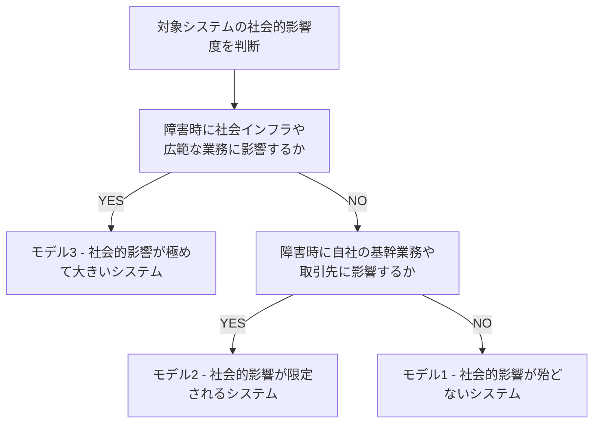

| 要素名 | 説明 |
|---|---|
| 対象システムの社会的影響度を判断 | 選定の起点。障害発生時の影響範囲を評価 |
| モデル3 | 金融・インフラ・行政システムなど広域影響を及ぼすシステム |
| モデル2 | 基幹業務システムなど自社・取引先に限定して影響するシステム |
| モデル1 | 影響が社内の一部に留まる情報系・管理系システム |

### グレード表の読み方・使い方

グレード表は6大項目・35中項目・118小項目・238メトリクスで構成されます。

| 構成要素 | 件数 | 説明 |
|---|---|---|
| 大項目 | 6 | 可用性・性能・運用保守性・移行性・セキュリティ・システム環境 |
| 中項目 | 35 | 大項目を細分化した区分 |
| 小項目 | 118 | ユーザとベンダ間で合意する要求単位 |
| メトリクス | 238 | 小項目を定量的に表現する指標 |

- レベルは 0〜5 の6段階で表示
- 数値が大きいほど実現難易度とコストが高い
- 各モデルシステムの推奨レベルはグレード表に列として記載
- レベルはあくまでも難易度の参考値であり、要件定義の完成形ではない

```
グレード表の列構成イメージ
┌──────┬──────┬──────────┬──────────────────────┬────────┬────────┬────────┐
│大項目│中項目│ 小項目   │ メトリクス           │ モデル1│ モデル2│ モデル3│
├──────┼──────┼──────────┼──────────────────────┼────────┼────────┼────────┤
│可用性│継続性│稼働時間  │ システム稼働時間/日  │  Lv.1  │  Lv.3  │  Lv.5  │
└──────┴──────┴──────────┴──────────────────────┴────────┴────────┴────────┘
```

### 活用シートを使った非機能要求の合意プロセス

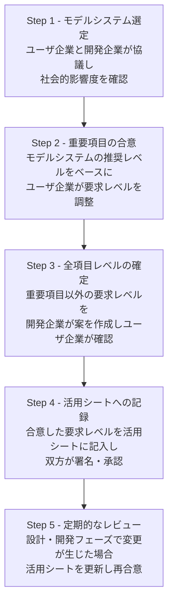

| 要素名 | 説明 |
|---|---|
| Step 1 - モデルシステム選定 | ユーザ企業が主体となり、社会的影響度を判断 |
| Step 2 - 重要項目の合意 | 予算・スケジュール制約を踏まえてレベルを調整 |
| Step 3 - 全項目レベルの確定 | 開発企業がドラフトを作成し、ユーザ企業が承認 |
| Step 4 - 活用シートへの記録 | 合意内容を活用シートに記録し、双方の認識齟齬を防止 |
| Step 5 - 定期的なレビュー | 要件変更時は活用シートを更新し、再合意を取得 |

### ユーザ企業と開発企業間でのグレード表活用フロー

| フェーズ | ユーザ企業の役割 | 開発企業の役割 |
|---|---|---|
| モデル選定 | 社会的影響度を判断し、モデルを承認 | モデルシステムの説明資料を提示 |
| 重要項目確認 | 業務上の優先度を伝え、レベルを承認 | 推奨レベルと技術的実現性を説明 |
| 全項目確定 | 全項目のレベルを確認し承認 | 全項目のドラフトを作成して提示 |
| 要件書化 | 最終版を承認・署名 | 活用シートを要件定義書に組み込み |

### 段階的な要求レベルの設定方法

1. 選定したモデルシステムの推奨レベルを初期値として活用シートに転記
2. 事業責任者にシステムの業務優先度をヒアリング
3. ヒアリング結果に基づき重要項目のレベルを上下に調整
4. 予算・スケジュール制約とトレードオフを検討し、レベルを確定
5. 重要項目以外の項目は開発企業が推奨レベルのままドラフトとして提示
6. ユーザ企業と開発企業が全項目をレビューし、最終レベルを確定

### 重要項目の絞り込み方法

- 活用シートの「重要項目」フラグ列を使い、品質・コストへの影響度が高い項目を特定
- グレード表で重要項目としてマークされた項目（約100項目）を優先的に議論
- 全238メトリクスを一度に議論せず、重要項目から順に合意を推進
- 対象システムのビジネス特性（高可用性要求・セキュリティ規制等）に応じて追加の重要項目を設定
- 検討不要と判断した項目には「対象外」と記入し、理由を備考欄に残す

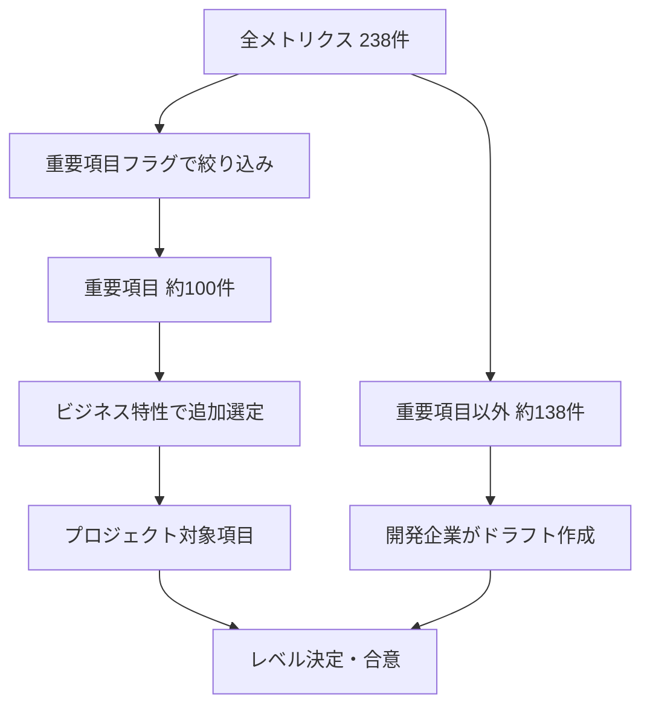

| 要素名 | 説明 |
|---|---|
| 全メトリクス 238件 | 活用シートに含まれる全非機能要求指標 |
| 重要項目フラグで絞り込み | グレード表の重要項目列を使い優先対象を特定 |
| 重要項目 約100件 | ユーザ企業と開発企業が優先的に議論する対象 |
| ビジネス特性で追加選定 | 業種・規制・システム特性に応じて項目を追加 |
| プロジェクト対象項目 | 最終的にレベル決定を行う項目の集合 |
| 重要項目以外 約138件 | 開発企業がドラフトを作成し、ユーザ企業が確認 |

## 運用

### プロジェクトライフサイクルにおける位置づけ

非機能要求グレードは、プロジェクト全フェーズで参照する基準として機能します。非機能要件に関するアーキテクチャ上の決定は、プロジェクト中期以降に変更すると手戻りが大きくなるため、プロジェクト初期での確定が必須です。

| フェーズ | 活用内容 |
|---|---|
| 要件定義 | モデルシステム選定・グレード決定・合意形成 |
| 基本設計 | 決定したグレードをアーキテクチャ設計の根拠として参照 |
| 詳細設計 | 各項目の達成基準を設計仕様書に記述 |
| テスト | 定義したレベルを検証基準として性能・セキュリティ試験を実施 |
| 運用保守 | SLA監視・定期見直しの基準として活用 |

### 要件定義フェーズでの活用タイミング

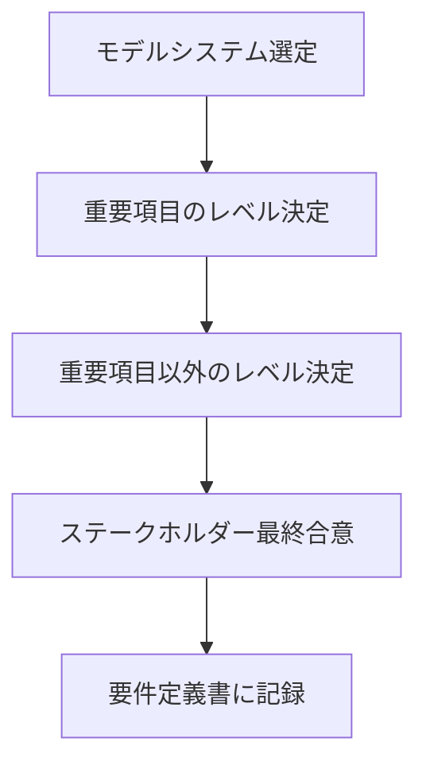

| 要素名 | 説明 |
|---|---|
| モデルシステム選定 | 社会的影響度に応じて3つのモデルから選択し、初期グレードを決定 |
| 重要項目のレベル決定 | 品質・コストへの影響が大きい重要項目から優先してレベルを設定 |
| 重要項目以外のレベル決定 | 残る100以上の項目について、予算・技術的実現性を考慮してレベルを設定 |
| ステークホルダー最終合意 | すべての項目を総なめして最終合意を取得 |
| 要件定義書に記録 | 合意内容を文書化し、関係者全員が参照できる状態にする |

### 設計・テストフェーズでの活用方法

**設計フェーズ:**
- 決定したグレードをアーキテクチャ選定の根拠として記録
- セキュリティレベルはネットワーク構成・認証方式の設計根拠に使用
- 可用性レベルは冗長構成・バックアップ設計の根拠に使用
- 設計書に「グレード表のどの項目・レベルに対応するか」を明記

**テストフェーズ:**
- 定義したメトリクスをテスト合格基準として使用
- 性能試験では「レスポンスタイム○秒以内」などのグレード値をそのまま合否判定に適用
- セキュリティ試験は設定したセキュリティグレードに基づいて試験項目を決定
- テスト結果が要求グレードを満たさない場合は設計に差し戻し

### 非機能要求の変更管理

非機能要件は要件定義後も変更が発生します。

- 変更要求にはグレード表の項目・レベルの変更箇所を明記
- 変更がアーキテクチャ・コスト・テスト計画に与える影響を評価してから承認
- 変更履歴をグレード表と要件定義書の両方に記録
- 変更承認後は関係する設計書・テスト仕様書を連動して更新

### 定期的な見直しプロセス

要件定義書に記録したグレードは、以下のタイミングで見直します。

- **フェーズ完了時**: 次フェーズの作業開始前に、前フェーズでの変更・判明事項をグレードに反映
- **インシデント発生時**: 障害や性能劣化が発生した場合、原因となったグレード設定を見直し
- **定期レビュー**: 運用開始後1年ごとに、実績データとグレード目標値を照合して乖離を確認

### プロジェクト規模別の活用方法

| 規模 | 人数目安 | 推奨アプローチ |
|---|---|---|
| 小規模 | 29名以下 | 6大項目の重要項目に絞って定義。全118小項目の網羅は省略可 |
| 中規模 | 30〜99名 | 重要項目を全件定義し、その他項目は業務影響度で取捨選択 |
| 大規模 | 100名以上 | 全項目を定義。関連システム間の標準化にグレード表を基準として使用 |

小規模プロジェクトで全238メトリクスを均一に確認することは現実的ではありません。モデルシステムのデフォルトグレードを活用して作業量を削減します。

## ベストプラクティス

### 効果的な非機能要求の合意形成方法

合意形成は「重要項目 → その他項目 → 最終総確認」の順で段階的に進めます。

- 合意形成の起点を重要項目に限定し、議論の焦点を絞る
- 各項目にメトリクス（定量的指標）を必ず添付し、曖昧な合意を回避
- 「稼働率99.9%」のような具体的な数値で合意を取得
- 合意内容は都度文書に記録し、口頭確認のみで進めない
- 事業責任者など意思決定権を持つキーマンの承認を必ず取得

### モデルシステム選定のコツ

モデルシステムの選定はグレード全体の初期値を決定するため、慎重に行います。

- 業務の社会的影響度（金融・医療・公共など）を最初の判断軸に使用
- システム停止時のビジネス損失規模を定量化してから選定
- 迷った場合は影響度が高いモデルを選び、後から緩和する方向で調整
- モデル選定の根拠を選定時の議事録に記録

### ステークホルダーとのコミュニケーション方法

- グレード表を直接提示するより先に、業務への影響シナリオで説明（例: 「システムが1時間停止すると売上○○円の損失が発生します」）
- 図や表を活用して要件レベルを視覚化し、技術用語の理解ギャップを解消
- ユーザ企業側と開発企業側の担当者が同じグレード表を参照しながら確認
- 技術的な背景知識がないステークホルダーには、レベル差によるコスト・リスクの差異を具体例で提示

### 段階的な導入アプローチ

全項目を一度に導入することが組織的に難しい場合は、以下の順序で段階的に展開します。

1. パイロットプロジェクトで重要項目のみ適用し、成果を確認
2. 成果が確認できたら、関連システムへ適用範囲を拡大
3. 組織内で標準グレードを定め、プロジェクトごとのカスタマイズルールを整備
4. グレード表をプロジェクト標準テンプレートとして管理し、継続的に更新

### 他のフレームワークとの併用

非機能要求グレードは IT システム構築向けのフレームワークです。目的に応じて他の標準と組み合わせます。

| フレームワーク | 役割 | 併用方法 |
|---|---|---|
| 非機能要求グレード | 要求レベルの段階的定義・合意形成 | 主要フレームワークとして使用 |
| ISO 25010 | ソフトウェア品質特性の定義 | 品質特性の定義チェックリストとして使用し、グレード表の項目網羅性を補完 |
| RASIS | 信頼性・可用性・保守性・完全性・安全性の評価指標 | テストフェーズの合否基準として非機能要求グレードの可用性項目と対応付け |
| SLA/SLO | 運用段階の合意基準 | グレードで定めた数値を SLA/SLO の指標値として転用 |

## トラブルシューティング

### よくある失敗パターンと対策

| 失敗パターン | 原因 | 対策 |
|---|---|---|
| メトリクス選択を要件定義と同一視 | グレード表の数値選択を完結した定義と誤解 | 小項目ごとに文章で具体的な要件を記述し、メトリクスは補足指標として扱う |
| 非機能要件を後回しにする | 機能要件が優先されて検討が遅れる | 要件定義フェーズの開始時にグレード検討を計画に組み込む |
| 全項目を均一に高グレードにする | 過大要求が当然と判断される | 各項目のコスト・ユーザビリティへの影響を評価し、必要十分なレベルに留める |
| 口頭のみで合意する | 議事録・文書化を省略 | 合意内容をグレード表と要件定義書に必ず記録し、関係者の署名を取得 |
| 要件定義後に変更しない | 環境変化やインシデントを無視 | 定期レビューとインシデント対応時のグレード見直しプロセスを事前に定める |

### ユーザ企業と開発企業の認識齟齬の解消方法

認識齟齬の主な原因は「ユーザ企業が非機能要件を当たり前品質として無意識に期待する」一方、「開発企業がその期待を把握できない」点にあります。

**典型的なインシデント例:**

| ケース | ユーザ企業の認識 | 開発企業の認識 | 結果 |
|---|---|---|---|
| 運用時間の齟齬 | 「24時間使えるのが当然」 | 「平日日中のみ」で設計 | 夜間バッチ処理中にサービス停止が発生 |
| 性能要求の齟齬 | 「レスポンスが速い」= 3秒以内 | 「レスポンスが速い」= 10秒以内 | 本番稼働後に性能改善が必要になった |

これらはグレード表で定量的に合意していれば防止できたケースです。

**対策:**
- 要件定義の開始時にグレード表をユーザ・開発双方で同時に参照しながら確認
- 「〇秒以内」「稼働率○○%」など定量的な指標で合意し、解釈の違いを排除
- ユーザ企業の担当者に業務目線で「システムが使えない時間の許容範囲」を具体的に回答してもらい、その回答をグレードに変換する手順を採用
- 地方公共団体など発注経験が少ない組織には、地方公共団体版利用ガイドなど業種別の特化版を活用

### 要求レベルの過大・過小設定の回避方法

**過大設定の回避:**
- グレードを上げるとコスト・運用負荷・ユーザビリティにどう影響するかを具体金額・工数で提示
- セキュリティグレードを過度に上げると認証手順の増加でユーザビリティが低下することを事前に説明
- 「理想」ではなく「必要十分」を設定基準とすることをステークホルダーと合意

**過小設定の回避:**
- モデルシステムのデフォルトグレードを下限として扱い、理由なき引き下げを禁止
- 業務停止時の損失シナリオを提示し、ユーザ企業がリスクを具体的に認識できるようにする
- 類似システムの障害事例や性能問題の事例を参考資料として共有

### グレード表の項目が多すぎる場合の対処法

大項目6・中項目35・小項目118・メトリクス238という項目数に対して、以下の絞り込み手順を適用します。

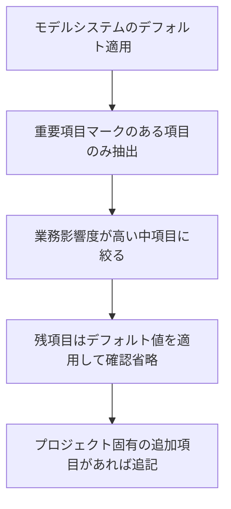

| 要素名 | 説明 |
|---|---|
| モデルシステムのデフォルト適用 | 選定したモデルシステムのデフォルトグレードをすべての項目に設定 |
| 重要項目マークのある項目のみ抽出 | グレード表で「重要項目」と印が付いた項目のみを合意確認の対象にする |
| 業務影響度が高い中項目に絞る | 対象システムの業務特性に照らして、特に重要な中項目を追加選択 |
| 残項目はデフォルト値を適用して確認省略 | 重要でない項目はデフォルト値を採用し、省略理由を記録 |
| プロジェクト固有の追加項目があれば追記 | グレード表に含まれない要求事項はカスタム項目として追記 |

### 非機能要求の優先順位付けの困難さへの対処

優先順位付けが難しい主な原因は、複数の項目が相互に影響し合い、どれが重要かを単独では判断できない点にあります。

- 優先順位の評価軸を「プロジェクト目標への重要度」「システム全体への影響度」「技術的実現可能性」の3軸で評価
- 3軸を5段階でスコアリングし、合計点で優先順位を決定する簡易マトリクスを活用
- 評価結果が拮抗する場合は、コスト増加を伴う項目を後回しにして早期に低コスト項目の合意を固める
- 優先順位の判断根拠を記録し、後工程での「なぜこのレベルにしたか」の問いに対応

## まとめ

非機能要求グレードは、IPA が提供するフレームワークであり、6大項目・238メトリクス・3つのモデルシステムにより、ユーザ企業と開発企業の間で非機能要求の認識齟齬を防ぎながら段階的にレベルを合意するための実践的なツール群です。既存の品質標準（ISO 25010 等）が「何を」定義すべきかを示すのに対し、非機能要求グレードは「どのレベルで」合意するかを段階的に導くフレームワークである点に独自の価値があります。要件定義フェーズでの早期導入と、重要項目からの段階的な合意形成が成功の鍵です。

この記事が少しでも参考になった、あるいは改善点などがあれば、ぜひリアクションやコメント、SNSでのシェアをいただけると励みになります！

## 参考リンク

- 公式ドキュメント
  - [非機能要求グレード | IPA 独立行政法人 情報処理推進機構](https://www.ipa.go.jp/archive/digital/iot-en-ci/jyouryuu/hikinou/index.html)
  - [システム構築の上流工程強化（非機能要求グレード）紹介ページ | IPA](https://www.ipa.go.jp/archive/digital/iot-en-ci/jyouryuu/hikinou/ent03-b.html)
  - [非機能要求グレード本体（日本語版）使用条件 | IPA](https://www.ipa.go.jp/archive/digital/iot-en-ci/jyouryuu/hikinou/ent03-b-1.html)
  - [非機能要求グレード2018 改訂情報 PDF | IPA](https://www.ipa.go.jp/archive/digital/iot-en-ci/jyouryuu/hikinou/ps6vr700000077he-att/000066170.pdf)
  - [非機能要求グレード 地方公共団体版 利用ガイド PDF](https://www.j-lis.go.jp/data/open/cnt/3/1023/1/2_guide.pdf)
- GitHub
  - [非機能要求グレード 2018 早見表 | GitHub Gist](https://gist.github.com/bobbyjam99-zz/88a804f9224b92197907d96fcd0f482e)
  - [aws-hikinou-grade | GitHub](https://github.com/yamazoon0207/aws-hikinou-grade)
- 記事
  - [非機能要求グレードの歩き方 Index | Zenn/NTTデータ](https://zenn.dev/nttdata_tech/articles/c16414c86883cb)
  - [非機能要求グレードの使い方についてまとめてみた | Zenn](https://zenn.dev/kkou/articles/77d10c0094a002)
  - [非機能要件の進め方 | Zenn](https://zenn.dev/conecone/articles/647cd54ac1e30e)
  - [IPA 非機能要件定義 | Zenn](https://zenn.dev/nakashi94/scraps/1d48602316dedb)
  - [IPA非機能要求グレードを基にした活用プロセス解説 | IT調達ナビ](https://gptech.jp/articles/system-ipa-guide/)
  - [はじめての非機能要件定義 IPA非機能要求グレード活用解説](https://chaki-study.com/non-functional-requirements/)
  - [非機能要求グレードとは？6つのカテゴリと非機能要件を定義するポイント | Qbook](https://www.qbook.jp/column/741.html)
  - [非機能要件を定義するまでの道 | Qiita](https://qiita.com/suda_imagitech/items/b805c099f10b78701964)
  - [IPA非機能要求グレードで整理する非機能要件定義の進め方 | Yapodu Tech Blog](https://blog.yapodu.co.jp/entry/2025/05/12/094914)
  - [ソフトウェアテスト観点からの非機能要件 | SHIFT](https://service.shiftinc.jp/column/8639/)
