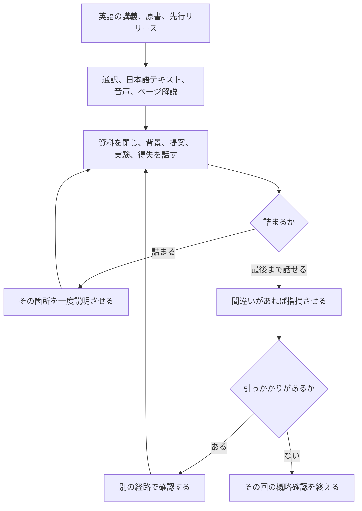

岩瀬義昌さん（iwashi）が 2026年10月1日に公開した「[AI時代の勉強法(2026)](https://iwashi.co/2026/10/01/how-to-study-in-ai-era)」は、生成AIを使った個人の勉強手順を書いた文章です。
この記事では、その手順を整理したうえで、手順の各段を学習科学の実験と製品の公式ヘルプに突き合わせます。
読み終えると、どの段を自分の勉強に取り入れてよく、どの段に条件が付くかを判断できます。
製品の仕様と価格は、2026年10月2日に公式ページで確認した値です。

*この記事の全体像。以下、順に解説します。*

## 「AI時代の勉強法(2026)」とは

### 概要

この文章は、著者自身の勉強手順を「2026年のスナップショット」として書いたものです。
来年には手順が変わっているかもしれない、と著者は書いています。
本文は誤字脱字の確認以外に生成AIを使わず、手でタイプしたそうです。
短い版は 2026年9月29日の [X の投稿](https://x.com/iwashi86/status/2105047465158459631) にあり、この文章はそれを掘り下げたものです。

中心にあるのは次の観察です。

- 生成AIで、学びの入口は速くなった
- 一方で「わかった気」になりやすくなった
- 確認法は、何も見ずに内容を説明できるかどうか

著者はこの確認法をファインマンテクニックと呼んでいます。

### インプットの経路

| 経路 | 生成AIの使い方 |
| --- | --- |
| 英語の講義動画（例: Stanford の CS336 Language Modeling from Scratch） | 隣に置いた GPT-Live で逐次通訳する。または、分からない箇所だけ止めて質問する |
| YouTube の文字起こしと講義 PDF | 読み込ませて自分用の日本語解説を作り、予習か復習でざっと読む |
| 授業内容の音声化 | NotebookLM で対談形式の音声にし、概略を聞く。メタファーで分かりにくくなることもある |
| 一般書 | 該当ページを写真にして ChatGPT に噛み砕かせ、分からない箇所を往復する |
| ビジネス書 | さらっと読むので、生成AIはあまり使わない |
| O'Reilly の学習プラットフォーム | 技術書を読み放題にし、英語の先行リリースを先に読む。変化の速い分野は英語の方がよいという理由 |

### アウトプットの型と手順

アウトプットは、手が塞がる時間に GPT-Live へ口頭で話すことです。
説明の型は次の4項目です。

1. 背景
2. 課題を解く提案
3. 実験結果（無いこともある）
4. その得失

何も見ずにこの型で話せれば、実装できるかは別として、概略は理解できている可能性が高い、と著者は書きます。
出てこなければ、わかった気になっているだけだ、とも書きます。
例として、SGD は現在の勾配だけで更新し、Momentum はこれまでの方向も使う、という対比を挙げています。

口頭の手順は4段です。

1. これから説明するので、間違いがあれば教えて、と頼む
2. 詰まったら、その箇所を調べて教えて、と頼む
3. 最初に戻って、自分で話し直す
4. 最後まで話せても、間違いがあれば教えて、と再度頼む

勉強会での登壇とブログ執筆も、同じ確認の別の出口として挙がっています。
著者は Mixture of Experts のメモを書いたとき、Auxiliary Load Balancing Loss の論理が曖昧になって書き直したそうです。
脚注には、生成AIの返答に引っかかりがあれば、別の経路で真偽を確認する、とあります。

### 全体の流れ

手順を一周の流れにすると、次のとおりです。

勉強会とブログは、口頭説明と並ぶ別の出口です。

## 注意点

### 個人の手順であり、効果を測った実験ではない

- 「概略は理解できている可能性が高い」は、著者自身の合格ラインです
- 口頭で話せることと実装できることは、著者自身が分けています

### 「ファインマンテクニック」は通称

- 本文のリンク先は Wikipedia の Learning by teaching で、Jean-Pol Martin の Lernen durch Lehren（教えることで学ぶ）を説明しています
- Richard Feynman がこの4項目の手順を論文にした、という一次資料は確認できていません

### 「わかった気」が減ることは、得点が上がることではない

[Rozenblit と Keil（2002）](https://doi.org/10.1207/s15516709cog2605_1) は、装置の仕組みを説明させると、自分の理解度の自己評価が下がることを示しました。
説明の錯覚（illusion of explanatory depth）と呼ばれる現象です。

- Study 2 は Yale の学部生33人。自己評価（7件法）は 3.89 → 3.10 → 2.49 → 2.62 と推移しました
- 示されたのは自己評価の低下であり、再テストの得点上昇ではありません
- 普及記事で見かける「7が3に落ちた」という整数は、論文の表にはありません

[Silk-Eglit と Kurtz（2011）](https://escholarship.org/uc/item/582378mf) は、最初の評定が機能や用途を見ていて、後の評定が機構を見ている、という取り違えが低下の一部だと論じています。
いずれにしても、口頭で説明して自信が下がったことは、成績が上がった証拠になりません。

### 製品の名前と上限は変わり得る

2026年10月2日に公式ヘルプで確認した内容です。

| 製品 | 確認できたこと |
| --- | --- |
| NotebookLM | 英語ヘルプでの名称は Gemini Notebook。アップグレードのヘルプは Audio Overviews を Standard 3回/日、Plus 6回/日、Pro 20回/日などと書き、2026年9月2日から上限が変わると注記する。別のヘルプは、同日から計算量ベースの上限になり 5時間ごとに枠が戻ると書く。どちらが現行かは、二つのヘルプだけでは決まらない |
| ChatGPT Voice（GPT-Live） | Live は動画と画面共有に対応しない。別端末の講義音声を逐次通訳できるかは書かれていない。直近24時間の利用枠は Plus が GPT-Live-1 で3時間、Go が GPT-Live-1 mini で3時間、Pro（月100米ドル）が15時間、Pro（月200米ドル）が無制限。「ChatGPT can make mistakes」と明記し、音声の文字起こしは逐語ではないとも書く |
| O'Reilly | early release は「執筆中の本を一般公開前に読める」という定義で、「日本語訳より先」とは書いていない。収録数はページにより 60,000超〜75,000超と揃っていない。日本語の料金ページの個人プランは月49米ドル、3か月129米ドル、年499米ドル |

### CS336 は「動画を見る授業」ではない

[CS336 の公開サイト](https://cs336.stanford.edu/)（Spring 2026）の記述は次のとおりです。

- 実装量の多い5単位の授業。課題1でトークナイザ、モデル、オプティマイザを実装し、小さい言語モデルを学習する
- LLM への質問は低レベルのプログラミングか言語モデルの高レベルの概念に限り、課題を直接解かせることは禁止
- 課題中はオートコンプリートを切ることを強く勧める
- 「資料が全部ある」とは書いていない（ゲスト講義の教材欄は空）

[Stanford Online の科目ページ](https://online.stanford.edu/courses/cs336-language-modeling-scratch) は、単位履修の授業料を 7,875.00米ドルと書き、2026年10月2日時点で募集していません。
単位履修と、公開サイトの視聴は別物です。

### その他

- 本文で触れられている SFC-GC について、リンク先の[慶應 SFC のページ](https://www.keio.ac.jp/ja/sfc/engagement/extended-education/)は「インターネット講義配信（現在事情によりサービス停止中）」と書くだけで、「SFC-GC」という名称や停止日は載っていません
- GPT-Live や Advanced Voice を、対照群つきの成績試験で評価した論文は見つかっていません。見つかっていないことは、存在しないことではありません

## 手順の各段は、実験で何が言えるか

手順の各段に近い実験と、そこから言えることの対応です。

| この勉強法の段 | 近い実験が測っているもの | そのまま言えること |
| --- | --- | --- |
| 何も見ずに4項目を話す | 散文を読んだあとの自由再生 | 遅延の再生では、再読より想起練習が残ることがある |
| 口頭で話せたことを理解の合格ラインにする | 別形式への転移、回路の故障診断 | 再生の成功は、別問題の正答を保証しない |
| 滑らかな音声や噛み砕きを予習にする | 話し方の流暢さ、検索と LLM の比較、要約 | 「学べた感じ」は先に動きやすい。知識の深さは別の指標で落ちることがある |
| 詰まった箇所を説明させる | 答えを渡す対話と、ヒントに限った対話 | 答えを渡すと直後の類似問題が落ちることがある。ヒントに限るとその低下が消えた例がある |
| GPT-Live の指摘を最終確認にする | 製品ヘルプの誤り注意 | ヘルプは確認を求めている。著者の脚注も別経路での確認を書いている |

### 資料を閉じて話すことは、遅れて効く

[Roediger と Karpicke（2006）](https://doi.org/10.1111/j.1467-9280.2006.01693.x) は、大学生に科学の散文を読ませ、フィードバックなしで思い出して書かせました。

| 経過時間 | 再学習（読み直し） | テスト（思い出す） |
| --- | --- | --- |
| 5分後 | 81% | 75% |
| 2日後 | 54% | 68% |
| 1週間後 | 42% | 56% |

- 直後だけ見ると、読み直しの方が成績が高い
- 1日以上空くと、思い出す練習の方が残る
- 5分後に「よく覚えている」と予測したのは、読み直しの多い群でした

つまり「閉本で話す」は、その場の手応えは小さくても、後に残りやすい練習です。
ただし材料は短い散文の再生であり、プログラムの実装ではありません。

一方で、問題解決では逆の結果もあります。
[van Gog と Kester（2012）](https://doi.org/10.1111/cogs.12002) は電気回路の故障診断で、例題だけを学び直す群が、例題と問題解決を交互にする群を1週間後に上回ったと報告しています（d = 0.66）。
Pan と Rickard（2018, *Psychological Bulletin*）のメタ分析は、テスト効果が別形式に転移する効果を d = 0.40 とまとめ、worked example（解き方の例題）への転移は弱い側に置いています。
講義を再生できることが、別の実装問題に解けることへ移る、とまでは言えません。

教えることそのものの研究もあります。

- [Fiorella と Mayer（2013）](https://doi.org/10.1016/j.cedpsych.2013.06.001): ビデオ講義として教えた群が、直後 d = 0.82、1週間後 d = 0.79 で統制群を上回った。教える準備だけの群は1週間後 d = 0.24 にとどまった（抄録より）
- [Koh、Lee、Lim（2018）](https://doi.org/10.1002/acp.3410): 1週間後の理解で、ノートなしの説明と想起練習が、ノートありの説明を上回った（抄録より）
- Sibley、Fiorella、Lachner（2022）: ノートなしの口頭説明は、再学習に対して保持・図・転移のどれでも勝たなかった（抄録より）

教える効果の中身は「思い出すこと」に近い、という読みが成り立ちます。
ただし、聞き手は録画や人であり、LLM ではありません。

### 滑らかな説明は「学べた感じ」を先に動かす

[Carpenter ら（2013）](https://doi.org/10.3758/s13423-013-0442-z) は、同じ65秒の説明を、流暢な話し方と非流暢な話し方で見せました。

- 流暢な方が「よく覚えられる」という予測が高かった（d = 1.03）
- 実際の再生には差が無かった

NotebookLM の音声そのものの実験ではありません。
それでも、滑らかな説明で学べた感じが先に動くという点は、著者の「わかった気」の懸念に当たります。

[Melumad と Yun（2025）](https://doi.org/10.1093/pnasnexus/pgaf316) は、助言文を書く前の調べ方をウェブ検索と ChatGPT で比べました（参加者は約1万人）。

- ChatGPT 群は結果を見る時間が短かった（585秒 対 Google 742秒）
- 新しく学んだことの自己報告は、ChatGPT 群が少なかった
- 書いた助言は短く、固有の情報が少なく、互いに似ていた
- 受け手は、AI 経由の助言をより役立たないと評定した

ここで浅くなったのは、自己報告と助言の中身です。
「わかった気が増えた」とは、この研究からは言えません。

要約の効き方は、読者の力量で逆になります。
[Etkin ら（2025）](https://doi.org/10.3389/feduc.2025.1506752) は、ACT の文章を GPT-4 の要約に置き換えました。

| 読者 | 原文 → 要約の直後クイズ |
| --- | --- |
| 低成績者 | 44.9% → 55.4%（上がった） |
| 高成績者 | 82.5% → 66.5%（下がった） |

低成績者では、ソクラテス式の問いかけの方が要約より効果が大きかった（d = 0.86）とも書いています。
「LLM の要約は常に浅い」とは言えませんが、原文を読める人が要約で本文を代替するのは避けた方がよさそうです。

[Fan ら（2025）](https://doi.org/10.1111/bjet.13544) は、ESL の作文で ChatGPT 群のエッセイ改善が大きかった一方、知識の獲得と転移には有意差が無かったと報告しています。

### 答えを渡す対話は、支援を外すと響く

[Bastani ら（2025）](https://doi.org/10.1073/pnas.2422633122) は、トルコの高校数学で約1,000人を比べました。

| 条件 | 練習中の成績（対照比） | 支援を外した試験（対照比） |
| --- | --- | --- |
| GPT Base（答えも出す） | +48% | −17% |
| GPT Tutor（ヒントに限る） | +127% | 有意差なし |

- 「答えは何か」への GPT Base の応答は、正解 51%、論理の誤り 42%、計算の誤り 8% でした
- −17% は、答えを渡す対話の直後に似た問題を一人で解いた、一つの高校数学の数字です

同じ方向の報告として、Liu らのワーキングペーパー（[DOI 10.26300/y3f8-vh05](https://doi.org/10.26300/y3f8-vh05)）は、メリーランド大学でコース組込みの GPT-4o を教員単位で割り当て、同一科目の標本で最終成績が約 −0.37 SD だったと書きます。
ただし最終成績は AI 無しの独立試験ではなく、査読前の論文です。

逆に、支援を外したあとも成績が上がった報告もあります。

- [Kestin ら（2025）](https://doi.org/10.1038/s41598-025-97652-6): ハーバードの入門物理で、足場付き AI チューターが授業中のアクティブラーニングを直後テストで 0.63 SD 上回った。遅延テストは無い
- Fischer、Rau、Rilke（IZA Discussion Paper 18338）: 教材に接地したチューターで、報酬付きの閉試験が +0.34 SD。暫定稿
- Contractor と Reyes（arXiv:2607.08849）: 市販の生成AIを許した群で、直後 +6.7 ポイント、約1週間後も +5.1 ポイント。利用ログは概念説明が最多。プレプリント
- Yang、Van Alstyne、Dellarocas（arXiv:2609.23958）: オンライン MBA で、教材に接地した GPT-5.4 チューターを数週間使った群の事後が上がった。音声とテキストの差は無かった。プレプリント

答えを渡し続ける使い方と、説明を引き出す使い方では、結果の向きが変わり得ます。
著者の「詰まったら説明させ、最初から自分で話し直す」は、後者の側に寄せた使い方です。

音声概要（Audio Overview）が記憶を上げたことを示す研究は、見つかっていません。
NotebookLM を使った小規模なプレプリントでは、クイズ得点の差は有意ではありませんでした（P = .28）。

## 自分の勉強にどう取り入れるか

技術者が自分の勉強に取り入れるなら、次の分け方が実験と整合します。

| 判断 | やり方 | 根拠 |
| --- | --- | --- |
| 採用する | 資料を閉じて、背景、提案、実験の有無、得失を口頭で言う | 遅延の再生では、思い出す練習が読み直しに勝つ。直後の手応えの小ささで判断しない |
| 採用する | 英語の講義、原書、執筆中のタイトルを入口にする | CS336 は実装が本体で、動画は入口。課題を LLM に解かせることはコースが禁じている |
| 条件付き | 音声概要や日本語解説は予習にとどめ、そのあと閉本で口頭再生する | 滑らかな説明は学べた感じを先に動かす。原文を読める人では、要約で本文を代替すると成績が下がった |
| 条件付き | 詰まった箇所は説明させてから閉じ、自分で言い直す。答えを出し続けさせない | 答えを渡す対話は支援を外すと響いた。説明やヒントに寄せた使い方では、低下が消えるか上がる報告がある |
| しない | Bastani の −17% を、この口頭ループの効果量として扱う | 条件が違う。高校数学で答えを渡した直後の数字 |
| しない | 説明後に自信が下がったことを、得点が上がった証拠にする | 説明の錯覚の研究が示すのは自己評価の低下だけ |

もう一つ、口頭で話せたことと実装できることは分けて扱います。
著者自身もそう書いており、実験でも再生の成功は別形式の正答を保証しません。
CS336 のような実装の授業なら、口頭確認のあとに課題を自分の手で解く工程を残してください。

AI の指摘に引っかかりがあれば、著者の脚注どおり別の経路で確認します。
ChatGPT Voice のヘルプも、誤り得ると書いています。

## まとめ

- 「AI時代の勉強法(2026)」は、生成AIでインプットを速めつつ、資料を閉じて4項目を口頭で説明することで「わかった気」を検出する個人の手順です
- 閉本で話す段は、遅延の記憶に効く想起練習の実験と整合します。ただし、話せることと実装できることは別です
- 音声概要や要約は「学べた感じ」を先に動かしやすいので、予習にとどめ、閉本の口頭再生と組み合わせるのが安全です
- 生成AIには答えを出させ続けず、詰まった箇所の説明に使い、自分で話し直す形が実験の結果と合います
- 製品の名称・上限・価格は 2026年10月2日時点の値であり、変わり得ます

この記事が少しでも参考になった、あるいは改善点などがあれば、ぜひリアクションやコメント、SNSでのシェアをいただけると励みになります！

## 参考リンク

- 岩瀬義昌. AI時代の勉強法(2026). https://iwashi.co/2026/10/01/how-to-study-in-ai-era
- Roediger, H. L., III, & Karpicke, J. D. (2006). Test-enhanced learning. *Psychological Science, 17*(3), 249–255. https://doi.org/10.1111/j.1467-9280.2006.01693.x
- Rozenblit, L., & Keil, F. (2002). The misunderstood limits of folk science: An illusion of explanatory depth. *Cognitive Science, 26*(5), 521–562. https://doi.org/10.1207/s15516709cog2605_1
- Silk-Eglit, G., & Kurtz, K. J. (2011). Types of cognitive content and the role of relational processing in the illusion of explanatory depth. *Proceedings of the Annual Meeting of the Cognitive Science Society, 33*. https://escholarship.org/uc/item/582378mf
- Carpenter, S. K., Wilford, M. M., Kornell, N., & Mullaney, K. M. (2013). Appearances can be deceiving. *Psychonomic Bulletin & Review, 20*, 1350–1356. https://doi.org/10.3758/s13423-013-0442-z
- Fiorella, L., & Mayer, R. E. (2013). The relative benefits of learning by teaching and teaching expectancy. *Contemporary Educational Psychology, 38*(4), 281–288. https://doi.org/10.1016/j.cedpsych.2013.06.001
- Koh, A. W. L., Lee, S. C., & Lim, S. W. H. (2018). The learning benefits of teaching: A retrieval practice hypothesis. *Applied Cognitive Psychology, 32*(3), 401–410. https://doi.org/10.1002/acp.3410
- van Gog, T., & Kester, L. (2012). A test of the testing effect: Acquiring problem-solving skills from worked examples. *Cognitive Science, 36*(8), 1532–1541. https://doi.org/10.1111/cogs.12002
- Bastani, H., et al. (2025). Generative AI without guardrails can harm learning. *PNAS, 122*(26), e2422633122. https://doi.org/10.1073/pnas.2422633122
- Melumad, S., & Yun, J. H. (2025). Experimental evidence of the effects of large language models versus web search on depth of learning. *PNAS Nexus, 4*(10), pgaf316. https://doi.org/10.1093/pnasnexus/pgaf316
- Etkin, et al. (2025). *Frontiers in Education, 10*, 1506752. https://doi.org/10.3389/feduc.2025.1506752
- Fan, Y., et al. (2025). Beware of metacognitive laziness. *British Journal of Educational Technology, 56*(2), 489–530. https://doi.org/10.1111/bjet.13544
- Kestin, G., et al. (2025). AI tutoring outperforms in-class active learning. *Scientific Reports, 15*, 17458. https://doi.org/10.1038/s41598-025-97652-6
- Liu, et al. EdWorkingPaper 26-1598. https://doi.org/10.26300/y3f8-vh05
- OpenAI Help. ChatGPT Voice. https://help.openai.com/en/articles/20001274
- Google. Generate Audio Overview in Gemini Notebook. https://support.google.com/gemininotebook/answer/16212820
- Google. Gemini Notebook の利用上限. https://support.google.com/gemininotebook/answer/16213268 / https://support.google.com/gemininotebook/answer/17670842
- Stanford CS336. https://cs336.stanford.edu/
- Stanford Online. CS336. https://online.stanford.edu/courses/cs336-language-modeling-scratch
- 慶應義塾大学 SFC. 講義配信／生涯学習. https://www.keio.ac.jp/ja/sfc/engagement/extended-education/
- O'Reilly learning platform support. https://www.oreilly.com/online-learning/support/content.html
- O'Reilly 日本語料金. https://www.oreilly.com/online-learning/pricing-jp.html
