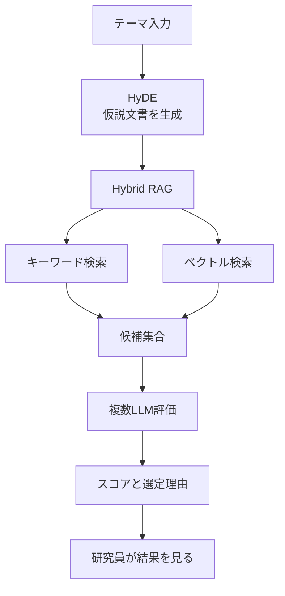
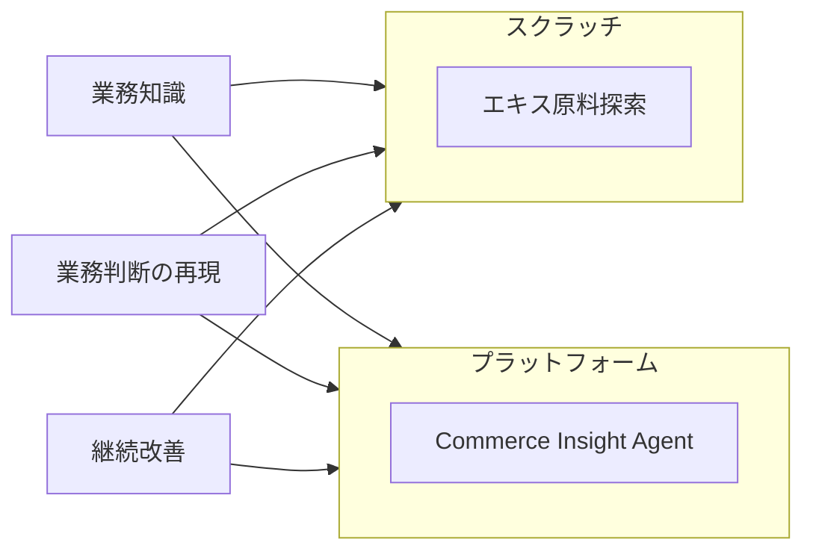

資生堂ジャパンは、化粧品のエキス原料探索向けに業務特化エージェントを組み立てています。
研究員が抽象テーマから候補を絞り込む作業を、仮説文書生成（HyDE）、キーワードとベクトルの併用検索（Hybrid RAG）、複数の大規模言語モデルによる評価、の3段に分けて実行します。
同じ考え方で、複雑な判断はスクラッチ実装、改善を速く回す業務は Gemini Enterprise 上のプラットフォーム実装、と作り分けます。
読み終わると、熟練の探索を単一プロンプトに閉じず、探索・候補化・相互評価に分ける判断ができます。

:::message
本稿の数値の多くは、Google Cloud 主催イベントでの講演を報道が再構成したものです。
:::

*この記事の全体像。以下、順に解説します。*

## 原料探索エージェントとは

原料探索エージェントは、化粧品のエキス原料探索に特化した業務エージェントです。
入力は「海」「宇宙」のようなテーマ語です。
原料データベースの成分名やキーワードへ分解して探します。

処理は次の3段です。

1. HyDE で曖昧な依頼から仮説文書を作り、検索クエリにする
2. Hybrid RAG で専門用語・成分名のキーワード一致と意味検索を併用する
3. 複数LLMが候補を並列評価し、合致度スコアと選定理由を返す

最終採否の決裁者は、公開資料では確認できません。
設計の3軸は、業務知識の理解、業務判断の再現、フィードバックによる継続改善です。

研究開発の探索エージェントはスクラッチです。
ECの Commerce Insight Agent はプラットフォームです。
運用面では独自UI、Gemini Enterprise、Model Armor、IAM、Private Service Connect、AlloyDB を組み合わせると講演で述べています。

対象そのものの処理の流れは次です。

実装の置き場所は業務の性質で分かれます。

Commerce Insight Agent は資生堂側のエージェント名とみられます。
Google 公式の同名製品ではありません。
基盤として Gemini Enterprise for Customer Experience、BigQuery、Agent Platform が報じられています。

## 注意点

ITmedia の報道と同一数値の別報道は、ベンダー主催イベントでの自己申告です。

| 数値 | 報道での言い方 | 分母・条件 | 扱い |
|---|---|---|---|
| 探索時間 95%削減 | [ITmedia 2026-09-18](https://www.itmedia.co.jp/enterprise/articles/2609/18/news020.html) | なし | 二次情報 |
| 平均60分→3分 | [ASCII.jp 2026-04-23](https://ascii.jp/elem/000/004/396/4396515/) 図キャプション | n・測定主体は未記載 | 二次情報。(60−3)/60=95% で上段と算術一致 |
| 候補 20〜50%増 | 両記事 | 精度・採用率なし | 二次情報 |
| 信頼度 4.2 / 5 | ASCII | 誰が何件か未記載 | 二次情報 |
| 社内資料探索 約67%削減 | ITmedia。Gemini Enterprise ノーコード検索 | 原料探索とは別エージェント | 二次情報 |
| Gemini 月間アクティブ 82%超 / 高頻度 42% | ITmedia・菊地氏 | 分母未定義。BI 同系統取材は 80% / 40% | 二次情報 |
| 連結売上高 9700億円（2025年12月期） | ITmedia | IR は 969,992 百万円 | 丸めとして一次と整合 |

ASCII 本文は「現在実装を目指している」と書きます。
ITmedia は「導入」「活用」と書きます。
どちらもこのエージェントを PoC とは呼んでいません。
本番か検証段階かは、公開資料から確定できません。

ASCII が「ユーザーテスト」と明記しているのは「宇宙」入力のエピソードです。
95%や候補増と同じ測定とまでは、記事から言えません。
1回の探索について ASCII 本文は「長いと2〜3時間」、図は「平均60分」と並記しており、ベースラインは一意ではありません。

資生堂公式ニュースが「原料 × AI」として出しているのは、処方開発基盤 VOYAGER と、生分解性の AI-QSAR / 安全性情報識別です。
2026-09-21 時点で `corp.shiseido.com` に「エキス原料探索エージェント」や HyDE のリリースは見当たりません。

計測プロトコル（n、期間、クエリ集合、本番/PoC）はありません。
候補増はノイズ増と区別できません。
宇宙→砂漠植物は解釈の拡張であり、存在しない宇宙由来原料を出さない代わりに別カテゴリへ寄せます。

HyDE 論文自身が、仮説文書の事実誤りを前提にします。
検索の接地はエンコーダ側に任せます。
探索短縮が製品化リードタイム短縮と直結する、とは公式リリースから言えません。
生分解性評価のリリースは、従来のデータ取得が約1〜2か月、AI-QSAR の予測は即時、と分けます。
同じリリースの「専門人材が最終判断」は、別系統の安全性情報識別システムの説明です。

資生堂公式ニュースが語る原料AIは VOYAGER と QSAR です。
本エージェントと足すと効果が二重に見えます。
67%と95%、Gemini利用率は別指標です。
情報源は Google Cloud 主催イベントです。

「目利きの再現」は検証指標がなく、設計意図です。
Model Armor を入れた、という運用主張もあります。
公式はプロンプト／応答を単ターンで検査し、エンコード済み内容はデコードしません。
ファイル入力は 4 MB 超をスキップします。
文書スクリーニングは Gemini Enterprise 統合では対応し、Agent Platform 等の統合では非対応です。
資生堂がどこまで有効化しているかは不明です。

公開情報で言えるのは、講演自己申告の探索時間短縮と候補増までです。
3段パイプラインと「スクラッチ / プラットフォーム」の選び分けは、講演間で安定して出てくる設計です。
品質再現や開発期間短縮の証明にはなっていません。

## 探索・候補化・評価に分ける理由

抽象テーマは原料データベースの語彙と一致しません。
ASCII は「海」ではヒットせず、ワカメ・魚・塩などへ分解すると述べます。

HyDE はクエリを仮説文書の埋め込みに変換する手法です。
一次は Gao et al., [arXiv:2212.10496](https://arxiv.org/html/2212.10496)、2022-12-20 です。
論文は仮説文書が事実誤りを含みうると書きます。

Google 公式の Hybrid Search は、SKU・新製品名・社内コードを dense 検索の out-of-domain 例として挙げ、キーワード（sparse）併用を解としています。
一次は [About hybrid search](https://docs.cloud.google.com/vertex-ai/docs/vector-search/about-hybrid-search) です。
フッタの Last updated は 2026-09-18 UTC と 2026-09-16 UTC の表記があります。
SKU・社内コードが out-of-domain である記述は一致します。

複数LLM段はスコアと理由を出します。
ITmedia の徐氏は「知識や判断を生かしながら支援」と述べます。
最終採否の決裁主体は記事にありません。

事例の段組みは、ITmedia と ASCII が3層で一致します。
登壇者とイベントは異なります。
3月のピッチ（ASCII）と7月の Next Tokyo（ITmedia）で、95%と20〜50%が一致します。
ASCII だけが 60分→3分を出し、95%の計算根拠になります。

探索は「テーマの言い換え」「固有名詞の拾い」「候補の並べ」に分解できます。
熟練の暗黙知を単一プロンプトに閉じず、この3段に置いています。
HyDE は言い換え、Hybrid のキーワード側は成分名、複数LLMは並べと説明責任、という役割分担になります。

資生堂が Vector Search 公式の Hybrid を使っているかは、講演の「Hybrid RAG」という語以上には確認できません。
複数LLMのベンダー、本数、多数決か重み付きかは未公開です。

## 原料探索と現場検索は同じAIXの別レイヤー

AIX は 2026年3月、約40部門から130人のアンバサダーでキックオフしたと講演で述べています。
デジタル機能は戦略子会社（資生堂インタラクティブビューティー）から本体・資生堂ジャパンへ移しました。
吸収合併は 2026-06-01 効力の[適時開示](https://corp.shiseido.com/jp/ir/pdf/ir20260415_270.pdf)があります。

[Business Insider の同一イベント取材](https://www.businessinsider.jp/article/2608-shiseido-ai-ambassadors-program/)は、個人の Gemini 利用が進んだあとに、分析依頼が中央データ組織へ集中したと書きます。
次の手は Data as a Product で現場が自分で問う形です。
依頼が何件減ったかは同記事も「示されていない」とします。

原料探索エージェントは「判断の再現」側です。
DaaP / 情報検索エージェントは「現場が自分で探す」側です。
同じ AIX の別レイヤーです。

品質指標なしで全社の熟練移植テンプレにする判断は止めます。
探索・候補化・相互評価を分ける、という型だけ採用する判断は止めません。

## 同じ3段を自組織に置くときの判断

熟練者の経験を移植するときは、判断基準の文章化だけで終わらせません。
探索（言い換え）、候補化（固有名詞と意味の併用）、相互評価（スコアと理由）、ヒトが結果を見る、を別レイヤーにします。
最終採否の決裁者は公開資料では確認できません。
複雑な判断ロジックはスクラッチ、改善速度が先の業務は共通基盤、と選びます。
数値の95%は記事のフックに使わず、分母付きの自己申告として扱います。

逆転条件は次です。

- 資生堂が n・期間・不一致率付きで公式発表した場合は、確信度を上げる
- 探索短縮が処方到達までのリードタイム短縮と一緒に出た場合は、開発貢献として書き換える
- HyDE を原料DBでオフにした方が良い、と内部が判断した記録が出た場合は、3段のうち1段を外す

自組織で同じ3段を試すなら、次を分けます。

1. HyDE のオン/オフとキーワード検索のオン/オフを別々に測る
2. 成功指標を「探索分数」と「ヒトが採用した候補の一致率」に分ける
3. 公式の原料AI（QSAR / VOYAGER）と探索エージェントを混ぜない

公開資料では、次が埋まっていません。

- ユーザーテストの人数と期間
- 複数LLMのモデル名と合議ルール
- 探索結果のうち実際に処方へ進んだ割合
- HyDE をオフにしたアブレーション

採用後の品質と、研究員との不一致率も、公開資料では埋まりません。
設計パターンとしては使えます。
KPIとしては講演スライドの自己申告に留めます。

## まとめ

資生堂ジャパンの原料探索エージェントは、抽象テーマを HyDE、Hybrid RAG、複数LLM評価の3段に分けます。
HyDE は言い換え、キーワード側は成分名、複数LLMは並べと理由です。
研究開発の探索はスクラッチ、ECの Commerce Insight Agent はプラットフォームです。
原料探索は判断の再現、DaaP / 情報検索は現場が自分で探す側で、同じ AIX の別レイヤーです。

95%削減や候補増は、Google Cloud 主催イベントの自己申告です。
分母・n・本番か検証かは公開資料から確定できません。
公式ニュースの原料AIは VOYAGER と QSAR であり、本エージェントとは別です。
自組織では数値をフックにせず、探索・候補化・相互評価を別レイヤーにする型だけ採ります。

この記事が少しでも参考になった、あるいは改善点などがあれば、ぜひリアクションやコメント、SNSでのシェアをいただけると励みになります！

## 参考リンク

1. 山下竜大, 「資生堂、AIエージェントで原料探索時間を95％削減　研究員の「目利き」を複数LLMで再現」, [ITmedia エンタープライズ](https://www.itmedia.co.jp/enterprise/articles/2609/18/news020.html), 2026-09-18.
2. 柳谷智宣, 「常識を裏切るAIの実力　95％時短した資生堂と、3000万円の装置を不要にしたキリンビジネス」, [ASCII.jp](https://ascii.jp/elem/000/004/396/4396515/), 2026-04-23.
3. 松本和大, 「資生堂が130人の「AIアンバサダー」を置いても直面した壁」, [Business Insider Japan](https://www.businessinsider.jp/article/2608-shiseido-ai-ambassadors-program/), 2026-08-05.
4. Luyu Gao, Xueguang Ma, Jimmy Lin, Jamie Callan, "Precise Zero-Shot Dense Retrieval without Relevance Labels", [arXiv:2212.10496](https://arxiv.org/html/2212.10496), 2022-12-20.
5. Google Cloud, [About hybrid search](https://docs.cloud.google.com/vertex-ai/docs/vector-search/about-hybrid-search), Gemini Enterprise Agent Platform.
6. Google Cloud, [Model Armor overview](https://docs.cloud.google.com/model-armor/overview), last updated 2026-09-18 UTC.
7. Google Cloud Japan, [Next Tokyo 登録開始！7 月 30 日、31 日](https://cloud.google.com/blog/ja/topics/next-tokyo/registration-for-next-tokyo-2026-is-now-open), 2026-04-08.
8. 株式会社資生堂, 「2025年12月期 決算短信〔IFRS〕(連結)」, 2026-02-10. 売上高 969,992 百万円
9. 株式会社資生堂, [完全子会社（資生堂インタラクティブビューティー株式会社）の吸収合併に関するお知らせ](https://corp.shiseido.com/jp/ir/pdf/ir20260415_270.pdf), 2026-04-15.
10. 株式会社資生堂, [AIを活用した「化粧品原料の生分解性評価法」と「安全性情報識別システム」の開発に成功](https://corp.shiseido.com/jp/news/detail.html?n=00000000004142), 2026-02-25.
11. 株式会社資生堂, [100年にわたる研究の蓄積と先進AI技術を融合](https://corp.shiseido.com/jp/news/detail.html?n=00000000003893), 2024-09-26（VOYAGER）.
12. HyDE 実装リポジトリ texttron/hyde。star 約580（2026-09-21）
