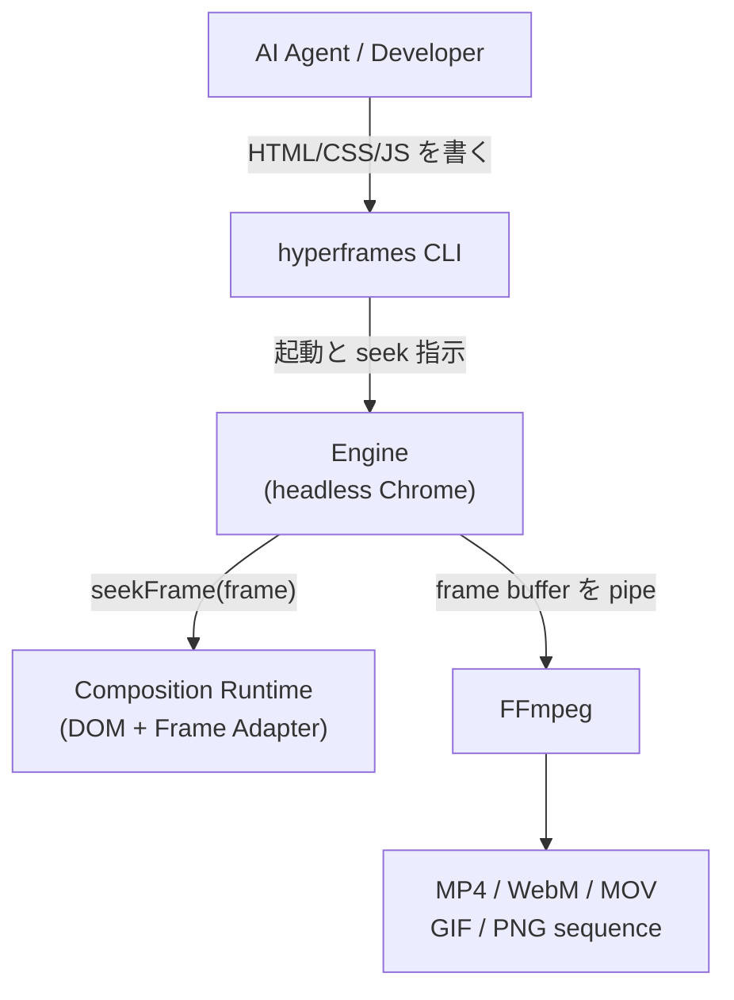
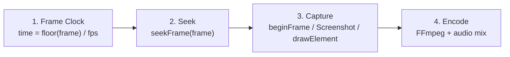
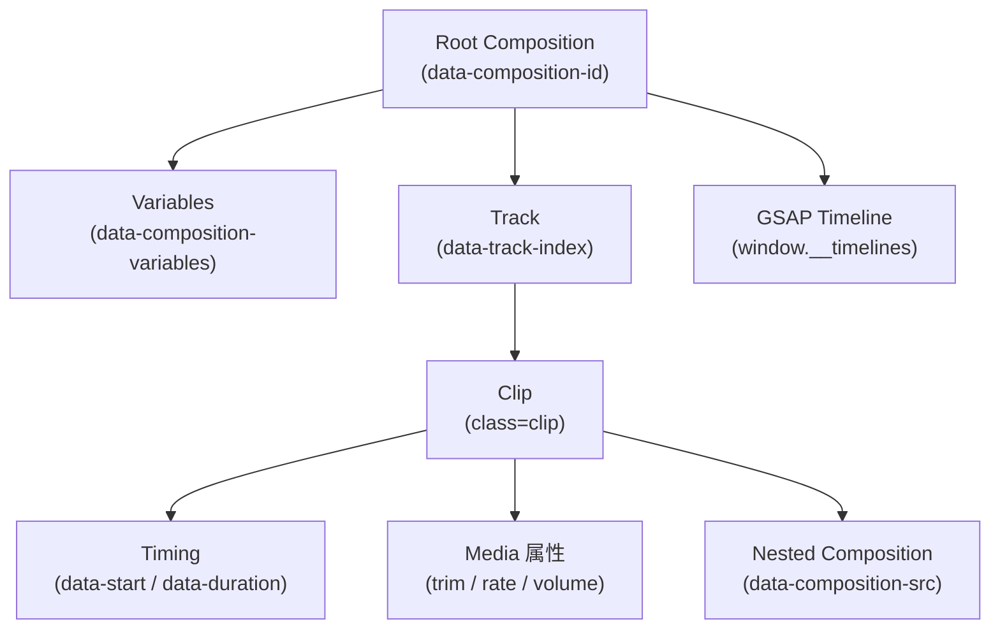

HeyGen が Apache 2.0 で公開する [HyperFrames](https://github.com/heygen-com/hyperframes) は、HTML / CSS / JavaScript で書いたコンポジションを、headless Chrome と FFmpeg で決定論的に MP4 へ変換するフレームワークです。React も独自 DSL も使いません。

この記事では、公式ドキュメントと README を一次情報として、HyperFrames の構造・データモデル・導入・運用を整理します。読み終えると次の判断ができます。

- コード駆動の動画生成で、Remotion から乗り換える価値があるか
- 「決定論的」が具体的に何を保証し、何を禁じるのか
- AI コーディングエージェントに動画制作を任せる場合、どこまで自走するのか

検証時点は 2026-07-27、参照したのは GitHub README と `hyperframes.heygen.com` のドキュメントです。

## 概要

HyperFrames のキャッチコピーは「Write HTML. Render video. Built for agents.」です。設計思想は 3 点に集約されます。

| 観点 | HyperFrames の選択 |
|---|---|
| 記述言語 | HTML + CSS + JS (GSAP 等)。フレームワーク非依存 |
| 時間表現 | `data-*` 属性による宣言的タイムライン |
| レンダリング | headless Chrome で 1 フレームずつ seek + 環境別の capture → FFmpeg |

動作要件は Node.js 22 以上と FFmpeg です。ライセンスは Apache 2.0 です。

「なぜ今 HTML なのか」の答えを、HeyGen は LLM との相性に置いています。同社は社内 eval で HTML + GSAP の方が少ないガードレールで創造的な結果を得られたことと、Web コードが LLM の学習データに多いとの見立てを設計理由に挙げています。ただし、モデル・サンプル数・エラー率・学習コーパス量は公開されていないため、これは検証済みの一般則ではなくベンダーの設計判断として読むべきです。

## 特徴

### 1. 決定論を仕様として定義している

「同じ入力から同じ出力」を、実装の副産物ではなく契約として定義しています。破ってはいけないものが明示されています。

- `Date.now()` / `requestAnimationFrame` / システムタイマーなど、壁時計依存
- シードなしの `Math.random()`
- レンダリング中のネットワーク fetch (アセットは事前ロード必須)
- fps / width / height を実行ごとに変える
- 長さが確定しない無限コンポジション

### 2. Frame Adapter でアニメーションライブラリを吸収する

時間軸を持つライブラリを「任意フレームへ seek できるもの」として抽象化します。第一級サポートされる seek 手段は次のとおりです。

| ランタイム | seek 手段 |
|---|---|
| GSAP | `timeline.totalTime(sec)` / `timeline.seek(sec)` |
| Anime.js | `instance.seek(ms)` (`window.__hfAnime` 上の対象) |
| CSS keyframes | `Animation.currentTime`、負 delay の pause フォールバック |
| Lottie / dotLottie | `goToAndStop(ms, false)` |
| Three.js / WebGL | `hf-seek` イベント + `window.__hfThreeTime` |
| Web Animations API | `document.getAnimations()` + `animation.currentTime` |
| TypeGPU / WebGPU | GPU compute shader + `hf-seek` イベント |

### 3. CLI が動画制作の周辺工程まで抱えている

`render` と `preview` だけではありません。文字起こし、TTS、背景除去、Web サイトキャプチャ、lint、スナップショット検査までを 1 つの CLI に統合しています (後述)。

### 4. 19 個の Agent Skill を同梱する

`/hyperframes` をルーターとして、制作ワークフロー系とドメイン系のスキルが並びます。

- ルーター: `/hyperframes`
- 制作ワークフロー: `/product-launch-video` `/faceless-explainer` `/pr-to-video` `/embedded-captions` `/talking-head-recut` `/motion-graphics` `/music-to-video` `/slideshow` `/general-video` `/remotion-to-hyperframes`
- ドメイン: `/hyperframes-core` `/hyperframes-animation` `/hyperframes-keyframes` `/hyperframes-creative` `/media-use` `/hyperframes-cli` `/hyperframes-registry` `/figma`

`/remotion-to-hyperframes` が公式に存在する点は、移行を想定した設計であることを示します。

## 構造

### システム全体



パッケージは責務ごとに分割されています。

| パッケージ | 責務 |
|---|---|
| `@hyperframes/core` | 型定義、HTML パース、ランタイム、lint |
| `@hyperframes/engine` | headless Chrome での seek 可能なページ→フレーム変換 |
| `@hyperframes/producer` | capture と FFmpeg エンコードの結合 |
| `@hyperframes/sdk` | エージェント / 独自エディタ向けのヘッドレス編集 |
| `@hyperframes/player` | 再生用 Web Component |
| `@hyperframes/studio` / `@hyperframes/studio-server` | プレビュー Studio |
| `@hyperframes/parsers` / `@hyperframes/lint` | 解析と静的検査 |
| `@hyperframes/aws-lambda` / `@hyperframes/gcp-cloud-run` | 分散 / クラウドレンダリング |

### レンダリングの 4 段階

決定論はこのパイプラインで担保されます。



1. **Frame Clock**: 整数演算 `time = floor(frame) / fps` で時刻を決める。壁時計から完全に切り離す
2. **Seek**: Frame Adapter の `seekFrame(frame)` が DOM・アニメーション・canvas を目標フレームへ配置する
3. **Capture**: OS・Chrome・GPU 条件に応じて BeginFrame / Screenshot / drawElement のいずれかでフレームを取得する
4. **Encode**: FFmpeg が MP4 へエンコードし、`<audio>` / `<video>` 要素の音声をこの段でミックスする

プレビューとレンダリングは同じ `hyperframe.runtime` を使うため見た目は一致しますが、性能特性は異なります。プレビューはリアルタイム再生 (30fps なら 1 フレーム 33ms 以内が要求される) で、レンダリングは 1 フレームずつ処理するためコマ落ちしません。

### Frame Adapter の契約

```typescript
type FrameAdapterContext = {
  compositionId: string;
  fps: number;
  width: number;
  height: number;
  rootElement?: HTMLElement;
};

type FrameAdapter = {
  id: string;
  init?: (ctx: FrameAdapterContext) => Promise<void> | void;
  getDurationFrames: () => number;
  seekFrame: (frame: number) => Promise<void> | void;
  destroy?: () => Promise<void> | void;
};
```

自作アダプタが満たすべき条件は 3 つです。

- `seekFrame(frame)` が前方・後方・ランダムどの順序でも動く
- 同じフレーム番号に対して冪等である
- 順序依存の副作用を持たず、フレーム確定前に処理を完了する

ホスト側は `clamp(Math.floor(frame), 0, durationFrames)` で正規化してからアダプタへ渡します。

## データ

### 概念モデル



特徴は、専用のシリアライズ形式を持たず **HTML そのものがデータモデル**である点です。ファイルを開けば構造がそのまま読めます。エージェントが差分編集しやすい理由もここにあります。

### 主要な `data-*` 属性

タイミング系。単位はすべて秒です。

| 属性 | 置き場所 | 意味 |
|---|---|---|
| `data-start` | root / clip | 開始時刻 (秒)。clip ID を書くと相対指定になる |
| `data-duration` | root / clip | 継続時間 (秒)。root では GSAP タイムライン長ではなく総レンダリング尺 |
| `data-track-index` | clip | タイムラインのトラック番号。時間的な並びをグループ化する |
| `data-fps` | root | フレームレートのヒント。CLI の `--fps` が上書きする |

`data-duration` は root と clip で意味論が違います。ここは事故が起きやすい箇所です。

- **root の `data-duration`**: `data-width` / `data-height` と同じくコンパイル時に一度だけ読まれる。スクリプトの `setAttribute` や `--variables` では変えられない。尺を可変にしたいなら root に直接書く
- **root が省略した場合**: スクリプト実行後の DOM / タイムラインから総尺を自動導出する。導出できるのは GSAP タイムライン、有限の CSS アニメーション、有限の WAAPI `element.animate()`、登録済み Lottie のいずれかがあるとき
- **root で必須になる場合**: Three.js (自動導出なし)、無限 CSS / WAAPI アニメーション、アニメーション signal が一切ないコンポジション。`lint` が `root_composition_missing_duration_source` で検出する
- **clip の `data-duration`**: ライブ DOM から再読込されるため、スクリプトや変数で駆動できる。`div` / `img` / サブコンポジションでは必須、video / audio は素材長にフォールバック

コンポジション系。

| 属性 | 置き場所 | 意味 |
|---|---|---|
| `data-composition-id` | root | コンポジション識別子。全コンポジションで必須 |
| `data-width` / `data-height` | root | キャンバスの幅と高さ (px) |
| `data-composition-src` | ネスト | 外部コンポジション HTML のパス |
| `data-composition-variables` | root | 宣言変数の JSON 配列 (`id` / `type` / `label` / `default`) |
| `data-variable-values` | ネスト | サブコンポジションへ渡す変数値 |
| `data-var-src` / `data-var-text` | clip | 要素の src / テキストを変数へバインド |

メディア系。

| 属性 | 意味 |
|---|---|
| `data-media-start` | 素材側のトリム開始点 (秒、既定 0) |
| `data-playback-start` | メディアラッパー / ネストホストのソース時刻オフセット |
| `data-playback-rate` | 再生倍率。0.1〜5 にクランプ |
| `data-volume` | 音量 0〜1 |
| `data-has-audio` | video に音声トラックがあるか |

`class="clip"` の付与ルールには例外と落とし穴があります。

- 可視要素には `class="clip"` を付ける。付け忘れると `data-start` / `data-duration` が無視され、全編表示され続ける
- **video には付けない** (フレームワークが再生を直接管理する)
- **audio にも付けない** (不可視のため)
- **可視 clip はコンポジション root の直接の子でなければならない**。ラッパー `<div>` の内側に置くと clip として登録されず、やはり全編表示される。変形したいならラッパーを clip の内側に入れる
- 表示区間は両端を含む。`start ≤ t ≤ start + duration` の間表示されるため、`data-duration` ちょうどに着地する演出も最終フレームに残る

`data-composition-variables` があることで、同一 HTML に値を差し替えてバッチ生成できます。CLI の `--variables` と対になる設計です。

## 導入

前提は Node.js 22 以上、FFmpeg、npm または bun です。

### エージェント経由 (推奨経路)

エージェントや自動実行など非対話環境では、CLI からコアセットを入れるのが確実です。

```bash
npx hyperframes skills update
```

対話的に選びたい場合や、19 スキルすべてを入れたい場合は `skills add` を使います。

```bash
# 対話ピッカーで選ぶ
npx skills add heygen-com/hyperframes --full-depth

# 19 スキルすべてを入れる (ピッカーを飛ばす)
npx skills add heygen-com/hyperframes --all --full-depth

# 単一スキルだけ (先頭のスラッシュは付けない)
npx skills add heygen-com/hyperframes --skill motion-graphics --full-depth
```

`--full-depth` は「全部入れる」フラグではありません。リポジトリの現在の `main` を完全クローンする取得方式の指定です。付けないと skills.sh レジストリの blob 経由になり、`main` から数時間遅れたコピーを引きます。

導入後は Claude Code などから `/hyperframes` を呼び、作りたい動画を自然文で指示します。ルーターと制作ワークフローは必要になった時点でロードされます。

### 手動セットアップ

```bash
npx hyperframes init my-video
cd my-video
npx hyperframes preview
```

`index.html` を編集してからレンダリングします。

```bash
npx hyperframes render --output output.mp4
```

`init` にはテンプレートや素材を指定するフラグがあります。

```bash
npx hyperframes init my-video --example blank --video video.mp4
```

主なフラグは `--example` / `--resolution` / `--video` / `--audio` / `--tailwind` / `--skip-transcribe` です。

環境が整っているかは `doctor` で確認できます。CLI / Node.js / FFmpeg / Chrome / Docker を検査します。

```bash
npx hyperframes doctor --json
```

Chrome が無ければ次で取得します。

```bash
npx hyperframes browser ensure
```

## 利用

### 最小コンポジション

root に識別子とキャンバス寸法、clip にタイミングを書きます。clip には安定した `id` を付けておくとアニメーションから参照できます。

```html
<div id="root" data-composition-id="my-video"
     data-start="0" data-width="1920" data-height="1080"
     data-duration="5" data-fps="30">
  <h1 id="title" class="clip" data-start="0" data-duration="5"
      data-track-index="0">Hello, Hyperframes!</h1>
</div>
```

### GSAP タイムラインの登録

ここが唯一の「お作法」です。`paused: true` で作り、`window.__timelines` に `data-composition-id` をキーとして登録します。キーが root の `data-composition-id` と一致しないと、タイムラインが seek 対象になりません。

```html
<script src="https://cdn.jsdelivr.net/npm/gsap@3.14.2/dist/gsap.min.js"></script>
<script>
  const tl = gsap.timeline({ paused: true });
  tl.to("#title", { opacity: 1, duration: 0.5 }, 0);
  window.__timelines["my-video"] = tl;
</script>
```

`paused: true` が必須なのは、再生をフレームワークが seek で制御するためです。第 3 引数の position parameter は絶対秒で指定します。相対指定を積み重ねると、あとから差分編集したときにタイミングがずれます。

上は試作用の CDN 例です。決定論とオフライン再現性が必要なレンダリングでは、同じ GSAP バージョンをプロジェクトへ同梱し、ネットワーク fetch を発生させないでください。

メディア再生・clip のライフサイクル・サブコンポジションのネストはフレームワークの責務です。自前でタイムラインを再生・停止しないでください。

### レンダリングのフラグ

```bash
npx hyperframes render --output output.mp4 --fps 30 --quality standard
```

| フラグ | 値 |
|---|---|
| `--format` | `mp4` / `webm` / `mov` / `gif` / `png-sequence` |
| `--fps` | 1〜240。`30000/1001` のような有理数も可。root の `data-fps` を上書きする |
| `--quality` | `draft` / `standard` / `high` |
| `--resolution` | landscape / portrait / 4k 系のプリセット |
| `--workers` | 並列ワーカー数。`auto` は CPU・メモリ・総フレーム数・描画負荷から適応的に決定。明示指定のハード上限は 24。現行実装のメモリ予算は約 1.5GB / worker |
| `--docker` | コンテナ経由で決定論的な出力を得る |
| `--gpu` | NVENC / VideoToolbox 等のハードウェアエンコード |
| `--variables` | パラメータ化レンダリング用の JSON |
| `--hdr` | HDR 出力を強制 |

### 検査とスナップショット

エージェントに任せる場合、この 2 つが実質的な受け入れテストになります。

```bash
# 構造の静的検査
npx hyperframes lint . --json

# lint + ランタイム + レイアウト + モーション + コントラストの総合検査
npx hyperframes check . --snapshots --strict

# 指定秒のフレームを PNG で書き出す
npx hyperframes snapshot my-project --at 2.9,10.4,18.7
```

`inspect` は `check` に統合され非推奨です。

### 周辺コマンド

| コマンド | 用途 |
|---|---|
| `transcribe` | whisper.cpp によるローカル文字起こしで単語レベルのタイムスタンプを生成。SRT / VTT / OpenAI Whisper API の word timestamp JSON はインポートして正規化 |
| `tts` | Kokoro-82M によるオンデバイス音声合成 (API キー不要) |
| `remove-background` | u2net で背景除去。VP9-alpha WebM / ProRes 4444 MOV / 透過 PNG |
| `capture` | Web サイトからスクリーンショット・フォント・アセット・アニメーションを抽出 |
| `add` | カタログの block / component を既存プロジェクトへ追加 |
| `publish` | `hyperframes.dev` の共有 URL を発行 |
| `benchmark` | 環境に最適なレンダリング設定を探索 |

字幕付き解説動画を作る場合、ナレーション生成 (`tts`) → 単語タイムスタンプ (`transcribe`) → 字幕コンポジションという流れが 1 つの CLI で閉じます。外部 TTS API に依存せず動く点は、自動パイプラインの安定性に効きます。

## 運用

### レンダリング環境の選択

選択肢は次のとおりです。

| 方式 | 起動 | 向き |
|---|---|---|
| ローカル | `npx hyperframes render` | 開発・少量。起動が速くコンテナ不要 |
| ローカル + Docker | `npx hyperframes render --docker` | 再現性が要るとき。本番・CI 向け |
| AWS Lambda | `hyperframes lambda deploy` → `lambda render` | 自前インフラでの分散 |
| Google Cloud Run | `hyperframes cloudrun deploy` → `cloudrun render` | Cloud Workflows + GCS で分散したい場合 |
| HeyGen クラウド | `hyperframes cloud render` | ローカル依存を一切持ちたくない場合 |

```bash
hyperframes lambda deploy --stack-name hyperframes-prod
hyperframes lambda render ./my-project --width 1920 --height 1080 --wait

hyperframes cloud render ./my-video --quality high --fps 60
```

HeyGen hosted cloud の `hyperframes cloud render` は `--no-wait` / `--callback-url` / `--asset-id` に対応し、非同期パイプラインへ組み込めます。認証は `hyperframes auth login --api-key` で、`heygen` CLI と資格情報を共有します。AWS Lambda と Google Cloud Run はそれぞれ別の `--wait` / `--site-id` 契約を持つため、同じフラグを流用しません。

### キャプチャ方式と OS の差

ここが実運用でもっとも誤解しやすい点です。現行エンジンの最終キャプチャ経路は 3 つあります。

- **BeginFrame**: Linux + `chrome-headless-shell` + BeginFrame 制御が有効な場合のフレーム精度経路
- **Screenshot**: BeginFrame 条件を満たさない環境の基本経路。macOS / Windows では単なる障害時フォールバックではない
- **drawElement**: 条件を満たすローカル環境で使う高速経路。現行 CLI は macOS + hardware GPU で既定有効にする

そして「決定論」と「ビット単位の再現性」は別の話です。ローカルレンダリングは起動が速い反面、**フォント と Chrome のバージョン差によりプラットフォーム間で出力が変わりうる**ため、公式ガイドは再現性を要求する CI/CD には不向きと明言しています。

再現性が要るなら `--docker` です。Docker モードは Chrome のバージョン・フォントセット・FFmpeg を固定し、決定論的なソフトウェア GL 経路に留まるため、どのプラットフォームでも同一出力になります。

実務上の構成は次のように割り切るのが素直です。

- ローカル (macOS 等): `preview` と `render --quality draft` で確認する
- CI / 本番: `render --docker` で出力を確定させる

### 性能のボトルネック

ドキュメントが名指ししているのは CSS と画像です。

| 要因 | 内容 |
|---|---|
| `backdrop-filter: blur()` | ぼかし面積と半径にコストが比例。公式例では 1920×1080 の領域に半径 1〜128px を段階的に増やした 8 層を重ね、ミドルレンジ GPU で 1 フレーム約 200ms に達する |
| `filter: blur()` / `drop-shadow()` | 大きい要素で同様のコスト |
| 影付き要素の多用 | フレームごとにコンポジタの再ラスタライズが走る |
| 画像の実解像度 | 7000×5000 の画像はデコード後 140MB。JPEG が 2MB か 5MB かは無関係 |

画像はキャンバス寸法の 2 倍までに抑えるのが目安です。ボトルネックの特定は、プレビュー再生中に Chrome DevTools の Performance タブで「Composite Layers/Paint」「Decode Image」「Layout/Recalculate Style」の長タスクを探します。

プレビューがカクついても、それ自体は失敗ではありません。レンダリングは 1 フレームずつ処理するのでコマ落ちしないからです。確認を急ぐなら `--quality draft` を使います。

### CI への組み込み

決定論を活かすなら、レンダリング成果物ではなく **`check` の合否**を CI のゲートにするのが有効です。ワークフローの骨子は次のとおりです。

```yaml
name: hyperframes-check
on: [push]
jobs:
  check:
    runs-on: ubuntu-latest
    steps:
      - uses: actions/checkout@v4
      - uses: actions/setup-node@v4
        with:
          node-version: '22'
      - run: sudo apt-get update && sudo apt-get install -y ffmpeg
      - run: npx hyperframes browser ensure
      - run: npx hyperframes check . --snapshots --strict
```

`--json` を付ければ機械可読な出力が得られます。CLI の JSON 出力にはバージョン情報を含む `_meta` エンベロープが付くため、別プロセスを立てずにバージョン整合を検査できます。

## 注意点

### Remotion との違いをどう読むか

公式の比較ドキュメントが挙げる差分のうち、実務判断に効くのは次の 2 点です。

| 観点 | HyperFrames | Remotion |
|---|---|---|
| 記述 | HTML/CSS/JS。バンドラ不要で `index.html` がそのまま動く | React TSX。webpack 等のバンドラが必要 |
| 外部アニメーションライブラリ | Frame Adapter がフレーム位置へ seek する | 適応させない限りライブラリ自身のクロックで進む |

2 点目には注釈が要ります。Remotion 標準のアニメーションは `useCurrentFrame()` によるフレーム駆動であり、それ自体は決定論的です。問題になるのは、GSAP のように**内部クロックを持つライブラリを無変換で持ち込んだとき**です。HyperFrames 公式の比較では、同じ 4 秒の GSAP コードが Remotion 側では出力の最初の 1 秒で完走してしまい、残りのフレームが空になる例を挙げています。

したがって判断軸は「GSAP・Lottie・Three.js といった既存アニメーション資産を、書き換えずに動画へ持ち込みたいか」です。そこに不満がないなら Remotion を捨てる理由は弱くなります。

一方で、React のコンポーネント合成・型・既存エコシステムを前提に組んだ動画資産は、HTML へ書き下す移行コストが発生します。`/remotion-to-hyperframes` スキルはありますが、「無料」ではありません。

### 調査時に確認できなかった点

一次情報 (README / 公式ドキュメント / リポジトリ) を当たった範囲で、次は確定できませんでした。断定せず、実装時に手元で検証してください。

- **`hyperframes.config.js` の有無**: 公開ドキュメントに記載がありません。コンポジションの寸法・尺・fps は root の `data-*` 属性、レンダリング設定は CLI フラグで指定する経路だけが確認できました
- **`data-duration` の記述の揺れ**: コアスキルの属性定義は root での条件付き利用を認める一方、HTML Schema 側にはコンポジション要素で `data-duration` を使わず `tl.duration()` から尺を決める旨の記述があります。本記事はコアスキル側の定義に従いました。バージョンによって挙動が変わる可能性があるため、`lint` の結果で確かめてください
- **capture 経路の全選択条件**: LinuxのBeginFrame条件とmacOS hardware GPUのdrawElement既定は確認できましたが、Chromeバージョンや全フラグを含む網羅的な優先順位は実装時に現行ソースで再確認してください

### 決定論を壊しやすい書き方

エージェントに書かせると混入しやすいものを挙げます。`lint` / `check` で拾える範囲もありますが、レビュー観点として持っておく価値があります。

- `setTimeout` / `setInterval` / `Date.now()` による演出制御
- シードなしの `Math.random()` によるパーティクルや揺らぎ
- レンダリング開始後に走る fetch (Web フォント、外部 API)
- `paused: true` を付け忘れた GSAP タイムライン
- `window.__timelines` のキーと `data-composition-id` の不一致

## まとめ

- HyperFrames は HTML / CSS / JS を入力とし、headless Chrome の環境別capture経路と FFmpeg で決定論的に動画を生成する Apache 2.0 のフレームワーク
- 決定論は「壁時計・未シード乱数・実行時 fetch・可変パラメータ・無限尺の禁止」という契約として明示され、Frame Adapter の `seekFrame(frame)` が冪等性と任意順 seek を担保する
- データモデルは HTML そのもの。`data-composition-id` / `data-start` / `data-duration` / `data-track-index` を軸に、変数バインドとネストで再利用する
- CLI は render / preview だけでなく transcribe / tts / remove-background / check まで抱え、自動パイプラインの外部依存を減らせる
- 運用上の要点は「決定論」と「ビット単位の再現性」の区別。ローカル出力はフォントと Chrome バージョン差で揺れるため、CI・本番は `--docker` で固定する
- 判断軸は「GSAP・Lottie など既存アニメーション資産を書き換えずに持ち込みたいか」。Remotion 標準はフレーム駆動だが、内部クロックを持つライブラリを無変換で使うと破綻する

## 参考リンク

1. [HyperFrames 公式 GitHub リポジトリ](https://github.com/heygen-com/hyperframes)
2. [Introduction](https://hyperframes.heygen.com/introduction)
3. [Quickstart](https://hyperframes.heygen.com/quickstart)
4. [Deterministic Rendering](https://hyperframes.heygen.com/concepts/determinism)
5. [Data Attributes](https://hyperframes.heygen.com/concepts/data-attributes)
6. [Frame Adapters](https://hyperframes.heygen.com/concepts/frame-adapters)
7. [HTML Schema Reference](https://hyperframes.heygen.com/reference/html-schema)
8. [CLI](https://hyperframes.heygen.com/packages/cli)
9. [GSAP Animation](https://hyperframes.heygen.com/guides/gsap-animation)
10. [Performance](https://hyperframes.heygen.com/guides/performance)
11. [Rendering](https://hyperframes.heygen.com/guides/rendering)
12. [Hyperframes vs Remotion](https://hyperframes.heygen.com/guides/hyperframes-vs-remotion)
13. [Google Cloud Run](https://hyperframes.heygen.com/deploy/gcp-cloud-run)
14. [skills/hyperframes-core/references/data-attributes.md (リポジトリ)](https://github.com/heygen-com/hyperframes/blob/main/skills/hyperframes-core/references/data-attributes.md)
15. [Remotion: Animating properties](https://www.remotion.dev/docs/animating-properties)
16. [HyperFrames Playground](https://www.hyperframes.dev/)
