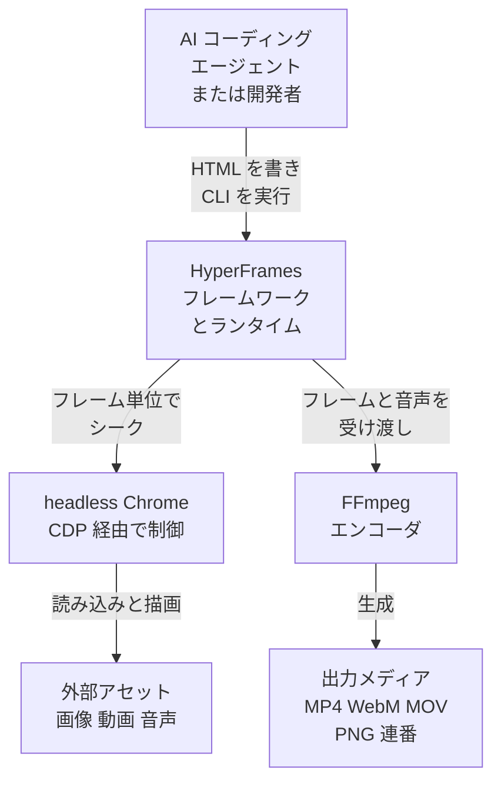
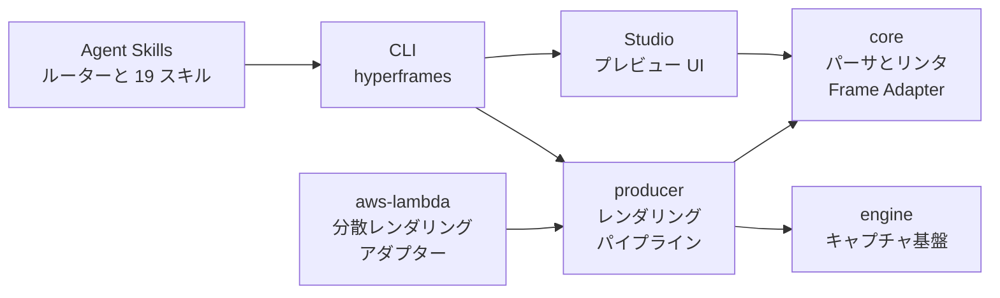
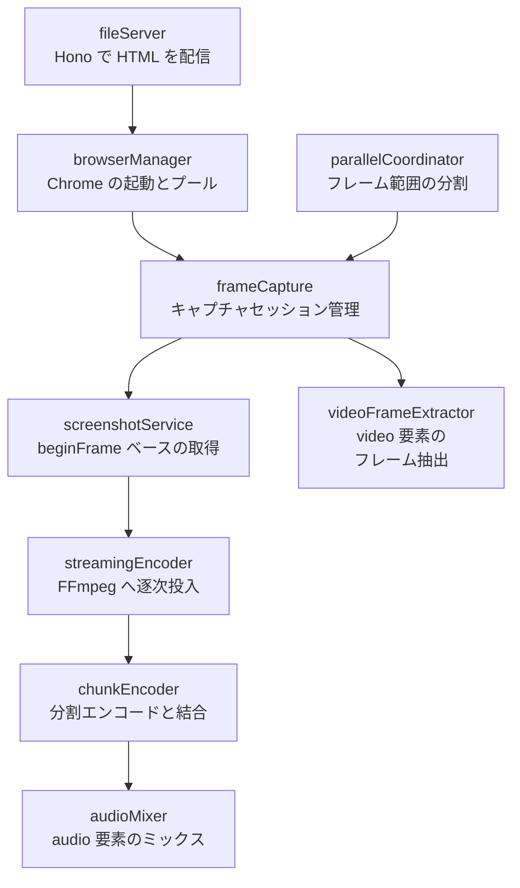
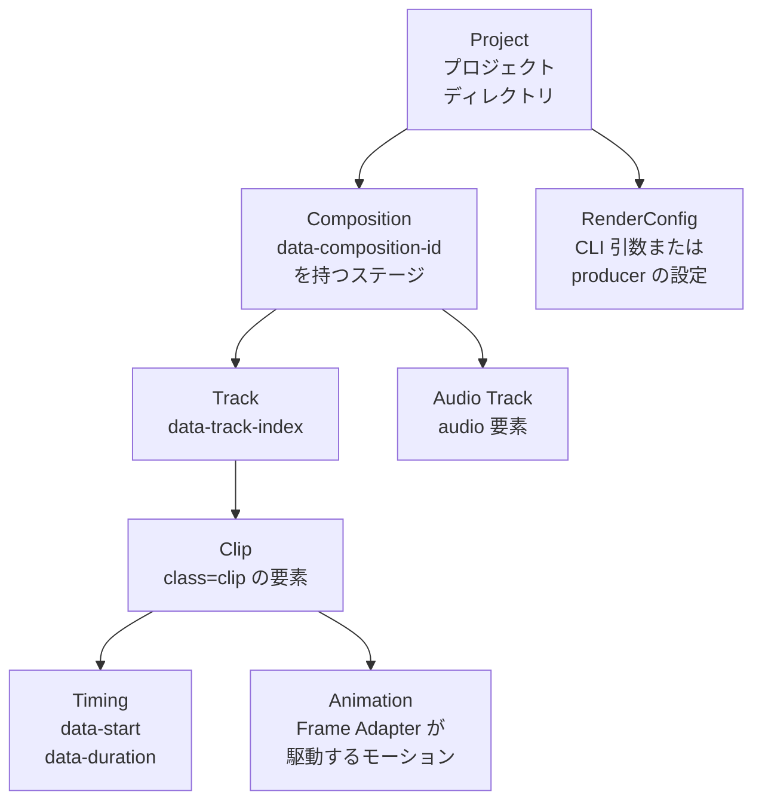
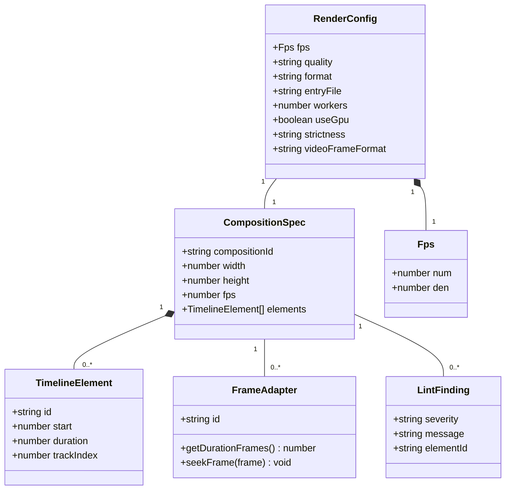
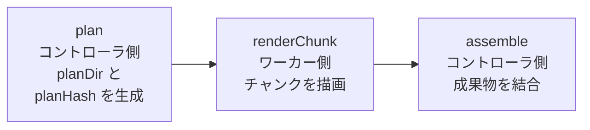

> 調査日: 2026-07-27 / 対象: [heygen-com/hyperframes](https://github.com/heygen-com/hyperframes) の `main` ブランチと各パッケージ README

## 概要

### HyperFrames とは

HyperFrames は、HeyGen が Apache 2.0 ライセンスで公開するオープンソースの動画レンダリングフレームワークです。HTML・CSS・メディア・シーク可能なアニメーションを入力として、決定論的な MP4 を出力します。

キャッチコピーは「Write HTML. Render video. Built for agents.」です。次の 3 つの使い方を想定しています。

| 使い方 | 説明 |
|---|---|
| ローカル CLI | `npx hyperframes` でプロジェクトを作成し、プレビューとレンダリングを実行 |
| AI コーディングエージェント | 同梱の 19 スキルをエージェントに読み込ませ、動画制作を自動化 |
| レンダリングコア | ホスト型オーサリングサービスの背後で描画エンジンとして稼働 |

HeyGen 社内の本番環境で稼働しており、tldraw や TanStack などのチームも採用しています。

### 開発背景

AI コーディングエージェントが動画コードを書く時代になり、課題は「LLM がどれだけ正確にモーションとレイアウトを生成できるか」に移りました。

React の状態管理や独自コンポーネントライブラリは、LLM にとって生成エラーの原因になります。一方で HTML と CSS は LLM が最も大量に学習した領域です。HyperFrames はこの差に賭け、コンポジションを素の HTML ファイルとして表現します。要素のタイムラインは `data-*` 属性だけで宣言するため、エージェントは追加の DSL を学ばずに動画を組み立てられます。

### Remotion との違い

HyperFrames は Remotion から着想を得ています。どちらも headless Chrome と FFmpeg で動画を描画します。違いはオーサリングモデルにあります。

| 観点 | HyperFrames | Remotion |
|---|---|---|
| 記述方式 | HTML + CSS + シーク可能アニメーション | React コンポーネント |
| ビルド手順 | 不要。`index.html` がそのまま再生可能 | バンドラー必須 |
| エージェントへの受け渡し | 素の HTML ファイル | JSX / React プロジェクト |
| ライブラリ時計のアニメーション | アダプター経由でフレーム精度のシーク | ウォールクロック依存パターンに注意が必要 |
| 分散レンダリング | ローカルと AWS Lambda | Remotion Lambda。成熟したクラウドレンダラー |
| ライセンス | Apache 2.0 | ソース公開型の Remotion License |

Remotion の既存コンポジションを移行するための `/remotion-to-hyperframes` スキルも用意されています。

## 特徴

### 1. HTML と CSS によるタイムライン記述

コンポジションのルートに `data-composition-id` を持つ要素を置き、その中に `class="clip"` を付けた要素を並べます。タイムライン情報はすべて data 属性です。

| 属性 | 意味 |
|---|---|
| `data-composition-id` | コンポジションの識別子。ステージ要素に付与 |
| `data-width` / `data-height` | フレームの横幅・縦幅 |
| `data-start` | タイムライン上の表示開始時刻。単位は秒 |
| `data-duration` | 表示継続時間。単位は秒 |
| `data-track-index` | レイヤーの重なり順を決めるトラック番号 |
| `data-volume` | `<audio>` 要素の音量 |

`<video>` と `<audio>` もそのまま clip として扱えます。メディアの再生位置はフレームワークが管理します。

### 2. 決定論的レンダリング

ブラウザの画面キャプチャは、非同期通信・タイマー精度・ウォールクロック依存によって結果が揺れます。HyperFrames のエンジンは Chrome DevTools Protocol の `HeadlessExperimental.beginFrame` でフレームを 1 枚ずつ進めます。各フレームでページ状態とアニメーションのシーク位置を確定してから描画するため、同じ入力からは同じ動画が出ます。

この性質は CI・リグレッションテスト・自動生成パイプラインで効きます。リポジトリ自身も、約 240MB のゴールデン MP4 を Git LFS で保持して描画結果を回帰検証しています。

### 3. プラガブルな Frame Adapter

アニメーションの駆動はアダプターに委譲されます。`@hyperframes/core` は GSAP・Lottie・CSS 向けのアダプターと、自前実装用のインターフェースを提供します。ドキュメント上は Three.js・Anime.js・WAAPI・TypeGPU も想定ランタイムとして挙げられています。

アダプターの契約は小さく、任意のフレーム番号へシークできれば実装できます。

```typescript
import type { FrameAdapter } from "@hyperframes/core";

const myAdapter: FrameAdapter = {
  id: "my-adapter",
  getDurationFrames: () => 300,
  seekFrame: (frame) => {
    /* 自前のアニメーションを frame の位置へシーク */
  },
};
```

GSAP には専用のファクトリが用意されています。

```typescript
import { createGSAPFrameAdapter } from "@hyperframes/core";

const adapter = createGSAPFrameAdapter({
  getTimeline: () => gsap.timeline(),
  compositionId: "my-video",
});
```

### 4. 19 種類のエージェントスキルと `/hyperframes` ルーター

HyperFrames は 19 個のスキルを同梱します。エージェントはまず `/hyperframes` を読み、要求に応じた制作ワークフローへルーティングします。

| 区分 | スキル | 用途 |
|---|---|---|
| ルーター | `/hyperframes` | 意図の確認と制作ワークフローへの振り分け |
| 制作ワークフロー | `/product-launch-video` | 製品サイトやブリーフからのプロモーション動画 |
| | `/faceless-explainer` | 任意テキストからの概念解説動画 |
| | `/pr-to-video` | GitHub プルリクエストからのチェンジログ動画 |
| | `/embedded-captions` | 既存トーキングヘッド動画への字幕埋め込み |
| | `/talking-head-recut` | 既存インタビュー動画へのグラフィック重畳 |
| | `/motion-graphics` | 10 秒未満のナレーション無しモーショングラフィック |
| | `/music-to-video` | 音源に同期したビートシンク動画 |
| | `/slideshow` | 操作可能なプレゼンテーションデッキ |
| | `/general-video` | 上記に当てはまらない長尺・多シーン制作 |
| | `/remotion-to-hyperframes` | 既存 Remotion コンポジションの一方向移行 |
| ドメインスキル | `/hyperframes-core` | data 属性・トラック・決定性のルール |
| | `/hyperframes-animation` | モーション設計とランタイムアダプター |
| | `/hyperframes-keyframes` | シーク安全なキーフレーム記述と診断 |
| | `/hyperframes-creative` | 配色・タイポグラフィ・ナレーション設計 |
| | `/media-use` | BGM・SFX・画像・音声の解決と生成 |
| | `/hyperframes-cli` | CLI 開発ループとクラウド／Lambda レンダリング |
| | `/hyperframes-registry` | カタログのブロックとコンポーネントの導入 |
| | `/figma` | Figma のアセット・トークン・モーションの取り込み |

制作ワークフローはオンデマンドで導入されます。ルーターがワークフローへ入る直前に `npx hyperframes skills update <workflow>` を実行するため、初期状態はコアセットだけで済みます。

### 5. CLI と Studio による開発体験

ローカル開発と CI の両方に対応した CLI を提供します。ライブリロード付きの Studio でプレビューし、同じプロジェクトをそのままレンダリングできます。

### 6. 真のアルファチャンネル対応

同じコンポジションから、出力フォーマットの指定だけで透過素材を生成できます。クロマキー合成ではなく、ブラウザ上で透明だったピクセルが出力でも透明になります。

| フォーマット | コーデック / ピクセルフォーマット | アルファ | 音声 | 主な用途 |
|---|---|---|---|---|
| `mp4` | H.264 yuv420p または H.265 + HDR10 | なし | AAC | 配信・SNS の既定成果物 |
| `webm` | VP9 + yuva420p | あり | Opus | Web でのオーバーレイ再生 |
| `mov` | ProRes 4444 + yuva444p10le | あり。10bit | AAC | 編集ソフトへの取り込み |
| `png-sequence` | 連番 RGBA PNG | あり。ロスレス | `audio.aac` サイドカー | After Effects や Nuke での後処理 |
| `gif` | パレット 2 パスのアニメーション GIF | なし | なし | PR や README へのインライン埋め込み |

## 構造

HyperFrames の構造を、C4 モデルの 3 段階で示します。

### システムコンテキスト図



| 要素 | 説明 |
|---|---|
| AI コーディングエージェントまたは開発者 | 動画の意図決定・HTML 生成・アニメーション実装・CLI 実行の主体 |
| HyperFrames フレームワークとランタイム | タイムライン解析・決定論的フレーム制御・プレビュー提供・描画統制の中核 |
| headless Chrome | 各フレーム時刻の DOM スナップショットを描画するレンダリングエンジン |
| FFmpeg | フレーム列と音声トラックを合成し、指定コーデックへエンコードする外部プロセス |
| 外部アセット | 動画内で使う画像・背景動画・BGM・ナレーション |
| 出力メディア | MP4・WebM・MOV・PNG 連番のいずれかの完成物 |

### コンテナ図



| コンテナ | 説明 |
|---|---|
| Agent Skills | エージェント向けの Markdown スキル群。ルーターが制作ワークフローへ振り分け |
| CLI | `hyperframes` パッケージ。プロジェクト作成・プレビュー・lint・レンダリングを統括 |
| Studio | `@hyperframes/studio`。ブラウザ上のコンポジション編集とプレビュー |
| core | `@hyperframes/core`。型・パーサ・ジェネレータ・コンパイラ・リンタ・ランタイム・Frame Adapter |
| engine | `@hyperframes/engine`。Puppeteer と FFmpeg によるシーク可能なキャプチャ基盤 |
| producer | `@hyperframes/producer`。キャプチャ・エンコード・音声ミックスを 1 呼び出しで実行 |
| aws-lambda | `@hyperframes/aws-lambda`。Step Functions と Lambda による分散レンダリング |

このほか、埋め込み用 Web コンポーネント `@hyperframes/player` と、WebGL シャドウトランジション `@hyperframes/shader-transitions` を提供します。

### コンポーネント図

`@hyperframes/engine` の内部サービス構造を示します。



| コンポーネント | 説明 |
|---|---|
| fileServer | ローカルの HTML コンポジションを Hono でブラウザへ配信 |
| browserManager | `chrome-headless-shell` の起動とインスタンスプール管理 |
| frameCapture | シーク・スクリーンショット・バッファのライフサイクル管理 |
| screenshotService | CDP の `HeadlessExperimental.beginFrame` によるフレーム取得 |
| videoFrameExtractor | `<video>` 要素から合成用のフレームを抽出 |
| streamingEncoder | 中間 PNG をディスクへ置かず FFmpeg へ逐次パイプ |
| chunkEncoder | GPU エンコーダ検出・チャンク結合・faststart 付与 |
| audioMixer | `<audio>` 要素を解析し FFmpeg で音声トラックを合成 |
| parallelCoordinator | フレーム範囲をワーカープロセスへ分割 |

`@hyperframes/producer` はこれらを次の 5 段階に束ねます。

1. Serve: HTML コンポジション用のローカルファイルサーバーを起動
2. Capture: headless Chrome でフレームごとにシークして取得
3. Encode: FFmpeg へフレームを流してエンコード
4. Mix: `<audio>` 要素を抽出して音声を合成
5. Finalize: MP4 に faststart を適用

## データ

HyperFrames のデータモデルは、HTML の DOM 構造と `data-*` 属性が中心です。設定ファイルは持たず、コンポジション自体が仕様を保持します。

### 概念モデル



| エンティティ | 説明 |
|---|---|
| Project | `hyperframes init` が生成するディレクトリ。複数のコンポジションを含む場合あり |
| Composition | `data-composition-id` を持つステージ要素。キャンバスサイズを `data-width` と `data-height` で保持 |
| Track | `data-track-index` によるレイヤーの重なり順 |
| Clip | `class="clip"` を付けた描画要素。テキスト・図形・画像・`<video>` を含む |
| Timing | `data-start` と `data-duration` による表示区間 |
| Animation | Frame Adapter がシークするアニメーション。GSAP や CSS などが担当 |
| Audio Track | `<audio>` 要素。`data-start` と `data-volume` で配置と音量を指定 |
| RenderConfig | 解像度・FPS・品質・出力フォーマットの指定。HTML の外側で与える |

### 情報モデル

`@hyperframes/core` と `@hyperframes/producer` が公開する主要な型の関係を示します。



主要フィールドの仕様は次のとおりです。

| 型 | フィールド | 型 | 説明 |
|---|---|---|---|
| `RenderConfig` | `fps` | `Fps` | フレームレートを有理数 `{ num, den }` で保持。入力時は数値や `"30000/1001"` などの文字列も受理 |
| | `quality` | `"draft" \| "standard" \| "high"` | エンコーダプリセット。既定値 `standard` |
| | `format` | `"mp4" \| "webm" \| "mov" \| "png-sequence" \| "gif"` | 出力コンテナ。既定値 `mp4` |
| | `entryFile` | `string` | プロジェクトディレクトリからの相対パス。既定値 `index.html` |
| | `videoFrameFormat` | `"auto" \| "jpg" \| "png"` | `<video>` 要素のフレーム抽出形式。既定値 `auto` |
| | `strictness` | `RenderStrictness` | `strict` は警告を失敗として扱う。既定値 `best-effort` |
| | `workers` / `useGpu` | `number` / `boolean` | 並列ワーカー数と GPU エンコーダ利用の指定 |
| | `crf` / `videoBitrate` | `number` / `string` | 画質指定。両者は排他 |
| | `gifLoop` | `number` | GIF のループ回数。`0` で無限。`format: "gif"` でのみ有効 |
| `TimelineElement` | `start` | `number` | `data-start` から解決した開始時刻 |
| | `duration` | `number` | `data-duration` から解決した継続時間 |
| | `trackIndex` | `number` | `data-track-index` から解決したトラック番号 |
| `FrameAdapter` | `seekFrame` | `(frame) => void` | 指定フレームへアニメーションを移動する関数 |
| `LintFinding` | `severity` | `string` | `lint` が返す指摘の重大度 |

出力の解像度は `RenderConfig` ではなくコンポジション側の `data-width` と `data-height` が決めます。入出力パスも設定には含まれず、`executeRenderJob` の引数として渡します。

:::message
公開されている `@hyperframes/producer` の README は `createRenderJob({ inputPath, outputPath, width, height, fps })` という形の例を載せていますが、`main` の実装とはずれています。実装では `RenderConfig` に `inputPath` / `outputPath` / `width` / `height` が存在しません。本記事の記述は `packages/producer/src/services/renderOrchestrator.ts` の定義に合わせています。
:::

ランタイムはブラウザ内に IIFE として注入され、`window.__hf` プロトコルでシークとメディア再生を管理します。GSAP のタイムラインは `window.__timelines` にコンポジション ID をキーとして登録します。

## 構築方法

### 1. 環境要件

| 項目 | 要件 |
|---|---|
| Node.js | 22 以上 |
| FFmpeg | パスに存在すること |
| Chrome / Chromium | Puppeteer が自動でダウンロード |

環境チェックは `npx hyperframes doctor` で実行できます。Chrome・FFmpeg・Node.js の状態を確認します。

### 2. プロジェクトの作成

```bash
npx hyperframes init my-video
cd my-video
```

### 3. エージェントへのスキル導入

エージェントから使う場合は、スキルパックを追加します。

```bash
npx skills add heygen-com/hyperframes --full-depth
```

導入時の注意点は次のとおりです。

| 注意点 | 内容 |
|---|---|
| `--full-depth` を付ける | 省略すると skills.sh のレジストリブロブを取得し、`main` より数時間古いスキルが入る |
| 非対話実行では別コマンドを使う | `--skill` 無しの非対話実行は 19 スキルすべてを導入する。エージェント実行では `npx hyperframes skills update` でコアセットだけを入れる |
| 全件導入は明示する | 19 スキルすべてを意図的に入れる場合は `npx skills add heygen-com/hyperframes --all --full-depth` |

Claude Code・Cursor・Gemini CLI・Codex など、スキルに対応したエージェントで動作します。

## 利用方法

### 1. コンポジションの記述

ステージ要素に `data-composition-id` とキャンバスサイズを与え、その中に clip を並べます。

```html
<div id="stage" data-composition-id="launch" data-start="0" data-width="1920" data-height="1080">
  <video
    class="clip"
    data-start="0"
    data-duration="6"
    data-track-index="0"
    src="intro.mp4"
    muted
    playsinline
  ></video>

  <h1 id="title" class="clip" data-start="1" data-duration="4" data-track-index="1">Launch day</h1>

  <audio
    data-start="0"
    data-duration="6"
    data-track-index="2"
    data-volume="0.5"
    src="music.wav"
  ></audio>

  <script src="https://cdn.jsdelivr.net/npm/gsap@3/dist/gsap.min.js"></script>
  <script>
    const tl = gsap.timeline({ paused: true });
    tl.from("#title", { opacity: 0, y: 40, duration: 0.8 }, 1);
    window.__timelines = window.__timelines || {};
    window.__timelines.launch = tl;
  </script>
</div>
```

要点は 3 つです。

| 要点 | 内容 |
|---|---|
| `paused: true` の指定 | HyperFrames 側がシークするため、GSAP タイムラインは自動再生させない |
| コンポジション ID をキーにした登録 | `window.__timelines.<compositionId>` にタイムラインを登録し、エンジンから参照可能にする |
| メディア要素も clip として扱う | `<video>` と `<audio>` に data 属性を付ければ、再生位置はフレームワークが同期 |

ビルド手順は不要です。この `index.html` はブラウザで直接開いても再生できます。

### 2. CLI による開発とレンダリング

```bash
npx hyperframes lint ./my-composition     # HTML の検証
npx hyperframes preview                   # http://localhost:3002 で Studio を起動
npx hyperframes render -o output.mp4      # MP4 を出力
```

主要コマンドの役割は次のとおりです。

| コマンド | 役割 |
|---|---|
| `init <dir>` | テンプレートからプロジェクトを生成 |
| `preview` | ライブリロード付き Studio を起動。`--port` でポート変更 |
| `render` | コンポジションをレンダリング。`-c` でファイル指定、`-o` で出力先指定 |
| `lint` | 属性の欠落やトラックの重なりを検証。`--json` で機械可読出力 |
| `compositions` | プロジェクト内のコンポジション一覧を表示 |
| `benchmark` | レンダリング性能を計測 |
| `doctor` | Chrome・FFmpeg・Node.js の依存関係を確認 |
| `browser` | 同梱 Chrome / Chromium の管理 |
| `add <block>` | カタログのブロックやコンポーネントを導入 |
| `upgrade` | 更新確認。`--check --json` でエージェント向けの機械可読出力 |

`lint --json` は `errorCount`・`warningCount`・`infoCount` と `findings` 配列を返します。CI のゲートに使えます。

### 3. カタログからの部品導入

トランジション・オーバーレイ・チャートなどの再利用部品はカタログから導入します。

```bash
npx hyperframes add flash-through-white   # シェーダートランジション
npx hyperframes add instagram-follow      # SNS オーバーレイ
npx hyperframes add data-chart            # アニメーションチャート
```

### 4. エージェントからの利用パターン

スキル導入後は、自然文で制作を依頼します。

```text
/hyperframes を使って、10 秒の新機能告知動画を作ってください。
青系グラデーションの背景、中央にフェードインするタイトル、控えめな BGM を含めてください。
```

エージェントは `/hyperframes` ルーターで意図を確認し、この例では `/motion-graphics` または `/product-launch-video` を選びます。そのうえで計画・HTML 記述・アニメーション接続・メディア追加・lint・プレビュー・レンダリングという制作ループを実行します。

### 5. API からの利用

Node からレンダリングを駆動する場合は `@hyperframes/producer` を使います。

```typescript
import { createRenderJob, executeRenderJob } from "@hyperframes/producer";

// 設定はレンダリング条件のみ。解像度はコンポジションの data-width / data-height が決める
const job = createRenderJob({
  fps: 30, // "30000/1001" のような有理数文字列も受理
  quality: "standard",
  format: "mp4",
  entryFile: "index.html",
});

// 入出力パスは設定ではなく引数で渡す。戻り値は void で、進捗は job 経由で参照する
await executeRenderJob(job, "./my-composition", "./output.mp4", (updated, message) => {
  console.log(`${updated.progress}% ${message}`);
});

console.log(job.status);
```

`executeRenderJob` の第 5 引数に `AbortSignal` を渡せば、途中でレンダリングを打ち切れます。

`startServer({ port: 8080 })` を呼べば、`POST /render` を受け付けるレンダリングサーバーとしても動作します。

## 運用

### 1. CI での自動レンダリング

GitHub Actions で動画生成を自動化する例です。

```yaml
name: HyperFrames Automated Render

on:
  push:
    branches: [main]
  workflow_dispatch:

jobs:
  render:
    runs-on: ubuntu-latest
    steps:
      - uses: actions/checkout@v4

      - uses: actions/setup-node@v4
        with:
          node-version: "22"
          cache: "npm"

      - name: Install FFmpeg
        run: |
          sudo apt-get update
          sudo apt-get install -y ffmpeg

      - name: Install dependencies
        run: npm ci

      - name: Verify environment
        run: npx hyperframes doctor

      - name: Lint composition
        run: npx hyperframes lint ./src --json

      - name: Render video
        run: npx hyperframes render -c ./src/index.html -o out/output.mp4

      - uses: actions/upload-artifact@v4
        with:
          name: rendered-video
          path: out/output.mp4
```

決定論的レンダリングにより、同じコミットからは同じ動画が出ます。出力のハッシュ比較でリグレッションを検出できます。

### 2. 分散レンダリング

1 台に収まらない長尺の描画には、分散プリミティブを使います。`plan` / `renderChunk` / `assemble` の 3 関数はローカルパスに対する純粋関数です。



| 関数 | 実行位置 | 説明 |
|---|---|---|
| `plan` | コントローラ | 自己完結した `planDir` と内容アドレス方式の `planHash` を生成 |
| `renderChunk` | ワーカー | 同じ `planDir` と `chunkIndex` ならバイト一致の結果を返す。リトライが安全 |
| `assemble` | コントローラ | チャンクと音声を結合して最終成果物を生成 |

対応フォーマットは `mp4` の SDR・`mov` の ProRes 4444・`png-sequence` です。`webm` と HDR の `mp4` は `FormatNotSupportedInDistributedError` になるため、インプロセスの `executeRenderJob` を使います。

AWS Lambda 向けには `@hyperframes/aws-lambda` があります。Step Functions が `Plan → Map(N) RenderChunk → Assemble` を駆動し、単一の Lambda 関数が `event.Action` で処理を振り分けます。`renderToLambda` で実行を開始し、`getRenderProgress` で進捗と概算コストを取得します。

### 3. リソース管理

| 観点 | 指針 |
|---|---|
| 並行数の制御 | Chromium インスタンスはメモリを大きく消費する。並行レンダリング数を CPU コア数以下に抑える |
| 開発時の解像度 | 検証は低 FPS・低解像度で高速に回し、本番出力のみ 1080p 以上で実行 |
| ディスク I/O | `streamingEncoder` により中間 PNG をディスクへ書かない経路を選べる |
| Lambda のサイズ | 解凍後 248MiB・圧縮後 150MiB を社内予算として CI で検査。Lambda の上限は解凍後 250MiB |

### 4. 開発リポジトリの clone

リポジトリはゴールデン MP4 に Git LFS を使います。ソースだけ必要なら LFS の実体取得を省けます。

```bash
GIT_LFS_SKIP_SMUDGE=1 git clone https://github.com/heygen-com/hyperframes.git
```

## ベストプラクティス

### 1. シーク可能性の維持

- `setTimeout`・`setInterval`・`Date.now()` に依存する演出を避けます。時間経過に依存するロジックは決定性を壊します
- すべての動きは Frame Adapter が駆動するタイムライン、または `data-start` と `data-duration` による表示区間で表現します
- GSAP のタイムラインは `paused: true` で作り、`window.__timelines` へ登録します
- キーフレーム記述に迷ったら `/hyperframes-keyframes` スキルと `hyperframes keyframes` 診断を使います

### 2. アセットの読み込み完了保証

- Web フォントは `document.fonts.ready` の解決を待ってから初期化します。未読み込みのままだとフォールバックフォントで描画されます
- 画像は `<link rel="preload">` または JavaScript で事前に読み込みます
- メディア要素は data 属性でフレームワークに管理させ、自前の `play()` 呼び出しを避けます

### 3. 透過素材の記述

- 全画面の背景を HTML に描かないようにします。アルファ描画では `body` や `[data-composition-id]` の背景指定が強制的に透明化されます
- カードやシーンなど内側の要素の背景は保持されます。意図的な背景はそちらに置きます
- Linux でアルファを使うと BeginFrame ではなく `Page.captureScreenshot` へフォールバックし、フレームあたりの速度が落ちます

### 4. デザインシステムの統合

- 色・フォント・間隔を CSS カスタムプロパティで定義し、エージェントがテーマを一括変更できるようにします
- `frame.md` は Web 向けの `design.md` を映像向けに反転させた仕様です。スケールや余白を映像文脈で定義し直せます
- 縦横比は Viewport の CSS で管理し、同一構造から 16:9 と 9:16 を生成します

### 5. CI での品質ゲート

- `hyperframes lint --json` を CI に組み込み、`errorCount` でゲートします
- ゴールデン動画との比較でモーションの回帰を検出します。決定性があるため差分は意味を持ちます

## トラブルシューティング

| 症状 | 主な原因 | 対処 |
|---|---|---|
| 出力動画でアニメーションが止まっている | GSAP タイムラインが `paused: true` でない、または `window.__timelines` へ未登録 | `gsap.timeline({ paused: true })` で生成し、`window.__timelines.<compositionId>` に代入する |
| フォントが標準フォントに置き換わる | Web フォントの読み込みがキャプチャ開始に間に合っていない | `document.fonts.ready` の解決後に初期化する。またはローカルの `@font-face` として同梱する |
| 背景動画や音声が再生されない | メディア要素に data 属性が付いておらず、フレームワークの管理外になっている | `<video>` に `class="clip"` と `data-start` / `data-duration` を、`<audio>` に `data-start` / `data-volume` を付ける |
| Puppeteer がブラウザ起動に失敗する | Linux や Docker で Chromium の共有ライブラリが不足している | `npx hyperframes doctor` で不足を特定し、`libnss3` などの依存ライブラリを Dockerfile へ追加する |
| 透過 WebM が Safari で再生できない | Safari の WebM アルファ対応が不完全 | 編集ソフトへは `format: "mov"` を渡し、配信先のコーデックへ再エンコードする |
| HDR とアルファを同時指定すると警告が出る | HDR とアルファの併用は非対応 | HDR10 が必要なら `format: "mp4"` を使う |
| 分散レンダリングが型付きエラーで失敗する | `webm` または HDR `mp4` を分散経路で指定している | インプロセスの `executeRenderJob` へ切り替える |
| Linux でのアルファ描画が遅い | BeginFrame がアルファを保持できず、スクリーンショット取得へフォールバックしている | 仕様上の制約として許容する。速度が必要なら不透明フォーマットで描画する |

## まとめ

HyperFrames は、動画コンポジションを素の HTML と `data-*` 属性として表現し、CDP の BeginFrame と FFmpeg で決定論的に MP4 を生成するフレームワークです。React 依存も独自 DSL もないため、AI コーディングエージェントが既存の HTML 知識だけで動画を組み立てられます。

19 個のエージェントスキル・`lint --json` による CI ゲート・真のアルファ出力・Lambda 分散レンダリングまで揃っており、自動生成パイプラインの描画コアとして採用を検討できる完成度に達しています。

採用可否を判断する際は、次の軸で既存構成と比べると輪郭がはっきりします。

| 判断軸 | HyperFrames が有利な条件 | 見送る条件 |
|---|---|---|
| 記述の担い手 | エージェントや非フロントエンド職が動画を書く | React 資産とチームの習熟が既にある |
| 出力の再現性 | CI で動画を回帰検証し、差分を検知したい | 手作業の最終仕上げが前提で再現性の価値が低い |
| 素材の形式 | 透過オーバーレイや編集ソフト向け ProRes が必要 | 不透明 MP4 だけで足りる |
| 規模 | 長尺や大量生成で分散レンダリングが要る | 単発・短尺で 1 台に収まる |
| ライセンス | Apache 2.0 で商用条件の検討を省きたい | 現行ライセンスで運用上の問題がない |

この記事が少しでも参考になった、あるいは改善点などがあれば、ぜひリアクションやコメント、SNS でのシェアをいただけると励みになります！

## 参考リンク

- GitHub
  - [heygen-com/hyperframes](https://github.com/heygen-com/hyperframes)
  - [hyperframes CLI パッケージ](https://github.com/heygen-com/hyperframes/tree/main/packages/cli)
  - [@hyperframes/core パッケージ](https://github.com/heygen-com/hyperframes/tree/main/packages/core)
  - [@hyperframes/engine パッケージ](https://github.com/heygen-com/hyperframes/tree/main/packages/engine)
  - [@hyperframes/producer パッケージ](https://github.com/heygen-com/hyperframes/tree/main/packages/producer)
  - [@hyperframes/aws-lambda パッケージ](https://github.com/heygen-com/hyperframes/tree/main/packages/aws-lambda)
- 公式ドキュメント
  - [HyperFrames Introduction](https://hyperframes.heygen.com/introduction)
  - [Quickstart](https://hyperframes.heygen.com/quickstart)
  - [HyperFrames vs Remotion ガイド](https://hyperframes.heygen.com/guides/hyperframes-vs-remotion)
  - [AWS Lambda rendering](https://hyperframes.heygen.com/deploy/aws-lambda)
  - [Catalog](https://hyperframes.heygen.com/catalog/blocks/data-chart)
  - [Showcase](https://hyperframes.heygen.com/showcase)
- 関連サービスと外部リファレンス
  - [HyperFrames Playground](https://www.hyperframes.dev/)
  - [frame.md デザインテンプレート](https://www.hyperframes.dev/design)
  - [npm hyperframes](https://www.npmjs.com/package/hyperframes)
  - [Puppeteer 公式ドキュメント](https://pptr.dev/)
  - [FFmpeg H.264 エンコーディングガイド](https://trac.ffmpeg.org/wiki/Encode/H.264)
  - [GSAP Timeline API リファレンス](https://gsap.com/docs/v3/GSAP/Timeline)
  - [Remotion](https://www.remotion.dev)
