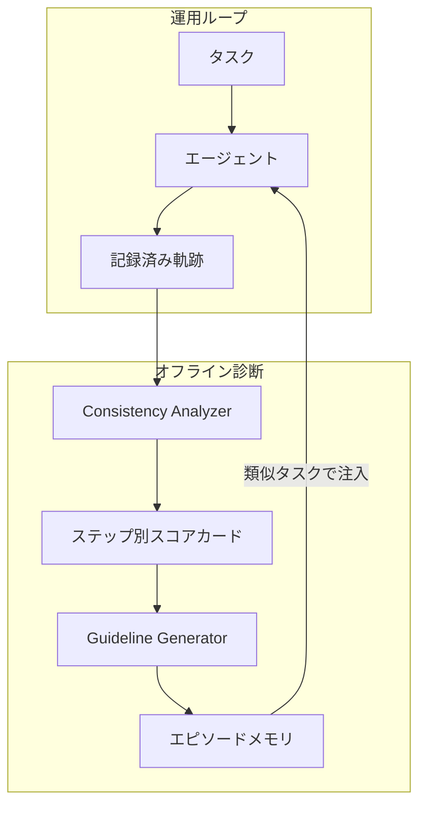

同じ依頼を何度か投げると、エージェントは当たったり外れたりします。
平均成功率だけを見て本番投入を決めると、その揺れが見えません。

IBM Research は、この揺れを **consistency gap** として定式化し、記録済み軌跡から不安定な判断箇所を特定する Consistency Analyzer を公開しました。
入口は Hugging Face の解説記事 [Your Agent Aced the Task. Will It Do It Again?](https://huggingface.co/blog/ibm-research/altk-evolve-consistency)（2026-09-15）です。
方法の本体は技術報告 [arXiv:2609.08832](https://arxiv.org/abs/2609.08832) と OSS リポジトリ [AgentToolkit/altk-evolve](https://github.com/AgentToolkit/altk-evolve) にあります。

本稿では、Analyzer が何をするか、3 指標の定義、公開数字の読み方、自環境で走らせるときの前提を整理します。

:::message
本稿の定量結果は、著者が AppWorld `test_normal`（168 タスク）で ReAct を回した自己報告です。
:::


*この記事の全体像。以下、順に解説します。*

## Consistency Analyzerとは

Consistency Analyzer は、記録済み軌跡の各判断ステップに対して、同じプロンプトを複数回サンプリングし、応答のばらつきから揺れやすい箇所を特定します。
その診断を短い consistency guideline に変え、類似タスクのプロンプトへ注入します。

対象は、平均成功率だけで本番投入を決めたくない発注側です。
モデル内部の logits は使いません。記録済みプロンプトを LLM エンドポイントへ再発行する black-box 診断です。
新しいツール呼び出しやアプリ操作は走らせません。環境は再実行しません。

3 指標を並べます。

| 指標 | タスク単位の定義 | 答える問い |
|---|---|---|
| Pass@k | k 回のうち 1 回以上成功 | 能力の上限。検証してやり直せるとき |
| Mean@k | k 回の平均成功率 | よく出る「精度」 |
| Pass^k | k 回すべて成功 | 同じ依頼を毎回通せるか |

**consistency gap** は Mean@k から Pass^k を引いた差です。
見かけの精度のうち、繰り返しで消える分です。
**normalized consistency** は Pass^k / Mean@k です。

揺れやすいステップは、strategy / recovery / optimization の短い指示にし、既存の ALTK-Evolve メモリへ入れます。
OSS は `altk-evolve` v1.2.0（2026-09-14）、Apache-2.0、Python 3.12 以上です。

モードは環境変数 `EVOLVE_GUIDELINES_MODE` が `standard` / `consistency` / `all` です。
consistency 側に `fast` と `accurate` があります。
既定モード `standard` では consistency は動きません。

処理は運用ループとオフライン診断に分かれます。



Analyzer は各ステップの応答集合から集中度を出します。

- 自由文: 文埋め込みの平均ペアワイズ余弦類似度
- ツール名や引数: Jaccard
- 構造化応答: フィールド加重和

軌跡スコアはステップ平均です。
閾値を超えた不安定ステップだけが guideline 生成の入力になります。

フル Evolve（MCP / CLI）だけが Analyzer を持ちます。
Evolve Lite はホストエージェント内の skill であり、このパイプラインの対象外です。

## 注意点

Hugging Face ブログは「gap を半分にする」「診断に grader もライブ再実行も不要」と書きます。
論文は同じ数字を出しつつ、次を自分で制限しています。

- Analyzer は**安定性**を採点します。正しさの検証器ではありません。自信のある誤判断は consistent に見えます
- 論文は inconsistency の解消を主張していません。Hard では gap が大きく残ります
- guideline は生成後すぐメモリへ入ります。効果確認の validation stage は future work です
- Pass^5 の比較は、ベースラインと guideline 注入でプラットフォーム側の非決定性が同程度だと仮定します。著者はその仮定を測定も制御もできないと書きます
- 評価は AppWorld シミュレータです。初期状態をリセットできます。非冪等な外部操作の代理実験ではありません

公開ドキュメントと論文評価は、再サンプル回数も既定パイプラインも一致しません。

| 経路 | 再サンプル | 備考 |
|---|---|---|
| 論文 §4.1 の Analyzer | N=30、temperature 0.5 | 論文 Table の guideline を作った側 |
| 製品 YAML `agent_config.yaml` | `max_samples: 5`、`max_steps: 15` | ブログの診断側 k=5 に近い |
| コード既定 `EVOLVE_CONSISTENCY_METHOD` | **fast**（再サンプルしない） | 論文 Table の効果を再現した一次数字は無い |
| 論文の same-task +16.0 pp | タスクを k=5 回実行した Pass^5 | Analyzer の N=30 とは別の数字 |

公開 GitHub Pages は `regular` / `both` のままです。
コードは未認識値に warning を出し、`standard` へフォールバックします。
Pages の値を環境変数に書くと、consistency パイプラインは動きません。
Pages は consistency を常に再サンプルと書き、削除済みの閾値 env も残しています。
正本は GitHub raw の [`docs/guides/guidelines.md`](https://github.com/AgentToolkit/altk-evolve/blob/main/docs/guides/guidelines.md) です。

論文ライセンスは CC BY-NC-ND 4.0 です。
コードは Apache-2.0 です。
数字の商用二次利用は論文条項を別途確認します。

2026-04-08 の Evolve ブログは AppWorld 公式の Scenario Goal Completion を baseline 50.0% から 58.9%（+8.9）と報告します。
Fang et al.（[arXiv:2603.10600](https://arxiv.org/abs/2603.10600)）の最良設定は 50.0% から 64.3% です。
IBM 発表文（2026-04-07）は Δ のみ（+8.9、Hard +14.2）を書きます。
これらは 2026-09 の Mean@5 77.4% / Pass^5 53.0% と混ぜません。
公式 SGC はシナリオ 3 変異のすべて成功です。IBM の Pass^5 は同一タスク 5 回です。

## 3つの指標をどう読むか

タスク t を k 回独立に実行し、各回の成否を 0/1 で持ちます。
ベンチマーク値はタスク平均です。
Bernoulli 成功率 p のとき、期待値は p^k ≤ p ≤ 1-(1-p)^k です。

τ-bench（Yao et al., [arXiv:2406.12045](https://arxiv.org/abs/2406.12045)）が pass^k を導入しました。
そこでは n 試行中 c 成功に対する不偏推定量 C(c,k)/C(n,k) を使います。
IBM 論文はちょうど k 回の指示関数平均です。
k=n なら一致します。
二次の解説が Pass^k を (c/n)^k と書くことがあります。
それはタスク内成功率の冪であり、IBM の「全試行成功したタスクの割合」ではありません。

similar-task 実験は同一シナリオの別変異へ guideline を転送します。
公式 SGC そのものではありません。

論文は、トークン分布が平坦だと、ホスト推論の微小な摂動で 1 位が入れ替わると説明します。
greedy や固定 seed は「分布からトークンを取る方法」だけを固定します。
ホスト側で分布そのものが走ごとに少し動きます。
ブログは評価用 ReAct を temperature 0.0 で走らせたと書きます。
Analyzer の再サンプル温度は論文評価もコード既定も 0.5 です。

## AppWorldでの実験結果

条件は次です。

- AppWorld `test_normal` 168 タスク、ReAct、k=5
- GPT-4.1 は Azure、GPT-OSS-120B は AWS
- guideline はタスクあたり 1 本のベースライン軌跡から生成
- same-task は同一タスクの新しい 5 回、similar-task は同一シナリオの別変異へ注入
- 数字の内訳は論文 Appendix Table 1-2。ブログが書いた合計と主要 Δ は表と一致する

### GPT-4.1

| 条件 | Pass^5 | Mean@5 | Gap | Consistency |
|---|---|---|---|---|
| 合計 baseline | 53.0% | 77.4% | 24.4 pp | 0.68 |
| 合計 same-task | 69.0% | 81.0% | 12.0 pp | 0.85 |
| 合計 similar-task | 66.0% | 79.5% | 13.5 pp | 0.83 |
| Easy same-task Δ | +12.2 pp | +3.5 pp | | |
| Medium same-task Δ | +22.9 pp | +6.2 pp | | |
| Hard same-task Δ | +14.3 pp | +1.6 pp | | |
| Hard similar-task | 43.6% | 61.1% | 17.5 pp | 0.71 |

Hard similar-task の Mean@5 は baseline 61.9% から 61.1% へ **−0.8 pp** です。
結論の「accuracy を落とさない」は、Hard の変異転送では成り立ちません。
Hard は guideline 後も Pass^5 が半数未満です。

本文 §2.2 は合計 Consistency を 0.69 と書きます。
Table 1 は 0.68 です。
53.0/77.4 は約 0.685 であり、丸めの差と読みます。

混在タスク（成功と失敗が同居）は本文でベンチの約 32% です。

### GPT-OSS-120B

| 条件 | Pass^5 | Mean@5 | Consistency |
|---|---|---|---|
| 合計 baseline | 10.1% | 33.9% | 0.30 |
| 合計 same-task | 16.1% | 38.7% | 0.42 |
| 合計 similar-task | 18.8% | 40.5% | 0.46 |
| Hard baseline | 0.0% | 9.5% | 0.00 |
| Hard same-task | 1.6% | 12.7% | 0.13 |

弱いモデルでは、guideline だけでは Hard の全試行成功に届きません。
similar-task の Pass^5 増分（+8.7 pp）が same-task（+6.0 pp）を上回ります。
著者は再利用可能な失敗パターンを拾った可能性を挙げます。

### 診断の副次信号

公式 `test_challenge`（417 タスク）から抜いた 50 タスクについて、各 1 軌跡の平均 consistency で合否を予測した AUROC は 0.699 です。
導入は 0.69 と書きます。
著者は acceptable predictor とします。
本番の ground-truth 代替としては弱い数字です。

独立グループによる 77.4 / 53.0 の再測定は、本稿の参照範囲では確認できませんでした。

## 走らせ方と運用の前提

調査時点（2026-09-17）の `gh repo view` は、star 約 110（整数 111）、`pushedAt` 2026-09-16、非アーカイブ、homepage は GitHub Pages です。

論文数字に近い診断を製品で期待するなら、`consistency` と `accurate` を明示します。

```bash
export EVOLVE_GUIDELINES_MODE=consistency
export EVOLVE_CONSISTENCY_METHOD=accurate
uv run evolve sync phoenix --guidelines-mode consistency --consistency-method accurate
```

Python 入口は `generate_consistency_guidelines`（accurate）と `generate_consistency_guidelines_fast`（fast）です。

accurate の再サンプルは `litellm.completion(..., n=samples)` をステップごとに 1 回呼びます。
`n>1` をプロバイダが無視し choices が 2 未満なら `EvolveException` で止まります。
失敗時は最大 3 試行（再試行は最大 2 回）です。
`max_tokens` 上限は 3000 です。
論文のフラグ閾値は consistency スコア θC=0.85 です。
製品 YAML の不確実性閾値は 0.2 / 0.1 で、0.2 は consistency 0.8 相当です。

混在プロバイダの Phoenix 同期では、`EVOLVE_CUSTOM_LLM_PROVIDER` が全ステップに載ります。
`OPENAI_API_KEY` があるだけで openai に寄ることがあります。
公式 docs は、プロバイダごとに accurate を分けるか、fast に倒せと書きます。

ホスト型製品ではありません。

| 項目 | 結果 |
|---|---|
| レート制限 | Evolve 自体に RPM 表は無い。下流 LLM の制限 |
| SLA / リージョン | 自己ホスト。製品 SLA は確認できなかった |
| 課金 | ライブラリ無償（Apache-2.0）。LLM は利用者負担 |
| Colab | 公式ノートは確認できなかった |
| 認証 | 利用者の API キー。Evolve 固有 IAM は無い |
| REST 公開エンティティ | README が Phase 1C で未実装と書く |
| インストール | `pip install altk-evolve`。docs の `evolve[tracing]` はパッケージ名が古い |

## 本番判断に使う範囲

Mean@k と Pass^k を併記する価値は高いです。
履歴上の LLM 再サンプルは、ツールを再実行できないときに「判断の平坦さ」を見る道具になります。
ただし本番ゲートの代替にはなりません。

支持できる点は次です。

- Table 1 で GPT-4.1 の gap が 24.4 pp から 12.0 pp へ縮小する
- similar-task でも Pass^5 が +13.0 pp 動く
- 診断が black-box で、grader 無しと論文が設計する
- τ-bench 以降、全試行成功を信頼性の指標にする流れがある

反証と限界は次です。

- 安定した誤りを固定し得る（論文 §6）
- 上流の不安定決定の伝播を平均集約は罰しない
- Xiong et al. 2025（[arXiv:2505.16067](https://arxiv.org/abs/2505.16067)）は、類似入力への経験追従が誤りを増幅すると示す。論文自身が引用し、検証無し投入を残している
- 公開既定 fast は論文 Table の効果を再現した一次数字が無い
- 評価は ReAct × 2 モデル × AppWorld のみ。他スタックは informal で未定量
- Jaccard 符号や resampling 早期終了の修正は v1.1.5（2026-07-24）で、論文投稿（2026-09-08）より前である。評価コードがその修正前スナップショットかは不明である

残る未解決は次です。

- 論文が言及する sample-budget sensitivity の表は、HTML 版から数値を取り出せなかった
- `fast` と `accurate` の効果差
- temperature 0 の本番分布と、診断時 temperature 0.5 の分布のずれ
- 独立再現
- confidently-wrong かつ consistent なステップの件数

指標追加は止めません。
Analyzer を唯一の本番ゲートにすることは止めます。
「履歴診断があれば本番で毎回成功する」は支持できません。
再実行不能業務で使えるのは、**記録済み文脈における判断の平坦さの観測** までです。

自環境へ持っていくなら、次を固定します。

1. **評価レポートに Mean@k と Pass^k を併記する。** 再試行できる仕事は Pass@k、無人で毎回通す仕事は Pass^k を主指標にする。k=3 でも gap は見える、とブログは書きます
2. **履歴診断を使う条件を限定する。** 記録済みプロンプトの LLM 揺れを見る。環境変化、非冪等 API、課金操作の再現性は別途測る
3. **論文数字を製品で期待するなら** `consistency` + `accurate` を明示する。Pages の `regular`/`both` は使わない。Lite では Analyzer は動かない
4. **guideline は検証してからメモリへ入れる。** 論文の future work を運用で先にやる。無検証の自動投入はしない
5. **Hard 相当のタスクでは Pass^k 単独で go しない。** GPT-4.1 でも guideline 後 Pass^5 は半数未満である

逆転条件は次です。

- 独立再現で gap が消える
- 自前トラフィックで Pass^k と Mean@k がほぼ一致する
- 対象業務が「1 回当たればよく、人間が検証する」

## まとめ

Consistency Analyzer は、記録済み軌跡を再サンプルして揺れやすい判断ステップを特定し、短い guideline としてメモリへ戻す診断です。
Mean@k と Pass^k を併記すると、平均成功率では見えない反復の穴が数字になります。

公開数字は AppWorld の自己報告です。
Analyzer は正しさの検証器ではなく、Hard では gap が残ります。
guideline の自動投入は論文自身が未検証です。
製品で論文に近い診断を期待するなら、`consistency` と `accurate` を明示し、Pages の古いモード名は使いません。

発注側が今できることは、指標の併記と、履歴診断の適用範囲の限定です。
本番ゲートは、環境再実行と業務側の合否を別途持つ必要があります。

この記事が少しでも参考になった、あるいは改善点などがあれば、ぜひリアクションやコメント、SNSでのシェアをいただけると励みになります！

## 参考リンク

1. Duesterwald, Elder, Ngweta, Ubaru, Zimon. *Closing the Consistency Gap: Self-Evolving Agents That Learn to Stay on Course*. arXiv:2609.08832v1, 2026-09-08. https://arxiv.org/abs/2609.08832
2. IBM Research. *Your Agent Aced the Task. Will It Do It Again?* Hugging Face blog, 2026-09-15. https://huggingface.co/blog/ibm-research/altk-evolve-consistency
3. AgentToolkit. *altk-evolve* v1.2.0. https://github.com/AgentToolkit/altk-evolve
4. Official docs（GitHub raw を正本とする）. https://github.com/AgentToolkit/altk-evolve/blob/main/docs/guides/guidelines.md
5. Yao, Shinn, Razavi, Narasimhan. *τ-bench*. arXiv:2406.12045, 2024. ICLR 2025
6. Trivedi et al. *AppWorld*. ACL 2024. arXiv:2407.18901
7. Fang et al. *Trajectory-Informed Memory Generation for Self-Improving Agent Systems*. arXiv:2603.10600, 2026-03-11
8. IBM Research. *ALTK-Evolve: On-the-Job Learning for AI Agents*. Hugging Face blog, 2026-04-08. https://huggingface.co/blog/ibm-research/altk-evolve
9. Chen et al. *Evaluating Large Language Models Trained on Code*. arXiv:2107.03374, 2021（Pass@k）
10. Xiong et al. *How Memory Management Impacts LLM Agents*. arXiv:2505.16067, 2025
11. IBM. *ALTK Evolve: On-the-job learning for AI agents now ready for builders*. 2026-04-07. https://www.ibm.com/new/announcements/altk-evolve-on-the-job-learning-for-ai-agents
