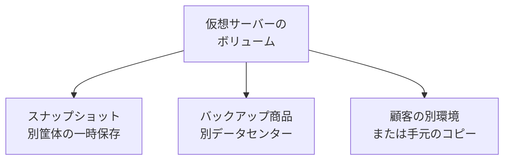

2026年10月7日午前3時40分頃から、株式会社IDCフロンティアのパブリッククラウド「IDCFクラウド」で、東日本リージョン1の一部への第三者による不正アクセスの障害が続いています。2026年10月8日の[第3報](https://www.idcf.jp/news/topics/20261008001)は、対象を tesla、henry、pascal、joule の4ゾーンに絞りました。同報は、この4ゾーンに保管された顧客データについて、取り出しや復元が困難な見通しであり、現時点の見解では顧客自身が保持するバックアップからのみ復元できる、と述べています。

数値と範囲は、2026年10月9日時点のIDCフロンティアの公式トピックス、重要事項説明書、SLA、バックアップ仕様、および顧客4者の一次発表に限ります。この記事は、障害の範囲と保管先の仕様を先に置き、数値と文言の読み方をその後に整理し、発注側が復元計画に数えるコピーの条件を最後に示します。

*この記事の全体像。以下、順に解説します。*

## IDCFクラウドの障害とは

IDCFクラウドは、株式会社IDCフロンティアが提供するパブリッククラウドです。第3報が書く発生事象は、仮想サーバーの停止と、再起動不可です。

### 公表の範囲

[第1報](https://www.idcf.jp/news/topics/20261007001)（2026年10月7日）の原因は、第三者からの不正アクセスです。影響範囲は東日本第1リージョンです。対象顧客へ個別連絡する、とあります。

[第2報](https://www.idcf.jp/news/topics/20261007002)（同日）は、東日本リージョン1の障害が第三者からのランサムウェア攻撃であると書いています。影響範囲の表記は「IDCFクラウドを契約している495の企業や自治体」です。東日本リージョン1のネットワーク遮断とシステム停止は、この時点で完了とあります。遮断の理由は「二次被害やデータ漏えいを防ぐために」です。

第3報（2026年10月8日）の対象は、東日本リージョン1の tesla、henry、pascal、joule の4ゾーンです。影響範囲の表記は「IDCFクラウドをご契約いただきご利用中の495の企業や自治体」です。対象顧客へ個別連絡する、とあります。原因は、第三者からの不正アクセス（ランサムウェア攻撃）です。詳細な影響範囲や侵入経路は調査中、とあります。

第3報は、この4ゾーンに保管されている顧客データについて、取り出しや復元が困難な見通しである、と書きます。現時点の見解では、データの復元は顧客自身が保持しているバックアップからのみ可能である、とも書きます。4ゾーンの顧客には、別環境を準備して再構築し、復元は顧客自身のバックアップから行うよう案内しています。

第3報が、不正アクセスは確認されていない、と書く範囲は次です。

- 東日本リージョン1の radian、newton
- 東日本リージョン2
- 東日本リージョン3
- 西日本リージョン1

これらの利用者には、顧客自身でバックアップを取るよう案内し、取得手法は事業者から順次案内する、とあります。

第3報の注は、IDCFクラウド Type S（旧ホワイトクラウド ASPIRE）と IDCF プライベートクラウドを、本事象の対象外とします。

2026年10月9日時点の[トピックス一覧](https://www.idcf.jp/news/topics/)で、本件の最新記事は第3報です。

### ゾーン、リージョン、エリア

[セキュリティ FAQ](https://www.idcf.jp/cloud/security/faq.html)の定義は、次のとおりです。

| 語 | 公式の定義 |
|---|---|
| エリア | データセンターのある物理的に離れた地域 |
| リージョン | 複数のゾーンを管理する集合 |
| ゾーン | 仮想マシンを構成するサーバー、ストレージ機器等の物理的な設備の集合 |

[リージョンとゾーンの説明](https://www.idcf.jp/cloud/spec/region_zone/)は、ゾーンごとに仮想マシンのサーバー、ストレージ、それらを収容するラック、電源にいたるまで物理設備が分離される、と書きます。東日本リージョンと西日本リージョンは完全に独立し、地理的に離れた領域で、外部インターネット接続も分離される、とも書きます。

同ページの表は、東日本エリアの立地を福島県白河市（福島白河データセンター）、西日本エリアの立地を福岡県北九州市（福岡北九州データセンター）としています。東日本リージョン1のゾーン列は、tesla、pascal、henry、joule、radian、newton です。

### スナップショットの仕様と料金

[スナップショットの仕様](https://www.idcf.jp/cloud/spec/snapshot/)は、ある時点のボリューム（仮想マシン用ディスク）を一時的に保存する機能である、と書きます。保存先は、仮想マシンにアタッチするボリュームとは物理的に異なる筐体です。同じページは、長期保存が目的ではなく一時保存として使うよう書き、定期スナップショットはバックアップ用途として活用する、と併記します。万一の場合に、保存時点と同様の仮想マシンを新規作成でき、早期復旧に役立つ、とも書きます。

ハードウェア専有マシンのデータディスクは、スナップショットを作成できません。

仕様ページの注は、作成可能なスナップショット数の合計を 1,000 とします。保存できるアーカイブ容量（テンプレート、スナップショット、ISO の合計）の上限は 20TB です。保存料金のページ表示（税抜き）は 0.06円/GB/時で、括弧内の月額上限は 30円/GB です。

[料金 FAQ](https://faq.idcf.jp/faq/show/155)は、保存可能な上限をリージョンごとに 1,000 個とします。1つのスナップショットの月内保存が 500時間（約20日）を超えると月額上限 30円/GB が適用され、500時間に満たないときは 0.06円/GB/時です。同じ FAQ は、取得間隔を DAILY または WEEKLY にすると 1つのスナップショットの保存時間が 500時間に満たないため月額上限は適用されない、と書きます。MONTHLY は 500時間を超えるため月額上限が適用される、とも書きます。表示価格は税抜きです。FAQ の例は、ボリューム 100GB、保存数 1 のとき、DAILY の31日分が 4,464円、WEEKLY の4週間分が 4,032円、MONTHLY の1か月分が 3,000円です。

### バックアップ商品の仕様

IDCFクラウド バックアップは、スナップショットとは別の商品です。[料金ページ](https://www.idcf.jp/cloud/backup/)の表示（税抜き）は、対象サーバー 3,500円/月、データ 5円/GB/月です。同じページは、保存先を対象と異なる拠点のクラウドストレージとし、現在は東日本エリアである、と書きます。西日本リージョンの指定はできません。イミュータブルストレージは選択可能、とあります。

[仕様書 Version 1.1](https://www.idcf.jp/pdf/cloud/pdf/backup/backup_spec.pdf)（2025年8月8日施行）は、保管するクラウドストレージが、IDCFクラウドが稼働するデータセンターとは異なるデータセンターで稼働し、現在は東日本エリアに存在する、と書きます。イミュータブル設定は可能で、デフォルトは無効です。希望する場合はサポートへチケットを出します。このサービスは SLA の対象外です。リストアによる復旧の完全性は保証しません。リストア後に正常動作することを確認するのは顧客です。

### 重要事項とコンピュートの SLA

[重要事項説明書 ver4.12.0](https://www.idcf.jp/pdf/common/importantnotice.pdf)は、顧客が同一データを自らバックアップとして保存し、会社は保管、保存、バックアップに一切責任を負わない、と書きます。参考 FAQ の問いは「顧客側でバックアップデータを取得してさえしていれば、いざという場合はすぐに復旧できるのですか？」です。答えは「バックアップデータを取得しているからといって、いざというときにすぐに復旧できるとは限りません」です。取得対象、サイクル、保存期間を用途に合わせ、復旧手順を定義し、事前に検証し、トレーニングすべき、とも書きます。

[コンピュートの SLA](https://www.idcf.jp/cloud/sla/cloud/)は、対象プランに限って、仮想マシンの月間稼働率と、インターネット接続の月間可用性を、それぞれ 99.999% 以上とします。対象は Light、Economy、Standard、HighCPU、HighMEM、UltraMEM、Tank です。ハードウェア専有マシン（HighIO、GPU BOOST）は、仮想マシン SLA もインターネット接続 SLA も対象外です。

稼働率が 99.999% 未満のときの減額上限は、該当仮想マシンの仮想マシン費用および関連オプションの月額費用（税抜き）の 10% です。インターネット接続の可用性が 99.999% 未満のときの減額上限は、該当する本サービス利用契約の月額費用（税抜き）の 10% です。

減額は Severity1 のみです。Severity1 の定義は「全面的にサービスが提供不可となった場合」です。申請は事由発生から14日以内であり、顧客が申請しない限り減額しません。品質保証の免責に「外部からの攻撃、妨害などによる場合」があります。

同じ SLA の注意事項は、データは顧客に帰属し、保管は顧客の責任でバックアップする、と書きます。

### 管理コンソール

第3報は、東日本リージョン1のネットワーク遮断とシステム停止を 2026年10月7日に完了した、と書きます。東日本リージョン1の管理コンソールも停止しています。東日本リージョン1以外でも、顧客が外部から使う管理コンソールを停止しています。仮想サーバーの起動と停止は、顧客の要望に従い事業者が代行します。安全性が確認でき次第、管理コンソールの再開を予定する、とあります。

### 公式が分ける保管先

公式の仕様が分ける保管先は、ボリューム、別筐体のスナップショット、別データセンターのバックアップ商品、顧客が別環境または手元に持つコピーです。

スナップショットの公式説明は、別筐体である、と書きます。別ゾーンや別データセンターへ自動複製する、という記載は、同じ説明にありません。バックアップ商品の保存先は、仕様書上は別データセンターで、現在は東日本エリアです。

## 注意点

### 495と復元文言の読み方

495 は、データが失われた組織の数ではありません。第2報は「IDCFクラウドを契約している495の企業や自治体」と書き、第3報は「ご利用中の495」を維持したまま、データ取り出しの困難な見通しを4ゾーンに絞りました。公式は、495組織のデータがすべて失われたとは書いていません。

第3報の復元に関する文言は「困難な見通し」と「現時点での当社の見解」です。確定した全損ではありません。

攻撃者が主張する削除件数や容量を、公式が裏取りした発表は、2026年10月9日時点の公式トピックスにはありません。この記事では、その件数と容量を事実として書きません。

漏えいについて、公式は「二次被害やデータ漏えいを防ぐために」遮断したと書きます。漏えいがあったとも、無かったとも、公開の第3報は結論していません。

### SLA が保証する範囲

99.999% は、掲載された仮想マシンタイプの月間稼働率と、インターネット接続の月間可用性です。ハードウェア専有マシン（HighIO、GPU BOOST）は対象外です。減額の上限は、上記の2種類の月額費用（税抜き）の 10% です。データが戻ることや、復元にかかる時間は、この SLA の保証文にはありません。外部からの攻撃は、品質保証の免責に列挙されています。今回の障害に減額が適用されるかは、2026年10月9日時点の公式トピックスでは書かれていません。申請期限は事由発生から14日以内です。

### 同じクラウドの中のコピー

別筐体のスナップショットは、別ゾーンや別クラウドのコピーではありません。仕様ページが書く「早期復旧」は、保存時点と同様の仮想マシンを新規作成できる、という説明です。4ゾーンのスナップショットが残っているかは、2026年10月9日時点の公式トピックスと、この記事で確認した顧客一次には書かれていません。そこから戻せた顧客の一次も、同じ範囲では見つかっていません。

作成数の上限は、仕様ページが「合計 1,000」、料金 FAQ が「リージョンごとに 1,000個」です。単位が違うため、1つの天井としては読めません。

バックアップ商品の保存先は、仕様上は IDCFクラウドが稼働するデータセンターとは別で、現在は東日本エリアです。東日本エリアの立地は、リージョンの表では福島県白河市です。その保管先が今回生きていたか、そこからリストアできたかは、2026年10月9日時点の公式トピックスと、この記事で確認した顧客一次には書かれていません。イミュータブルはデフォルトで無効です。この商品は SLA の対象外です。

ゾーンごとのラック分離は、公式の説明にあります。今回は tesla、henry、pascal、joule の4ゾーンが同時に第3報の対象になりました。ラックが分かれていることは、この4ゾーンが同時に対象にならなかったことにはなっていません。radian と newton は同じ東日本リージョン1の別ゾーンであり、第3報は不正アクセスを確認していない、と書きます。東日本リージョン1のネットワーク遮断は、第3報がリージョン単位で完了した、と書く対応です。

### 顧客発表の読み方

シックス・アパートの機能ページは「万が一 Movable Type クラウド版のデータセンターがサービス不能に陥った場合も、シックス・アパート側で前日のデータで復元可能です」と書きます。同じ段落は、最新データ（午前1時時点）を Google Cloud Storage（東京リージョン）に7日間保存する、とも書きます。「前日」は、この午前1時時点の呼び方です。

障害対応で使った世代は、2026年10月7日午前1時です。障害開始の公表時刻は同日午前3時40分頃です。午前1時から午前3時40分までの差は約2時間40分であり、公表時刻の差の計算です。実データの欠損量は発表されていません。

SKIMA の 2026年10月8日の公式投稿は、停止直前までのバックアップがあり、データは残っている、という趣旨です。この文は投稿の要旨であり、文言の引用ではありません。残っている場所は、投稿が明示していません。新しい環境へ移している、とも書いています。復旧完了の宣言ではありません。同じ投稿は、メールアドレスや電話番号などについて「現時点で IDCF側から情報漏洩は確認されていないとの回答」を受けた、と書いています。これは顧客が受けた回答の転記であり、IDCフロンティアの否定宣言ではありません。

ポピンズの第2報は、平常時から電話、電子メール、対面を組み合わせているため、事業運営への大きな影響は生じていない、と自己申告しています。影響の定量値はありません。「極めて僅か」という語はありますが、件数や時間の定義はありません。

被害が確認されていないゾーンでも、管理コンソールは停止しています。第3報は、バックアップは顧客自身で行うよう案内し、取得手法は順次案内する、と書きます。仮想サーバーの起動と停止は、事業者が代行します。コンソールの停止は、4ゾーンのデータを事業者が取り出せる、という意味ではありません。

## 4つの保管先はどこまで分かれているか

| 置き場 | 公式が言う分離 | 今回そこから戻せた顧客一次 | 復元の責任 |
|---|---|---|---|
| 仮想サーバーのボリューム | 4ゾーンが第3報の対象 | 第3報は取り出し困難な見通し | データ保管は顧客責任 |
| スナップショット | ボリュームと別筐体。別ゾーンへの自動複製は仕様に無い | 2026年10月9日時点の確認範囲では見つかっていない | 顧客の管理範囲 |
| IDCFクラウド バックアップ | 別データセンター。現在は東日本エリア。SLA 対象外 | 保管先の生死は公式トピックスに無い | リストア後の確認は顧客。完全性の保証なし |
| 別事業者または手元のコピー | 障害ドメインの外 | シックス・アパート、UDトーク、ポピンズは、別環境または手元からの再構築を書いている。SKIMA は残存場所を書いていない | 取得と復元手順は顧客、またはその SaaS 事業者 |

## 顧客4者は何を発表しているか

| 主体 | 一次の時点 | 書いていること | 完了と欠損 |
|---|---|---|---|
| シックス・アパート MTクラウド版 | [第2報](https://www.sixapart.jp/movabletype/news/2026/10/08-0900.html) 2026-10-08 09:00、[第3報](https://www.sixapart.jp/movabletype/news/2026/10/09-0900.html) 2026-10-09 09:00 | 東日本第1の31台。Google Cloud に7世代。第2報は IDCF 上の復旧見込みがない、と書き、10月7日午前1時の世代をさくらのクラウドへ順次移行中と書いた。第3報は、暫定対応として10月8日21時までに全31台の移行と案内を完了した、と書く | 移行の完了は宣言された。使った世代は午前1時のまま。欠損量は未宣言。障害は継続中 |
| SKIMA | [2026-10-08 の公式投稿](https://x.com/SKIMAjp/status/2108122192026411316)。[FAQ](https://faq.skima.jp/hc/ja/articles/59118835694361)は同投稿へ案内 | 停止直前までのバックアップがある、という趣旨。新環境へ移している | 完了も欠損量も未宣言。残存場所は不明 |
| UDトーク | [2026-10-07 の公式投稿](https://x.com/UDTalk/status/2107767706212815231)。[障害ページ](https://udtalk.jp/a20261007/)は同日更新 | 投稿は「復元は難しい」との連絡を受け、別基盤とローカルデータで再構築する、と書く。障害ページは、復旧の目処は立っていない、と書き、音声認識サーバーは稼働している、とも書く | 完了も欠損量も未宣言 |
| ポピンズ | [第2報](https://www.poppins.co.jp/hldgs/news/%e3%81%8a%e7%9f%a5%e3%82%89%e3%81%9b/%e3%80%90%e7%b6%9a%e5%a0%b1%e3%80%91%e5%bd%93%e7%a4%be%e5%88%a9%e7%94%a8%e3%81%ae%e5%a4%96%e9%83%a8%e3%83%87%e3%83%bc%e3%82%bf%e3%82%bb%e3%83%b3%e3%82%bf%e3%83%bc%e9%9a%9c%e5%ae%b3%e3%81%ab%e9%96%a2/) 2026-10-08 | 退避保管していたバックアップで、別データセンターへ再構築。社内で一部利用を開始 | 全面復旧の完了日は無い。大きな影響なしは自己申告 |

さくらのクラウドプランは、[2026年6月11日](https://www.sixapart.jp/movabletype/news/2026/06/11-1100.html)から提供されています。移行先の製品枠は、障害前からありました。機能ページは、午前1時時点を Google Cloud Storage（東京リージョン）に7日間保存する、と書きます。

## 発注側は何を復元手段として数えるか

第3報の時点では、4ゾーンのデータの復元は、顧客が保持するバックアップから行う、という見解です。発注側が実効手段と数えてよいのは、そのクラウドの外にあり、別環境で戻す手順と所要時間を確認済みのコピーです。

この読み方を支える一次は、次のとおりです。

- 第3報は、4ゾーンの顧客に、別環境を準備して再構築し、復元は顧客自身のバックアップから行うよう案内しています。
- 重要事項説明書の FAQ は、バックアップを取得していてもすぐ復旧できるとは限らない、と障害前から書いています。
- シックス・アパートは、Google Cloud 上の 2026年10月7日午前1時の世代から、さくらのクラウドへ移しました。第2報は IDCF 上の復旧見込みがない、と書き、第3報は31台の暫定移行の完了を書いています。
- UDトークは、IDCFクラウドから「復元は難しい」との連絡を受け、別のクラウド基盤とローカルデータで再構築する、と 2026年10月7日の投稿に書いています。
- ポピンズは、退避保管していたバックアップで、別のデータセンター環境へ再構築している、と 2026年10月8日に書いています。
- SLA ページは、データ保管を顧客の責任とします。外部からの攻撃は品質保証の免責に入ります。

結論を弱める点は、次のとおりです。

- 「取り出せない」「顧客バックアップしかない」は、第3報の「困難な見通し」「現時点の見解」より強い言い方です。確定した全損としては書きません。
- SKIMA は残存データを確認した、という趣旨を書いています。場所は不明であり、IDCフロンティアが4ゾーンから取り出した証明ではありません。
- バックアップ商品は仕様上、別データセンターです。今回そこから戻せた一次が無いだけで、仕様の余地自体は残ります。
- 495 をデータ喪失件数として使うと過大になります。

弱まらないのは、別環境での復元手順と所要時間を、障害前に検証する、という後半です。重要事項の FAQ が同じことを書いています。シックス・アパートは移行の完了を宣言しましたが、午前1時以降の更新がどれだけ欠けるかは宣言していません。他の3者は、この記事が確認した一次では、全面復旧の完了も欠損ゼロも宣言していません。

この見方が覆るのは、次のときです。

1. 事業者が4ゾーンのデータを取り出したと、公式または顧客の一次が書く。
2. ゾーン内のスナップショットから復元できた顧客の一次が出る。
3. 個別契約が、ランサムウェア時のデータ復元を品質保証の対象にしている。

## いま未確認のまま残ること

- 4ゾーンのデータを、事業者が後から取り出せるか。
- スナップショットと、バックアップ商品の保管先が、今回残っているか。
- 4者の復旧がいつ完了し、午前1時以降や退避世代以降の更新がどれだけ欠けるか。シックス・アパートの31台は、暫定の移行完了が宣言されています。
- 漏えいの有無。公式は結論していません。
- 今回の利用料金に、SLA の減額が適用されるか。申請期限は事由発生から14日以内です。
- 被害が未確認のゾーンで、管理コンソールがいつ再開するか。

## 発注側が障害前に通しておく復元

発注側がデータの復元計画の本体にしてよいのは、障害が起きたクラウドの外にあるコピーです。戻す先は別環境であり、手順と所要時間は障害前に一度通してあることが条件です。重要事項の FAQ は、取得しただけではすぐ復旧できない、と既に書いています。

確認項目は、次の7つです。

1. コピーの置き場が、障害のあったクラウドの外にある。
2. 戻す先が、別環境である。
3. 手順と所要時間を、障害前に一度通した記録がある。
4. 同一クラウド内のスナップショットを、データが戻る計画の本体にしていない。スナップショットは別筐体の一時保存です。
5. 対象プランの稼働率 99.999% の減額条項を、データが戻る保証と読んでいない。減額は費用の 10% であり、外部攻撃は免責に列挙されています。ハードウェア専有マシンはこの SLA の対象外です。
6. IDCFクラウド バックアップを契約しているなら、保存先が東日本エリアであること、イミュータブルが既定で無効であること、SLA 対象外であることを契約確認の項目にしている。今回その保管先から戻せたかは、未確認のままです。
7. SaaS を使う側は、委託先の名前に加えて、事業者がバックアップをどのクラウドのどのリージョンに置き、最後にいつ別環境へ戻したかを確認する。シックス・アパートの事例では、コピーは Google Cloud（東京リージョン）にあり、戻す先はさくらのクラウドでした。機能ページの「前日」は、午前1時時点の世代を指します。

次に見るものは3つです。

1. IDCフロンティアの次報が、4ゾーンのデータを取り出せたかを書くか。
2. 顧客の一次が、復旧完了と、欠けた時間の範囲を書くか。
3. 自社のコピーが、障害ドメインの外にあり、別環境で戻す手順と所要時間の記録があるか。

## まとめ

2026年10月8日の第3報は、tesla、henry、pascal、joule の4ゾーンに保管されたデータの取り出しと復元が困難な見通しであり、現時点では顧客自身のバックアップからのみ復元できる、という見解を書きました。495 は契約・利用中の組織数の表記であり、データ喪失件数ではありません。99.999% の減額は、対象プランの稼働率とインターネット接続の可用性に対する費用の 10% であり、データの復帰時間を保証する文ではありません。

発注側が実効手段と数えてよいのは、そのクラウドの外にあり、別環境で戻す手順と所要時間を確認済みのコピーです。シックス・アパートは、2026年10月9日の第3報で、10月8日21時までに31台をさくらのクラウドへ暫定移行したと書きました。使った世代は10月7日午前1時であり、それ以降の欠損量は宣言されていません。同一クラウド内のスナップショットと、バックアップ商品の東日本エリア保管が今回生きていたかは、公式トピックス上は未確認です。

次に見るものは、4ゾーンのデータを事業者が取り出せたか、顧客一次が欠けた時間の範囲を書いたか、自社のコピーが障害の外で戻せる記録を持つか、の3つです。

この記事が少しでも参考になった、あるいは改善点などがあれば、ぜひリアクションやコメント、SNSでのシェアをいただけると励みになります！

## 参考リンク

- 第1報（2026-10-07）: [当社サービスの一部システムに対する不正アクセスについて](https://www.idcf.jp/news/topics/20261007001)
- 第2報（2026-10-07）: [【第2報】当社サービスの一部システムに対する不正アクセスについて](https://www.idcf.jp/news/topics/20261007002)
- 第3報（2026-10-08）: [【第3報】当社サービスの一部システムへの不正アクセスによる障害について](https://www.idcf.jp/news/topics/20261008001)
- 重要事項説明書 ver4.12.0: [PDF](https://www.idcf.jp/pdf/common/importantnotice.pdf)
- セキュリティ FAQ: [よくある質問](https://www.idcf.jp/cloud/security/faq.html)
- スナップショット仕様: [スナップショット](https://www.idcf.jp/cloud/spec/snapshot/)
- スナップショット料金 FAQ: [定期スナップショットの料金計算方法](https://faq.idcf.jp/faq/show/155)
- リージョンとゾーン: [リージョン・ゾーン](https://www.idcf.jp/cloud/spec/region_zone/)
- コンピュート SLA: [クラウドサービスSLA](https://www.idcf.jp/cloud/sla/cloud/)
- バックアップ商品: [バックアップ](https://www.idcf.jp/cloud/backup/)
- バックアップ仕様書 Version 1.1（2025-08-08 施行）: [PDF](https://www.idcf.jp/pdf/cloud/pdf/backup/backup_spec.pdf)
- シックス・アパート第1報: [Movable Type クラウド版におけるIDCFクラウド障害の影響と対応について](https://www.sixapart.jp/movabletype/news/2026/10/07-1530.html)
- シックス・アパート第2報（2026-10-08 09:00）: [第2報](https://www.sixapart.jp/movabletype/news/2026/10/08-0900.html)
- シックス・アパート第3報（2026-10-09 09:00）: [第3報](https://www.sixapart.jp/movabletype/news/2026/10/09-0900.html)
- MTクラウド版の機能（バックアップの説明）: [クラウド版独自の機能](https://www.sixapart.jp/movabletype/cloud/features.html)
- さくらのクラウドプラン提供開始（2026-06-11）: [提供開始のお知らせ](https://www.sixapart.jp/movabletype/news/2026/06/11-1100.html)
- SKIMA 2026-10-07: [公式投稿](https://x.com/SKIMAjp/status/2107789793103155436)
- SKIMA 2026-10-08: [公式投稿](https://x.com/SKIMAjp/status/2108122192026411316)
- SKIMA FAQ: [SKIMAへのアクセス障害につきまして](https://faq.skima.jp/hc/ja/articles/59118835694361)
- UDトーク 2026-10-07 投稿: [公式投稿](https://x.com/UDTalk/status/2107767706212815231)
- UDトーク障害ページ: [一部機能の障害について](https://udtalk.jp/a20261007/)
- ポピンズ第2報（2026-10-08）: [続報](https://www.poppins.co.jp/hldgs/news/%e3%81%8a%e7%9f%a5%e3%82%89%e3%81%9b/%e3%80%90%e7%b6%9a%e5%a0%b1%e3%80%91%e5%bd%93%e7%a4%be%e5%88%a9%e7%94%a8%e3%81%ae%e5%a4%96%e9%83%a8%e3%83%87%e3%83%bc%e3%82%bf%e3%82%bb%e3%83%b3%e3%82%bf%e3%83%bc%e9%9a%9c%e5%ae%b3%e3%81%ab%e9%96%a2/)
