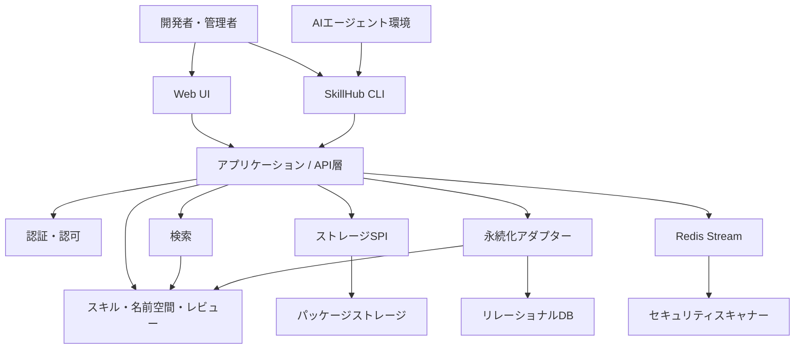
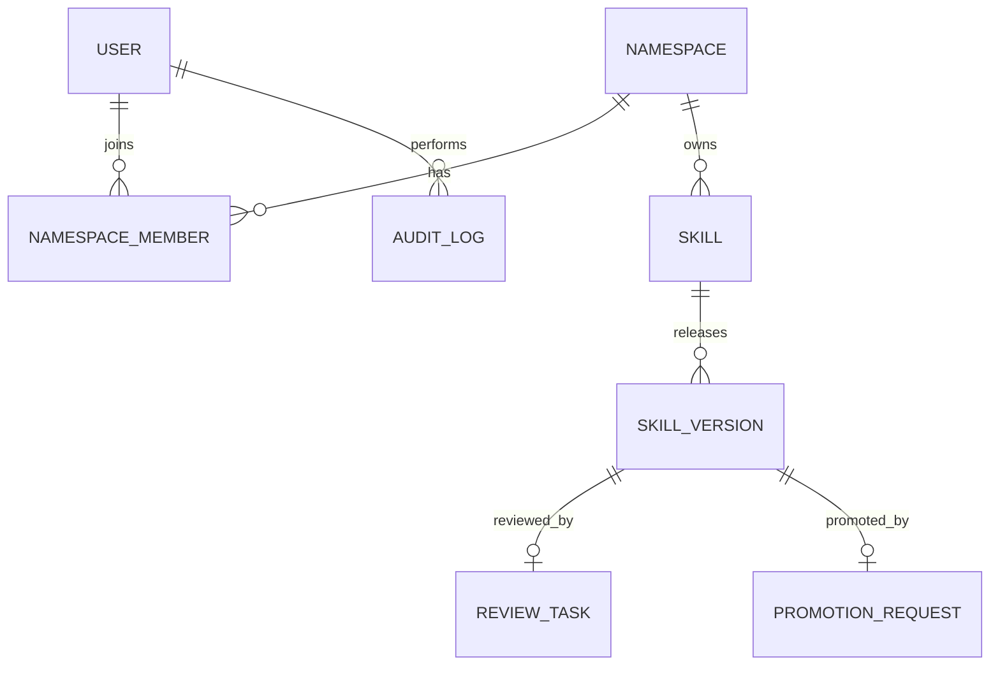
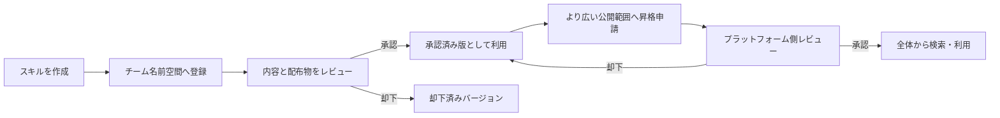

AIコーディングエージェントで使うスキルが増えると、配布用ディレクトリへファイルをコピーするだけでは管理しきれなくなります。誰が公開したのか、どの版を使うのか、全社公開してよいのか、問題が起きたときに操作を追跡できるのか、といった課題が残るためです。

[SkillHub](https://github.com/iflytek/skillhub) は、こうした課題に対して、スキルの登録、検索、バージョン管理、名前空間、レビュー、権限管理、監査をまとめて扱うセルフホスト型のOSSレジストリです。本記事では、2026年7月31日に取得した`main`ブランチのコミット[`c1b44d01be9a605f363e609bca8786fd2b47931c`](https://github.com/iflytek/skillhub/tree/c1b44d01be9a605f363e609bca8786fd2b47931c)とプロジェクト同梱ドキュメントをもとに、SkillHubの構造、データモデル、導入時の考え方を整理します。


## SkillHubが解く問題

スキルは、単なるMarkdownファイルとは限りません。説明を記した`SKILL.md`に加えて、プロンプト、スクリプト、テンプレート、参照資料をひとまとまりで配布する場合があります。組織でこれを共有するには、少なくとも次の管理が必要です。

- スキル名とバージョンの一意な識別
- チーム単位の公開範囲とメンバー管理
- 公開前のレビューと承認履歴
- パッケージ本体と検索用メタデータの保存
- 誰が何を変更したかを追える監査ログ
- 複数のAIエージェント環境へ配布するためのクライアント

SkillHubは、これらを「スキル用のプライベートレジストリ」としてまとめます。汎用のパッケージレジストリでもバイナリは保存できますが、SkillHubの中心にあるのは、チームの境界やレビュー状態を含むスキル固有のライフサイクルです。

### 配布CLIとの違い

既存のスキル配布ツールとSkillHubは、担当する層が異なります。

| 選択肢 | 主な役割 | セルフホストの管理サーバー | サーバー側RBAC・レビュー・監査 | 組み込みスキャン |
|---|---|---|---|---|
| `skills.sh` / `npx skills` | 公開ソースの検索とエージェント環境への配置 | なし | なし | あり（skills.sh側の外部パートナー監査をCLIで表示） |
| `gh skill` | GitHub上での検索、公開、由来追跡、版固定 | なし | GitHubの権限・レビューを利用 | なし |
| SkillHub | 組織内レジストリでの統制と配布 | あり | あり | あり（Cisco製スキャナーをセルフホスト構成へ統合） |

つまり、配布CLIは「どこから取得して端末へ置くか」を、SkillHubは「組織内で何を承認済み資産として管理するか」を主に扱います。導入時の悪性スキル検査を研究するSkillGateのような手法とも競合せず、検査ロジックと、検査済み資産を統制・配布するレジストリという補完関係にあります。

## 全体構造

SkillHubは、大きくクライアント層、アプリケーション層、ドメイン層、永続化層に分けて捉えられます。



プロジェクトはWeb UI、CLI、サーバー側の複数モジュール、セキュリティスキャナーから構成されます。調査したコミットでは、Web UIにReact系の構成、サーバーにSpring Boot系の構成が使われています。公式アーキテクチャではドメインを最内層に置き、検索モジュールや永続化アダプターがドメインへ依存する方向です。スキルのメタデータとZIPなどのパッケージ実体は別々の保存先で扱えます。


### 二種類のデータを分けて考える

運用設計では、次の二種類を分けると理解しやすくなります。

| 種類 | 主な内容 | 保存先の役割 |
|---|---|---|
| メタデータ | ユーザー、名前空間、スキル、バージョン、レビュー、監査 | 検索、状態遷移、権限判定 |
| パッケージ実体 | `SKILL.md`、スクリプト、テンプレートなどの配布物 | ダウンロード可能な成果物の保管 |

本番運用では、DBだけをバックアップしてもスキル本体は復元できず、パッケージストレージだけでもレビュー履歴や権限関係は戻りません。両方を同じ復旧時点で扱う必要があります。

## ドメインモデル

SkillHubの中核は、`Namespace`、`Skill`、`SkillVersion`を軸にしたモデルです。ここにユーザーの所属、レビュー、監査が接続します。



| 要素 | 責務 |
|---|---|
| Namespace | チームや公開範囲の境界 |
| NamespaceMember | 名前空間内のメンバーとロール |
| Skill | 名前、説明、可視性などの論理的なスキル情報 |
| SkillVersion | バージョンごとの配布物と状態 |
| ReviewTask | 通常の公開レビューに関する申請と判定 |
| PromotionRequest | より広い公開範囲への昇格申請と判定 |
| AuditLog | 操作者、対象、アクション、時刻などの履歴 |

ここで重要なのは、スキルとバージョンが別の概念である点です。スキルの説明や検索単位を保ちながら、配布物はバージョンごとに固定できます。`latest`や`stable`のような可変タグを利用する場合でも、本番環境で再現性が必要な処理は具体的なバージョンへ固定する方が安全です。

なお、上の図は設計を理解するための概念モデルです。フィールド名や列挙値を外部APIの契約として利用する場合は、対象バージョンのAPI仕様と実装を確認してください。

## レビューと公開範囲

組織向けレジストリでは、「アップロードできる」ことと「全員へ配布してよい」ことを分ける必要があります。SkillHubは名前空間とレビューを組み合わせ、チーム内の管理と、より広い範囲への公開判断を分離します。



この構造により、各チームは自律的にスキルを改善しつつ、全社公開のゲートだけを中央管理できます。監査ログを合わせて利用すれば、公開判断だけでなく、メンバー変更や重要操作の追跡にもつなげられます。

通常公開の`ReviewTask`と、より広い範囲へ昇格する`PromotionRequest`は別のモデルです。また、レビューを却下されたバージョンは`REJECTED`となり、申請者がレビューを撤回して`DRAFT`へ戻す遷移とは区別されます。修正後は、新しい配布物として再度登録・申請する前提で運用フローを設計します。

## アップロード時のセキュリティスキャン

調査したコミットの標準Compose構成には`skill-scanner`が含まれます。SkillHubが担うのは統合、タスク制御、結果保存などで、解析エンジン本体にはCiscoの`cisco-ai-skill-scanner`を利用します。サーバー側の`SecurityScanService`が検査タスクをRedis Streamへ送り、コンシューマーがスキャナーを実行する非同期経路です。

通常のスキャンはアップロード処理をブロックせず、非同期に進みます。Scanner APIの呼び出しに失敗した場合は、既定の再試行後に`SCAN_FAILED`へ遷移し、人によるレビュー用の`ReviewTask`が作られます。一方、Redis Streamのメッセージが失われると`SCANNING`に滞留する可能性があります。標準Composeでは、起動時にスキャナーのhealthcheck成功がサーバーの起動条件です。

したがって、本番では`SCAN_FAILED`の件数、長時間`SCANNING`のままのバージョン、Redis Streamの滞留、スキャナーのhealthcheckを監視対象にします。この既定挙動が自社の要件と異なる場合は、カスタマイズや外部ゲートを検討します。組み込みスキャンだけで、実行時の外部通信や更新後のドリフトまで保証されるわけではありません。

また、調査した`scanner/Dockerfile`は`cisco-ai-skill-scanner`のバージョンを指定せずPyPIから導入します。SkillHub本体のコミットだけを固定しても、後日再ビルドしたスキャナーが同一になるとは限りません。再現性が必要な環境では、スキャナーパッケージの版、または検証済みコンテナイメージのdigestを別途固定します。

## ローカルで構造を確認する

まずは公式リポジトリを取得し、READMEとMakefileに記載された現行手順を確認します。

```bash
git clone https://github.com/iflytek/skillhub.git
cd skillhub

# 利用可能なターゲットと前提条件を確認
make help
```

調査時点のリポジトリには、ローカル開発環境をまとめて起動するMakeターゲットが用意されています。

```bash
make dev-all
```

ソースから開発する場合は、Java、Node.js系ランタイム、パッケージマネージャ、Dockerなど複数の前提が関係します。必要なバージョンは変更され得るため、固定値を転載するより、ルートのREADME、各モジュールの設定、CI定義を同じコミットで照合するのが確実です。

CLIはnpmパッケージ`@astron-team/skillhub`として案内されています。初回はヘルプで、その版が受け付けるコマンドとオプションを確認します。

```bash
npx @astron-team/skillhub@latest --help
```

ログイン、検索、インストール、公開などの具体的な構文は、サーバーとCLIの版が揃っていることを確認してから採用してください。自動化では`latest`に追随せず、検証済みのCLI版とスキル版を固定すると再現性を保ちやすくなります。

## 本番導入で先に決めること

### 1. アイデンティティと権限境界

最初に、外部IdPとの接続方法、プラットフォーム管理者、名前空間の所有者、一般メンバーの責務を決めます。ローカル開発用のモック認証や初期管理者設定を、そのまま本番へ持ち込まないことも重要です。

### 2. レビュー基準

承認画面があっても、判断基準がなければ品質は揃いません。最低限、次の観点をチェックリスト化します。

- 外部通信先と必要な認証情報
- 実行するスクリプトと副作用
- 依存パッケージとライセンス
- 対応するAIエージェントと配置先
- ロールバック可能な既知の安定版

### 3. 永続化と復旧

DBとパッケージストレージを同時に復旧できるよう、バックアップ、暗号化、保持期間、復旧テストを設計します。オブジェクトストレージを使う場合は、バケットポリシーとサーバー側暗号化も運用基準へ含めます。

### 4. バージョン固定

対話的な検証では可変タグが便利ですが、CIや定期実行では具体的なバージョンへ固定します。スキルの更新によりプロンプトやスクリプトの挙動が変わるため、アプリケーションコードと同じように変更管理の対象と考える必要があります。サーバーやCLIだけでなく、検査結果を再現するためにスキャナーの版やコンテナdigestも固定対象へ含めます。

### 5. 監査ログの利用目的

ログを保存するだけでなく、どの操作をアラート対象にするかを決めます。たとえば、管理者権限の付与、公開範囲の変更、新バージョンの承認、トークン操作などは、定期レビューや外部監視への転送候補です。

## 採用前に確認したい注意点

SkillHubを評価するときは、機能の有無だけでなく、現在の実装成熟度と自社の運用要件の差を確認します。

- ドキュメントと実装が同じリリースを説明しているか
- 利用予定のDB・オブジェクトストレージ構成が検証済みか
- 認証プロバイダとアカウント統合の挙動が要件に合うか
- CLIとサーバーの互換性をどう固定するか
- レビュー済みパッケージの完全性をどう検証するか
- `SCAN_FAILED`、長時間の`SCANNING`、Redis Stream滞留、スキャナーhealthcheckをどう監視するか
- 監査ログの保持、検索、外部転送が要件を満たすか

特にセキュリティ保証については、「ハッシュ化されている」「監査できる」といった説明だけで判断せず、対象コミットの実装、設定、テストを確認してください。セルフホストできることはデータの管理権限を得られるという意味であり、安全な設定が自動的に完成するという意味ではありません。

## まとめ

SkillHubは、AIエージェント用スキルを組織で再利用する際に必要となる、登録、版管理、名前空間、レビュー、権限、監査を一つのセルフホスト型レジストリへまとめます。構造を理解する鍵は、メタデータとパッケージ実体を分けること、スキルとバージョンを分けること、チーム内公開と全体公開を分けることです。

導入時は、まず小さな名前空間でCLIとサーバーの互換性、レビュー基準、バックアップと復旧を検証し、安定した版を固定してから対象チームを広げるのが現実的です。

この記事が少しでも参考になった、あるいは改善点などがあれば、ぜひリアクションやコメント、SNSでのシェアをいただけると励みになります！

## 参考リンク

- [iflytek/skillhub 調査対象コミット](https://github.com/iflytek/skillhub/tree/c1b44d01be9a605f363e609bca8786fd2b47931c)
- [SkillHub User Guide](https://iflytek.github.io/skillhub/)
- [System Architecture](https://github.com/iflytek/skillhub/blob/c1b44d01be9a605f363e609bca8786fd2b47931c/docs/01-system-architecture.md)
- [Domain Model](https://github.com/iflytek/skillhub/blob/c1b44d01be9a605f363e609bca8786fd2b47931c/docs/02-domain-model.md)
- [Authentication and Security Design](https://github.com/iflytek/skillhub/blob/c1b44d01be9a605f363e609bca8786fd2b47931c/docs/03-authentication-design.md)
- [Skill Protocol](https://github.com/iflytek/skillhub/blob/c1b44d01be9a605f363e609bca8786fd2b47931c/docs/07-skill-protocol.md)
- [Deployment Guide](https://github.com/iflytek/skillhub/blob/c1b44d01be9a605f363e609bca8786fd2b47931c/docs/09-deployment.md)
- [Security Scanner](https://github.com/iflytek/skillhub/blob/c1b44d01be9a605f363e609bca8786fd2b47931c/scanner/README.md)
- [Scanner Failure Impact Analysis](https://github.com/iflytek/skillhub/blob/c1b44d01be9a605f363e609bca8786fd2b47931c/scanner/docs/failure-impact-analysis.md)
- [Scanner Dockerfile](https://github.com/iflytek/skillhub/blob/c1b44d01be9a605f363e609bca8786fd2b47931c/scanner/Dockerfile)
- [skills.sh API Reference](https://www.skills.sh/docs/api)
