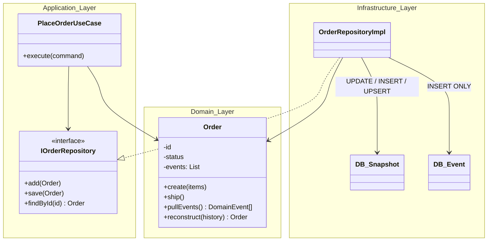
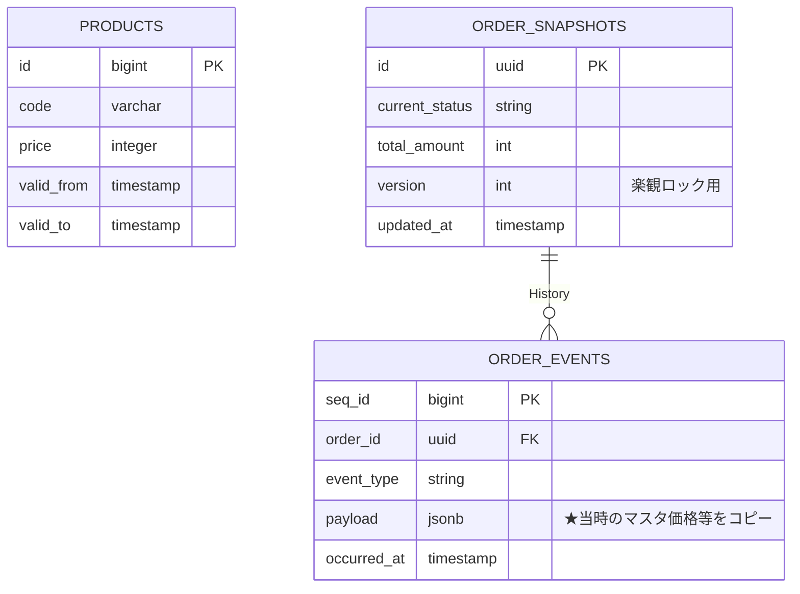

システム開発において、「監査ログの要件」や「原因不明のデータ不整合」に頭を悩ませたことはないでしょうか。

従来のRDBMS設計における `UPDATE`（上書き）は、直感的である反面、「いつ、誰が、なぜ変更したのか」という重要なコンテキストを消滅させます。この問題を解決する手段として**イミュータブルデータモデル**が知られていますが、いざ導入しようとすると、「完全なイベントソーシングは実装難易度が高すぎる」「RDBMSの検索性能はどう担保するのか」といった壁に直面しがちです。

この記事では、kawashimaさんの提唱するイミュータブルデータモデルの理論をベースにしつつ、**チーム開発の現場で無理なく運用できる「現実的な実装解」** を提示します。

具体的には、純粋なイベントソーシングではなく、RDBMSの強み（整合性・検索性）を活かした **「スナップショット併用型」** のアーキテクチャを採用します。これにより、リードエンジニアが自信を持って導入を決定でき、かつメンバーが迷わずに実装できるレベルまで落とし込みました。

**この記事で得られること:**

* イミュータブルデータモデルをRDBMSに適用するための、具体的なテーブル設計と判断基準
* Clean Architecture × TypeScript による、イベント記録と状態更新の実装パターン
* データ不整合時に、過去のイベントから現在地を復元する「リプレイ処理」の実装

**想定読者:**

* システムの複雑化や履歴データ調査に疲弊しているバックエンドエンジニア
* 監査ログ対応などの要件定義・設計を行うアーキテクト・リードエンジニア
* DDD（ドメイン駆動設計）を学習中で、実務的なRepositoryの実装パターンを探している方

## 1. なぜイミュータブル（不変）なのか

従来のRDBMS設計における「UPDATE（上書き）」は、システムに二つの重大な副作用をもたらします。

1. **事実（コンテキスト）の消滅**: 「いつ、誰が、なぜ」変更したのかという情報は、上書きされた瞬間に失われます。
2. **技術的負債の蓄積**: 状態遷移の管理、同時書き込み時のロック競合、キャッシュ整合性など、多くの課題を引き起こします。

イミュータブルデータモデルは、**「すべての業務アクティビティをイベントとして記録（INSERT）し、過去の事実は決して変更（UPDATE/DELETE）しない」** ことで、これらの問題を構造的に解決します。

## 2. モデリングの5ステップ

| 手順 | 内容 | ポイント |
| :---- | :---- | :---- |
| **Step 1** | **エンティティの抽出** | 5W1Hで業務名詞を洗い出します。「〜情報」「〜データ」といった曖昧な命名は禁止です。 |
| **Step 2** | **リソースとイベントの分類** | **イベント**: 「〜する」という動詞になり、発生日時を持ちます（例：注文、出荷）。<br>**リソース**: 物理的な実体や概念です（例：商品、顧客）。 |
| **Step 3** | **イベントの正規化** | 「1つのイベントエンティティには、1つの日時属性しか持たせない」が原則です。<br>受注日、出荷日、請求日が混在するテーブルは分割対象です。 |
| **Step 4** | **リソースのイミュータブル化** | リソースに `updated_at` を持たせたくなったら、それは「隠れたイベント（住所変更、改姓など）」がある証拠です。イベントとして切り出しましょう。 |
| **Step 5** | **関係性の履歴管理** | リソース間の関係（所属など）が変化する場合、交差エンティティ（配属イベント）として切り出します。 |

### ステップの詳細とケーススタディ

* [イミュータブルデータモデル - kawasima](https://scrapbox.io/kawasima/%E3%82%A4%E3%83%9F%E3%83%A5%E3%83%BC%E3%82%BF%E3%83%96%E3%83%AB%E3%83%87%E3%83%BC%E3%82%BF%E3%83%A2%E3%83%87%E3%83%AB)
* [時間経過とともに状態の変わるリソース - kawasima](https://scrapbox.io/kawasima/%E6%99%82%E9%96%93%E7%B5%8C%E9%81%8E%E3%81%A8%E3%81%A8%E3%82%82%E3%81%AB%E7%8A%B6%E6%85%8B%E3%81%AE%E5%A4%89%E3%82%8F%E3%82%8B%E3%83%AA%E3%82%BD%E3%83%BC%E3%82%B9)
* [イベントエンティティのライフサイクル - kawasima](https://scrapbox.io/kawasima/%E3%82%A4%E3%83%99%E3%83%B3%E3%83%88%E3%82%A8%E3%83%B3%E3%83%86%E3%82%A3%E3%83%86%E3%82%A3%E3%81%AE%E3%83%A9%E3%82%A4%E3%83%95%E3%82%B5%E3%82%A4%E3%82%AF%E3%83%AB)
* [イミュータブルデータモデル(入門編)](https://www.slideshare.net/slideshow/ss-40471672/40471672)
* [イミュータブルデータモデル(世代編)](https://www.slideshare.net/slideshow/ss-44958468/44958468)
* [イミュータブルデータモデルの極意](https://www.slideshare.net/slideshow/ss-250716400/250716400)

## 導入の前に検討するポイント

RDBMSでイミュータブルデータモデルを実装する際、純粋な理論（完全なイベントソーシング）をそのまま適用すると、検索パフォーマンスや実装難易度で壁に当たることがあります。

「イミュータブルのメリット（監査・復元）」を享受しつつ、「チーム全員がイミュータブルデータモデルに精通していなくても開発が回る」ことを念頭に置くと、**太字**の選択肢を推奨します。

| 論点 | 選択肢 | 推奨の理由 |
| :---- | :---- | :---- |
| **1. 最新状態の取得**<br>(Read Model戦略) | A. オンデマンド計算<br>**B. スナップショット併用**<br>C. CQRS (非同期) | **B. スナップショット併用**<br>「書き込みはログとして堅牢に残す」と「読み込みはRDBMSの検索機能で高速に行う」を両立する、最も現実的な解です。 |
| **2. 訂正・削除** | A. 赤黒訂正<br>**B. 訂正・論理削除イベント** | **B. 訂正・論理削除イベント**<br>物理削除を行わず、訂正や削除も「新しいイベントの発生」として記録することで、完全な監査証跡を維持します。 |
| **3. マスタ世代管理** | **A. 適用期間モデル**<br>B. イベントリプレイ | **A. 適用期間モデル (ValidFrom/To)**<br>SQLのJOINによる期間結合が可能であり、過去データの再現性と検索パフォーマンスを両立できるためです。 |
| **4. 長期プロセスの状態** | A. 純粋イベント主義<br>**B. キャッシュ的ステータス** | **B. キャッシュ的ステータス**<br>親エンティティ（注文など）に「現在のステータス」を持たせ、「未処理一覧」などの業務クエリを高速化します。 |
| **5. 実装スタイル** | **A. Clean Architecture**<br>B. Transaction Script | **A. Clean Architecture**<br>「イベント追記」と「スナップショット更新」という複雑な永続化ロジックをRepositoryに隠蔽し、ドメイン層を純粋に保つためです。 |


## 推奨方針でのアーキテクチャと実装サンプル

### 1. コンポーネント構成

UseCase（Application層）は「ドメインオブジェクトを保存する」という単純な命令のみを行います。Repository（Infrastructure層）が裏側で **「イベントの追記」と「スナップショットの更新」という二重書き込み** を制御します。



### 2. 概念データモデル

ここでのポイントは、**参照用と記録用のテーブルを明確に分ける**ことです。

  * **Snapshot (Mutable)**: 画面表示・検索用。常に最新状態のみを持つキャッシュテーブルです。
  * **Event (Immutable)**: 監査・履歴用。事実をJSONペイロード等で完全に記録するログテーブルです。
  * **Resource (SCD Type 2)**: マスタは有効期間を持ち、イベント記録時にはその時点の値をコピー（フリーズ）して保存します。

<!-- end list -->



### 3. 実装コードと発行SQL

#### 3.1 新規作成 (Place Order)

**概要**: 注文が発生した事実を記録し、同時に検索用のスナップショットを作成します。

**Repository実装イメージ**

```ts
async function add(order: Order) {  
    // ドメインオブジェクト内に蓄積されたイベントを取り出す
    const events = order.pullEvents(); 
    
    await db.transaction(async (tx) => {  
        // 1. イベント記録 (INSERT)  
        // ここが「正」のデータ（事実の記録）となる
        for (const event of events) {
            await tx.query(
                `INSERT INTO order_events (order_id, event_type, payload, occurred_at) VALUES ($1, $2, $3, $4)`, 
                [order.id, event.type, event.payload, event.occurredAt]
            );  
        }

        // 2. スナップショット作成 (INSERT)  
        // 即座に一覧画面等で検索可能にするため、最新状態を保存
        await tx.query(
            `INSERT INTO order_snapshots (id, current_status, total_amount, version, updated_at) VALUES ($1, $2, $3, $4, $5)`,
            [order.id, order.status, order.totalAmount, order.version, new Date()]
        );  
    });  
}
```

#### 3.2 状態更新 (Ship / Update)

**概要**: 既存の注文の状態を変更します。スナップショットは上書き（UPDATE）されますが、イベントテーブルには履歴が追記（INSERT）されます。

**Repository実装イメージ**

```ts
async function save(order: Order) {  
    const events = order.pullEvents(); // OrderShippedイベントなどを取得  
    if (events.length === 0) return;

    await db.transaction(async (tx) => {  
        // 1. イベント記録 (INSERT)  
        // 「状態が変わった」という事実を追記する（決して上書きしない）
        for (const event of events) {
            await tx.query(`INSERT INTO order_events...`, ...);
        }

        // 2. スナップショット更新 (UPDATE + 楽観ロック)  
        // 複数人が同時に操作した場合の整合性を保つため version カラムを利用
        const res = await tx.query(  
            `UPDATE order_snapshots SET current_status = $1, version = version + 1, updated_at = NOW()
             WHERE id = $2 AND version = $3`,
             [order.status, order.id, order.version]
        );  
        if (res.rowCount === 0) throw new Error("Optimistic Lock Error");
    });  
}
```

### 3.3 UseCaseとDomainのサンプル

**UseCase実装イメージ**

```ts
// PlaceOrderUseCase.ts
export class PlaceOrderUseCase {
    constructor(private repo: IOrderRepository) {}

    async execute(command: PlaceOrderCommand) {
        // 1. ドメインロジック (注文生成 + イベント生成)
        // ※実際のアプリではここでProductRepositoryから「時点価格」を引き、Orderに渡す
        const order = Order.create(
            command.orderId,
            command.items, 
            new Date()
        );
        await this.repo.add(order);
    }
}

// ShipOrderUseCase.ts
export class ShipOrderUseCase {
    constructor(private repo: IOrderRepository) {}

    async execute(command: ShipCommand) {
        // 1. 取得 (Snapshotから高速復元)
        // ※ここでのfindByIdは order_snapshots テーブルを参照します
        const order = await this.repo.findById(command.orderId);
        if (!order) throw new Error("Not Found");

        // 2. ドメインロジック (状態遷移 + イベント生成)
        order.ship(command.trackingId, new Date());

        // 3. 保存 (Repositoryが裏で INSERT Event / UPDATE Snapshot を実行)
        await this.repo.save(order);
    }
}
```

**Domain実装イメージ**

```ts
// Domain/Order.ts
export class Order {
    // 【修正】初期化忘れを防ぐため、宣言時に空配列を代入
    private _events: DomainEvent[] = [];

    constructor(
        public readonly id: string,
        public status: 'Placed' | 'Shipped',
        public totalAmount: number,
        public version: number
    ) {}

    // Factory: 注文作成
    static create(id: string, items: OrderItem[], now: Date): Order {
        const total = items.reduce((sum, item) => sum + item.fixedPrice * item.qty, 0);
        const order = new Order(id, 'Placed', total, 1);
        
        // イベントペイロードには「その時点の価格（fixedPrice）」を含めること
        // マスタの価格が変わっても、注文時の価格は不変であるため
        order.addEvent({ 
            type: 'OrderPlaced', 
            payload: { items, total }, 
            occurredAt: now 
        });
        return order;
    }

    // Method: 出荷
    ship(trackingId: string, now: Date) {
        if (this.status !== 'Placed') throw new Error("Status Error");
        
        this.status = 'Shipped';
        this.addEvent({ 
            type: 'OrderShipped', 
            payload: { trackingId }, 
            occurredAt: now 
        });
    }

    private addEvent(e: DomainEvent) { this._events.push(e); }
    
    pullEvents() { 
        const e = [...this._events]; 
        this._events = []; 
        return e; 
    }
}
```

## 推奨方針での運用ポイント

運用フェーズにおいて、イミュータブルデータモデルの真価（監査性・復元性）を発揮させるための指針です。

### 1. イベントペイロードの完全性（マスタデータの固定化）

`order_events.payload` には、マスタへの参照IDだけでなく、**その時点での重要な値（商品価格、名称、消費税率など）をコピー（非正規化）** して保持してください。
リソース（マスタ）側で履歴管理をしていても、クエリの結合コストが高くなるため、イベント自体に「事実」をすべて詰め込むのがパフォーマンスと保存性の観点で有利です。

### 2. 物理削除の禁止

`order_snapshots` に対しても物理削除（DELETE文）は行わず、ステータスを `Cancelled` や `Deleted` に更新する運用を徹底してください。これにより、全ての操作を追跡可能にします。

### 3. スナップショットの再構築 (Replay)

スナップショットはあくまで「高速な読み込みのためのキャッシュ」です。
もしデータ不整合が発生した場合や、計算ロジックの変更、スキーマ変更時には、`order_events` をID順に再処理（Replay）することで、スナップショットを正しい状態に再構築できます。

以下に、**ドメインモデルによる再構築ロジック**と、**バッチ処理によるUpsert実装**のサンプルを示します。

#### 3.1 ドメインモデルへの再構築メソッド追加

ドメインエンティティ（Order）に、過去のイベント履歴から自身の状態を復元するファクトリメソッド（`reconstruct`）を追加します。

```ts
// Domain/Order.ts (追記)
export class Order {
    // ... 既存のプロパティやメソッド ...

    /**
     * 過去の全イベントから最新状態のOrderオブジェクトを復元する
     * バリデーション（Statusチェック等）は行わず、事実を適用するのみ
     */
    static reconstruct(id: string, history: DomainEvent[]): Order {
        // 初期状態（ダミーなど）からスタート
        let status: 'Placed' | 'Shipped' = 'Placed';
        let totalAmount = 0;
        let version = 0; // イベント数 = バージョンとなる

        for (const event of history) {
            version++;
            switch (event.type) {
                case 'OrderPlaced':
                    totalAmount = event.payload.total;
                    status = 'Placed';
                    break;
                case 'OrderShipped':
                    status = 'Shipped';
                    break;
                // 他のイベントタイプ...
            }
        }
        
        // イベント適用済みのオブジェクトを返す（新規イベントは空）
        return new Order(id, status, totalAmount, version);
    }
}
```

#### 3.2 Replayサービスのバッチ実装

このサービスは、以下の手順でデータを復旧・修正します。

1.  `order_events` から全履歴を読み込む。
2.  ドメインロジック `reconstruct` を通して最新状態のオブジェクトを生成する。
3.  生成されたオブジェクトで `order_snapshots` を強制的に上書き（UPSERT）する。

```ts
// Infrastructure/OrderReplay.ts  
import { Pool } from 'pg';  
import { Order } from '../Domain/Order';

export class OrderReplay {
    // ...

    /** 指定されたOrder IDのスナップショットをイベントログから完全再構築する */  
    async execute(orderId: string): Promise<void> {  
        const client = await this.db.connect();  
        try {  
            await client.query('BEGIN');

            // 1. 全イベントの取得 (発生順)  
            const res = await client.query(
                `SELECT event_type, payload, occurred_at FROM order_events 
                 WHERE order_id = $1 ORDER BY sequence_id ASC`, 
                [orderId]
            );

            if (res.rows.length === 0) {  
                // イベントがないならスナップショットも削除（整合性をとる）
                await client.query(`DELETE FROM order_snapshots WHERE id = $1`, [orderId]);  
                await client.query('COMMIT');  
                return;  
            }

            // 2. メモリ上での再構築 (Replay)  
            // DBの行データをドメインイベント型に変換
            const history = res.rows.map(row => ({
                type: row.event_type,
                payload: row.payload,
                occurredAt: row.occurred_at
            })); 
            
            // ここで静的メソッド reconstruct を呼ぶ
            const reconstructedOrder = Order.reconstruct(orderId, history);

            // 3. スナップショットの強制更新 (UPSERT)  
            // 計算済みの状態を正として上書き保存する
            const upsertQuery = `  
                INSERT INTO order_snapshots (id, current_status, total_amount, version, updated_at)  
                VALUES ($1, $2, $3, $4, NOW())  
                ON CONFLICT (id)   
                DO UPDATE SET  
                    current_status = EXCLUDED.current_status,  
                    total_amount = EXCLUDED.total_amount,  
                    version = EXCLUDED.version,  
                    updated_at = NOW();  
            `;
            
            await client.query(upsertQuery, [  
                reconstructedOrder.id,  
                reconstructedOrder.status,  
                reconstructedOrder.totalAmount,  
                reconstructedOrder.version  
            ]);

            await client.query('COMMIT');
        } catch (e) {  
            await client.query('ROLLBACK');  
            throw e;  
        } finally {  
            client.release();  
        }  
    }  
}
```

## まとめ

イミュータブルデータモデルは、単なる「データを消さない」というルール以上の価値をシステムにもたらします。

### メリット

1.  **信頼性の向上**: すべての変更履歴が残るため、バグ調査や監査対応が容易になる。
2.  **モデルの単純化**: 「状態」と「事実」を分離することで、副作用のないクリーンなドメインロジックを実現できる。
3.  **運用での回復力**: 万が一データが壊れても、イベントログからいつでも正しい状態を「再計算」できる。

### デメリット・注意点

  * **実装コスト**: 単純なCRUDに比べ、イベントとスナップショットの二重管理が必要になり、初期実装コストは上がります。
  * **ストレージ容量**: 全履歴を保存するため、データ容量は増加します。古いイベントのアーカイブ戦略などが将来的に必要になる場合があります。

本記事で紹介した「スナップショット併用型」のアーキテクチャは、RDBMSの強み（検索性・整合性）を活かしつつ、これらのメリットを享受するための現実的な解です。まずは、複雑なステータス管理が必要な「注文」や「決済」などのコアドメインから、このモデリングを適用してみてはいかがでしょうか。

この記事が、堅牢なシステム設計の一助となれば幸いです。感想や疑問点があれば、ぜひコメントでお知らせください！

-----

## 参考リンク

- [JobStreamer](https://job-streamer.github.io/)
- [RDBのデータモデリング・テーブル設計の際に参考にしている考え方と資料](https://zenn.dev/rebi/articles/28c7f1fee5730a)
- [ロングタームイベントパターンについて考える](https://zenn.dev/kimifan/articles/long-term-event-pattern)
- [イミュータブルでゆこう](https://zenn.dev/cacbahbj/articles/9a17170967fb50)
- [イミュータブルデータモデルは制約条件として活用するのが良いのでは？](https://zenn.dev/danimal141/scraps/7e2f1b9162998e)
- [Qiita記事 (kawasima)](https://qiita.com/kawasima)
