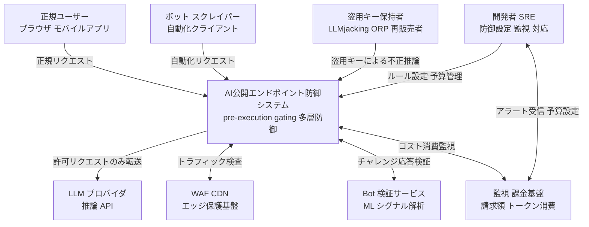
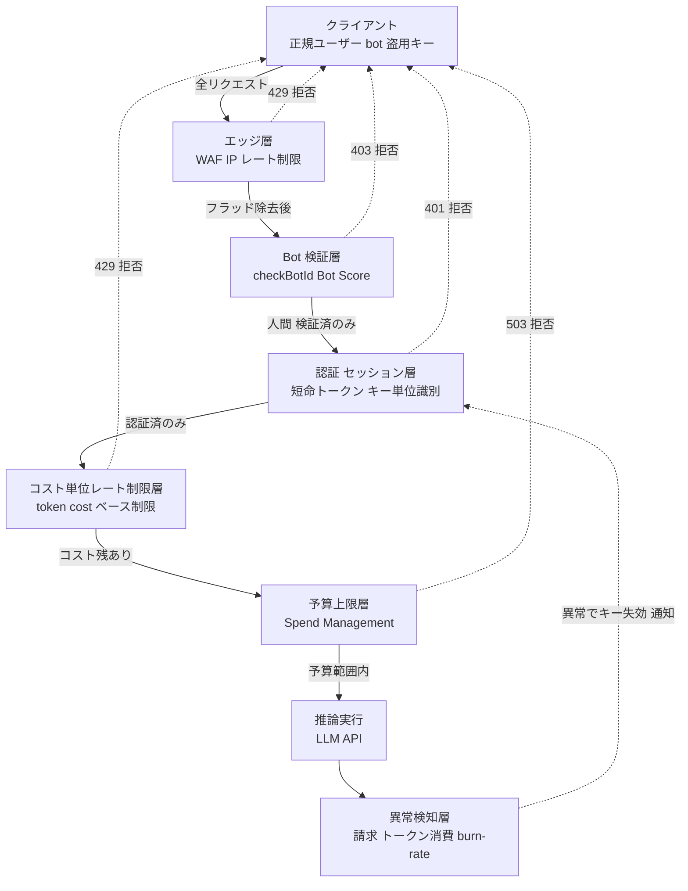
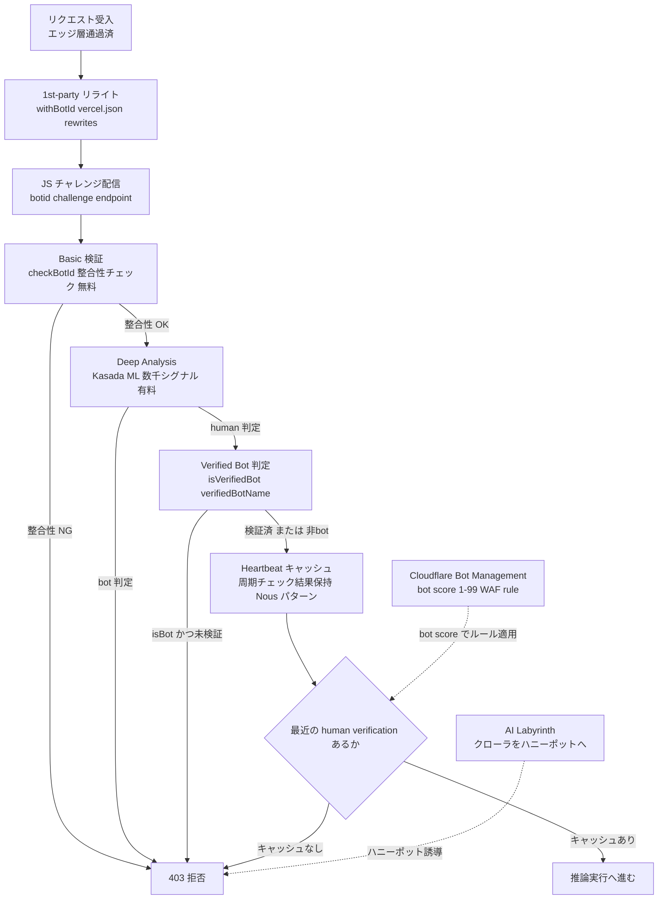
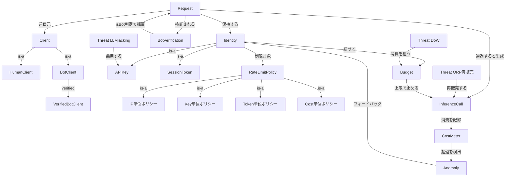
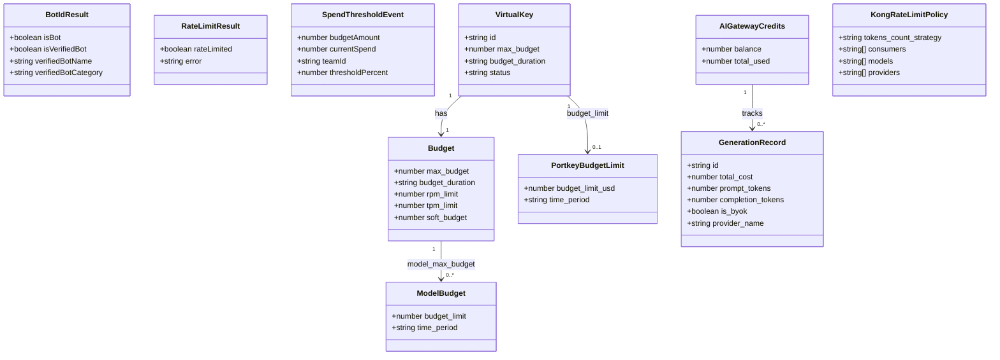
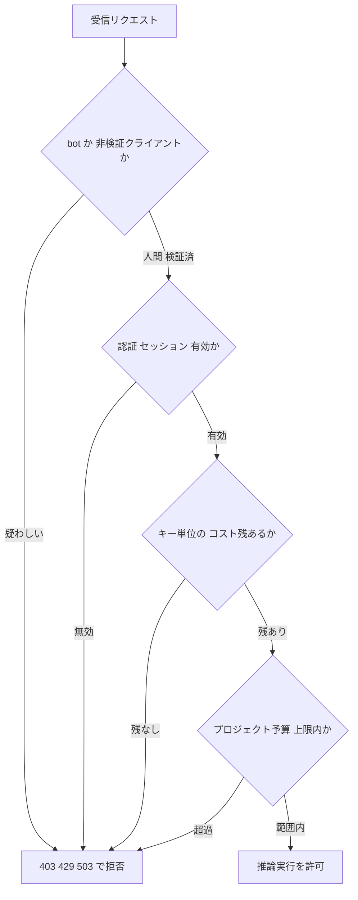

> 検証日: 2026-05-31 / 対象読者: 実装エンジニア・SRE・LLMOps・プラットフォームエンジニア
> 一次ソース: Vercel「Protecting against token theft」(2026-05-29 公開) ほか Vercel 公式 / OWASP / Sysdig / arXiv / 各 AI Gateway 製品ドキュメント

## 概要

公開した AI 推論エンドポイントは、従来の Web エンドポイントとコスト構造が根本から異なります。静的ページ配信や DB クエリと違い、LLM 推論は GPU・TPU を占有する高負荷処理です。1 リクエストの処理コストが桁違いに高くなります。従来の Web アプリは数千リクエストを安価に捌けます。一方で AI エンドポイントは、数百の悪性リクエストがテキスト生成ルートに当たるだけで、コストが急騰します。攻撃者にとってこれは「他人の財布で動く高価な計算資源」です。攻撃の目的は可用性の破壊（DoS）から、請求額の破壊と推論能力の窃取・再販売へ移っています。

OWASP もこの変化を追認しています。2023 年版の脅威項目「LLM04: Model Denial of Service」は、2025 年版で「LLM10: Unbounded Consumption」へ再編・拡張されました。脅威の重心が「モデルを止める」から「予算を枯らす・推論を盗む」へ動いたことを、業界標準の脅威リストが認めた形です。

この脅威に対して、認証・セッション・IP レート制限という従来の三点セットだけでは守りきれません。正規キーのコスト暴走、CGNAT やボットネットによる IP 分散、認証に乗らないスクレイパーの 3 方向に穴が残るためです。実務的な解は、推論を実行する前（pre-execution）に bot・予算残・権限をリクエスト単位で検証し、満たさなければ拒否する多層防御（pre-execution gating）です。

ただし多層防御は「包括的な保護」ではなく「トレードオフの選択」です。Bot 検証は回避され誤検知も起こります。コスト単位レート制限は出力トークンが事後確定するため、事前ハード遮断ができない近似制御にとどまります。予算上限は Vercel 公式自身が「数分のラグがあり、超過中もコストは累積し、上限到達時は全プロジェクトを停止し自動再開しない」と明記しています。さらに学術的には BAR Theorem（Budget・Authenticity・Reasoning の 3 つは同時に最適化できない）が、全方位を同時に守る設計の理論的限界を示します。設計判断の本質は「どの層で何を止め、どの限界を受け入れるか」を明示することにあります。

## 特徴

### コスト非対称性が脅威の本質

攻撃者は支払わず、被害者が支払います。この非対称性こそ、推論盗用を通常のセキュリティ脅威と分けて扱うべき理由です。規模感を示す数値が一次ソースで裏付けられています。

- **Denial of Wallet（serverless 一般）**: 1,000 ノードのボットネットが毎時 2,000 リクエストを送ると、サービスを止めることなく被害者に年額 40 万〜50 万ドルの請求が発生しうる（Kelly et al. 2021, arXiv:2104.08031、試算）。
- **LLMjacking（LLM 特化）**: 盗用された資格情報経由で、Anthropic Claude 2.x 系では被害者のコストが 1 日 4.6 万ドル超に達しうると算出（Sysdig Threat Research, 2024-05-06）。後継のより高価なモデルでは被害額はさらに大きくなる。
- **再販売の経済モデル**: 攻撃者は入手したアクセスを ORP（OpenAI Reverse Proxy）経由で月額 30 ドル程度で第三者へ転売する（Sysdig, 2024/2025）。
- **コスト倍率**: Vercel は推論を通常の HTTP リクエストの「約 100 万倍高価」と表現。HTTP は約 2 ドル／100 万リクエストに対し、フロンティアモデルのエージェントへの 1 プロンプトが 2 ドルに達することもある。攻撃者は盗用推論を定価の 5〜10% で再販売しても、限界費用ゼロのため高利益が成り立つ（Vercel「Protecting against token theft」2026-05-29）。

コスト非対称性が高いほど攻撃の経済合理性は高まり、防御の費用対効果は下がります。この構造を前提に防御設計を組み立てる必要があります。

### 「停止」ではなく「静かな消費」

Denial of Wallet の最大の厄介さは、サービスが正常稼働したまま財布だけが枯れる点です。DDoS が可用性を落として検知されるのとは対照的に、Denial of Wallet はエラー率も応答時間も変えません。請求書を見るまで被害者は気づきません。

さらに分散 low-and-slow 型では、各キー・各 IP がレート制限のしきい値を意図的に下回ります。Nous Research の事例では、数千の偽アカウントに負荷を分散してレート制限を回避する手口が確認されました。

このため、稼働監視・エラー率監視を Denial of Wallet の一次防御線にしてはいけません。請求額・トークン消費量の異常検知を、独立した一次防御線として設ける設計が必要です。

### 盗用経路が複数あり層ごとに止める対象が違う

推論盗用は単一の脅威ではなく、経路の異なる複数の脅威の束です。OWASP LLM10:2025 と Sysdig の観測を組み合わせると、4 経路に整理できます。

| 経路 | 概要 | 主に止める層 |
|---|---|---|
| A. 盗用キー・資格情報の悪用（LLMjacking） | 漏洩キーで他人の推論枠を消費・再販売 | 短命トークン・キー単位予算上限・地理/モデル制限・異常検知 |
| B. 公開エンドポイント直接悪用（Unbounded Consumption/DoW） | 公開口を直接叩いて予算を枯渇 | Bot 検証・コスト単位レート制限・予算上限・pre-execution gating |
| C. ORP プロキシ再販売 | 盗用枠を逆プロキシ経由で第三者に転売 | 利用パターン異常検知・キー失効・利用量制限 |
| D. モデル抽出（隣接） | 大量クエリでモデル挙動を蒸留・複製 | クエリ監視・出力の粒度制限 |

経路 A の入口となるキー漏洩は、確率事象ではなく既成事実として扱うべき規模です。2023 年だけで公開リポジトリに 1,280 万件の secret が漏洩し（前年比 +28%）、流出した secret の 90% 超が漏洩 5 日後も有効と報告されています（GitGuardian, State of Secrets Sprawl 2024）。「漏れない前提」の設計は成立しません。

各経路は止める手段が異なるため、単一の防御層で全経路を塞ぐことはできません。防御設計はこの分類を軸に、層ごとの責務を明確にすることから始まります。

### per-request 検証（BotID）の本命性と非ブラウザでの限界

Vercel が推論盗用防御の中核として提示するのが、`checkBotId()` による per-request 検証です。同社の「Protecting against token theft」（2026-05-29）は「検証はすべての AI リクエストで実行しなければならない（verification has to run on every AI request）」と明言します。セッション境界での検証では、攻撃者がバイパスコストを盗用呼び出し全体に償却できてしまうためです。さらに「rate limit や認証の壁だけでは不十分」と指摘します。攻撃者は数千の residential proxy IP にリクエストを分散して per-IP 制限を無効化できるためです。同記事は BotID の deep analysis を推奨します。

実装としては、ブラウザ側が client-side challenge を解いた証拠をリクエストに含めます。サーバ側で推論実行直前に `checkBotId()` を呼び、bot を 403 で拒否します。Basic は全プラン無料、Deep Analysis（Kasada/ML ベース）は Pro・Enterprise で 1,000 calls あたり 1 ドル、呼んだ時だけ課金されます。

Nous Research の heartbeat パターンが実装リファレンスとして公開されています。chat クライアントが周期的に BotID チェックを発行し、結果を短時間キャッシュします。「最近の人間検証が存在する時だけ推論を進める」設計です。3,000% のトラフィックスパイクを約 2 時間で無効化したと報告されています（コスト削減額は未開示）。

ただし BotID はブラウザの JavaScript 実行を前提とします。native form POST・curl・非 JS バックエンド・モバイルネイティブ・API クライアントでは原理的に機能しません。これらの非ブラウザクライアントには mTLS・署名付きリクエスト・短命トークンなど別手段が必要です。また Deep Analysis（Kasada）も fortified browser や residential proxy による突破事例が公開されています。Zscaler 経由の正規ユーザが `isBot:true` で誤ブロックされた事例も報告されています。BotID は「入れれば終わり」ではなく、追随コストを伴う継続的な設計として位置づける必要があります。

## 構造

C4 model の「ソフトウェアシステム / コンテナ / コンポーネント」を、防御アーキテクチャの「論理レイヤ / 防御コンテナ / 個別コンポーネント」として読み替えます。

### システムコンテキスト図



| 要素 | 説明 |
|---|---|
| 正規ユーザー | ブラウザまたはモバイルアプリ経由で AI 機能を利用するアクター |
| ボット スクレイパー | 自動化クライアントで大量リクエストを送りコスト消費またはコンテンツ盗用を狙う脅威アクター |
| 盗用キー保持者 | 漏洩キーで推論枠を不正消費・再販売する脅威アクター |
| 開発者 SRE | 防御ルール設定・アラート対応・予算設定を行うアクター |
| AI公開エンドポイント防御システム | 推論到達前に bot・認証・コスト・予算を多層検証する中心システム |
| LLM プロバイダ | 推論を実行しトークン消費量とコストを返す外部システム |
| WAF CDN | エッジで IP レート制限・地域ルールを適用する外部システム |
| Bot 検証サービス | ML で多シグナルを解析し bot スコア・検証結果を返す外部システム |
| 監視 課金基盤 | 請求額・トークン消費の異常を検知しアラートと webhook を発火する外部システム |

### コンテナ図



| コンテナ | 説明 |
|---|---|
| エッジ層 | IP・UA・地域に基づく粗いフラッド除去。デフォルト 60 秒 100 req 429。per-region 集計でマルチリージョンでは上限超過もあり |
| Bot 検証層 | JS チャレンジ応答整合性と ML 多シグナル解析で bot を遮断。回避・誤検知・JS 前提という限界あり |
| 認証 セッション層 | 短命トークンとキー単位識別で主体を解決。正規キー自体のコスト暴走は止まらない |
| コスト単位レート制限層 | token cost 単位で計算量を抑制。出力トークンの事後確定で一時超過を許す近似制御 |
| 予算上限層 | 請求額の絶対上限。数分ラグ・全停止・自動再開なしの最終防衛線 |
| 異常検知層 | 請求・トークン消費の変化率を監視し静かな消費を検知。検知は事後 |
| 推論実行 | gating 通過リクエストのみ LLM へ転送 |

### コンポーネント図

設計判断が多い Bot 検証層をドリルダウンします。



| コンポーネント | 説明 |
|---|---|
| 1st-party リライト | チャレンジ配信を 1st-party パスにプロキシし ad-blocker を回避 |
| JS チャレンジ配信 | ブラウザにチャレンジを送り解答をヘッダに付与。ブラウザ JS 前提 |
| Basic 検証 | チャレンジ応答の整合性を検証。全プラン無料。リバースエンジニアリングで回避可能 |
| Deep Analysis | Basic 通過後に数千シグナルを ML 解析。1,000 calls あたり 1 ドル。fortified browser で突破事例あり |
| Verified Bot 判定 | Googlebot や ChatGPT Operator を allowlist 通過。`isBot && !isVerifiedBot` で弾く |
| Heartbeat キャッシュ | 推論直前に最近の human verification をキャッシュ判定。Nous Research パターン |
| Cloudflare Bot Management | Vercel 非依存の代替。bot score を block challenge に変換 |
| AI Labyrinth | no-crawl 無視 AI クローラをハニーポット迷路へ誘導。全プラン opt-in 無料 |

## データ

### 概念モデル



| エンティティ | 説明 |
|---|---|
| Request | エンドポイントへの単一 HTTP リクエスト。各層の判定対象 |
| Client | 送信者の種別。Human Bot VerifiedBot に分類 |
| Identity | 認証情報の抽象。APIKey または SessionToken |
| APIKey | 静的・長命な認証情報。漏洩時に LLMjacking の入口 |
| SessionToken | 短命・スコープ限定。漏洩時の暴露窓が小さい |
| BotVerification | checkBotId の実行結果。isBot isVerifiedBot verifiedBotName verifiedBotCategory |
| RateLimitPolicy | リクエスト数・コストを制限するルール。IP Key Token Cost 単位 |
| Budget | per-key per-project の日次・月次コスト上限。最終防衛線 |
| InferenceCall | LLM API を呼ぶ処理。コストが発生 |
| CostMeter | 累積コスト・トークン数を記録 |
| Anomaly | CostMeter が検出した異常。キー失効や通知のトリガー |
| Threat LLMjacking | 漏洩 APIKey を悪用し推論枠を消費・再販売 |
| Threat DoW | 公開エンドポイントへの過剰リクエストで Budget を枯渇 |
| Threat ORP再販売 | 盗用アクセスを逆プロキシ経由で第三者に転売 |

### 情報モデル

一次ソースに記載されたフィールド名を採用しています。推測・補完した属性には注記を添えます。



| クラス | 説明 |
|---|---|
| BotIdResult | checkBotId の戻り値。`isHuman` フィールドは公式に未記載で判定は `!isBot` |
| RateLimitResult | checkRateLimit の戻り値。error は `not-found` または `blocked` |
| SpendThresholdEvent | Vercel Spend Management の webhook payload。50/75/100% で送信 |
| Budget | LiteLLM のキー単位予算。budget_duration は `30s` `30m` `30h` `30d` 形式 |
| ModelBudget | LiteLLM のモデル別予算上限。Enterprise 機能 |
| VirtualKey | LiteLLM Portkey の仮想キー。Portkey は上限到達でキー自動失効 |
| AIGatewayCredits | Vercel AI Gateway の `GET /credits` 残高。team account 単位 |
| GenerationRecord | Vercel AI Gateway の `GET /generation`。id は `gen_<ulid>` 形式 |
| KongRateLimitPolicy | Kong の `tokens_count_strategy` は total_tokens prompt_tokens completion_tokens cost から選択 |
| PortkeyBudgetLimit | Portkey の予算上限。Enterprise 限定 |

## 構築方法

### BotID 導入

`checkBotId()` を推論 API 直前に置きます。

```bash
npm i botid
```

Next.js（App Router）は `next.config.ts` で ad-blocker 対策の rewrite を自動付与します。

```ts
// next.config.ts
import { withBotId } from 'botid/next/config';

const nextConfig = {
  // 既存の Next.js config
};

export default withBotId(nextConfig);
```

client 側で保護対象パスを宣言します（Next.js 15.3+）。

```ts
// instrumentation-client.ts
import { initBotId } from 'botid/client/core';

initBotId({
  protect: [
    { path: '/api/chat', method: 'POST' },
    { path: '/api/inference/*', method: 'POST' },
  ],
});
```

`protect` に登録しないパスで `checkBotId()` を呼ぶと必ず失敗します。

server 側の Route Handler で per-request 検証と verified bot allowlist を実装します。

```ts
// app/api/chat/route.ts
import { checkBotId } from 'botid/server';
import { NextResponse } from 'next/server';

export async function POST() {
  const { isBot, isVerifiedBot, verifiedBotName } = await checkBotId();
  const isAllowedOperator = isVerifiedBot && verifiedBotName === 'chatgpt-operator';

  if (isBot && !isAllowedOperator) {
    return NextResponse.json({ error: 'Access denied' }, { status: 403 });
  }
  // 推論呼び出し
}
```

per-route で `checkLevel`（`deepAnalysis` / `basic`）を切り替える場合、client と server で値を一致させます。不一致だと verification が失敗し、正規ユーザを弾くか bot を通すかの両方が起こります。frontend と backend がドメイン分離している場合、server 側で `extraAllowedHosts: ['app.myapp.com']` を指定します。指定しないと正規リクエストが全拒否されます。Deep Analysis は Dashboard の Firewall タブで有効化します（Pro/Enterprise、1,000 calls あたり 1 ドル）。

### WAF Rate Limiting

IP 分散攻撃を無効化するには、`rateLimitKey` に認証ユーザー ID を渡します。

```ts
// app/api/chat/route.ts
import { checkRateLimit } from '@vercel/firewall';

export async function POST(request: Request) {
  const auth = await authenticateUser(request);
  const { rateLimited } = await checkRateLimit('inference-per-user', {
    request,
    rateLimitKey: auth.userId, // IP ではなくユーザー ID でカウント
  });
  if (rateLimited) {
    return new Response(JSON.stringify({ error: 'Rate limit exceeded' }), { status: 429 });
  }
  // 推論呼び出し
}
```

`checkRateLimit` の戻り値は `{ rateLimited, error?: 'not-found' | 'blocked' }` です。`rateLimitKey` を省略するとデフォルトで IP になります。複合キー（`${auth.orgId}:${auth.userId}`）で多次元制限も可能です。

ダッシュボードのレート制限ルールは、デフォルトで 60 秒・100 req・429 です。カウンタは per-region 集計のため、マルチリージョン配信では設定上限 × リージョン数まで実効上限が膨らみます。低めに設定します。

### 予算上限

Vercel Spend Management は webhook で通知します。

```json
{ "budgetAmount": 500, "currentSpend": 500, "teamId": "team_xxx", "thresholdPercent": 100 }
```

公式が明記する注意点は次の通りです。

- 上限設定だけでは止まらず、Pause production deployment スイッチを別途有効化する。
- チェックは数分間隔で、超過後も数分課金が積む。
- pause 時は 503 DEPLOYMENT_PAUSED を返す。
- 自動再開しないため、各プロジェクトを手動 resume する。

LiteLLM Proxy（OSS）はキー生成時にパラメータを指定します。

```json
{
  "max_budget": 10,
  "budget_duration": "30d",
  "tpm_limit": 20,
  "rpm_limit": 4,
  "model_max_budget": {
    "gpt-4o": { "budget_limit": 0.0000001, "time_period": "1d" }
  }
}
```

`max_budget` 超過で 400/401 を返します。多重窓（`$10/day` かつ `$100/month`）も設定できます。Portkey Virtual Keys は USD 上限到達でキーを自動失効します（Enterprise 限定）。

Kong AI Gateway は token・cost 単位の制限を設定できます（以下は公式設定仕様に基づく実装例）。

```yaml
# 実装例。出典補完元: developer.konghq.com/plugins/ai-rate-limiting-advanced/
plugins:
  - name: ai-rate-limiting-advanced
    config:
      strategy: redis
      policies:
        - limit: 1000000        # 100万 token / hour
          window_size: 3600
          identifier: consumer
          tokens_count_strategy: total_tokens
        - limit: 10.0           # $10 / hour (cost ベース)
          window_size: 3600
          identifier: consumer
          tokens_count_strategy: cost
```

`tokens_count_strategy` は `total_tokens` `prompt_tokens` `completion_tokens` `cost` から選択します。複数 policy の AND 結合も可能です。超過時は 429 を返します。

### Nous Research heartbeat パターン

chat client が周期的に BotID チェックを発行し、結果を短時間キャッシュします。「最近の human verification が存在する時だけ推論を進める」設計です（以下は公開情報に基づく実装例）。

```ts
// app/api/chat/route.ts 最近の human verification がある時だけ実行する実装例
import { checkBotId } from 'botid/server';
import { NextRequest, NextResponse } from 'next/server';
import { getSessionVerificationStatus } from './session';

export async function POST(request: NextRequest) {
  // 1. セッションに最近の human verification があるか
  const sessionVerified = await getSessionVerificationStatus(request);
  if (!sessionVerified) {
    return NextResponse.json({ error: 'Human verification required.' }, { status: 403 });
  }
  // 2. 念のため per-request の BotID チェックも実施
  const { isBot } = await checkBotId();
  if (isBot) {
    return NextResponse.json({ error: 'Access denied' }, { status: 403 });
  }
  // 3. 推論実行
  return NextResponse.json({ result: await callLLM(request) });
}
```

Nous の実採用は tRPC ですが、上記は Next.js Route Handler の等価実装例です。セッション・キャッシュ連携部分は公式コードが非公開のため補完しています。

## 利用方法

### pre-execution gating の判定順序

推論を実行する前に、各層を順に通過判定します。満たさなければ高価な推論に到達させません。



| ゲート | 説明 |
|---|---|
| Bot 検証 | BotID checkBotId による 403 拒否 |
| 認証 セッション | 短命トークン・JWT・キー検証による 401 拒否 |
| コスト単位レート制限 | checkRateLimit Kong LiteLLM Portkey による 429 拒否 |
| 予算上限 | Spend Management LiteLLM Portkey による 503 400 拒否 |

ゲートを Next.js middleware で直列化する実装例です。

```ts
// middleware.ts 実装例
import { NextRequest, NextResponse } from 'next/server';
import { checkBotId } from 'botid/server';
import { checkRateLimit } from '@vercel/firewall';
import { verifySession } from './lib/auth';
import { checkBudgetRemaining } from './lib/budget';

export async function middleware(request: NextRequest) {
  if (request.nextUrl.pathname.startsWith('/api/inference')) {
    const { isBot, isVerifiedBot } = await checkBotId();          // ゲート1
    if (isBot && !isVerifiedBot) return NextResponse.json({ error: 'Access denied' }, { status: 403 });

    const session = await verifySession(request);                 // ゲート2
    if (!session) return NextResponse.json({ error: 'Unauthorized' }, { status: 401 });

    const { rateLimited } = await checkRateLimit('inference-per-user', { request, rateLimitKey: session.userId }); // ゲート3
    if (rateLimited) return NextResponse.json({ error: 'Rate limit exceeded' }, { status: 429 });

    if (!(await checkBudgetRemaining(session.userId)))            // ゲート4
      return NextResponse.json({ error: 'Budget exceeded' }, { status: 429 });
  }
  return NextResponse.next();
}

export const config = { matcher: ['/api/inference/:path*'] };
```

BotID 呼び出しは Route Handler 内が公式推奨のケースもあります。上記は概念を示す実装例です。

### 非ブラウザクライアントへの補完手段

BotID はブラウザ JS 前提です。native アプリ・curl・バックエンド API クライアントには別手段を組み合わせます。

| クライアント種別 | 補完手段 |
|---|---|
| モバイルネイティブアプリ | 短命トークン（OAuth2 OIDC）とバックエンドでのキー管理 |
| server-to-server API | mTLS によるクライアント証明書認証 |
| 信頼パートナー API | HMAC-SHA256 署名付きリクエストとタイムスタンプ |
| 短期アクセス | TTL 数分〜数時間の短命トークン |

### 防御層の選択ガイド

すべての層を重ねることが常に最適とは限りません。規模に応じて選択します。

| 規模 | 推奨構成 |
|---|---|
| 小規模（個人 スタートアップ） | 単一 AI Gateway に予算・レート制限・キー管理を集約し BotID Basic と Spend Management を追加 |
| 中規模（成長期 SaaS） | 上記に BotID Deep Analysis とユーザー ID 単位レート制限と段階的予算アラートを追加 |
| 大規模（Enterprise） | 上記に Kong AI Gateway の多次元コスト制限と mTLS パートナー保護と burn-rate 異常検知を追加 |

## 運用

### 請求・トークン消費の異常検知を一次防御線にする

Denial of Wallet は可用性を落としません。エラー率・稼働率の監視では検知できません。独立した監視ラインとして次の指標を持ちます。

| 指標 | 閾値設計の起点 |
|---|---|
| 単位時間あたりのトークン消費量 | 正常ピークの 2〜3 倍でアラート |
| 単位時間あたりの請求額の変化率 | 絶対額より変化率で捉える |
| キー単位の消費量偏差 | 全キーの中央値を大きく外れるキーを即時通知 |
| エージェント反復回数 | `max_iterations` `max_execution_time` の設定と監視を同時に |

分散 low-and-slow 型は各キーが閾値を下回るため、全体の消費量変化率を独立監視ラインとして持ちます。Vercel AI Gateway では `GET /credits` で残高、`GET /generation?id=gen_<ulid>` でリクエスト単位の `total_cost` を確認できます。

### 予算上限の運用注意

Vercel 公式ドキュメントは次を明記します。

> Because these checks are not continuous, notifications, webhooks, and project pausing can trigger several minutes after you cross your spend amount.

> Projects won't automatically unpause if you increase the spend amount, you must resume each project manually.

実際の許容上限の 70〜80% 程度を pause トリガー値とし、残りをラグ中の追加コストと運用バッファに充てます。Pause スイッチの有効化を忘れません。`endOfBillingCycle` webhook を受けて REST API で自動再開するスクリプトを用意すると、翌月頭の手動操作が不要になります。

| 製品 | 上限超過時の挙動 | 自動再開 |
|---|---|---|
| Vercel Spend Management | 全プロジェクト 503 pause | なし（手動 resume） |
| Portkey Virtual Keys | キー単位で自動失効 | 該当なし |
| LiteLLM proxy | 400/401 | 該当なし |
| Kong AI Gateway | 429 | 該当なし |

### キー漏洩前提の運用

GitGuardian によれば、2023 年だけで公開リポジトリに 1,280 万件の secret が漏洩し（前年比 +28%）、流出した secret の 90% 超が漏洩 5 日後も有効です。「漏れない」前提は成立しません。漏洩を前提に「盗んでも換金しにくくする」設計が必要です。

- キー単位の予算上限で被害を局所化する。
- 通常利用が発生しない地域・モデルへのアクセスをキー単位でブロックする。
- 消費量スパイクや異常な時間帯・地域・モデルの利用を検知して自動失効する。
- 長期有効キーを避け、短命トークンとローテーションを使う。
- フロントエンドへのキー直置きを禁止する（`NEXT_PUBLIC_*` `VITE_*` `REACT_APP_*` はビルド時にブラウザバンドルへ展開される。サーバーサイド経由に変更する）。

## ベストプラクティス

各項目は「誤解 → 反証 → 推奨」の構造で示します。

### Bot 検証は多層防御の一部であり唯一の手段ではない

- **誤解**: 推論 API 直前に `checkBotId()` を置けば bot を止められる。
- **反証**: Basic mode はリバースエンジニアリングでほぼ素通しと報告される。Deep Analysis（Kasada）も fortified browser や residential proxy で突破事例がある。ブラウザ JS 前提で curl・native は対象外。Zscaler 経由の正規ユーザが誤ブロックされた実報告もある。
- **推奨**: Bot 検証を「障壁の一枚」と位置づける。Basic のみは実質ほぼ素通しのため、Deep Analysis を高コストなエンドポイントに絞って適用する。checkLevel を client/server で一致させる。verifiedBot allowlist や Firewall bypass で誤検知を救済する。非ブラウザには mTLS・署名・短命トークンを使う。

### コスト単位レート制限は事後収束する近似制御として設計する

- **誤解**: コスト・トークン単位のレート制限で予算超過を事前に遮断できる。
- **反証**: 出力トークンは生成後に確定する。streaming では並行リクエストが上限を一時超過しうる（Azure APIM 公式）。分散 low-and-slow は各キーが閾値下に留まる。
- **推奨**: pre-execution の予算残チェックと組み合わせる。`max_tokens` `max_iterations` `max_execution_time` で早期打ち切りを実装する。入力トークンを事前計算して上限超過を拒否する。設計書に「出力確定前は一時超過が起こる」と明記する。

### 予算上限は最終防衛線だが厳密なハードキャップではない

- **誤解**: 予算上限を設定すれば、その額を超えた時点でコストが止まる。
- **反証**: Vercel 公式自身がチェックは数分間隔・超過中もコスト累積・pause は全プロジェクト 503・自動再開なしと明記する。予算上限を逆用して「予算を焼き切らせサービス全停止を狙う」手段にもなりうる。
- **推奨**: 上限は許容額の 70〜80% に低め設定する。予算上限とは独立した異常検知ラインを先に発火させる。Pause スイッチを確実に有効化する。pause 後の手動 resume 手順をオンコールに周知する。

### BAR Theorem を設計原則として理解する

arXiv:2507.23170「BAR Conjecture: the Feasibility of Inference Budget-Constrained LLM Services with Authenticity and Reasoning」（Zhou ら）は、推論サービスが Budget（推論時の予算）・Authenticity（事実の正確性）・Reasoning（推論能力）の 3 つを同時に最適化できないというトレードオフを示します。論文はこれを形式的に証明したと主張し「The BAR Theorem」と命名しています（論文タイトルは Conjecture 表記ですが、本文は予想ではなく定理として提示）。拡張推論は桁違いに長いトークンを生成するため、予算上限を強制すると reasoning-heavy なワークロードが配分を急速に枯渇させます。設計原則としての含意は次の通りです。

- 全方位の同時保護は理論的に困難である。
- 多層防御は「何を諦めるかの選択」である。
- 推論を有効にする場合は予算管理を厳密にする。予算を厳密にする場合は出力長に上限を設ける。

### ベンダーロックインと多層の複雑性コストを天秤にかける

- **誤解**: 防御層を重ねるほど安全性が高まる。
- **反証**: BotID は Vercel と JS/TS に固定され、移行時に失われる。多層は別々の管理画面・ログ・ポリシーが運用を圧迫し、誤設定や層間干渉や新たな攻撃面を生む。80% から 90% への改善は 20% から 80% への改善より遥かに高コスト。
- **推奨**: 小規模では AI Gateway に集約する方が誤設定リスクと運用コストが低い場合がある。ベンダー固有機能への依存を明示的に判断する。各層の責務と追加理由と撤退条件を設計書に書く。

## トラブルシューティング

### 正規ユーザが isBot:true で誤ブロックされる

- **症状**: Zscaler・企業プロキシ・VPN・プライバシーブラウザ経由の正規ユーザが 403 になる。
- **原因**: ゼロトラスト proxy が JS 動作を obscure する。プライバシーブラウザが fingerprint を改変する。ad blocker が anti-bot スクリプトをブロックする。
- **対処**: `isBot && !isVerifiedBot` で Verified Bot を通す。Firewall bypass ルールで誤ブロック IP・ASN・UA を allowlist する。特定ドメインのログイン済みユーザーは BotID をバイパスする feature flag を用意する。BotID 判定ログを収集して誤検知を可視化する。手動解除フローを運用手順に含める。

### checkLevel の client/server 不一致で verification fail が発生する

- **症状**: 特定ルートで verification が fail し、正規ユーザ遮断または bot 通過が起こる。
- **原因**: per-route の `checkLevel` が client（`initBotId`）と server（`checkBotId`）で異なる。
- **対処**: client/server 両方の checkLevel を確認する。checkLevel をコード上の定数として共有する。per-route 設定はダッシュボードのプロジェクト全体設定より優先されるため両方を確認する。

### 予算上限 pause 後にサービスが 503 のまま復旧しない

- **症状**: 予算上限到達で 503 DEPLOYMENT_PAUSED になった後、支出額を増額しても復旧しない。
- **原因**: 支出額の増額と project の unpause は別操作。増額しても自動再開しない仕様。
- **対処**: 支出額を増額する（これだけでは再開しない）。各プロジェクトを手動 resume する（ダッシュボードまたは REST API `/v9/projects/{idOrName}/unpause`）。複数プロジェクトは REST API でスクリプト化する。resume 前に AI Gateway の `GET /credits` `GET /generation` で消費元を確認し、攻撃由来ならキー失効・IP ブロックを先に行う。予算上限を低め設定に見直し、異常検知ラインが pause 前に発火するよう調整する。

## まとめ

公開 AI エンドポイントの脅威は「可用性の破壊」から「予算と推論能力の窃取」へ移っており、認証と IP レート制限だけでは守りきれません。pre-execution gating を中心に Bot 検証・コスト単位レート制限・予算上限・異常検知を多層化しつつ、各層の回避経路・誤検知・ラグ・適用範囲という限界を設計書に明示することが要点です。

この記事が少しでも参考になった、あるいは改善点などがあれば、ぜひリアクションやコメント、SNSでのシェアをいただけると励みになります！

## 参考リンク

- 公式ドキュメント
  - [Vercel Blog: Protecting against token theft](https://vercel.com/blog/protecting-against-inference-theft)
  - [Vercel Blog: Mitigating Denial of Wallet risks with Vercel](https://vercel.com/blog/mitigating-denial-of-wallet-risks-with-vercel)
  - [Vercel Blog: Protecting AI apps with Vercel and Kasada](https://vercel.com/blog/protecting-ai-apps-with-vercel-and-kasada)
  - [Vercel Blog: How Nous Research used BotID to block automated abuse at scale](https://vercel.com/blog/how-nous-research-used-botid-to-block-automated-abuse-at-scale)
  - [Vercel KB: How to protect your AI app from bots](https://vercel.com/kb/guide/how-to-protect-your-ai-app-from-bots)
  - [Vercel Docs: BotID](https://vercel.com/docs/botid)
  - [Vercel Docs: WAF Rate Limiting](https://vercel.com/docs/vercel-firewall/vercel-waf/rate-limiting)
  - [Vercel Docs: Spend Management](https://vercel.com/docs/spend-management)
  - [Vercel Docs: AI Gateway](https://vercel.com/docs/ai-gateway)
  - [OWASP Top 10 for LLM Applications: LLM10 Unbounded Consumption](https://genai.owasp.org/llmrisk/llm102025-unbounded-consumption/)
  - [Azure API Management: LLM Token Limit Policy](https://learn.microsoft.com/en-us/azure/api-management/llm-token-limit-policy)
  - [Kong AI Rate Limiting Advanced](https://developer.konghq.com/plugins/ai-rate-limiting-advanced/reference/)
  - [Portkey: Budget Limits](https://portkey.ai/docs/product/ai-gateway/virtual-keys/budget-limits)
  - [LiteLLM Proxy: Virtual Keys](https://docs.litellm.ai/docs/proxy/virtual_keys)
  - [Upstash Ratelimit: Algorithms](https://upstash.com/docs/redis/sdks/ratelimit-ts/algorithms)
  - [Cloudflare Docs: Bot Management](https://developers.cloudflare.com/bots/get-started/bot-management/)
- GitHub
  - [@vercel/firewall: checkRateLimit](https://github.com/vercel/vercel/tree/main/packages/firewall/docs/functions/checkRateLimit.md)
- 記事・論文
  - [Kelly et al.: Denial of Wallet (arXiv:2104.08031)](https://arxiv.org/abs/2104.08031)
  - [BAR Theorem (arXiv:2507.23170)](https://arxiv.org/abs/2507.23170)
  - [Sysdig: LLMjacking](https://sysdig.com/blog/llmjacking-stolen-cloud-credentials-used-in-new-ai-attack/)
  - [GitGuardian: The State of Secrets Sprawl 2024](https://blog.gitguardian.com/the-state-of-secrets-sprawl-2024/)
  - [nullpt.rs: Reversing Vercel's BotID](https://nullpt.rs/reversing-botid)
  - [Castle.io: Bot detection misfires on privacy tools](https://blog.castle.io/how-bot-detection-misfires-on-non-mainstream-browsers-and-privacy-tools/)
  - [GMO Flatt Security: AI破産を防ぐために](https://blog.flatt.tech/entry/ai_edos)
  - [G-gen: Gemini API と APIキーの不正使用に関する注意喚起](https://blog.g-gen.co.jp/entry/gemini-api-abuse-explanation-and-prevention)
  - [クラスメソッド DevelopersIO: OWASP Top 10 for LLM Applications 2025](https://dev.classmethod.jp/articles/owasp-top10-llm-applications-2025-classmethod-cloudsecurity-fes-presentation/)
