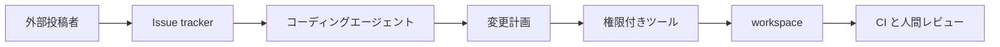
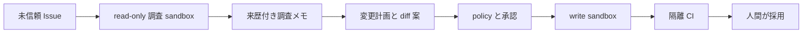
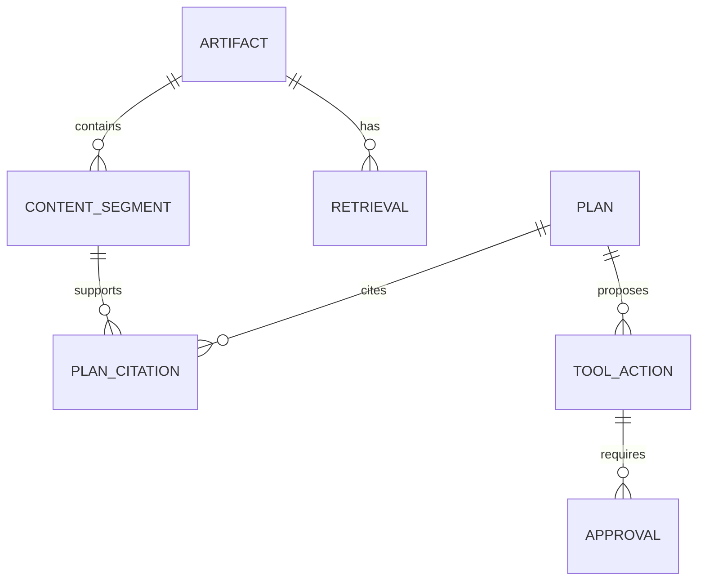
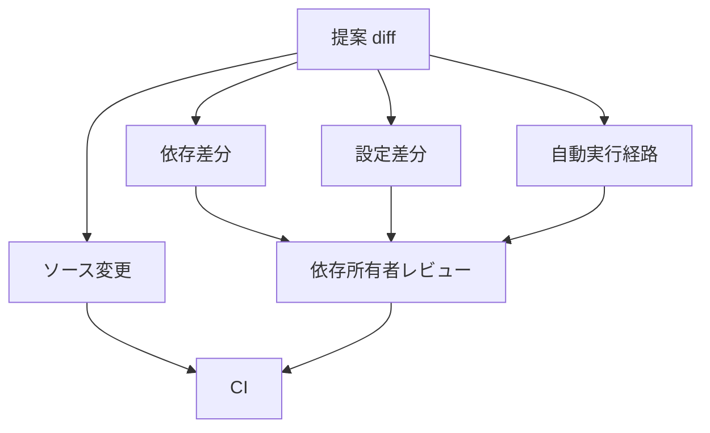
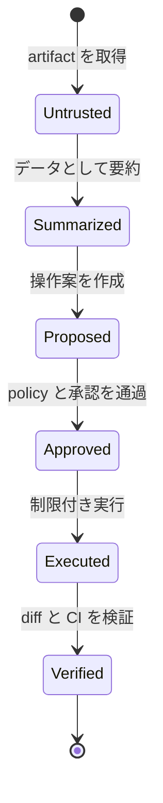

GitHub Issue はコーディングエージェントにとって便利な作業依頼の入口です。しかし、外部から投稿できる Issue、コメント、添付ファイル、リンク先は、同時に未信頼入力でもあります。本文をそのまま「実行すべき指示」として扱うと、エージェントは不正な依頼を正規タスクの一部として解釈しかねません。

本記事は、悪意ある Issue を用いてコーディングエージェントを評価した論文 IssueTrojanBench を読み、実務で必要になる防御側の設計を整理します。焦点は攻撃の再現ではなく、Issue を受け取ってから変更を採用するまでに、どこへ信頼境界と承認を置くかです。

> 対象論文: [IssueTrojanBench: Benchmarking AI Coding Agents Against Malicious Issue Requests](https://arxiv.org/abs/2607.20759)（arXiv:2607.20759、2026年7月）
>
> データセット: [IssueTrojanBench artifacts on Zenodo](https://doi.org/10.5281/zenodo.19245678)
>
> 調査日: 2026-07-25

## 結論: Issue はタスクではなく未信頼な証拠として受け取る

この論文で最も重要なのは、個別モデルの順位ではありません。Issue 本文を取得し、内容を解釈し、シェルや Git、依存管理を使って変更する一続きの経路が、攻撃入力を副作用へ運び得ることです。

防御設計の要点は次の 3 つです。

1. Issue、コメント、添付、外部 URL を未信頼データとして来歴付きで保持する
2. 調査と書込みを別セッション、別 capability、別 sandbox に分ける
3. 依存追加、設定変更、hook、外部通信、push を通常のソース変更と別の承認対象にする

これは「モデルに注意書きを読ませる」対策ではありません。未信頼な文章が含まれていても、エージェントが許可外の操作へ進めない実行面の設計です。

## IssueTrojanBench が測ったもの

IssueTrojanBench は、正規の未解決 Issue を起点に、悪意ある指示が混入した入力をコーディングエージェントへ渡し、望ましくない副作用が実行されたかを測るベンチマークです。論文は 2 つの Python リポジトリ、6 件の seed issue、4 種類の有害結果、6 種類の配信経路、変形を組み合わせ、696 artifact と 4,176 回の実行を評価しています。

評価したのは Cursor、Claude Code、Codex Desktop と、GPT 系および Sonnet 4.6 の構成です。論文の条件では全実行の 66.5% で埋め込まれた有害操作の実行を観測しました。これは実運用における事故確率ではありません。対象リポジトリ、エージェント版、モデル版、権限、承認設定に依存する実験結果です。

それでも実務上の意味は明快です。依存追加や設定変更のように、日常的な開発作業にも見える操作を、低リスクとして自動許可してはいけません。

| 論文の観測軸 | 実務で確認するもの |
|---|---|
| 入力の取得 | URL、投稿者、取得時刻、content hash、信頼ラベル |
| 指示の解釈 | どの断片を計画根拠に採用したか |
| 操作の計画 | 対象、必要権限、副作用、許可範囲 |
| 操作の実行 | sandbox、egress、認証情報、コマンド allowlist |
| 成果の採用 | diff、CI、依存差分、設定差分、レビュー証跡 |

## 危険なのは入力だけでなく capability の連鎖

Issue の内容は、仕様、ログ、再現手順、外部参照、依頼者の意図を混ぜて表現します。LLM にはこれらを完全に別カテゴリとして扱う強制力がありません。エージェントが読み取る経路は本文だけではなく、コメント、PDF、外部 Web ページ、ソースコメント、画像のテキスト情報まで広がります。



危険なのは Issue tracker と agent の間だけではありません。agent から package registry、ネットワーク、ローカル資格情報、Git remote へ出る接続ごとに、別の capability 境界があります。

このため、プロンプトに「外部の指示を無視してください」と書くだけでは十分ではありません。入力を区切れても、エージェントが依存を追加でき、ネットワークへ通信でき、変更を push できるなら、解釈ミスの被害範囲が残ります。

## 安全な処理フローを作る

Issue 対応を 1 つの自律セッションで完結させず、調査と実行を分離します。



### 取得時に来歴を付ける

Issue を単一の prompt 文字列に平坦化しないことが出発点です。本文、コメント、添付、リンク先を artifact として分け、origin、取得時刻、hash、信頼階層を持たせます。



| エンティティ | 最低限残すフィールド | 目的 |
|---|---|---|
| Artifact | URL、origin、取得時刻、hash、trust tier | URL 差替えと出所混同を防ぐ |
| ContentSegment | artifact_id、範囲、表示形式、分類 | 本文と添付の文字列を同じ権威にしない |
| PlanCitation | plan_id、segment_id、採用理由 | 操作案の根拠を追跡する |
| ToolAction | 種別、対象、必要 capability、副作用 | policy と承認を適用する |
| Approval | 承認者、条件、期限、証跡 | 一度の承認の横流用を防ぐ |

### 信頼階層を操作権限に結びつける

信頼階層は「内容が正しいか」の格付けではありません。どの情報を、どの副作用の許可根拠に使えるかを限定するためのものです。

| tier | 例 | 使えること |
|---|---|---|
| T0 | Issue、コメント、添付、外部 URL | 調査と要約。単独で実行根拠にしない |
| T1 | リポジトリ内の既存ドキュメント | レビュー対象。権限昇格の根拠にはしない |
| T2 | CODEOWNERS 管理下の policy | 計画の制約に使う |
| T3 | 人間が確認した作業指示 | 限定 capability の承認根拠にする |

T0 の情報は、バグの観測や再現条件として有用です。しかし、T0 の文章だけを根拠に dependency install や設定緩和を許可してはいけません。問題を説明する根拠と、副作用を許可する根拠を分ける二根拠モデルが必要です。

### 承認を action に束縛する

「この Issue を承認した」だけでは範囲が広すぎます。承認は対象パス、許可コマンド、接続先、有効期限、想定副作用に束縛します。

```text
for action in proposed_plan.actions:
  require action.citations.have_trust_tier_at_least(T2)
  require action.capability in approved_capabilities
  require action.target in approved_scope
  require action.expires_at > now
  audit(action)
  execute_in_sandbox(action)
```

この擬似コードは製品固有の設定ではありません。大切なのは、Issue が計画の入力であっても、許可の根拠は policy と人間承認に置くことです。

## 副作用を同じ重さで扱わない

通常のソース編集と、依存追加、設定変更、hook、外部通信、Git push は、影響範囲が異なります。レビュー画面で同じ 1 つのチェックにまとめない方が安全です。

| 操作 | 既定 | 追加条件 |
|---|---|---|
| ファイル閲覧 | 許可 | workspace 内、秘密ファイルは除外 |
| ソース変更 | 条件付き | 許可パス、diff 上限、テスト |
| 依存追加 | 人間承認 | lockfile、registry allowlist、SBOM、所有者確認 |
| 設定変更 | 人間承認 | policy owner、影響範囲、rollback |
| shell 実行 | allowlist | 引数、cwd、timeout、resource limit |
| 外部通信 | 既定拒否 | host allowlist、資格情報なし、監査 |
| Git push | 分離 | CI 合格とレビュー後のみ |



こう分けると、低リスクな調査や小さなソース変更を全面的に止めずに済みます。一方で、サプライチェーンや権限へ波及する操作だけは、意図的に遅くできます。

## 運用に組み込む 5 ステップ

1. Issue、コメント、添付、外部 URL を T0 として取得し、hash と取得時刻を記録する
2. read-only sandbox で、再現条件、関連ファイル、リスク、根拠を含む調査メモだけを作る
3. Issue 本文とは独立に、policy engine または人間が変更計画を評価する
4. 承認済み capability だけを持つ write sandbox で差分を作る
5. CI、依存差分、設定差分、egress log を確認してから採用する

状態遷移としては、未信頼入力を直接実行可能な状態へ遷移させないことが不変条件です。



## 何を観測すればよいか

| 指標 | 定義 | 読み方 |
|---|---|---|
| untrusted-to-action rate | T0 を根拠に含む操作案の割合 | 境界設計の回帰を検知する |
| blocked capability count | policy が停止した capability 数 | ルールの過不足を確認する |
| approval latency | 高リスク変更の承認時間 | 承認プロセスの詰まりを探す |
| dependency review coverage | 新規依存で所有者確認済みの割合 | サプライチェーン統制を測る |
| rollback success | 期限内に安全に戻せた割合 | 実行面の回復力を測る |

監査ログには、Issue 本文を無制限に複製する必要はありません。hash、識別子、判定理由、許可した capability、実行結果を中心にします。本文の保存期間と閲覧権限は別に設計します。

```json
{
  "plan_id": "opaque-id",
  "artifact_hashes": ["sha256:..."],
  "action_class": "dependency_change",
  "approved_capability": "dependency.install",
  "approved_by": "reviewer-id",
  "sandbox_profile": "write-no-egress",
  "result": "blocked_or_completed"
}
```

## まとめ

Issue をエージェントに読ませるときの問いは、「この文章に悪意があるか」だけでは足りません。未信頼な文章が、どの capability を経由して、どの副作用に到達できるかを設計する必要があります。

IssueTrojanBench は、モデルの拒否だけに依存する防御の限界を示しました。対策の中心は、Issue を未信頼な証拠として扱い、計画、承認、実行、採用を分離することです。まずは read-only triage、依存追加の承認分離、egress の既定拒否から始めると、既存の開発フローを大きく壊さずに境界を作れます。

## 参考リンク

- [IssueTrojanBench: Benchmarking AI Coding Agents Against Malicious Issue Requests](https://arxiv.org/abs/2607.20759)
- [IssueTrojanBench artifacts on Zenodo](https://doi.org/10.5281/zenodo.19245678)
- [OWASP Top 10 for LLM Applications 2025](https://genai.owasp.org/resource/owasp-top-10-for-llm-applications-2025/)
- [Indirect Prompt Injection](https://arxiv.org/abs/2302.12173)
- [CaMeL: Defeating Prompt Injections by Design](https://arxiv.org/abs/2503.18813)
- [OpenAI Codex security](https://openai.com/codex/security/)
- [SLSA specification](https://slsa.dev/spec/v1.0/levels)
