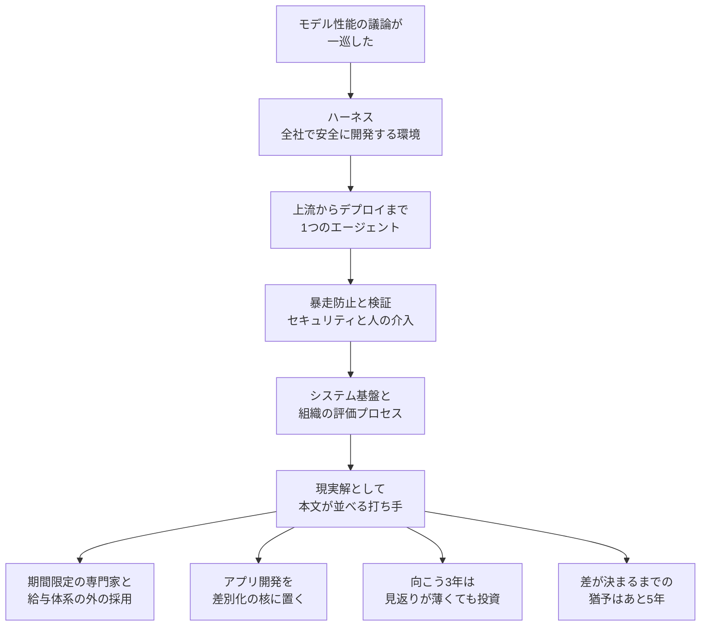

2026年9月29日、＠ITは ITR プリンシパル・アナリスト甲元宏明氏へのインタビューを公開しました。インタビュアーは石川俊明氏です。ページの公開者名は「＠IT」で、可視の公開時刻は「2026年09月29日 05時00分」です。

この記事では、甲元氏がハーネスエンジニアリングと呼ぶ環境の定義と、現実解として挙げる打ち手と、公開されている近い調査の範囲を整理します。

インタビュー本文に、「ほぼ皆無」の標本数は付いていません。

*この記事の全体像。以下、順に解説します。*

## ハーネスエンジニアリングとは

甲元氏は、モデル性能の議論の次に、関心が環境の整備へ移っていると話しています。その環境とは、AIエージェントがアプリ開発を進めるための環境です。環境づくりを、ハーネスエンジニアリングと呼びます。

一般的な日本企業、とくに従来型の大企業・中堅中小・SIer の取り組みは「ほぼ皆無」だとします。先進的な IT ネイティブ企業とスタートアップは、例外に置きます。

### 全工程を1つのエージェントで回すとき

ハーネスが意味を持つのは、1つの AI エージェントが開発を包括的に回すときです。範囲は、上流の設計から実装、コードレビュー、テスト、品質保証、デプロイまでです。工程ごとの局所利用は、この定義ではハーネスエンジニアリングに入りません。

本文が置くハーネスは、エンタープライズが全社で、安全に、エージェントを主体としてアプリ開発させる統合環境です。個人の作業支援ツールや、MCP のような通信規格の単体は、その範囲の外です。

### 環境に含める制御

環境の中身として挙がるのは、次の5つです。

- 暴走や迷走を防ぐ仕掛け
- 意図した結果へ着くテストと性能検証
- セキュリティとコンプライアンス
- 人間が評価し、介入する手続き
- システム基盤と、組織の評価プロセスの両面

現段階で、日本企業が自力だけでハーネスを一から作るのは非現実的だ、と本文は言います。国内で正しく理解し、構築できる専門家はごく少数だ、と続けます。

### 本文が現実解として並べる打ち手

人材の採り方は2つです。先進的な専門家を、期間限定のコンサルタントとして招きます。既存の給与体系の外で、トップエンジニアを「1本釣り」します。定期採用と、標準的な外注では、AI 人材は確保できない、と本文は置きます。

経営トップには、アプリケーション開発を差別化とイノベーションの核だと認識することを求めます。「SIer への支払いを減らすために AI を使う」という目的は捨てます。5年後を見据えた中期戦略で、開発の位置を決めます。

向こう3年間は、直接的なリターンが少なくても投資し続ける経営判断が要る、と本文は言います。グローバルとの差が決まるまでの猶予は「あと5年」だと置きます。

2015年ごろは、アジャイルや内製化に取り組む企業が限定的だった、と本文は回顧します。今は多くの日本企業でアジャイルが中心になり、内製化へのシフトもここ2〜3年で進んでいるので、方向が定まれば巻き返せる、と結びます。

背景として本文が置く構造は、4つです。従来型の SIer 依存です。社内にコードを書ける人がほとんどいないことです。AI を、コードを書かずに安く作る魔法の杖として期待し、足踏みしていることです。目的が、実装工数と人件費の削減に偏っていることです。

### 定義と、今打つ手の2段

このインタビューが描く構造は、2段です。定義は、全工程を1つのエージェントで回すための制御と評価を含みます。今打つ手は、その環境を誰が、どの時間軸で、経営のどの位置に置くかです。

## 注意点

見出しと数値を、どこまで施策の根拠にしてよいかを分けます。

### 「ほぼ皆無」に標本が付いていない

「ほぼ皆無」の母集団、設問、標本数は、インタビュー本文にありません。

公開されている近い調査は、甲元氏の R-22610U です。発刊は2026年9月17日です。調査名は「国内企業におけるアプリケーション開発に関する調査」です。期間は2025年10月16日から10月24日です。有効回答は3,375件です。対象は、開発の現状と計画を把握する担当者です。公開ページの主題は、内製化の基本方針と、個人向け開発ツールへの依存です。ハーネスの普及率は、その公開ページには書かれていません。

JSON-LD の `datePublished` は `2026-09-29T05:00:00Z` です。`dateModified` は `2026-09-29T05:01:00Z` です。可視表記の「05時00分」と、末尾の Z の対応を、ページは説明していません。

### 停滞と進捗が同じ本文に並ぶ

同じ本文は、前半で、人材がおらず足踏みが多いと言います。後半で、アジャイルが中心になり、内製化が2〜3年で進んだと言います。停滞と進捗が、同じインタビューの中に並びます。

### アジャイルが中心だという文の公開標本

「多くの日本企業ではアジャイル開発が中心」を、本人の公開標本で更新した数字としては確認できていません。

I-322072 の発刊は2022年7月1日です。『IT投資動向調査2022』の実施は2021年8月から9月です。公開部分は、「アジャイル開発／DevOpsの推進」について次のように書きます。実施済みは回答全体の17%です。従業員5,000人以上は31%です。情報通信は、実施済み32%に、2022年度中の着手予定23%です。2013年度の大企業の実施済みは10%です。本人は、ウォーターフォールでは DevOps は不可能なので、この設問はアジャイル実施とほぼ同義だ、と書きます。

R-224103 の発刊は2024年10月9日です。公開リードは、国内でもアジャイルの採用は進んでいるが、基幹系を中心にウォーターフォールを使う企業もまだ多い、と書きます。対象が違えば、2026年の「中心」と両立しえます。インタビュー側に分母はありません。2022年以降に過半になった公開標本は、確認できていません。

### 内製化の78%は指向である

C-26010184 の発刊は2026年3月19日です。公開要約は、内製化を指向する企業は78%、市民開発を実施している企業は約3分の1、牽引役の人材が不足、と書きます。78%は指向であり、内製化の達成率ではありません。分母と調査年は、同じ公開ページにありません。

78%は、人材が社内にいない、という前半の文と並ぶと、意識と実行主体が別問題だと読めます。78%の分母は、公開ページの範囲では未確認のままです。

### 定義の狭さが、普及率の見え方を決める

定義が「全工程を1つのエージェントで回す全社環境」だと、リポジトリ単位の権限・評価・停止を公開していても、本人の数え方ではハーネスに入りません。見出しの普及率は、設問の結果である前に、この定義の狭さに依存します。局所の制御を公開していても、「ほぼ皆無」の外側に残ります。普及率のように読むと、定義の効果が、測定の効果に見えます。

### 近い先行公開に、ハーネスという語は無い

定義の近い先行公開は、同じ著者の R-226061 です。発刊は2026年6月1日です。公開リードは、SWE エージェントを、要件理解から実装、テスト、修正までを自律的に繰り返す主体だと書きます。成熟の先は、DevOps 全体の統合だ、と書きます。導入は、ツール選定の前に、内製化と開発プロセスと IT ガバナンスの再設計が要る、と続けます。この公開リードに「ハーネス」という語はありません。標本数もありません。方向は、インタビューの定義と揃います。語は揃いません。

### 語の先行例は、個人環境と1プロダクトである

Mitchell Hashimoto は、2026年2月5日の手記で、エージェントがミスをしたら同じミスを二度としないよう環境を直すことを harness engineering と呼ぶ、と書きます。業界で広く受け入れられた語があるかは分からない、と本人が断っています。範囲は、個人の開発環境です。

OpenAI の Ryan Lopopolo は、2026年2月11日の記事で、1つの社内プロダクトについて次のように書きます。人手のコードは0行です。所要時間は、手書きの約10分の1で、これはチームの見積もりです。最初のコミットは2025年8月下旬です。約5か月で、百万行のオーダーです。pull request は約1,500です。当初3人、のち7人です。1人1日あたり平均3.5件です。社内利用者は数百人です。`AGENTS.md` は約100行です。1回の実行が6時間を超えることがよくあります。以前の金曜の手直しは週の20%で、スケールしませんでした。同種の投資なしには一般化できない、と書きます。

独立した第三者監査の結果は、その公開ページには出ていません。この数字を、日本企業の3年投資の期待リターンとして読む材料にはしません。

OpenAI と Hashimoto の公開は、環境側のフィードバックと制御を、ハーネスの本体として書いています。甲元氏の現実解は、その環境を企業として誰が金と人で持つか、に持ち上がっています。層が違います。

### 日本で再読できた実践は、例外側の自己申告である

「ほぼ皆無」の直前で、本人は IT ネイティブとスタートアップを例外にしています。日本で本文を再読できた実践は、その例外か、それに近いインターネット事業者の自己申告です。

メルカリ NFT チームは、2026年6月30日の記事で、ハーネスの役割を3つに書きます。正解を示すことです。結果を観測することです。危ない操作を止めることです。skill は plugin で配り、案件固有は `-local` で上書きする、と書きます。1月末以降の体制は、エンジニア2人、プロダクト1人、デザイン1人です。PR は増えた、1人あたりは何倍、と書き、倍数の実数は公開部分にありません。会社全体の基盤から離れた PoC だと、本文が断っています。

SmartHR の ani は、2026年9月16日の記事で、未公開機能1件についてハーネスを組んだ、と書きます。材料は、スキルファイルと、JSON の状態と、シェルの完了条件です。機械検査は12項目です。失敗は同じセッションでやり直し、3回で人に戻します。変更してよいパスは、定義ファイル1つに限ります。最終レビューの1観点が、誰がどの操作をできるか、です。見積もりは、実質工数でおおよそ2.5か月です。ハーネスを先に作ったあとは、大きな手戻りなく、ほぼ1か月で実装を一通り終えた、と書きます。状態ファイルは、10タスク時点で118KBになり、分割した、と書きます。本人は、ハーネスは銀の弾丸ではない、と限定します。独立した計測はありません。

GMOインターネットの平野空暉氏は、ConoHa VPS の MCP サーバー開発について、逸脱を検知し、修正し、停止するハーネスを書いています。初出は2026年3月17日で、更新表記は2026年4月23日です。12カテゴリ、48ルールです。L1 は `harness/patterns/*.md` の15ファイルです。後段の移行の叙述は、681行の単一ファイルを16ファイルに分割した、と書きます。同じ記事の中で、15と16が揃っていません。L3 の blocking は、Biome、dependency-cruiser、knip、npm audit です。`architecture.test.ts` の不変条件は23個です。最終レビュー日から90日、という週次スキャンは検討中です。範囲は1プロダクトであり、全社の開発環境ではありません。

メルカリの全社展開は、同じ＠ITの別稿にあります。取得した HTML の公開表記は「2026年08月13日 05時00分」です。公開リードが述べるのは、2026年5月からの Claude Code と Claude Cowork の全社展開です。ローカルファイルと OS コマンドを実行できるツールの配布には、ガバナンス課題がある、ということです。権限設計の全体は会員限定の本文にあり、この記事の根拠には使っていません。対象は IT ネイティブ企業です。

＠IT の別稿は、加山恵美氏、編集は石川俊明氏、公開表記は2026年09月01日 05時00分、2ページ目です。内容はカンファレンス紹介です。自分で作るハーネスを、筆者は3つに整理しています。方向性は、Constitution や Skills です。逸脱を止めるガードレールは、Lint、型、test、CI、Hooks です。3つ目は、自己修復のループです。Runnable、Accessible、Verifiable の3項目を呼びかけているのは、抜粋上はミラー氏です。FPTジャパンホールディングスの澁谷暢大氏は、成熟度の分類と、品質を確保するパイプラインを構築できるか、という指摘として引かれています。登壇の紹介であり、FPT が全社ハーネスを運用した一次資料ではありません。

### この記事が数字を書かない項目

みずほ証券の Devin 展開、PoC の工数、みずほフィナンシャルグループの投資額は、再確認できた公開本文が無いため、人数も投資額も工数も書きません。

Nstock の講演スライドが挙げる Skills や Hooks の個数、サイバーエージェントの技術ブログが挙げる再現率も、再確認できた公開本文が無いため書きません。

従来型の大企業と古典的 SIer が、2026年に全社の開発ハーネスを自社の技術文書で公開した例は、公開検索では確認できていません。確認できなかったことを、存在しないこととしては扱いません。従来型企業の全社ハーネスが公開一次に見当たらなかったことは、従来型に実装が無いことの証明にはなっていません。

### まだ公開本文で閉じていない問い

次は、公開本文の範囲では閉じていません。

- 会員限定の ITR 本文に、「ほぼ皆無」「あと5年」「向こう3年」「専門家はごく少数」の標本があるか。
- R-22610U の会員限定部分に、個人向けツール依存のパーセントと、ハーネスに相当する設問があるか。
- C-26010184 の78%と約3分の1の母集団、時点、設問文。
- 2022年以降のアジャイル実施率が、公開一次で過半になっているか。
- メルカリ全社展開の記事本文が、権限、評価、停止、技能の版管理を、どこまで仕様として書いているか。
- 従来型の大企業と古典的 SIer が、自社名義の技術文書で全社ハーネスを公開しているか。

## 現実解の打ち手は、4枠の製品名を持たない

次の投資を決めるときは、見出しの「ほぼ皆無」を測定値として使いません。本文が名指しする打ち手は、人材へのアクセス、3年は直接の見返りが薄くても続ける投資判断、アプリ開発を戦略の核に置くことです。環境の中身として本文が先に列挙している制御は、その打ち手の対象として別枠で照合します。

権限、評価、停止、技能の版管理の4枠は、読者が持ち込む照合用の枠です。処方の行に「対応する語は本文に無い」と書くのは、その打ち手が4枠の製品名を持たない、という意味です。

### 本文が打ち手として並べているもの

| 本文の処方 | 権限 | 評価 | 停止 | 技能の版管理 |
|---|---|---|---|---|
| 今は自力だけで一から作らない。国内の専門家はごく少数 | 対応する語は本文に無い | 対応する語は本文に無い | 対応する語は本文に無い | 対応する語は本文に無い |
| 定期採用と標準的な外注では AI 人材は確保できない | 対応する語は本文に無い | 対応する語は本文に無い | 対応する語は本文に無い | 対応する語は本文に無い |
| 期間限定でコンサルタントを招く | 対応する語は本文に無い | 対応する語は本文に無い | 対応する語は本文に無い | 対応する語は本文に無い |
| 給与体系の外でトップエンジニアを1本釣りする | 対応する語は本文に無い | 対応する語は本文に無い | 対応する語は本文に無い | 対応する語は本文に無い |
| アプリ開発を差別化とイノベーションの核だと経営が認識する | 対応する語は本文に無い | 対応する語は本文に無い | 対応する語は本文に無い | 対応する語は本文に無い |
| SIer 支払いの削減を目的にせず、5年の中期戦略で開発の位置を決める | 対応する語は本文に無い | 対応する語は本文に無い | 対応する語は本文に無い | 対応する語は本文に無い |
| 向こう3年は直接の見返りが薄くても投資する | 対応する語は本文に無い | 対応する語は本文に無い | 対応する語は本文に無い | 対応する語は本文に無い |
| 猶予はあと5年 | 対応する語は本文に無い | 対応する語は本文に無い | 対応する語は本文に無い | 対応する語は本文に無い |
| 2015年ごろのアジャイルと内製化も、方向が定まれば広がった | 対応する語は本文に無い | 対応する語は本文に無い | 対応する語は本文に無い | 対応する語は本文に無い |

### 定義の中で、環境の中身として挙がっているもの

| 定義の要素 | 権限 | 評価 | 停止 | 技能の版管理 |
|---|---|---|---|---|
| 暴走や迷走を防ぐ仕掛け | 誰が何を実行できるかは書いていない | | 概念として対応する。機構名は無い | 本文に無い |
| テストと性能検証 | | 対応する。採点基盤の設計は無い | | 本文に無い |
| セキュリティとコンプライアンス | 隣接する。IAM やサンドボックスという語は本文に無い | | | 本文に無い |
| 人間が評価し、介入する | | 「評価」という語がある | 介入として部分的に対応する。kill switch という語は本文に無い | 本文に無い |
| インフラと、組織の評価プロセス | | 組織側の評価プロセスがある | | 本文に無い |

技能の版管理は、読者が持ち込む枠です。本文の処方にも定義にも、スキルのバージョンを管理する手順はありません。メルカリの `-local` 上書きと、GMO のパターンファイルは、公開実践の側にあります。甲元氏のインタビューの打ち手一覧にはありません。

処方の表は、＠IT のインタビュー本文から取っています。4枠の製品名は、その箇条に出てきません。R-22610U は、同じ著者の直近の開発動向調査として実在します。公開ページは、その調査をハーネス普及率の測定だとは書いていません。

## 次の予算で照合する項目

社内の現状照合は、2段で行います。

1. 本文の打ち手と照らします。次の予算が、モデル契約の更新だけに寄っているかを見ます。期間限定の専門家、給与体系の外の採用、アプリ開発を差別化の核に置く中期戦略、向こう3年は直接の見返りが薄くても続ける判断、のどれが社内の議題に載っているかを見ます。
2. 定義節の環境と照らします。暴走や迷走を止める仕掛け、テストと性能検証、セキュリティとコンプライアンス、人が評価し介入する手続きが、全工程を1つのエージェントで回す単位で存在するかを見ます。工程ごとの補助利用しか無い状態を、本人の定義ではハーネスと呼びません。
3. 技能の版管理は、このインタビューの処方から自動では出てきません。社内でスキルを配るなら、メルカリの plugin と `-local`、GMO のパターンファイルのように、公開実践の側を別に参照します。
4. 自社の説明を書くときは、内製化の停滞や全社義務化の経験談とは別に、不足を作業の束として切ります。束の中身は、このインタビューでは2つです。1つは、人材と3年投資と戦略上の位置です。もう1つは、定義節の制御です。見出しの「ほぼ皆無」だけで、モデル契約をやめるか、制御の製品を買うかを決めません。

見立てが覆る条件は、次の2つです。会員限定の ITR 調査に、従来型企業のハーネス普及率と標本設計が出て、見出しが測定結果だと分かったときです。従来型企業の自社技術文書が、全工程を1つのエージェントで回す全社環境を公開したときです。そのどちらかが揃うまで、この見立ては一人のアナリストの範囲付き評価として扱います。

## まとめ

甲元氏がハーネスと呼ぶのは、上流からデプロイまでを1つの AI エージェントが回す、全社の統合環境です。中身は、暴走防止、テストと性能検証、セキュリティとコンプライアンス、人が評価し介入する手続き、システム基盤と組織の評価プロセスです。現実解として名指しされるのは、期間限定の専門家、給与体系の外の採用、アプリ開発を差別化の核に置くこと、向こう3年は直接の見返りが薄くても投資すること、猶予はあと5年であることです。

「ほぼ皆無」には、インタビュー本文の標本が付いていません。近い公開調査 R-22610U の主題は、内製化方針と個人向けツール依存であり、ハーネス普及率ではありません。アジャイルが中心だという文は、2021年調査の実施済み17%や、2024年の基幹系ウォーターフォールの公開リードと、強さが揃っていません。内製化78%は指向です。

次の予算で見るのは、人材と3年投資と戦略上の位置と、定義節の制御です。権限の製品名、停止ボタン、技能の版管理は、このインタビューの処方表にはありません。会員限定の標本か、従来型企業の自社文書が出るまで、見出しは測定値として使いません。

この記事が少しでも参考になった、あるいは改善点などがあれば、ぜひリアクションやコメント、SNSでのシェアをいただけると励みになります！

## 参考リンク

- [石川俊明、甲元宏明。＠IT](https://atmarkit.itmedia.co.jp/ait/articles/2609/28/news027.html)（公開表記 2026年9月29日）
- [甲元宏明。ITR。R-226061](https://www.itr.co.jp/report-library/r-226061)（2026年6月1日）
- [甲元宏明。ITR。R-22610U「国内企業におけるアプリケーション開発に関する調査」](https://www.itr.co.jp/report-library/r-22610u)（2026年9月17日）
- [甲元宏明。ITR。C-26010184](https://www.itr.co.jp/report-library/c-26010184)（2026年3月19日）
- [甲元宏明。ITR。R-224103](https://www.itr.co.jp/report-library/r-224103)（2024年10月9日）
- [甲元宏明。ITR。I-322072](https://www.itr.co.jp/report-library/i-322072)（2022年7月1日）
- [Mitchell Hashimoto](https://mitchellh.com/writing/my-ai-adoption-journey)（2026年2月5日）
- [Ryan Lopopolo。OpenAI](https://openai.com/index/harness-engineering/)（2026年2月11日）
- [YamaguchiToshikazu。メルカリ](https://engineering.mercari.com/blog/entry/20260630-b22667b4d6/)（2026年6月30日）
- [ani。SmartHR](https://tech.smarthr.jp/entry/2026/09/16/110205)（2026年9月16日）
- [平野空暉。GMOインターネット](https://developers.gmo.jp/technology/81389/)（初出 2026年3月17日、更新表記 2026年4月23日）
- [石川俊明。＠IT](https://atmarkit.itmedia.co.jp/ait/articles/2608/04/news002.html)（公開表記 2026年8月13日）
- [加山恵美、編集・石川俊明。＠IT](https://atmarkit.itmedia.co.jp/ait/articles/2609/01/news012_2.html)（公開表記 2026年9月1日）
