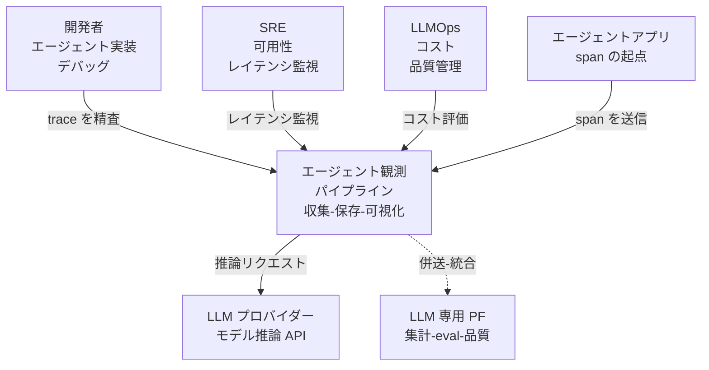
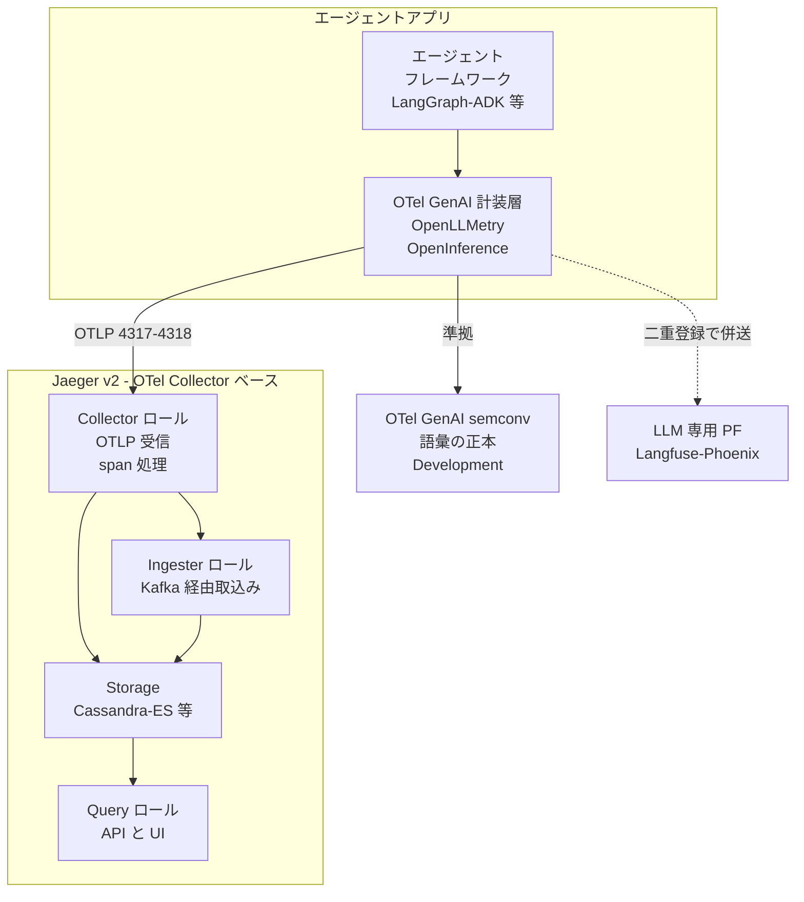
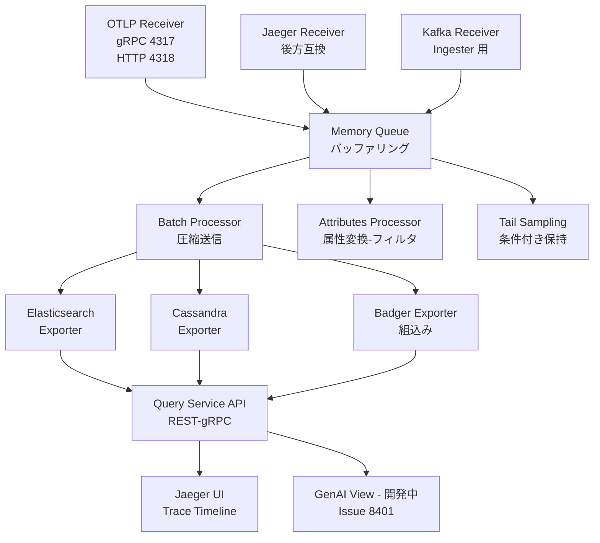
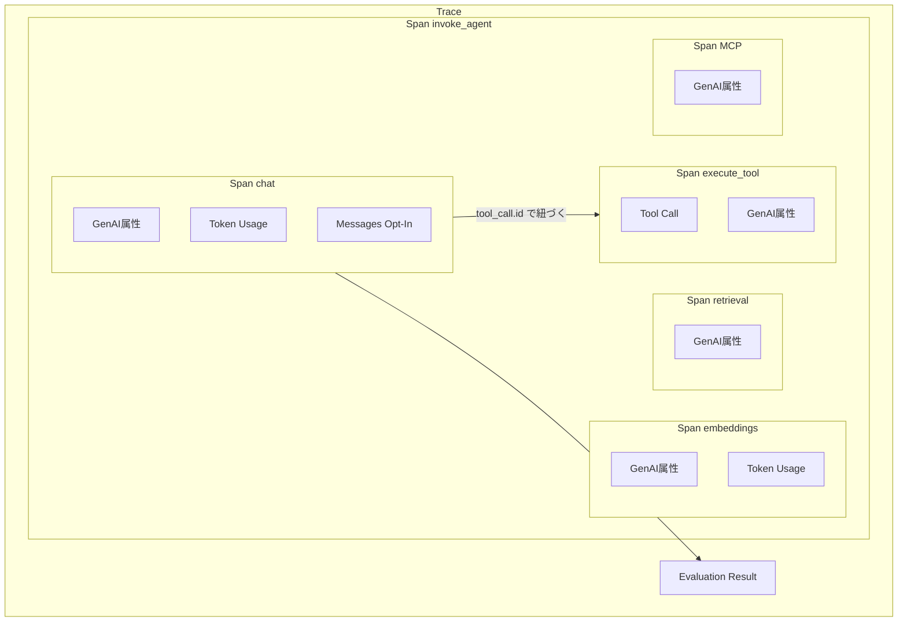
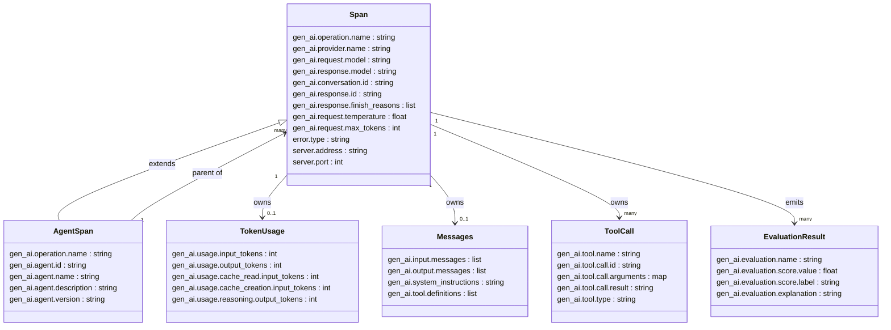

> 起点: CNCF Blog「How Jaeger is Evolving to Trace AI Agents with OpenTelemetry」(2026-05-26)
> 検証日: 2026-05-27 / 対象読者: 実装エンジニア・SRE・LLMOps

AI エージェントの実行は「プロンプト組み立て → LLM 呼び出し → ツール選択 → ツール実行 → 外部 API → 再計画」という非線形な連鎖で進みます。従来のマイクロサービス向け分散トレーシングでは、LLM 呼び出し単位のレイテンシは可視化できても、「なぜそのツールを選んだのか」という**意思決定の層**が欠落します。

この記事では、Jaeger v2 と OpenTelemetry GenAI Semantic Conventions を使って、エージェントの「意思決定 → ツール実行」の経路を 1 本のトレースに載せる方法を、構造・データ・実装・運用の順に整理します。

## 概要

### なぜエージェント観測に分散トレーシングが必要か

エージェント観測に分散トレーシングが必要な理由は 3 点に集約されます。

1. **実行経路の可視化**: 単一リクエストが複数の LLM 呼び出し・ツール実行にまたがる連鎖を、1 本のトレースとして可視化できます。
2. **因果関係の追跡**: `invoke_agent → chat → execute_tool` の親子関係により、「どの意思決定がどのツール実行を引き起こしたか」を span の親子構造で追えます。
3. **共通語彙の確立**: OpenTelemetry GenAI Semantic Conventions が計装・バックエンド・観測ツールをまたぐ共通語彙を提供し、フレームワーク・ベンダ横断での相互運用を可能にします。

本番稼働組織の 71.5% が個別ステップまで見るフルトレーシングを保有しているという調査結果もあります（LangChain 2025/12 調査、二次情報）。

### Jaeger v2 とは何か

Jaeger は Uber が 2015 年に開発し、2019-10-31 に CNCF Graduated Project に昇格した分散トレーシング基盤です（GitHub star 約 22,800、2026-05-27 時点）。v2（最新 v2.18.0 = 2026-05-13）では OpenTelemetry Collector のカスタムディストリビューションとして全面再構築されました。

| 項目 | v1 | v2 |
|---|---|---|
| 基盤 | 独自収集機構 | OpenTelemetry Collector フレームワーク |
| OTLP 受信 | `COLLECTOR_OTLP_ENABLED=true` で有効化 | デフォルト有効（gRPC 4317 / HTTP 4318） |
| バイナリ構成 | agent / collector / ingester / query の複数バイナリ | 単一バイナリ + YAML でロール設定 |
| 中間変換 | あり | なし（OTLP ネイティブ受信で排除） |

「OTLP をそのまま受ける」構造が、OTel ベースの GenAI 計装ライブラリ（OpenLLMetry / OpenInference / Logfire 等）を**設定変更だけで**接続できる土台になっています。

### OpenTelemetry GenAI Semantic Conventions とは何か

OTel GenAI Semantic Conventions は、LLM・エージェント・ツール実行を OTel の span・属性・メトリクスで表現するための**共通語彙**を定義する仕様です。span operation は 9 種定義されており、エージェント観測に特に重要なものは次の 3 つです。

| span operation | 意味 |
|---|---|
| `invoke_agent` | エージェントの 1 ターン全体（親 span） |
| `chat` | LLM が「どのツールを呼ぶか」を決める意思決定 |
| `execute_tool` | ツール実行。`gen_ai.tool.call.id` で `chat` span と紐づく |

:::message
GenAI conventions 全体は 2026-05-27 時点で **Development（非 Stable）** ステータスです。最新版を採用するには `OTEL_SEMCONV_STABILITY_OPT_IN` の明示 opt-in が必要で、マイナーリリースでも破壊的変更が入りえます。本番への長期依拠は時期尚早です。
:::

### LLM 専用観測プラットフォームとの位置づけ

Jaeger は**個別トレースを精査する道具**として機能します。一方、Langfuse・Phoenix・LangSmith・Braintrust などの LLM 専用観測プラットフォームは、trace に加えて eval・プロンプト管理・コスト集計を統合した上位レイヤとして機能します。

| 観点 | Jaeger v2 | LLM 専用 PF（Langfuse / Phoenix 等） |
|---|---|---|
| trace 精査 | 強み。span 親子・タイムライン・属性検索。ただし GenAI 向け UI は開発中（Issue #8401） | 強み。prompt/response/tool call を LLM 専用 UI で表示 |
| metrics | 非対応。集計は別 backend が必要 | 強み。token usage・cost・latency 集計を内蔵 |
| eval（品質評価） | 非対応（`gen_ai.evaluation.result` での付与のみ可） | 強み。LLM-as-judge・データセット評価を内蔵 |
| コスト可視化 | 非対応（カスタム属性の手動運用） | 対応（料金テーブル × トークン数で自動計算） |
| OTLP 互換 | ネイティブ（4317/4318 直接受信） | 対応（Langfuse は `/api/public/otel`、固有エンドポイントへ転送） |
| プロンプト管理 | 非対応 | 対応（バージョン管理・A/B テスト） |
| セルフホスト / コスト | 可能 / OSS 無料 | Langfuse・Phoenix は可 / 〜従量課金 SaaS |

両者は対立ではなく**補完関係**です。LLM 専用 PF も OTel / OpenInference を ingest 経路に採用しており、「OTel が共通土台」という流れはむしろ補強されます。現実解は **SpanProcessor 二重登録による併用**（Jaeger=精査、Langfuse/Phoenix=集計・eval）です。

### エコシステムと標準動向（MCP / ACP / AG-UI）

「観測性がプロダクト個別実装からプロトコル側へ寄っている」という見方は半分正しく、正確には**プロトコル本体ではなく、横断標準の OpenTelemetry GenAI / MCP semconv へ寄っています**。

| プロトコル | 観測性の扱い | 状態 |
|---|---|---|
| MCP | 本体仕様に normative 規定なし。OTel `gen-ai/mcp` semconv に外部化（`traceparent` を `params._meta` に inject） | Development、伝播は SHOULD 止まり |
| ACP（IBM Agent Communication Protocol） | 仕様外。実装の BeeAI が OTel → Arize Phoenix で担う | リポジトリ archived（A2A/Linux Foundation へ統合） |
| ACP（AGNTCY Agent Connect Protocol） | 別 SDK `agntcy/observe`（OTel LLM semconv 拡張）に分離 | acp-spec は archived、observe はアクティブ |
| AG-UI | 観測性を仕様化していない。Microsoft Agent Framework / Mastra 等が OTel で別レイヤとして担当 | 本体アクティブ |

MCP が観測性標準化の最前線、AGNTCY が分離設計の好例です。プロトコル"内"標準化は未完です。

## 構造

### システムコンテキスト図

エージェント観測パイプラインが「誰」と「何」に囲まれているかを示します。



| 要素名 | 説明 |
|---|---|
| 開発者 | エージェントを実装・デバッグする。trace で意思決定経路を検証する |
| SRE | レイテンシ・エラー率・可用性を監視する |
| LLMOps | トークン消費・コスト・応答品質を継続管理する |
| エージェントアプリ | エージェントフレームワークを実行する主体。span の生成源 |
| エージェント観測パイプライン | 本記事の対象システム。span の受信・保存・可視化を担う |
| LLM プロバイダー | モデル推論を提供する外部 API |
| LLM 専用 PF | トークン集計・eval・コスト比較を担う外部プラットフォーム |

### コンテナ図

観測パイプライン内部を、協調するプロセス群・ライブラリで分解します。



| 要素名 | 説明 |
|---|---|
| エージェントフレームワーク | エージェントの制御フローを実装するライブラリ群 |
| OTel GenAI 計装層 | OTel SDK + GenAI 計装。span を生成し OTLP でエクスポートする |
| OTel GenAI semconv | invoke_agent / chat / execute_tool など span 語彙を定義する仕様 |
| Collector ロール | OTLP を受信し、プロセッサ経由でストレージへ書き込む中核 |
| Ingester ロール | Kafka から span を取り込みストレージへ書く。大規模構成で使用 |
| Query ロール | トレース検索 API と Web UI を提供する |
| Storage | Cassandra / Elasticsearch / Badger 等。span の永続化を担う |
| LLM 専用 PF | 集計・eval・品質比較を担う。SpanProcessor 二重登録で併送する |

### コンポーネント図

Jaeger v2 内部を OTel Collector のコンポーネントモデルでドリルダウンします。



| 要素名 | 説明 |
|---|---|
| OTLP Receiver | gRPC 4317 / HTTP 4318 で OTLP span を受信する。v2 のデフォルト受信口 |
| Jaeger Receiver | Jaeger 独自プロトコルを受信する後方互換レシーバ。移行期に使用する |
| Kafka Receiver | Ingester ロール時に Kafka トピックから span を取り込む |
| Memory Queue | 受信した span を一時バッファリングする |
| Batch Processor | span をバッチ圧縮してストレージへ効率的に書き込む |
| Attributes Processor | span 属性を変換・フィルタする。PII マスキングにも活用できる |
| Tail Sampling | trace 完了後に条件でサンプリングし、コストを抑える |
| Elasticsearch Exporter | 大規模本番環境向けのストレージエクスポーター |
| Cassandra Exporter | 書き込み分散が得意なストレージエクスポーター |
| Badger Exporter | 組み込みキーバリューストア。all-in-one / 開発用途に向く |
| Query Service API | REST / gRPC でトレース検索・取得 API を公開する |
| Jaeger UI | Trace Timeline で span 親子・時系列を精査する既存 UI |
| GenAI View - 開発中 | invoke_agent / chat / execute_tool 階層を GenAI 特化で可視化する。Issue 8401 で進行中 |

## データ

OTel GenAI Semantic Conventions（Development）が定義するトレースのデータ構造を、概念モデルと情報モデルの 2 層で示します。

### 概念モデル

エンティティ名のみを記載します。所有は subgraph、利用は矢印で示します。



| 要素名 | 説明 |
|---|---|
| Trace | 1 リクエストの実行経路全体を束ねる単位 |
| Span invoke_agent | エージェントの 1 ターン全体を表す親 span |
| Span chat | LLM 呼び出し（意思決定）を表す子 span |
| Span execute_tool | ツール実行を表す子 span。MCP 呼び出しもこの一種 |
| Span embeddings | 埋め込み生成を表す子 span |
| Span retrieval | 検索（RAG）を表す子 span |
| Token Usage | 入出力・キャッシュ・reasoning のトークン量 |
| Messages Opt-In | プロンプト・応答全文。PII を含むため既定 OFF |
| Tool Call | ツール名・引数・結果。call.id で chat と execute_tool を紐づける |
| Evaluation Result | span に紐づく評価スコア（event として記録） |

### 情報モデル

主要属性のみ記載します。型は汎用名（string / int / list / map / float / bool）を使います。



補足は次のとおりです。

- `gen_ai.operation.name` の値は `chat` / `text_completion` / `embeddings` / `generate_content` / `retrieval` / `execute_tool` / `create_agent` / `invoke_agent` / `invoke_workflow` の 9 種です。
- `AgentSpan` は `invoke_agent` または `create_agent` を operation に持つ Span の特化形です。
- `Messages` の各属性は **Opt-In**（PII を含みうるため明示有効化が必要）です。
- `ToolCall.gen_ai.tool.call.id` は `chat` の出力中の tool_call と `execute_tool` span を対応付けるキーです。
- `EvaluationResult` は Span 属性ではなく `gen_ai.evaluation.result` **イベント**として emit されます。
- MCP Span は `execute_tool` の一種で、`traceparent` を `params._meta` に inject して伝播します（SHOULD / Development）。
- 全 `gen_ai.*` 属性は Development。`error.type` / `server.address` / `server.port` のみ Stable（汎用 semconv 由来）です。

## 構築方法

### Jaeger v2 の起動

Jaeger v2（最新 v2.18.0、2026-05-13）は単一イメージ `jaegertracing/jaeger` で提供されます。OTLP レシーバはデフォルト有効のため追加設定は不要です。

前提条件は次のとおりです。

- Docker または Podman（ローカル検証時）
- Python 3.9+（計装コード側）
- ポート開放: `16686`（UI）、`4317`（OTLP/gRPC）、`4318`（OTLP/HTTP）

```bash
docker run -d --name jaeger \
  -p 16686:16686 \
  -p 4317:4317 \
  -p 4318:4318 \
  jaegertracing/jaeger:2.18.0
```

起動確認:

```bash
curl -s http://localhost:16686/api/services   # {"data":[],...} が返れば OK
```

### Jaeger v1 との差（後方互換メモ）

| 項目 | v1 (all-in-one) | v2 (jaeger) |
|---|---|---|
| イメージ名 | `jaegertracing/all-in-one` | `jaegertracing/jaeger` |
| OTLP 有効化 | `COLLECTOR_OTLP_ENABLED=true` 必須 | デフォルト有効 |
| 設定方式 | 環境変数 | YAML 設定（OTel Collector 形式） |
| 構成 | 複数バイナリ | 単一バイナリ + ロール設定 |

v1 を使う場合の起動例:

```bash
docker run -d --name jaeger \
  -e COLLECTOR_OTLP_ENABLED=true \
  -p 16686:16686 -p 4317:4317 -p 4318:4318 \
  jaegertracing/all-in-one:latest
```

## 利用方法

### 必須パラメータ一覧

| パラメータ | 値（Jaeger ローカル） | 用途 |
|---|---|---|
| エンドポイント (HTTP) | `http://localhost:4318/v1/traces` | OTLP/HTTP で送信 |
| エンドポイント (gRPC) | `http://localhost:4317` | OTLP/gRPC で送信 |
| `OTEL_EXPORTER_OTLP_ENDPOINT` | `http://localhost:4318` | SDK 共通環境変数（`/v1/traces` は自動付加） |
| UI | `http://localhost:16686` | トレース閲覧 |

:::message
`OTEL_EXPORTER_OTLP_ENDPOINT` はベース URL のみ指定します。SDK が `/v1/traces` を自動付加します。exporter に直接 URL を渡す場合は `/v1/traces` まで含めます。
:::

### パターン A: OpenInference + LangChain → Jaeger（最短）

```bash
pip install openinference-instrumentation-langchain \
            opentelemetry-sdk opentelemetry-exporter-otlp-proto-http \
            langchain langgraph langchain-openai
```

```python
from opentelemetry import trace
from opentelemetry.sdk.resources import Resource
from opentelemetry.sdk.trace import TracerProvider
from opentelemetry.sdk.trace.export import BatchSpanProcessor
from opentelemetry.exporter.otlp.proto.http.trace_exporter import OTLPSpanExporter
from openinference.instrumentation.langchain import LangChainInstrumentor

provider = TracerProvider(resource=Resource.create({"service.name": "agent-demo"}))
provider.add_span_processor(
    BatchSpanProcessor(OTLPSpanExporter("http://localhost:4318/v1/traces"))
)
trace.set_tracer_provider(provider)
LangChainInstrumentor().instrument(tracer_provider=provider)
# 以降は通常通りエージェントを実行 → Jaeger UI で trace を閲覧
```

### パターン B: OpenLLMetry（環境変数だけで送信）

```bash
pip install traceloop-sdk
export TRACELOOP_BASE_URL="http://localhost:4318"   # SDK が /v1/traces を自動付加
```

```python
from traceloop.sdk import Traceloop
from traceloop.sdk.decorators import workflow, agent, tool

Traceloop.init(app_name="agent-demo")

@tool(name="search_web")
def search_web(query: str) -> str: ...

@agent(name="researcher")
def researcher(query: str) -> str:
    return search_web(query)        # → execute_tool 子 span

@workflow(name="research_flow")
def main(query: str) -> str:
    return researcher(query)        # → invoke_agent 子 span を内包
```

### パターン C: Google ADK 1.17.0+（コード変更ほぼ不要）

```bash
export OTEL_EXPORTER_OTLP_TRACES_ENDPOINT="http://localhost:4318/v1/traces"
```

ADK 1.17.0 以降は OTel 内蔵で、agent 実行がそのままトレース対象になります。自動生成される span 階層（GenAI semconv 準拠）は次のとおりです。

```
invoke_agent {agent.name}          ← root span: エージェント実行全体
├── chat {model}                   ← 子 span: LLM 呼び出し（意思決定）
│     gen_ai.response.finish_reasons=tool_calls   ← ツール使用決定の証跡
├── execute_tool {tool.name}       ← 子 span: ツール実行
│     gen_ai.tool.call.id          ← 意思決定との紐付け
└── chat {model}                   ← 子 span: ツール結果を踏まえ再推論
```

### パターン D: Jaeger + Langfuse への二重送信

`BatchSpanProcessor` を 2 つ登録し、同一トレースを Jaeger（精査）と Langfuse（eval・コスト）に同時送信します。

```python
import base64
from opentelemetry.sdk.trace import TracerProvider
from opentelemetry.sdk.trace.export import BatchSpanProcessor
from opentelemetry.exporter.otlp.proto.http.trace_exporter import OTLPSpanExporter
from openinference.instrumentation.langchain import LangChainInstrumentor
from opentelemetry import trace

langfuse_auth = base64.b64encode(b"pk-lf-...:sk-lf-...").decode()
provider = TracerProvider()
# 宛先1: Jaeger（精査）
provider.add_span_processor(
    BatchSpanProcessor(OTLPSpanExporter("http://localhost:4318/v1/traces"))
)
# 宛先2: Langfuse（eval・コスト。OTLP/HTTP のみ、gRPC 非対応）
provider.add_span_processor(
    BatchSpanProcessor(OTLPSpanExporter(
        endpoint="https://cloud.langfuse.com/api/public/otel/v1/traces",
        headers={"Authorization": f"Basic {langfuse_auth}"},
    ))
)
trace.set_tracer_provider(provider)
LangChainInstrumentor().instrument(tracer_provider=provider)
```

### Jaeger UI で「意思決定→ツール実行」を読む

1. `http://localhost:16686` にアクセスし、Service で `agent-demo` を選択 → Find Traces。
2. `invoke_agent` 親 span を展開する。
3. 子 span `chat {model}` の `gen_ai.response.finish_reasons` が `tool_calls` → **LLM がツール使用を決定した証跡**。
4. 続く `execute_tool {tool.name}` span の `gen_ai.tool.call.id` → **どの決定がどの実行を引き起こしたかの紐付け**。
5. timeline で「思考 → 実行 → 再思考」のサイクルが一望できる。

## 運用

### trace の保持とサンプリング戦略

AI エージェントは長時間実行・多段ツール呼び出しで、1 trace あたりの span 数が数十〜数百に膨れやすいです。

- **開発・デバッグ**: 全量収集（`AlwaysOn`）。
- **ステージング〜本番**: `ParentBased(root=TraceIdRatioBased)` で調整。エージェントは 1 trace が長大なため **tail-based sampling** を推奨します。OTel Collector の `tail_sampling` で「エラー含む trace は 100% 保持、正常は 10%」を実現できます。
- **高コスト trace の全量保持**: `gen_ai.usage.input_tokens` でフィルタする tail ルールを設けます。

```yaml
processors:
  tail_sampling:
    decision_wait: 10s
    policies:
      - name: errors-policy
        type: status_code
        status_code: {status_codes: [ERROR]}
      - name: token-heavy-policy
        type: numeric_attribute
        numeric_attribute: {key: gen_ai.usage.input_tokens, min_value: 10000}
      - name: probabilistic-policy
        type: probabilistic
        probabilistic: {sampling_percentage: 10}
```

### ストレージ backend 選定

| backend | 特徴 | エージェント観測での位置づけ |
|---|---|---|
| Badger（デフォルト・組込み） | 単一バイナリ内完結 | 開発・検証用。本番不向き（HA なし） |
| Cassandra | 書き込み高スループット | 大規模本番向け。span 数が多い用途に強い |
| Elasticsearch / OpenSearch | 全文検索・属性絞り込み | `gen_ai.agent.name` 等での検索に適する |
| Kafka + Cassandra/ES | Collector と Storage を非同期分離 | 高トラフィックの背圧対策 |

保持期間はエージェントトレースの診断価値が高いため、デフォルト 2 日より長い 14〜30 日を推奨します（`--es.max-span-age` / Cassandra TTL で制御）。

### トークン/コスト集計は別 metrics backend が必要

Jaeger は traces のみを対象とし、metrics を集計しません。`gen_ai.usage.*` は個別 span 属性として保存されますが、「モデル別の 1 日のトークン総量」のような集計ダッシュボードは Jaeger 単体では作れません。metrics（`gen_ai.client.token.usage` ヒストグラム）は Prometheus + Grafana か LLM 専用 PF に二重送信します。

## ベストプラクティス

1. **計装を OTel GenAI semconv に統一する**: `gen_ai.operation.name` を統一語彙に揃える。OTel ネイティブでないフレームワーク（OpenAI Agents SDK 等）は OpenLLMetry / OpenInference を挟む。
2. **`OTEL_SEMCONV_STABILITY_OPT_IN` で版を固定する**: semconv は Development で破壊的変更あり。`gen_ai_latest_experimental` を opt-in する際は CI でライブラリバージョンをピン留めし changelog を監視する。デフォルトは旧属性名固定の点に注意。
3. **意思決定の証跡を span に残す**: 標準で取れる `finish_reasons` / `gen_ai.tool.call.*` を活用。reasoning の中身は Opt-In の `gen_ai.input.messages` / `output.messages`（PII マスキング方針を先に決める）。reasoning テキスト格納は未標準で、厚く記録するなら OpenInference の `message_content.type=reasoning` 拡張。
4. **精査用と集計用を分け SpanProcessor 二重送信する**: Jaeger=trace 精査、Prometheus/Grafana か Langfuse/Phoenix=集計・eval。
5. **MCP 境界の trace context 伝播を自前検証する**: `params._meta.traceparent` が実際に渡っているかを Jaeger の span で確認し、tool server 側にも `W3CTraceContextPropagator` を入れる。

```python
# reasoning を Opt-In かつマスキング付きで記録する例
import re
from opentelemetry import trace
tracer = trace.get_tracer(__name__)

def mask_pii(text: str) -> str:
    return re.sub(r'[\w.-]+@[\w.-]+', '[EMAIL]', text)

with tracer.start_as_current_span("chat gpt-4o") as span:
    response = llm.invoke(prompt)
    span.set_attribute("gen_ai.output.messages", mask_pii(str(response)))
    span.set_attribute("gen_ai.response.finish_reasons", response.finish_reasons)
```

## トラブルシューティング

| 症状 | 原因 | 対処 |
|---|---|---|
| Jaeger に span が届かない | OTLP endpoint/ポート/プロトコル不一致。v1 で `COLLECTOR_OTLP_ENABLED` 未設定 | `curl -X POST http://localhost:4318/v1/traces` で疎通確認。v1 は環境変数、v2 は config の OTLP receiver を確認 |
| service が UI に出ない | `service.name` リソース属性が未設定 | `Resource.create({"service.name": "my-agent"})` を TracerProvider に渡す |
| Tool Call と HTTP span が区別つかない | Issue #8401 の既知制限。GenAI 専用ビューがない | `gen_ai.operation.name=execute_tool` でフィルタ。GenAI UI は #8401 で開発中 |
| トークン/コストが集計できない | Jaeger は metrics 非対応 | Prometheus/Grafana か Langfuse 等へ metrics を別送 |
| span 名・属性が version 間で変わる | semconv が Development で破壊的変更。opt-in 未設定時は旧属性名固定 | `OTEL_SEMCONV_STABILITY_OPT_IN` を明示。ライブラリをピン留め |
| trace が長すぎ/多すぎで UI が重い | 長時間実行・多ターンループで span 肥大化 | `tail_sampling` で条件付き保持。`invoke_workflow` 単位で trace 分割 |
| MCP 境界で trace が途切れる | tool server 側に Propagator 未設定 | クライアントで `inject(carrier)` → `params._meta`、server で `extract()`。同一 `trace_id` を確認 |
| プロンプト/応答が記録されない | `gen_ai.input/output.messages` は既定 Opt-In | `TRACELOOP_TRACE_CONTENT=true` 等で有効化。PII マスキングを先に確立 |
| Logfire → Jaeger で metrics export エラー | Logfire は metrics も送るが Jaeger は受けない | `OTEL_EXPORTER_OTLP_TRACES_ENDPOINT` のみ設定。または `logfire.configure(send_to_logfire=False)` |
| OpenAI Agents SDK の trace が届かない | OTLP 非ネイティブ。既定の宛先は OpenAI Traces | `add_trace_processor()` で Logfire / OpenInference のブリッジを挟む |

## まとめ

AI エージェント観測の span 設計の正本は OpenTelemetry GenAI Semantic Conventions に収斂しつつあり、`invoke_agent > chat > execute_tool` の階層で「意思決定 → ツール実行」を 1 トレースに載せられます。Jaeger v2 は OTLP をネイティブ受信するため計装の宛先を向けるだけで着きますが、semconv が Development である点・GenAI 向け UI が未完（Issue #8401）である点・metrics 非対応でコスト集計が別系になる点を踏まえ、Jaeger を「精査用」、Langfuse/Phoenix や metrics backend を「集計・eval 用」として併用するのが現実解です。

この記事が少しでも参考になった、あるいは改善点などがあれば、ぜひリアクションやコメント、SNSでのシェアをいただけると励みになります！

## 参考リンク

### 公式ドキュメント・標準
- [Jaeger Architecture](https://www.jaegertracing.io/docs/latest/architecture/)
- [Jaeger v2 Configuration](https://www.jaegertracing.io/docs/2.dev/deployment/configuration/)
- [OpenTelemetry GenAI semantic conventions](https://opentelemetry.io/docs/specs/semconv/gen-ai/)
- [GenAI Agent Spans](https://opentelemetry.io/docs/specs/semconv/gen-ai/gen-ai-agent-spans/)
- [GenAI Events](https://opentelemetry.io/docs/specs/semconv/gen-ai/gen-ai-events/)
- [GenAI MCP semconv](https://opentelemetry.io/docs/specs/semconv/gen-ai/mcp/)
- [Google ADK Traces](https://adk.dev/observability/traces/)
- [Langfuse OpenTelemetry](https://langfuse.com/docs/opentelemetry/get-started)

### GitHub
- [Jaeger Issue #8401 (GenAI 可視化)](https://github.com/jaegertracing/jaeger/issues/8401)
- [Jaeger Issue #8252 (AG-UI→ACP PoC)](https://github.com/jaegertracing/jaeger/issues/8252)
- [OpenLLMetry (traceloop)](https://github.com/traceloop/openllmetry)
- [OpenInference (Arize)](https://github.com/Arize-ai/openinference)
- [semantic-conventions v1.37.0 gen-ai](https://github.com/open-telemetry/semantic-conventions/tree/v1.37.0/docs/gen-ai)

### 記事・反証・事例
- [How Jaeger is Evolving to Trace AI Agents with OpenTelemetry (CNCF Blog)](https://www.cncf.io/blog/2026/05/26/how-jaeger-is-evolving-to-trace-ai-agents-with-opentelemetry/)
- [Agent traces need to cross the MCP boundary](https://focused.io/lab/agent-traces-need-to-cross-the-mcp-boundary)
- [Distributed tracing for agentic workflows (Red Hat)](https://developers.redhat.com/articles/2026/04/06/distributed-tracing-agentic-workflows-opentelemetry)
- [Best LLM tracing tools 2026 (Braintrust)](https://www.braintrust.dev/articles/best-llm-tracing-tools-2026)
