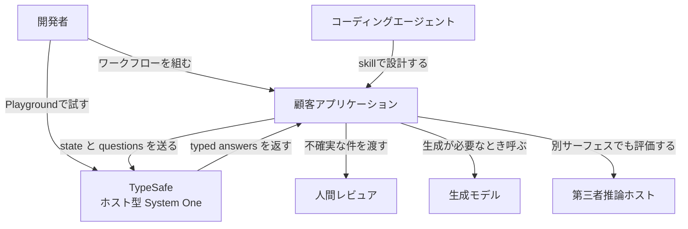
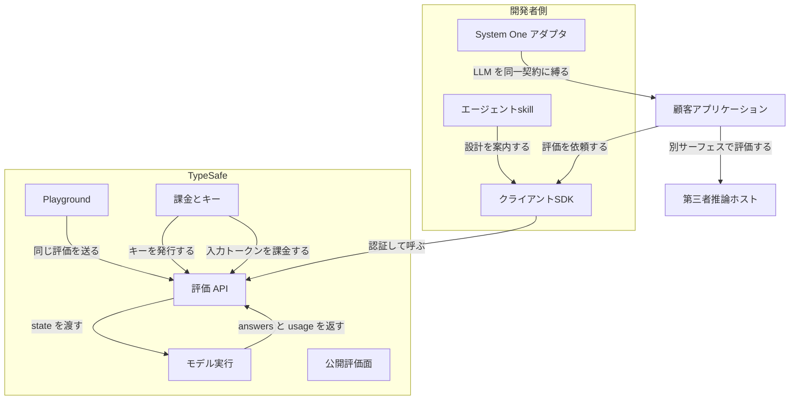
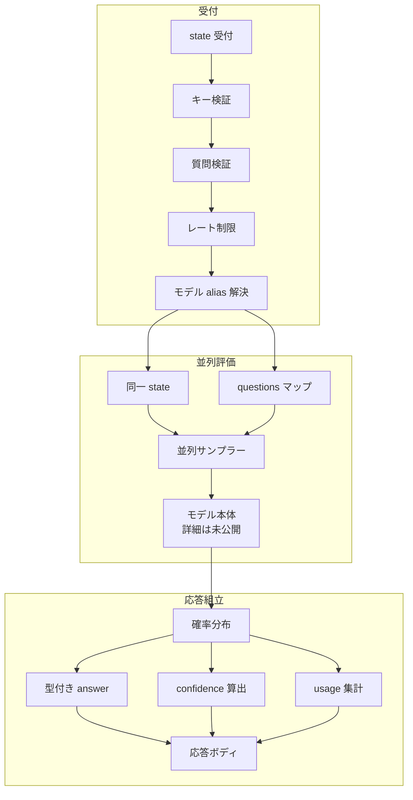
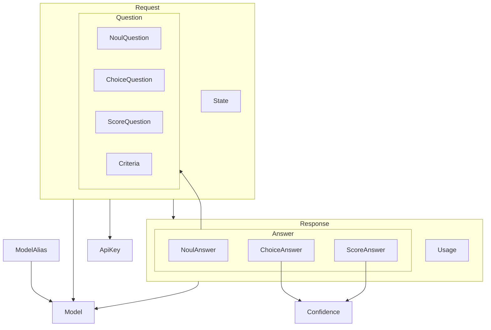
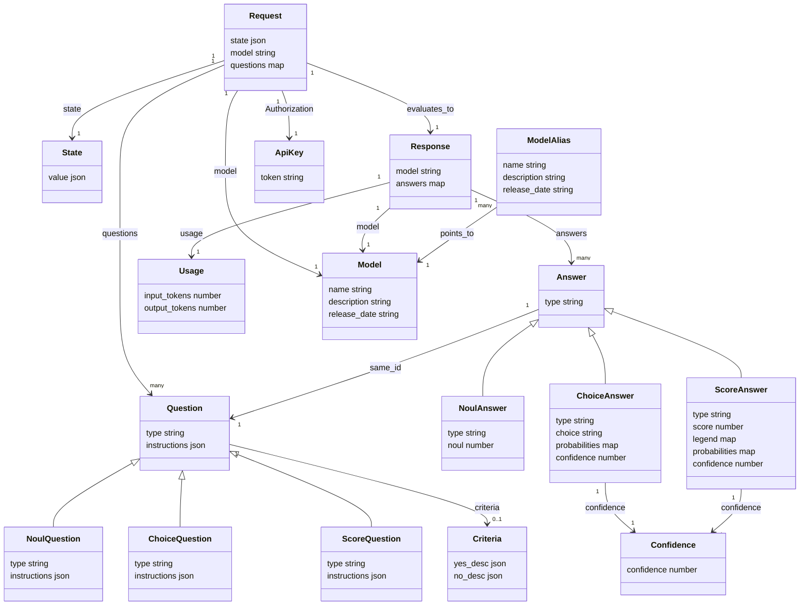

Jev は、ソフトウェアがそのまま消費できる型付きの決定を返すホスト型モデルです。TypeSafe AI が 2026-09-15 に早期アクセスとして公開しました。この記事では、公式ドキュメントと SDK の実装をもとに、Jev の構造・データモデル・導入手順・運用の勘所までを整理します。

## Jev とは

Jev は、非構造の状態を入力に取り、型付きの確率的な決定を出力するモデルです。開発元は TypeSafe AI で、創業者は Diogo Almeida です。

大規模言語モデル（LLM）は人が読む文章を生成します。Jev が返すのはコードが分岐に使う判定です。呼び出しでは `state`（プレーンテキスト、JSON オブジェクト、テキスト配列）と型付きの `questions` を送り、Choice / Score / Noul という 3 種の構造化された答えと確率が返ります。

TypeSafe はこのモデルクラスを **System One model** と呼びます。名前は Kahneman の System 1（速い直感判断）に由来し、モデル名 Jev は経済学者 William Stanley Jevons に由来します。現行版は `jev-1.13.0` で、SDK 既定の alias は `jev-latest` です。

公式の要約は「unstructured state in, typed probabilistic decisions out」です。ワークフローと副作用はあくまでコードが所有し、Jev は狭い意味判断だけを担います。


| 層 | 役割 |
|---|---|
| コード | 制御フロー、決定論ルール、副作用、重み付け |
| Jev | 非構造データに対する狭い意味判断 |
| 生成 LLM | 文章生成、説明、コード、開いた推論 |

学習目標は **RLCD（Reinforcement Learning for Calibrated Decisions）** です。RLHF が人の好み、RLVR が検証可能な報酬を目標にするのに対し、RLCD は校正済みの決定を目標にします。サンプリングは同一 `state` に対する複数質問の並列評価です。


近い技術は次の 3 群です。Jev はいずれとも出力の性質が異なります。

| 群 | 代表 | Jev との関係 |
|---|---|---|
| 生成制約 | OpenAI Structured Outputs / JSON mode、Outlines | 文章生成の形を縛る。Jev は生成を捨て、決定分布を返す |
| 生成後検証 | Instructor / Pydantic、Guardrails AI | 生成結果を検証・再試行する。Jev は検証対象の文字列を持たない |
| 専用分類器 | Hugging Face の sequence classification | 固定ラベルへ高速推論する。Jev はリクエスト時に自然言語の criteria を渡す |

選択の目安は次のとおりです。

| やりたいこと | 推奨 |
|---|---|
| チケット分類、インテント、キュー分岐 | Jev の Choice |
| yes/no の検出 | Jev の Noul |
| 深刻度・関連度などのルーブリック評価 | Jev の Score |
| 同一 state への多数の独立判断 | Jev の 1 リクエスト並列 |
| 低遅延 UI、ゲーム内判断 | Jev |
| LLM 入出力のセマンティック検査 | Jev をガードとして置く |
| 自由文、説明、コード、開いた推論 | 生成 LLM |
| 任意ネスト JSON の抽出 | Structured Outputs / Instructor / Outlines |
| 安定ラベルと十分な教師データがある | 専用分類器 |

## 特徴

- **3 つの AI primitive**。Choice は選択肢と分布と confidence、Score はルーブリック上の位置と分布と confidence、Noul は yes の確率 0〜1 を返します。Noul に `confidence` フィールドはありません。
- **同一 state への並列独立評価**。型の違う質問を混ぜて 1 コールに載せられます。
- **出力空間が呼び出し前に閉じる**。Choice は渡した option のいずれか、Score は最小〜最大レベル番号の範囲内の値（レベル間の小数を含む）を返します。範囲の外は返りません。
- **RLCD の狙いは校正**。「高い確率ほど当たりやすい」という集団統計を目標にします。
- **confidence は分布の尖り**。コードが高信頼で自動実行し、低信頼で人または推論モデルへ回す設計に使います。
- **重みと閾値はコード側**。公式パターンは Speculative fan-out、Confidence-gated routing、Composite scoring、Intent routing です。
- **ホスト型 API**。`POST https://api.typesafe.ai/v1/systemone` が評価の正本です。Python は `typesafe-sdk` の `TypeSafeClient.system_one()`、JavaScript は `@typesafe-ai/sdk` の `systemOne()` です。
- **入力はテキストのみ**。テキスト、JSON、テキスト配列を受け取ります。画像・音声・動画は未対応です。
- **得意域は常識判断**。算術・カウント・日付比較はコード側、生成は別モデルの担当です。
- **課金は入力トークンのみ**。出力トークンは無料です。
- **早期アクセス**。キーは Console で発行します。
- **第三者ホスト**。Cloudflare Workers AI に `typesafe/jev` があります。認証と課金は Cloudflare 側です。

RLHF を通したモデルでは、確率分布が 1 つの答えへ潰れる mode dropping が起きます。RLCD はこの潰れを避け、分布そのものを使える状態で残すことを目標にします。


## 構造

モデルの重みは公開されていません。呼び出しの正本は `POST /v1/systemone` で、内部層名とチェックポイントも公開されていません。ここでは公開された API 契約から見える構造を整理します。

### システムコンテキスト図



| 要素名 | 説明 |
|---|---|
| 開発者 | 顧客アプリケーションに System One を埋め込む人です。Playground で試し、キーを発行します。 |
| コーディングエージェント | TypeSafe の skill を読み、ワークフロー設計と SDK 呼び出しを支援します。モデル本体ではありません。 |
| 人間レビュア | 顧客コードが confidence や noul の閾値でエスカレーションした件を見ます。 |
| 顧客アプリケーション | 決定木、副作用、合成を所有するソフトウェアです。 |
| TypeSafe | ホスト型 System One です。旗艦モデルは Jev です。 |
| 第三者推論ホスト | 公式 API 以外で Jev を公開する推論面です。課金と認証はそちらの契約になります。 |
| 生成モデル | 文章生成や抽出候補の列挙など、Jev が担わない生成を行います。 |

### コンテナ図



開発者側の構成要素は次のとおりです。

| 要素名 | 説明 |
|---|---|
| クライアントSDK | Python は `typesafe-sdk`、JavaScript は `@typesafe-ai/sdk` です。既定ベース URL は `https://api.typesafe.ai`、既定モデルは `jev-latest` です。 |
| エージェントskill | コーディングエージェントへプリミティブとパターンを渡す手順書です。推論は実行しません。 |
| System One アダプタ | LLM を同じ questions 契約に縛る比較用クライアントです。Jev の実行体ではありません。 |

TypeSafe 側の構成要素は次のとおりです。

| 要素名 | 説明 |
|---|---|
| Playground | ログイン後に state と questions を試すコンソール面です。 |
| 課金とキー | API キーの発行と入力トークン課金です。出力トークンは無料です。 |
| 評価 API | `POST /v1/systemone` が評価の正本です。`GET /v1/models` は alias 一覧を返します。 |
| モデル実行 | 公開されている要素は並列サンプラーと RLCD で訓練した決定モデルです。層名と重みは公開されていません。 |
| 公開評価面 | ワークフロー evals の公開サイトです。本番の評価経路ではありません。 |

境界の外側は次の 2 つです。

| 要素名 | 説明 |
|---|---|
| 顧客アプリケーション | SDK または生 HTTP で評価 API を呼び、answers をコードで合成します。 |
| 第三者推論ホスト | 公式 API とは別サーフェスです。カタログ例は Cloudflare Workers AI の `typesafe/jev` です。 |

### コンポーネント図

次の図は HTTP ステータスと API 契約から逆算した説明図です。公式に公開された層名やチェックポイントではありません。



受付で効く制約は次のとおりです。

| 要素名 | 説明 |
|---|---|
| state 受付 | `state` は string、object、array のいずれかです。テキストのみです。 |
| キー検証 | `Authorization: Bearer` です。欠落や不正は 401 です。 |
| 質問検証 | `model` と `questions` は必須です。形が壊れていると 422 です。 |
| レート制限 | 超過は 429 です。過負荷は 529 です。 |
| モデル alias 解決 | 例は `jev-latest` です。現行の指し先は `jev-1.13.0` です。 |

並列評価の単位は 1 リクエスト 1 state です。

| 要素名 | 説明 |
|---|---|
| 同一 state | 1 リクエストは 1 state です。全 questions が同じ state を見ます。 |
| questions マップ | キーは呼び出し側が付けます。型は Noul / Choice / Score を混在できます。 |
| 並列サンプラー | 全質問を 1 クエリで並列に出します。逐次トークン生成ではありません。 |
| モデル本体 | 新しいモデルアーキテクチャと説明されています。層名、チェックポイント、重みは公開されていません。 |

1 リクエストに 3 型を混ぜたときの戻り値は次のように分かれます。

| 質問 ID | 型 | 役割 | 戻り値の核 |
|---|---|---|---|
| `is_urgent` | Noul | 緊急性の有無 | `noul` は 0〜1。confidence なし |
| `department` | Choice | 担当チーム | `choice`、全選択肢の `probabilities`、`confidence` |
| `frustration` | Score | 苛立ちの程度 | 加重 `score`、`legend`、水準の `probabilities`、`confidence` |

構造上の上限値も押さえておきます。Choice の cardinality 上限は 255 です。文脈予算は `state` と全 `questions` の合計で 64k tokens、`state` と最長 question の組で 32k tokens です。この 2 段制限の正本は jaggedness ページです。

応答組立では、分布から型付きの値と confidence と usage が組み立てられます。

| 要素名 | 説明 |
|---|---|
| 確率分布 | Choice は options 上、Score は levels 上です。合計は 1 です。 |
| 型付き answer | Noul は yes の確率、Choice は最頻 option、Score は水準の確率加重です。 |
| confidence 算出 | Choice と Score だけです。分布の尖りを 0〜1 に畳みます。計算式は公開されていません。 |
| usage 集計 | `input_tokens` と `output_tokens` です。課金対象は入力です。 |
| 応答ボディ | `model`、`answers`、`usage` です。 |

公式が示す 4 パターンは、リクエスト内の役割とコード側の役割で分かれます。

| パターン | リクエスト内 | コード側 |
|---|---|---|
| Speculative fan-out | 使わないかもしれない質問も含め並列評価する | 分類結果を見て不要な答えを捨てる |
| Confidence-gated routing | Choice / Score に confidence を付ける | 閾値で自動実行、確認、人へ分岐する |
| Composite scoring | 次元ごとの Score を並列に返す | 正規化と重み付けで 1 つの順位を作る |
| Intent routing | intent と complexity を同時に返す | 決定ロジック、専門生成モデル、人へ振り分ける |

## データ

属性名は HTTP JSON を正とします。SDK のアクセサ名は説明テーブルに併記します。

### 概念モデル



| 要素名 | 説明 |
|---|---|
| Request | `POST /v1/systemone` のリクエストボディです。1 つの State と 1 つ以上の Question を持ちます。 |
| State | 評価対象の内容です。テキストのみです。 |
| Question | 同一 State に対する独立した判断です。マップキーが質問 ID です。ID はモデルに送られません。 |
| NoulQuestion | はい/いいえの確率を求める Question です。 |
| ChoiceQuestion | 固定オプションから 1 つを選ぶ Question です。 |
| ScoreQuestion | 順序付きレベル上の位置を求める Question です。 |
| Criteria | Question が許す答えの形です。Choice は map、Score は ordered list、Noul は optional の true/false です。 |
| Response | 評価結果の JSON ボディです。 |
| Answer | Question と同型の typed 値です。Choice は渡した選択肢の外を返さず、Score はレベル番号の範囲内に収まります。 |
| NoulAnswer | yes の確率だけを返す Answer です。Confidence を持ちません。 |
| ChoiceAnswer | 最頻オプションと全オプションの分布を返す Answer です。 |
| ScoreAnswer | レベル番号の確率加重位置と分布を返す Answer です。 |
| Confidence | Choice / Score の分布の尖りを 0〜1 に畳んだ統計です。 |
| Usage | 当該 Request のトークン消費です。 |
| Model | `model` に送れる版付き ID です。 |
| ModelAlias | 版付き ID へ解決される名前です。 |
| ApiKey | `Authorization: Bearer` で送る秘密値です。 |

### 情報モデル



フィールドごとの必須・値域は次のとおりです。

| 要素名 | 説明 |
|---|---|
| Request.state | HTTP では required。string / object / array。ラッパーキーはありません。 |
| Request.model | HTTP では required。alias または版付き ID。SDK は省略時 `jev-latest`。 |
| Request.questions | キーは質問 ID。値は Question。 |
| Question.type | `"noul"` / `"choice"` / `"score"`。 |
| Question.instructions | HTTP では required。string / object / array。 |
| Noul criteria | optional。HTTP キーは `true` / `false`。図の `Criteria.yes_desc` / `no_desc` は Noul 形だけを表します。 |
| Choice criteria | required の map。option は最大 255。値は説明文字列または null で、公式ガイドは構造化オブジェクトの例も示します。HTTP 値そのものが map です。 |
| Score criteria | required の list。最低 2、最大 10。番号は 0 始まりです。 |
| NoulAnswer.noul | yes の確率。0〜1。0.5 は yes/no 同確率。 |
| ChoiceAnswer.choice | 最高確率の option。 |
| ChoiceAnswer.probabilities | option から number。合計 1。 |
| ScoreAnswer.score | レベル番号 × 確率の和。レベル間に落ち得ます。 |
| ScoreAnswer.legend | レベル番号（文字列キー）から説明。 |
| Confidence | Choice / Score のフィールド。0〜1。計算式は公開されていません。Noul にはありません。 |
| Usage | `input_tokens` / `output_tokens`。課金は入力のみ。 |
| Model.name | 例は `jev-1.13.0`。list に出なくても `model` に送れます。 |
| ModelAlias.name | 現行は `jev-latest` / `jev-preview`。どちらも `jev-1.13.0` を指します。 |
| ApiKey.token | ボディには含みません。環境変数名は `TYPESAFE_API_KEY` です。 |

HTTP JSON と 2 つの SDK で表現が違う箇所は、言語をまたぐときの事故が起きやすい点です。

| API JSON | Python SDK | JS SDK |
|---|---|---|
| `answers` | `answers` に加え `nouls` / `choices` / `scores` | `answers` のみ |
| Score の legend / probabilities キー | int | 文字列 |
| Request.model は required | 省略時 `jev-latest` | 省略時 `defaultModel` |
| ヘッダ `x-typesafe-request-id` | `SystemOneResponse.request_id` | 成功は `WithResponse.requestId`、エラーは `APIError.requestId` |
| `GET /v1/models` の `{models: ...}` | `ListModelsResponse.models` | `list()` が配列へ unwrap |

## 導入

### 早期アクセスと API キー

- Jev は 2026-09-15 に早期アクセスとして公開されました。
- 申請 UI は https://www.jevai.org/apply です。
- 招待後のキー発行先は Quick start が案内する https://console.typesafe.ai/settings/keys です。
- HTTP は `Authorization: Bearer <API_KEY>` です。
- SDK は環境変数 `TYPESAFE_API_KEY` を読みます。

| 入口 | URL | 用途 |
|---|---|---|
| Playground | https://console.typesafe.ai/playground | ブラウザで state + questions を試す |
| Console | https://console.typesafe.ai/ | ログイン、キー発行 |
| API | https://api.typesafe.ai | `POST /v1/systemone`、`GET /v1/models` |

### 前提

- Python SDK は Python 3.10 以上です。
- JavaScript SDK は Node.js 20 以上です。
- 執筆時点の公式パッケージはどちらも `0.6.0` です（Python は 2026-09-15 公開）。
- モデル重みのセルフホスト手順は公式 docs にありません。

### Playground で試す

ログイン後、state にテキストを貼り、Noul / Choice / Score を追加します。

```plaintext
Hi, I've been trying to connect my Stripe account for 3 days and it keeps failing. I'm losing sales. Please help ASAP.
```

```json
{
  "urgency": {
    "type": "noul",
    "instructions": "Does this message express urgency?"
  }
}
```

### Python SDK の導入

```bash
pip install typesafe-sdk
```

```bash
uv add typesafe-sdk
```

- import 名は `typesafe_sdk` です。
- クラスは `TypeSafeClient` / `AsyncTypeSafeClient` です。
- 質問クラスは `Noul` / `Choice` / `Score` です。

| 変数 | 役割 | デフォルト |
|---|---|---|
| `TYPESAFE_API_KEY` | API キー。必須 | なし |
| `TYPESAFE_BASE_URL` | API root | `https://api.typesafe.ai` |
| `TYPESAFE_DEFAULT_MODEL` | デフォルトモデル | `jev-latest` |
| `TYPESAFE_LOG_LEVEL` | ロガー | unset |

### JavaScript SDK の導入

```bash
npm install @typesafe-ai/sdk
```

- ヘルパーは `choice` / `noul` / `score` です。
- メソッドは `client.systemOne()` です。
- ブラウザ実行は既定で拒否されます。キーをページに出さないためです。オプション名は `dangerouslyAllowBrowser` です。

| 項目 | JS | Python との差 |
|---|---|---|
| 環境変数 | 名前は同じ 4 つ | Python の `warning` に対し JS の LogLevel は `warn` |
| モデル省略 | `defaultModel` → `jev-latest` | コンストラクタ `model` |
| Retry フィールド | `maxRetries` / `backoffInitialMs` / `backoffMaxMs` | `max_retries` / `backoff_initial`（秒） |
| timeout | コンストラクタ既定 10000 ms（試行あたり） | HTTP 既定 10 s。`RetryPolicy.timeout` 既定 30 s（総予算） |
| 成功時の request id | `WithResponse.requestId` | `SystemOneResponse.request_id` |
| エラーの request id | `APIError.requestId` | `TypeSafeAPIError.request_id` |

### Agent skill の導入

インストール方法はどちらか 1 つだけ使います。

```bash
claude plugin marketplace add typesafe-ai/skills
claude plugin install typesafe@typesafe-ai
```

```bash
npx skills add typesafe-ai/skills --skill typesafe-ai
```

Claude Code plugin の呼び出しは `/typesafe:typesafe-ai` です。更新は `claude plugin marketplace update typesafe-ai` のあとに `claude plugin update typesafe@typesafe-ai` を実行します。

## 利用方法

### 必須パラメータ

| パラメータ | 必須 | 正規値 |
|---|---|---|
| `Authorization` | はい | `Bearer <API_KEY>` |
| `Content-Type` | HTTP JSON では必要 | `application/json` |
| `state` | はい | string / object / array |
| `model` | HTTP はい / SDK 省略可 | `"jev-latest"` または `"jev-1.13.0"` |
| `questions` | はい | map of Question |
| Question `type` | はい | `"noul"` / `"choice"` / `"score"` |
| Question `instructions` | HTTP では必須 | string / object / array |
| Choice `criteria` | はい | map of option to string or null（API リファレンスの記載。公式ガイドは構造化オブジェクトの例も示す） |
| Score `criteria` | はい | 順序付き array。最低 2 |
| Noul `criteria` | いいえ | `{true, false}` |

仕様の一次情報は [HTTP API](https://docs.typesafe.ai/api.md) と [Models](https://docs.typesafe.ai/models.md) です。

### HTTP で 1 回評価する

まず Noul 1 問だけを送る最小形です。

```bash
curl -X POST https://api.typesafe.ai/v1/systemone \
  -H "Authorization: Bearer $TYPESAFE_API_KEY" \
  -H "Content-Type: application/json" \
  -d '{
    "state": "Hi, I have been trying to connect my Stripe account for 3 days and it keeps failing. Please help ASAP.",
    "model": "jev-latest",
    "questions": {
      "urgency": {
        "type": "noul",
        "instructions": "Does this message express urgency?"
      }
    }
  }'
```

3 型を混ぜたリクエストボディは次の形です。

```json
{
  "state": "Hi, I've been trying to connect my Stripe account for 3 days and it keeps failing. I'm losing sales. Please help ASAP.",
  "model": "jev-latest",
  "questions": {
    "department": {
      "type": "choice",
      "instructions": "Which team should handle this",
      "criteria": {
        "billing": "Payment or subscription issues",
        "technical": "Bugs or integration problems",
        "sales": "Pricing or account questions"
      }
    },
    "frustration": {
      "type": "score",
      "instructions": "How frustrated the customer appears",
      "criteria": [
        "Calm, just stating facts",
        "Frustrated but civil",
        "Very angry, strong language"
      ]
    },
    "is_urgent": {
      "type": "noul",
      "instructions": "The message conveys urgency or time-sensitivity"
    }
  }
}
```

Quick start が載せている応答例は次のとおりです。Score の `probabilities` は省略されています。

```json
{
  "model": "jev-latest",
  "answers": {
    "department": {
      "type": "choice",
      "choice": "billing",
      "probabilities": {
        "billing": 0.84,
        "technical": 0.159,
        "sales": 0.001
      },
      "confidence": 0.596
    },
    "frustration": {
      "type": "score",
      "score": 1.035,
      "legend": {
        "0": "Calm, just stating facts",
        "1": "Frustrated but civil",
        "2": "Very angry, strong language"
      },
      "confidence": 0.842
    },
    "is_urgent": {
      "type": "noul",
      "noul": 0.999
    }
  },
  "usage": {
    "input_tokens": 312,
    "output_tokens": 48
  }
}
```

API リファレンスでは Score answer の `probabilities` は required です。実装では次の形を前提に読むのが安全です。

```json
{
  "model": "jev-latest",
  "answers": {
    "frustration": {
      "type": "score",
      "score": 1.6,
      "legend": {
        "0": "Calm",
        "1": "Frustrated",
        "2": "Very angry"
      },
      "probabilities": {
        "0": 0.05,
        "1": 0.3,
        "2": 0.65
      },
      "confidence": 0.78
    }
  },
  "usage": {
    "input_tokens": 312,
    "output_tokens": 48
  }
}
```

ホスト型 HTTP に update / delete はありません。質問を変えたいときは次の `POST /v1/systemone` で送り直します。

### Python で 3 種の質問を混ぜる

```python
from typesafe_sdk import Choice, Noul, Score, TypeSafeClient

client = TypeSafeClient()
ticket = (
    "Hi, I've been trying to connect my Stripe account for 3 days "
    "and it keeps failing. I'm losing sales. Please help ASAP."
)
response = client.system_one(
    state=ticket,
    questions={
        "department": Choice(
            instructions="Which team should handle this",
            criteria={
                "billing": "Payment or subscription issues",
                "technical": "Bugs or integration problems",
                "sales": "Pricing or account questions",
            },
        ),
        "frustration": Score(
            instructions="How frustrated the customer appears",
            criteria=[
                "Calm, just stating facts",
                "Frustrated but civil",
                "Very angry, strong language",
            ],
        ),
        "is_urgent": Noul(
            instructions="The message conveys urgency or time-sensitivity",
        ),
    },
)
print(response.answers["department"].choice)
print(response.answers["frustration"].score)
print(response.answers["is_urgent"].noul)
```

型別アクセサ（`nouls` / `choices` / `scores`）も公式に用意されています。`state` に JSON オブジェクトを渡す形と合わせた例です。

```python
from typesafe_sdk import Choice, Noul, Score, TypeSafeClient

with TypeSafeClient() as client:
    response = client.system_one(
        state={"document": "I was charged twice. Please fix this ASAP."},
        questions={
            "billing": Noul(instructions="Is this ticket about billing?"),
            "tone": Choice(
                instructions="What is the customer's tone?",
                criteria={"calm": None, "frustrated": None, "angry": None},
            ),
            "urgency": Score(
                instructions="How urgent is this ticket?",
                criteria=["can wait", "this week", "today"],
            ),
        },
    )
print(response.nouls["billing"].noul)
print(response.choices["tone"].choice)
print(response.scores["urgency"].score)
```

非同期は `AsyncTypeSafeClient` と `async with` を使います。メソッド名は `system_one` のままです。

### JavaScript で評価する

```typescript
import { choice, noul, score, TypeSafeClient } from "@typesafe-ai/sdk";

const client = new TypeSafeClient();
const { answers } = await client.systemOne({
  state: "I was charged twice. Please help.",
  questions: {
    billing: noul("Is this about billing?"),
    tone: choice("What is the tone?", { calm: null, angry: null }),
    urgency: score("How urgent is this?", ["low", "medium", "high"]),
  },
});
console.log(answers.billing.noul);
console.log(answers.tone.choice);
console.log(answers.urgency.score);
```

### モデル一覧を取る

```bash
curl https://api.typesafe.ai/v1/models \
  -H "Authorization: Bearer $TYPESAFE_API_KEY"
```

```python
from typesafe_sdk import TypeSafeClient

with TypeSafeClient() as client:
    for model in client.models.list().models:
        print(model.name, model.release_date, model.description)
```

```typescript
import { TypeSafeClient } from "@typesafe-ai/sdk";

const client = new TypeSafeClient();
const models = await client.models.list();
for (const model of models) {
  console.log(model.name, model.release_date, model.description);
}
```

`GET /v1/models` は現状 alias を返します。versioned ID は list に出なくても `model` に送れます。

### エラーとリトライ

| Status | 意味 |
|---|---|
| 401 | キー欠落または不正 |
| 422 | ボディ検証失敗 |
| 429 | rate limit |
| 529 | 一時過負荷 |

```python
from typesafe_sdk import RetryPolicy, TypeSafeClient

client = TypeSafeClient(
    retry=RetryPolicy(max_retries=3, backoff_max=0.2, timeout=1.0)
)
```

- Python 既定の `max_retries` は 2 です。
- 既定の `http_statuses` は 408、429、500–599 です。529 も再試行対象に入ります。
- `TypeSafeRateLimitError` は 429 専用で、`retry_after_ms` を持ちます。

### Cloudflare Workers AI の別サーフェス

モデル ID は `typesafe/jev` です。認証は Cloudflare アカウントで、`TYPESAFE_API_KEY` は使いません。

```typescript
const response = await env.AI.run("typesafe/jev", {
  state: "Help! My payouts have been failing for 3 days.",
  questions: {
    is_urgent: {
      type: "noul",
      instructions: "Does this convey urgency?",
      criteria: { true: "Explicitly time-sensitive", false: "No urgency expressed" },
    },
  },
});
```

## 運用

### レート制限とコスト

- 現行 `jev-1.13.0` の公表値は 250,000 tokens/sec と 1,200 rpm です。
- 超過は 429 です。
- 制限は動的です。安定した枠が必要なら custom / enterprise で、窓口は `sales@typesafe.ai` です。
- 課金は入力 $42 / BTok（= $0.042 / MTok）です。出力は無料です。

```python
from typesafe_sdk import RetryPolicy, TypeSafeClient

client = TypeSafeClient(
    retry=RetryPolicy(
        max_retries=3,
        timeout=10.0,
        http_statuses={429, 500, 502, 503, 504, 529},
    )
)
```

`http_statuses` は再試行するステータスの集合です。明示指定すると既定値（408、429、500–599）を置き換えるため、529 を落とさないよう注意します。既定のままでよければ指定を省略します。

### alias と pin

| 名前 | 種別 | 現在の指し先 | 用途 |
|---|---|---|---|
| `jev-1.13.0` | versioned ID | 自身 | 閾値を固定した本番 |
| `jev-latest` | alias | `jev-1.13.0` | SDK 既定 |
| `jev-preview` | alias | `jev-1.13.0` | preview が無いときは latest と同じ |

閾値を特定版に合わせたら versioned ID を pin します。Models ページは、レスポンスの `model` が versioned ID を返すと述べています。運用ログにはこの値を残します。

### usage の記録

| 項目 | ソース | 用途 |
|---|---|---|
| request_id | `x-typesafe-request-id` | サポート照会 |
| model | `response.model` | alias 解決後の実体 |
| input_tokens | `usage.input_tokens` | 課金 |
| output_tokens | `usage.output_tokens` | 予算監視 |
| noul または confidence | 答え | 自動実行か人へ回すかの判断 |

```python
from typesafe_sdk import TypeSafeAPIError

try:
    response = client.system_one(state, questions, model="jev-1.13.0")
except TypeSafeAPIError as error:
    print(error.status, error.request_id)
else:
    cost_usd = (response.usage.input_tokens or 0) / 1e6 * 0.042
    print(response.model, response.usage.input_tokens, cost_usd, response.request_id)
```

ログレベル `debug` はヘッダとボディを出します。リクエスト / レスポンスボディはマスクされないため、本番のログ出力レベルには注意が必要です。料金計算のキーは `input_tokens` です。

### 429 と 529 の扱い

| Status | 意味 | 初手 |
|---|---|---|
| 401 | キー不正 | リトライしない |
| 422 | バリデーション失敗 | リトライしない |
| 429 | レート超過 | exponential backoff |
| 529 | 過負荷 | 429 と同じ backoff |

```python
from typesafe_sdk import TypeSafeInternalServerError, TypeSafeRateLimitError

try:
    client.system_one(state, questions)
except TypeSafeRateLimitError as error:
    wait_ms = error.retry_after_ms
except TypeSafeInternalServerError as error:
    print(error.status, error.request_id)
```

### トークン予算

- 全体は全 `state` + 全 `questions` で 64k tokens です。
- 最長質問は `state` + 最長 1 問で 32k tokens です。
- 効率化の方向は、1 リクエストに多数の質問を詰めることです。
- Parallel questions cookbook の実測（13 問、`TYPESAFE_MODEL = "jev-1.12"`）は、1 呼び出しが $0.000497 / 0.27s、13 分割が $0.006090 / 2.71s です。倍率は 12.2x cheaper、10.0x faster です。
- ただし 2.71s は 13 リクエストの所要時間を積み上げた値です。分割側を並行実行すれば時間差は縮みます。コスト差は並行実行しても残ります。

### キー差し替え

- 発行場所は Console の settings/keys です。
- 差し替え単位は環境変数またはコンストラクタ `api_key` です。
- 401 はリトライ対象外です。
- キーローテーション専用の CLI は公開 docs にありません。

### モデル更新時の閾値再較正

- Noul の再較正対象は `noul` 値そのものです。
- Choice / Score は `confidence`、必要なら `probabilities` です。
- 新しい versioned ID を明示指定して labeled セットを再実行します。
- Score の期待値からレベル間の正確な数値を復元しようとしないほうが安全です。

## ベストプラクティス

### 制御はコード、判断はモデル

- 制御フロー・決定的ルール・副作用はコードに置きます。
- モデルは狭い typed question だけを担います。
- 独立な質問は 1 リクエストにまとめ、答えはコードで合成します。

### Speculative fan-out

後続で使うかもしれない質問まで先に全部送り、分類結果で不要になった答えはコードが無視します。依存が本物のときだけ 2 リクエストに分けます。

```python
if category.choice == "bug_report":
    if bug_severity.score > 1.5 and bug_repro.noul > 0.6:
        escalate_to_engineering(ticket_id, severity="high")
elif category.choice == "billing":
    if refund.noul > 0.7:
        route_to_billing_with_flag(ticket_id, refund_likely=True)
```

### Confidence-gated routing

答えは「何をするか」、confidence は「実行してよいか」です。3 帯に割り、高は自動、中は確認、低は人または別系統へ回します。Noul はこの軸を持たないため、`noul` 値そのものを帯に割ります。

公式 Confidence ページの出発点は、0.5 未満を人へ、破壊的操作は 0.9 超です。値はドメインで再較正します。

```python
if confidence < 0.5:
    route_to_human(user_message)
elif action.choice == "approve_transfer":
    if confidence > 0.9:
        confirm_then_execute(account_id)
    else:
        ask_user_to_confirm(account_id)
```

### Composite scoring

複合判断を原子 Score に割り、正規化と重み付けはコードで行います。除数は `len(criteria) - 1` に合わせます。

```python
top_level = len(criteria) - 1
normalized = answer.score / top_level
priority = 0.6 * severity + 0.3 * frustration + 0.1 * report_quality
```

### Intent routing

安価な分類を手前に置き、DB / 専門 LLM / 人へ振り分けます。intent の confidence が低いときは、その分類自体を使いません。

### jaggedness の回避

Jev は得意域が明確に分かれます。公式の jaggedness ページが挙げる失敗モードと回避策は次のとおりです。

| # | 失敗モード | 代わりにすること |
|---|---|---|
| 1 | Literal reading | 条件を `instructions` にそのまま書く |
| 2 | Math and Numbers | 算術・カウントはコードで行う |
| 3 | Date and time comparison | 月は 12 Choice、日は 1–31 Choice、欠落は `none`。順序・期間はコード |
| 4 | Indirection | ホップを減らす。該当箇所を名前で指す |
| 5 | Large irrelevant state | 先にフィルタする |
| 6 | Adversarial content | criteria を明示し、投入前にエッジを試す |
| 7 | Contradictory criteria | instructions と criteria を揃える |
| 8 | Generation | 生成モデルへ渡す |

### state を薄くする

- 質問が必要とするフィールドだけ送ります。
- パス表記はバッククォート付きのドット・インデックスです。例は `` `ticket.messages[0].text` `` です。
- 無関係な長文は精度を落とします。

### 質問を独立に分解する

- 1 問は、知識ある人が 1 秒でできる判断まで落とします。
- 質問 ID はモデルに送られません。判断材料は全部 `instructions` に書きます。
- Noul の 0.5 は yes/no 同確率です。「中程度」ではありません。
- Choice のリストが網羅しないときは `other` または `none of the above` を足します。
- 隣接する option は `what` / `not_for` / `examples` の構造化 criteria で切り分けます。フィールド名は予約されていません。API リファレンスの型表記は文字列 / null ですが、公式ガイドはこの構造化オブジェクトを例示しています。

```json
{
  "return_topic": {
    "type": "choice",
    "instructions": {
      "question": "Which returns topic is the customer asking about?",
      "focus": "Classify the information the customer wants."
    },
    "criteria": {
      "return_policy": {
        "what": "Whether and how an item can be returned",
        "not_for": "Progress of a return already sent",
        "examples": [
          "Can I return shoes I've worn once?",
          "How long do I have to return an order?"
        ]
      },
      "return_status": {
        "what": "Progress of a return already sent",
        "not_for": "Whether and how an item can be returned",
        "examples": [
          "Has my return arrived yet?",
          "When will my refund be paid?"
        ]
      }
    }
  }
}
```

カウントは「候補ごとに Noul を立て、集計はコード」が定石です。

```python
from typesafe_sdk import Noul, TypeSafeClient

client = TypeSafeClient(model="jev-1.13")
YES = 0.5  # 閾値はユースケース次第で決める

items = ["typesafe", "apple", "california", "banana", "likes", "calibration", "orange", "vertex"]
result = client.system_one(
    {"items": items},
    {
        f"item_{i}": Noul(instructions=f"Is `items[{i}]` the name of a fruit?")
        for i in range(len(items))
    },
)
count = sum(result.nouls[f"item_{i}"].noul > YES for i in range(len(items)))
```

## 注意点

早期アクセス段階のため、マーケティング面・ドキュメント・SDK 実装の間に食い違いがあります。実装前に押さえておくべき点を挙げます。

ドキュメントと実装の乖離は次のとおりです。

| 対象 | 資料の記載 | 実態 | 読者への影響 |
|---|---|---|---|
| マーケ面の SDK 例 | `import typesafe` / `Client.decide(model="jev-1")`。questions を list / bool / tuple で略記 | 公式は `typesafe_sdk`、`TypeSafeClient.system_one()`、モデルは `jev-latest` または `jev-1.13.0`。questions は `{type, instructions, criteria}` | マーケ例をコピーするとインストールとメソッドが通らない |
| キー例 | マーケ面は `jev_...` | 公式 docs はキー prefix を記載しない | prefix を仕様として固定できない |
| Python usage の model 例 | `TypeSafeClient(model="jev")` | Models 一覧に `jev` は無い | `jev-latest` か `jev-1.13.0` を使う |
| cookbook の環境変数 | 一部が `TYPESAFE_ENDPOINT` | 公式 constants は `TYPESAFE_BASE_URL` | 名前を取り違えると接続先が変わらない |
| cookbook の pin | 多くが `jev-1.12` | 現行旗艦は `jev-1.13.0` | cookbook の数値は 1.12 の実行結果として読む |
| キー発行 URL | Agent skill は `/keys` | Quick start は `/settings/keys` | どちらもコンソール配下。手順は Quick start を正とする |
| HTTP と SDK の required | HTTP は `model` と `instructions` を required | SDK は `model` 省略可、instructions も型上 optional | HTTP 直呼びは docs の required に従う |
| Python の Score キー | HTTP の legend / probabilities は文字列キー | Python SDK は int キー | 言語をまたぐとキー型が違う |
| 529 の例外型 | API は Overloaded として 429 と並べる | SDK の `TypeSafeRateLimitError` は 429 専用。リトライを尽くした 5xx は `TypeSafeInternalServerError` | リトライはされる。尽きたあとの型は InternalServerError 側 |

資料間で数値や表現が割れている箇所もあります。

| 対象 | 資料の記載 | 実態 | 読者への影響 |
|---|---|---|---|
| 速度・コスト倍率 | typesafe.ai ホームは「193.6x Faster, 444.6x Cheaper」。jevai.org は 193.6× と $0.042 を別 stat にし、444.6x は出さない | 発表ブログは workflow evals の高い側、西海岸ラップトップ計測と注記する | 本番の倍率はこの上限側として読む |
| 型エラー 0% | マーケとブログの「can't hallucinate」 | スキーマ一致の数学的保証であり、中身の正しさの実証値ではない | ラベル誤りは残る |
| confidence の範囲 | ホームは「Every Jev decision comes with a confidence estimate」 | Confidence ページは Choice / Score のみ。Noul は `noul` 値そのもの | Noul に `.confidence` を期待しない |
| context 予算 | primitives.md は約 32,000 tokens。Cloudflare は 32,000 | jaggedness は全体 64k、state+最長問 32k | jev-1.13 の正本は jaggedness |
| 並列 13 問の倍率 | primitives.md は 11.5× 安、9.6× 速 | cookbook 本文は 12.2× / 10.0×（$0.000497 vs $0.006090、0.27s vs 2.71s） | 数値は cookbook 本文を使う |
| 応答の `model` | API / Quick start 例は `"jev-latest"` | Models ページは versioned ID を返すと書く | 運用ログは versioned ID を期待して組む |
| Score の probabilities | Quick start 例は省略する | API リファレンスは required とする | 実装は required 側で扱う |
| Choice criteria の値型 | API リファレンスは文字列 / null と記載する | 公式ガイドは `what` / `not_for` / `examples` の構造化オブジェクトを例示する | 構造化 criteria を使うなら、投入前に実 API で受理を確認する |
| `https://jev.ai/` | 同製品の入口に見える | 取得時は atom.com のドメイン販売へリダイレクトする | 製品入口は jevai.org と typesafe.ai |
| 二次情報のスキーマ | 一部の解説記事が `options` や `min`/`max`、`prompt_tokens` を書く | 公式 API にそれらのフィールド名は無い。usage は `input_tokens` / `output_tokens` | 公式 API リファレンスを正とする |
| Vercel AI Gateway の質問 type | Vercel の評価インターフェースは `type: "boolean"` を使う | TypeSafe 直 API の型は `"noul"` | どちらも誤記ではなく別契約。Gateway 経由と直 API でコードを流用しない |

執筆時点で公開されていない情報もあります。断定を避けるべき箇所です。

| 対象 | 資料の記載 | 実態 | 読者への影響 |
|---|---|---|---|
| Confidence の計算式 | 「別 cookbook に書く」 | 計算式は未公開 | 独自定義が必要なら `probabilities` から作る |
| API Key の prefix / 回転 API | Console URL のみ | prefix、スコープ、ハッシュ保管、無効化 API は未記載 | ローテは環境変数差し替え以上を仕様化できない |
| エラー JSON スキーマ | 401 / 422 / 429 / 529 の意味だけ | ボディのフィールド名は未記載。JS SDK は `error` / `message` / `detail` を探索する | SDK 実装を API スキーマと同一視しない |
| モデル内部 | 「新しいモデルアーキテクチャ」と並列サンプラー | 層名・チェックポイントは非開示 | 既存研究モデルの内部構造を流用して説明しない |
| Doom デモ | ホームはリアルタイム 10 queries/s と書く | ブログの注記では入力は画像ではなく構造化テキスト状態 | ビジョンモデルとしては扱わない |
| jaggedness の model 文字列 | 例は `jev-1.13` | Models の versioned ID は `jev-1.13.0` | 例の短縮名と pin 用 ID を混同しない |

## トラブルシューティング

### 認証と到達

401 はリトライ対象外です。ベース URL の取り違えは接続エラーとして現れます。

| 症状 | 原因 | 対処 |
|---|---|---|
| `401` / Python `TypeSafeAuthenticationError` / JS `AuthenticationError` | キー欠落・不正・旧キー | `TYPESAFE_API_KEY` を確認する。リトライしない |
| `403` / `TypeSafePermissionDeniedError` | アカウント権限 | キーではなく権限の問題。公開 docs に詳細手順はない |
| `404` / `TypeSafeNotFoundError` | パス誤り | 評価は `POST /v1/systemone` |
| 接続エラー / `TypeSafeAPIConnectionError` | 到達前の失敗 | `TYPESAFE_BASE_URL` が `https://api.typesafe.ai` か確認する |

### リクエスト形とレート

422 はボディを直してから再送します。429 と 529 は backoff します。

| 症状 | 原因 | 対処 |
|---|---|---|
| `422` / `TypeSafeUnprocessableEntityError` | 必須欠落・質問形が不正 | Choice / Score は `criteria` 必須。Score は 2 レベル以上。リトライしない |
| `429` / `TypeSafeRateLimitError` | tokens/sec または rpm 超過 | SDK 既定リトライに任せる。常態ならバッチ化と枠の引き上げ |
| `529 Overloaded` | サーバ過負荷 | 429 と同じ backoff。尽きたあとは `TypeSafeInternalServerError` になり得る |
| タイムアウト | クライアント timeout | 巨大 state を薄くする。Python は HTTP 既定 10 s、`RetryPolicy.timeout` 既定 30 s（総予算）。JS は試行あたり 10000 ms で総予算は無い |

### 答えの読み方

Noul の分岐軸は `noul` です。本番の閾値経路は versioned ID を pin します。

| 症状 | 原因 | 対処 |
|---|---|---|
| Noul で `AttributeError: confidence` | Noul は confidence を持たない | `answer.noul` を閾値する |
| alias 固定なのに閾値がずれた | `jev-latest` が新版へ動いた | `response.model` を確認し、`jev-1.13.0` を pin する |
| `GET /v1/models` に `jev-1.13.0` が無い | list は現状 alias のみ | versioned ID は list 外でも送れる |
| usage に `prompt_tokens` が無い | キー名の取り違え | `input_tokens` / `output_tokens` を読む |
| `client.decide(model="jev-1")` が動かない | マーケ面の簡略 API | `typesafe_sdk` の `system_one` を使う |

### 精度

同一 state の独立質問は 1 リクエストに載せます。算術・日付比較・生成はモデルに任せません。

| 症状 | 原因 | 対処 |
|---|---|---|
| 同じ文書への N 問が遅い・高い | 1 問 1 リクエストになっている | 1 リクエストに同居させる |
| カウント・算術が外れる | モデルは計算しない | コードで数える。候補ごとに Noul を立てる |
| 日付の前後が外れる | 日付を文字列として読んでいる | 部品は Choice、算術はコード |
| Score から正確な数値が復元できない | レベル間の数値較正が弱い | 閾値判定だけに使う |
| 生成文が欲しい | 非生成モデル | 生成モデルへ渡す |
| 書いたつもりと違う答えになる | literal reading | 足りない説明を `instructions` / criteria に移す |
| 後続質問が前の答えを知っていると思った | 同一リクエスト内の質問は独立 | 合成はコード。本当の依存だけ 2 本目に分ける |

## まとめ

Jev は「非構造の state を入れると、型付きの確率的な決定が返る」ホスト型モデルです。設計の要点は次の 3 つに集約されます。

- **出力空間が呼び出し前に閉じる**。Choice は渡した option のいずれか、Score はレベル番号の範囲内に収まるため、パースとリトライの層が不要になります。
- **confidence は実行可否の軸**。答えそのものとは別に、自動実行・確認・人送りの帯を設計できます。
- **重み・閾値・合成はコードの責務**。モデルは 1 秒で判断できる原子質問だけを担い、算術・日付比較・生成はコードや生成モデルへ渡します。

一方で早期アクセス段階のため、マーケティング面の簡略 API と公式 SDK、primitives ページと jaggedness ページの context 予算などで表記が割れています。実装は公式 API リファレンスと SDK ソースを正とし、本番では `jev-1.13.0` のように versioned ID を pin したうえで閾値を較正するのが安全です。

この記事が少しでも参考になった、あるいは改善点などがあれば、ぜひリアクションやコメント、SNSでのシェアをいただけると励みになります！

## 参考リンク

- [Jev AI ランディング](https://www.jevai.org/)
- [TypeSafe AI](https://typesafe.ai/)
- [Introducing System One Models & Jev](https://typesafe.ai/blog/introducing-system-one-models-and-jev)
- [Introduction](https://docs.typesafe.ai/introduction.md)
- [System One](https://docs.typesafe.ai/concepts/system-one.md)
- [How to build with TypeSafe](https://docs.typesafe.ai/concepts/how-to-build-with-system-one.md)
- [Use-case map](https://docs.typesafe.ai/concepts/use-case-map.md)
- [Workflow evals](https://evals.typesafe.ai/)
- [HTTP API](https://docs.typesafe.ai/api.md)
- [Models](https://docs.typesafe.ai/models.md)
- [Patterns](https://docs.typesafe.ai/patterns.md)
- [Speculative fan-out](https://docs.typesafe.ai/patterns/fan-out.md)
- [Confidence-gated routing](https://docs.typesafe.ai/patterns/confidence-routing.md)
- [Composite scoring](https://docs.typesafe.ai/patterns/composite-scoring.md)
- [Intent routing](https://docs.typesafe.ai/patterns/intent-routing.md)
- [Primitives](https://docs.typesafe.ai/primitives.md)
- [Choice](https://docs.typesafe.ai/primitives/choice.md)
- [Score](https://docs.typesafe.ai/primitives/score.md)
- [Noul](https://docs.typesafe.ai/primitives/noul.md)
- [Confidence](https://docs.typesafe.ai/confidence.md)
- [State](https://docs.typesafe.ai/concepts/state.md)
- [Quick start](https://docs.typesafe.ai/introduction/quickstart.md)
- [Python SDK](https://docs.typesafe.ai/sdk/python.md)
- [Python usage](https://docs.typesafe.ai/sdk/python/usage.md)
- [Python constants](https://docs.typesafe.ai/sdk/python/api/constants.md)
- [Python retries](https://docs.typesafe.ai/sdk/python/api/retries.md)
- [Python exceptions](https://docs.typesafe.ai/sdk/python/api/exceptions.md)
- [JavaScript SDK](https://docs.typesafe.ai/sdk/javascript.md)
- [Agent skill](https://docs.typesafe.ai/agent-skill.md)
- [Jev 1.13 jaggedness](https://docs.typesafe.ai/model-jaggedness/jev-1.13.md)
- [Parallel questions cookbook](https://docs.typesafe.ai/cookbooks/parallel_questions.md)
- [Date extraction cookbook](https://docs.typesafe.ai/cookbooks/date_extraction_cookbook.md)
- [Guardrails for LLMs cookbook](https://docs.typesafe.ai/cookbooks/llm_guardrails.md)
- [PyPI typesafe-sdk](https://pypi.org/project/typesafe-sdk/0.6.0/)
- [npm @typesafe-ai/sdk](https://www.npmjs.com/package/@typesafe-ai/sdk)
- [typesafe-sdk-python](https://github.com/typesafe-ai/typesafe-sdk-python)
- [typesafe-sdk-js](https://github.com/typesafe-ai/typesafe-sdk-js)
- [typesafe-ai/skills](https://github.com/typesafe-ai/skills)
- [Cloudflare Workers AI typesafe/jev](https://developers.cloudflare.com/ai/models/typesafe/jev/)
- [Playground](https://console.typesafe.ai/playground)
- [Apply for API access](https://www.jevai.org/apply)
