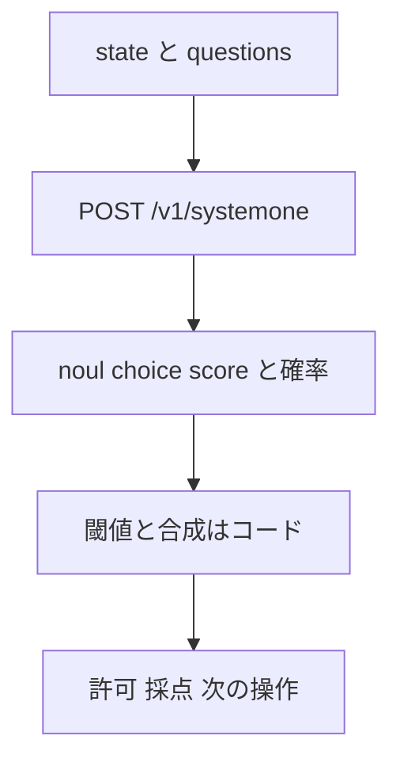
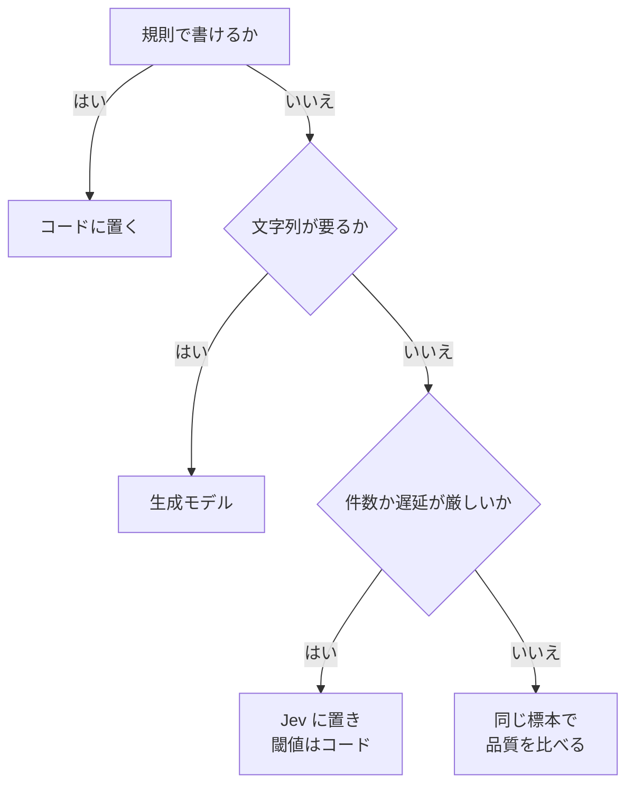

TypeSafe AI のホスト型モデル Jev を 1 週間で数十の題材に当てた実験リポジトリ [mizchi/jev-playground](https://github.com/mizchi/jev-playground) を整理します。
対象は、Jev を自分のコードに組み込もうとしている方です。
読み終えると、次の 3 つが分かります。

- 同じデータでも、質問の「答えの形」を変えるだけで正解数が変わること
- 速さの数字を品質の主張に使えない理由と、計測を自分で疑う手順
- 同じ週に X で公開された他の事例と、playground の位置関係

Jev の基本（Choice / Score / Noul、公式 4 パターン、運用制約）は前回の記事「[型付きの決定を返すモデル Jev の活用法を公式4パターンと実測例から整理する](https://zenn.dev/suwash/articles/jev-use-cases_20260921)」で扱いました。
本記事はその続編として、前回に無い実験と事例だけを足します。
情報は 2026-09-24 時点の公開内容です。
数値の多くは作者のラベル付きデータでの自己計測で、本記事では再実行していません。

*この記事の全体像。以下、順に解説します。*

## jev-playground とは

jev-playground は、Jev に型付きの質問を送り、どの問題の形で判断が安定するかを記録した実験リポジトリです。
2026-09-17 に作られ、1 週間で `docs/` に題材ごとの実測メモが積まれました。
要約（`docs/summary.md`）の見出しは「58 本作って測って分かったこと」です。

### 構成

| 置き場 | 中身 |
|---|---|
| `lib/` | MoonBit のクライアント。`GET /v1/models` と `POST /v1/systemone` で noul / choice / score を往復する |
| `cmd/` | 単発質問、五目並べ（GIF は各手の実測ミリ秒をフレーム遅延にする）、公式パターンの実測、シェル危険度 |
| `experiments/` | TypeScript 側の実験。チェス、ブラウザ操作、ESLint、タスク選択 |
| `hooks/` | Claude Code の `PreToolUse` で Bash コマンドの実行可否をゲートする |
| `jevdsl/` `jevlang/` | 判断を `match` できる値にする薄いラッパーと、条件が Jev の判断である小言語。MoonBit と JS の 2 実装が同じ `.jev` を走らせる |
| `docs/` | 実測レポートとガイド |

API キーは環境変数 `TYPESAFEAI_API_KEY` で渡します。
2026-09-24 時点で star は約 25、ライセンスは未設定です。

呼び出しの流れは前回の記事と同じです。
1 回の state に質問の束を載せ、返った確率をコードが閾値と合成で読みます。

### 学びの入口になるガイド

作者は学びを 4 本のガイドにまとめています。
最初に読むならこの 4 本です。

| ガイド | 役割 |
|---|---|
| [when-to-use.md](https://github.com/mizchi/jev-playground/blob/main/docs/when-to-use.md) | 入れる条件と入れない条件 |
| [fit.md](https://github.com/mizchi/jev-playground/blob/main/docs/fit.md) | 問題の形ごとの早見表 |
| [tuning.md](https://github.com/mizchi/jev-playground/blob/main/docs/tuning.md) | 答えの形、質問、state、閾値、合成、運用、計測 |
| [case-studies.md](https://github.com/mizchi/jev-playground/blob/main/docs/case-studies.md) | 題材 13 件の横断まとめ |

## 試している題材

ケーススタディは 13 題材で、4 つの系統に分かれます。

| 系統 | 題材 |
|---|---|
| 判定 | シェル許可、ESLint、コード指標 |
| 選択 | タスク選択、監視トリアージ、skill 選択、英日一致 |
| 行動 | ブラウザ、ゲーム、空間、MOBA |
| エージェントへの挿入 | エージェント部品、実エージェント |

MOBA の実験は途中で [mizchi/jev-playground-moba](https://github.com/mizchi/jev-playground-moba) へ移りました。

### 切り出された道具

実験の一部は、既存ツールの入口に判断を閉じた道具として公開されています。

| 道具 | star（2026-09-24） | 判断の閉じ方 |
|---|---:|---|
| [jev-lint](https://github.com/mizchi/jev-lint) | 約 78 | コード中の文を score で採点するリンタ |
| [jev-test-filter](https://github.com/mizchi/jev-test-filter) | 約 16 | git diff に対してテストを採点し、vitest / node:test / Playwright / cargo / go の filter 引数を出す |
| [jev-lexer](https://github.com/mizchi/jev-lexer) | 約 3 | 専用パーサを持たず、分割した部分を Jev で分類してハイライトする |

どれも Jev の答えを直接ユーザーに見せません。
既存のリンタやテストランナーが受け取れる形へ変換してから渡します。
前回の記事でいう「コードが制御フローと副作用を所有する」契約を、道具の単位で実装した例です。

## 実験から得られた学び

### 置き場所の判断順

ガイド（when-to-use.md と fit.md）が示す置き場所の判断は、次の順です。

ガイドは、Jev に置く仕事を「選ぶ・順序づける・真偽を言う」もののうち、件数か遅延が厳しいものに限っています。
公式の [jaggedness](https://docs.typesafe.ai/model-jaggedness/jev-1.13) も同じ切り分けを推奨しています。
公式は「Jev is not a calculator.」と書き、算術・カウント・日付比較をコードに置くよう求めています。

### 答えの形を変えると正解数が変わる

作者が一番効いたと書く学びは、合成ロジックではなく答えの形です。
出典は [docs/01-shell-risk.md](https://github.com/mizchi/jev-playground/blob/main/docs/01-shell-risk.md) です。
同じ 24 件のシェルコマンドを allow / confirm / block に分類し、判定の出し方だけを変えています。

| 判定の出し方 | 正解一致 |
|---|---:|
| `choice` の 3 択 | 19/24 |
| `score` を閾値 1.5 / 0.5 で読む | 23/24 |
| 原子信号と手書きのコード規則で合成 | 14/24 |
| choice の総合と原子側の保守 max | 21/24 |
| score の総合と原子側の保守 max | 23/24 |

allow / confirm / block には順序があります。
順序のある結論を Choice で聞くと、確率が両端に割れることがあります。

`dd if=/dev/zero of=/dev/sda` の例が分かりやすい行です。

| 形 | 返った分布 | confidence |
|---|---|---:|
| choice | allow 0.00 / confirm 0.35 / block 0.65 | 0.47 |
| score | レベル 2（block）が 0.96 | 0.93 |

choice の confidence 0.47 は「危険か穏やかか迷っている」ではありません。
allow は 0 で、confirm と block の間で割れているだけです。
順序のある結論は Score で聞き、閾値をコードで持つ、というのがこの表の読み方です。

ただし、Score の閾値 1.5 / 0.5 は、スコア分布を見てから決めた値だと作者は後続の [docs/04-agent-built-prompts.md](https://github.com/mizchi/jev-playground/blob/main/docs/04-agent-built-prompts.md) に書いています。
19/24 から 23/24 への差には、答えの形の変更と、分布に合わせた閾値の調整の両方が含まれます。

同じファイルは、危険信号を細かい Noul に分解してコード規則で合成すると 14/24 に落ちたことも記録しています。
前回の記事で紹介した firewall の例は分解で改善していました。
分解が常に効くのではなく、規則の書き方次第で逆にも振れる、という反例です。

### 往復を減らすほうが効く

[docs/00-api-notes.md](https://github.com/mizchi/jev-playground/blob/main/docs/00-api-notes.md) は、20 問を送り方だけ変えて測っています。

| 送り方 | 時間 | トークン |
|---|---:|---:|
| 20 リクエストに 1 問ずつ | 5227 ms | 8277 |
| 1 リクエストに 20 問 | 246 ms | 1000 |

数値回答 17 個の平均差は 0.011 で、答えはほぼ動きませんでした。
前回の記事で扱った公式 cookbook の fan-out と同じ傾向を、別の題材で再現した記録です。

### 範囲外の入力には逃げ道を用意する

同じメモに、閉じた選択肢の外の入力を Choice に渡した行があります。

| 入力 | `none_of_these` なし | `none_of_these` あり |
|---|---|---|
| 燕の飛行速度の質問 | technical を confidence 0.96 で選ぶ | none_of_these を 1.00 |
| `asdf qwer zxcv` | 0.99 で誤答 | none_of_these を 1.00 |

逃げ道の置き方にも差があります。
[docs/17-task-picker.md](https://github.com/mizchi/jev-playground/blob/main/docs/17-task-picker.md) では、「該当なし」を別の Noul で聞くと 18/18 でした。
Choice の選択肢に混ぜると 16/18 に下がりました。
混ぜると、答えのある難問まで「該当なし」へ逃げる、と作者は要約しています。

別の Noul にもゲートの代償があります。
同じファイルは、答えのある 90 件でゲート前後の正解数を比べています。

| 選択肢の渡し方 | ゲート前 | ゲート後 | 捨てた正解 |
|---|---:|---:|---:|
| 名前だけ | 81/90 | 75/90 | 6 |
| 1 行の説明つき | 90/90 | 90/90 | 0 |

名前だけだと、答えのある入力まで「該当なし」に落ちます。
この 90 件では、選択肢に説明を書くとゲートの副作用が消えました。

### 短いメニューでは選択肢の順序を固定する

Choice の隣接する選択肢を入れ替えた実測もあります。

| 候補数 | 後ろに置いた選択肢の変化 |
|---:|---|
| 16 | +0.212 |
| 46 | +0.052、+0.022 |

作者は同一条件の 2 回（0.712 と 0.673）から、誤差の床を 0.04 としています。
46 候補の変化は床と同程度です。
短いメニューでは順序を固定し、長いメニューでは無視してよい、というのがこの表の範囲です。

### 名前だけでもかなり選べる

タスク選択の実験では、選択肢に名前しか渡さなくても 81/90（90.0%）が正解でした。
1 行の説明を足すと 90/90 です。
ESLint のルールを説明文だけで当てる実験（[docs/16-eslint-oracle.md](https://github.com/mizchi/jev-playground/blob/main/docs/16-eslint-oracle.md)）は 190/215（88.4%）、AUC 0.95 でした。
作者は紛らわしい例を意図的に多く入れたため、普通のコードに対しては悲観的な値だと書いています。

### 速さは品質の主張にならない

[docs/42-versus-rest.md](https://github.com/mizchi/jev-playground/blob/main/docs/42-versus-rest.md) は、5 つのコンポーネントで Jev と生成モデル（haiku / sonnet）を比べています。

| コンポーネント | 品質 | 速度 |
|---|---|---|
| guard | Jev 96% と sonnet が同じ、haiku 88% | 49〜61 倍 |
| orchestration | 3 者とも 58〜61%。38 件中 32 件は 3 者が同じ答え | 26〜34 倍 |
| compactor | Jev は 8/8 が予算内で事実保持 100%。捏造は 3 者とも 0 | 43〜103 倍 |
| model router | どれも常に haiku を選ぶ基準を超えない | 43 倍 |
| skill router | 3 者に有意差なし。Jev の方が 4 倍高い | 79〜96 倍 |

速度は 5 行すべてで 26〜103 倍です。
品質で Jev が明確に勝つ行はありません。
作者の結論は「速さで選んでよいが、速さを品質の証拠にしない」です。

### 計器を先に疑う

要約の後半で作者が一番多く学んだと書くのは、Jev の精度ではなく計測の仕組み（計器）です。
嬉しい数字が出たときに計器を疑い、自分の結論を撤回した記録が複数あります。

| 撤回した主張 | 分かったこと |
|---|---|
| テストが通った | `passed` を `node --test` の終了コードだけで判定していた。テストを書き換えても通る穴の上に 186 run があった |
| ゲートがエージェントの仕事を奪った | 14/15 の 1 件は、掃き直すと 15/15 になり再現しなかった |
| 指示で要約の事実保持が上がった | 同じ条件の再走でも同じ 78% になった。n=8 では要約器のばらつきと区別できない |
| 部品が静かに動いた | 自作コーパスでは 978 中 12 件（1.2%）が反応、公開パッケージの script では 568 中 137 件（24.1%）。静かだったのはコーパスの方だった |

LLM を部品にした実験は、判定のたびに乱数が入り、分母も小さくなりがちです。
率を看板にする前に、終了条件、再走、別コーパスでの再現を確認する、という手順がこの表から読めます。

## 他の公開事例

同じ週に X と GitHub で公開された Jev の事例を、何を公開しているかで並べます。
star は 2026-09-24 時点の概数です。

| 事例 | star | 公開されているもの |
|---|---:|---|
| [Ice-Hazymoon/jevlint](https://github.com/Ice-Hazymoon/jevlint) | 約 9 | 自然言語の yes/no ルールで書くリンタ。ast-grep で候補を切り、キャッシュと fixture を持つ。README は ESLint との併用を推奨する |
| [sugarforever/tryjev](https://github.com/sugarforever/tryjev) | 約 7 | ブラウザの playground。OpenRouter、Vercel AI Gateway、TypeSafe を切り替えられる。[公開デモ](https://www.tryjev.xyz/)あり |
| [terryds/jevplayground](https://github.com/terryds/jevplayground) | 約 1 | ブラウザだけで動く playground。[公開デモ](https://jevplayground.terrydjony.com)あり |
| [hugo-alves/jev-router-playground](https://github.com/hugo-alves/jev-router-playground) | 約 2 | OpenRouter の候補モデルを Jev に選ばせ、人間の好みと照合する |
| [az9713/jev-model-router](https://github.com/az9713/jev-model-router) | 約 2 | 1 つの Choice で nano / fast / balanced / frontier を選び、選んだモデルが返信する |
| [gargpratyush/jev-router](https://github.com/gargpratyush/jev-router) | 約 377 | Claude Code と Codex のターンごとに、Jev がモデルの tier を選ぶ CLI |
| [TokenTrim/jev-routing-experiment](https://github.com/TokenTrim/jev-routing-experiment) | 約 2 | ルーティングに Jev を足した効果を、Jev なしと比べた実験 |

事例は 3 種類に分かれます。

- **既存ツールへの組み込み**: jevlint、jev-lint、jev-test-filter
- **試すための playground**: tryjev、jevplayground
- **モデルルーティング**: jev-router 系と TokenTrim

### ルーティングの外部対照

TokenTrim の実験は、playground の「速さは品質の主張にならない」を外から裏づけます。
13 モデル、評価 5,835 件の結果を README から引きます。

| 条件 | 正解率 | 1,000 件あたりコスト |
|---|---:|---:|
| Jev の難易度判定と近傍の証拠 | 62.4% | $26.73 |
| 近傍の証拠だけ（Jev なし） | 62.4% | $26.69 |
| 最良の単一モデル（gpt-5） | 60.3% | $31.55 |
| 理論上限（oracle） | 82.6% | $4.83 |

Jev ありとなしが同じ 62.4% です。
README 自身が、改善は近傍の証拠によるもので、Jev の難易度判定はほぼ冗長だと書いています。
Jev の支出は、この実験全体で約 $0.13 でした。

## 注意点

### 数値は作者のコーパスに閉じている

- 24 件のシェル危険度は英語だけです。日本語コメント付きのコマンドと複数行スクリプトは未評価です。
- 24 件に、正当な外向き転送は 1 件もありません。作者は既知の弱点を残したまま hook にし、実運用の最初に普通の `git push` を deny したと追記しています。「23/24 のほうを持って出た」と作者は書いています。
- 作者が挙げる一番大きい限界は、コーパスが 10〜130 件と小さいことです。
- 24 件の表の応答 JSON はリポジトリにありません。再実行には API キーが必要です。
- 同じ 24 件でも、エージェントに質問文を書かせると 10/24〜23/24 に振れた、と作者は別のメモに書いています。答えの形だけで精度が決まるわけではありません。

### 同じ数字が別の場所で言い換えられている

- [docs/36-routers.md](https://github.com/mizchi/jev-playground/blob/main/docs/36-routers.md) は「choice は 14/24」と書きます。01 の表では 14/24 は原子信号とコード規則の列で、choice 単体は 19/24 です。引用するときは 01 の表を使います。
- `docs/README.md` の「53 タスクから 90.0%」の分母は 90 です。53 はタスクの行数です。

### API の上限は公式 docs と OpenAPI で書き方が違う

- Choice の 255 選択肢、context 64k、state と最長の質問で 32k は、公式 docs（[Models](https://docs.typesafe.ai/models)、[Choice](https://docs.typesafe.ai/primitives/choice)）にあります。
- 2026-09-24 に取得した [openapi.json](https://api.typesafe.ai/openapi.json) には、これらの数値がありません。
- 作者は上限超過が 400 になったと記録しています。公式の検証失敗は 422 と書かれています。前回の記事でも、同じ食い違いの Issue を紹介しました。

### X の速度の宣伝には出典がない

「メール 100 件を 27 秒」「100 通を 1.42 秒で 96/100」などの投稿は、取得した本文に出典 URL がありません。
計測条件も分からないため、実測値と同列には扱えません。
作者本人の「酷使してまだ $15」という投稿も、請求の一次資料は示されていない自己申告です。

### TokenTrim の実験は推論していない

TokenTrim の評価は、事前に計算した各モデルの答えを引く lookup 方式です。
別の 100 例のパイロットでは、Jev の難易度判定が 69.5%、固定の最良モデル `gemini-2.0-flash-001` が 77.1% でした。
README の見出しの「最良の単一モデルに勝つ」は、Jev なしの行とセットで読みます。

### star 数は実利用を表さない

jev-router の約 377 star が、どれだけの実利用を表すかは分かりません。
公開 1 週間の数字です。

## 前回の活用法に何を足すか

前回の記事と本記事の対応です。

| 前回の記事で書いたこと | 本記事で足したこと |
|---|---|
| 公式 4 パターン。閾値は例示であること | 同じ 24 件で答えの形を変えた表と、分解が 14/24 に落ちた反例 |
| 閉じた選択肢では範囲外が高 confidence で誤る | `none_of_these` で 1.00 に戻る実測と、逃げ道は別の Noul が良いという比較 |
| fan-out は公式 cookbook で 12.2 倍安く 10.0 倍速い | 20 問で 5227 ms と 246 ms、答えの平均差 0.011 |
| コミュニティの単発の実測 | 計器を自分で撤回した記録と、5 コンポーネントの速度と品質の対照 |
| 適所の 1 つにハーネス内の閉集合選択 | PreToolUse hook、リンタ、テスト選択、モデルルーティングの実装例 |

前回の記事の結論「速度・コストと、閉じた判断とコード合成という契約は残る。精度の最適化は支持されない」は、本記事の材料でも変わりません。
playground の実験は、その結論を実装の粒度まで具体化したものです。

## 自分のプロジェクトで試すなら

前回の記事の「直近の進め方」に、次の 5 つを足します。

1. **順序のある結論は Score で聞き、閾値は分布を見て決める。** allow / confirm / block のように順序があるなら、Choice でなく Score にします。閾値はコードで持ち、自分のデータのスコア分布を見てから決めます。
2. **逃げ道は別の質問にし、選択肢に説明を書く。** 範囲外を拾う質問は、選択肢に混ぜず独立した Noul にします。名前だけの選択肢ではゲートが正解を捨てるため、1 行の説明を足してから、ゲート前後の正解数を自分のデータで比べます。
3. **短いメニューは順序を固定する。** 候補が 16 程度の短いメニューなら、選択肢の並びを毎回同じにします。
4. **判断を既存ツールの入口に閉じる。** Jev の答えをそのまま見せず、リンタの警告、テストの filter 引数、hook の allow / deny に変換します。
5. **率を出す前に計器を確認する。** 終了条件が穴になっていないか、同じ条件の再走で差が消えないか、別のコーパスでも同じ率か、を確認します。

## まとめ

- jev-playground は、Jev を 13 題材に当て、どの問題の形で判断が安定するかを記録した実験リポジトリです。
- 作者が一番効いたと書くのは合成ロジックではなく答えの形です。同じ 24 件で、Choice の 19/24 が、Score と分布に合わせた閾値で 23/24 になりました。
- fan-out の実測は、前回の記事で扱った公式パターンを別の題材で補う結果です。範囲外の逃げ道、選択肢の順序、名前だけの選択は、playground の個別実験から得た知見です。
- 5 コンポーネントの比較では、速度は 26〜103 倍でも品質の優位は示されませんでした。TokenTrim の実験でも、Jev による正解率の上積みは示されていません。
- 数値は英語中心の小さな自作コーパスに閉じています。自分のデータで同じ手順を回してから採用するのが堅実です。

この記事が少しでも参考になった、あるいは改善点などがあれば、ぜひリアクションやコメント、SNSでのシェアをいただけると励みになります！

## 参考リンク

jev-playground

- [mizchi/jev-playground](https://github.com/mizchi/jev-playground)
- [docs/when-to-use.md](https://github.com/mizchi/jev-playground/blob/main/docs/when-to-use.md)
- [docs/fit.md](https://github.com/mizchi/jev-playground/blob/main/docs/fit.md)
- [docs/tuning.md](https://github.com/mizchi/jev-playground/blob/main/docs/tuning.md)
- [docs/case-studies.md](https://github.com/mizchi/jev-playground/blob/main/docs/case-studies.md)
- [docs/summary.md](https://github.com/mizchi/jev-playground/blob/main/docs/summary.md)
- [docs/00-api-notes.md](https://github.com/mizchi/jev-playground/blob/main/docs/00-api-notes.md)
- [docs/01-shell-risk.md](https://github.com/mizchi/jev-playground/blob/main/docs/01-shell-risk.md)
- [docs/04-agent-built-prompts.md](https://github.com/mizchi/jev-playground/blob/main/docs/04-agent-built-prompts.md)
- [docs/16-eslint-oracle.md](https://github.com/mizchi/jev-playground/blob/main/docs/16-eslint-oracle.md)
- [docs/17-task-picker.md](https://github.com/mizchi/jev-playground/blob/main/docs/17-task-picker.md)
- [docs/36-routers.md](https://github.com/mizchi/jev-playground/blob/main/docs/36-routers.md)
- [docs/42-versus-rest.md](https://github.com/mizchi/jev-playground/blob/main/docs/42-versus-rest.md)

mizchi の周辺リポジトリ

- [mizchi/jev-lint](https://github.com/mizchi/jev-lint)
- [mizchi/jev-test-filter](https://github.com/mizchi/jev-test-filter)
- [mizchi/jev-lexer](https://github.com/mizchi/jev-lexer)
- [mizchi/jev-playground-moba](https://github.com/mizchi/jev-playground-moba)

他の公開事例

- [Ice-Hazymoon/jevlint](https://github.com/Ice-Hazymoon/jevlint)
- [sugarforever/tryjev](https://github.com/sugarforever/tryjev)
- [terryds/jevplayground](https://github.com/terryds/jevplayground)
- [hugo-alves/jev-router-playground](https://github.com/hugo-alves/jev-router-playground)
- [az9713/jev-model-router](https://github.com/az9713/jev-model-router)
- [gargpratyush/jev-router](https://github.com/gargpratyush/jev-router)
- [TokenTrim/jev-routing-experiment](https://github.com/TokenTrim/jev-routing-experiment)

公式

- [TypeSafe Models](https://docs.typesafe.ai/models)
- [TypeSafe API reference](https://docs.typesafe.ai/api)
- [TypeSafe Choice](https://docs.typesafe.ai/primitives/choice)
- [Jev 1.13 jaggedness](https://docs.typesafe.ai/model-jaggedness/jev-1.13)
- [openapi.json](https://api.typesafe.ai/openapi.json)

前回の記事

- [型付きの決定を返すモデル Jev の活用法を公式4パターンと実測例から整理する](https://zenn.dev/suwash/articles/jev-use-cases_20260921)
