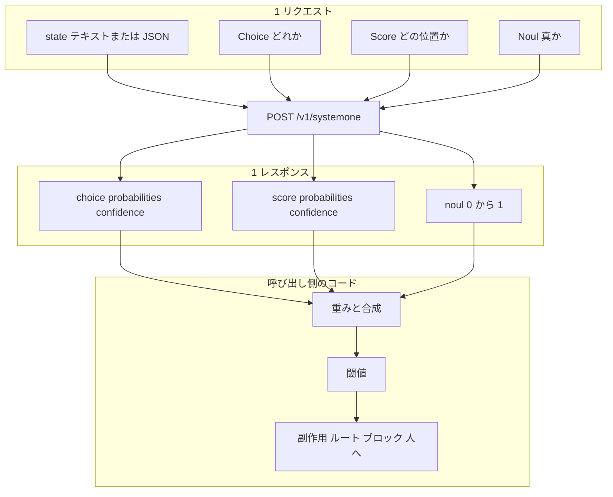

TypeSafe AI のホスト型モデル Jev を、既存のソフトウェアへどう組み込むかを整理します。
対象は、Jev の API を触り始めた方と、LLM の前段に安い判断レイヤを置きたい方です。
公式が示す置き場所と 4 つの設計パターン、コミュニティの実測例、向く条件と向かない条件を順に扱います。
数値は 2026-09-21 時点の公開情報に基づきます。


*この記事の全体像。以下、順に解説します。*

## Jev とは

Jev は、ソフトウェアがそのまま分岐に使える型付きの決定を返すホスト型モデルです。
呼び出し側は `state` と、型付きの `questions` を送ります。
`state` にはテキスト、JSON、テキスト配列を渡せます。
レスポンスは Choice / Score / Noul の答えと確率分布です。

TypeSafe はこのクラスのモデルを System One model と呼びます。
公式の要約は「unstructured state in, typed probabilistic decisions out」です。
コードが制御フローと副作用を所有し、Jev は非構造データに対する狭い意味判断を担います。

### 特徴

| 項目 | 内容 |
|---|---|
| Choice | 固定選択肢からの選択、確率分布、`confidence` |
| Score | 順序付きルーブリック上の位置、確率分布、`confidence` |
| Noul | yes の確率 0〜1。`confidence` フィールドなし |
| 並列評価 | 型の違う質問を 1 リクエストに混在可能。質問 ID はモデルへ送られない |
| API | `POST https://api.typesafe.ai/v1/systemone`。認証は Bearer API キー |
| SDK | Python `typesafe-sdk`、JavaScript `@typesafe-ai/sdk` |
| モデル ID | versioned ID は `jev-1.13.0`、SDK 既定の alias は `jev-latest` |
| 入力 | テキストのみ。画像・音声・動画は未対応 |
| 上限 | Choice は最大 255 選択肢、Score は 2〜10 レベル |
| context | 全体 64k。state と最長の質問の合計は 32k |
| 課金 | 入力 $0.042 / MTok、出力は無料 |
| 第三者ホスト | Cloudflare Workers AI の `typesafe/jev`、Vercel AI Gateway、OpenRouter |

最小のリクエストは次の形です。

```bash
curl -X POST https://api.typesafe.ai/v1/systemone \
  -H "Authorization: Bearer $TYPESAFE_API_KEY" \
  -H "Content-Type: application/json" \
  -d '{
    "state": "Hi, I have been trying to connect my Stripe account for 3 days and it keeps failing. Please help ASAP.",
    "model": "jev-latest",
    "questions": {
      "urgency": {
        "type": "noul",
        "instructions": "Does this message express urgency?"
      }
    }
  }'
```

### 活用の単位

Jev の活用単位は 2 つです。
1 つは「1 つの state に対する原子質問の束」です。
もう 1 つは「答えを合成するコード」です。



公式の How to build が示す 8 ステップは、この図を上から下へたどる流れです。
要点は次の 5 つです。

- 決定論で書ける処理はコードに残す
- state は質問に必要な分だけ送る
- 質問は原子に分解する
- 独立な質問はまとめて送る
- 合成と不確実性のルーティングはコードが行う

## 公式が示す置き場所

公式の [Example use cases](https://docs.typesafe.ai/concepts/use-case-map) は、Jev の置き場所を 5 つのカテゴリで示します。

| カテゴリ | 公式が置く判断 | 典型 primitive |
|---|---|---|
| AI Automation Software | チケット仕分け、採用、リード、保険、コンプラ、モデレーション | Choice + Noul + Score |
| Real-time applications | 150 ms 級の UI / ゲーム内判断 | Choice |
| AI Map Reduce over Big Data | 巨大コーパスの意味スコア、トレース分類、特徴抽出 | Noul / Score の大量並列 |
| Universal Verification | LLM の入力・出力・ツール呼び出し・引用の検査 | Noul の束 + Score |
| Harness Engineering | モデルルーティング、コンテキスト選択、エラー検知 | Choice + Noul |

同じページは、決定の形を task categories として並べます。
業種より先に選ぶ軸です。

- Classification / Detection / Scoring / Routing
- Search / Retrieval / Ranking / Verification
- ML Feature Extraction / Structured Data Extraction

How to build は「System One is TypeSafe's model for building AI-powered software, **not agents**」と書きます。
Jev は次のアクションを自分で選びません。
エージェントに使うときは、ハーネスが次の候補の閉集合を Choice として渡します。

## Primitive の使い分け

3 つの primitive は、欲しい答えの形で選びます。
出典は [Primitives](https://docs.typesafe.ai/primitives)、[Choice](https://docs.typesafe.ai/primitives/choice)、[Score](https://docs.typesafe.ai/primitives/score)、[Noul](https://docs.typesafe.ai/primitives/noul) です。

| 使いたい答え | 使う型 | コード側の使い方 |
|---|---|---|
| 既知集合のどれか（部署、言語、ツール） | Choice | `choice` で分岐。必要なら `other` / `none of the above` を入れる |
| 順序のある位置（深刻度、不満、関連度） | Score | `score` を閾値で判定。レベル説明は「程度」ではなく状況で書く |
| yes/no の確率そのもの（返金要求、PII、jailbreak） | Noul | `noul` を閾値で判定。中央は「中くらい」ではなく「不確か」 |

公式は次の使い方を勧めます。

- 技能の高さは Score のレベルで聞く。Noul の 0.5 は中級者を意味しない
- 同じ判断を Noul と yes/no の Choice の両方で聞かない
- 否定形の Noul 同士が足して 1 になると仮定しない
- 閾値は primitive 間で持ち越さない

## 公式 4 パターン

公式の [Patterns](https://docs.typesafe.ai/patterns) は 4 つの設計パターンを示します。
コード例に出てくる閾値は教材用の例です。
公式の [Confidence](https://docs.typesafe.ai/confidence) ページは、閾値をドメインと自前データで決めるよう書いています。

### Speculative fan-out

1 コールで、後で使うかもしれない質問まで全部聞くパターンです。
コードは関連する答えだけを読みます。

公式のサポート例は、次の 5 問を同時に送ります。

- カテゴリの Choice
- バグ深刻度の Score
- 再現手順の有無の Noul
- 返金要求の Noul
- 不満度の Score

バグでなければ、深刻度の答えは捨てます。

公式の [Parallel questions cookbook](https://docs.typesafe.ai/cookbooks/parallel_questions) は、この効果を実測しています。
条件は `jev-1.12`、GDPR の Wikipedia 記事 53,777 文字、13 問、5 回平均です。

| 方式 | コール数 | 費用 | 合計時間 |
|---|---:|---:|---:|
| 1 コールに 13 問 | 1 | $0.000497 | 0.27 s |
| 13 コールに 1 問ずつ | 13 | $0.006090 | 2.71 s |

バッチは 12.2 倍安く、10.0 倍速い結果です。
答えの平均は両方式で一致しました。
課金が入力トークンなので、文書が大きく質問が小さいときに効きます。

### Confidence-gated routing

答えは「何をするか」を、confidence は「実行してよいか」を表します。
このパターンは、アクションごとに閾値を変えます。

公式の音声バンキング例は次の設定です。

| アクション | 条件 | 動作 |
|---|---|---|
| すべて | 全体フロア 0.6 未満 | 自動実行しない |
| 残高表示 | 0.6 以上 | 実行 |
| 送金承認 | 0.85 超 | 自動実行 |
| 送金承認 | 0.85 以下 | 確認を挟む |

Confidence ページの別例は、フロア 0.5、送金 0.9 です。
Noul には confidence がありません。
Noul では、中央帯（例: 0.4〜0.6）を人へ回す三分割が対応する設計です。

### Composite scoring

複雑な総合点を 1 問で聞かないパターンです。
次元ごとの Score / Noul を 0〜1 に正規化し、重みはコードが持ちます。

公式の履歴書例は、次の 4 次元を別々に聞きます。

- Python
- リーダーシップ
- 設計
- ジェネラリスト

IC 採用と EM 採用では、同じ答えに違う重みを掛けます。
重みを変えても Jev を呼び直す必要はありません。

### Intent routing

先に安く分類し、ハンドラを分けるパターンです。
公式のカスタマーサービス例は、intent の Choice と complexity の Score を同時に聞きます。

| 条件 | 振り分け先 |
|---|---|
| intent の confidence < 0.5 | 人 |
| `order_status` | 決定論コード |
| 製品質問、返品 | 専門の LLM |
| 苦情で complexity > 1、または complexity の confidence < 0.5 | 人 |

## コミュニティの実測例

公開されている活用例は、公式 4 パターンのどれかに対応します。
結果はそれぞれの著者が公開した値です。

| 例 | パターン | 著者が公開した結果 |
|---|---|---|
| [browser-use/jev-ultrafast](https://github.com/browser-use/jev-ultrafast/blob/main/docs/performance.md) | fan-out で operation と target を同時に決定 | Google Flights の操作が録画で 7.073 s。中央値は 9.450 s から 7.092 s（3/3 成功）。著者は n=3 で統計が弱いと明記。テキスト生成は別の LLM |
| [typesafe-ai-firewall](https://github.com/AnshChoudhary/typesafe-ai-firewall/blob/main/report.md) | 分解した Noul + コードのポリシー表 | 合成 600 件。紛らわしい無害入力の BLOCK 率は 0%。単一の「危険か」1 問では 39.2%。ECE は 0.156 で著者のゲート未達。p50 375 ms / p95 595 ms |
| [DevelopersIO モデルルーティング](https://dev.classmethod.jp/articles/jev-for-llm-model-routing/) | Intent routing の Choice | 40 コール 40 成功。中央値 0.64〜0.67 s。約 $0.000026 / コール |
| [ニュース選別 53 日](https://zenn.dev/acropapa330/articles/typesafe-jev-news-triage-53days) | fan-out + 足切り | 1 日あたり約 1.0 s、約 $0.001。非 AI 記事の除外は安定。関連度の並びは元の並び順と区別できない精度 |
| [Every の Mini-Vibe Check](https://every.to/vibe-check/mini-vibe-check-typesafe-s-jev-judged-everything-i-ve-written-in-0-7-seconds) | Verification | 777 判定が 0.7 s 未満。欠陥の検出は 7 件中 6 件（比較対象の LLM は 7 件中 7 件）。本番前に精度チェックが必要と明記 |
| [zod-jev](https://zenn.dev/nasubikun/articles/correct-use-of-jev) | ルール通過後の意味検査 | 160〜400 ms、約 $0.00008 / 回（著者の自己申告）。「LLM でよくないか」「ルールで書けないか」を先に自問する設計 |

日本語の公開情報は、Playground 解説、検証記事、個人のパイプラインまでです。
日本企業の本番事例は、公開情報では確認できていません。

### API 互換の OSS 実装

同じ HTTP 形を持つ OSS 実装が複数あります。

| 実装 | エンジン | 活用上の意味 |
|---|---|---|
| TypeSafe Jev | ホスト型 | 本番判断の正本候補 |
| djev-spark（約 140★） | DiffusionGemma + vLLM | ワイヤ互換の自己ホスト。confidence は argmax の確率 |
| OpenJev（約 216★） | DiffusionGemma。Choice 上限 128 | confidence は `1 − H(p)/ln K` |
| jev-local（約 2★） | Apple Silicon 向け | README が「0.9 は 90% 正解ではない」と明示 |

## 運用時の制約

本番へ組み込む前に確認する制約です。

| 項目 | 内容 |
|---|---|
| レート | 250,000 tok/s と 1,200 rpm。超過は 429、過負荷は 529。上限は動的に変わる。引き上げ申請は `sales@typesafe.ai` |
| エラー | API は 401 / 422 / 429 / 529 |
| リトライ | SDK 既定は `max_retries=2`、backoff 0.5〜5 s、対象は 408 / 429 / 5xx。HTTP timeout は 10 s。Python の retry budget は 30 s |
| 認証 | `Authorization: Bearer`、環境変数 `TYPESAFE_API_KEY`。OAuth や IAM スコープはなし |
| データ | Privacy は US ホスト。入力を学習に使わない。ZDR はエンタープライズ向けで `privacy@typesafe.ai` |
| SLA | 数値 SLA はなし。Terms は無中断を保証しない |
| ライフサイクル | `jev-latest` と `jev-preview` は 2026-09-21 時点でともに `jev-1.13.0`。非推奨スケジュールは未掲載 |
| サンプル | [Quick start](https://docs.typesafe.ai/introduction/quickstart) に cURL / Python。公式 cookbook は `cooksafe` を `pypi.typesafe.ai` から導入 |

## 注意点

公式や紹介記事の数値には、到達宣言と計測値が混ざります。
読むときの分母は次のとおりです。

### 公称値の読み方

- **「can't hallucinate」「型エラー 0%」** は、出力が渡した option / level の外に出ないというスキーマ保証です。判断の正誤の保証ではありません。[発表ブログ](https://typesafe.ai/blog/introducing-system-one-models-and-jev)自身が「schema matching is guaranteed」と書き、正しさの経験分布ではないと注記しています。
- **193.6× faster / 444.6× cheaper** は自社の [workflow evals](https://evals.typesafe.ai/) の値です。発表ブログは「higher end of real world gains」と書きます。ワークフローを自社チームが作ったためバイアスがありうる、とも書いています。精度の参照ラベルは 2 つの最新 LLM の平均であり、人間の正解ではありません。
- **70〜500 ms** は発表ブログのエンドツーエンド範囲です。実測は条件で外れます。DevelopersIO の計測は中央値 0.64〜0.67 s、firewall の p95 は 595 ms です。
- **confidence** は Choice / Score の分布の尖りです。Noul にはありません。公式デモは 3 選択肢で `(3 × p_max − 1) / 2` の近似を示します。高い confidence は「渡した選択肢の中で尖っている」という意味です。「現実の正解確率が 90%」という意味ではありません。
- **cookbook の倍率** は、Primitives 本文では「11.5× / 9.6×」と要約されています。cookbook の実行表は 12.2× / 10.0× です。引用するときは表の値を使います。
- **OSS 互換実装** は、同じ HTTP 形でもエンジン、Choice 上限、confidence の定義が違います。ホスト型 Jev の数値を、OSS 実装の性能として読まないでください。
- **第三者ホスト** の掲載 context は 32k です。公式の 64k 全体とは別の数字です。第三者ホスト経由の答えの分布が直ホストと同一かは、公開情報では確認できていません。

### モデルの癖

公式の [jaggedness](https://docs.typesafe.ai/model-jaggedness/jev-1.13) ページは、`jev-1.13` の癖を公開しています。

- 同じ返金要求の判断で、Noul は 0.22、yes/no の Choice は `no` 0.99（confidence 0.97）と食い違う例がある
- 否定形の Noul の和が 1 を超える例がある（0.72 + 0.47 = 1.19）
- 算術、カウント、日付の前後比較は苦手
- 言語は英語が最良。CJK は自前データでのテストを推奨

### 独立検証が示す弱点

第三者のベンチマークは、精度面の弱点を報告しています。

- **フィッシング検出。** 2,000 通で Jev 62.6%、Haiku 4.5 は 81.3% でした。2 行の正規表現は全件で 91.6%、held-out の 1,000 通で 91.8% です。質問の言い回しで最大 4.8 pt 動きます（[jev-phishing-bench](https://github.com/anisselbd/jev-phishing-bench)）。
- **正解を外した選択肢。** 正解の選択肢を除いた 59 択で、日本語入力の 24.0% が confidence 0.9 以上のまま誤分類されました（[biscuit のベンチマーク](https://zenn.dev/biscuit/articles/typesafe-ai-jev-benchmark-2026-09)）。
- **高カーディナリティの意図分類。** Banking77 では安価な LLM が上回るという報告があります（onlyoneaman/jev-eval の README による）。
- **感情ラベル。** DAIR の感情分類では accuracy 0.480 で、自動採用できる confidence 帯がなかったという報告があります（AbdelStark/jev-benchmarks の README による）。

### 提供条件と SDK

- 早期アクセスの段階です。fine-tune は不可で、重みは非公開です。
- JS SDK には open の Issue があります。402 / 413 が generic エラーになる件と、空の Retry-After で即リトライする件です。
- docs は入力不正を 422 と書きますが、実測は 400 だったという open の指摘があります。
- 月 $5 の無料クレジットは Console で観測されていますが、公式の [Models](https://docs.typesafe.ai/models) ページには記載がありません。

## どんな判断に Jev が向くのか

生成 LLM や専用分類器と並べると、Jev の位置が見えます。

| 基準 | ホスト型 Jev | 生成 LLM + Structured Outputs | 専用分類器 / ルール |
|---|---|---|---|
| ユースケース | 呼び出し時に criteria を自然言語で渡す閉じた判断 | 自由文、説明、開いた推論、ネスト抽出 | 固定ラベルと十分な教師データ、正規表現で取れる値 |
| 実装 | `state` + 原子質問 + コード合成 | スキーマ強制とパース再試行 | 学習パイプラインまたは手書き規則 |
| 運用 | キー、動的レート、version pin | モデル更新とプロンプトの漂流 | ラベル保守 |
| 監査 | 質問・criteria・閾値がコードに残る | 生成文の解釈が残る | 規則は追跡しやすい |
| レイテンシ | 公称 70〜500 ms。実測例は中央値 0.64〜0.67 s、p95 595 ms | 秒〜数十秒 | ロード後はミリ秒級が一般的 |
| コスト | 入力 $0.042/MTok、出力無料 | 入出力とも高い | 推論は安い。学習コストは別 |
| リスク | 校正と言い回しへの依存。想定外の入力で高 confidence の誤答 | 型崩れと過信 | 未知クラスに弱い |

### 向きやすい条件

- 答えの空間を呼び出し前に閉じられる
- 同一 state に独立な質問が複数ある
- 誤答コストがアクションごとに違い、閾値をコードで変えたい
- LLM の前段で安く足切りしたい

### 向かない条件

- 算術、カウント、日付の前後比較
- 文章生成
- 正規表現やパーサで足りる抽出
- 数秒待てて、精度がボトルネックのタスク
- 高カーディナリティの意図分類で、LLM の方が精度で勝つ場合

### 支持する材料と反証の突き合わせ

「ソフトウェア内の原子的な意味判断レイヤとして使う」という位置づけを、材料で確認します。

支持する材料は次のとおりです。

- How to build の設計契約と 4 パターンが、コミュニティの成功例（仕分け、ガードの分解、次アクションの Choice）と一致する
- 文書が支配的な並列評価は、cookbook の表で 12.2 倍安く 10.0 倍速い
- 足切りフィルタの速度とコストは、ニュース選別と Every の検証で再現している
- 分解しない単一の「危険か」は、紛らわしい無害入力を大量に BLOCK する（firewall の ablation）

反証は、前節の独立検証と jaggedness です。

突き合わせると、速度・コストと「閉じた判断 + コード合成」という契約は残ります。
精度の最適化や「0.9 なら自動実行」という運用までは支持されません。
適所は、足切り、仕分け、ハーネス内の閉集合選択です。
最終責任を負う判断や、URL 規則で分離できる脅威検出は、Jev 単独に任せない設計が妥当です。

## どこから始めるか

### 最初の適所は 3 つに限る

| 適所 | 使うパターン |
|---|---|
| キュー仕分け | Choice + fan-out |
| LLM / ツールの前段ガード | hazard ごとに分解した Noul |
| ハーネス内の閉集合選択 | 次ツール、次モデル、keep/delete の Choice |

### 設計の指針

1. **閾値はアクションの失敗コストで分ける。** 公式の 0.5 / 0.6 / 0.85 / 0.9 は教材です。自前ラベルで confidence 対精度を描いてから自動実行します。Noul は中央帯を人へ回します。
2. **本番の判断品質はホスト型 Jev を基準にする。** OSS 互換実装はオフライン実験と GPU 自己ホストに使います。同じ SDK でも confidence の意味が違います。
3. **versioned ID を pin する。** alias はリリースで動きます。閾値を合わせたら `jev-1.13.0` のように固定します。
4. **Jev に聞かないものを決める。** 算術、カウント、日付比較、生成、正規表現で足りる値、広すぎる 1 問です。

### 直近の進め方

1. 既存ワークフローから、閉じた判断を 5〜15 の原子質問に分解する。決定論の処理はコードに残す。
2. Playground ではなく API で、100〜300 件の自前ラベルを回す。primitive ごとに閾値表を作る。
3. ガードは「危険か」の 1 問にしない。hazard ごとに Noul を分ける。BLOCK / REVIEW / PASS はコードのポリシー表で決める。
4. 429 / 529 には SDK 既定のリトライを使う。リトライ失敗時に fail-open と fail-closed のどちらにするかを決める。
5. 日本語入力なら、正解を除外した選択肢セットで、高 confidence の誤答率を測る。

### 判断を見直す条件

次のいずれかに当たれば、Jev の採用を見直します。

- 自前セットで、同じ閉集合を安価な LLM や n-gram が精度・校正とも安定して上回る
- 429 / 529 の頻度が業務 SLA を割る
- 対象言語が英語以外で、confidence 帯ごとの正解率が業務閾値を下回る
- 不可逆な操作を自動実行したいのに、ECE が firewall の例（0.156）並みに悪い

## まとめ

- Jev は、閉じた答えの空間に対する型付きの決定を、低コスト・低レイテンシで返すホスト型モデルです。
- 公式の 4 パターンは、fan-out、confidence によるゲート、合成スコア、intent による振り分けです。いずれも閾値・重み・副作用をコードが持ちます。
- 実測例は、足切り、仕分け、閉集合選択で速度とコストの効果を再現しています。
- 独立検証は、精度がボトルネックのタスクと「高 confidence なら自動実行」という運用を支持していません。
- 最初は 3 つの適所に限り、自前ラベルで閾値表を作り、versioned ID を pin して始めるのが堅実です。

この記事が少しでも参考になった、あるいは改善点などがあれば、ぜひリアクションやコメント、SNSでのシェアをいただけると励みになります！

## 参考リンク

公式

- [Introduction](https://docs.typesafe.ai/introduction)
- [How to build with TypeSafe](https://docs.typesafe.ai/concepts/how-to-build-with-system-one)
- [Example use cases](https://docs.typesafe.ai/concepts/use-case-map)
- [Primitives](https://docs.typesafe.ai/primitives) / [Choice](https://docs.typesafe.ai/primitives/choice) / [Score](https://docs.typesafe.ai/primitives/score) / [Noul](https://docs.typesafe.ai/primitives/noul)
- [Confidence](https://docs.typesafe.ai/confidence)
- [Patterns](https://docs.typesafe.ai/patterns)（[fan-out](https://docs.typesafe.ai/patterns/fan-out) / [confidence-routing](https://docs.typesafe.ai/patterns/confidence-routing) / [composite-scoring](https://docs.typesafe.ai/patterns/composite-scoring) / [intent-routing](https://docs.typesafe.ai/patterns/intent-routing)）
- [Models](https://docs.typesafe.ai/models) / [API](https://docs.typesafe.ai/api)
- [Quick start](https://docs.typesafe.ai/introduction/quickstart)
- [Jev 1.13 jaggedness](https://docs.typesafe.ai/model-jaggedness/jev-1.13)
- [Parallel questions cookbook](https://docs.typesafe.ai/cookbooks/parallel_questions)
- [Re-ranking cookbook](https://docs.typesafe.ai/cookbooks/rerank_typesafe)
- [LLM guardrails cookbook](https://docs.typesafe.ai/cookbooks/llm_guardrails)
- [Introducing System One Models & Jev](https://typesafe.ai/blog/introducing-system-one-models-and-jev)
- [Legal](https://docs.typesafe.ai/legal)
- [Workflow evals](https://evals.typesafe.ai/)

独立検証・ハンズオン

- [Every: Mini-Vibe Check](https://every.to/vibe-check/mini-vibe-check-typesafe-s-jev-judged-everything-i-ve-written-in-0-7-seconds)
- [jev-ultrafast performance.md](https://github.com/browser-use/jev-ultrafast/blob/main/docs/performance.md)
- [typesafe-ai-firewall report.md](https://github.com/AnshChoudhary/typesafe-ai-firewall/blob/main/report.md)
- [DevelopersIO: モデルルーティング実測](https://dev.classmethod.jp/articles/jev-for-llm-model-routing/)
- [DevelopersIO: Playground 解説](https://dev.classmethod.jp/articles/jev-guide-with-examples/)
- [Zenn: ニュース選別 53 日](https://zenn.dev/acropapa330/articles/typesafe-jev-news-triage-53days)
- [Zenn: 二つの落とし穴](https://zenn.dev/nasubikun/articles/correct-use-of-jev)
- [Zenn: biscuit のベンチマーク](https://zenn.dev/biscuit/articles/typesafe-ai-jev-benchmark-2026-09)
- [jev-phishing-bench](https://github.com/anisselbd/jev-phishing-bench)
