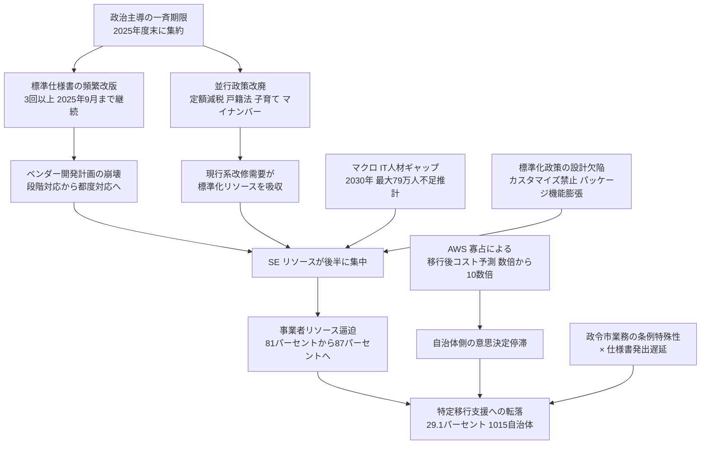

## この記事の出発点

2026年6月30日、デジタル庁は自治体基幹業務システムの標準化について、令和8年 (2026年) 3月末までに **34,366システム中 10,013システム (29.1%) が移行完了できない見込み**、遅延を1つ以上抱える自治体は **1,015団体 / 1,788団体中 56.8%** と公表しました。翌日の日経クロステック記事は「SE 不足で1万システム超が期限に間に合わず」と報じ、デジタル庁自身も「主因はベンダーの要員不足」と説明しています。

ただ、この見出しの単純化には注意が必要です。一次資料と反証を積み上げると、**SE 不足は症状であって病因ではない**構造が見えてきます。この記事は Nikkei xTech の Pick を出発点に、**大規模モダナイゼーション案件の PMO・アーキテクト・実装リード**が自分の案件レビューに転用できる構造的な示唆を持ち帰るために書きました。

- 元記事: [自治体システム標準化、SE不足で1万システム超が期限に間に合わず (Nikkei xTech, 2026-07-02)](https://xtech.nikkei.com/atcl/nxt/news/24/03279/)
- 政府一次データ: デジタル庁 2026-06-30 公表 (令和8年3月末見込み)
- 取得日: 2026-07-02

## 概要: 遅延は「症状」で、真因は4層構造

数字だけを見ると SE 不足で1万システムが遅延したように読めますが、真因は次の4層が重なっています。

- **政治設計層**: 2025年度末という一斉期限が、専門家の警告を上書きして政治主導で設定された経緯
- **政策改廃層**: 標準化と並行して走った定額減税・戸籍法ふりがな対応・子育て支援・マイナンバー関連が現行系改修需要を吸い上げた事実
- **標準化設計層**: 標準仕様書の頻繁改版と、カスタマイズ禁止によるパッケージ機能膨張、および需要側 (自治体) の交渉力を国家が奪った設計欠陥
- **供給・実装層**: ベンダー SE 不足、IT 人材のマクロギャップ、政令市業務の条例特殊性

SE 不足は最下層の症状であり、上位3層の設計と政治判断が症状を必然にしています。企業内のモダナイゼーション案件でも、遅延の一次要因を「人手不足」で片付けると上位の設計欠陥が温存されてしまいます。

## 特徴

### 政府一次データが示す「半年で2.7倍」の膨張

デジタル庁の定期公表を並べると、遅延の急拡大が読み取れます。

| 時点 | 遅延システム数 | 遅延自治体数 |
|---|---|---|
| 2025年 7月末 | 3,770 (10.9%) | 643 (36.0%) |
| 2025年10月末 | 5,009 (14.5%) | 743 (41.6%) |
| 2025年12月末 | 8,956 (25.9%) | 935 (52.3%) |
| 2026年 3月末見込み | **10,013 (29.1%)** | **1,015 (56.8%)** |

半年で 3,770 → 10,013 と約 **2.7倍**、団体で 643 → 1,015 と過半に膨張しました。この「期限直前に想定以上に持ち上がる」パターン自体が、単純な要員不足ではなく **需要の時間的偏り** の存在を示しています。

行政情報システム研究所 (IAIS) の集計によれば、デジタル庁の遅延事由 4区分のうち **事業者リソース逼迫の比率は 2024年10月 81% → 2025年4月 87%** に上昇しました。時間が経つほど人的リソース起因の比率が上がるのは、「もともと足りない」のではなく、**移行後半に需要が集中する構造** の結果と読めます。

### 「1万システム」は制度上は救済枠

制度としては、2024年12月改定の基本方針で **特定移行支援システム** 制度が導入されています。次の4事由のいずれかに該当すれば、主務省令で個別完了期限を「概ね5年以内 (2030年度末目安)」に再設定できます。

- 現行システムがメインフレーム運用
- 現行システムがパッケージではない個別開発システム
- 現行事業者が標準準拠システムを開発せず、代替調達の見込みが立たない
- 事業者のリソース逼迫による開発・移行作業等の遅延

10,013システムは「違反」ではなく「救済枠に落ちた」状態です。ただし数字を追うと、制度の運用実態は実質的な期限緩和に近い動きを示しています。令和7年7月末の 3,770システムから、わずか5ヶ月で 8,956システム (+5,186) と **1日あたり約34システムが救済枠に転落** しています。

デジタル大臣 (松本尚) は「全体の7割が移行してリソース不足の緩和が見込まれる。2026年度末までに全体の9割をなんとか完了させたい」と発言しています。この目標は「遅延分の約2/3が1年で片付く前提」であり、IT 人材需給ギャップが広がる中で楽観シナリオが実現するかは疑問符が付きます。

### ベンダー側の「間に合わない」表明は「もう起きたこと」

- **富士通・富士通Japan**: 2024年10月、**約300自治体** の20業務システムを2025年度末までに移行できないと通知
- **RKKCS** (熊本県電子計算センター系): 2025年10月、担当123団体のうち **約半数 (約60団体)** の期限内完了不能を表明

この2ベンダーだけで約360団体規模の断念表明が公になっています。「制度が受け入れる前に、供給側で既に不可能宣告が出ていた」というのが実態です。

### 政令市100% vs 町村5% の非対称は「業務特殊性 × 仕様書発出順」で読む

IAIS 分析による団体規模別の遅延率:

- 政令市 (人口・システム規模が大きい): 遅延率 **100%**
- 町村 (シンプルな構成): 遅延率 **平均 約5%**

Nikkei が「パッケージベンダーが横展開の順番で後半の団体を意図的に後ろ倒しにした」と説明する場面もありますが、より整合的な説明は次の2つが重なった構造です。

- **政令市業務の条例特殊性**: 区役所・市税事務所等、多重構造で標準仕様に載らない要件が多い
- **デジタル庁側が政令市向け仕様書の発出を後回しにした**: 一般市町村を先に固めるアプローチで、政令市は仕様書確定後の実装期間が短い

反例として、**東京都墨田区** (人口約28万人・特別区) は令和3年から庁内 PJ を立ち上げ、令和7年9月に14業務を本稼働させています。中規模でもガバナンス強度で完了できる事実は、規模非対称説が「必要条件」であって「十分条件」でないことを示しています。

## 概念構造: 遅延を作った4層の因果関係

一次資料と反証を統合すると、次のような多層的な因果構造が最も整合します。

### 4層の中身

| 層 | 中身 |
|---|---|
| 政治設計層 | 2025年度末という一斉期限、菅政権期の政治判断 |
| 政策改廃層 | 定額減税・戸籍法ふりがな対応・子育て支援・マイナンバー関連が現行系改修需要を吸収 |
| 標準化設計層 | 標準仕様書の改版頻度、カスタマイズ禁止によるパッケージ機能膨張、需要側交渉力の欠如 |
| 供給・実装層 | ベンダー SE 不足、IT 人材マクロギャップ、政令市業務の条例特殊性 |

「SE 不足」は最下層の症状であり、上位3層の設計と政治判断が症状を必然にしていました。

### 「移行完了」の意味変更

もう一つ見ておくべきは、**完了の定義そのものが政策側で変化している** 点です。当初の期限「2025年度末までに標準準拠システムへの移行完了」は、令和6年12月改定で以下のように分岐しました。

| 定義 | 期限 |
|---|---|
| 原則期限 | 令和7年度 (2025年) 末、公式には撤回されず |
| 特定移行支援システム | 主務省令で「概ね5年以内」= 2030年度末目安 |
| 経過措置対象の機能 | 令和10年度 (2028年) 末までに機能標準化基準に適合 |
| 支援基金の期限 | 令和13年3月末に延長 |

これは1つの期限が4つに分岐した状態です。AWS CloudFormation の Express Mode が「完了」の定義を「安定化完了」から「設定適用完了」にずらしたのと同型の意味論変更が、公共 IT でも起きています。

## 類似事例との比較

| 事例 | 期間・費用 | 戦略 | 主因 (公開分析) |
|---|---|---|---|
| みずほ MINORI (日本) | 8年 / 4,000億+ | 全 body 置換 (新勘定系) | 上流過小報告、横串品質組織 (QMD) で完走 |
| NHS NPfIT (英国) | 9年 / £9.8bn 消尽 | 全国一括 top-down | 現場非関与、契約先行、供給側撤退耐性なし |
| healthcare.gov (米国) | 数年 / 数億 USD | Big-bang launch | リード SI 未指定、コスト精算契約、準備レビュー後倒し |
| 日本年金機構刷新 | 十数年 (継続中) | 段階刷新 (Phase 1/2) | 進行中、データ安全優先で意図的にスロー化 |
| **自治体標準化 (本件)** | 5年 → 実質10年 | 20業務一斉標準化 | 政治期限、並行政策改廃、需要側交渉力欠如、AWS 寡占 |

みずほ・NHS・healthcare.gov からの類推には注意点があります。意思決定単位の桁が違います。

- **みずほ MINORI**: 単一組織 (1銀行) × 単一経営会議での意思決定
- **NHS NPfIT**: 単一 NHS × 5リージョナルプライム
- **自治体標準化**: **1,788の独立した意思決定主体 (自治体) × 20業務 × 複数ベンダー**、しかも各自治体は選挙で選ばれた首長 + 議会 + 単年度予算という民主的意思決定制約下

この構造の違いから、大規模プライム集約や統一データベース化といった教訓を単純に転用すると、**自治体自治との緊張** が発生します。

### healthcare.gov の反省と本件の齟齬

healthcare.gov の事後総括論文 (Government Executive「Poor Leadership Derailed Obamacare Rollout, Not Technology」/ IBM Center for the Business of Government の Gwanhoo Lee 論考) は、失敗の主因を **技術・SE 供給ではなくリーダーシップと意思決定構造** に置いています。

- 「明確なリーダーシップの不在が意思決定の遅延、プロジェクトタスクの不明瞭化、CMS が問題の大きさを認識できなかった主因」
- 「CMS は問題の兆候があったにもかかわらず失敗する道を進み続けた」

これは日本のデジタル庁公式説明「主因は SE 不足」と真っ向から矛盾します。同じ「大規模一斉ローンチ失敗」でも、原因を「技術供給」に見るか「統治能力」に見るかで教訓が変わります。本件で採るべき視点は healthcare.gov 側 (統治能力) に近いと考えます。

### GDS を「真似れば良い」への冷や水

「英国 GDS Service Standard (現 CDDO) をお手本に」という論が日本でも度々出ますが、行政情報システム研究所の 2020年度調査によれば、**GDS 自体が 2016年前後から失速** し、2018年にデータ政策所管が DCMS に移管されて権限が縮小しました。「GDS を模倣すれば良い」の前に、「なぜ GDS ですら継続的な政治的支持を維持できなかったか」を学ぶ必要があります。

## 実装エンジニア・PMO 向けの教訓 (条件付き)

ここまでの構造分析 (4層の因果 / 類似事例との齟齬) を、自分の案件レビューに転用可能な原則へ落とします。「そのまま transplant」ではなく、自社の意思決定制約 (単年度予算・議会承認・稟議プロセス・人事異動サイクル) を前提化する形で条件を付けます。

### 1. 供給制約は「事後の発見物」ではなく「事前の設計物」

供給制約が主因に浮上するのは、次の4条件が同時に成立するときです。

- **需要の同時性**: 政策・規制起点の案件は「一斉期限」を持つ
- **供給の非弾力性**: 対象ドメインを理解した SE・BA・現行分析要員は短期に育成できない
- **発注者側の需要見える化能力の欠如**: 発注側が「自分たちが必要とする人月・スキル種別・時期」を積み上げる能力を持たない
- **契約が「量」ではなく「成果物」で切られる**: 総需要が発注者側に可視化されない

対策は「後で人を増やす」ではなく **発注前に需要マトリクスを作る** に集約されます。最小限のマトリクス構成は次のとおりです。

| 軸 | 内容 |
|---|---|
| 需要側 | 対象業務 × 対象組織 × 現行ベンダー = セル数 |
| 供給側 | 各ベンダーの同時受入可能組数/年 |
| 現行分析工数 | 各セルの As-Is 業務・データ複雑度スコア × 標準工数原単位 |
| 期限 | 各セルの目標移行時期 (法的期限からの逆算) |
| ボトルネック | 需要 > 供給のセル群 = 期限緩和 / 供給拡張 / スコープ縮小の判断対象 |

自治体標準化ではこの需給マトリクスに近いものが**発注前に整備されなかった**痕跡が強いです (デジタル庁・総務省の 2021-2025 資料群を追っても、20業務 × 1,741自治体 × 現行ベンダー × 準拠時期のマトリクスは確認できません)。企業内案件で同じ構造を避けるには、**発注者側 PMO が需要積み上げを最初に握る** ことが要件になります。

### 2. 契約類型を工程で切り替える設計を許容する

IPA「情報システム・モデル取引・契約書」の趣旨に沿った切り分け:

| フェーズ | 契約類型 | 理由 |
|---|---|---|
| 企画・要件定義・現行分析・アジャイル開発 | 準委任型 | 要件が固まっていない、需要が可視化されやすい |
| 詳細設計以降 | 請負型 | 要件と成果物が特定できる |
| 運用フェーズ | 成果報酬 (KPI 型) | 「移行完了率」等で切ると設計余地あり |

「同じベンダー・同じチームでも工程で契約を切り替える」設計を発注者が説明できることが前提です。特に **現行分析工程を一括請負で丸投げすると、供給側は「見積り根拠を最小限で出す」インセンティブしか持ちません**。ここは準委任で発注者が握るのが定石です。

### 3. リード SI を必ず1者に指定する

GAO 14-694 の healthcare.gov 反省の第1指摘です。**複数ベンダー並列の場合でも「発注者側 PMO 自身がリード SI 機能を担う自覚を持つ」** ことが必要です。「無い」は許されません。

自治体標準化では「発注者側リード SI 機能」がデジタル庁・都道府県・市区町村のどこにあったのかが公開資料からは追いにくい状態です。企業内案件では、統合責任を持つ人物を組織図で1つの箱に押し込むところから始めます。

### 4. Strangler Fig + CDC + Dual-write は「制度制約」の中で使う

段階移行パターンの民間実装論:

| パターン | 用途 |
|---|---|
| Strangler Fig | レガシー前面にファサード (proxy) を立て、機能単位で新システムに置き換える |
| Change Data Capture (CDC) | 旧系のトランザクションログから変更差分を捕捉し、新系にレプリケート |
| Dual-write | 更新系で旧・新の両方に書き込み、整合性検証と切戻しを容易にする |
| Blue-Green Migration | 新旧環境を並存させ、トラフィックを切り替える |

段階順序は「読取だけ新系にシフト → Dual-write で書込整合を検証 → 書込を新系に切替 → 旧系を read-only に格下げ → 廃止」となります。

自治体標準化に当てはめる場合、**単年度予算・議会承認・人事異動 (通常3-4年)・首長任期4年** という民間・海外事例では見えない制約下にあります。この制約は Strangler Fig の「観察 → 適応」サイクルを困難にしうるため、**契約・議会承認プロセス側で「複数年度またぎの段階移行」を制度化する** 部分がセットで必要になります。制度化なしでは、単年度で切り離された発注は必ず big-bang 圧に戻ります。

### 5. 横串の品質管理組織を制度化する

みずほ MINORI の QMD (Quality Management Desk) 型です。**現場・ベンダー・発注者から独立した品質観測点** を持ちます。企業内案件では「別部門・別レポートライン・別 KPI の品質観測チーム」を1つ立てます。

### 6. 上流に悪い情報が届く経路を PMO の KPI にする

「相談してすぐ動いた件数」のような遅行指標ではなく、**先行指標 (現場からのエスカレーション所要日数、遅延兆候の Cycle Time など)** を PMO の KPI に置きます。みずほ調査委が繰り返し指摘した「上流過小報告」を避けるには、指標そのものを変える必要があります。

## 反証と未解決

### 反証: 「政令市遅延はベンダー内部順序付け」説

Nikkei 系論では「パッケージベンダーが横展開する際、同一パッケージを複数自治体に横展開するベンダーが順番の後半にあたる自治体を意図的に後ろ倒し」とされます (児童扶養手当システムでの実例あり)。この構造は否定できませんが、政令市100%遅延の主因としては **IAIS が指摘する「政令市業務の条例特殊性 × デジタル庁側の政令市向け仕様書発出遅延」** の方が構造的に強い説明変数です。順序付けは「政令市」ではなく「同一パッケージ内の後続団体」に効いているため、団体規模と直接連動していません。

### 反証: 「特定移行支援システム = 実質期限撤回」

明示的に「政策失敗の糊塗」と論じる一次論考は本探索では特定できませんでしたが、間接的なシグナルは強いものが揃っています。

- 岩崎和隆氏 (自治体 IT ベテラン論者) の中止提言 note は、特定移行支援延長を含む政府対応を「投資を損失として計上せず事業を継続する状況」= サンクコスト論による撤退拒否として位置付ける
- 主要ベンダー RKKCS が期限延長にもかかわらず担当123自治体のうち約半数 (約60団体) の期限内完了不能を継続表明
- 「特定移行支援システム」指定数の急増ペース (2ヶ月で +5,000システム) が制度の実質期限撤回性を数量的に裏付ける

デジタル庁の公式説明「原則期限は維持」の実質性は、指定 25.9% (システム) / 52.3% (団体) の中で空洞化しています。

### 未解決: コスト目標「3割減」の反転

当初の政策正当化根拠「運用経費 2018年度比 3割減」は、現時点で **1.6-2.3倍増** に反転しています (中核市市長会・全国町村会・全国市長会の公式声明ベース)。全国市長会 (2025-07-16) は移行後増加分の **全額国費措置** を要求し、全国知事会 (2025-08-04) も追随しました。**この時点で政策の正当化根拠自体が崩壊している** にもかかわらず、期限を守らせようとする設計の錯誤は、企業内案件でも「当初 ROI が崩壊した後に締切だけ残る」というアンチパターンとして観察されます。

### 未解決: AWS 寡占という別の主因

暫定の主因分析は「SE 不足 → 標準仕様書 → 政策改廃」の連鎖で書きましたが、**ガバメントクラウドの AWS 寡占** (自治体・府省合算で9割以上) を別軸の主因と見る論も強いです。日経クロステックの複数記事は「2023年秋、複数の自治体から、2026年度以降の運用コストが従来の数倍から10数倍に跳ね上がるという試算や見積もりが出てきた」と伝えています。**「移行して数年で費用破綻するのが見えているから自治体・ベンダーとも慎重にならざるを得ない」** という別のブレーキが働いているなら、SE 不足を解決しても意思決定は動きません。

### 未解決: 業務別の遅延内訳

介護保険・児童手当・住民記録・税・国保それぞれの遅延件数の厳密な内訳は、デジタル庁 2025-11-18 経済財政諮問会議 WG 提出資料 PDF に掲載されている可能性が高いのですが、本調査では PDF バイナリ判定でテキスト抽出できませんでした。次工程では `pdftotext` 等での追跡が必要です。

## まとめ

「SE 不足で1万システム遅延」という見出しは症状の記述であって原因の特定ではなく、真因は「政治期限 × 並行政策改廃 × 標準化政策の設計欠陥 × AWS 寡占コスト予測」の4層構造で構成されています。企業内モダナイゼーションでも、供給制約は「事後の発見物」ではなく「事前に需給マトリクスで見積もる設計物」であり、みずほ・NHS・healthcare.gov・GDS の教訓は自社の意思決定制約 (稟議プロセス・監査要件・人事異動サイクル) を明示的に前提化してから条件付きで転用するのが実務的です。

この記事が少しでも参考になった、あるいは改善点などがあれば、ぜひリアクションやコメント、SNSでのシェアをいただけると励みになります！

## 参考リンク

- 政府・団体一次資料
  - [Nikkei xTech 2026-07-02 自治体システム標準化 SE不足で1万システム超が期限に間に合わず](https://xtech.nikkei.com/atcl/nxt/news/24/03279/)
  - [デジタル庁 Unification and standardization of mission-critical systems for local governments](https://www.digital.go.jp/en/policies/local_governments)
  - [総務省 地方公共団体情報システム標準化基本方針 令和6年12月](https://www.soumu.go.jp/main_content/000984489.pdf)
  - [デジタル庁 地方公共団体情報システム標準化基本方針の改定案について 2024年12月](https://www.digital.go.jp/assets/contents/node/basic_page/field_ref_resources/66264825-2451-43ce-8da5-1adce44c72b8/efe6dac5/20241219_meeting_local_governments_outline_02.pdf)
  - [デジタル庁 自治体情報システムの標準化・ガバメントクラウド移行後の運用経費に係る総合的な対策について 2025-06-13](https://www.digital.go.jp/assets/contents/node/basic_page/field_ref_resources/c58162cb-92e5-4a43-9ad5-095b7c45100c/dc96d895/20250613_policies_local_governments_doc_02.pdf)
  - [経済財政諮問会議 国と地方のシステム WG 第44回 資料3-2 デジタル庁 2025-11-18](https://www5.cao.go.jp/keizai-shimon/kaigi/special/reform/wg6/2025/shiryou3-2.pdf)
  - [総務省 自治体情報システムの標準化に向けた環境整備](https://www.soumu.go.jp/main_content/000984490.pdf)
  - [経済産業省 IT人材需給に関する調査 概要 2019年4月](https://www.meti.go.jp/policy/it_policy/jinzai/gaiyou.pdf)
  - [IPA DX動向2024](https://www.ipa.go.jp/digital/chousa/discussion-paper/dx-talent-shortage.html)
  - [IPA 情報システム モデル取引 契約書](https://www.ipa.go.jp/digital/model/index.html)
  - [公正取引委員会 クラウドサービスに関する意見交換会 議事要旨 2022-03-30](https://www.jftc.go.jp/soshiki/kyotsukoukai/kenkyukai/cloud/220330/03.pdf)
  - [全国市長会 提言 意見 要望 声明](https://www.mayors.or.jp/p_opinion/o_teigen/)
  - [指定都市市長会 標準準拠システムへの円滑かつ安全な移行に向けて 2023-11-29](https://www.siteitosi.jp/conference/outcome/r05_11_29_91.html)
- ベンダー一次
  - [さくらインターネット 令和8年度ガバメントクラウド採択リリース 2026-03-27](https://www.sakura.ad.jp/corporate/information/newsreleases/2026/03/27/1968224087/)
  - [RKKCS 標準仕様書準拠版 総合行政システム適用スケジュールの変更につきまして 2025-10-01](https://www.rkkcs.co.jp/news/20251001-01.html)
  - [RKKCS Newsletter 202501 標準化とガバメントクラウドの展望](https://www.rkkcs.co.jp/reports/newsletter-202501.html)
- 記事・分析 (国内)
  - [Nikkei xTech 自治体システム標準化 遅延が全システムの25.9パーセント 自治体数では過半に](https://xtech.nikkei.com/atcl/nxt/news/24/03115/)
  - [Nikkei xTech 自治体システム標準化 遅延5000システム超に](https://xtech.nikkei.com/atcl/nxt/column/18/00001/11382/)
  - [Nikkei xTech 窮地の自治体システム標準化 政治主導のデジタル政策を軌道修正できるか](https://xtech.nikkei.com/atcl/nxt/column/18/00138/102501630/)
  - [Nikkei xTech 改版続ける自治体システム標準化の仕様書](https://xtech.nikkei.com/atcl/nxt/column/18/02820/042400002/)
  - [Nikkei xTech 運用コスト増に AWS 寡占 ガバメントクラウド推進法案の陰で こんなはずでは](https://xtech.nikkei.com/atcl/nxt/column/18/00257/00063/)
  - [Nikkei xTech 話が違う 自治体システム標準化 運用費3割減は幻想か](https://xtech.nikkei.com/atcl/nxt/column/18/03157/040900001/)
  - [日本経済新聞 2026-06-30 業務システム標準化 自治体半数が間に合わず 期限迫り事業者逼迫](https://www.nikkei.com/article/DGXZQOUA2977M0Z20C26A6000000/)
  - [行政情報システム研究所 2025-08-04 自治体システム標準化 ガバメントクラウドへの移行状況 第1回](https://www.iais.or.jp/ais_online/online-articles/20250804/202508_02/)
  - [行政情報システム研究所 英国政府 GDS の DX 推進における役割と課題 2020年度調査研究](https://www.iais.or.jp/wp-content/uploads/2021/06/gds_2020fy_report.pdf)
  - [ダイヤモンド 富士通に続き 間に合わない 表明のベンダーも](https://diamond.jp/articles/-/376097)
  - [ダイヤモンド コスト削減どころか税金投入 自治体システム標準化で経費膨張](https://diamond.jp/articles/-/367101)
  - [ASCII デジタル庁が語る自治体システム標準化とガバクラの現状](https://ascii.jp/elem/000/004/352/4352538/)
  - [Japan In-Depth 自治体情報システム標準化をリスケしよう](https://japan-indepth.jp/?p=84662)
  - [岩崎和隆 自治体情報システム標準化の中止を提言します Ver1.0](https://note.com/iwasakikazutaka/n/nc83384867dc8)
- 類似事例 (海外)
  - [U.S. GAO Healthcare.gov Ineffective Planning and Oversight Practices GAO-14-694 2014-07](https://www.gao.gov/products/gao-14-694)
  - [Government Executive Poor Leadership Derailed Obamacare Rollout Not Technology 2016](https://www.govexec.com/management/2016/02/poor-leadership-derailed-obamacare-rollout-not-technology/126146/)
  - [IBM Center for the Business of Government Lessons learned from the HealthCare.gov project Gwanhoo Lee](https://www.businessofgovernment.org/sites/default/files/Viewpoints%20Dr%20Gwanhoo%20Lee.pdf)
  - [Computer Weekly Six reasons why the NHS National Programme for IT failed](https://www.computerweekly.com/opinion/Six-reasons-why-the-NHS-National-Programme-for-IT-failed)
  - [Thoughtworks Embracing the Strangler Fig pattern for legacy modernization](https://www.thoughtworks.com/en-us/insights/articles/embracing-strangler-fig-pattern-legacy-modernization-part-one)
  - [Microsoft Learn Strangler Fig Pattern](https://learn.microsoft.com/en-us/azure/architecture/patterns/strangler-fig)
  - [AWS Prescriptive Guidance Strangler fig pattern](https://docs.aws.amazon.com/prescriptive-guidance/latest/cloud-design-patterns/strangler-fig.html)
  - [GOV.UK Service Manual Service assessments and applying the Service Standard](https://www.gov.uk/service-manual/service-assessments)
- みずほ MINORI
  - [みずほフィナンシャルグループ システム障害特別調査委員会 調査報告書 2021-06](https://www.mizuho-fg.co.jp/release/pdf/20210615release_3_jp.pdf)
  - [みずほリサーチ テクノロジーズ みずほ MINORI 開発プロジェクトにおける品質管理の取り組み 2020](https://www.mizuho-rt.co.jp/publication/2020/articles_0005.html)
