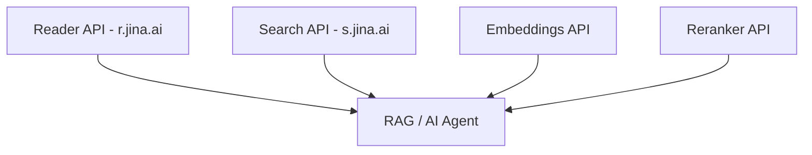
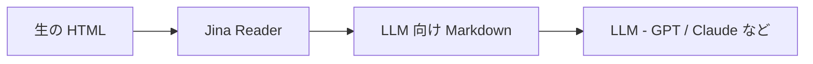
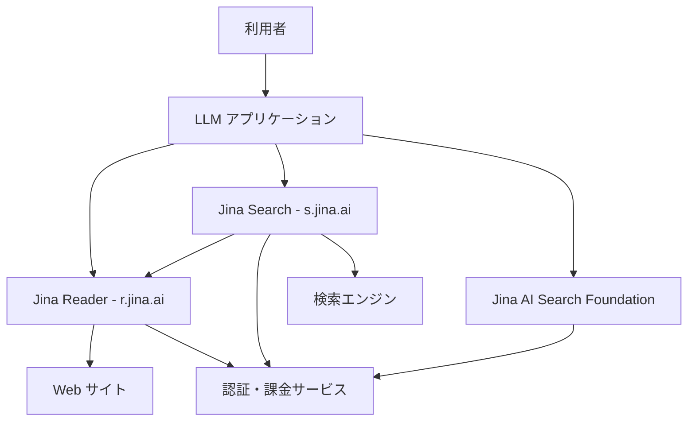
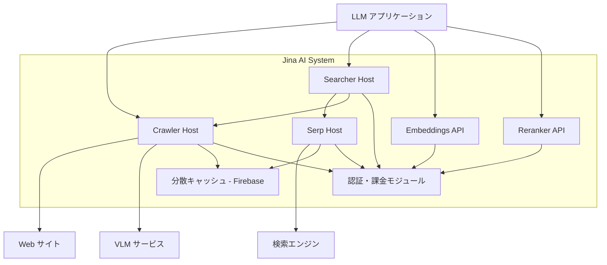
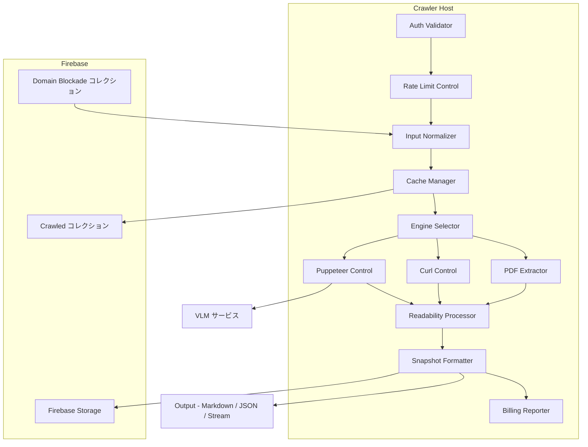
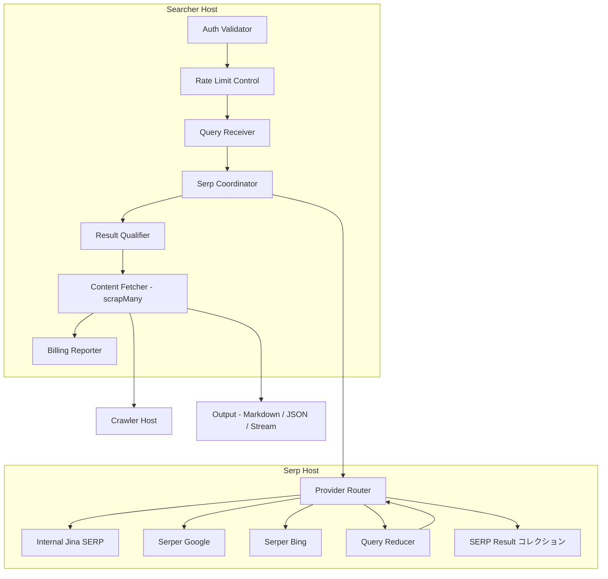
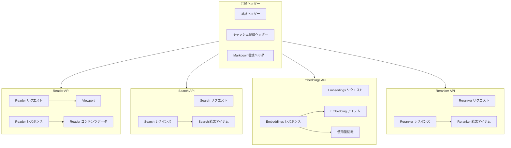
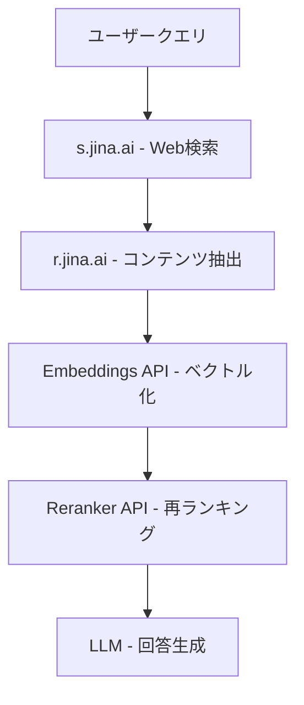

## 概要

Jina AI Search Foundation は、LLM アプリケーション向けの検索・コンテンツ処理基盤です。
Web コンテンツの取得・変換・意味検索・再ランキングを API として提供します。

中核となるのが **Jina Reader** です。2 つのエンドポイントで構成されます。

```
r.jina.ai  →  URL を指定し、LLM 向け Markdown に変換
s.jina.ai  →  クエリを指定し、Web 検索 + コンテンツ抽出を一括実行
```

RAG（Retrieval-Augmented Generation、検索拡張生成）パイプライン・AI エージェント・グラウンディング処理のコンポーネントとして機能します。

### Jina AI Search Foundation の全体像



| 要素名                 | 説明                                                |
| ---------------------- | --------------------------------------------------- |
| Reader API - r.jina.ai | URL から LLM 向けコンテンツを抽出                   |
| Search API - s.jina.ai | Web 検索と上位結果のコンテンツ抽出を統合            |
| Embeddings API         | テキスト・画像・コードをベクトルに変換              |
| Reranker API           | 検索結果をクエリとの関連度で並び替え                |
| RAG / AI Agent         | 各 API を組み合わせて利用する上位アプリケーション層 |

### Jina Reader の位置づけ



| 要素名            | 説明                                                     |
| ----------------- | -------------------------------------------------------- |
| 生の HTML         | JavaScript 動的レンダリング・ノイズを含む Web ページ     |
| Jina Reader       | ブラウザ自動化と ML モデルで構造化テキストに変換         |
| LLM 向け Markdown | 余分なタグ・広告・ナビを除去した読み取り可能なコンテンツ |
| LLM               | 変換済みコンテンツを入力として推論                       |

## 特徴

- URL の前に `r.jina.ai/` を付けるだけでコンテンツを取得可能（ゼロ設定）
- Markdown・HTML・テキスト・スクリーンショット・構造化 JSON の複数出力形式に対応
- VLM（Vision Language Model、視覚言語モデル）による画像の自動キャプション生成（`X-With-Generated-Alt` ヘッダで有効化）
- s.jina.ai が Web 検索と上位結果の本文抽出を 1 リクエストで実行（デフォルト 5 件、`num` パラメータで最大 20 件まで指定可能）
- CSS セレクタ指定・JavaScript 待機・レンダリングタイミング制御を提供
- Embeddings / Reranker API と組み合わせて完結した RAG パイプラインを構築可能
- EU データレジデンシー対応の EU Compliance 機能を提供
- 無料枠として 10M トークン / API キーを提供し、標準レート 500 RPM を保証
- Apache-2.0 ライセンスで商用利用可能

### 類似ツールとの比較

| 比較項目     | Jina Reader                                          | Firecrawl                                                  | Diffbot                                               |
| ------------ | ---------------------------------------------------- | ---------------------------------------------------------- | ----------------------------------------------------- |
| 実行方式     | ブラウザ自動化 + HTTP 直接取得の切り替え             | ブラウザ / HTTP の動的選択（FIRE-1 エージェント付き）      | 独自クローラー + 自動ページ分類                       |
| リソース消費 | RPM ベースのレート制限（20〜5,000 RPM）              | 同時ブラウザ数ベースの制限（2〜100 並列）                  | API コール数ベース（月額固定）                        |
| 対応機能     | URL 変換・Web 検索・画像キャプション生成・構造化抽出 | URL 変換・サイト全体クロール・サイトマップ対応・構造化抽出 | 自動エンティティ分類（記事・製品・人物等）・JSON 出力 |
| 起動速度     | 平均レイテンシ数秒（キャッシュ利用時は短縮）         | 動的 / 静的の自動判定でページ毎に最適化                    | API 応答依存（SLA 非公開）                            |
| ライセンス   | Apache-2.0（商用利用可）                             | AGPL-3.0（Cloud 版は独自ライセンス）                       | クローズドソース                                      |
| 無料枠       | 10M トークン / API キー                              | 500 クレジット                                             | なし（有料プランのみ）                                |

> **注**: 価格・ライセンス情報は 2026 年 4 月時点のものです。最新情報は各サービスの公式サイトを確認してください。

### ユースケース別推奨

| ユースケース                  | 推奨ツール     | 理由                                     |
| ----------------------------- | -------------- | ---------------------------------------- |
| RAG プロトタイピング          | Jina Reader    | セットアップ不要・無料枠が大きい         |
| サイト全体クロール            | Firecrawl      | 再帰クロール・サイトマップ対応が標準機能 |
| 構造化データ抽出              | Diffbot        | 自動エンティティ分類で JSON を即時取得   |
| Web 検索 + 本文取得の一括処理 | Jina s.jina.ai | 検索と抽出を 1 API コールで完結          |
| 多量ページの定常処理          | Firecrawl      | 大規模処理でのコスト効率が高い           |
| 画像を含む Web ページの処理   | Jina Reader    | VLM による自動画像キャプション生成       |

## 構造

### システムコンテキスト図



| 要素名                    | 説明                                                       |
| ------------------------- | ---------------------------------------------------------- |
| 利用者                    | API を利用する開発者またはエンドユーザー                   |
| LLM アプリケーション      | RAG・エージェントなど、Jina API を呼び出すアプリケーション |
| Jina Reader - r.jina.ai   | URL を LLM 向けコンテンツに変換する Reader API             |
| Jina Search - s.jina.ai   | Web 検索と全文取得を一体化した Search API                  |
| Jina AI Search Foundation | Embeddings・Reranker などの基盤 API 群                     |
| Web サイト                | Reader が取得対象とする任意の Web ページや PDF             |
| 検索エンジン              | Search API が利用する外部検索プロバイダー                  |
| 認証・課金サービス        | API キー検証・レート制限・トークン課金を提供               |

### コンテナ図



| 要素名                    | 説明                                                                             |
| ------------------------- | -------------------------------------------------------------------------------- |
| Crawler Host              | URL を受け取り、コンテンツ抽出・変換・キャッシュを担当                           |
| Serp Host                 | 検索クエリを受け取り、検索結果メタデータを取得・キャッシュ                       |
| Searcher Host             | Serp Host と Crawler Host を連携させ、検索と全文取得を統合するオーケストレーター |
| Embeddings API            | テキスト・画像・コードをベクトルに変換する基盤 API                               |
| Reranker API              | クエリに対するドキュメントの関連度を再ランキングする基盤 API                     |
| 分散キャッシュ - Firebase | クロール結果と検索結果を保持する分散ストレージ                                   |
| 認証・課金モジュール      | API キー検証・レート制限・トークン使用量計上                                     |
| VLM サービス              | 画像キャプション生成に使用するビジョン言語モデルサービス                         |

### コンポーネント図

#### Crawler Host の内部構成



| 要素名                       | 説明                                                                          |
| ---------------------------- | ----------------------------------------------------------------------------- |
| Input Normalizer             | URL を正規化し、robots.txt 遵守確認とドメインブロック確認を実施               |
| Engine Selector              | コンテンツ種別とリクエストパラメーターに基づき抽出エンジンを選択              |
| Puppeteer Control            | ヘッドレス Chrome で JavaScript 実行が必要なページをレンダリング              |
| Curl Control                 | node-libcurl を使用してスタティックページを高速取得                           |
| PDF Extractor                | pdfjs-dist を使用して PDF ドキュメントからコンテンツを抽出                    |
| Readability Processor        | Mozilla Readability でメインコンテンツを抽出                                  |
| Snapshot Formatter           | PageSnapshot を Markdown・HTML・JSON・ストリームに変換                        |
| Cache Manager                | URL パスの MD5 ダイジェストをフィールド検索してキャッシュ照会・書き込みを管理 |
| Rate Limit Control           | IP 別・UID 別のレート制限を LRU キャッシュで高速に適用                        |
| Auth Validator               | Bearer トークンを検証し、UID とトークン残高を解決                             |
| Billing Reporter             | トークン使用量を計算して課金 API に報告                                       |
| Crawled コレクション         | URL パスの MD5 ダイジェストを検索フィールドとするキャッシュメタデータストア   |
| Domain Blockade コレクション | 不正利用ドメインの 1 時間ブロック記録を保持するストア                         |
| Firebase Storage             | レンダリング済みページスナップショットとスクリーンショットを保持              |
| VLM サービス                 | Puppeteer が取得した画像のキャプション生成に使用するモデル                    |

#### Searcher Host の内部構成



| 要素名                      | 説明                                                                      |
| --------------------------- | ------------------------------------------------------------------------- |
| Query Receiver              | 検索クエリのリクエストを受け取り、パラメーターを検証                      |
| Auth Validator              | Bearer トークンを検証し、UID とトークン残高を解決                         |
| Rate Limit Control          | Search API 固有のレート制限を適用                                         |
| Serp Coordinator            | Serp Host への問い合わせとキャッシュ制御を調整                            |
| Provider Router             | 複数の検索プロバイダーを順次試行し、失敗時にフォールバック                |
| Internal Jina SERP          | Jina 内部の検索インデックスを使用するプロバイダー                         |
| Serper Google               | Serper.dev 経由で Google 検索結果を取得するプロバイダー                   |
| Serper Bing                 | Serper.dev 経由で Bing 検索結果を取得するプロバイダー                     |
| Query Reducer               | ゼロ結果時にクエリを段階的に短縮して再試行                                |
| SERP Result コレクション    | クエリの MD5 ダイジェストを検索フィールドとする検索結果のキャッシュストア |
| Result Qualifier            | 検索結果の品質確認と絞り込み                                              |
| Content Fetcher - scrapMany | 検索結果 URL に対して Crawler Host を並列呼び出し                         |
| Billing Reporter            | 結果件数とプロバイダー種別に基づくトークン課金を報告                      |

## データ

### 概念モデル



| 要素名                  | 説明                                        |
| ----------------------- | ------------------------------------------- |
| 共通ヘッダー            | 全 API で共有する HTTP ヘッダー群           |
| 認証ヘッダー            | Bearer トークンによる認証情報               |
| キャッシュ制御ヘッダー  | キャッシュのバイパスや許容設定              |
| Markdown書式ヘッダー    | Markdown 出力の書式を制御する設定           |
| Reader リクエスト       | r.jina.ai への入力パラメータ                |
| Reader レスポンス       | r.jina.ai からの出力データ                  |
| Reader コンテンツデータ | 抽出されたページのコンテンツ情報            |
| Viewport                | ブラウザ描画時の表示領域サイズ              |
| Search リクエスト       | s.jina.ai への検索クエリと条件              |
| Search レスポンス       | s.jina.ai からの検索結果                    |
| Search 結果アイテム     | 各検索結果ページのコンテンツ                |
| Embeddings リクエスト   | Embeddings API への入力テキストとモデル指定 |
| Embeddings レスポンス   | Embeddings API からのベクトル配列           |
| Embedding アイテム      | 個別入力に対するベクトル表現                |
| 使用量情報              | リクエスト消費トークン数                    |
| Reranker リクエスト     | Reranker API へのクエリと文書リスト         |
| Reranker レスポンス     | Reranker API からの再順位付け結果           |
| Reranker 結果アイテム   | 個別文書の関連スコアと元インデックス        |

### 情報モデル

```mermaid
classDiagram
    class AuthHeader {
        authorization: string
        accept: string
        contentType: string
    }

    class CacheHeader {
        xNoCache: string
        xCacheTolerance: string
        dnt: string
    }

    class MarkdownHeader {
        xMdHeadingStyle: string
        xMdHr: string
        xMdBulletListMarker: string
        xMdEmDelimiter: string
        xMdStrongDelimiter: string
        xMdLinkStyle: string
        xMdLinkReferenceStyle: string
    }

    class ReaderRequest {
        url: string
        html: string
        respondWith: string
        targetSelector: string
        waitForSelector: string
        removeSelector: string
        engine: string
        tokenBudget: integer
        timeout: integer
    }

    class ReaderViewport {
        width: integer
        height: integer
    }

    class ReaderResponse {
        code: integer
        status: integer
        data: ReaderContentData
    }

    class ReaderContentData {
        url: string
        title: string
        description: string
        content: string
        links: list
        images: list
    }

    class SearchRequest {
        q: string
        gl: string
        location: string
        hl: string
        num: integer
        page: integer
    }

    class SearchResponse {
        code: integer
        status: integer
        data: list
    }

    class SearchResultItem {
        title: string
        url: string
        content: string
        links: list
        images: list
        favicon: string
    }

    class EmbeddingsRequest {
        model: string
        input: list
        embeddingType: string
        task: string
        dimensions: integer
        normalized: boolean
        lateChunking: boolean
        truncate: boolean
        returnMultivector: boolean
    }

    class EmbeddingsResponse {
        model: string
    }

    class EmbeddingItem {
        embedding: list
        index: integer
    }

    class UsageInfo {
        prompt_tokens: integer
        total_tokens: integer
    }

    class RerankerRequest {
        model: string
        query: string
        documents: list
        top_n: integer
        return_documents: boolean
    }

    class RerankerResponse {
    }

    class RerankerResultItem {
        index: integer
        relevance_score: float
        document: map
    }

    AuthHeader "1" --> "1" ReaderRequest : 適用
    AuthHeader "1" --> "1" SearchRequest : 適用
    AuthHeader "1" --> "1" EmbeddingsRequest : 適用
    AuthHeader "1" --> "1" RerankerRequest : 適用

    CacheHeader "1" --> "1" ReaderRequest : 適用
    CacheHeader "1" --> "1" SearchRequest : 適用

    MarkdownHeader "1" --> "1" ReaderRequest : 適用
    MarkdownHeader "1" --> "1" SearchRequest : 適用

    ReaderRequest "1" --> "0..1" ReaderViewport : 含む
    ReaderResponse "1" --> "1" ReaderContentData : 含む

    SearchResponse "1" --> "many" SearchResultItem : 含む

    EmbeddingsResponse "1" --> "many" EmbeddingItem : 含む
    EmbeddingsResponse "1" --> "1" UsageInfo : 含む

    RerankerResponse "1" --> "many" RerankerResultItem : 含む
```



| 要素名             | 説明                                                                                                                                                                |
| ------------------ | ------------------------------------------------------------------------------------------------------------------------------------------------------------------- |
| AuthHeader         | Bearer トークン、Accept、Content-Type を保持する認証ヘッダー                                                                                                        |
| CacheHeader        | キャッシュバイパスフラグと許容期間を保持するヘッダー                                                                                                                |
| MarkdownHeader     | Markdown 出力の見出し・区切り・リスト・リンク書式を制御するヘッダー                                                                                                 |
| ReaderRequest      | 取得対象 URL、コンテンツ形式、CSS セレクター、エンジン設定等を含むリクエスト（主要フィールドのみ記載、[全パラメータは公式ドキュメント参照](https://docs.jina.ai/)） |
| ReaderViewport     | ブラウザ描画時の幅・高さ（ピクセル）                                                                                                                                |
| ReaderResponse     | HTTP ステータスコードとアプリケーションステータスを含む応答外枠                                                                                                     |
| ReaderContentData  | 最終 URL、タイトル、説明、本文、リンク一覧、画像一覧を含む抽出データ                                                                                                |
| SearchRequest      | 検索クエリ、国・言語コード、結果件数、ページオフセットを含むリクエスト                                                                                              |
| SearchResponse     | HTTP ステータスコードとアプリケーションステータスを含む応答外枠                                                                                                     |
| SearchResultItem   | 各検索結果のタイトル、URL、本文を含むアイテム（リンク、画像、ファビコンは任意）                                                                                     |
| EmbeddingsRequest  | モデル名、入力テキスト配列、ベクトル形式、タスク種別、次元数などを含むリクエスト                                                                                    |
| EmbeddingsResponse | 使用モデル名を保持する応答外枠                                                                                                                                      |
| EmbeddingItem      | 入力インデックスに対応するベクトル配列を含むアイテム                                                                                                                |
| UsageInfo          | リクエストで消費したプロンプトトークン数と合計トークン数                                                                                                            |
| RerankerRequest    | モデル名、クエリ、文書リスト、返却件数（top_n）、文書テキスト返却フラグ（return_documents）を含むリクエスト                                                         |
| RerankerResponse   | 再順位付け結果リストを保持する応答外枠                                                                                                                              |
| RerankerResultItem | 元インデックス、関連スコア（relevance_score）、文書オブジェクト（document）を含む結果アイテム                                                                       |

## 構築方法

### API キー取得

- [Jina AI 公式サイト](https://jina.ai/?sui=apikey) にアクセス
- メールアドレスでアカウントを作成
- API キーが発行される
- 新規キーには 1,000 万トークン分の無料枠が付与
- 同一 API キーが Reader、Search、Embeddings、Reranker の全 API で共有

### 環境変数設定

```bash
export JINA_API_KEY="your-api-key-here"
```

### SDK インストール - Python

専用 SDK は不要です。`requests` ライブラリで全 API を利用できます。

```bash
pip install requests
```

### SDK インストール - Node.js

専用 SDK は不要です。`node-fetch` または標準の `fetch` で全 API を利用できます。

```bash
npm install node-fetch
```

### curl（インストール不要）

追加インストールなしで即時利用できます。

### 動作確認

API キーの設定が正しいか確認するには以下のコマンドを実行します。

```bash
curl -s https://r.jina.ai/https://example.com \
  -H "Authorization: Bearer $JINA_API_KEY" \
  -H "Accept: application/json" |
python3 -c "import sys,json; d=json.load(sys.stdin); print('OK' if d['code']==200 else 'NG:', d.get('code'))"
```

## 利用方法

### Reader API - URL 読み取り

GET リクエストで URL の前に `https://r.jina.ai/` を付加するだけで利用できます。

```bash
# 最も簡単な使い方（認証なし、無料枠の範囲内）
curl https://r.jina.ai/https://example.com

# 認証あり（より高いレート制限）
curl https://r.jina.ai/https://example.com \
  -H "Authorization: Bearer $JINA_API_KEY"
```

POST リクエストも利用できます。

```bash
curl -X POST https://r.jina.ai/ \
  -H "Authorization: Bearer $JINA_API_KEY" \
  -H "Content-Type: application/json" \
  -H "Accept: application/json" \
  -d '{"url": "https://example.com"}'
```

### Reader API - HTML 直接入力

URL の代わりに HTML を直接入力するには `html` パラメータを使います。

```bash
curl -X POST https://r.jina.ai/ \
  -H "Authorization: Bearer $JINA_API_KEY" \
  -H "Content-Type: application/json" \
  -d '{"html": "<html><body><p>サンプルテキスト</p></body></html>"}'
```

### Reader API - 出力形式指定

`X-Respond-With` ヘッダで出力形式を切り替えます（`X-Return-Format` も互換性のため使用可能）。デフォルトは `content` です。

| 値            | 説明                                               |
| ------------- | -------------------------------------------------- |
| `content`     | Readability ベースの構造化コンテンツ（デフォルト） |
| `markdown`    | Markdown 形式                                      |
| `html`        | HTML 形式                                          |
| `text`        | プレーンテキスト                                   |
| `screenshot`  | ページのスクリーンショット                         |
| `pageshot`    | ページ全体のスクリーンショット                     |
| `readerlm-v2` | ReaderLM-v2 モデルによる高品質抽出（3 倍コスト）   |
| `vlm`         | VLM による画像キャプション付き抽出                 |

```bash
# テキスト形式で出力
curl https://r.jina.ai/https://example.com \
  -H "Authorization: Bearer $JINA_API_KEY" \
  -H "X-Respond-With: text"
```

JSON モードで受け取るには `Accept: application/json` を指定します。

```bash
curl https://r.jina.ai/https://example.com \
  -H "Authorization: Bearer $JINA_API_KEY" \
  -H "Accept: application/json"
```

レスポンス形式:

```json
{"code": 200, "status": 20000, "data": "抽出コンテンツ", "meta": null}
```

### Reader API - CSS セレクタ指定

対象要素の絞り込みや除外に CSS セレクタを使います。

| ヘッダ名              | 説明                             |
| --------------------- | -------------------------------- |
| `X-Target-Selector`   | 抽出対象を特定要素に絞り込み     |
| `X-Remove-Selector`   | ヘッダ・フッタなど不要要素を除外 |
| `X-Wait-For-Selector` | 指定要素が現れるまで待機         |

```bash
curl -X POST https://r.jina.ai/ \
  -H "Authorization: Bearer $JINA_API_KEY" \
  -H "Content-Type: application/json" \
  -d '{
    "url": "https://example.com",
    "targetSelector": "article, .main-content",
    "removeSelector": "header, footer, nav"
  }'
```

### Reader API - Python サンプル

```python
import requests
import os

headers = {
    "Authorization": f"Bearer {os.getenv('JINA_API_KEY')}",
    "Accept": "application/json"
}

response = requests.post(
    "https://r.jina.ai/",
    headers=headers,
    json={"url": "https://example.com"}
)

content = response.json()["data"]
```

### Reader API - Node.js サンプル

```javascript
const JINA_API_KEY = process.env.JINA_API_KEY;

const res = await fetch("https://r.jina.ai/", {
  method: "POST",
  headers: {
    "Authorization": `Bearer ${JINA_API_KEY}`,
    "Content-Type": "application/json",
    "Accept": "application/json"
  },
  body: JSON.stringify({ url: "https://example.com" })
});

const { data } = await res.json();
console.log(data);
```

### Search API - 検索クエリ

検索クエリを POST で送信します。内部で上位結果の URL を取得し、各ページの本文まで自動取得します。

```bash
curl -X POST https://s.jina.ai/ \
  -H "Authorization: Bearer $JINA_API_KEY" \
  -H "Content-Type: application/json" \
  -H "Accept: application/json" \
  -d '{"q": "Jina AI embeddings"}'
```

GET リクエストも利用できます。

```bash
curl "https://s.jina.ai/Jina+AI+embeddings" \
  -H "Authorization: Bearer $JINA_API_KEY"
```

### Search API - 地域・言語指定

| パラメータ | 説明             | 例             |
| ---------- | ---------------- | -------------- |
| `gl`       | 国コード         | `jp`、`us`     |
| `location` | 都市レベルの地域 | `Tokyo, Japan` |
| `hl`       | 言語コード       | `ja`、`en`     |
| `num`      | 最大取得件数     | `5`            |

```bash
curl -X POST https://s.jina.ai/ \
  -H "Authorization: Bearer $JINA_API_KEY" \
  -H "Content-Type: application/json" \
  -d '{"q": "AI news", "gl": "jp", "hl": "ja", "num": 5}'
```

### Search API - JSON モード

`Accept: application/json` を指定すると、各結果が `title`、`content`、`url` のオブジェクトで返されます。

```bash
curl -X POST https://s.jina.ai/ \
  -H "Authorization: Bearer $JINA_API_KEY" \
  -H "Content-Type: application/json" \
  -H "Accept: application/json" \
  -d '{"q": "machine learning"}'
```

### Search API - サイト内検索

`site` クエリパラメータでドメインを指定します。

```bash
curl "https://s.jina.ai/embeddings+tutorial?site=docs.jina.ai" \
  -H "Authorization: Bearer $JINA_API_KEY"
```

複数ドメインの指定も可能です。

```bash
curl "https://s.jina.ai/embeddings+tutorial?site=jina.ai&site=github.com" \
  -H "Authorization: Bearer $JINA_API_KEY"
```

### Search API - Python サンプル

```python
import requests
import os

headers = {
    "Authorization": f"Bearer {os.getenv('JINA_API_KEY')}",
    "Accept": "application/json"
}

response = requests.post(
    "https://s.jina.ai/",
    headers=headers,
    json={"q": "Jina AI", "gl": "jp", "hl": "ja"}
)

results = response.json()
```

### Embeddings API - テキスト埋め込み

```bash
curl https://api.jina.ai/v1/embeddings \
  -H "Authorization: Bearer $JINA_API_KEY" \
  -H "Content-Type: application/json" \
  -d '{
    "model": "jina-embeddings-v3",
    "input": ["テキスト1", "テキスト2"]
  }'
```

### Embeddings API - コード埋め込み

コード埋め込み専用モデルを使います。

| モデル名                    | 説明                                              |
| --------------------------- | ------------------------------------------------- |
| `jina-code-embeddings-0.5b` | 軽量コード埋め込みモデル                          |
| `jina-code-embeddings-1.5b` | 高精度コード埋め込みモデル - Qwen2.5-Coder ベース |

```bash
curl https://api.jina.ai/v1/embeddings \
  -H "Authorization: Bearer $JINA_API_KEY" \
  -H "Content-Type: application/json" \
  -d '{
    "model": "jina-code-embeddings-1.5b",
    "input": ["def hello(): return \"Hello World\""],
    "task": "code2nl"
  }'
```

### Embeddings API - タスク指定

`task` パラメータでタスク固有の最適化を適用します。

| タスク値            | 用途                             |
| ------------------- | -------------------------------- |
| `retrieval.query`   | 検索クエリ側の埋め込み           |
| `retrieval.passage` | 検索対象ドキュメント側の埋め込み |
| `text-matching`     | テキスト類似度計算               |
| `classification`    | テキスト分類                     |
| `clustering`        | テキストクラスタリング           |

```bash
curl https://api.jina.ai/v1/embeddings \
  -H "Authorization: Bearer $JINA_API_KEY" \
  -H "Content-Type: application/json" \
  -d '{
    "model": "jina-embeddings-v3",
    "task": "retrieval.query",
    "input": ["検索クエリ文"]
  }'
```

### Embeddings API - 次元指定

`dimensions` パラメータで出力ベクトルの次元数を削減します。

| モデル                        | パラメータ数 | 最大次元 | 最小次元 | 特徴                       |
| ----------------------------- | ------------ | -------- | -------- | -------------------------- |
| jina-embeddings-v5-text-small | 677M         | 1024     | 32       | 最新テキスト埋め込みモデル |
| jina-embeddings-v5-text-nano  | 239M         | 512      | 32       | 軽量・高速版               |
| jina-embeddings-v4            | -            | 2048     | 128      | マルチベクトル対応         |
| jina-embeddings-v3            | -            | 1024     | 32       | 安定版・幅広いタスク対応   |

```bash
curl https://api.jina.ai/v1/embeddings \
  -H "Authorization: Bearer $JINA_API_KEY" \
  -H "Content-Type: application/json" \
  -d '{
    "model": "jina-embeddings-v3",
    "input": ["サンプルテキスト"],
    "dimensions": 256
  }'
```

### Embeddings API - レスポンス解析

```json
{
  "data": [
    {
      "index": 0,
      "embedding": [0.123, -0.456],
      "object": "embedding"
    }
  ],
  "model": "jina-embeddings-v3",
  "usage": {"prompt_tokens": 10, "total_tokens": 10}
}
```

`data[i].embedding` に埋め込みベクトルが格納されます。

### Embeddings API - Python サンプル

```python
import requests
import os

headers = {
    "Authorization": f"Bearer {os.getenv('JINA_API_KEY')}",
    "Content-Type": "application/json"
}

response = requests.post(
    "https://api.jina.ai/v1/embeddings",
    headers=headers,
    json={
        "model": "jina-embeddings-v3",
        "task": "retrieval.passage",
        "input": ["埋め込むテキスト"]
    }
)

vector = response.json()["data"][0]["embedding"]
```

### Reranker API - リランキング実行

```bash
curl https://api.jina.ai/v1/rerank \
  -H "Authorization: Bearer $JINA_API_KEY" \
  -H "Content-Type: application/json" \
  -d '{
    "model": "jina-reranker-v3",
    "query": "organic skincare",
    "documents": [
      "Aloe vera is a natural ingredient.",
      "Machine oil for engines.",
      "Rose hip oil for sensitive skin."
    ],
    "top_n": 2,
    "return_documents": true
  }'
```

### Reranker API - モデル一覧

| モデル名                             | 特徴                                  |
| ------------------------------------ | ------------------------------------- |
| `jina-reranker-v3`                   | 0.6B パラメータ、多言語対応           |
| `jina-reranker-m0`                   | マルチモーダル多言語対応              |
| `jina-reranker-v2-base-multilingual` | 100 言語以上対応                      |
| `jina-colbert-v2`                    | 遅延インタラクション方式、89 言語対応 |

### Reranker API - リクエストパラメータ

| パラメータ         | 必須 | 説明                                   |
| ------------------ | ---- | -------------------------------------- |
| `model`            | 必須 | 使用するモデル名                       |
| `query`            | 必須 | 検索クエリ                             |
| `documents`        | 必須 | リランキング対象のドキュメント配列     |
| `top_n`            | 任意 | 返す上位件数                           |
| `return_documents` | 任意 | レスポンスにドキュメント本文を含めるか |

### Reranker API - レスポンス解析

```json
{
  "results": [
    {
      "index": 2,
      "relevance_score": 0.92,
      "document": {"text": "Rose hip oil for sensitive skin."}
    },
    {
      "index": 0,
      "relevance_score": 0.43,
      "document": {"text": "Aloe vera is a natural ingredient."}
    }
  ]
}
```

`results[i].relevance_score` に関連性スコア（0〜1）が格納されます。`results[i].index` は元の `documents` 配列のインデックスです。

### Reranker API - Python サンプル

```python
import requests
import os

headers = {
    "Authorization": f"Bearer {os.getenv('JINA_API_KEY')}",
    "Content-Type": "application/json"
}

response = requests.post(
    "https://api.jina.ai/v1/rerank",
    headers=headers,
    json={
        "model": "jina-reranker-v3",
        "query": "検索クエリ",
        "documents": ["ドキュメント1", "ドキュメント2", "ドキュメント3"],
        "top_n": 2,
        "return_documents": True
    }
)

results = response.json()["results"]
for r in results:
    print(r["relevance_score"], r["document"]["text"])
```

### 共通ヘッダ一覧

| ヘッダ名                              | 説明                           |
| ------------------------------------- | ------------------------------ |
| `Authorization: Bearer $JINA_API_KEY` | 認証トークン（全 API で必須）  |
| `Content-Type: application/json`      | リクエストボディの JSON を示す |
| `Accept: application/json`            | JSON レスポンスを要求          |
| `Accept: text/event-stream`           | ストリーミングレスポンスを要求 |

## 運用

### レート制限管理

| プラン               | RPM   | TPM  | 同時リクエスト |
| -------------------- | ----- | ---- | -------------- |
| 無料（API キーなし） | 20    | -    | -              |
| 無料（API キーあり） | 500   | 100K | 2              |
| 有料                 | 500   | 2M   | 50             |
| プレミアム           | 5,000 | 50M  | 500            |

- RPM と TPM のどちらか先に到達した時点でレート制限が発動
- API キー指定時は IP ではなくキー単位で追跡
- レート制限超過時はリトライ処理を実装

```python
import time
import requests

def fetch_with_retry(url, headers, max_retries=3, backoff=2):
    for attempt in range(max_retries):
        resp = requests.get(f"https://r.jina.ai/{url}", headers=headers)
        if resp.status_code == 429:
            time.sleep(backoff ** attempt)
            continue
        return resp
    raise Exception("Rate limit exceeded after retries")
```

### キャッシュ戦略

- 同一 URL への 5 分以内の再リクエストはキャッシュから返却
- `X-No-Cache: true` ヘッダーでキャッシュをバイパス
- `X-Cache-Tolerance` ヘッダーで許容キャッシュ時間（秒）を指定

```bash
# キャッシュをバイパス
curl https://r.jina.ai/https://example.com \
  -H "Authorization: Bearer $JINA_API_KEY" \
  -H "X-No-Cache: true"

# キャッシュ許容時間を600秒に設定
curl https://r.jina.ai/https://example.com \
  -H "Authorization: Bearer $JINA_API_KEY" \
  -H "X-Cache-Tolerance: 600"
```

### トークンバジェット管理

- `X-Token-Budget` ヘッダーでリクエストあたりの最大トークン数を制限
- 予算超過時はリクエストが失敗
- ReaderLM-v2 エンジンは通常の 3 倍のトークンを消費

```bash
# トークンバジェットを5000に制限
curl https://r.jina.ai/https://example.com \
  -H "Authorization: Bearer $JINA_API_KEY" \
  -H "X-Token-Budget: 5000"
```

### API 使用量モニタリング

- API ダッシュボード（`https://jina.ai/api-dashboard/`）でトークン残高と使用履歴を確認
- API キーを入力すると「API Key & Billing」タブで残高が表示
- トークン残高が閾値を下回ると自動チャージが実行

### EU リージョン対応

EU データ居住要件には専用エンドポイントを使用します。インフラとデータ処理はすべて EU 管轄内で完結します。

| エンドポイント | EU リージョン  |
| -------------- | -------------- |
| `r.jina.ai`    | `eu.r.jina.ai` |
| `s.jina.ai`    | `eu.s.jina.ai` |

```bash
curl https://eu.r.jina.ai/https://example.com \
  -H "Authorization: Bearer $JINA_API_KEY"
```

## ベストプラクティス

### LLM/RAG システムとの統合パターン

RAG パイプラインにおける各 API の役割を以下に示します。



| 要素名                      | 説明                                       |
| --------------------------- | ------------------------------------------ |
| ユーザークエリ              | 検索の起点となる入力テキスト               |
| s.jina.ai - Web検索         | クエリに基づき上位の URL と本文を取得      |
| r.jina.ai - コンテンツ抽出  | 各 URL から LLM 向け Markdown を生成       |
| Embeddings API - ベクトル化 | テキストチャンクを数値ベクトルに変換       |
| Reranker API - 再ランキング | 意味的関連性でチャンクを並び替え           |
| LLM - 回答生成              | 再ランキング済みコンテキストから回答を生成 |

```python
import requests

JINA_API_KEY = "your_key"
headers = {"Authorization": f"Bearer {JINA_API_KEY}"}

# Step 1: Web検索で上位URLと本文取得
search_resp = requests.post(
    "https://s.jina.ai/",
    headers={**headers, "Accept": "application/json"},
    json={"q": "your query"}
)
results = search_resp.json()["data"]

# Step 2: Rerankerで関連度順に並び替え
rerank_resp = requests.post(
    "https://api.jina.ai/v1/rerank",
    headers={**headers, "Content-Type": "application/json"},
    json={
        "model": "jina-reranker-v3",
        "query": "your query",
        "documents": [r["content"] for r in results],
        "top_n": 3
    }
)
ranked = rerank_resp.json()["results"]
context = "\n\n".join(r["document"]["text"] for r in ranked)

# Step 3: LLM に投入（Claude 例）
import anthropic
answer = anthropic.Anthropic().messages.create(
    model="claude-sonnet-4-6",
    max_tokens=1024,
    system="以下のコンテキストを参照して回答してください:\n\n" + context,
    messages=[{"role": "user", "content": "your query"}]
)
print(answer.content[0].text)
```

### Embeddings + ベクトル DB パターン

Embeddings API でドキュメントをベクトル化し、ベクトル DB に格納するパターンです。

```python
import requests
import os

headers = {
    "Authorization": f"Bearer {os.getenv('JINA_API_KEY')}",
    "Content-Type": "application/json"
}

# ドキュメントをベクトル化
docs = ["ドキュメント1の内容", "ドキュメント2の内容", "ドキュメント3の内容"]
resp = requests.post(
    "https://api.jina.ai/v1/embeddings",
    headers=headers,
    json={
        "model": "jina-embeddings-v3",
        "task": "retrieval.passage",
        "input": docs
    }
)
vectors = [item["embedding"] for item in resp.json()["data"]]

# 検索クエリをベクトル化
query_resp = requests.post(
    "https://api.jina.ai/v1/embeddings",
    headers=headers,
    json={
        "model": "jina-embeddings-v3",
        "task": "retrieval.query",
        "input": ["検索クエリ"]
    }
)
query_vector = query_resp.json()["data"][0]["embedding"]

# Chroma / Qdrant / pgvector 等に格納・検索
```

### MCP サーバー連携

Jina AI 公式 MCP サーバー（`mcp.jina.ai`）は Reader、Embeddings、Reranker API へのアクセスを提供します。

**Claude Code / Claude Desktop 設定例:**

```json
{
  "mcpServers": {
    "jina": {
      "url": "https://mcp.jina.ai/v1",
      "headers": {
        "Authorization": "Bearer ${JINA_API_KEY}"
      }
    }
  }
}
```

ツール数が多いため、`include_tags` クエリパラメータで必要なツールのみを登録します。

```
https://mcp.jina.ai/v1?include_tags=search,read
```

| MCP ツール            | 機能                            |
| --------------------- | ------------------------------- |
| `read_url`            | URL から Markdown を取得        |
| `parallel_read_url`   | 複数 URL を並列取得             |
| `search_web`          | Web 検索とコンテンツ取得        |
| `search_arxiv`        | arXiv 論文検索                  |
| `sort_by_relevance`   | Reranker API による関連度ソート |
| `deduplicate_strings` | Embeddings API による重複排除   |

### エージェントでの活用パターン

- Claude Sonnet 系モデルは並列ツール呼び出しを優先するため、Jina MCP との親和性が高い
- 小規模 OSS モデル（Qwen、Llama）はツール実行をハルシネーションする傾向あり

```python
# エージェントループの基本パターン
# 1. 計画フェーズ: LLMがアプローチを決定
# 2. 実行フェーズ: Jina ツールをループ呼び出し
# 3. 評価フェーズ: 目標達成まで繰り返す

# 実用例: 競合調査
# search_web → parallel_read_url → sort_by_relevance → 報告書生成
```

### コスト最適化

| 手法                              | 効果                                             |
| --------------------------------- | ------------------------------------------------ |
| `engine: direct` を優先           | ブラウザ不要ページで処理速度向上・コスト削減     |
| `retainImages: none` を指定       | 画像不要時にトークン使用量を削減                 |
| `engine: browser` を限定利用      | JavaScript 必須ページのみに限定                  |
| ReaderLM-v2 を選択的に使用        | 複雑な HTML 構造のページのみに適用（3 倍コスト） |
| `X-Token-Budget` を設定           | リクエストあたりの最大トークンを上限設定         |
| キャッシュを活用                  | 同一 URL の再リクエストでトークンを消費しない    |
| `removeSelector` で不要要素を除去 | ナビゲーション・フッター等を事前に除外           |

```bash
# コスト最適化例: 画像なし・直接エンジン・トークン制限
curl https://r.jina.ai/https://example.com \
  -H "Authorization: Bearer $JINA_API_KEY" \
  -H "X-Retain-Images: none" \
  -H "X-Engine: direct" \
  -H "X-Token-Budget: 3000"
```

### セキュリティ

- API キーは環境変数で管理し、コードに直書きしない
- 侵害された API キーはダッシュボードから即座に失効
- Jina AI は SOC 2 Type I・Type II に準拠
- API リクエストの入出力はモデル学習に使用されない
- `X-Robots-Txt` ヘッダーで robots.txt ルールに準拠

```bash
curl https://r.jina.ai/https://example.com \
  -H "Authorization: Bearer $JINA_API_KEY" \
  -H "X-Robots-Txt: Googlebot"
```

## トラブルシューティング

### 症状・原因・対処一覧

| 症状                                                     | 原因                                    | 対処                                                                          |
| -------------------------------------------------------- | --------------------------------------- | ----------------------------------------------------------------------------- |
| SPA（Single Page Application）のコンテンツが取得できない | JS 実行前のプリロードを取得             | `waitForSelector` でセレクタ表示を待機、または `timeout` を明示指定           |
| ハッシュルーティング SPA で失敗                          | GET メソッドで URL が正しく解釈されない | POST メソッドでリクエストボディに `url` を指定                                |
| レート制限超過（429）                                    | RPM または TPM 上限に到達               | Exponential Backoff（指数バックオフ）でリトライ、またはプレミアムプランへ移行 |
| プロキシエラー・タイムアウト                             | プロキシサーバーの不安定性              | 別のプロキシ URL を試す、`x-proxy-url` を省略して直接接続を確認               |
| robots.txt によるブロック                                | サイトが Jina のクローラーをブロック    | `X-Robots-Txt` で User-Agent を変更                                           |
| タイムアウト（複雑・動的ページ）                         | ページ読み込みに時間がかかる            | `X-Timeout` を最大 180 秒まで延長                                             |
| コンテンツ抽出品質が低い                                 | シンプルなエンジンでは構造が複雑すぎる  | `engine: browser` または `respondWith: readerlm-v2` に変更                    |
| 必要な要素が含まれない                                   | デフォルト抽出範囲が不十分              | `targetSelector` で対象 CSS セレクタを指定                                    |
| 不要な要素が含まれる                                     | ナビゲーション等が混入                  | `removeSelector` で除外セレクタを指定                                         |
| コンテンツが途中で切れる                                 | クライアント側の 25k トークン上限       | `X-Token-Budget` 設定を見直す                                                 |
| MCP ツールがループする                                   | LLM のコンテキストウィンドウ不足        | モデルの最大コンテキスト長を確認・拡大                                        |

### エラーコード対応表

| HTTP status | 意味             | 対処                                     |
| ----------- | ---------------- | ---------------------------------------- |
| 401         | API キー無効     | ダッシュボードでキーを再発行             |
| 402         | トークン残高不足 | 課金ページで残高を追加                   |
| 422         | パラメータ不正   | リクエストボディのフィールド名・型を確認 |
| 429         | RPM / TPM 超過   | Exponential Backoff でリトライ           |
| 503         | サービス一時停止 | 数分後にリトライ                         |

### Shadow DOM 対応

Web Components（Shadow DOM）を使用するページでは `withShadowDom` を有効にします。

```bash
curl -X POST https://r.jina.ai/ \
  -H "Authorization: Bearer $JINA_API_KEY" \
  -H "Content-Type: application/json" \
  -d '{"url": "https://example.com", "withShadowDom": "true"}'
```

### PDF 抽出の注意点

- パスワード保護された PDF は抽出不可
- スキャン PDF（画像のみ）は OCR 未対応のため本文を取得不可
- 大容量 PDF はタイムアウトする場合あり。`timeout` を 120 秒以上に延長

```bash
curl -X POST https://r.jina.ai/ \
  -H "Authorization: Bearer $JINA_API_KEY" \
  -H "Content-Type: application/json" \
  -d '{"url": "https://example.com/document.pdf", "timeout": 120}'
```

### SPA コンテンツ取得の詳細手順

```bash
# waitForSelector を使用してJS描画完了を待機
curl -X POST https://r.jina.ai/ \
  -H "Authorization: Bearer $JINA_API_KEY" \
  -H "Content-Type: application/json" \
  -d '{
    "url": "https://spa-example.com",
    "waitForSelector": "#main-content",
    "timeout": 30
  }'

# ハッシュルーティングSPAはPOSTで指定
curl -X POST https://r.jina.ai/ \
  -H "Authorization: Bearer $JINA_API_KEY" \
  -H "Content-Type: application/json" \
  -d '{
    "url": "https://example.com/#/page/detail"
  }'
```

### レート制限超過の詳細手順

レート制限管理セクションのリトライ処理を参照してください。ポイントは以下のとおりです。

- `2 ** attempt` で指数的に待機時間を増加
- 最大リトライ回数を設定し、無限ループを防止
- 429 以外のエラーは即座にレスポンスを返却

## 調査所感

調査を通じて感じた Jina Reader の強みと注意点を整理します。

### 強み

- **ゼロ設定で即利用可能**: `curl https://r.jina.ai/URL` だけで動作する手軽さは、プロトタイピング段階で大きなアドバンテージです。SDK のインストールや認証設定なしに試せるため、技術選定時の検証コストが低いです
- **Search API の一括処理が秀逸**: 他のスクレイピングサービスでは「検索 → URL 取得 → 個別フェッチ」を自前で実装する必要がありますが、s.jina.ai はこれを 1 リクエストで完結します。エージェント開発でのツール数削減に直結します
- **MCP 連携がネイティブ**: 公式 MCP サーバーが用意されており、Claude Code や Claude Desktop から直接利用できる点は、2026 年の LLM エコシステムとの親和性が高いです

### 注意点

- **内部実装の変動リスク**: 検索プロバイダー（Serper Google/Bing）や VLM サービスの利用は内部実装の詳細であり、予告なく変更される可能性があります。本記事のコンポーネント図はあくまで調査時点のスナップショットとして参照してください
- **大規模運用時のコスト見積もり**: 無料枠 10M トークンは個人開発やプロトタイプには十分ですが、プロダクション運用ではトークン消費量の見積もりが重要です。特に ReaderLM-v2 エンジンの 3 倍コストと、Search API が内部で Reader API を呼び出す点を考慮する必要があります
- **キャッシュ戦略の理解が必須**: デフォルトの 5 分キャッシュはコスト削減に有効ですが、リアルタイム性が求められるユースケースでは `X-No-Cache` ヘッダーの利用とそれに伴うトークン消費増を計画に組み込む必要があります

## まとめ

Jina Reader は、URL を LLM 向け Markdown に変換する Reader API と、Web 検索とコンテンツ抽出を一括実行する Search API を中心に、Embeddings・Reranker API を組み合わせて完結した RAG パイプラインを構築できる基盤です。ゼロ設定で利用開始でき、無料枠 10M トークン、Apache-2.0 ライセンス、MCP サーバー連携など、LLM アプリケーション開発のコンテンツ取得レイヤーとして実用的な選択肢です。

この記事が少しでも参考になった、あるいは改善点などがあれば、ぜひリアクションやコメント、SNSでのシェアをいただけると励みになります！

## 参考リンク

- 公式ドキュメント
  - [Jina Reader 公式](https://jina.ai/reader/)
  - [Jina AI 公式ドキュメント](https://docs.jina.ai/)
  - [Jina AI Embeddings 公式ページ](https://jina.ai/embeddings/)
  - [Jina AI Reranker 公式ページ](https://jina.ai/reranker/)
- GitHub
  - [jina-ai/reader](https://github.com/jina-ai/reader)
  - [jina-ai/MCP: Official Jina AI Remote MCP Server](https://github.com/jina-ai/MCP)
  - [How to get the Available tokens through Reader API](https://github.com/jina-ai/reader/issues/64)
  - [Inconsistent results with proxy](https://github.com/jina-ai/reader/issues/1104)
  - [Respect robots.txt and identify your system](https://github.com/jina-ai/reader/issues/4)
- 記事
  - [jina-ai/reader Architecture Overview - DeepWiki](https://deepwiki.com/jina-ai/reader)
  - [Reader API Pipeline - DeepWiki](https://deepwiki.com/jina-ai/reader/3-reader-api)
  - [Search API Pipeline - DeepWiki](https://deepwiki.com/jina-ai/reader/4-search-api)
  - [Jina AI vs. Firecrawl for web-LLM extraction](https://blog.apify.com/jina-ai-vs-firecrawl/)
  - [Agentic Workflow with Jina Remote MCP Server](https://jina.ai/news/agentic-workflow-with-jina-remote-mcp-server/)
  - [How Jina AI built its 100-billion-token web grounding system with Cloud Run GPUs](https://cloud.google.com/blog/products/application-development/how-jina-ai-built-its-100-billion-token-web-grounding-system-with-cloud-run-gpus)
  - [Jina API Key - GitGuardian documentation](https://docs.gitguardian.com/secrets-detection/secrets-detection-engine/detectors/specifics/jina_api_key)
