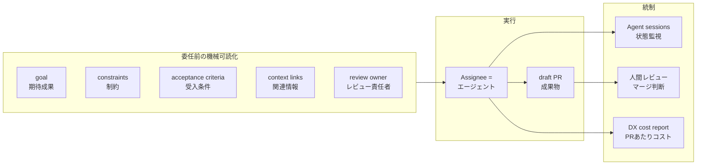

2026年7月15日、Atlassian は Jira を「人間の進捗記録ツール」から「複数 AI エージェントへの委任と統制の基盤」へ転換する 9 機能を発表しました (日本語版ブログは 7月22日公開)。

発表の中核メッセージは次の一文です。

> ギャップの原因はモデルのコード生成能力ではない。ソフトウェア開発はコードを書くことだけでは成立しないからだ。

背景には、開発者生産性の計測プラットフォーム DX (Atlassian が 2025 年に買収) との共同調査があります。「AI 利用は 65% 増えたが、開発速度の向上は最大 15%、多くの組織で平均 10% にとどまる」(DX AI Impact Report Q1 2026)。

この記事では「台帳化」を、委任前の要件・実行の記録・承認の記録・コストを 1 つのチケットに接続する構造転換と捉えます。発表された 9 機能の構造と提供状態を整理し、競合との設計差分、導入評価の判断条件までを解説します。

## 発表の全体像

### 9 機能の 5 区分

9 機能は「計画 → 実行 → 監視 → 統制 → 計測」の 5 区分に整理できます。

| 区分 | 機能 | 内容 | 提供状態 (2026-07-23 時点) |
|---|---|---|---|
| 計画 | Jira Planner | コードベース・Jira/Confluence 履歴・チームコンテキストから構造化された技術 spec を Confluence に生成 | early access (waitlist) |
| 計画 | Jira for Slack | Slack 会話をコンテキスト付き work item に変換 (Teams 対応は coming soon) | 提供中 |
| 計画 | Loom video prompts | 画面録画 + 音声指示をエージェント実行可能な work item に変換 | 提供中 |
| 実行 | Agents in Jira | Claude Code / Cursor / GitHub Copilot に work item を直接割り当て (Codex は coming soon) | 提供中 (GA) |
| 実行 | Jira Coding Agent | 全有償 Jira プラン標準搭載のネイティブエージェント。サンドボックスで実行し PR を返す | 提供中 |
| 監視 | Agent sessions in Jira | エージェント活動を Needs input / Working / Finished の状態別に一元監視 | 提供中 |
| 統制 | Coding agent automations | バグ修正・脆弱性修復・テスト生成・ドキュメント更新をルールでエージェントに振り分け | 提供中 |
| 統制 | Agentic engineering project template | エージェント前提プロジェクトの事前構成テンプレート | 提供中 |
| 計測 | DX AI cost management | Claude / Cursor / GitHub Copilot / Jira 横断の AI 支出・トークン追跡 | DX 顧客向け |

### 提供状態の内訳に注意

発表の中心として報道された Jira Planner (要件定義の自動生成) は、early access の waitlist 段階にとどまります。試すには申請と承認待ちが必要です。

日本語報道 5 媒体 (Publickey / EnterpriseZine / IT Leaders / ZDNET Japan / ProductZine) はいずれも公式ブログの要約です。waitlist 段階である事実を明記した日本語記事は、調査時点 (2026-07-23) で見当たりませんでした。「発表された構想」と「出荷済みの機能」を区別して読む必要があります。

## 委任の仕組み

### 入口は「同僚と同じ」5 経路

エージェントへの割り当ては「同僚に割り当てるのと同じように」(公式表現) 設計されています。経路は 5 つです。

1. Assignee フィールドから選択
2. コメントでの @メンション
3. ワークフロー遷移の自動化ルール
4. ボードカラムへの投入 (team-managed プロジェクトのみ)
5. その場でエージェント作成

エージェントは work item の summary / description / comments / attachments を読み取ります。

### 第三者エージェントの接続構造

第三者エージェントは Atlassian Marketplace アプリとして導入します。Claude Agent for Jira は Anthropic の隔離サンドボックス上で実行され、セットアップには Anthropic API キーの接続と GitHub サービスアカウントのリンクが必要です。モデル推論コストは接続した Anthropic アカウント側の従量になる構造ですが、課金主体の公式明記はありません。

別系統として「Open in coding tool」(ローカルツールへのディープリンク) があります。デスクトップは Codex / Cursor / GitHub Copilot / VS Code、CLI は Claude Code / Rovo CLI に対応します。「Codex は coming soon」はクラウド委任側の話で、ローカル起動側は対応済みです。

### spec-driven development の組み込み

Jira Planner は次の問題意識に基づきます。

> Intent has to be structured before work starts. An agent needs more than a prompt or a Jira summary.

リポジトリと Teamwork Graph に接続し、「人間には読みやすく、エージェントにも有用」な構造化 spec を Confluence に生成します。ただし受入条件 (acceptance criteria) の生成有無や spec テンプレートの構造は、公式ページでは確認できませんでした (early access 段階)。

### コンテキスト基盤の Teamwork Graph

全機能の共通基盤として Teamwork Graph (work / code / people / decisions / dependencies を接続するデータレイヤー) が置かれています。

Atlassian は「44% 高精度な結果を 48% 少ないトークンで」と主張します。ただしこれは方法論・データセット・ベースライン・使用モデルのいずれも非開示の社内ベンチマークです。Atlassian の Dev AI 責任者 Ming Wu 氏自身が取材で「Take the numbers with a grain of salt」(ベンチ数値は話半分に) と述べています (diginomica)。

## 統制の実体

### draft PR 止まりと人間レビュー

自動化経由を含め、エージェントの成果物は draft PR の作成までです。マージ判断は常に人間に残ります。

> Your engineering team retains complete control over code review, verification, and final merging.

エージェント出力は Publish するまで割り当て者本人にのみ見えます。承認された更新は work item history に記録されます。

### 統制側の制約

一方で、統制側には明確な制約があります。

- エージェント機能だけの個別無効化は不可 (Rovo と一体)
- Gov Cloud 不可。HIPAA / BYOK / データレジデンシー非対応
- JSM プロジェクト非対応
- エージェント実行や AI 出力に SLA・正確性保証なし (Atlassian AI Terms は「Output の正確性・完全性・信頼性を無保証」と明記)

## コスト構造

### credit 経済と DX による横断計測

コストは Rovo credits と DX の 2 層で構成されます。

| 項目 | 内容 |
|---|---|
| 基本費用 | 第三者エージェント割り当てと Jira Coding Agent は有償 Jira Cloud に追加費用なし |
| 自動化経由の実行 | connection owner の Rovo credits を消費 |
| credit 付与量 (per user/月) | Standard 25 / Premium 70 / Enterprise 150。組織プール制・月次リセット |
| 超過課金 | 現在未実施。ただし「課金開始の 90 日前通知 + 明示オプトイン」と規定済みで、従量課金への移行はポリシー上敷設済み |
| Jira Coding Agent の消費レート | 1 実行あたりの credit 消費レートは公式未公表 (2026-07-23 時点) |
| DX AI cost management | Jira 内機能ではなく DX 製品内のレポート。ツール横断の支出・トークンから Est. cost per PR (総コスト ÷ merged PR 数) を算出 |

Jira Coding Agent は Rovo Dev のリブランドです。サポートドキュメントの URL 構造と VS Code 拡張 changelog の `ROVODEV_REBRAND_JCA` フラグで裏付けられます。参考として、Rovo Dev Standard は $20/user/月で 2,000 credits、超過 $0.01/credit です。

DX は Atlassian が約 $1.0B で買収した企業です (発表 2025-09-18、完了 2025-11-10、金額は SEC 10-Q で一次確認)。

## 概念構造: チケットは委任と統制の台帳になる

### 委任台帳モデル

発表を貫く構造は「チケット = AI への委任と統制の台帳」への転換です。委任前に揃える情報、実行の記録、承認の記録を 1 つの work item に接続します。

| 要素名 | 説明 |
|---|---|
| goal | 委任前に機械可読化する期待成果 |
| constraints | 変更範囲・技術選定などの制約 |
| acceptance criteria | 完了を判定する受入条件 |
| context links | 関連設計・過去チケットへのリンク |
| review owner | 成果物をレビューする責任者 |
| Assignee = エージェント | work item を割り当てられた実行主体 |
| draft PR | エージェントが返す成果物。自動マージなし |
| Agent sessions | 実行状態の一元監視 UI |
| 人間レビュー | マージ判断を行う人間の関与点 |
| DX cost report | ツール横断の PR あたりコスト計測 |

### 委任前チェックリストは 7 要素に収束

業界の議論を集約すると、委任前に揃えるべき情報は 7 要素に収束します。

1. goal (期待成果)
2. constraints (制約)
3. acceptance criteria (受入条件)
4. context links (関連情報)
5. decision rights (エージェントが自分で決めてよい範囲)
6. review owner (レビュー責任者)
7. 環境仕様 (実行環境の定義)

「タスク定義の質 = 成功率」は、Microsoft の dotnet/runtime における Copilot coding agent 10 ヶ月運用データ (878 PR) が定量的に裏付けます。全期間のマージ率は 67.9% で、setup instructions (`.github/copilot-instructions.md`) 整備前の初期 (2025-05) は 41.7%、整備後は約 69% に向上しました。

ただしこのデータには限界があります。成功の定義は merged/(merged+closed) で open 90 件を除外しており、著者自身がタスクの人為選別による選択バイアスを明記した自己報告データです。

### Assignee の意味論は業界で分裂している

Publickey 報道の論点でもある「Assignee は責任者なのか実行主体なのか」に対し、responsibility (実行) と accountability (説明責任) を分離する枠組み自体は複数の立場で一致しています。

- RACI 再解釈 (Profit.co): エージェントは R / C / I を持てるが「Accountable は例外なく名前付きの人間」。「エージェントが動いたからといって説明責任は減らない。むしろ増える」
- Addy Osmani 氏: 「A human owns the merge」。モデルはオンコールで呼び出せず責任を負えないため、マージした人間が所有者になる
- 契約実態 (arXiv:2605.04532): 主要 AI コーディングツールの利用規約は、正確性・安全性・法令遵守の責任を一貫してユーザー側に転嫁している
- SOC 2 監査実務: agent identity は人間 identity と分離して発行し、承認者 (approver) を明示記録する

しかし、その分離をチケットスキーマでどう表現するかは、2 大トラッカーで正反対に分裂しています。

| 観点 | Jira (Atlassian) | Linear |
|---|---|---|
| Assignee フィールド | エージェント自身に付け替える (Assignee ドロップダウンに同僚と並んで表示) | 人間のまま維持。エージェントは `delegate` という別フィールド |
| 進捗の標準化 | Agent sessions (Needs input / Working / Finished の UI) | AgentSession プロトコル (thought / action / elicitation / response の 4 activity を API 規約化) |
| 権限上限 | Rovo と一体、個別無効化不可 | mention / assign に明示 scope 必須、admin scope 併用禁止 |

Jira 方式は「委任の摩擦を最小化する」設計、Linear 方式は「所有権を人間に固定する」設計です。どちらが実運用で機能するかは未決です。

さらに「名前付き人間に accountability を固定すれば統制できる」という前提自体にも疑義があります。レビュー承認率が上がりつつ精査が減衰する習慣化の報告 (arXiv:2606.22721、査読前プレプリント) と automation bias の知見から、責任の名目化リスクが指摘されています。

## 競合比較: 委任入口・責任・コスト単位の設計差分

主要な AI 委任基盤を 4 観点で比較します。

| 観点 | Jira | GitHub Copilot coding agent | Linear | Cursor Cloud Agents | Devin |
|---|---|---|---|---|---|
| 委任の入口 | Assignee / @メンション / 自動化ルール / ボードカラム / その場作成 | issue assign / @copilot / agents panel / イベント起動 | issue assign (= delegate) / @メンション | Web / モバイル / IDE / Slack / API | チケット assign / playbook ラベル / @メンション |
| 委任前の構造化 | Planner が spec 生成 (early access)。work item の記述に依存 | 公式推奨 3 要素: 問題記述 + 完全な受入条件 + 対象ファイル指示 | issue 本文 + workspace/team guidance | 自由文 + environment.json に事前投資 | 自由文 + playbook 事前登録 |
| 責任モデル | draft PR + 人間レビュー。Assignee = エージェント | 依頼者の approve は必要承認数に不算入 (承認者分離をプラットフォーム強制) | 人間が primary assignee / owner のまま | PR レビュー前提 (強制なし) | PR レビュー前提 (強制なし) |
| コスト単位 | Rovo credits (レート未公表) + DX で PR あたりコスト | 1 セッション = 1 premium request 固定 + Actions 分 | エージェントは課金シート外 (提供側に外部化) | モデル API 従量 + spend limit 必須 | エンタープライズは ACU (約 15 分、二次情報) |

「委任 1 件あたりのコストの見え方」はセッション定額 / API 従量 / ACU / 課金外部化の 4 方式に割れています。この中で Jira + DX は「ツール横断の PR あたりコスト」という計測レイヤーを差別化軸に置いています。

## リスクと反証

発表 8 日後の調査のため、発表固有の批判は構造的に未蓄積です。以下は主に発表に依存しない恒常的な反証です。

### 1. 「統制の台帳」を売る当事者の展開統制への前歴

Rovo は組織管理者が無効化・延期できないまま自動有効化された経緯があり、コミュニティに批判が蓄積しています。Rovo アプリ自体は admin console から削除不可で、ユーザー個人単位の制限も不可、エージェント機能だけを切るトグルもありません。最小権限・段階導入というガバナンスの基本と衝突します。

### 2. ロックインと課金構造は敷設済み

超過課金「現在未実施」は恒久条件ではありません。90 日前通知 + オプトインで活性化できる構造が既に整備されています。

Atlassian には Data Center 価格の 2025年2月 15% 引き上げ (大口最大 25%) と 2026年2月の再改定、Data Center 2029年3月 EOL によるクラウド移行圧力という「投資固定 → 価格改定」の前歴があります (二次情報: TechTarget ほか)。Teamwork Graph に委任台帳を一本化するほど、この価格決定力に晒されます。

### 3. 機械可読チケットは prompt injection の配送路になる

Zenity Labs の AgentFlayer 研究 (Black Hat USA 2025) は、Jira MCP 経由で Cursor に届いた悪意あるチケットが 0-click でリポジトリ内のシークレットを外部送信させる PoC を実証しました。前提条件は Jira MCP 連携と、外部からチケット本文を注入できる経路の存在です。

「エージェントが確実にチケットを読む」構造は、統制フィールドの整備と同時に攻撃の成功率も上げます。委任台帳の設計には、チケット本文を信頼できない入力として扱う境界設計が必要になります。

### 4. ボトルネックは委任の入口ではなくレビューの出口

dotnet/runtime の一次データは次のように明記します。

> One person with good judgment and a phone can generate PRs faster than a team can review them.

- close された agent PR の 44% は 30 日間レビューされず自動失効
- マージ済み PR の 45.1% に人間の直接 commit が必要
- agentic AI PR の pickup time は非 AI PR の 5.3 倍 (二次情報: LinearB 2026 Benchmarks)
- AI 利用でタスク完了 +21% / PR マージ +98%、同時に PR レビュー時間 +91% (二次情報)

委任台帳の整備は入口の最適化です。レビューキャパシティという出口の詰まりを別途解かない限り、組織スループットには転化しません。OSS では curl のバグバウンティ終了 (2026年1月。報告の約 20% が AI slop = AI 生成の低品質な報告、二次情報: The Register) など、検証を伴わない委任の負荷が受け手を潰す事例が先鋭化しています。

### 5. 「開発者に最も嫌われているツール」への構造化追加

The Pragmatic Engineer 2025 Survey で、Jira は「最も嫌われたツール」1 位でした (否定的言及が次点 4 ツールの合計より多い)。

台帳構想は必須フィールドと記入負荷を増やす方向です。現場の記入品質が伴わなければ台帳は空洞化します。Stefan Wolpers 氏の構造的批判も同型で、チケットシステムは「意思決定の理由と時間的変遷」を保存しておらず、台帳化はフィールド追加以上の記録文化の転換を要求します。

## 未解決の問い

- Jira Coding Agent の 1 実行あたり credit 消費レート (公式レート表に未掲載)
- Jira Planner の GA 時期と、生成される spec の構造 (受入条件を含むか)
- 監査ログ上でエージェントがどの actor として記録されるか (「audit trails を尊重する」の定性表現のみ)
- accountability を持つ人間をどのフィールドで表すかの標準 (reporter か、delegator/sponsor の新設か)
- 発表固有の第三者検証・障害報告 (時期尚早で不在。反証不在の証明ではない点に注意)

## 評価の判断条件

調査の結論は「Jira を AI 委任の実行入口として評価する価値はあるが、無条件の本命視は時期尚早」です。評価する場合の判断条件を 5 つ挙げます。

1. **提供状態で切り分ける**: いま試せるのは Agents in Jira / Jira Coding Agent / Agent sessions / 自動化。中核の Planner は waitlist。「発表された構想」と「出荷済みの機能」を区別して評価する
2. **委任前の機械可読化は Jira 導入と独立に始める**: 7 要素 (goal / constraints / 受入条件 / context links / decision rights / review owner / 環境仕様) をチケット記述の標準にする施策は、どのトラッカーでも成功率に効くことが一次データで裏付けられている
3. **レビューキャパシティを先に設計する**: 委任台帳はレビュー律速を解決しない。review owner の明示・レビュー予算・エージェントが検証可能な範囲への委任限定をセットで設計する
4. **ロックイン条件を契約前に固定する**: credit 超過課金の活性化条件、Teamwork Graph からのデータエクスポート、Rovo 一体の無効化粒度を確認する
5. **チケットを信頼できない入力として扱う**: 外部起票がエージェントに届く経路 (フォーム連携・サポート同期) がある場合、prompt injection の境界設計を委任フローに組み込む

## まとめ

Atlassian の発表は、チケットを「人間の進捗記録」から「AI への委任と統制の台帳」へ転換する構想であり、委任前の機械可読化・実行監視・レビュー統制・コスト計測を 1 つの work item に束ねる点に本質があります。一方で中核の Jira Planner は waitlist 段階で、Assignee の責任意味論・レビューキャパシティ・ロックイン・prompt injection という構造課題は未解決のまま残っており、「出荷済み機能の評価」と「構想への期待」を切り分けた判断が必要です。

この記事が少しでも参考になった、あるいは改善点などがあれば、ぜひリアクションやコメント、SNSでのシェアをいただけると励みになります！

## 参考リンク

- 公式ドキュメント
  - [How we're evolving Jira for AI-native software development (Atlassian Blog)](https://www.atlassian.com/blog/company-news/ai-sdlc)
  - [AI ネイティブなソフトウェア開発に向けた Jira の進化 (日本語版)](https://www.atlassian.com/ja/blog/ai-sdlc)
  - [Jira for developers (製品ページ)](https://www.atlassian.com/software/jira/dev)
  - [Jira Planner waitlist](https://www.atlassian.com/software/jira/dev/waitlist)
  - [Collaborate on work items with AI agents (Atlassian Support)](https://support.atlassian.com/jira-software-cloud/docs/collaborate-on-work-items-with-ai-agents/)
  - [Work with Rovo Dev in Jira (Atlassian Support)](https://support.atlassian.com/rovo/docs/work-with-rovo-dev-in-jira/)
  - [Set up Jira Coding Agent in your organization (Atlassian Support)](https://support.atlassian.com/jira-software-cloud/docs/set-up-jira-coding-agent-in-your-organization/)
  - [Rovo usage limits (Atlassian Support)](https://support.atlassian.com/rovo/docs/rovo-usage-limits/)
  - [How billing works for Rovo Dev Standard (Atlassian Support)](https://support.atlassian.com/subscriptions-and-billing/docs/how-billing-works-for-rovo-dev-standard/)
  - [Use a template to set up Jira Coding Agent automations (Atlassian Support)](https://support.atlassian.com/jira-software-cloud/docs/use-a-template-to-set-up-jira-coding-agent-automations/)
  - [Claude Agent for Jira (Atlassian Blog)](https://www.atlassian.com/blog/company-news/claude-agent-for-jira)
  - [Atlassian AI Terms](https://www.atlassian.com/legal/ai-terms)
  - [Atlassian 10-Q (SEC、DX 買収額の一次情報)](https://www.sec.gov/Archives/edgar/data/1650372/000165037225000068/team-20250930.htm)
  - [AI cost management (DX Docs)](https://docs.getdx.com/reports/ai-cost-management/)
  - [Get the best results from Copilot coding agent (GitHub Docs)](https://docs.github.com/en/copilot/tutorials/coding-agent/get-the-best-results)
  - [Review Copilot PRs (GitHub Docs)](https://docs.github.com/en/copilot/how-tos/use-copilot-agents/coding-agent/review-copilot-prs)
  - [Linear Agents (Linear Developers)](https://linear.app/developers/agents)
  - [Cloud Agents (Cursor Docs)](https://cursor.com/docs/cloud-agent)
  - [Jira Integration (Devin Docs)](https://docs.devin.ai/integrations/jira)
- 記事
  - [Jira、AIエージェントへの委任と統制の基盤へ (Publickey)](https://www.publickey1.jp/blog/26/jiraaiclaudecopilotai.html)
  - [Introducing Agents in Jira (Atlassian Community)](https://community.atlassian.com/forums/Jira-articles/Introducing-Agents-in-Jira/ba-p/3194583)
  - [One place to see what your agents did (Atlassian Community)](https://community.atlassian.com/forums/Jira-articles/One-place-to-see-what-your-agents-did-what-they-need-and-what-s/ba-p/3258811)
  - [Ten months with Copilot coding agent in dotnet/runtime (Microsoft DevBlogs)](https://devblogs.microsoft.com/dotnet/ten-months-with-cca-in-dotnet-runtime/)
  - [AI Agents in Your RACI: Where They Fit (Profit.co)](https://www.profit.co/blog/project-management/ai-agents-in-your-raci-where-they-fit/)
  - [Agentic code review (Addy Osmani)](https://addyosmani.com/blog/agentic-code-review/)
  - [Terms of service analysis of AI coding tools (arXiv:2605.04532)](https://arxiv.org/abs/2605.04532)
  - [Review habituation study (arXiv:2606.22721)](https://arxiv.org/pdf/2606.22721)
  - [Jira and AI Agents (Age of Product)](https://age-of-product.com/jira-ai-agents/)
  - [When a Jira Ticket Can Steal Your Secrets (Zenity Labs)](https://labs.zenity.io/p/when-a-jira-ticket-can-steal-your-secrets)
  - [Why Can't You Disable Rovo (Atlassian Community)](https://community.atlassian.com/forums/Rovo-articles/Why-Can-t-You-Disable-Rovo-And-What-to-do-Instead/ba-p/3159063)
  - [Atlassian puts context and governance ahead of agents (diginomica)](https://diginomica.com/atlassian-puts-context-and-governance-ahead-agents-its-plan-ai-native-software-delivery)
  - [The Pragmatic Engineer 2025 Survey](https://newsletter.pragmaticengineer.com/p/the-pragmatic-engineer-2025-survey)
  - [curl ends bug bounty (The Register)](https://www.theregister.com/2026/01/21/curl_ends_bug_bounty/)
  - [Issue 駆動 AI 開発 (Zenn)](https://zenn.dev/otani_ai_memo/articles/issue-driven-ai-development)
  - [Jira × Claude Code MCP 連携 (Qiita)](https://qiita.com/taiki_i/items/51a60fbd143d727e1286)
