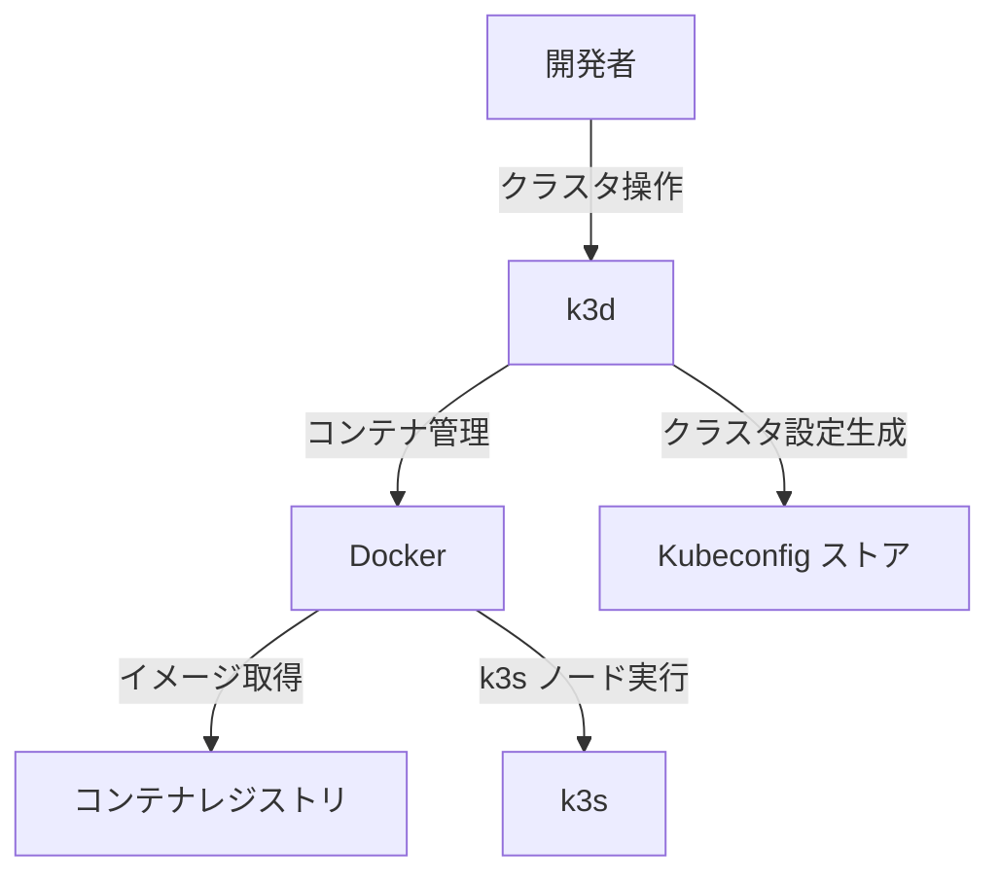
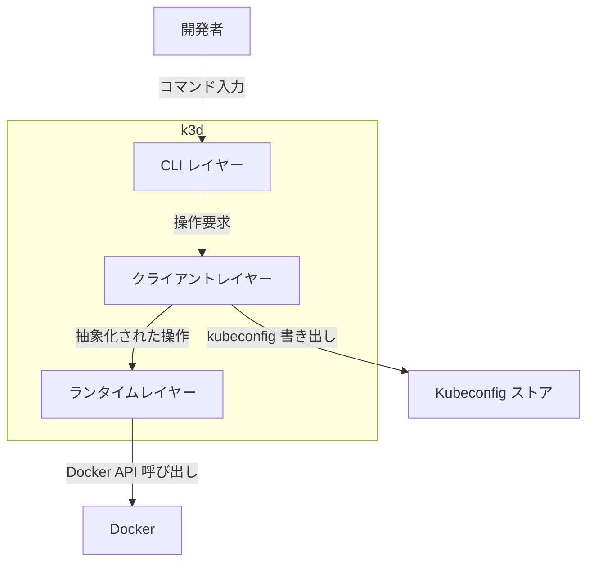
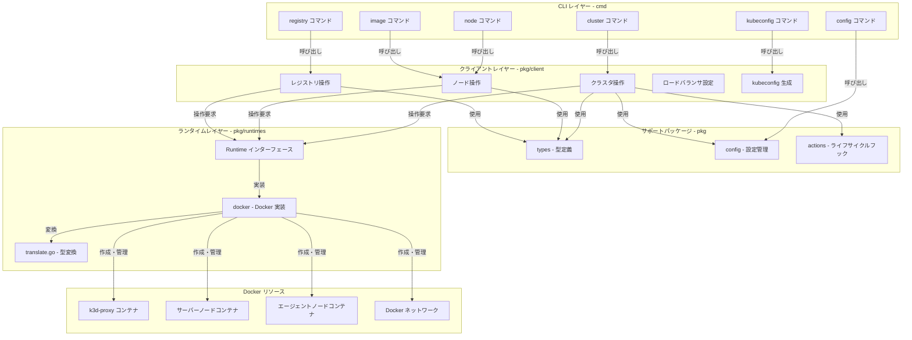
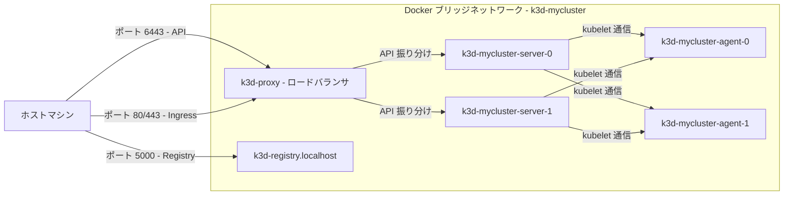
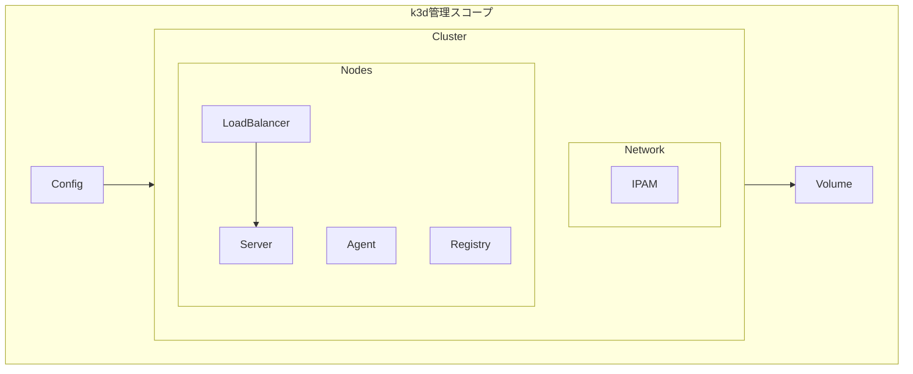
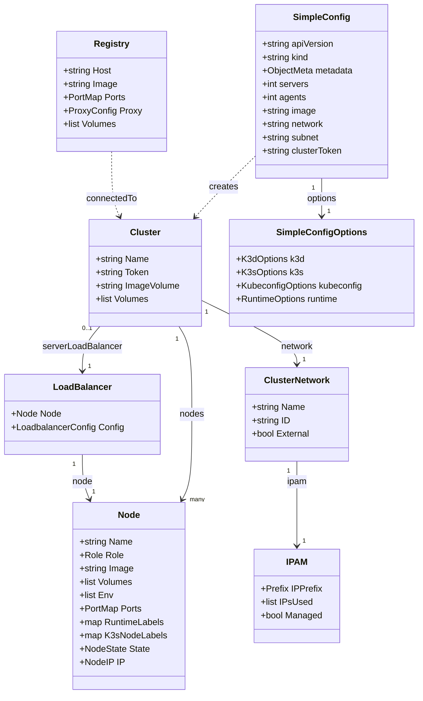

## 概要

k3d は、Docker コンテナ上で k3s クラスタを起動・管理するラッパーツールです。最新の安定版は v5 系で、k3s v1.28〜v1.31 に対応しています。

### k3s との関係

| 役割                              | ツール | 説明                                           |
| --------------------------------- | ------ | ---------------------------------------------- |
| Kubernetes ディストリビューション | k3s    | Rancher Labs 開発の軽量 Kubernetes             |
| クラスタ管理レイヤー              | k3d    | Docker 上で k3s を動作させるオーケストレーター |

k3s はコンテナランタイムとして動作する軽量 Kubernetes 本体です。k3d は k3s ノードを Docker コンテナとして起動し、ネットワーク構成・ライフサイクル管理・kubeconfig 統合を担います。

### 他のローカル Kubernetes ツールとの比較

| ツール   | 実行方式         | リソース消費         | マルチノード | 起動速度  | K8s ディストリビューション |
| -------- | ---------------- | -------------------- | ------------ | --------- | -------------------------- |
| k3d      | Docker コンテナ  | 低 - 約 512MB/ノード | 対応         | 約 20 秒  | k3s - 軽量版               |
| kind     | Docker コンテナ  | 中 - 約 1GB/ノード   | 対応         | 約 60 秒  | 標準 Kubernetes            |
| minikube | VM または Docker | 高 - 約 2GB 以上     | 制限あり     | 約 120 秒 | 標準 Kubernetes            |

### アーキテクチャの違い

- **k3d**: k3s を Docker コンテナとして実行します。k3s は etcd の代わりに SQLite を使用し、バイナリサイズは約 100MB です。コントロールプレーンとワーカーを単一プロセスで動かせるため、ノードあたりのオーバーヘッドが小さいです
- **kind**: 標準 Kubernetes（kubeadm）を Docker コンテナ内で実行します。etcd・kube-apiserver・kube-scheduler 等の全コンポーネントが個別プロセスで動作します。production と同じコンポーネント構成のため、適合性テストに適しています
- **minikube**: VM（VirtualBox/HyperKit 等）または Docker ドライバで動作します。アドオン機構が充実しており、Dashboard やメトリクスサーバーをワンコマンドで有効化できます

### ユースケース別の推奨

| ユースケース                    | 推奨ツール | 理由                                            |
| ------------------------------- | ---------- | ----------------------------------------------- |
| 日常のローカル開発・テスト      | k3d        | 起動が速くリソース消費が少ない                  |
| CI/CD パイプライン              | k3d        | 20〜30 秒で起動・破棄でき、並列実行に適する     |
| Kubernetes 適合性テスト         | kind       | 標準 Kubernetes と同一コンポーネントで動作する  |
| Kubernetes 学習・チュートリアル | minikube   | アドオンが豊富で Dashboard を簡単に有効化できる |
| マルチノード HA 検証            | k3d        | 複数サーバーノードの HA 構成を軽量に再現できる  |

## 特徴

- **高速なクラスタ作成**: `k3d cluster create` の 1 コマンドでクラスタを起動可能
- **マルチノード対応**: サーバーノードとエージェントノードを任意の台数で構成可能
- **高可用性クラスタ**: 複数サーバーノードによる HA 構成をローカルで検証可能
- **動的なノード追加・削除**: 稼働中のクラスタにノードを追加・削除可能
- **ポートマッピング**: ホストのポートをクラスタサービスに転送可能
- **ボリュームマウント**: ホストディレクトリをクラスタノードにマウント可能
- **組み込みロードバランサー**: nginx ベースのロードバランサーをサーバーノード前段に自動配置
- **ローカルレジストリ管理**: クラスタと連携するコンテナレジストリを簡単に作成可能
- **YAML 設定ファイル対応**: クラスタ構成を YAML ファイルで定義してチーム間で共有可能
- **kubeconfig 自動統合**: クラスタ作成時に kubeconfig を自動更新し、すぐに kubectl を利用可能
- **CI/CD 親和性**: 軽量・高速のため GitHub Actions 等のパイプラインに組み込みやすい
- **k3s 引数の直接指定**: `--k3s-arg` で k3s の起動オプションを柔軟にカスタマイズ可能
- **Podman サポート**: Docker の代替として Podman での動作もサポート

## 構造

### システムコンテキスト図



| 要素名             | 説明                                                                    |
| ------------------ | ----------------------------------------------------------------------- |
| 開発者             | k3d CLI でローカル Kubernetes クラスタを操作するユーザー                |
| k3d                | Docker 上で k3s クラスタを作成・管理するツール                          |
| Docker             | コンテナランタイム。k3d がクラスタノードを実行する基盤                  |
| k3s                | Rancher Labs 製の軽量 Kubernetes ディストリビューション。各ノードで動作 |
| Kubeconfig ストア  | kubectl が参照するクラスタ接続設定の保存先                              |
| コンテナレジストリ | k3s や k3d-proxy 等のコンテナイメージの配布元                           |

### コンテナ図



| 要素名               | 説明                                                                           |
| -------------------- | ------------------------------------------------------------------------------ |
| CLI レイヤー         | Cobra ベースのコマンドツリー。ユーザー入力を受け取りクライアントレイヤーへ渡す |
| クライアントレイヤー | クラスタ・ノード・レジストリの操作を担うビジネスロジック層                     |
| ランタイムレイヤー   | コンテナ操作を抽象化するインターフェース層。現在は Docker のみ実装             |

### コンポーネント図



| 要素名                         | 説明                                                                        |
| ------------------------------ | --------------------------------------------------------------------------- |
| cluster コマンド               | クラスタの作成・削除・起動・停止・一覧表示を担うコマンド群                  |
| node コマンド                  | ノードの追加・削除・起動・停止を担うコマンド群                              |
| registry コマンド              | コンテナイメージレジストリの作成・管理を担うコマンド群                      |
| kubeconfig コマンド            | kubeconfig の取得・マージ・削除を担うコマンド群                             |
| image コマンド                 | コンテナイメージのクラスタへのインポートを担うコマンド群                    |
| config コマンド                | 設定ファイルの検証・マイグレーションを担うコマンド群                        |
| クラスタ操作                   | ClusterCreate / ClusterStart / ClusterDelete 等のクラスタライフサイクル処理 |
| ノード操作                     | NodeCreate / NodeStart / NodeDelete 等のノードライフサイクル処理            |
| レジストリ操作                 | RegistryCreate / RegistryConnect 等のレジストリ管理処理                     |
| ロードバランサ設定             | ロードバランサノードの設定生成と更新処理                                    |
| kubeconfig 生成                | クラスタ接続情報の生成とローカルへの書き出し処理                            |
| types - 型定義                 | Cluster・Node・Registry・Role 等の中核型定義                                |
| config - 設定管理              | k3d.io/v1alpha5 形式の YAML 設定ファイルの読み込み・検証・変換処理          |
| actions - ライフサイクルフック | ノード・クラスタ起動時に実行されるライフサイクルフック                      |
| Runtime インターフェース       | コンテナランタイム操作を抽象化する Go インターフェース                      |
| docker - Docker 実装           | Runtime インターフェースの Docker 向け実装                                  |
| translate.go - 型変換          | k3d の Node 型と Docker コンテナ仕様を相互変換するモジュール                |
| k3d-proxy コンテナ             | NGINX ベースのロードバランサ。外部リクエストをサーバーノードへ振り分ける    |
| サーバーノードコンテナ         | k3s server プロセスを実行する Docker コンテナ                               |
| エージェントノードコンテナ     | k3s agent プロセスを実行する Docker コンテナ                                |
| Docker ネットワーク            | クラスタ内ノード間通信用の専用 Docker ブリッジネットワーク                  |

### ネットワーク構成図



| 要素名                      | 説明                                                                                          |
| --------------------------- | --------------------------------------------------------------------------------------------- |
| ホストマシン                | 開発者のローカル環境。ポートマッピングでクラスタにアクセス                                    |
| k3d-proxy                   | NGINX ベースのロードバランサ。API リクエストと Ingress トラフィックをサーバーノードに振り分け |
| k3d-mycluster-server-N      | k3s server プロセスが動作するコンテナ。コントロールプレーンを担当                             |
| k3d-mycluster-agent-N       | k3s agent プロセスが動作するコンテナ。ワークロードを実行                                      |
| k3d-registry.localhost      | ローカルコンテナレジストリ。ホストから直接 push/pull 可能                                     |
| Docker ブリッジネットワーク | クラスタ専用の隔離ネットワーク。全ノードが同一ネットワークで通信                              |

## データ

### 概念モデル



| 要素名       | 説明                                                              |
| ------------ | ----------------------------------------------------------------- |
| Cluster      | k3s クラスタ全体を表す中心エンティティ                            |
| Network      | クラスタノード間の通信を担う Docker ネットワーク                  |
| IPAM         | ネットワーク内の IP アドレス割り当てを管理するサブエンティティ    |
| Nodes        | クラスタを構成するノードの集合                                    |
| Server       | Kubernetes コントロールプレーンを担うノード                       |
| Agent        | Kubernetes ワーカーを担うノード                                   |
| LoadBalancer | 複数 Server ノードへのトラフィックを分散する NGINX プロキシノード |
| Registry     | コンテナイメージを管理するレジストリノード                        |
| Volume       | ノードにマウントされるストレージ                                  |
| Config       | クラスタ構成を宣言する YAML 設定ファイル                          |

### 情報モデル



| 要素名              | 説明                                                                                      |
| ------------------- | ----------------------------------------------------------------------------------------- |
| Cluster             | クラスタの名前・トークン・ボリューム情報を保持する中心エンティティ                        |
| Node                | ロール・イメージ・ポートマッピング・状態等、ノードの実行情報を保持                        |
| ClusterNetwork      | Docker ネットワークの名前・ID・外部ネットワーク区別を保持                                 |
| IPAM                | ネットワーク CIDR・使用済み IP アドレス・管理フラグを保持                                 |
| LoadBalancer        | NGINX プロキシとして機能するノードとそのルーティング設定を保持                            |
| Registry            | レジストリのホスト・イメージ・ポート・プロキシ設定を保持                                  |
| SimpleConfig        | YAML 設定ファイルの最上位エンティティ。API バージョン・クラスタ基本情報・オプションを保持 |
| SimpleConfigOptions | k3d・k3s・kubeconfig・runtime の各オプションをまとめる集約エンティティ                    |

## 構築方法

### 前提条件

- Docker v20.10.5 以上（k3d v5.x.x の場合）
- `kubectl`（クラスタ操作に必要）

### インストール

| 方法                   | コマンド                                                                                  |
| ---------------------- | ----------------------------------------------------------------------------------------- |
| curl                   | `curl -s https://raw.githubusercontent.com/k3d-io/k3d/main/install.sh \| bash`            |
| curl（バージョン指定） | `curl -s https://raw.githubusercontent.com/k3d-io/k3d/main/install.sh \| TAG=v5.6.3 bash` |
| Homebrew（macOS）      | `brew install k3d`                                                                        |
| Chocolatey（Windows）  | `choco install k3d`                                                                       |
| Scoop（Windows）       | `scoop install k3d`                                                                       |
| AUR（Arch Linux）      | `yay -S rancher-k3d-bin`                                                                  |
| Go                     | `go install github.com/k3d-io/k3d/v5@latest`                                              |

### バージョン確認

```bash
k3d version
```

## 利用方法

### クラスタの作成

```bash
# シンプルな単一ノードクラスタ
k3d cluster create mycluster

# サーバー 1 台 + エージェント 2 台
k3d cluster create mycluster --servers 1 --agents 2

# API ポートとイングレス用ポートを指定
k3d cluster create mycluster --api-port 6550 -p "8080:80@loadbalancer" --agents 2

# カスタム k3s バージョンを指定
k3d cluster create mycluster --image rancher/k3s:v1.28.5-k3s1

# Traefik を無効化
k3d cluster create mycluster --k3s-arg "--disable=traefik@server:0"

# HA 構成（サーバー 3 台 + エージェント 3 台）
k3d cluster create ha-cluster --servers 3 --agents 3
```

**HA 構成の config ファイル例**

```yaml
apiVersion: k3d.io/v1alpha5
kind: Simple
metadata:
  name: ha-cluster
servers: 3
agents: 3
image: rancher/k3s:v1.28.5-k3s1
options:
  k3d:
    wait: true
    timeout: "120s"
  k3s:
    extraArgs:
      - arg: "--disable=traefik"
        nodeFilters:
          - server:*
  kubeconfig:
    updateDefaultKubeconfig: true
    switchCurrentContext: true
```

HA 構成ではサーバーノードを 3 台以上の奇数台で構成します。k3s の組み込み etcd がクォーラムを維持します。

### クラスタの一覧・停止・起動・削除

```bash
# 一覧表示
k3d cluster list

# 停止（状態を保持）
k3d cluster stop mycluster

# 起動
k3d cluster start mycluster

# 削除
k3d cluster delete mycluster
```

### ノードの追加・削除

```bash
# エージェントノードを追加
k3d node create myagent --cluster mycluster --role agent

# 複数のエージェントを一括追加
k3d node create myagents --cluster mycluster --role agent --replicas 3

# メモリ制限付きでノードを追加
k3d node create myagent --cluster mycluster --memory 2g

# ノード一覧
k3d node list

# ノードを削除
k3d node delete k3d-mycluster-agent-1

# ノードを停止・起動
k3d node stop k3d-mycluster-agent-0
k3d node start k3d-mycluster-agent-0
```

### config ファイルの使い方

config ファイルを使うと、クラスタ設定をコード化して再利用できます。

**必須フィールド**

```yaml
apiVersion: k3d.io/v1alpha5
kind: Simple
```

**フル構成例**

```yaml
apiVersion: k3d.io/v1alpha5
kind: Simple
metadata:
  name: mycluster
servers: 1
agents: 2
kubeAPI:
  host: "localhost"
  hostIP: "127.0.0.1"
  hostPort: "6443"
image: rancher/k3s:v1.28.5-k3s1
ports:
  - port: 8080:80
    nodeFilters:
      - loadbalancer
volumes:
  - volume: /my/local/path:/var/lib/rancher/k3s/storage
    nodeFilters:
      - all
registries:
  create:
    name: registry.localhost
    host: "0.0.0.0"
    hostPort: "5000"
options:
  k3d:
    wait: true
    timeout: "60s"
  k3s:
    extraArgs:
      - arg: "--disable=traefik"
        nodeFilters:
          - server:*
  kubeconfig:
    updateDefaultKubeconfig: true
    switchCurrentContext: true
```

**config ファイルでクラスタを作成**

```bash
# config ファイルを使用
k3d cluster create --config k3d-config.yaml

# CLI フラグで値を上書き
k3d cluster create --config k3d-config.yaml --agents 5

# デフォルト config ファイルを生成
k3d config init --output my-cluster-config.yaml
```

CLI フラグは config ファイルの設定よりも優先されます。

### kubeconfig の操作

```bash
# kubeconfig をファイルに書き出し
k3d kubeconfig write mycluster

# 環境変数に設定
export KUBECONFIG=$(k3d kubeconfig write mycluster)

# デフォルト kubeconfig にマージ
k3d kubeconfig merge mycluster --kubeconfig-merge-default

# マージしてコンテキストも切り替え
k3d kubeconfig merge mycluster --kubeconfig-merge-default --kubeconfig-switch-context

# 全クラスタをマージ
k3d kubeconfig merge --all --kubeconfig-merge-default

# 標準出力で取得
k3d kubeconfig get mycluster
```

### イメージのインポート

ローカル Docker デーモンのイメージをクラスタに直接インポートします。

```bash
# 単一イメージのインポート
k3d image import myapp:latest -c mycluster

# 複数イメージを一括インポート
k3d image import myapp:v1 myapp:v2 nginx:alpine -c mycluster

# tar アーカイブからインポート
k3d image import /path/to/image.tar -c mycluster

# 複数クラスタへ同時インポート
k3d image import myapp:latest -c cluster1 -c cluster2

# 高速モード（直接インポート）
k3d image import myapp:latest -c mycluster --mode direct
```

### ローカルレジストリの構築・利用

#### クラスタ作成と同時にレジストリを作成

```bash
k3d cluster create mycluster --registry-create mycluster-registry
```

containerd の設定が自動的に構成されます。

#### レジストリを独立して作成し、クラスタに接続

```bash
# レジストリを作成
k3d registry create registry.localhost --port 12345

# クラスタ作成時にレジストリを接続
k3d cluster create mycluster --registry-use k3d-registry.localhost:12345
```

#### レジストリミラー（外部レジストリのキャッシュ）

registries.yaml を使用して、外部レジストリへのアクセスをローカルレジストリ経由でキャッシュできます。

```yaml
# registries.yaml
mirrors:
  "docker.io":
    endpoint:
      - http://k3d-registry.localhost:5000
  "ghcr.io":
    endpoint:
      - http://k3d-registry.localhost:5000
```

```yaml
# k3d-config.yaml
apiVersion: k3d.io/v1alpha5
kind: Simple
metadata:
  name: mycluster
registries:
  create:
    name: registry.localhost
    host: "0.0.0.0"
    hostPort: "5000"
  config: |
    mirrors:
      "docker.io":
        endpoint:
          - http://k3d-registry.localhost:5000
```

レジストリミラーを設定すると、Docker Hub の Rate Limit 対策になります。CI/CD 環境で特に有効です。

#### イメージの push・pull

```bash
# ローカルイメージにタグ付け
docker tag nginx:latest k3d-registry.localhost:12345/nginx:latest

# レジストリに push
docker push k3d-registry.localhost:12345/nginx:latest

# クラスタ内でイメージを使用（マニフェスト内）
# image: k3d-registry.localhost:12345/nginx:latest
```

### ポートマッピング

```bash
# ロードバランサ経由でポートをマッピング
k3d cluster create mycluster -p "8080:80@loadbalancer"

# HTTP と HTTPS を同時にマッピング
k3d cluster create mycluster \
  -p "80:80@loadbalancer" \
  -p "443:443@loadbalancer"

# 特定のエージェントノードにマッピング
k3d cluster create mycluster --agents 2 \
  -p "8080:80@agent:0" \
  -p "8081:80@agent:1"
```

**ノードフィルタ記法**

| フィルタ        | 対象                           |
| --------------- | ------------------------------ |
| `@server:0`     | 1 台目のサーバー               |
| `@server:*`     | 全サーバー                     |
| `@agent:0,1`    | エージェント 0 と 1            |
| `@agent:*`      | 全エージェント                 |
| `@loadbalancer` | ロードバランサ                 |
| `@all`          | 全ノード（ロードバランサ含む） |

### ボリュームマウント

```bash
# 単一ボリュームをサーバーにマウント
k3d cluster create mycluster \
  --volume /my/local/path:/path/in/node@server:0

# 全エージェントにマウント
k3d cluster create mycluster --agents 3 \
  -v /data:/data@agent:*

# 全ノードにマウント
k3d cluster create mycluster \
  --volume /my/local/path:/var/lib/rancher/k3s/storage@all
```

## 運用

### クラスタの起動・停止

`k3d cluster stop` でクラスタを停止します。Docker コンテナを削除しない限り、状態は保持されます。`k3d cluster start` で停止済みクラスタを再起動します。

```bash
# 停止
k3d cluster stop mycluster
k3d cluster stop --all

# 起動
k3d cluster start mycluster
k3d cluster start mycluster --timeout 120s
k3d cluster start --all
```

### クラスタ一覧・状態確認

```bash
# クラスタ一覧
k3d cluster list

# ノード一覧
k3d node list

# Kubernetes ノード状態
kubectl get nodes

# 全 Pod 状態
kubectl get pods -A
```

### ノードの追加・削除・起動・停止

既存クラスタにノードを追加してスケールします。個別ノードの起動・停止でフェイルオーバー動作を確認できます。コマンドの詳細は「利用方法 > ノードの追加・削除」を参照してください。

### ログ確認

k3d のログレベルを切り替えて詳細情報を取得します。ノード内のログは `docker logs` または `kubectl logs` で確認します。

```bash
# デバッグログ
k3d --verbose cluster create mycluster

# トレースログ（最詳細）
k3d --trace cluster create mycluster

# タイムスタンプ付きログ
k3d --timestamps cluster create mycluster

# ノードコンテナのログ確認
docker logs k3d-mycluster-server-0

# Pod ログ確認
kubectl logs <pod-name> -n <namespace>
```

### クラスタの更新（イメージ更新）

新しいバージョンのイメージをビルドして再デプロイします。

```bash
# 新イメージをビルドしてローカルレジストリへプッシュ
docker build -t localhost:5000/myapp:v2 .
docker push localhost:5000/myapp:v2

# Deployment のイメージを更新
kubectl set image deployment/myapp myapp=dev-registry:5000/myapp:v2
```

## ベストプラクティス

### config ファイル管理

クラスタ構成を YAML ファイルで管理すると、再現性のある環境を実現できます。`k3d config init` でテンプレートを生成します。

```bash
# デフォルト config ファイルを生成
k3d config init --output k3d-config.yaml

# config ファイルからクラスタ作成
k3d cluster create --config k3d-config.yaml

# CLI フラグで config の値を上書き
k3d cluster create --config k3d-config.yaml --agents 5
```

### CI/CD での活用

`nolar/setup-k3d-k3s` または `AbsaOSS/k3d-action` を GitHub Actions で利用します。クラスタ作成から削除まで 20〜30 秒で完了します。kubeconfig には cluster-admin 権限を使用せず、必要最小限の RBAC 権限を持つ ServiceAccount を使用します。

```yaml
# GitHub Actions での利用例
- name: Setup k3d
  uses: nolar/setup-k3d-k3s@v1
  with:
    version: v5

- name: Create cluster
  run: k3d cluster create ci-cluster --config k3d-config.yaml

- name: Run tests
  run: |
    kubectl get nodes
    # テスト実行

- name: Delete cluster
  if: always()
  run: k3d cluster delete ci-cluster
```

### マルチクラスタ管理

複数クラスタの kubeconfig をマージして管理します。

```bash
# 全クラスタの kubeconfig をマージ
k3d kubeconfig merge --all --kubeconfig-merge-default

# 特定クラスタの kubeconfig をマージしてコンテキスト切り替え
k3d kubeconfig merge mycluster --kubeconfig-merge-default --kubeconfig-switch-context
```

### リソース制限

ノードのメモリ上限を設定してホストマシンへの負荷を制御します。

```bash
# 個別ノード作成時のメモリ制限
k3d node create myagent --cluster mycluster --memory 2g
```

### セキュリティ

kubeconfig には最小権限の ServiceAccount を使用します。CI/CD では GitHub API の Rate Limit 対策として `GITHUB_TOKEN` を設定します。

| 項目                 | 推奨設定                                     |
| -------------------- | -------------------------------------------- |
| kubeconfig 権限      | 最小権限の ServiceAccount                    |
| コンテキスト切り替え | `--kubeconfig-switch-context` で自動切り替え |
| kubeconfig ファイル  | 環境変数 `KUBECONFIG` で管理                 |
| API Rate Limit 対策  | `GITHUB_TOKEN` 設定（CI/CD 環境）            |

## トラブルシューティング

### クラスタ作成が失敗する

| 症状                            | 原因             | 対処                          |
| ------------------------------- | ---------------- | ----------------------------- |
| `ERRO Failed to create cluster` | ポート競合       | `--api-port` に別ポートを指定 |
| タイムアウトエラー              | ノード起動が遅い | `--timeout` 値を増やす        |
| Docker デーモン未起動           | Docker が停止    | Docker を起動してから再実行   |

```bash
# ポートを明示して再作成
k3d cluster create mycluster --api-port 6444

# タイムアウトを延長
k3d cluster create mycluster --timeout 120s
```

### ノードが NotReady になる

Docker のディスク容量不足により kubelet がハード退避を実行します。`docker system prune` で未使用リソースを削除します。

```bash
# Docker のディスク使用量確認
docker system df

# 未使用リソースの削除
docker system prune -f

# kubelet の退避閾値を調整して再作成
k3d cluster create mycluster \
  --k3s-arg "--kubelet-arg=eviction-hard=imagefs.available<5%@agent:*"
```

### kubectl が接続できない

kubeconfig が正しく設定されているか確認します。

```bash
# kubeconfig を再生成
k3d kubeconfig write mycluster
export KUBECONFIG=$(k3d kubeconfig write mycluster)

# デフォルト kubeconfig にマージ
k3d kubeconfig merge mycluster --kubeconfig-merge-default --kubeconfig-switch-context

# 接続確認
kubectl cluster-info
kubectl get nodes
```

### ポートコンフリクト

ホストマシンのポートが使用中の場合、クラスタ作成が失敗します。

```bash
# 使用中ポートを確認
lsof -i :6443
lsof -i :80

# 別ポートを指定して作成
k3d cluster create mycluster --api-port 6444 -p "8080:80@loadbalancer"
```

### イメージが取得できない - ImagePullBackOff

ローカルビルドのイメージは `k3d image import` でクラスタへ取り込みます。`latest` タグはイメージ更新時に再インポートが必要です。

```bash
# イメージをクラスタにインポート
k3d image import myapp:v1 --cluster mycluster

# Docker Desktop + containerd 環境での代替手段
# ローカルレジストリを使用
k3d cluster create mycluster --registry-create dev-registry:0.0.0.0:5000
docker tag myapp:v1 localhost:5000/myapp:v1
docker push localhost:5000/myapp:v1
# manifest では dev-registry:5000/myapp:v1 を指定
```

### ネットワーク問題 - host.k3d.internal に到達できない

Linux 環境では `host.k3d.internal` の解決に追加設定が必要な場合があります。

```bash
# クラスタ内から host.k3d.internal を確認
kubectl run -it --rm debug --image=busybox --restart=Never -- nslookup host.k3d.internal

# 代替として host-gateway を使用
k3d cluster create mycluster \
  --k3s-arg "--kubelet-arg=node-ip=0.0.0.0@server:*"
```

### Docker コンテキスト関連の問題

k3d はデフォルトの Docker コンテキストを使用します。別の Docker コンテキストを使用している場合、`DOCKER_HOST` 環境変数を設定します。

```bash
# 現在の Docker コンテキストを確認
docker context ls

# デフォルトコンテキストに切り替え
docker context use default

# または DOCKER_HOST を指定
export DOCKER_HOST=unix:///var/run/docker.sock
k3d cluster list
```

## まとめ

k3d は Docker コンテナ上で k3s クラスタを高速に起動・管理できるツールで、ローカル開発や CI/CD パイプラインでの Kubernetes 環境構築に適しています。軽量なリソース消費、マルチノード・HA 構成のサポート、YAML による宣言的な設定管理により、再現性の高い Kubernetes 開発環境を手軽に実現できます。

この記事が少しでも参考になった、あるいは改善点などがあれば、ぜひリアクションやコメント、SNSでのシェアをいただけると励みになります！

## 参考リンク

- 公式ドキュメント
  - [k3d 公式サイト](https://k3d.io/)
  - [k3d Installation](https://k3d.io/stable/#installation)
  - [k3d Usage - Registries](https://k3d.io/stable/usage/registries/)
  - [k3d Usage - Commands](https://k3d.io/stable/usage/commands/)
  - [k3d Configuration File Reference](https://k3d.io/stable/usage/configfile/)
  - [k3d Design - Project](https://k3d.io/stable/design/project/)
  - [k3d FAQ](https://k3d.io/stable/faq/faq/)
- GitHub
  - [k3d-io/k3d](https://github.com/k3d-io/k3d)
  - [nolar/setup-k3d-k3s - GitHub Actions](https://github.com/nolar/setup-k3d-k3s)
  - [AbsaOSS/k3d-action - GitHub Actions](https://github.com/AbsaOSS/k3d-action)
- 記事
  - [Introduction to k3d: Run K3s in Docker - SUSE Communities](https://www.suse.com/c/introduction-k3d-run-k3s-docker-src/)
  - [K3d for Local Kubernetes Development - Devtron](https://devtron.ai/blog/k3d-for-local-kubernetes-development/)
  - [Why You Should Use k3d for Local Development - DEV Community](https://dev.to/cloudx/why-you-should-use-k3d-for-local-development-a-developers-guide-2cp5)
  - [deepwiki - k3d-io/k3d](https://deepwiki.com/k3d-io/k3d)
  - [Istio / k3d Platform Setup](https://istio.io/latest/docs/setup/platform-setup/k3d/)
