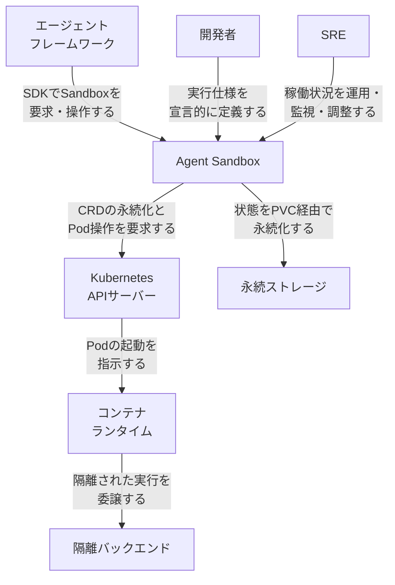
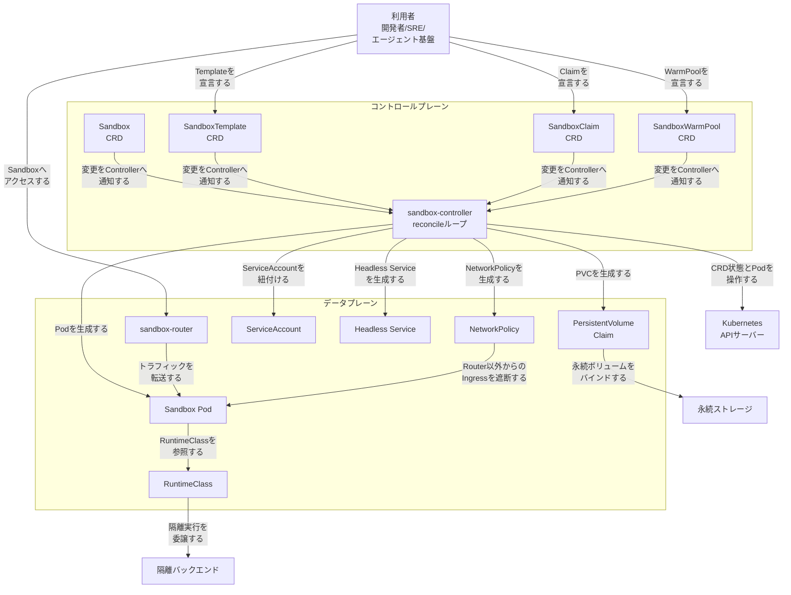
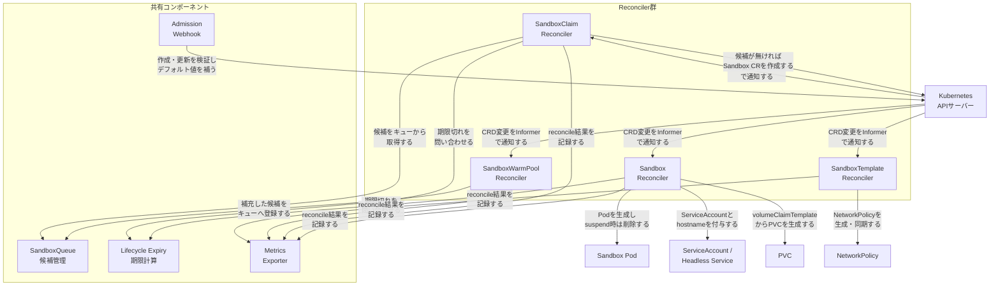
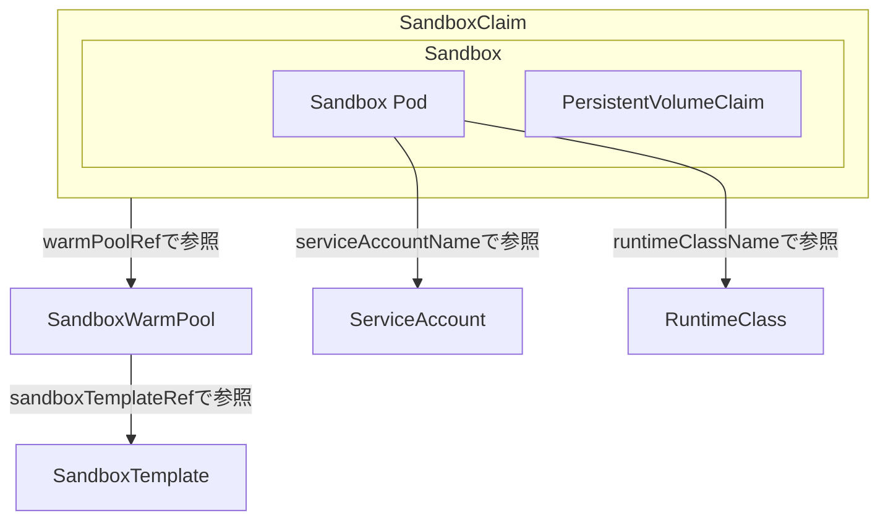
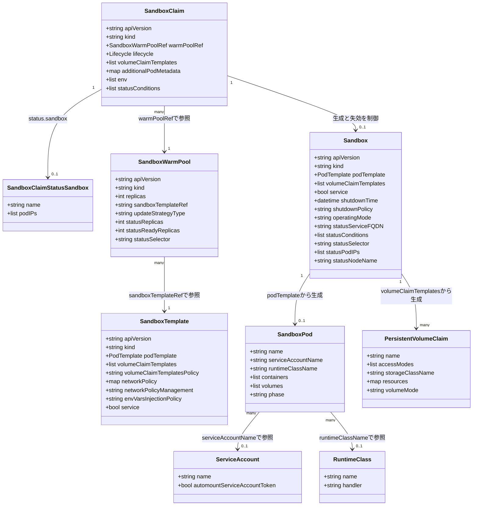

> 検証日: 2026-07-15 / 対象: kubernetes-sigs/agent-sandbox `v0.5.1`（API は `v1beta1` を正とします）

## 概要

Kubernetes 上で AI エージェントを動かすとき、1 つのエージェントに 1 つの Pod を割り当てる「1 Agent 1 Pod」構成が広く採用されてきました。CNCF blog で kagent の Lin Sun 氏が整理する採用理由は次のとおりです。

- **認証・認可**: Pod に紐づく ServiceAccount（サービスアカウント）が、エージェントごとに固有の Kubernetes ID を与えます。
- **分離**: Pod が提供するプロセス隔離・コンテナ隔離により、エージェント同士の実行環境が混ざりません。
- **ポリシー適用**: NetworkPolicy やアドミッション制御が Pod 単位で自動適用されます。
- **観測性**: ログ・メトリクス・トレースが個別の Pod に帰属し、エージェントごとの挙動を追跡できます。

これらは Pod が「実行環境」として優れていることの裏付けです。一方で、AI エージェントには次の固有の性質があり、常駐サービスを前提にした抽象（Pod や Deployment）とかみ合いません。

- **秒〜分の短命実行**: タスク割り当て時だけ起動し、数秒〜数分で完了してアイドルに戻ります。
- **人間承認待ちの pause**: 処理途中で人間の承認を待って一時停止し、承認後に再開します。
- **サブエージェントの動的生成**: 実行中にサブタスク処理用のサブエージェントを動的に複数生成します。

Deployment はステートレスな複製アプリケーション向け、StatefulSet は複数レプリカの安定 ID 管理向けに設計されており、いずれも「1 個体だけを、短命に、状態を保ったまま pause/resume する」という要求には正面から応えません。個々のエージェントを StatefulSet(1) + headless Service + PersistentVolumeClaim（永続ボリューム要求）の組み合わせで手作りすると、運用が破綻しやすくなります。

この問題への解は 2 系統に分かれます。名前が紛らわしいので冒頭で区別します。

| 系統 | 出典 | 抽象 | 位置づけ |
|---|---|---|---|
| **agent-sandbox** | kubernetes-sigs（SIG Apps 傘下） | `Sandbox` / `SandboxTemplate` / `SandboxClaim` / `SandboxWarmPool` の CRD | 本記事の調査対象そのもの。実装レベルの解答 |
| **agent-substrate** | Solo.io 発（CNCF blog が紹介） | `WorkerPool` / `Worker` / `Actor` / `ActorTemplate` の別 CRD | 設計論・別実装。kagent・agentgateway と組み合わせる |

本記事は agent-sandbox（kubernetes-sigs）を中核に構造・データ・構築・利用・運用を扱い、agent-substrate は設計思想の対比として運用・ベストプラクティスで整理します。

### Agent Sandbox が埋めるもの

kubernetes-sigs/agent-sandbox は、Kubernetes SIG Apps 傘下のサブプロジェクトとして、この「論理ライフサイクルの分離」を Kubernetes ネイティブな CRD（Custom Resource Definition、カスタムリソース定義）群として実装します。2025 年 11 月の KubeCon Atlanta でローンチされました。対象は、Deployment（ステートレス複製）や StatefulSet（複数レプリカの安定 ID 管理）が想定していない「isolated（隔離された）・stateful（状態を保つ）・singleton（単一インスタンス）workload」です。

- **singleton workload の宣言的管理**: 単一のステートフル Pod を 1 つの CRD（`Sandbox`）として宣言的に管理し、StatefulSet(1) + headless Service + PVC の手作り運用を代替します。
- **stable identity（安定した識別情報）**: 各 Sandbox が安定したホスト名とネットワーク識別情報を持ち、再起動をまたいでエージェント間の通信や発見が可能です。
- **pause / resume**: `Sandbox.spec.operatingMode`（`Running` / `Suspended`）で状態を失わずに一時停止・再開できます。
- **scheduled deletion（スケジュール削除）**: `shutdownTime` と `shutdownPolicy` により、期限到来時の自動削除・リソース回収を宣言的に設定できます。
- **untrusted code（信頼できないコード）の強い隔離**: gVisor・Kata Containers など、RuntimeClass で選択できる隔離ランタイムと統合し、カーネルレベルのサンドボックス化や VM ベースの隔離を選択できます。

CRD 群は役割で分かれています。API グループは 2 つあります。

| CRD | API グループ | 役割 |
|---|---|---|
| `Sandbox` | `agents.x-k8s.io`（コア） | 単一ステートフル Pod の宣言的管理単位 |
| `SandboxTemplate` | `extensions.agents.x-k8s.io`（拡張） | 再利用可能な Sandbox 設定テンプレート |
| `SandboxClaim` | `extensions.agents.x-k8s.io`（拡張） | 利用者やフレームワークが実行環境を要求する抽象層 |
| `SandboxWarmPool` | `extensions.agents.x-k8s.io`（拡張） | 事前初期化済み Sandbox のプール。コールドスタートを回避 |

コアパッケージ（`agents.x-k8s.io`）の Resource Types には `Sandbox` のみが列挙されます。`SandboxTemplate` / `SandboxClaim` / `SandboxWarmPool` の 3 つはすべて拡張パッケージ（`extensions.agents.x-k8s.io`）に属します。

### 関連技術との比較

| 抽象/リソース単位 | ライフサイクル制御 | 隔離方式 | 状態保持 | 起動速度 |
|---|---|---|---|---|
| 素の Pod | kubelet による起動・再起動のみ。pause/resume の概念なし | コンテナ（namespace/cgroup） | Pod 削除で消失（PVC 併用時のみ一部保持） | 数百ミリ秒〜数秒 |
| Deployment / 手作り StatefulSet(1) | ReplicaSet/StatefulSet によるスケール・ローリング更新。`replicas=0` へのスケールダウンは可能だが、identity 再アタッチや `shutdownTime` による失効を宣言的に表現できない | コンテナ（namespace/cgroup） | Deployment は想定外（ステートレス前提）。StatefulSet(1) は PVC で保持可（ただし宣言的な失効制御を持たない） | Pod と同等 |
| Job | 完了指向。再実行は新規 Pod 生成が基本 | コンテナ（namespace/cgroup） | 想定外（実行完了で終了） | Pod と同等 |
| Agent Sandbox（`Sandbox` CRD） | `operatingMode` による suspend/resume、`shutdownTime`/`shutdownPolicy` によるスケジュール削除を宣言的に制御 | コンテナ標準に加え、gVisor/Kata を RuntimeClass で選択可能 | 永続ボリューム設定でセッション間・再起動間も保持 | WarmPool 併用で 2 秒未満 |
| KubeVirt 的 VM 隔離 | VM のライフサイクル管理（起動・停止・migrate） | ハードウェア仮想化（VM 単位） | VM ディスクとして永続化しやすい | 秒〜数十秒（VM 起動コスト） |
| gVisor/Kata Containers | コンテナランタイム差し替え。上位のライフサイクル管理機構は持たない | gVisor はシステムコール横取り、Kata は軽量 VM ベース | ランタイム自体は状態管理を持たない（上位リソース依存） | gVisor は Pod に近い、Kata はやや増加 |

素の Pod/Deployment/Job は起動速度や隔離で強みがある一方、AI エージェントが必要とする pause/resume やスケジュール削除といった宣言的なライフサイクル制御を持ちません。Agent Sandbox は、この制御を Kubernetes ネイティブな CRD として提供しつつ、隔離方式は既存の gVisor/Kata を RuntimeClass で選択的に組み合わせる設計です（KubeVirt などの VM 隔離は別方式の選択肢です）。

## 特徴

- Pod を実行環境として残したまま、エージェントの論理ライフサイクル（定義・実行インスタンス・状態・ID）を CRD に分離できます。
- singleton・stateful なワークロードを、StatefulSet(1) の手作り運用に頼らず宣言的に管理できます。
- 安定したホスト名・ネットワーク識別情報により、マルチエージェント間の発見・通信を継続できます。
- `operatingMode` の切替で状態を保ったまま pause/resume でき、人間承認待ちなどの中断を伴うフローに対応できます。
- `shutdownTime`/`shutdownPolicy` によるスケジュール削除で、アイドル時のリソース回収を自動化できます。
- `SandboxWarmPool` による事前初期化済みプールで、コールドスタートを回避し 2 秒未満での割り当てを実現します。
- `SandboxClaim` がエージェントフレームワーク向けの抽象層となり、プロビジョニングの実装詳細を隠蔽します。
- gVisor・Kata Containers という RuntimeClass で選択できる隔離ランタイムを利用でき、LLM 生成コードなど信頼できないコードの実行に強いセキュリティ境界を提供します。
- Kubernetes SIG Apps 傘下の公式サブプロジェクトとして、標準的な CRD・コントローラパターン上に構築されています。
- CNCF blog の agent-substrate/kagent の問題提起（Agent identity・ポリシー・マルチテナンシー・観測性を Pod から切り離す）に対する、実装レベルでの一つの解答と位置づけられます。

## 構造

Agent Sandbox の内部アーキテクチャを、C4 model のシステムコンテキスト図・コンテナ図・コンポーネント図の 3 段で図解します。3 段を通じて一貫して示すのは、コントロールプレーンとデータプレーンの分離です。コントロールプレーンは CRD として宣言的にエージェント実行環境の仕様を定義します。データプレーンは、その宣言から生成される実行時リソース（Pod・PVC・RuntimeClass 等）です。

### システムコンテキスト図



| 要素名 | 説明 |
|---|---|
| エージェントフレームワーク | 実行環境を必要とするアクター。SDK 経由で Sandbox の要求・一時停止・再開を行います |
| 開発者 | 実行環境の仕様をテンプレートとして宣言的に定義するアクターです |
| SRE | 稼働状況を運用・監視し、プールのサイズやリソース配分を調整するアクターです |
| Agent Sandbox | 本調査の対象システムです。エージェント実行環境の論理ライフサイクルを CRD として宣言的に管理します |
| Kubernetes APIサーバー | すべての CRD とネイティブリソースの永続化・配信を担う外部システムです |
| コンテナランタイム | Kubernetes API サーバーの指示を受けて Pod を起動する外部システムです |
| 隔離バックエンド | 信頼できないコードの実行に強い分離境界を提供する外部システムです |
| 永続ストレージ | Sandbox の状態を再起動・セッションをまたいで保持する外部システムです |

### コンテナ図



#### コントロールプレーン

| 要素名 | 説明 |
|---|---|
| Sandbox CRD | 単一ステートフル Pod の実行環境仕様を宣言する、コア CRD です |
| SandboxTemplate CRD | 再利用可能な Sandbox 設定テンプレートを宣言する CRD です |
| SandboxClaim CRD | 利用者が実行環境を要求する抽象層となる CRD です。ウォームプール参照やライフサイクルを指定します |
| SandboxWarmPool CRD | 事前初期化済み Sandbox のプールサイズを宣言する CRD です |
| sandbox-controller | 4 種の CRD を監視し、データプレーンのリソースを生成・維持する reconcile ループ本体です |

#### データプレーン

| 要素名 | 説明 |
|---|---|
| Sandbox Pod | Controller が生成する実行 Pod です。エージェントのコードが実際に動く単位です |
| PersistentVolumeClaim | Sandbox の状態を再起動をまたいで保持する永続ボリューム要求です |
| RuntimeClass | Sandbox Pod が参照する実行ランタイムの指定です。隔離バックエンドへの委譲を切り替えます |
| NetworkPolicy | Managed のデフォルト構成では Sandbox Pod への Ingress を sandbox-router からの通信に限定するセキュリティ境界です（`networkPolicyManagement: Unmanaged` では自前管理） |
| ServiceAccount | Sandbox Pod に紐づく Kubernetes RBAC 上の身元です。クラウド IAM 連携の起点にもなります |
| Headless Service | Sandbox Pod に安定したホスト名と DNS による発見性を与えるネットワーク識別情報です |
| sandbox-router | Sandbox Pod へのトラフィックを中継するリバースプロキシです |

#### 外部アクター・外部システム

| 要素名 | 説明 |
|---|---|
| 利用者 | 開発者・SRE・エージェントフレームワークを総称した、Agent Sandbox の呼び出し元です |
| Kubernetes APIサーバー | CRD とネイティブリソースの永続化・配信を担う外部システムです |
| 隔離バックエンド | RuntimeClass 経由で実行を委譲される、強い分離を提供する外部システムです |
| 永続ストレージ | PVC がバインドする、状態保持のための外部システムです |

NetworkPolicy は `SandboxTemplate` 由来です。Sandbox 自体の spec に networkPolicy フィールドはありません。コンポーネント図では SandboxTemplate Reconciler が生成主体として描かれます。

### コンポーネント図

sandbox-controller をさらにドリルダウンし、内部のコンポーネント構成を示します。



#### Reconciler群

| 要素名 | 説明 |
|---|---|
| Sandbox Reconciler | Sandbox CRD を担当します。Pod・PVC・Headless Service の生成、ServiceAccount 等の identity 付与、suspend 時の Pod 削除、期限到来時の状態遷移を行います |
| SandboxClaim Reconciler | SandboxClaim CRD を担当します。SandboxQueue から候補を取得する warm start と、テンプレートから新規作成する cold start を切り替え、Pod の排他的な所有権を保証します |
| SandboxTemplate Reconciler | SandboxTemplate CRD を担当します。テンプレートから NetworkPolicy を生成・同期し、Managed/Unmanaged のドリフト検出を行います |
| SandboxWarmPool Reconciler | SandboxWarmPool CRD を担当します。desired replicas との差分を計算し、プールを補充・縮小し、孤児 Sandbox を採用します |

#### 共有コンポーネント

| 要素名 | 説明 |
|---|---|
| SandboxQueue | ウォームプールの候補 Sandbox を管理する並行安全なキューです。偏りなく候補を選択します |
| Lifecycle Expiry | ShutdownTime と TTL から期限を計算する共有ライブラリです。Sandbox・SandboxClaim の両 Reconciler から呼び出されます |
| Admission Webhook | 4 種の CRD すべてに対する検証・デフォルト値補完を行う入口です |
| Metrics Exporter | 各 Reconciler の reconcile 結果を収集し、観測性を提供します |

#### 外部要素

| 要素名 | 説明 |
|---|---|
| Kubernetes APIサーバー | CRD の変更通知元であり、生成物の永続化先でもある外部システムです |
| Sandbox Pod | Sandbox Reconciler が生成・削除する実行単位です |
| ServiceAccount / Headless Service | Sandbox Reconciler が付与する identity です。RBAC 上の身元と安定したネットワーク識別情報を兼ねます |
| PVC | Sandbox Reconciler が volumeClaimTemplates から生成する永続ボリューム要求です |
| NetworkPolicy | SandboxTemplate Reconciler が生成するセキュリティ境界です |

## データ

エンティティの「何が・どういう属性を持つか」を扱います。API バージョンは現行の `v1beta1` を正とします。

### 概念モデル

所有関係（コントローラが生成・失効まで制御する関係）は subgraph の入れ子、参照・利用関係は矢印で表現します。`v1beta1` では `SandboxClaim` が `warmPoolRef` で `SandboxWarmPool` を参照し、`SandboxWarmPool` が `sandboxTemplateRef` で `SandboxTemplate` を参照する連鎖です。



判断根拠は次のとおりです。

- **SandboxClaim が Sandbox を所有し、Sandbox が Sandbox Pod / PVC を所有**: 二段の入れ子で表現しました。外側（SandboxClaim が Sandbox を所有）の根拠は、SandboxClaim の `lifecycle` が期限到来時に Sandbox リソースの削除まで制御する点です。内側（Sandbox が Pod / PVC を所有）の根拠は、`SandboxSpec.podTemplate`（Pod の元）と `SandboxSpec.volumeClaimTemplates`（PVC テンプレート）が Sandbox の spec に直接埋め込まれている点です。
- **v1beta1 での参照連鎖**: `v1beta1` の `SandboxClaim` は `warmPoolRef`（`SandboxWarmPool` への参照）が必須で、SandboxTemplate を直接参照しません。SandboxWarmPool が `sandboxTemplateRef` で SandboxTemplate を参照します。`v1alpha1` では SandboxClaim が直接 `sandboxTemplateRef` を持っていました（後述の差分表）。
- **Sandbox Pod と ServiceAccount / RuntimeClass**: `podTemplate.spec` は標準 Kubernetes PodSpec であり、`serviceAccountName` / `runtimeClassName` はいずれも標準フィールドです。gVisor / Kata Containers は `runtimeClassName` に `gvisor` / `kata-qemu` を指定して有効化します。

### 情報モデル

主要属性のみを示します。型は言語非依存の汎用名（string / int / bool / list / map / datetime）を使い、多重度は文字列（"1" / "many" / "0..1"）で表します。



各属性の必須可否・デフォルト値・enum は下表のとおりです（`docs/api.md` の `v1beta1` で確認済みです）。

#### Sandbox（`agents.x-k8s.io/v1beta1`）

| フィールド | 必須 | デフォルト | 備考 |
|---|---|---|---|
| `podTemplate` | 必須 | なし | Pod の元になる spec + metadata。SandboxTemplate 経由で作られる場合、`AutomountServiceAccountToken` 未指定なら controller が `false` を補う |
| `volumeClaimTemplates` | 任意 | なし | Sandbox Pod が参照可能な PVC テンプレートの配列。リスト全体を置換する atomic 更新 |
| `service` | 任意 | なし | ヘッドレス Service を自動作成するか |
| `shutdownTime` | 任意 | なし | 失効の絶対時刻（datetime） |
| `shutdownPolicy` | 任意 | `Retain` | enum: `Delete` / `Retain`。期限時に配下 Pod/Service は常に削除。Sandbox リソース自体を消すかを制御 |
| `operatingMode` | 任意 | `Running` | enum: `Running` / `Suspended`。pause/resume に使う |
| status: `serviceFQDN` / `service` / `conditions` / `selector` / `podIPs` / `nodeName` | — | — | 観測状態。`v1beta1` で `nodeName` が追加 |

`v1alpha1` の `Sandbox` は `replicas`（0 または 1）を持っていましたが、`v1beta1` では削除され、代わりに `operatingMode` が導入されました。

#### SandboxTemplate（`extensions.agents.x-k8s.io/v1beta1`）

| フィールド | 必須 | デフォルト | 備考 |
|---|---|---|---|
| `podTemplate` | 必須 | なし | `AutomountServiceAccountToken` 未指定時は `false` になる |
| `volumeClaimTemplates` | 任意 | なし | 更新はリスト全体を置換（atomic） |
| `volumeClaimTemplatesPolicy` | 任意 | `Disallowed` | enum: `Disallowed` / `Allowed` / `Overrides`。SandboxClaim 側からの PVC 上書き可否（`v1beta1` で追加） |
| `networkPolicy` | 任意 | なし | 未指定時は Managed の場合に安全側デフォルトを適用 |
| `networkPolicyManagement` | 任意 | `Managed` | enum: `Managed` / `Unmanaged` |
| `envVarsInjectionPolicy` | 任意 | `Disallowed` | enum: `Allowed` / `Overrides` / `Disallowed` |
| `service` | 任意 | なし | ヘッドレス Service を自動作成するか |
| status | なし | — | SandboxTemplate は宣言的ブロックプリントであり status を持たない |

#### SandboxClaim（`extensions.agents.x-k8s.io/v1beta1`）

| フィールド | 必須 | デフォルト | 備考 |
|---|---|---|---|
| `warmPoolRef` | 必須 | なし | 取得元 SandboxWarmPool 名（`v1beta1` の必須変更点） |
| `lifecycle` | 任意 | なし | `shutdownTime` / `ttlSecondsAfterFinished`（min 0） / `shutdownPolicy`（enum: `Delete` / `DeleteForeground` / `Retain`、デフォルト `Retain`） |
| `volumeClaimTemplates` | 任意 | なし | 指定すると必ずコールドスタート（WarmPool の Pod に該当ボリュームが無いため） |
| `additionalPodMetadata` | 任意 | なし | Sandbox Pod に伝播する labels/annotations。labels は 63 文字制限 |
| `env` | 任意 | なし | `EnvVar`（`name` 必須・`value` 必須・`containerName` 任意）の配列。指定するとコールドスタート |
| status: `conditions` / `sandbox`（`name`, `podIPs`） | — | — | `sandbox` は Sandbox 本体の status とは別定義の小さな型 |

#### SandboxWarmPool（`extensions.agents.x-k8s.io/v1beta1`）

| フィールド | 必須 | デフォルト | 備考 |
|---|---|---|---|
| `replicas` | 任意 | `1` | min 0、HPA 指定時は HPA が制御（`v1alpha1` では必須だった） |
| `sandboxTemplateRef` | 必須 | なし | 使用する SandboxTemplate 名 |
| `updateStrategy.type` | 任意 | `OnReplenish` | enum: `Recreate` / `OnReplenish` |
| status: `replicas` / `readyReplicas` / `selector` | — | — | 観測状態 |

### v1alpha1 → v1beta1 の主な差分

`v0.4.x`（`v1alpha1`）から `v0.5.0` 以降（`v1beta1`）への移行は、単純な再 apply や任意順序での更新ではできません。公式の移行ガイド（`site/content/docs/getting_started/api-migration-guide.md`）に従い、bootstrap とアップグレード後の migration からなる段階的な API 移行が必要です。

| CRD | v1alpha1 | v1beta1 |
|---|---|---|
| `Sandbox` | `replicas`（0 または 1） | `replicas` 削除、`operatingMode`（Running/Suspended）追加、status に `nodeName` 追加 |
| `SandboxTemplate` | — | `volumeClaimTemplatesPolicy` 追加 |
| `SandboxClaim` | `sandboxTemplateRef` 必須 + `warmpool`（文字列ポリシー: `none`/`default`/プール名） | `warmPoolRef`（必須オブジェクト参照）へ置換、`volumeClaimTemplates` 追加 |
| `SandboxWarmPool` | `replicas` 必須 | `replicas` 任意（デフォルト 1）へ変更 |

## 構築方法

### 前提条件

- `kubectl` CLI
- KinD クラスタの場合: `docker`（または `podman`）+ `kind` CLI
- GKE クラスタの場合: `gcloud` CLI
- バージョン取得に `jq`（GitHub Releases API のレスポンスから `tag_name` を抽出するため）

### クラスタの用意

```sh
# KinD の場合
kind create cluster --name agent-sandbox-test

# GKE の場合
gcloud container clusters create-auto agent-sandbox-test --region=us-central1
gcloud container clusters get-credentials agent-sandbox-test --location us-central1
```

### バージョン取得

```sh
VERSION=$(curl https://api.github.com/repos/kubernetes-sigs/agent-sandbox/releases/latest | jq -r '.tag_name')
echo "$VERSION"   # 例: v0.5.1
```

### コントローラ + CRD のインストール

GitHub Releases の実アセット（`manifest.yaml` = コア、`extensions.yaml` = 拡張）を適用します。コントローラは `agent-sandbox-system` namespace にデプロイされます。

```sh
# コア (Sandbox の CRD + コントローラ)
kubectl apply -f https://github.com/kubernetes-sigs/agent-sandbox/releases/download/${VERSION}/manifest.yaml

# 拡張 (SandboxTemplate / SandboxClaim / SandboxWarmPool の CRD + コントローラ)
kubectl apply -f https://github.com/kubernetes-sigs/agent-sandbox/releases/download/${VERSION}/extensions.yaml

# controller pod の確認
kubectl -n agent-sandbox-system get pods
```

補足は次のとおりです。

- 各 CRD は `v1beta1`（storage version）と `v1alpha1`（非推奨・served のまま）の 2 バージョンを同時に配信します。
- インストール資材名はリリースアセットで `manifest.yaml` + `extensions.yaml` を正とします。

### gVisor / Kata Containers による隔離

隔離は「ホスト側に RuntimeClass を用意し、SandboxTemplate の Pod スペックで `runtimeClassName` を指定する」形で有効化します。

```sh
# gVisor 用 RuntimeClass（ノード側に runsc / containerd-shim-runsc-v1 導入済みが前提）
kubectl apply -f - <<'EOF'
apiVersion: node.k8s.io/v1
kind: RuntimeClass
metadata:
  name: gvisor
handler: runsc
EOF
```

SandboxTemplate 側で `runtimeClassName` を指定します。

```yaml
podTemplate:
  spec:
    runtimeClassName: gvisor      # gVisor
    # runtimeClassName: kata-qemu # Kata Containers
    containers:
    - name: python-runtime
      image: ...
```

Kata Containers はホスト側でネストされた仮想化と kata-deploy が前提です。GKE Sandbox / AKS Pod Sandboxing 向けの実例は `examples/kata-gke-sandbox/` や `extensions/examples/kata-aks/` にあります。なお `examples/vscode-sandbox/overlays/{gvisor,kata}` のように kustomize overlay を持つ example もありますが、これは当該サンプル固有のパターンであり、リポジトリ全体共通の overlay ではありません。

## 利用方法

### 主要リソース早見表

| Kind | apiVersion（現行 = v1beta1） | 必須フィールド | 参照先 |
|---|---|---|---|
| `Sandbox` | `agents.x-k8s.io/v1beta1` | `spec.podTemplate` | — |
| `SandboxTemplate` | `extensions.agents.x-k8s.io/v1beta1` | `spec.podTemplate` | — |
| `SandboxClaim` | `extensions.agents.x-k8s.io/v1beta1` | `spec.warmPoolRef.name` | `SandboxWarmPool` |
| `SandboxWarmPool` | `extensions.agents.x-k8s.io/v1beta1` | `spec.sandboxTemplateRef.name` | `SandboxTemplate` |

### SandboxTemplate の定義

管理者が Pod のひな形を定義します。`volumeClaimTemplatesPolicy`（デフォルト `Disallowed`）と `envVarsInjectionPolicy`（デフォルト `Disallowed`）で SandboxClaim 側からの上書き可否を制御します。

```yaml
apiVersion: extensions.agents.x-k8s.io/v1beta1
kind: SandboxTemplate
metadata:
  name: secure-datascience-template
  namespace: default
spec:
  podTemplate:
    spec:
      # runtimeClassName: gvisor   # 隔離を使う場合はコメント解除
      securityContext:
        runAsUser: 1000
        runAsGroup: 3000
        fsGroup: 2000
        runAsNonRoot: true
      containers:
      - name: my-container
        image: busybox
        command: ["/bin/sh", "-c", "sleep 36000"]
        ports:
        - containerPort: 8888
          protocol: TCP
        volumeMounts:
        - name: workspace
          mountPath: /workspace
  volumeClaimTemplatesPolicy: Overrides   # Disallowed(既定) / Allowed / Overrides
  volumeClaimTemplates:
  - metadata:
      name: workspace
    spec:
      accessModes: ["ReadWriteOnce"]
      resources:
        requests:
          storage: 1Gi
```

### Sandbox の作成（単体・SandboxTemplate を介さない直接生成）

`Sandbox` は単体でも作成できます（SandboxTemplate/Claim を経由しない最小構成）。

```yaml
apiVersion: agents.x-k8s.io/v1beta1
kind: Sandbox
metadata:
  name: hello-world
spec:
  podTemplate:
    spec:
      containers:
      - name: my-container
        image: ${IMAGE}
      restartPolicy: Never
```

```sh
cat hello-world.yaml | envsubst | kubectl apply -f -

kubectl get sandbox hello-world
kubectl logs hello-world -c my-container
```

### SandboxWarmPool による事前確保

コールドスタート（イメージ pull + コンテナ/VM 起動で 10〜30 秒）を避けるため、事前に Pod をプールしておきます。

```yaml
apiVersion: extensions.agents.x-k8s.io/v1beta1
kind: SandboxWarmPool
metadata:
  name: sandboxwarmpool-example
spec:
  replicas: 1
  sandboxTemplateRef:
    name: secure-datascience-template
  updateStrategy:
    type: Recreate   # Recreate(即時差し替え) / OnReplenish(既定、消費時に差し替え)
```

```sh
kubectl get sandboxwarmpool sandboxwarmpool-example
kubectl get pods -l agents.x-k8s.io/pool
```

動作の要点は次のとおりです。

- WarmPool は Pod を直接作成し、ラベル `agents.x-k8s.io/pool=<hash>` を付与します。
- `SandboxClaim` が作成されると、コントローラがプールから Pod を取得（claim）します。
- 取得後、WarmPool は自動的に補充用の Pod を新規作成し、`replicas` を維持します。
- 効果として、公式 quickstart の記載では WarmPool ありで 2 秒未満、なしで 10〜30 秒程度の割当時間差が出ます（環境・イメージ・ランタイムに依存する目安）。

### SandboxClaim による実行環境要求

利用者は SandboxWarmPool を直接触らず、SandboxClaim でプールから Sandbox を取得します。

```yaml
apiVersion: extensions.agents.x-k8s.io/v1beta1
kind: SandboxClaim
metadata:
  name: my-secure-sandbox
  namespace: default        # SandboxWarmPool と同じ namespace が必須
spec:
  warmPoolRef:
    name: sandboxwarmpool-example
  volumeClaimTemplates:      # Template 側 volumeClaimTemplatesPolicy が Allowed/Overrides の場合のみ有効
    - metadata:
        name: workspace
      spec:
        storageClassName: "dynamic-rwo"
        accessModes: ["ReadWriteOnce"]
        resources:
          requests:
            storage: 6Gi
  lifecycle:
    shutdownPolicy: Delete    # Delete / DeleteForeground / Retain(既定 Retain)
    shutdownTime: "2026-12-31T23:59:59Z"   # RFC3339。省略時は無期限
```

上記の `volumeClaimTemplates` を指定すると、warm pool の Pod に該当ボリュームが無いため必ずコールドスタートになります。warm start の高速割り当てを試すときは `volumeClaimTemplates` を省略します。

```sh
kubectl apply -f sandboxclaim.yaml
kubectl wait --for=condition=Ready sandbox/my-secure-sandbox --timeout=60s
kubectl delete sandboxclaim my-secure-sandbox
```

### pause / resume

`Sandbox.spec.operatingMode`（値: `Running` / `Suspended`、既定 `Running`）を切り替えて pause/resume します。`Suspended` にするとコントローラが Pod を削除（Sandbox・PVC は保持）、`Running` に戻すと同じ PVC を再アタッチした新しい Pod を作成します（コンテナのファイルシステム自体は作り直しになる点に注意してください）。

```sh
kubectl patch sandbox <name> --type=merge -p '{"spec":{"operatingMode":"Suspended"}}'
# ... Pod が消えるまで待機 ...
kubectl patch sandbox <name> --type=merge -p '{"spec":{"operatingMode":"Running"}}'
```

Python SDK での `sbx.suspend()` / `sbx.resume()` は、コア `Sandbox` クラスにはなく、GKE 拡張のサブクラス `SandboxWithSnapshotSupport`（VolumeSnapshot 連携）にのみ実装されています。汎用クラスタでは上記の `kubectl patch ... operatingMode` を使います。

```python
# GKE 拡張(VolumeSnapshot 連携)を使う場合
sbx.suspend(snapshot_before_suspend=True, wait_timeout=180)
sbx.resume(wait_timeout=180)
```

### Python クライアントからの利用

```sh
pip install k8s-agent-sandbox
```

利用前に `sandbox-router`（SDK ↔ Sandbox Pod 間の HTTP プロキシ）のデプロイが必要です。

```python
from k8s_agent_sandbox import SandboxClient
from k8s_agent_sandbox.models import SandboxLocalTunnelConnectionConfig

client = SandboxClient(connection_config=SandboxLocalTunnelConnectionConfig())

sandbox = client.create_sandbox(
    warmpool="python-sandbox-warmpool",
    namespace="default",
    shutdown_after_seconds=3600,
)
try:
    result = sandbox.commands.run("echo 'Hello World'")
    print(result.stdout)
finally:
    sandbox.terminate()
```

接続モードは 4 種類です（Production Gateway / Development Tunnel / In-Cluster / Advanced）。ローカル開発では Tunnel モードが `kubectl port-forward` 経由で動きます。

### Go クライアントからの利用

```sh
go get sigs.k8s.io/agent-sandbox/clients/go/sandbox@latest
```

```go
client, err := sandbox.NewClient(ctx, sandbox.Options{Namespace: "default"})
// ...
sb, err := client.CreateSandbox(ctx, "my-warmpool", "default")
fmt.Printf("claim=%s sandbox=%s pod=%s\n", sb.ClaimName(), sb.SandboxName(), sb.PodName())
result, err := sb.Run(ctx, "echo 'Hello from Go!'")
```

`sandbox.Info` インタフェースは read-only の identity metadata（`ClaimName()` / `SandboxName()` / `PodName()` / `PodIP()` / `Annotations()`）を提供します。テスト時はモック差し替えのため `Handle` / `Info` インタフェースで受け取ることが推奨されています。

## 運用

### warm pool のスケール

- `SandboxWarmPoolSpec.replicas`（最小 0、デフォルト 1）がプール内の希望 sandbox 数です。HPA を紐づけた場合は HPA が制御主体になります。
- `updateStrategy.type` は SandboxTemplate 変更時のプール更新戦略です。
  - `Recreate` — 古い Pod を即座に削除し、プールを常に最新化します。
  - `OnReplenish`（デフォルト） — 古い Pod は手動削除されるか SandboxClaim に採用されるまで残ります。

### ライフサイクル制御（pause/resume/scheduled deletion）

- pause/resume は `Sandbox.spec.operatingMode`（`Running` / `Suspended`）で制御します。
- scheduled deletion は `SandboxClaim.spec.lifecycle` で宣言的に制御します。
  - `shutdownTime` — 絶対時刻（UTC）で有効期限を指定します。
  - `ttlSecondsAfterFinished` — `Finished` condition を起点に、完了後の保持時間を指定します。
  - `shutdownPolicy` — 期限到達時の挙動（`Delete` / `DeleteForeground` / `Retain`、既定 `Retain`）です。

### 状態確認

```bash
kubectl get sandbox
kubectl get sandboxclaim
kubectl describe sandbox <name>
kubectl -n agent-sandbox-system get pods
```

`SandboxStatus` は `conditions` / `serviceFQDN` / `podIPs` / `nodeName` などを持ちます。`SandboxClaimStatus` は `conditions` に加えて `sandbox`（`name`・`podIPs`）を持ち、claim 経由で Sandbox の状態を追跡できます。

### ログ・観測の帰属（ServiceAccount 単位 identity）

- `podTemplate.spec.serviceAccountName` に Kubernetes ServiceAccount（KSA）を指定し、Sandbox の identity を紐づけます。
- RBAC の `Role` / `RoleBinding` を特定 ServiceAccount にスコープすると、sandbox ごとに細粒度の権限を付与できます。
- 観測性は発展途上です。Prometheus metrics 関連の要望（suspend/resume/expiry lifecycle metrics、stage latency metrics、Helm chart への PrometheusRule 追加など）が 2026-07 時点でオープンのまま残っています。標準の可観測性に過信せず、自前の計装を前提にする必要があります。

### 隔離バックエンド運用（gVisor/Kata RuntimeClass 切替）

- 標準の Kubernetes フィールド `runtimeClassName` で切り替えます。RuntimeClass 名以外の変更は不要です。
- どちらのランタイムも直接の Pod port-forward とは非互換です。Sandbox Router（リバースプロキシ、`X-Sandbox-ID` ヘッダーでルーティング）経由でアクセスします。
- Kata は事前にホストのネストされた仮想化サポートが必要です（`/sys/module/kvm_intel/parameters/nested` が `Y` / `1`）。

### controller のアップグレード

- 新しい release tag を取得し、core（`manifest.yaml`）→ extensions（`extensions.yaml`）の順で再 apply します。
- 公式ドキュメントに専用の「アップグレード手順」ページは 2026-07 時点で見当たりません。実運用ではバージョンを固定し、アップグレード時は差分を都度検証する前提を置きます。`v1alpha1` → `v1beta1` のようなメジャー移行はインプレース不可で、移行ガイドに従います。

## ベストプラクティス

### 隔離方式の選択基準（gVisor vs Kata）

| 観点 | gVisor | Kata Containers |
|---|---|---|
| 分離方式 | userspace kernel（`runsc`）でシステムコールを横取り | pod ごとに専用 VM・専用 kernel |
| ネストされた仮想化 | 不要 | VM 上のノードで Kata/QEMU を動かす場合に必要（ベアメタルやマネージド Pod Sandboxing は環境要件を確認） |
| システムコール互換性 | 広い（大半の Linux syscall をサポート） | ゲスト OS 相応（VM なので実質フル互換） |
| セキュリティ特性 | ホストカーネルへ直接到達する攻撃面を縮小する多層防御（脆弱性を完全に排除するものではない） | host/guest 間で kernel を共有しない。ハードウェアレベルの分離 |
| 適する場面 | 信頼度の低いコード実行、ネストされた仮想化が使えない環境 | マルチテナント・強い分離が要件の本番環境 |

untrusted な LLM 生成コードを実行する前提では、RuntimeClass の選択だけでなく、読み取り専用 root ファイルシステム・capability drop・default-deny NetworkPolicy を重ねる多層防御を合わせて設計します。

### warm pool による起動レイテンシ短縮

- Kubernetes 公式 blog（2026-03-20）は、約 1 秒の追加起動時間でも idle から呼び出された対話型エージェントには問題になり得ると説明しています（Pod 起動時間はイメージキャッシュ・scheduler・CNI/CSI・ノード状態で変動します）。
- `SandboxWarmPool` は事前準備済みの Sandbox Pod をプールし、利用側は `SandboxClaim` を発行するだけで、controller が即座に pre-warmed かつ隔離された環境を引き渡します。
- Late binding（Pod を稼働させたままセッション ID を後から送り込む）を組み合わせると、割り当てを「分」から「秒」に短縮できます。

### identity と認可の設計

- Sandbox は `service: true` 等で提供される Service/DNS 名が安定し、Pod 再作成をまたいで論理エンドポイントが変わりません（Pod IP 自体は再作成で変わり得ます）。
- `serviceAccountName` で KSA を紐づけ、RBAC を最小権限にスコープします。
- ブラスト半径を 1 セッションに限定するには、dispatcher からの Ingress と必要な Egress のみを許可する default-deny NetworkPolicy、`automountServiceAccountToken: false`、セッション終了時の Pod 削除を組み合わせます。

### 状態（PVC）と論理ライフサイクルの分離

- Sandbox は再起動をまたいで生き残る永続ストレージをサポートします。
- `SandboxClaim.lifecycle` は論理的な有効期限管理であり、PVC のデータ永続性とは独立した軸です。
- セッション出力は NFS・クラウドブロック/ファイルストア・CSI ドライバーなど標準ストレージに書き、短命 Pod が削除された後もデータを残します。「Pod（実行環境）は使い捨てでも、状態は使い捨てにしない」という分離が核です。

### CNCF blog が示す設計思想の整理（agent-substrate との対比）

CNCF blog "Is a Pod the Right Deployment Unit for an AI Agent?"（Lin Sun, Solo.io, 2026-07-14）は、agent-sandbox とは別の抽象を提起しています。**両者を同一 CRD として混同しないでください。**

| 抽象 | 出典プロジェクト | 対応する Kubernetes 概念（blog の表現） |
|---|---|---|
| `WorkerPool` | agent-substrate | "analogous to a NodePool" |
| `Worker` | agent-substrate | "analogous to Nodes" |
| `ActorTemplate` | agent-substrate | "correspond to the declarative specification of a Pod" |
| `Actor` | agent-substrate | Pod ではない論理エンティティ |

blog の核心的な主張は、Actor は Pod そのものではないという点です（原文引用）。

> "The important distinction is that an Actor, which represents (\"acts as\") an AI agent, is no longer itself a Kubernetes Pod."
> "Instead, an Actor is a logical entity that can be scheduled onto an agent-substrate Worker when work arrives and removed when execution completes."

同時に、Pod を捨てる設計ではない点も明記されています（原文引用）。

> "Kubernetes continues to manage Pods, Services, networking, storage, and compute resources."
> "Pods become the execution workers, not the deployment model for agents."

整理すると、名前が紛らわしい 2 系統は別物です。

- **agent-sandbox**（kubernetes-sigs, SIG Apps 傘下） — `Sandbox` / `SandboxTemplate` / `SandboxClaim` / `SandboxWarmPool` の CRD 実装。本記事の運用対象です。
- **agent-substrate**（Solo.io 発、CNCF blog が紹介） — `WorkerPool` / `Worker` / `Actor` / `ActorTemplate` の別 CRD・別コンポーネント。kagent・agentgateway と組み合わせて使われる設計論・別実装です。agent-sandbox の上位互換や拡張ではありません。

## トラブルシューティング

| 症状 | 原因 | 対処 |
|---|---|---|
| controller pod が `agent-sandbox-system` namespace で起動しない | 必要な CRD/RBAC/Deployment の一部が未適用 | `kubectl -n agent-sandbox-system get pods` で確認。`VERSION` を固定して core（`manifest.yaml`）→ extensions（`extensions.yaml`）の推奨手順で再 apply する |
| gVisor/Kata の Sandbox が `Pending` のまま進まない | クラスタに RuntimeClass（`gvisor`/`kata-qemu`）が未登録、またはノード側にランタイム自体が未セットアップ | `kubectl get runtimeclass` で登録を確認。未登録ならノード側でランタイムのインストールを先に完了させる |
| Kata の Sandbox がどのノードにもスケジュールされない | ホストでネストされた仮想化が無効 | `/sys/module/kvm_intel/parameters/nested` が `1`/`Y` か確認する。無効な環境では gVisor への切替を検討する |
| `SandboxClaim`/`SandboxWarmPool` の kind が認識されない（CRD 未適用エラー） | 拡張 CRD（`extensions.yaml`）が未適用 | `kubectl get crd \| grep agents.x-k8s.io` で確認し、不足していれば `extensions.yaml` を追加 apply する |
| `SandboxWarmPool` が指定 `replicas` まで補充されない | `updateStrategy` がデフォルト `OnReplenish` のため、古い pod が採用されるまで残置。または `sandboxTemplateRef` 先のテンプレートにエラー | `kubectl describe sandboxwarmpool <name>` で conditions を確認。即時更新させたいなら `updateStrategy.type` を `Recreate` に変更する |
| Sandbox Router 経由以外で Pod へ port-forward できない | gVisor/Kata ランタイムは直接の Pod port-forward と非互換 | Sandbox Router（リバースプロキシ）を `X-Sandbox-ID` ヘッダー付きで経由する |
| `SandboxClaim` が Ready にならず warm start されない | `warmPoolRef` 先の SandboxWarmPool が別 namespace、または枯渇 | Claim と WarmPool を同一 namespace に置く。プールの `replicas` と補充状況を確認する |
| kind クラスタで podman を container runtime に指定するとデプロイに失敗する | 既知の未対応（2026-07 時点オープン） | kind クラスタは docker ベースの container runtime を使う |
| PVC 付き Sandbox が `Pending` のまま（EKS 環境） | legacy `gp2` StorageClass の in-tree provisioner が Kubernetes から削除済み（EKS 一般の既知事象） | AWS EBS CSI driver をインストールし、CSI ベースの StorageClass を使う |

## 限界・適用条件

- **v1alpha1 は非推奨、v1beta1 も発展途上**: フィールド構造が現在進行形で変わっています。本番導入前にバージョンを固定し、アップグレード時は差分を都度検証してください。
- **Pod を捨てるわけではない**: agent-sandbox の Sandbox も、agent-substrate の Actor/WorkerPool 抽象も、実行環境としての Pod 自体は Kubernetes が引き続き管理します。変わるのは「生成・破棄・スケジューリングの論理的な単位を、Pod 直接ではなく別リソース（Sandbox/Actor）に持たせる」点だけです。「Pod が消える」のではなく「Pod が実行の入れ物に徹する」設計です。
- **観測性の発展途上**: Prometheus metrics 関連の issue が 2026-07 時点でオープンのままです。自前の計装を前提にしてください。
- **v0.5.1 へのアップグレード注意（warm-started claim）**: `v0.5.0` / `v0.5.1` は、`v0.4.x` からアクティブな warm-started `SandboxClaim`（`spec.warmPoolRef`）を運用中にアップグレードすると、初回の一括 reconcile で `status.sandbox.name` が一時的に消去され、Pod のコールド再起動や再採用が起こり得る race condition を抱えます（公式 Upgrade Advisory）。新規インストールと cold-start claim は影響を受けません。該当環境では `v0.5.2` まで待つのが公式推奨です。

## まとめ

Kubernetes 上の AI エージェントは、秒〜分の短命実行・承認待ちの pause・サブエージェントの動的生成という性質を持ち、常駐サービス前提の Pod/Deployment 抽象とかみ合いません。kubernetes-sigs/agent-sandbox は Pod を実行環境として残したまま、エージェントの論理ライフサイクル（定義・状態・ID・隔離）を `Sandbox` 系 CRD に分離し、`operatingMode` の suspend/resume と `SandboxWarmPool` の高速割り当てを宣言的に提供します。CNCF blog が提起する agent-substrate（WorkerPool/Actor）は別プロジェクトの設計論であり、両者を混同せず、v1beta1 が発展途上である点も踏まえて評価するのがよいでしょう。

この記事が少しでも参考になった、あるいは改善点などがあれば、ぜひリアクションやコメント、SNSでのシェアをいただけると励みになります！

## 参考リンク

- 公式実装（agent-sandbox）
  - [kubernetes-sigs/agent-sandbox (GitHub)](https://github.com/kubernetes-sigs/agent-sandbox)
  - [agent-sandbox API リファレンス docs/api.md](https://github.com/kubernetes-sigs/agent-sandbox/blob/main/docs/api.md)
  - [Agent Sandbox 公式 docs](https://agent-sandbox.sigs.k8s.io/docs/)
  - [Getting Started / install prerequisites](https://github.com/kubernetes-sigs/agent-sandbox/blob/main/site/content/docs/getting_started/install_prerequisites/_index.md)
  - [API migration guide (v1alpha1 → v1beta1)](https://github.com/kubernetes-sigs/agent-sandbox/blob/main/site/content/docs/getting_started/api-migration-guide.md)
  - [examples/quickstart README](https://github.com/kubernetes-sigs/agent-sandbox/blob/main/examples/quickstart/README.md)
  - [examples/hello-world-sandbox](https://github.com/kubernetes-sigs/agent-sandbox/blob/main/examples/hello-world-sandbox/README.md)
  - [extensions/examples (sandboxtemplate / sandbox-claim / sandboxwarmpool)](https://github.com/kubernetes-sigs/agent-sandbox/blob/main/extensions/examples/README.md)
  - [Python client (agentic-sandbox-client)](https://github.com/kubernetes-sigs/agent-sandbox/blob/main/clients/python/agentic-sandbox-client/README.md)
  - [Go client types.go](https://github.com/kubernetes-sigs/agent-sandbox/blob/main/clients/go/sandbox/types.go)
  - [Release v0.5.1](https://github.com/kubernetes-sigs/agent-sandbox/releases/tag/v0.5.1)
- 公式 blog
  - [Running Agents on Kubernetes with Agent Sandbox (Kubernetes 公式 blog, 2026-03-20)](https://kubernetes.io/blog/2026/03/20/running-agents-on-kubernetes-with-agent-sandbox/)
  - [Unleashing autonomous AI agents (Google Open Source blog, 2025-11)](https://opensource.googleblog.com/2025/11/unleashing-autonomous-ai-agents-why-kubernetes-needs-a-new-standard-for-agent-execution.html)
- 設計論（CNCF blog / agent-substrate）
  - [Is a Pod the right deployment unit for an AI agent? (CNCF blog, Lin Sun)](https://www.cncf.io/blog/2026/07/14/is-a-pod-the-right-deployment-unit-for-an-ai-agent/)
  - [agent-substrate/substrate (GitHub)](https://github.com/agent-substrate/substrate)
  - [agent-substrate architecture.md](https://github.com/agent-substrate/substrate/blob/main/docs/architecture.md)
- 運用記事
  - [Agent Sandbox on Kubernetes (Northflank)](https://northflank.com/blog/agent-sandbox-on-kubernetes)
  - [What Is AI Agent Sandboxing? Kubernetes-Native Enforcement Explained (ARMO)](https://www.armosec.io/blog/what-is-ai-agent-sandboxing-kubernetes-native-enforcement-explained/)
