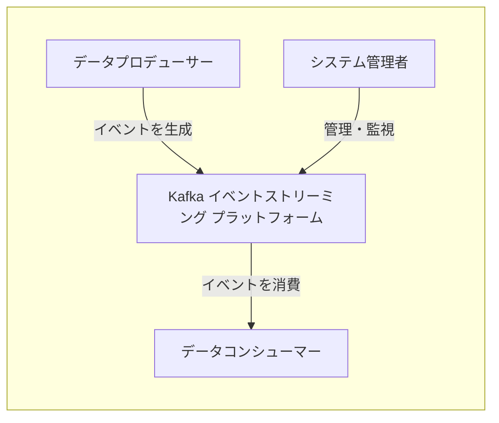
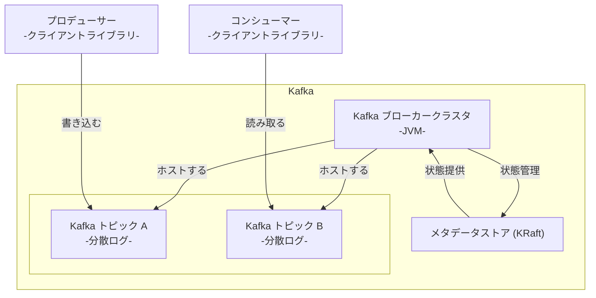
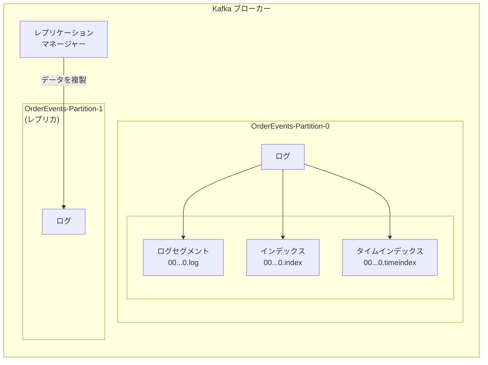
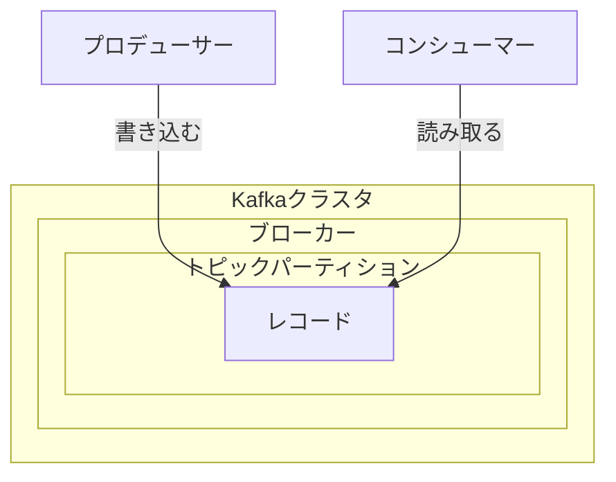
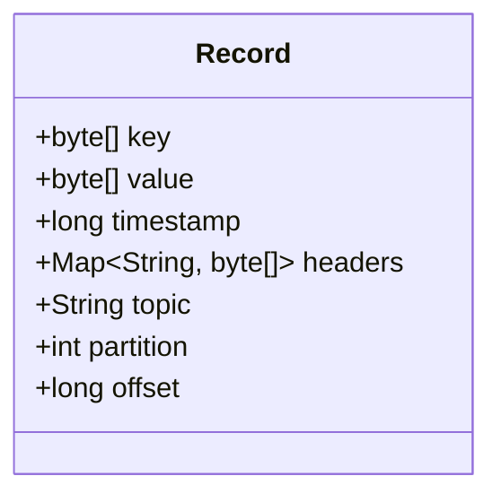

本記事は、Apache Kafkaを初めて学ぶ開発者や、分散データシステムの設計に関わるエンジニアを対象としています。マイクロサービスアーキテクチャやリアルタイムデータ処理の重要性が高まる現代において、その中核を担うイベントストリーミングプラットフォームであるKafkaの基本から実践的な運用まで、体系的に解説します。

## ■ 概要

Apache Kafkaは、オープンソースの分散イベントストリーミングプラットフォームです。
LinkedIn社で生まれ、現在はApache Software Foundationが管理しています。
このプラットフォームは、リアルタイムのデータパイプラインやストリーミングアプリケーションを構築するために設計されました。

Kafkaは、連続的かつ大量のデータストリームを処理するために、以下の3つの主要な機能を提供します。

  - **メッセージング (Pub/Sub)**
      - レコード（イベント）のストリームを公開（Publish）および購読（Subscribe）します。
  - **ストレージ (Storage)**
      - レコードのストリームを、耐障害性を持つ永続的な方法で、生成された順序のまま保存します。
  - **ストリーム処理 (Stream Processing)**
      - レコードのストリームをリアルタイムで処理、変換します。

Kafkaの心臓部は「コミットログ」と呼ばれる追記専用のログであり、ここにデータが永続的に保存されます。
この設計により、データは設定した期間保存され、複数のコンシューマーアプリケーションがそれぞれのペースで同じイベントストリームを再読み込みできます。
この **「リプレイ可能性」** という特徴は、システム間の時間的な結合を分離し、データ駆動型アーキテクチャの柔軟な設計を可能にします。
結果として、Kafkaは単なるデータ転送路ではなく、システム内で発生した全てのイベントに関する **信頼できる情報源（Source of Truth）** として機能します。

## ■ 特徴

Apache Kafkaは、その独自のアーキテクチャにより、以下の相互に関連する特徴を備えています。

  - **高スループット・低レイテンシ**
      - ディスクへのシーケンシャルな書き込みやゼロコピー技術により、毎秒数百万件のメッセージを約2ミリ秒という極めて低いレイテンシで処理します。
  - **スケーラビリティ**
      - データをトピック内のパーティションに分割し、サーバー（ブローカー）のクラスタ全体に分散配置します。
      - これにより、システム全体の水平方向への容易なスケールアウトが可能です。
  - **耐久性と耐障害性**
      - データはディスクに永続化され、耐久性を確保します。
      - パーティションを複数のブローカーに複製（レプリケーション）することで、耐障害性が向上します。
      - あるブローカーに障害が発生しても、別のブローカーが処理を引き継ぎ、データ損失のリスクを最小限に抑えます。
  - **システムの疎結合化**
      - メッセージを送信するプロデューサーと受信するコンシューマーは完全に分離されています。
      - プロデューサーとコンシューマーは、互いの状態を知ることなく、自身のペースで動作できます。
  - **豊富なエコシステムとコアAPI**
      - Kafkaは5つのコアAPIを中心に強力なエコシステムを形成しています。
          - **Producer API**: アプリケーションがレコードのストリームを公開（送信）するためのAPI。
          - **Consumer API**: アプリケーションがトピックを購読し、レコードのストリームを処理するためのAPI。
          - **Streams API**: イベントストリームをリアルタイムで変換・分析する、高機能なストリーム処理アプリケーションを構築するためのJavaライブラリ。
          - **Connect API**: データベースやSaaSなど、他のシステムとKafka間でデータを継続的に連携させるためのコネクタを構築・実行するフレームワーク。
          - **Admin API**: トピックやブローカーといったKafkaオブジェクトをプログラムで管理・監視するためのAPI。

これらの特徴は、「パーティション分割された複製ログ」という単一のアーキテクチャから生まれます。
ログ構造が高スループットを、そのパーティション分割がスケーラビリティを、そしてパーティションの複製が耐久性と耐障害性を実現しているのです。

## ■ 構造

Kafkaのアーキテクチャを、C4モデルを用いてシステムコンテキスト、コンテナ、コンポーネントの順に段階的に説明します。

### ● システムコンテキスト図

システムコンテキスト図は、Kafkaプラットフォームを一つのシステムとして捉え、外部のアクターやシステムとの関係を示します。



| 要素名 | 説明 |
| :--- | :--- |
| データプロデューサー | イベントを生成するアクター（例: ユーザーアプリケーション） |
| データコンシューマー | イベントを消費・処理するアクター（例: 分析サービス） |
| システム管理者 | プラットフォームを運用、管理、監視するアクター |
| Kafka イベントストリーミングプラットフォーム | イベントの収集、保存、配信を担う本レポートの対象システム |

### ● コンテナ図

コンテナ図は、Kafkaプラットフォームの内部を構成する主要なコンテナ（実行可能な単位）を示します。



| 要素名 | 説明 |
| :--- | :--- |
| Kafka ブローカークラスタ | 1つ以上のブローカーで構成される実行環境。トピックのパーティションをホストし、データの読み書きを処理する。 |
| メタデータストア (KRaft) | クラスタの状態（ブローカー情報、トピック設定など）を管理するコンポーネント。近年のバージョンでは、旧来のZooKeeperに代わりKRaftモードが主流。 |
| Kafka トピック | イベントを格納する論理的な単位。分散コミットログとして実装される。 |
| プロデューサー | Kafkaクライアントライブラリを利用し、ブローカークラスタを介してトピックにデータを書き込む外部アプリケーション。 |
| コンシューマー | Kafkaクライアントライブラリを利用し、ブローカークラスタを介してトピックからデータを読み取る外部アプリケーション。 |

### ● コンポーネント図

コンポーネント図は、単一のKafkaブローカーの内部構成要素を示します。ここでは「OrderEvents」トピックを例とします。



| 要素名 | 説明 |
| :--- | :--- |
| レプリケーションマネージャー | パーティションのリーダーとフォロワー間でデータを複製し、耐障害性を担当するコンポーネント。 |
| トピックパーティション | トピックの分割単位。並列処理とストレージの基本単位（例: `OrderEvents-Partition-0`）。 |
| ログ | 各パーティションの実体。ディスク上の追記専用ファイル。 |
| ログセグメント | ログを分割したファイル。古いセグメントの削除や検索を効率化する。 |
| インデックスファイル | メッセージを高速に検索するためのファイル。.indexはオフセット、.timeindexはタイムスタンプで検索する。 |

## ■ データ

Kafkaが内部で扱うデータの構造を、概念モデルと情報モデルの2段階で説明します。

### ● 概念モデル

概念モデルは、Kafkaのデータエンティティ間の高レベルな関係を示します。



| 要素名 | 説明 |
| :--- | :--- |
| Kafkaクラスタ | 複数のブローカーを含むKafkaシステム全体。 |
| ブローカー | クラスタを構成する個々のサーバー。 |
| トピックパーティション | トピックの分割単位。レコードの順序付けられたシーケンスを保持する。 |
| レコード | Kafkaで送受信されるデータの基本単位（メッセージ）。 |
| プロデューサー | レコードを生成し、トピックパーティションに書き込むクライアント。 |
| コンシューマー | トピックパーティションからレコードを読み取り、処理するクライアント。 |

### ● 情報モデル

情報モデルは、Kafkaのレコードが持つ具体的な属性をクラス図で示します。

Kafkaは **「Dumb Broker, Smart Client (賢くないブローカー、賢いクライアント)」** という設計思想に基づいています。
ブローカーはメッセージの内容を解釈せず、単なるバイト配列として扱います。これにより、ブローカーは高いパフォーマンスを維持します。
データのシリアライズとデシリアライズは、プロデューサーとコンシューマーのクライアント側が担当します。
このため、データ形式の互換性を長期的に維持するためには、Confluent Schema Registryのような外部のスキーマ管理システムを導入することが、堅牢なシステム構築において不可欠です。スキーマ管理は、意図しないデータ形式の変更によるシステム障害を防ぎます。



| 属性名 | 説明 |
| :--- | :--- |
| key | オプショナルなキー。パーティショニング戦略を決定するために使用。同じキーを持つレコードは同じパーティションに送られることが保証される。 |
| value | メッセージ本体のペイロード。実際のデータが格納される。 |
| timestamp | イベントのタイムスタンプ。レコードの生成時刻またはブローカーへの追記時刻。 |
| headers | オプショナルなキーバリュー形式のメタデータ（例: トレーシングID）。 |
| topic | レコードが属するトピック名（コンテキスト情報）。 |
| partition | レコードが格納されているパーティションID（コンテキスト情報）。 |
| offset | パーティション内でのレコードの一意なシーケンシャルID。 |

## ■ 構築方法

Kafka環境を構築する具体的な手順を説明します。本記事では Kafka v3.7.0 を想定しています。

### ● ローカル環境へのインストール

#### 前提条件

  - Java 17以降のインストール

#### 手順

1.  **Kafkaのダウンロードと展開**
      - Apache Kafka公式サイトから最新のバイナリリリースをダウンロードし、展開します。
    ```bash
    tar -xzf kafka_2.13-3.7.0.tgz
    cd kafka_2.13-3.7.0
    ```
2.  **クラスタUUIDの生成**
      - KRaftモードで動作させるため、一意なクラスタIDを生成します。
    ```bash
    KAFKA_CLUSTER_ID="$(bin/kafka-storage.sh random-uuid)"
    ```
3.  **ストレージディレクトリのフォーマット**
      - ログディレクトリを初期化します。
    ```bash
    bin/kafka-storage.sh format -t $KAFKA_CLUSTER_ID -c config/kraft/server.properties
    ```
4.  **Kafkaサーバーの起動**
      - 設定ファイルを指定してKafkaサーバーを起動します。
    ```bash
    bin/kafka-server-start.sh config/kraft/server.properties
    ```

### ● Dockerを利用した構築

より手軽に環境を試すには Docker が便利です。

#### 前提条件

  - Docker および Docker Compose のインストール

#### 手順

1.  **`docker-compose.yml` の作成**
      - 以下の内容で `docker-compose.yml` ファイルを作成します。KRaftモードの単一ノードKafkaを定義します。
    ```yaml
    version: '3'
    services:
      kafka:
        image: apache/kafka:latest
        container_name: kafka
        ports:
          - "9092:9092"
        environment:
          KAFKA_NODE_ID: 1
          KAFKA_PROCESS_ROLES: 'broker,controller'
          KAFKA_LISTENER_SECURITY_PROTOCOL_MAP: 'CONTROLLER:PLAINTEXT,PLAINTEXT:PLAINTEXT,PLAINTEXT_HOST:PLAINTEXT'
          KAFKA_LISTENERS: 'PLAINTEXT://:9093,CONTROLLER://:9094,PLAINTEXT_HOST://:9092'
          KAFKA_ADVERTISED_LISTENERS: 'PLAINTEXT_HOST://localhost:9092'
          KAFKA_CONTROLLER_QUORUM_VOTERS: '1@kafka:9094'
          KAFKA_CONTROLLER_LISTENER_NAMES: 'CONTROLLER'
          CLUSTER_ID: 'MkU3OEVBNTcwNTJENDM2Qk'
          KAFKA_OFFSETS_TOPIC_REPLICATION_FACTOR: 1
          KAFKA_GROUP_INITIAL_REBALANCE_DELAY_MS: 0
          KAFKA_TRANSACTION_STATE_LOG_REPLICATION_FACTOR: 1
          KAFKA_TRANSACTION_STATE_LOG_MIN_ISR: 1
    ```
2.  **Dockerコンテナの起動**
      - ファイルを保存したディレクトリで、以下のコマンドを実行します。
    ```bash
    docker-compose up -d
    ```

#### 設定

Kafkaの動作は主に設定ファイル（例: `server.properties`）によって制御されますが、特にDockerコンテナで実行する場合、環境変数を使用してこれらの設定を上書きするのが一般的です。

##### ブローカー設定に関する環境変数

| 変数名 | 設定名 | 意味 | デフォルト値 |
| :--- | :--- | :--- | :--- |
| `KAFKA_BROKER_ID` | `broker.id` | クラスタ内で各ブローカーを一位に識別するためのID。 | -1 |
| `KAFKA_LISTENERS` | `listeners` | ブローカーがクライアントからの接続を待機するリスナーのリスト（例: `PLAINTEXT://:9092`）。 | `PLAINTEXT://:9092` |
| `KAFKA_ADVERTISED_LISTENERS` | `advertised.listeners` | クライアントに公開するリスナーのリスト。Dockerなど、コンテナ内部と外部でアドレスが異なる場合に重要。 | `listeners`の値 |
| `KAFKA_LOG_DIRS` | `log.dirs` | Kafkaのログデータ（トピックのメッセージ）を保存するディレクトリのパス。 | `/tmp/kafka-logs` |
| `KAFKA_NUM_PARTITIONS` | `num.partitions` | トピックが自動作成される際のデフォルトのパーティション数。 | 1 |
| `KAFKA_DEFAULT_REPLICATION_FACTOR` | `default.replication.factor` | トピックが自動作成される際のデフォルトのレプリケーションファクター。 | 1 |
| `KAFKA_OFFSETS_TOPIC_REPLICATION_FACTOR` | `offsets.topic.replication.factor` | コンシューマーのオフセットを保存する内部トピックのレプリケーションファクター。 | 1 |
| `KAFKA_TRANSACTION_STATE_LOG_REPLICATION_FACTOR` | `transaction.state.log.replication.factor` | トランザクションの状態を保存する内部トピックのレプリケーションファクター。 | 1 |
| `KAFKA_COMPRESSION_TYPE` | `compression.type` | ブローカーが受信したメッセージを保存する際の圧縮タイプ（none, gzip, snappy, lz4, zstd, producer）。 | producer |

##### KRaftモード設定に関する環境変数

KRaftモードでは、ZooKeeperの代わりにコントローラーノードがクラスタのメタデータを管理します。

| 変数名 | 設定名 | 意味 | デフォルト値 |
| :--- | :--- | :--- | :--- |
| `KAFKA_PROCESS_ROLES` | `process.roles` | ノードの役割を定義します（`broker`, `controller`, または両方を兼ねる`broker,controller`）。 | (なし) |
| `KAFKA_NODE_ID` | `node.id` | KRaftモードにおけるノードの一意なID。`process.roles`が設定されている場合に必須。 | (なし) |
| `KAFKA_CONTROLLER_QUORUM_VOTERS` | `controller.quorum.voters` | コントローラークォーラムに参加するノードのリスト（例: `1@host1:9093,2@host2:9093`）。 | (なし) |
| `KAFKA_CONTROLLER_LISTENER_NAMES` | `controller.listener.names` | コントローラーが使用するリスナー名。 | (なし) |

##### クライアント設定に関する環境変数

プロデューサーやコンシューマーの設定も同様のルールで環境変数として渡すことができます。

| 変数名 | 設定名 | 意味 | デフォルト値 |
| :--- | :--- | :--- | :--- |
| `KAFKA_BOOTSTRAP_SERVERS` | `bootstrap.servers` | クライアントが最初に接続するブローカーのホストとポートのリスト。 | (なし) |
| `KAFKA_GROUP_ID` | `group.id` | コンシューマーが属するコンシューマーグループのID。 | null |
| `KAFKA_AUTO_OFFSET_RESET` | `auto.offset.reset` | コミットされたオフセットがない場合に、どこから読み始めるかを指定します（`latest`, `earliest`, `none`）。 | latest |
| `KAFKA_ENABLE_AUTO_COMMIT` | `enable.auto.commit` | オフセットを定期的に自動でコミットするかどうか。 | true |

##### その他の重要な環境変数

| 変数名 | 設定名 | 意味 | デフォルト値 |
| :--- | :--- | :--- | :--- |
| `KAFKA_HOME` | (なし) | Kafkaのインストールディレクトリへのパス。CLIツールを実行する際に参照されます。 | (なし) |
| `KAFKA_CLUSTER_ID` | (なし) | KRaftモードでストレージをフォーマットする際に使用されるクラスタの一意なID。 | (なし) |
| `KAFKA_HEAP_OPTS` | (なし) | Kafkaプロセスを実行するJVMのヒープサイズを設定します（例: `-Xmx2G -Xms2G`）。 | (なし) |

## ■ 利用方法

構築したKafkaクラスタを利用する方法を説明します。

### ● コマンドラインツール (CLI) での操作

Kafkaには、ターミナルからクラスタを操作するCLIツールが同梱されています。

1.  **トピックの作成**
      - `kafka-topics.sh`を使い、`quickstart-events`という名前のトピックを作成します。
    ```bash
    # Docker環境の場合は bin/kafka-topics.sh を `docker exec -it kafka /opt/kafka/bin/kafka-topics.sh` に読み替えてください
    bin/kafka-topics.sh --create --topic quickstart-events --bootstrap-server localhost:9092
    ```
2.  **メッセージの送信 (Produce)**
      - `kafka-console-producer.sh`を使い、コンソールからメッセージを送信します。
    ```bash
    bin/kafka-console-producer.sh --topic quickstart-events --bootstrap-server localhost:9092
    >This is my first event
    >This is my second event
    ```
3.  **メッセージの受信 (Consume)**
      - 別のターミナルで`kafka-console-consumer.sh`を使い、メッセージを受信します。`--from-beginning`オプションは、トピックの全てのメッセージを最初から読み取ります。
    ```bash
    bin/kafka-console-consumer.sh --topic quickstart-events --from-beginning --bootstrap-server localhost:9092
    This is my first event
    This is my second event
    ```

### ● Javaクライアントでの操作

アプリケーションからKafkaを利用するJavaクライアントの使用方法を示します。

1.  **依存関係の追加**
      - Mavenプロジェクトの`pom.xml`に`kafka-clients`の依存関係を追加します。
    ```xml
    <dependency>
        <groupId>org.apache.kafka</groupId>
        <artifactId>kafka-clients</artifactId>
        <version>3.7.0</version>
    </dependency>
    ```
2.  **プロデューサーの実装例**
      - メッセージを送信するJavaプロデューサーのコードです。
      - `bootstrap.servers`、`key.serializer`、`value.serializer`の指定が重要です。
    ```java
    import org.apache.kafka.clients.producer.*;
    import org.apache.kafka.common.serialization.StringSerializer;
    import java.util.Properties;

    public class SimpleProducer {
        public static void main(String[] args) {
            Properties props = new Properties();
            props.put(ProducerConfig.BOOTSTRAP_SERVERS_CONFIG, "localhost:9092");
            props.put(ProducerConfig.KEY_SERIALIZER_CLASS_CONFIG, StringSerializer.class.getName());
            props.put(ProducerConfig.VALUE_SERIALIZER_CLASS_CONFIG, StringSerializer.class.getName());

            try (Producer<String, String> producer = new KafkaProducer<>(props)) {
                for (int i = 0; i < 10; i++) {
                    String topic = "quickstart-events";
                    String key = "id_" + i;
                    String value = "message " + i;
                    ProducerRecord<String, String> record = new ProducerRecord<>(topic, key, value);
                    producer.send(record); // 非同期送信
                    System.out.printf("Sent record with key %s and value %s%n", key, value);
                }
                producer.flush(); // 全てのレコードの送信を待機
            }
        }
    }
    ```
3.  **コンシューマーの実装例**
      - メッセージを受信するJavaコンシューマーのコードです。
      - `group.id`は、コンシューマーグループを識別するために必須です。
    ```java
    import org.apache.kafka.clients.consumer.*;
    import org.apache.kafka.common.serialization.StringDeserializer;
    import java.time.Duration;
    import java.util.Collections;
    import java.util.Properties;

    public class SimpleConsumer {
        public static void main(String[] args) {
            Properties props = new Properties();
            props.put(ConsumerConfig.BOOTSTRAP_SERVERS_CONFIG, "localhost:9092");
            props.put(ConsumerConfig.GROUP_ID_CONFIG, "my-java-consumer-group");
            props.put(ConsumerConfig.KEY_DESERIALIZER_CLASS_CONFIG, StringDeserializer.class.getName());
            props.put(ConsumerConfig.VALUE_DESERIALIZER_CLASS_CONFIG, StringDeserializer.class.getName());
            props.put(ConsumerConfig.AUTO_OFFSET_RESET_CONFIG, "earliest");

            try (KafkaConsumer<String, String> consumer = new KafkaConsumer<>(props)) {
                consumer.subscribe(Collections.singletonList("quickstart-events"));
                while (true) {
                    ConsumerRecords<String, String> records = consumer.poll(Duration.ofMillis(100));
                    for (ConsumerRecord<String, String> record : records) {
                        System.out.printf("Received record with key %s, value %s, partition %d, offset %d%n",
                                record.key(), record.value(), record.partition(), record.offset());
                    }
                }
            }
        }
    }
    ```

## ■ 運用

Kafkaクラスタを安定して稼働させるための主要な運用タスクを説明します。

### ● トピック管理

  - **トピックの一覧表示と詳細確認**
      - `--list`オプションでトピックを一覧表示します。
      - `--describe`オプションでパーティション数などの詳細情報を確認します。
    ```bash
    # トピックの一覧表示
    bin/kafka-topics.sh --list --bootstrap-server localhost:9092

    # トピックの詳細表示
    bin/kafka-topics.sh --describe --topic quickstart-events --bootstrap-server localhost:9092
    ```
  - **トピックの変更**
      - `--alter`オプションで既存のトピックの設定を変更します。
      - スループット向上のためにパーティション数を増やす操作が一般的です。
    ```bash
    # quickstart-eventsトピックのパーティション数を3に増やす
    bin/kafka-topics.sh --alter --topic quickstart-events --partitions 3 --bootstrap-server localhost:9092
    ```

### ● コンシューマーグループ管理

  - **コンシューマーグループの一覧表示と詳細確認**
      - `kafka-consumer-groups.sh`を使用します。
      - `--describe`の出力で、コンシューマーの処理遅延を示す`LAG`を確認できます。`LAG`は運用上最も重要な指標の一つです。
    ```bash
    # コンシューマーグループの一覧表示
    bin/kafka-consumer-groups.sh --list --bootstrap-server localhost:9092

    # 特定のコンシューマーグループの詳細表示
    bin/kafka-consumer-groups.sh --describe --group my-java-consumer-group --bootstrap-server localhost:9092
    ```
  - **オフセット管理**
      - `--reset-offsets`で、コンシューマーの読み取り位置（オフセット）を強制的に変更します。
      - データの再処理や、問題のあるメッセージをスキップする際に使用します。
    ```bash
    # my-java-consumer-groupのオフセットを先頭にリセットする（ドライラン）
    bin/kafka-consumer-groups.sh --reset-offsets --to-earliest --group my-java-consumer-group --topic quickstart-events --bootstrap-server localhost:9092 --dry-run

    # 実際に実行するには --execute オプションを追加
    bin/kafka-consumer-groups.sh --reset-offsets --to-earliest --group my-java-consumer-group --topic quickstart-events --execute --bootstrap-server localhost:9092
    ```

### ● 監視

Kafkaクラスタの健全性を維持するために、継続的な監視が必要です。

  - **主要な監視メトリクス**
      - **ブローカーの健全性**: CPU使用率、メモリ使用量、ディスク空き容量などの基本的なリソース状況。
      - **コンシューマーラグ**: コンシューマーが最新データからどれだけ遅れているかを示す指標。ラグの増大はデータ処理の遅延を示唆する。
      - **スループットとレイテンシ**: クラスタ全体のメッセージ処理性能。
      - **Under-replicated Partitions**: レプリカ数が設定値を下回っているパーティションの数。0より大きい場合、耐障害性が低下している危険な状態。
  - **監視ツール**
      - KafkaはJMX経由で多数のメトリクスを公開します。以下のツールで収集と可視化が可能です。
          - Confluent Control Center
          - Prometheus & Grafana
          - Datadog, New Relic

コンシューマーラグは、下流のアプリケーションが処理しているデータの「鮮度」を示すビジネス指標でもあります。
ラグの急増は、単なる技術的な問題に留まりません。例えば、ECサイトの在庫更新の遅延が販売機会の損失に繋がったり、金融取引の不正検知の遅れが金銭的な損害を引き起こしたりと、**ビジネスインパクトに直結する可能性**があります。
そのため、ラグの監視とアラート設定は、ビジネスのサービスレベル目標（SLO）に基づいて定義するべきです。

## ■ まとめ

Kafkaは、単なるメッセージを転送するパイプラインではありません。それは、リアルタイムに発生する無数のイベントを捉え、ビジネスの意思決定を加速させる**デジタル社会の神経系**とも言える存在です。システムの疎結合化を促進し、スケーラブルで耐障害性の高いデータ基盤を構築する上で、Kafkaが果たす役割はますます重要になっています。

この記事で基本をマスターしたあなたは、ぜひ次のステップへ進んでみてください。

  * **Kafka Streams**: リアルタイムなデータ変換や集計アプリケーションを開発する。
  * **Kafka Connect**: コーディング不要でデータベースやクラウドサービスとデータ連携を実現する。
  * **セキュリティ**: 本番運用に不可欠な認証・認可・暗号化を設定する。
  * **パフォーマンスチューニング**: `acks`, `batch.size`, `compression.type` などの設定を調整し、性能を最大化する。

Kafkaのエコシステムは広大で、データ活用の可能性を無限に広げてくれます。この記事が、その探求の旅を始めるきっかけとなれば幸いです。

この記事が少しでも参考になった、あるいは改善点などがあれば、ぜひリアクションやコメント、SNSでのシェアをいただけると励みになります！

---

## ■ 参考リンク

  - **公式ドキュメント**
      - [Apache Kafka](https://kafka.apache.org/)
      - [Architecture - Apache Kafka](https://kafka.apache.org/11/documentation/streams/architecture)
      - [Data Types and Serialization - Apache Kafka](https://kafka.apache.org/20/documentation/streams/developer-guide/datatypes)
      - [Apache Kafka Quickstart](https://kafka.apache.org/quickstart)
      - [Introduction to Apache Kafka | Confluent Documentation](https://docs.confluent.io/kafka/introduction.html)
      - [Java Client for Apache Kafka | Confluent Documentation](https://docs.confluent.io/kafka-clients/java/current/overview.html)
      - [Kafka Command Line Interface (CLI) Tools | Confluent Documentation](https://docs.confluent.io/kafka/operations-tools/kafka-tools.html)
      - [AI Model Inference and Machine Learning Functions in Confluent Cloud for Apache Flink](https://docs.confluent.io/cloud/current/flink/reference/functions/model-inference-functions.html)
  - **GitHub**
      - [Mirror of Apache Kafka - GitHub](https://github.com/apache/kafka)
  - **記事**
      - [Apache Kafka - Wikipedia](https://ja.wikipedia.org/wiki/Apache_Kafka)
      - [Kafka とは何ですか? - Apache Kafka の説明 - AWS](https://aws.amazon.com/jp/what-is/apache-kafka/)
      - [Apache Kafka とは | Google Cloud](https://cloud.google.com/learn/what-is-apache-kafka?hl=ja)
      - [Apache Kafkaとは - IBM](https://www.ibm.com/jp-ja/think/topics/apache-kafka)
      - [Apache Kafka とは？| Confluent | JP](https://www.confluent.io/ja-jp/what-is-apache-kafka/)
      - [Apache Kafka：基本的な 10 の用語と概念について - Red Hat](https://www.redhat.com/ja/blog/apache-kafka-10-essential-terms-and-concepts-explained)
      - [Deep dive into Apache Kafka storage internals: segments, rolling ...](https://strimzi.io/blog/2021/12/17/kafka-segment-retention/)
      - [Kafka Message Key: A Comprehensive Guide - Confluent](https://www.confluent.io/learn/kafka-message-key/)
      - [APACHE KAFKA: Message Format | Orchestra](https://www.getorchestra.io/guides/apache-kafka-message-format)
      - [Kafka Cheat Sheet - Redpanda](https://www.redpanda.com/guides/kafka-tutorial-kafka-cheat-sheet)
      - [Intro to Apache Kafka with Spring | Baeldung](https://www.baeldung.com/spring-kafka)
      - [Monitoring Apache Kafka](https://www.redpanda.com/guides/kafka-performance-kafka-monitoring)
      - [How to Install and Run Apache Kafka on Windows? - GeeksforGeeks](https://www.geeksforgeeks.org/installation-guide/how-to-install-and-run-apache-kafka-on-windows/)
      - [Apache Kafkaインストールからチュートリアルまで - Qiita](https://qiita.com/tic40/items/92cd3801b3f2d281b38d)
      - [【2024年保存版】Apache Kafka入門 – 実践で使えるポイントを徹底解説！](https://dexall.co.jp/articles/?p=669)
      - [Apache Kafka シリーズ ～そもそもKafkaって？～ | SIOS Tech. Lab](https://tech-lab.sios.jp/archives/31993)
      - [Kafkaの実際の使い方や落とし穴 \#機械学習 - Qiita](https://qiita.com/machinelearning2/items/f7aa0317ef64cbe86a15)
      - [Kafka Architecture - GeeksforGeeks](https://www.geeksforgeeks.org/apache-kafka/kafka-architecture/)
      - [Apache Kafka 詳細情報 | OSSサポートのOpenStandia™【NRI】](https://openstandia.jp/oss_info/apachekafka/)
      - [Kafka Topic Internals: Segments and Indexes | Learn Apache Kafka](https://learn.conduktor.io/kafka/kafka-topics-internals-segments-and-indexes/)
      - [Apache Kafkaとは何ぞや \~Kafkaを支えるプラットフォーム\~ | SIOS Tech. Lab](https://tech-lab.sios.jp/archives/40145)
      - [Kafka Headers—Use cases, best practices, and alternatives - Redpanda](https://www.redpanda.com/guides/kafka-cloud-kafka-headers)
      - [Using custom Kafka headers for advanced message processing - Tinybird](https://www.tinybird.co/blog-posts/using-custom-kafka-headers)
      - [How to create a Kafka producer in Java - Coding Harbour](https://codingharbour.com/apache-kafka/how-to-create-kafka-producer-in-java/)
      - [Kafka Producer and Consumer Examples Using Java - DZone](https://dzone.com/articles/kafka-producer-and-consumer-example)
      - [Tutorial: Apache Kafka Producer & Consumer APIs - Azure HDInsight | Microsoft Learn](https://learn.microsoft.com/en-us/azure/hdinsight/kafka/apache-kafka-producer-consumer-api)
      - [Kafka Topics CLI Tutorial | Learn Apache Kafka with Conduktor](https://learn.conduktor.io/kafka/kafka-topics-cli-tutorial/)
      - [Apache Kafka GUI Management and Monitoring - Confluent](https://www.confluent.io/product/confluent-platform/gui-driven-management-and-monitoring/)
