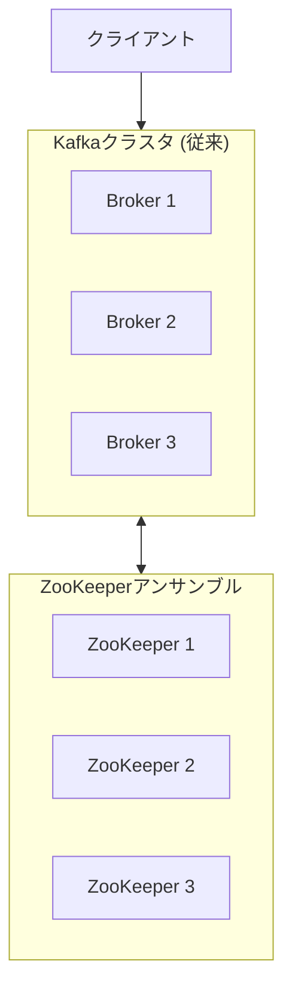
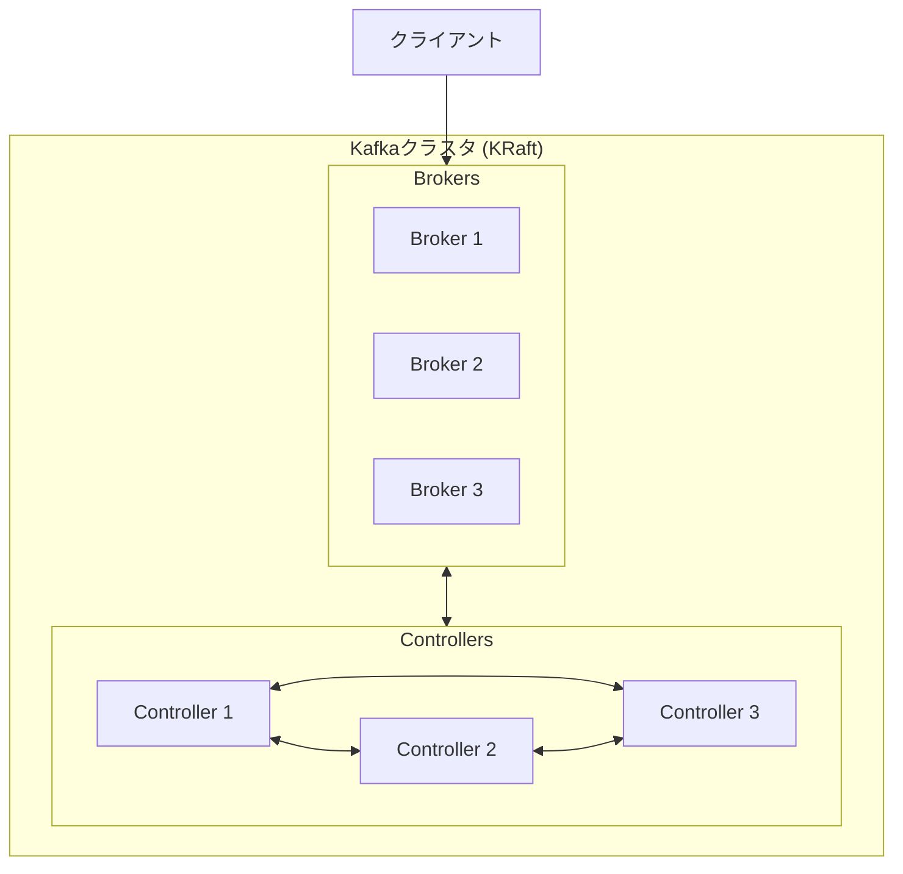
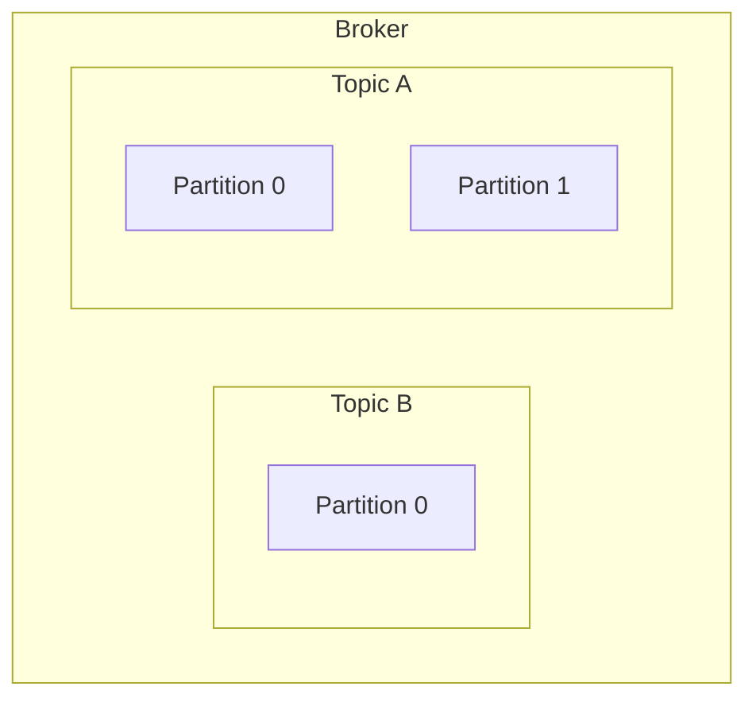
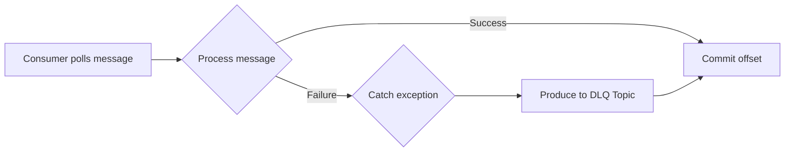
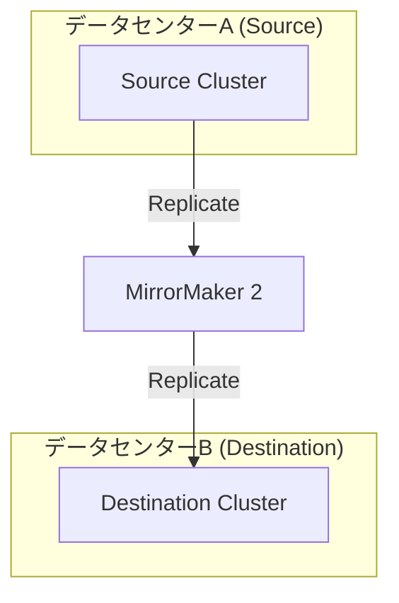
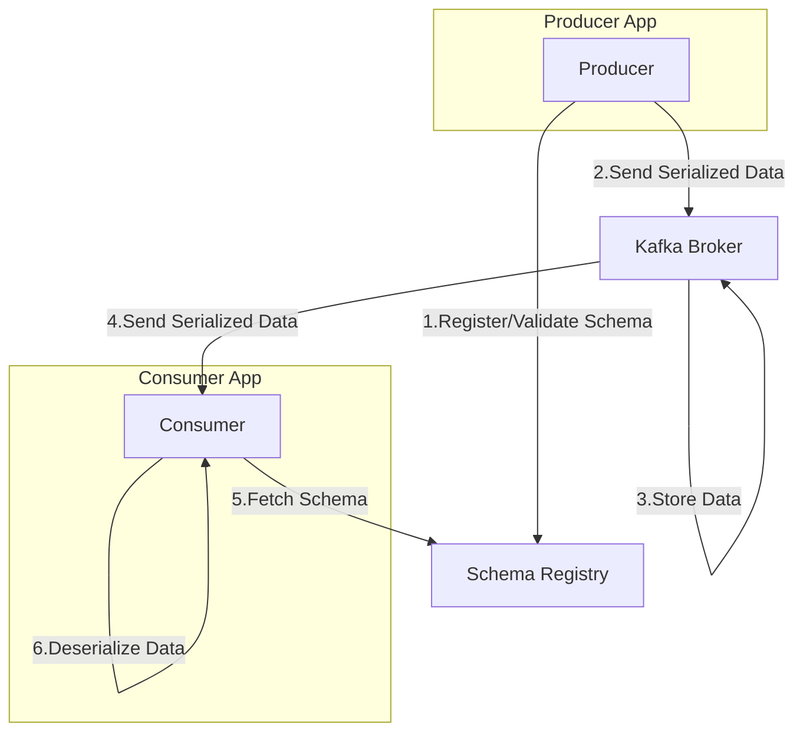
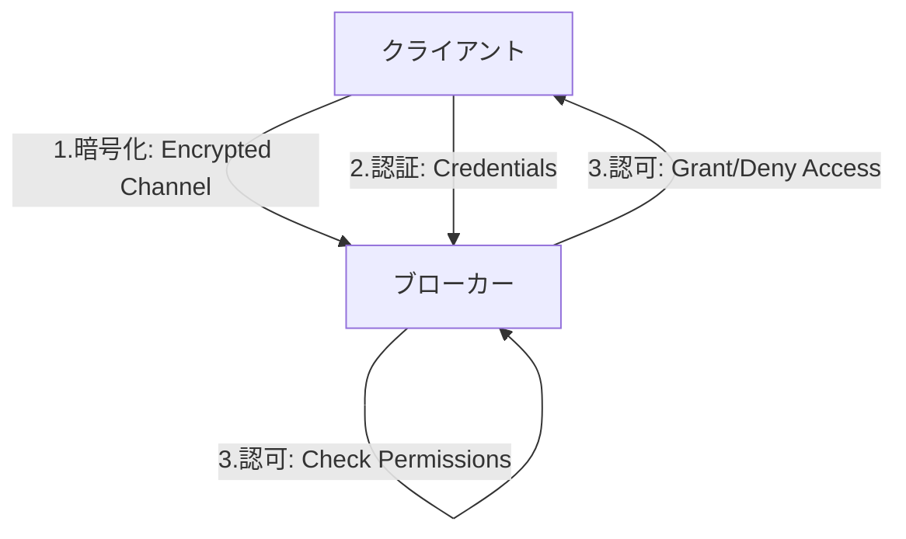

この記事は、Apache Kafkaを本番環境で安定して運用するためのベストプラクティスをまとめたものです。対象読者として、Kafkaクラスタの設計、構築、運用を担当するインフラエンジニアやソフトウェアアーキテクトを想定しています。アーキテクチャ設計からクライアント実装、クラスタ運用、セキュリティ、監視に至るまで、実践的な指針を示します。

Kafkaの基本的な情報は以下の記事にまとめてあります。

https://zenn.dev/suwash/articles/kafka_20250928

### 1. 基盤となるアーキテクチャと設計原則

Kafkaクラスタの土台となるアーキテクチャと、データの論理構造に関する設計原則について説明します。ここでの決定は後からの変更が困難なため、特に重要です。

#### 1.1. コアアーキテクチャの変遷: ZooKeeperからKRaftへ

Kafkaのアーキテクチャは、ZooKeeperへの依存をなくしたKRaft（Kafka Raft）モードへと進化しました。

##### クラシックアーキテクチャ：ZooKeeperモデル

従来のアーキテクチャでは、データ操作を担当するKafkaブローカーと、クラスタのメタデータ管理を担当するZooKeeperという、2つの異なる分散システムを運用する必要がありました。



| 要素名 | 説明 |
| :--- | :--- |
| クライアント | メッセージを送受信するアプリケーション |
| Broker | データプレーンを管理。メッセージの送受信を担当 |
| ZooKeeper | コントロールプレーンを管理。クラスタのメタデータや設定情報を保持 |

##### モダンアーキテクチャ：KRaftモード

KRaftモードでは、ZooKeeperが担っていたメタデータ管理機能がKafkaブローカーに統合されました。これにより、Kafkaは単一のシステムとして運用可能になり、運用が大幅に簡素化されます。

**新規のデプロイメントでは、KRaftモードを標準として採用することを強く推奨します。**



| 要素名 | 説明 |
| :--- | :--- |
| クライアント | メッセージを送受信するアプリケーション |
| Controller | コントロールプレーンを管理。メタデータをKafkaネイティブのログで管理 |
| Broker | データプレーンを管理。メッセージの送受信を担当 |

**KRaftモードの利点**

  * **運用上の簡素化**: 管理対象が単一の分散システムとなり、設定や監視が容易になります。
  * **スケーラビリティとパフォーマンスの向上**: メタデータ管理が効率化され、クラスタがサポートできるパーティション数が大幅に増加します。
  * **統一されたセキュリティモデル**: セキュリティモデルがKafka内に統合され、管理が容易になります。

#### 1.2. トピックとパーティションの戦略

トピックとパーティションはKafka内のデータの論理構造を定義し、アプリケーションのスケーラビリティやデータガバナンスに直接影響します。



| 要素名 | 説明 |
| :--- | :--- |
| Broker | Kafkaクラスタを構成するサーバー |
| Topic | メッセージを分類するためのカテゴリ名 |
| Partition | トピックを分割する単位。並列処理とスケーラビリティの鍵 |

##### トピックの命名規則

大規模な環境では、規律ある命名規則が不可欠です。ドット区切りの階層的なパターンを推奨します。

**パターン:** `<ドメイン>.<データ型>.<環境>.<バージョン>`

**例:** `sales.orders.prod.v1`

**利点**

  * **発見の容易性**: 構造化された名前により、検索とフィルタリングが容易になります。
  * **きめ細やかなセキュリティ**: プレフィックスベースのACLによる効率的なアクセス管理が可能です。
  * **自動化の促進**: CI/CDパイプラインや監視ツールによる自動処理が簡素化されます。

##### トピックの作成戦略

本番環境では、トピックの自動作成機能（`auto.create.topics.enable=true`）を無効にしてください。自動作成されたトピックはデフォルト設定を使用するため、パフォーマンスや耐障害性で意図しない問題が生じる可能性があります。

トピックは、GitOpsやTerraformなどを利用し、CI/CDパイプラインを通じて宣言的に管理することを推奨します。

##### パーティション数の決定

パーティション数は、スループット、並列処理、将来の拡張性を考慮して決定する必要があります。

  * **スループットに基づく計算**: 以下の式が目安となります。
    $$\text{パーティション数} = \max(\frac{\text{目標スループット}}{\text{プロデューサーのスループット}}, \frac{\text{目標スループット}}{\text{コンシューマーのスループット}})$$
  * **並列処理の制約**: コンシューマーグループ内の最大並列処理数はパーティション数によって決まります。
  * **将来の拡張性**: パーティション数は後から増やせますが、キーを持つメッセージの順序保証に影響が出る可能性があります。キーのハッシュ値で送信先パーティションが決まるため、パーティション数を変更すると同じキーが異なるパーティションに割り当てられるためです。将来のピーク時スループットを処理できる数を初期段階で設定することが重要です。

**パーティション数の計算サンプル**

| パラメータ | 設定値 | 説明 |
| :--- | :--- | :--- |
| **目標スループット** | 100万件/s | ピーク時にシステム全体で処理したい秒間データ量。 |
| **単一プロデューサーのスループット** | 20万件/s | プロデューサーの1インスタンスがKafkaに書き込める秒間データ量。 |
| **単一コンシューマーのスループット**| 10万件/s | コンシューマーの1インスタンス（またはスレッド）がKafkaからデータを読み込み、ビジネスロジックを処理できる秒間データ量。通常、DBへの書き込みなど複雑な処理を伴うため、プロデューサーより遅いことが多いです。 |

1.  **プロデューサー側で必要な並列数（パーティション数）を計算**

    $$\frac{100 \text{万件/s}}{20 \text{万件/s}} = 5$$

    目標の書き込みスループットを達成するには、最低でも5つのプロデューサーインスタンスが並列で書き込める環境が必要。

2.  **コンシューマー側で必要な並列数（パーティション数）を計算**

    $$\frac{100 \text{万件/s}}{10 \text{万件/s}} = 10$$

    目標の読み込み・処理スループットを達成するには、最低でも10のコンシューマーインスタンスが並列で処理できる環境が必要。

3.  **両者を比較し、最大値を選択**

    $$\text{パーティション数} = \max(5, 10) = 10$$

##### レプリケーション設定

データの耐久性と高可用性を確保するために、以下の設定を推奨します。

$$
\text{min.insync.replicas} = \text{replication.factor} − 1
$$

**mreplication.factor = 5 の場合でのサンプル**

| `min.insync.replicas` の値 | 特徴 | メリット | デメリット |
| :--- | :--- | :--- | :--- |
| **5** | **最も厳格** | データ耐久性が最大化される。 | **非推奨**。1台のブローカーが一時的に遅延しただけで書き込みが停止してしまい、可用性が著しく低い。 |
| **4** | **推奨** | 1台のブローカー障害を許容しつつ、高いデータ耐久性を維持する。**耐久性と可用性のバランスが最も良い**。 | 2台のブローカーが同時に故障すると書き込みが停止する。 |
| **3** | **可用性をより重視** | 2台のブローカー障害まで書き込みを継続できる。 | 書き込みが成功した時点でレプリカが3台しか存在しない可能性があり、その直後に複数の障害が重なると、`4` の場合に比べてデータ損失のリスクがわずかに高まる。 |
| **2** | **非推奨** | 3台のブローカー障害まで書き込みが可能になるが、可用性と引き換えにデータ損失のリスクがかなり高まる。 | データ耐久性が低い。 |
| **1** | **非推奨** | リーダーさえ生きていれば書き込みが可能。 | リーダーに書き込んだ直後にそのリーダーが失われると、データ損失が確定する。 |

つまり、何台のブローカー障害を許容するかの要件に合わせて設定を調整します。

#### 補足：順序保証の罠とクラスタ分割単位の重要性

パーティション数の決定は、将来のスケーラビリティに直結しますが、特に大規模な共有クラスタでは順序保証の問題が複雑化します。

> 順序性の問題はクラスタに接続するシステムが増えるほど複雑化します。
> パーティション数を追加してスケールアウトする場合、同一キーのメッセージが異なるパーティションに再配置され、**順序を維持するためには接続する全システムを一時停止させる必要が出てきます**。現実的に全社規模のクラスタを完全停止させることは困難であり、Kafka に順序性の担保を全面的に依存する設計はリスクが高いといえます。
>
> 順序性は Kafka に任せるのではなく、**各システムの設計で担保すべき責務**です。例えば、アクティビティログのように「発生順が多少前後してもタイムスタンプで再構成できる」ようにする、注文や決済のように「最終的な正しさを DB のトランザクションで保証する」といったアプローチが必要です。

この観点からも、**SLO・責任境界・レイテンシ・セキュリティ特性が異なるユースケースは同一クラスタに押し込めるべきではありません**。クラスタをドメインやシステム単位で分割しておけば、順序性とスケールの問題はシンプルに扱え、障害や変更の影響範囲も限定できます。


### 2. クライアントサイドのベストプラクティス

Kafkaとデータをやり取りするクライアント（プロデューサー、コンシューマー）の設定は、システムの信頼性とパフォーマンスに直接影響します。

#### 2.1. 高信頼性プロデューサー

プロデューサーの設定は、データの耐久性、順序、スループットのバランスを決定します。データ損失が許容されない本番ワークロードでは、データの完全性を最優先する設定が不可欠です。

##### 主要なプロデューサー設定

| パラメータ | 推奨値 | 主な目的と理由 |
| :--- | :--- | :--- |
| `acks` | `all` | 耐久性の最大化。リーダー障害時のデータ損失を防止します。 |
| `enable.idempotence` | `true` | 正確性の確保。リトライによるメッセージ重複を防止します（べき等性）。 |
| `retries` | `2147483647` (Integer.MAX\_VALUE) | 障害処理。一時的なブローカー利用不能状態からの自動回復を可能にします。 |
| `delivery.timeout.ms` | `60000` 以上 | メッセージの有効期限。リトライとリーダー選出に必要な時間を考慮します。 |
| `linger.ms` | `5` - `25` | スループット向上。バッチ処理を有効化し、送信リクエスト数を削減します（0はアンチパターン）。 |
| `batch.size` | `65536` - `131072` (64-128KB) | スループット向上。バッチサイズを増やしネットワークオーバーヘッドを削減します。 |
| `compression.type` | `lz4` or `zstd` | ネットワーク/ストレージの効率化。CPUとのトレードオフでデータを圧縮します。 |

##### Exactly-Onceセマンティクス（EOS）

分散システムにおいて「メッセージが正確に1回だけ処理される」ことを保証する機能です。

  * **べき等プロデューサー (`enable.idempotence=true`)**: プロデューサーのリトライによるメッセージ重複を防ぎます。
  * **トランザクションプロデューサー (`transactional.id`)**: 複数のトピックやパーティションにまたがる一連の書き込みをアトミックに実行します。

**サンプル**

```java
import org.apache.kafka.clients.producer.KafkaProducer;
import org.apache.kafka.clients.producer.Producer;
import org.apache.kafka.clients.producer.ProducerConfig;
import org.apache.kafka.clients.producer.ProducerRecord;
import org.apache.kafka.common.KafkaException;
import org.apache.kafka.common.serialization.StringSerializer;

import java.util.Properties;
import java.util.UUID;

public class TransactionalProducerExample {
    public static void main(String args) {
        Properties props = new Properties();
        props.put(ProducerConfig.BOOTSTRAP_SERVERS_CONFIG, "your-kafka-broker:9092");
        props.put(ProducerConfig.KEY_SERIALIZER_CLASS_CONFIG, StringSerializer.class.getName());
        props.put(ProducerConfig.VALUE_SERIALIZER_CLASS_CONFIG, StringSerializer.class.getName());

        // --- トランザクションプロデューサーを有効にする ---
        // 1. べき等性を有効にする（transactional.id設定時に自動で有効化）
        props.put(ProducerConfig.ENABLE_IDEMPOTENCE_CONFIG, "true");
        // 2. ユニークなトランザクションIDを設定する
        props.put(ProducerConfig.TRANSACTIONAL_ID_CONFIG, "my-unique-transactional-id-" + UUID.randomUUID());

        Producer<String, String> producer = new KafkaProducer<>(props);

        // トランザクションを開始する前に初期化が必要
        producer.initTransactions();

        try {
            // トランザクションを開始
            producer.beginTransaction();

            // --- このブロック内の送信はすべてアトミックに行われる ---
            System.out.println("Sending messages within a transaction...");
            producer.send(new ProducerRecord<>("topic-A", "key1", "transactional message 1"));
            producer.send(new ProducerRecord<>("topic-B", "key2", "transactional message 2"));

            // 例: ここでエラーが発生したと仮定する
            // if (true) {
            //     throw new RuntimeException("Something went wrong!");
            // }

            // すべての送信が成功したらトランザクションをコミット
            producer.commitTransaction();
            System.out.println("Transaction committed successfully.");

        } catch (KafkaException e) {
            // エラーが発生した場合はトランザクションをアボート（中止）
            // アボートされたトランザクション内のメッセージはコンシューマーから見えなくなる
            producer.abortTransaction();
            System.err.println("Transaction aborted due to an error: " + e.getMessage());
        } finally {
            producer.close();
        }
    }
}
```

#### 2.2. 回復力のあるコンシューマー

コンシューマーの設定は、処理の保証レベル、耐障害性、システム全体のパフォーマンスを左右します。

##### オフセット管理とコミット戦略

コンシューマーの進捗はオフセットによって追跡されます。`enable.auto.commit` は `false` に設定し、アプリケーションロジックに基づいて手動でコミットしてください。自動コミットはデータ損失のリスクが高いため、本番環境での使用は避けるべきです。

| 戦略 | メカニズム | パフォーマンスへの影響 | 保証とリスク |
| :--- | :--- | :--- | :--- |
| **手動同期** | アプリケーションが処理後に`commitSync()`を呼び出す。コミット完了までブロックされる。 | 低 | **At-least-once（最低1回）**。データ損失はないが、リトライ時に重複処理のリスクあり。 |
| **手動非同期** | アプリケーションが`commitAsync()`を呼び出す。ブロックしない。 | 高 | **At-least-once（最低1回）**。データ損失はないが、重複処理のリスクあり。失敗したコミットはリトライされないため注意が必要。 |

##### コンシューマーグループのリバランス

コンシューマーの増減で発生するリバランスは、処理の遅延を引き起こす可能性があります。

  * **問題点**: 従来のリバランスは、グループ内の全コンシューマーの処理を一時停止させる「Stop-the-World」イベントでした。
  * **解決策**: **協調的リバランス** (`partition.assignment.strategy`に`CooperativeStickyAssignor`などを設定）を使用してください。これにより、リバランスの影響が最小限に抑えられ、処理の停止時間が大幅に短縮されます。

##### エラー処理：デッドレターキュー（DLQ）

処理できないメッセージによってパーティション全体の処理が停止することを防ぐため、デッドレターキュー（DLQ）パターンを実装してください。



| 要素名 | 説明 |
| :--- | :--- |
| Consumer polls message | コンシューマーがメッセージを取得 |
| Process message | メッセージの処理ロジック |
| Commit offset | 処理が成功した場合、オフセットをコミット |
| Catch exception | 処理で回復不能な例外が発生 |
| Produce to DLQ Topic | 失敗したメッセージをデッドレターキュー用のトピックへ送信 |

このパターンにより、問題のあるメッセージを本流から隔離し、後で分析や再処理が可能になります。

### 3. ブローカーとクラスタの運用

クラスタの安定性、パフォーマンス、コスト効率を確保するための物理的・運用上のベストプラクティスを解説します。

#### 3.1. クラスタのサイジングとハードウェア

ワークロードの要件を満たしつつ、インフラコストを最適化するバランスを取ることが重要です。

##### ハードウェアの推奨事項

| コンポーネント | 推奨事項 | 理由 |
| :--- | :--- | :--- |
| **CPU** | 現代的なマルチコアプロセッサ | TLS暗号化や圧縮はCPU負荷を増加させるため。 |
| **メモリ** | 32GB～64GB | OSのページキャッシュを最大化し、高性能な読み書きを実現するため。JVMヒープは4GB～8GB程度に抑えることが一般的。 |
| **ストレージ** | SSD | 低遅延と高I/Oスループットを確保するため。 |
| **ディスク構成** | JBOD (Just a Bunch of Disks) | 耐障害性はKafkaのレプリケーションが提供するためRAIDは不要。JBODでディスクI/Oを並列化し性能を向上させます。 |

##### OSレベルのチューニング (Linux)

Kafkaのパフォーマンスを最大化するには、OSのチューニングが不可欠です。

| 設定項目 | 推奨値 | 理由 |
| :--- | :--- | :--- |
| **ファイルディスクリプタ (`ulimit -n`)** | 100,000以上 | Kafkaは多数のファイルハンドルを使用するため。 |
| **スワップ (`vm.swappiness`)** | 1 (非常に低い値) | メモリスワップを避け、OSページキャッシュの利用を最大化するため。 |
| **ファイルシステム** | XFS または ext4 | Kafkaでの豊富な使用実績があるため。 |

#### 3.2. 高度な設定と耐障害性

##### ラックアウェアネス

データセンターのラック障害やクラウドのAvailability Zone（AZ）障害に対応するため、`broker.rack`設定で物理的なトポロジーをKafkaに認識させてください。これにより、パーティションのレプリカが異なるラック/AZに分散配置され、高可用性が実現します。

##### MirrorMaker 2によるディザスタリカバリ（DR）

クラスタ間のレプリケーションにはMirrorMaker 2を使用します。主な目的は、DR（アクティブ/パッシブ）や地理的に分散したクラスタ間のデータ同期です。



| 要素名 | 説明 |
| :--- | :--- |
| Source Cluster | 同期元のKafkaクラスタ |
| Destination Cluster | 同期先のKafkaクラスタ |
| MirrorMaker 2 | Kafka Connectフレームワーク上で動作し、クラスタ間のデータを同期するツール |

### 4. ガバナンス、セキュリティ、監視

本番環境でKafkaを安全かつ確実に運用するための横断的な要件について解説します。

#### 4.1. スキーマ管理と進化

スキーマレジストリは、メッセージの構造定義を集中管理し、データ品質を保証するために不可欠なコンポーネントです。



| 要素名 | 説明 |
| :--- | :--- |
| Producer | メッセージを送信する前にスキーマを登録・検証 |
| Schema Registry | スキーマを集中管理するリポジトリ |
| Kafka Broker | シリアライズされたデータ（スキーマ情報を含まない）を格納 |
| Consumer | メッセージをデシリアライズするためにスキーマを取得 |

##### データフォーマットの比較

| 特徴 | Avro | Protobuf | JSON Schema |
| :--- | :--- | :--- | :--- |
| **パフォーマンス** | 非常に良い（バイナリ） | 最高（バイナリ） | 劣る（テキストベース） |
| **スキーマの進化** | 非常に良い（柔軟） | 良い（厳格） | 普通 |
| **エコシステム** | 最高（Kafkaとの深い統合） | 非常に良い（gRPCネイティブ） | 良い（Web API） |
| **主なユースケース** | 汎用データストリーミング | 高性能マイクロサービス | Web API、デバッグ |

##### スキーマの互換性

スキーマ更新時の互換性ルールとして、 **`BACKWARD`（後方互換性）** を推奨します。これにより、プロデューサーより先にコンシューマーを安全にアップグレードできます。

`BACKWARD`互換性を維持するためには、主に以下の2つの変更が許容されます。

1.  **フィールドの削除 (Deleting a field)**

      * 既存のフィールドをスキーマから削除する。新しいスキーマを使うコンシューマーは、古いデータに含まれる（削除されたはずの）フィールドを単純に無視するため、エラーにはなりません。

2.  **デフォルト値を持つ新しいフィールドの追加 (Adding a new field with a default value)**

      * 新しいフィールドを追加する場合、そのフィールドに必ず**デフォルト値**を指定する必要があります。これは最も重要なルールです。なぜなら、新しいスキーマを使うコンシューマーが、この新しいフィールドを含まない古いデータを読み取った際に、スキーマに定義されたデフォルト値を使ってそのフィールドを補完するためです。これにより、データの欠損によるエラーを防ぎます。

**サンプル**

最初に、あるサービスが以下の`v1`スキーマでユーザー情報をKafkaトピックに送信しているとします。

```json: schema.v1.json
{
  "type": "record",
  "name": "User",
  "namespace": "com.example",
  "fields": [
    { "name": "user_id", "type": "string" },
    { "name": "full_name", "type": "string" }
  ]
}
```

ビジネス要件の変更により、スキーマを以下のように`v2`へ更新する必要が出てきました。

  * `full_name` フィールドを削除する。
  * 新たに `email` フィールドを追加する。

`BACKWARD`互換性を維持するため、`v2`スキーマは次のようになります。

```json: schema.v2.json
{
  "type": "record",
  "name": "User",
  "namespace": "com.example",
  "fields": [
    { "name": "user_id", "type": "string" },
    { "name": "email", "type": "string", "default": "N/A" }
  ]
}
```


1.  **コンシューマーが受け取るデータ（`v1`形式）:**
    `{"user_id": "123", "full_name": "Taro Yamada"}`

2.  **コンシューマーが期待するスキーマ（`v2`形式）:**
    `user_id` と `email` のフィールドを期待しています。

3.  **アプリケーションが受け取るデータオブジェクト:**
    コンシューマーアプリケーションは、エラーを起こすことなく、以下のような構造のオブジェクトを受け取ります。
    `User{ user_id: "123", email: "N/A" }`


#### 4.2. セキュリティ

Kafkaのセキュリティはデフォルトで無効です。 **「暗号化」「認証」「認可」** の3つの柱を意図的に設定する必要があります。



| 要素名 | 説明 |
| :--- | :--- |
| 暗号化 | クライアント-ブローカー間およびブローカー間の通信をTLS/SSLで暗号化します。 |
| 認証 | SASLやmTLSを使用して、接続してくるクライアントが誰であるかを確認します。 |
| 認可 | ACL（Access Control Lists）を使用して、認証されたユーザーが実行できる操作を定義します。 |

#### 4.3. 監視とメトリクス

適切な監視がなければ、本番クラスタはブラックボックスになります。PrometheusとGrafanaを組み合わせた監視スタックが一般的です。

##### 主要な監視メトリクス

| カテゴリ | メトリクス名 (JMX/Prometheus) | なぜ重要か |
| :--- | :--- | :--- |
| **ブローカーの健全性** | `kafka_server_replicamanager_underreplicatedpartitions` | クラスタ健全性の最重要指標。ゼロ以外の値はデータ損失のリスクを示します。 |
| **ブローカーの健全性** | `kafka_controller_kafkacontroller_activecontrollercount` | 健全なコントロールプレーンを示します。KRaftモードではコントローラー数、従来モードでは1であるべきです。 |
| **ブローカーのパフォーマンス** | `kafka_network_requestmetrics_requestqueuetimems` | 増加し続ける値は、ブローカーがボトルネックになっている可能性を示します。 |
| **コンシューマーの健全性** | `kafka_consumer_consumerfetchmanagermetrics_records_lag_max` | アプリケーション健全性の最重要指標。増加し続ける値は、コンシューマーが処理に追いついていないことを示します。 |
| **プロデューサーのパフォーマンス** | `kafka_producer_producer_metrics_request_latency_avg` | レイテンシのスパイクは、ネットワークやブローカーの問題の早期警告となります。 |
| **OSレベル** | `node_filesystem_free_bytes` | ディスク容量がなくなるとKafkaは書き込みを受け付けなくなり、停止します。 |

### まとめ

Apache Kafkaの能力を最大限に引き出し、本番環境で安定して運用するためには、深い理解と規律ある実践が不可欠です。

  * **アーキテクチャの進化を受け入れる**: 新規デプロイメントではKRaftモードを標準とします。
  * **先見性のある設計**: トピック命名規則とパーティション数は、将来の拡張性を見越して決定します。
  * **データの完全性を最優先**: `acks=all`、べき等プロデューサー、手動コミットは、データ損失を防ぐための極めて重要な設定です。
  * **全体論的アプローチ**: アプリケーションだけでなく、OSやハードウェアのチューニングも行います。
  * **セキュリティと監視は必須**: これらは後付けではなく、設計段階から組み込むべき要件です。
  * **クラウドサービスの活用**: AWS MSKやConfluent Cloudなどのマネージドサービスを利用する場合、一部の運用（OSチューニング、KRaft管理など）はサービス側に委任できますが、本記事で解説したクライアントサイドやデータモデリングのベストプラクティスは同様に重要です。

これらのベストプラクティスを体系的に適用することで、Kafkaをビジネスの中核をなす、信頼性の高いリアルタイムイベント基盤へと昇華させることができます。

この記事が少しでも参考になった、あるいは改善点などがあれば、ぜひリアクションやコメント、SNSでのシェアをいただけると励みになります！


---

### 参考リンク

#### 総合ガイド・公式ドキュメント
* [Apache Kafka](https://kafka.apache.org/35/documentation/) (公式ドキュメント)
* [Kafka Design Overview | Confluent Documentation](https://docs.confluent.io/kafka/design/index.html)
* [Apache Kafka® architecture: A complete guide [2025]](https://www.instaclustr.com/education/apache-kafka/apache-kafka-architecture-a-complete-guide-2025/)
* [12 Kafka Best Practices: Run Kafka Like the Pros - NetApp Instaclustr](https://www.instaclustr.com/education/apache-kafka/12-kafka-best-practices-run-kafka-like-the-pros/)
* [Best practices for right-sizing your Apache Kafka clusters to optimize ... - AWS Big Data Blog](https://aws.amazon.com/blogs/big-data/best-practices-for-right-sizing-your-apache-kafka-clusters-to-optimize-performance-and-cost/)
* [Kafka Best Practices Guide - Logisland - GitHub Pages](https://logisland.github.io/docs/guides/kafka-best-practices-guide)
* [Apache Kafkaとは - IBM](https://www.ibm.com/jp-ja/think/topics/apache-kafka)
* [Apache Kafkaの概要とアーキテクチャ - Qiita](https://qiita.com/sigmalist/items/5a26ab519cbdf1e07af3)

#### 1. アーキテクチャと設計原則

##### KRaft (ZooKeeperレス)
* [Getting Started with the KRaft Protocol | Confluent](https://www.confluent.io/blog/what-is-kraft-and-how-do-you-use-it/)
* [Kafka's Shift from ZooKeeper to Kraft | Baeldung](https://www.baeldung.com/kafka-shift-from-zookeeper-to-kraft)
* [Kafka with Kraft simple architecture | by Deekshant Rawat - Medium](https://medium.com/@deekshant.rawat42/kafka-with-kraft-simple-architecture-2bab110a088d)

##### トピック・パーティション戦略
* [Kafka Topic Naming Conventions: Best Practices, Patterns, and ... - Confluent](https://www.confluent.io/learn/kafka-topic-naming-convention/)
* [How to Choose the Number of Partitions for a Kafka Topic - Confluent](https://docs.confluent.io/kafka/operations-tools/partition-determination.html)
* [Kafka Topics Choosing the Replication Factor and Partitions Count - Conduktor](https://learn.conduktor.io/kafka/kafka-topics-choosing-the-replication-factor-and-partitions-count/)
* [What is the ideal number of partitions in kafka topic? - Stack Overflow](https://stackoverflow.com/questions/58806232/what-is-the-ideal-number-of-partitions-in-kafka-topic)

#### 2. クライアントサイド

##### 高信頼性プロデューサー
* [Kafka Acks再入門 | Confluent Japan Community](https://confluent-jp.github.io/community/blog/kafka-acks-explained/)
* [Idempotent Kafka Producer | Learn Apache Kafka with Conduktor](https://learn.conduktor.io/kafka/idempotent-kafka-producer/)
* [Transactions in Apache Kafka - Level Up Coding - GitConnected](https://levelup.gitconnected.com/transactions-in-apache-kafka-ee1c469fc090)

##### 回復力のあるコンシューマー
* [Kafka Consumer Offsets Guide—Basic Principles, Insights & Enhancements - Confluent](https://www.confluent.io/blog/guide-to-consumer-offsets/)
* [Kafka Rebalancing: Triggers, Side Effects, and Mitigation Strategies - Redpanda](https://www.redpanda.com/guides/kafka-performance-kafka-rebalancing)
* [Apache Kafka Dead Letter Queue: A Comprehensive Guide - Confluent](https://www.confluent.io/learn/kafka-dead-letter-queue/)
* [Error Handling via Dead Letter Queue in Apache Kafka - Kai Waehner](https://www.kai-waehner.de/blog/2022/05/30/error-handling-via-dead-letter-queue-in-apache-kafka/)

#### 3. ブローカーとクラスタ運用

##### サイジング・ハードウェア・チューニング
* [Confluent Platform System Requirements](https://docs.confluent.io/platform/current/installation/system-requirements.html)
* [Kafka Performance Tuning: Tips & Best Practices - GitHub](https://github.com/AutoMQ/automq/wiki/Kafka-Performance-Tuning:-Tips-&-Best-Practices)
* [Kafka performance: 7 critical best practices - NetApp Instaclustr](https://www.instaclustr.com/education/apache-kafka/kafka-performance-7-critical-best-practices/)
* [Kafka Design: Page Cache & Performance - AutoMQ](https://www.automq.com/blog/kafka-design-page-cache-performance)
* [Chapter 3. Kafka broker configuration tuning - Red Hat Documentation](https://docs.redhat.com/en/documentation/red_hat_streams_for_apache_kafka/2.7/html/kafka_configuration_tuning/con-broker-config-properties-str)

##### ディザスタリカバリ (MirrorMaker)
* [Kafka MirrorMaker: How to Replicate Kafka Data Across Clusters - Confluent](https://www.confluent.io/learn/kafka-mirrormaker/)
* [Kafka MirrorMaker 2 (MM2): Usages and Best Practices - AutoMQ](https://www.automq.com/blog/kafka-mirrormaker-2-usages-best-practices)
* [Kafka MirrorMaker—Tutorial, best practices and alternatives - Redpanda](https://www.redpanda.com/guides/kafka-alternatives-kafka-mirrormaker)

#### 4. ガバナンス・セキュリティ・監視

##### スキーマ管理
* [Kafka schema registry - Redpanda](https://www.redpanda.com/guides/kafka-tutorial-kafka-schema-registry)
* [Avro vs. JSON Schema vs. Protobuf: Choosing the Right Format for Kafka - AutoMQ](https://www.automq.com/blog/avro-vs-json-schema-vs-protobuf-kafka-data-formats)
* [Best Practices for Smooth Schema Evolution in Apache Kafka - MoldStud](https://moldstud.com/articles/p-best-practices-for-smooth-schema-evolution-in-apache-kafka-tips-for-reliable-data-management)
* [Confluent Schema Registry 入門 - Python - Qiita](https://qiita.com/manabian/items/2516cac0f0ca109d1cc0)

##### セキュリティ
* [Kafka Security Basics, A Complete Checklist - Confluent Developer](https://developer.confluent.io/courses/security/intro/)
* [8 Essential Kafka Security Best Practices | OpenLogic](https://www.openlogic.com/blog/apache-kafka-best-practices-security)
* [Kafka Security Protocols: SSL and SASL for Broker Authentication - Confluent Developer](https://developer.confluent.io/courses/security/authentication-ssl-and-sasl-ssl/)
* [Manage access control lists (ACLs) for authorization in Confluent Platform](https://docs.confluent.io/platform/current/security/authorization/acls/manage-acls.html)

##### 監視とメトリクス
* [Kafka monitoring made easy | Grafana Labs](https://grafana.com/solutions/kafka/monitor/)
* [Understanding Kafka Metrics: How to Prevent Failures and Boost Efficiency - Acceldata](https://www.acceldata.io/blog/understanding-kafka-metrics-how-to-prevent-failures-and-boost-efficiency)
* [JMX Exporter & Prometheus | Workshop Monitoring Kafka - Zenika](https://zenika.github.io/workshop-monitor-kafka/5_JMX_EXPORTER_PROMETHEUS.html)
* [Example integration of a Kafka Producer, Kafka Broker and Promtail producing test data to Grafana Cloud Logs - GitHub](https://github.com/grafana/grafana-kafka-example)
