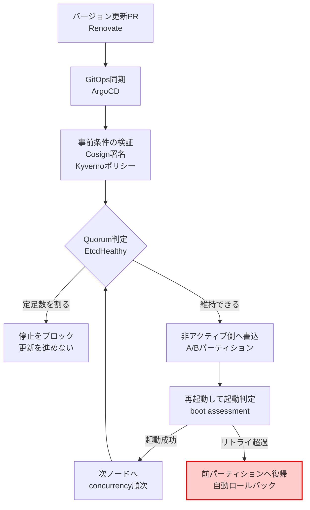

運用作業をAIエージェントへ任せる話になったとき、議論はたいてい「どこまで正確な手順を教えられるか」に向かいます。ランブックを詳細に書き、判断基準をプロンプトへ埋め込み、失敗パターンを列挙する。そういう進み方です。

しかしKubernetesクラスタの更新のように、失敗したときの被害が大きい作業では、この方向は行き止まりになりがちです。手順をどれだけ精密にしても、「途中で止まったとき誰が戻すのか」が解けないからです。

CNCFが公開した [Eleven minutes, zero humans: Building a self-healing Kubernetes upgrade pipeline on Kairos](https://www.cncf.io/blog/2026/08/14/eleven-minutes-zero-humans-building-a-self-healing-kubernetes-upgrade-pipeline-on-kairos/) は、Kairosを使ってクラスタのノード更新 (v0.3.0 から v0.4.0) を11分・人間の介入ゼロで完了させた実証事例です。この記事では、その事例を「エージェントに運用を委譲するときの参照モデル」として読み直します。

読み終えたときに持ち帰れるものは、次の3つです。

- 無人化の単位を「操作」ではなく「フェイルセーフを含む閉ループ」に置く理由
- 自己復旧が効かなくなる条件、つまりこの構造が壊れる境界
- エージェントに渡してよい権限と、明示的に組み込むべき停止条件

*この記事の全体像。以下、順に解説します。*

## 無人化の単位は操作ではなく閉ループ

「無人でノードを更新する」と言ったとき、無人化されているのは更新操作そのものではありません。

更新操作は、成功する限りにおいては人間がいなくても進みます。問題は失敗したときです。新しいイメージで起動しない、途中でクラスタが不整合になる、そうなったときに戻す判断と操作を誰がするのか。ここに人間が必要である限り、実質的には有人運用です。

したがって無人化の単位は、次の3点セットになります。

| 要素 | 役割 |
|---|---|
| 前進 | 宣言された状態へ更新を進める |
| 判定 | 更新後の状態が正常かを機械が判定する |
| 復帰 | 異常なら介入なしで前回正常状態へ戻る |

この3つが閉じていれば、途中経過に人間が張り付く必要がなくなります。逆に「復帰」だけが手動で残っている構成は、平常時は無人に見えて、事故のときだけ有人に戻ります。これは無人運用ではなく、当直の省略です。

Kairosの事例が参照モデルとして有用なのは、この3点セットを**アプリケーション側ではなく基盤側**に持たせている点にあります。

## 基盤側に置かれた2つのフェイルセーフ

Kairosは、OSをイミュータブルなイメージとして扱うディストリビューションです。この事例で効いているフェイルセーフは2種類あります。

### A/Bパーティションとboot assessment

更新は、稼働中のパーティションを書き換えるのではなく、**非アクティブなパーティションへ新しいイメージを書き込み、そちらから再起動する**形で行われます。

ここに boot assessment という仕組みが組み合わさります。新しいパーティションからの起動を試行し、規定回数以内に起動完了へ到達しなければ、自動的に元のパーティションへ戻ります。

構造として重要なのは、判定の基準が「更新スクリプトが正常終了したか」ではなく「**新しい状態で実際に起動できたか**」に置かれている点です。前者はエージェントやスクリプトが自己申告できてしまいますが、後者は自己申告できません。

### etcd Quorumの保護

もう1つはコントロールプレーン側の保護です。

Kairos Operator は `NodeOpUpgrade` リソースを通じてノード更新を管理し、コントロールプレーンの `EtcdHealthy` 状態を監視します。あるノードを停止すると etcd の定足数 ((N/2)+1) を割る場合、その停止をブロックします。

これは「更新を速く進める」ための仕組みではなく、**クラスタを自分で壊せなくする**ための仕組みです。更新を進める主体が誰であっても (人間でもエージェントでも)、定足数を割る操作は基盤側で拒否されます。

エージェントへの権限委譲を考えるとき、この方向が本筋になります。危険な操作をしないよう指示するのではなく、危険な操作が通らない場所に権限を置く、という設計です。

### 周辺のエコシステム

事例では、この2つのフェイルセーフの周囲を宣言的なツール群が固めています。

| 領域 | 使われているもの | 役割 |
|---|---|---|
| イメージの真正性 | Cosign | 署名検証を更新の事前条件にする |
| ポリシー適合 | Kyverno | 適合しないイメージを弾く |
| 変更の起点 | Renovate + ArgoCD | バージョン更新をPRとGitOpsの同期で表現する |
| インフラ定義 | OpenTofu | 環境をIaCで再現可能にする |

いずれも「人間やエージェントの操作」ではなく「宣言された状態」を入力にしている点が共通しています。

## パイプライン全体の流れ

ここまでの要素を1つのループとしてまとめると、次の構造になります。

左上から入った変更が、判定と復帰を経て次のノードへ回る。この輪が閉じていることが、11分・無人という結果の中身です。

注目したいのは、人間やエージェントが触れる場所が**図の一番上 (PRのマージ) だけ**であることです。それ以降は宣言的状態の伝搬と、基盤側の判定で進みます。

## 自己復旧が効かなくなる条件

この構造は強力ですが、無条件に成立するわけではありません。事例からは、無人運用モデルが破綻する条件がいくつか読み取れます。設計として重要なのはむしろこちらです。

### boot assessmentが機能しない構成

自動ロールバックの前提は、リトライカウンタが減り、規定回数で復帰が発火することです。これが働かないケースがあります。

- **ブートローダ設定がハードコードされている場合**。`loader.conf` に `default active+3.conf` のような静的な指定が残っていると、カウンタが更新されず復帰が発火しません。
- **`boot-complete.target` 到達前にクラッシュするハードウェア**。一部の Raspberry Pi 環境などで報告されています。起動完了の判定点より手前で落ちるため、「起動に失敗した」という状態自体が記録されません。
- **systemdのバージョン差**。`boot-assessment` サフィックスの廃止など、systemd側の変更に伴うリグレッション事例も存在します。

いずれも「復帰機構が壊れていることに、壊れるまで気づけない」種類の故障です。フェイルセーフを導入したら、**フェイルセーフ自体が発火することを定期的に確認する**運用が要ります。

### Quorum喪失によるデッドロック

より深刻なのはこちらです。

`concurrency` の設定を1より大きくした、あるいはエッジ環境のI/O不足でハートビートが欠損した。そうした理由で etcd の Quorum を一度失うと、Kubernetes API サーバが Read-Only に陥ります。

このとき何が起きるかというと、**Kairos Operator 自身も状態を更新できなくなります**。復旧を担うはずのコントローラが、復旧に必要な書き込みを行えない。パイプライン全体がその場で停止します。

自己復旧機構が、自分が守っている対象の上に載っている。この依存関係が、無人運用の限界点を決めています。

そして Quorum 喪失からの復旧は手動リストア、つまりスナップショットからの復元経路に入ります。ここは平常時の更新経路とはまったく別の操作面であり、検証頻度も低くなりがちです。無人運用の設計では、この経路に入った時点を「人間を呼ぶ線」として扱うのが妥当です。

### 小規模構成では前提が崩れる

2ノード構成のエッジ環境では、1ノードを再起動した時点で定足数を満たせなくなります。つまりこの構成では、そもそも無停止のローリング更新が成立しません。

ノード数が少ない環境で「大規模クラスタと同じ無人更新」を期待すると、Quorum保護が更新を常にブロックする、あるいは書き込みが止まる状態に入ります。**無人化が成立する最小構成があります**。

### ディストリビューション差

K3s と K0s では etcd メンバー操作の振る舞いが異なり、K3s では `etcdctl member remove` の手動介入が必要になるケースがあります。

エージェントにクラスタ運用を任せる場合、この差をエージェント側の知識で吸収させるか、基盤側で抽象化するかは設計判断になります。前者を選ぶと、ディストリビューションが増えるたびにプロンプトが膨らみます。

## エージェントへの委譲をどう設計するか

ここまでを踏まえると、AIエージェントにKubernetesの運用を委譲するときの設計は、次の形に整理できます。

### 1. 手順ではなく制約を基盤へ置く

エージェントに「どうアップデートするか」を教える方向は取りません。A/Bフェイルセーフと Quorum 保護のような制約を基盤側に持たせ、**エージェントには宣言的状態の更新 (PRのマージなど) だけを許可します**。

この分担であれば、エージェントが誤った判断をしても、基盤側の判定を通過できません。エージェントの正しさに安全性を依存させない構造になります。

### 2. 停止条件を明示的に組み込む

エージェントの側には、進める条件ではなく**止まる条件**を持たせます。事例から導けるのは、少なくとも次の2つです。

- **APIサーバがRead-Onlyになったとき** (Quorum喪失)。この状態ではエージェント自身の操作も反映されないため、続行は無意味であるだけでなく状況を悪化させます。
- **boot assessmentがブートループに陥ったとき**。復帰機構が期待どおり働いていない兆候であり、以降の自動判定を信用できません。

いずれも「エラーが出た」ではなく「**判定機構そのものが信用できなくなった**」ことを検知する条件である点が共通しています。

### 3. 停止条件をチェックリストとして先に書く

停止条件は、事故のあとに追加されがちです。しかし無人運用では、停止条件が未定義の領域がそのまま暴走可能な領域になります。

プロンプト設計の段階で、状態破壊を防ぐ停止条件 (etcd quorum の維持が不能、PDB制約の超過など) をチェックリストとして先に策定しておくのが順序として正しい形です。

### 4. 委譲できる範囲は構成に依存する

2ノード構成では無停止更新が成立しないように、委譲できる範囲は環境の構成に従属します。「エージェントに運用を任せられるか」は、エージェントの能力ではなく**基盤が閉ループを構成できているか**の問題として評価します。

## まとめ

- 無人化の単位は更新操作ではなく、**前進・判定・復帰が閉じたループ**です。復帰だけ手動で残っている構成は、事故のときに有人へ戻ります。
- Kairos の事例では、フェイルセーフが基盤側にあります。A/Bパーティションと boot assessment が「実際に起動できたか」で判定し、Kairos Operator の `EtcdHealthy` 監視が定足数を割る停止をブロックします。
- 判定基準が**自己申告できないもの**に置かれている点が要点です。スクリプトの正常終了ではなく、起動の成否とクラスタの定足数で判定されます。
- ただし自己復旧は無条件ではありません。boot assessment はブートローダ設定・早期クラッシュ・systemd差で不発になり、Quorum を失うと Operator 自身が書き込めずパイプラインがデッドロックします。
- 2ノード構成のエッジ環境では、1ノードの再起動で定足数を割るため、そもそも無停止更新が成立しません。**無人化には最小構成があります**。
- エージェントへの委譲は、手順を教えるのではなく制約を基盤へ置き、権限は宣言的状態の更新に限定します。その上で「APIサーバがRead-Onlyになった」「boot assessmentがブートループに入った」を明示的な停止条件として先に定義します。

運用の自動化を検討するとき、最初に問うべきは「エージェントにどこまで任せられるか」ではなく、**「失敗したとき、誰の介入もなしに前の状態へ戻れるか」**です。戻れないのであれば、任せているのは作業であって、運用ではありません。

この記事が少しでも参考になった、あるいは改善点などがあれば、ぜひリアクションやコメント、SNSでのシェアをいただけると励みになります！

## 参考リンク

- [Eleven minutes, zero humans: Building a self-healing Kubernetes upgrade pipeline on Kairos (CNCF Blog, 2026-08-14)](https://www.cncf.io/blog/2026/08/14/eleven-minutes-zero-humans-building-a-self-healing-kubernetes-upgrade-pipeline-on-kairos/)
