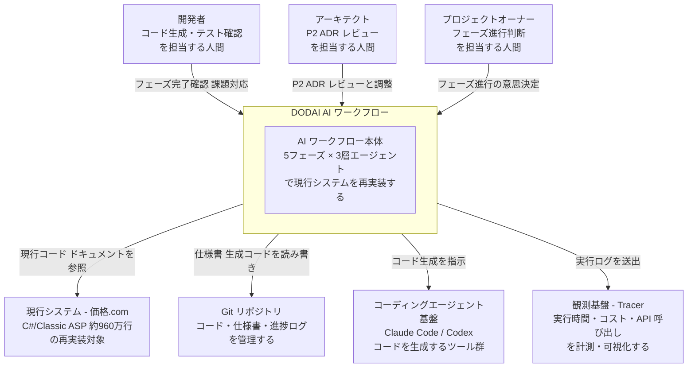
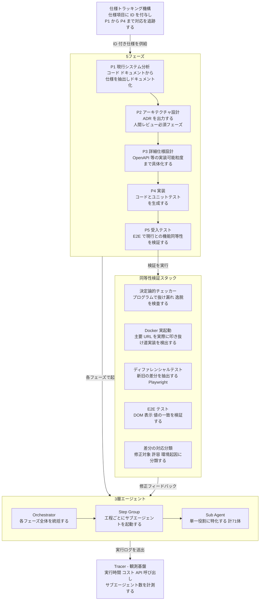
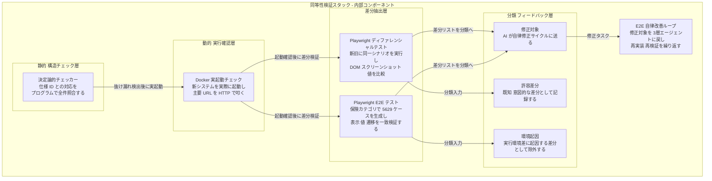
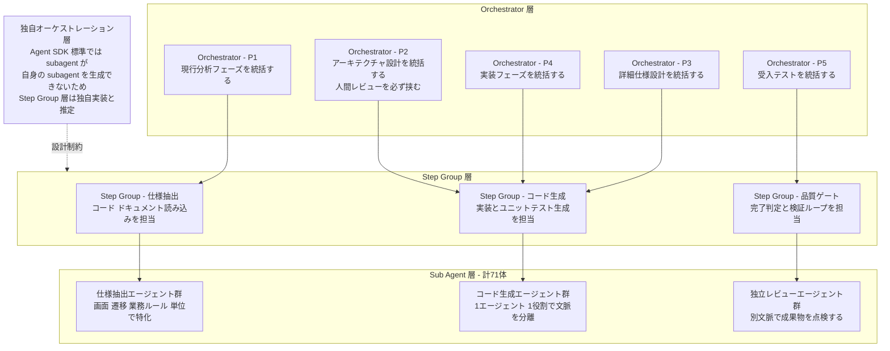
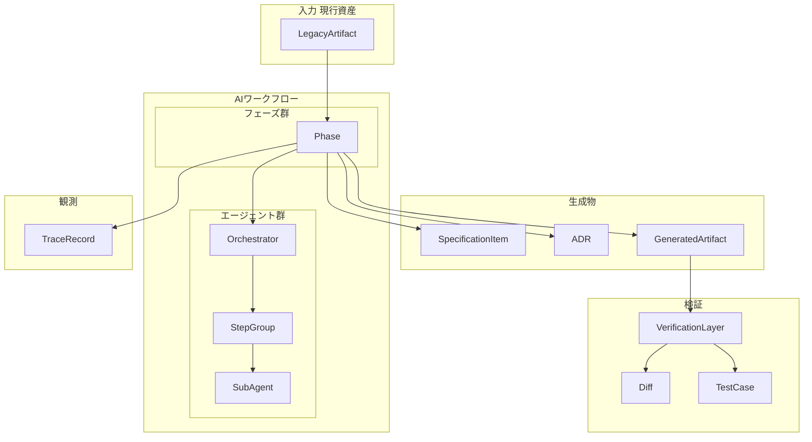
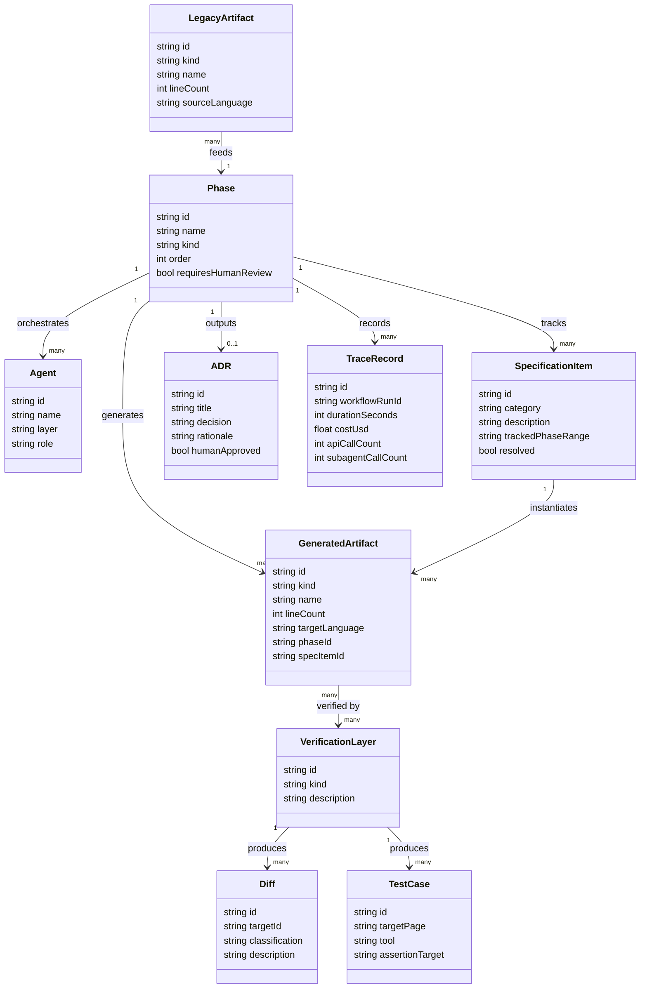

> 本記事は、AI Engineering Summit Tokyo 2026 (2026-06-08) での京和崇行 氏 (カカクコム 上級執行役員 CTO) の発表「価格.comをAI駆動で全面刷新する」を一次ソースに、2026-06-10 時点で公開情報を構造化した技術調査です。
> 数値・固有名詞は発表スライドの逐語記録に基づきます。実装詳細は発表非公開の部分があり、本記事の補完箇所はその旨を明記しています。

## 概要

カカクコムは、創業から約30年運用してきた価格.com のシステム全体を、**仕様を変えず・DB テーブル構造を維持したまま**、別言語スタックへ AI ワークフローで全面再実装するプロジェクト「**DODAI**」(Debt Of Decades + AI) を推進しています。プロジェクト名には「土台」という日本語の意味が込められており、「次の30年を支える新しい土台をつくる」というビジョンを名称に圧縮しています。

### 規模

| 指標 | 値 |
|---|---|
| C# コード行数 | 800.9万行 |
| Classic ASP コード行数 | 161.0万行 |
| **合計** | **約960万行** |
| 画面数 | 1,353 |
| バッチ数 | 498 |
| テーブル数 | 13,210 |
| 単独ファイル最大コード行数 | 11,350行 |
| 単独テーブル最大カラム数 | 327 |
| 単独テーブル最長レコード数 | 5.89億行 |
| リポジトリ数 | 752 |

### スタック転換

- 移行前: C# / Classic ASP (Windows システム)
- 移行後: Python / FastAPI / htmx

Python は採用母集団の広さ・AI コード生成との親和性・型安全な開発 (Pydantic) を理由に選定されています。FastAPI はマイクロフレームワークとしての低い運用コストと OpenAPI 自動生成を、htmx は価格.com の「検索・一覧・詳細・比較」中心というサービス特性に対する適正技術として選ばれています。

### タイムライン

| 時期 | 内容 |
|---|---|
| 2025年10月〜2026年1月 | PoC 第一段階 (ウォーターサーバー再構築。AI 実装 18h + 人間修正 22h = 40h で約8割の完成度) |
| 2026年1月〜2026年3月 | PoC 第二段階 (金融領域の再構築) |
| 2026年4月〜 | リプレイス意思決定 (本格対応の開始) |
| 2026年5月 | DODAI プロジェクト キックオフ |
| 2027年5月 (理想) | 価格.com 30周年。「30周年に間に合わせることが理想」と発表者が言及 (確定目標ではない) |

### 成果の実像 (2026年5月時点)

価格.com の保険カテゴリで、AI が一定の完成度まで自力構築をやりきったと報告されています。

| 指標 | 値 |
|---|---|
| 実行時間 | 134時間 |
| 実行コスト | $6,921 |
| 総生成コード | 約3.6万行 |
| サブエージェント呼び出し回数 | 1,959回 |
| 対象ページ数 | 88 |
| 生成 E2E テストケース | 5,629個 |

これらの数値には、スライド17に**「Phase 5(のみ)の実行結果」という注記**があります。係り先が成果欄全体か一部かは一次資料からは確定できず、フルパイプラインの実コストはこれより大きい可能性があります。二次記事が「$7,000 で保険カテゴリを再現」と引用するのは過大評価になりえます。

なお PoC 第一段階 (ウォーターサーバー) の実態は「AI 実装 18時間 + 人間修正 22時間 = 40時間で約8割の完成度」(スライド11) であり、AI の実装時間より人間の修正時間が長かった点も合わせて読む必要があります。その後「AI ワークフローにブレイクスルーが起き自律性と生成精度が一気に上がった」ことが意思決定の根拠とされますが、ブレイクスルーの中身は語られていません。

## 特徴

DODAI のアプローチを特徴づける5点を以下に示します (スライド16「設計思想と特徴」および本調査の分析より)。

### 1. 現行システムを唯一の正解とする (truth = existing system)

要件定義をやり直さず、既存コードとドキュメントを「信頼できる唯一の情報源」として現行仕様を正確に再現します。人手リニューアルでは製品詳細ページの仕様解析だけで約6ヶ月を要した過去 (カカクコム公式 TechBlog 2024-10-11) に対する、AI 前提の解法として位置づけられます。

### 2. 検証可能性を先に設計する

新旧システムに同じ操作を与えて DOM・スクリーンショット・値の差分を取る**ディファレンシャルテスト** (Playwright)、プログラムで抜け漏れを検査して「AI の嘘を弾く」**決定論的チェッカー**、プレースホルダ実装や汎用フォールバックを検出する **Docker 実起動**、差分を「修正対象/許容/環境起因」に分類する自律ループを組み合わせ、AI の自己申告でなく機械判定で完了を決めます。

### 3. 長時間自律実行のためのハーネス設計

コンテキスト劣化・早すぎる完了宣言・要約による詳細喪失・分解不足・甘い自己評価という失敗パターン群に対し、3層エージェント構造 (作業単位ごとに文脈を分離)・構造化された仕様書・工程単位の独立レビュー・完了判定ゲート・E2E 自律改善ループを対応づけます。

### 4. スコープの厳格な統制 (仕様凍結・DB 構造凍結)

「原則、既存の機能やビジネスロジックは変えない」「DB のテーブル構造は現行を維持 (次フェーズ)」という二重の凍結で、AI にも人間にも再設計の余地を与えません。この制約は同時に特徴2 (検証可能性) の前提条件でもあります。仕様が変わるとディファレンシャルテストの基準が消えるためです。

### 5. 組織変革を技術と同格に扱う

ビジョンの言語化 (DODAI = 次の30年の土台)、PoC 期は疎結合・キックオフ後は統合する協業体制の段階的移行、4つの行動原則 (オーナーシップ / AI 中心思考 / 部分最適をしない / 過去を否定しない)、説得でなく結果で示す抵抗対応、約10回のレビューを重ねたキックオフ準備 — をスライド全体の約4分の1を割いて論じています。

### 新旧コード規模の比較

AI ワークフローを実行した3カテゴリの比較です (スライド18)。発表者の解釈は「新しい (メンテされている) カテゴリほど削減幅が小さい」であり、**AI 再実装で減るのは歴史的経緯から生じた偶有的複雑性のコードだけ**で、業務の本質的複雑性は保たれるという考え方に基づきます。

| カテゴリ | C#/ASP 実装コード行数 | Python 実装コード行数 | 実装コード比 (Python / C#) |
|---|---|---|---|
| ウォーターサーバー | 7,058 | 7,796 | **110.5% (増加)** |
| クレジットカード | 29,215 | 19,313 | 66.1% |
| 保険 | 67,931 | 29,505 | **43.4%** |

ウォーターサーバーは「独立性が高く最もシンプルな領域を選定」した第一段階の PoC 対象であり、最新カテゴリでは行数が逆に増えています。「43.4%」という最大削減値を全体 960万行に外挿する根拠はスライド内に存在しません。

## 類似事例との比較

「約1,000万行級の Web サービスを、仕様凍結のまま別言語スタックへ AI 主導でフル再実装する」という同条件の公開事例は、本調査の範囲では見つかりませんでした。

| 事例 | 組織 | 規模 | 転換内容 | AI の役割 | 結果 |
|---|---|---|---|---|---|
| **DODAI** | カカクコム | 約960万行 | C#/ASP → Python/FastAPI/htmx、DB 構造維持 | 再実装の主役 (5フェーズ自律) | 保険カテゴリ実績 134h/$6,921 (2026/5 時点・Phase 5 注記つき) |
| テスト移行 | Airbnb | 約3,500ファイル | Enzyme → RTL (テストコードのみ) | 97% 自動生成 | 1.5年見積→6週間 |
| Java 一斉更新 | Amazon | 数万アプリ | Java 8/11 → 17 (同言語) | 自動変換 + 人間レビュー | 4,500 dev-years / 年$260M 節約 |
| メインフレーム | Toyota Motor NA | 4,000万行超 | COBOL → Java (AWS Transform) | ベンダーサービス型変換 | 50% 高速化 |
| 仕様抽出のみ | Morgan Stanley | 900万行/年 | COBOL/Perl → 英語仕様 → 人間が再実装 | 仕様化まで | 28万時間節約 [二次情報: WSJ 経由] |
| API 言語転換 | DeNA | 約6,000行 | Perl → Go | 実装の95% (Devin+Claude Code) | 約1ヶ月で完了 |
| 大規模コード移行 | Google | 企業全体 | 言語/API バージョン移行 | LLM が変換提案、人間レビュー必須 | 移行高速化を FSE 2025 で報告 (arXiv:2504.09691) |

この比較から読み取れる構図を3点に整理します。第一に、成功事例の共通項は「挙動等価を機械検証できる設計 + 工場型パイプライン (検証ゲート + 失敗時リトライ)」であり、DODAI の仕様凍結・DB 維持はその成功条件と整合します。第二に、規制業種 (Morgan Stanley) は「AI は仕様化まで、再実装は人間」と保守的に分担しており、再実装まで AI ワークフローに任せる DODAI はリスクテイクの程度が一段高いといえます。第三に、国内ベンダー (NTTデータ・富士通) は「変換はルールベース、生成 AI は理解・設計書化」が主流であり、生成 AI を再実装の主役に置く DODAI の構成は商材より先進的 — すなわちリスクを自社で取る側 — に位置します。

最も構図が近い事例は DeNA の Perl→Go 移行 (仕様凍結・等価性テスト・AI が実装の95%) ですが、規模は約6,000行で DODAI の約 1/1600 にとどまります。「自社開発 Web サービス × 全面再実装 × 自前 AI ワークフロー」の組合せでは、DODAI が世界的にも先頭集団に位置する可能性が高いといえます。

## 構造

DODAI の「AI ワークフロー」を 1 つのシステムと見立て、その内部アーキテクチャを C4 model 3段階で図解します。

### システムコンテキスト図



#### システムコンテキスト図 — 要素一覧

| 要素名 | 説明 |
|---|---|
| 開発者 | AI が生成したコードの動作確認と課題対応を担う人間。P2 以外のフェーズで品質ゲート突破後に介在する |
| アーキテクト | P2 アーキテクチャ設計フェーズで ADR レビューと対話調整を必ず担う人間 |
| プロジェクトオーナー | フェーズ進行の最終意思決定を担う人間 |
| DODAI AI ワークフロー | 5フェーズ × 3層エージェントで構成される自動化本体。本ドキュメントで構造を詳述する対象 |
| 現行システム - 価格.com | C# / Classic ASP 約960万行の再実装対象。唯一の正解として参照される |
| Git リポジトリ | 仕様書・生成コード・進捗ログを管理する。仕様トラッキング ID も格納する |
| コーディングエージェント基盤 | Claude Code / Codex 等のコード生成ツール。特定ツールに縛られない移植性を持つ |
| 観測基盤 - Tracer | 実行時間・コスト・API 呼び出し・サブエージェント数を計測・可視化する |

### コンテナ図



#### 5フェーズ — 要素一覧

| 要素名 | 説明 |
|---|---|
| P1 現行システム分析 | 既存コード・ドキュメントから画面・遷移・業務ルール・URL/API を抽出し仕様ドキュメントを生成する |
| P2 アーキテクチャ設計 | 新システムのアーキテクチャと技術選定を ADR として出力する。このフェーズのみ人間レビューと対話調整が必須 |
| P3 詳細仕様設計 | API・UI・業務ルールを OpenAPI 等の実装可能な粒度まで具体化する |
| P4 実装 | P3 の仕様書に基づき P2 定義のアーキテクチャでコードとユニットテストを実装する |
| P5 受入テスト | P4 で生成した新システムが現行システムと機能的に同等であることを E2E テストで検証する |

#### 3層エージェント — 要素一覧

| 要素名 | 説明 |
|---|---|
| Orchestrator | 各フェーズ全体を統括し全体進行を管理する最上位エージェント |
| Step Group | Orchestrator の指示を受け、工程ごとにサブエージェントを起動する中間層 |
| Sub Agent | 単一役割に特化した末端エージェント。全フェーズ合計で71体実装されている |

#### 同等性検証スタック — 要素一覧

| 要素名 | 説明 |
|---|---|
| 決定論的チェッカー | プログラムで抜け漏れや仕様逸脱を検査し AI の自己申告を機械的に否定する |
| Docker 実起動 | 主要 URL を実際に叩き、プレースホルダ実装・汎用フォールバックなどの抜け道実装を検出する |
| ディファレンシャルテスト | 新旧システムに同一操作を与え DOM・スクリーンショット・値の差分を Playwright で抽出する |
| E2E テスト | Playwright で現行と新システムを操作し DOM・表示・値の一致を検証する |
| 差分の対応分類 | 検出した差分を「修正対象 / 許容 / 環境起因」に分類し自律改善ループへフィードバックする |

#### その他コンテナ — 要素一覧

| 要素名 | 説明 |
|---|---|
| 仕様トラッキング機構 | 現行仕様の各項目に ID を付与し P1 から P4 まで対応を一貫して追跡する機構 |
| Tracer - 観測基盤 | 実行時間・コスト・API 呼び出し・サブエージェント数を計測・可視化する。改善作業のスキル化にも使われる |

### コンポーネント図

#### 同等性検証スタックのドリルダウン



#### 同等性検証スタック コンポーネント — 要素一覧

| 要素名 | 説明 |
|---|---|
| 決定論的チェッカー | 仕様 ID との対応をプログラムで全件照合する。AI の嘘を機械的に弾く役割を担う |
| Docker 実起動チェック | 新システムを Docker で実際に起動し主要 URL を HTTP で叩く。プレースホルダ実装や汎用フォールバックによる抜け道を検出する |
| Playwright ディファレンシャルテスト | 新旧システムに同一シナリオを実行し DOM・スクリーンショット・値を機械比較する。McKeeman の差分テスト手法をレガシー同等性検証に適用した形 |
| Playwright E2E テスト | Playwright で現行と新システムを操作し表示・値・画面遷移の一致を検証する。保険カテゴリで 5,629 ケースが生成されている |
| 修正対象 | E2E テストで検出した差分のうち AI が自律修正サイクルに送る分類 |
| 許容差分 | 既知・意図的な差分として記録し修正対象から除外する分類 |
| 環境起因 | 実行環境差に起因する差分として除外する分類 |
| E2E 自律改善ループ | 修正対象を 3層エージェントに戻し再実装・再検証を繰り返す自律サイクル |

#### 3層エージェント構造のドリルダウン



#### 3層エージェント コンポーネント — Orchestrator 層

| 要素名 | 説明 |
|---|---|
| Orchestrator - P1 | 現行システム分析フェーズ全体を統括する。Step Group への作業指示とフェーズ完了判定を担う |
| Orchestrator - P2 | アーキテクチャ設計フェーズを統括する。ADR 出力後に必ず人間レビューと対話調整を挟む唯一のフェーズ |
| Orchestrator - P3 | 詳細仕様設計フェーズを統括する。OpenAPI 等の実装可能粒度への具体化を管理する |
| Orchestrator - P4 | 実装フェーズを統括する。コードとユニットテストの生成と品質ゲート通過を管理する |
| Orchestrator - P5 | 受入テストフェーズを統括する。E2E 自律改善ループの全体管理を担う |

#### 3層エージェント コンポーネント — Step Group 層

| 要素名 | 説明 |
|---|---|
| Step Group - 仕様抽出 | コード・ドキュメント読み込みを担当し、サブエージェントに画面・遷移・業務ルール単位で作業を分配する |
| Step Group - コード生成 | 実装とユニットテスト生成を担当し、1 セッション 1 役割でコンテキストを分離する |
| Step Group - 品質ゲート | 完了判定と検証ループを担当し、機械判定が通るまで修正を繰り返させる |

#### 3層エージェント コンポーネント — Sub Agent 層

| 要素名 | 説明 |
|---|---|
| 仕様抽出エージェント群 | 画面・遷移・業務ルール・URL/API ごとに特化した複数体のエージェント |
| コード生成エージェント群 | 1エージェント 1役割でコンテキストを分離し、性能を保ちながらコードを生成する |
| 独立レビューエージェント群 | 実行エージェントとは別のコンテキストで成果物を点検する。工程単位の独立レビューを実現する |

#### 独自オーケストレーション層に関する留意点

Claude Agent SDK の標準仕様では、サブエージェントは自身のサブエージェントを生成できません (Agent SDK 公式ドキュメントに基づく。スライドには記載が無く本調査の補完です)。そのため、DODAI の 3層構造 (Orchestrator → Step Group → Sub Agent) を実現するには、Step Group を別プロセスや別スクリプト起動として扱う独自のオーケストレーション層が必要と推定されます。スライド22では「特定のツールに縛られず実行環境を移せる形へ」と移植性が明記されており、SDK 上位の独自ハーネスが実装されていると考えられますが、その実装詳細はスライドからは確認できません。

## データ

DODAI AI ワークフローに登場する主要概念をエンティティとしてモデル化します。システムの DB スキーマではなく、方法論の登場概念を対象とします。

### 概念モデル



### 情報モデル



#### エンティティ解説

| エンティティ | 説明 | 主な属性の補足 |
|---|---|---|
| Phase | ワークフローの5段階 (現行分析 / アーキ設計 / 詳細設計 / 実装 / 受入テスト) | `kind` は analysis / architecture / detail-design / implementation / acceptance-test の5値 (発表記述から推測)。`requiresHumanReview` は P2 のみ true |
| Agent | Orchestrator / StepGroup / SubAgent の3層、合計71体 | `layer` は orchestrator / step-group / sub-agent の3値。`role` は単一役割を記述 |
| SpecificationItem | P1 で抽出した仕様の単位。ID 付与により P1〜P4 を横断してトラッキング | `trackedPhaseRange` は P1-P4 が標準 (発表記述から推測) |
| ADR | P2 で出力するアーキテクチャ決定記録。人間レビューと対話調整が必須 | `humanApproved` が false のまま P3 へ進行しない設計 |
| VerificationLayer | 検証の手段層。4種 (決定論的チェッカー / Docker実起動 / ディファレンシャルテスト / E2Eテスト) | `kind` は deterministic-checker / docker-run / differential-test / e2e-test の4値 |
| Diff | 新旧システム間で観測された差分の単位 | `classification` は fix (修正対象) / allow (許容) / env (環境起因) の3値 |
| TestCase | E2E テストケース。保険カテゴリ実績で 5,629 件生成 | `tool` は Playwright。`assertionTarget` は DOM / screenshot / value (発表記述から推測) |
| TraceRecord | Tracer が計測する実行観測レコード。保険 P5 の実績値は 134h / $6,921 / 1,959回サブエージェント呼び出し | `workflowRunId` でフェーズ横断集計が可能 (発表記述から推測) |
| LegacyArtifact | 現行システムの入力資産。コード / ドキュメント / 画面 / バッチ / テーブルを含む | `kind` は code / document / screen / batch / table。`lineCount` は最大 11,350 行の単独ファイルが実在 |
| GeneratedArtifact | AI が生成した成果物。コード / ユニットテスト / OpenAPI仕様 / 設計書を含む | `kind` は code / unit-test / openapi-spec / design-doc (発表記述から推測)。保険カテゴリ実績で約 3.6 万行 |

#### エンティティ数量の実績値 (保険カテゴリ)

| エンティティ | 実績値 | 備考 |
|---|---|---|
| SubAgent | 71体 | 全フェーズ合計の実装数 |
| TestCase | 5,629件 | P5 受入テストで生成 |
| TraceRecord (呼び出し回数) | 1,959回 | スライド17「サブエージェントの呼び出し回数」 |
| GeneratedArtifact (行数) | 約3.6万行 | 保険カテゴリの総生成コード |
| LegacyArtifact (行数) | 172,812行 | 保険カテゴリの C#/ASP 総行数 (実装コード行数は 67,931行)。コード比 43.4% の分母は実装コード行数 |

## 構築方法

DODAI 自体は OSS ではないため、本セクションは**自社で同等の AI 駆動レガシー刷新ワークフローを構築するための実装パターン**として、Anthropic 公式のハーネス設計ベストプラクティスや差分テスト等の参照実装で具体化します。掲載するコードは「DODAI の主張」ではなく**「実装案/例」**であり、補完元を各コードブロックと参考リンクに明示します。

### 前提パラメータ一覧

| 項目 | 値 / 規約 |
|---|---|
| 人間レビューが必須なフェーズ | P2 (アーキテクチャ設計の ADR 確認) のみ |
| スコープ凍結の対象 | 機能・ビジネスロジック (仕様凍結) + DB テーブル構造 (構造凍結) |
| 品質ゲート通過の判定主体 | 機械 (決定論的チェッカー / E2E テスト)。AI の自己申告は根拠にしない |
| エージェント構造の最大深さ | 3 層 (Orchestrator → Step Group → Sub Agent) |
| SDK 標準のサブエージェント制約 | サブエージェントは自身のサブエージェントを生成できないため、Step Group 層は独自オーケストレーション実装が必要 |
| コンテキスト分離単位 | 1 サブエージェント = 1 役割 = 1 文脈 |
| 仕様トラッキング単位 | 仕様項目ごとに ID を付与し P1〜P4 を追跡 |

### 前提条件 — スコープ統制と検証可能性の事前設計

ディファレンシャルテストは「新旧の同等性を比較できる」ことを前提とします。この比較基準が動くと検証自体が崩壊するため、二重の凍結を最初に宣言します。

- **仕様凍結**: 「既存コードが唯一の正解 (truth = existing system)」と定め、追加仕様・改善要求は刷新完了まで受け付けない運用ルールを設けます。
- **DB 構造凍結**: テーブル構造をそのまま引き継ぐことを明示し、スキーマ変更は次フェーズに先送りします。
- **検証可能性の設計**: コードを書く前に「どの層をどの手段で検証するか」の計画を確定させます。表示層はディファレンシャルテスト、ロジック層は決定論的チェッカー、実起動の抜け道は Docker 実起動、という役割分担を事前に決めます。

### 3 層エージェント構造の組み方

Claude Agent SDK は標準仕様として「サブエージェントは自身のサブエージェントを生成できない」制約を持ちます。DODAI 型の 3 層を実現するには、Step Group 層を外部スクリプト / 別プロセス起動として実装し、独自のオーケストレーション層を設けます。

```python
# 実装案/例 (Anthropic 公式 multi-agent research system / Claude Agent SDK を参考にした擬似コード)
# 参考: https://www.anthropic.com/engineering/multi-agent-research-system

class Orchestrator:
    """フェーズ全体を統括し、Step Group を順次起動する"""

    def run_phase(self, phase: str, spec: dict) -> dict:
        step_groups = self.plan_step_groups(phase, spec)
        results = []
        for sg in step_groups:
            result = self.launch_step_group(sg)  # 別プロセス / サブシェル起動
            self.assert_quality_gate(result)      # 品質ゲート通過確認
            results.append(result)
        return self.aggregate(results)

    def launch_step_group(self, step_group) -> dict:
        # SDK 標準の subagent 制約を回避するため、
        # StepGroup 自体を独立プロセスとして起動し、その中で Sub Agent を生成する
        return subprocess.run(
            ["python", "run_step_group.py", "--group", step_group.id],
            capture_output=True,
        )

class StepGroup:
    """工程単位でサブエージェントを起動・集約する"""

    def run(self, context: dict) -> dict:
        agents = [SubAgent(role=r, context=context) for r in self.roles]
        return parallel_run(agents)

class SubAgent:
    """単一役割に特化。自分の文脈のみ保持する"""
    role: str      # 例: "api_endpoint_generator" / "unit_test_writer"
    context: dict  # 自分の仕事に必要な情報だけを渡す
```

| 層 | 役割 | 持つ文脈 |
|---|---|---|
| Orchestrator | フェーズ進行・品質ゲート判定 | 全体仕様 + フェーズ進捗 |
| Step Group | 工程内タスクの分割・並列化 | 当該工程の仕様サブセット |
| Sub Agent | 単一タスクの実行 (生成/テスト/検証) | 自タスクに必要な情報のみ |

単一役割への特化は、コンテキストの肥大化 (Context Rot) と早仕舞い (Premature Completion) を防ぎます。この設計は Anthropic の multi-agent research system が示す「サブエージェントが並列コンテキストで探索し、最終メッセージのみを親に返す」アーキテクチャと整合します。

### 同等性検証の足場

#### ディファレンシャルテスト (Playwright 擬似コード)

```typescript
// 実装案/例
// 参考: McKeeman "Differential Testing for Software" (1998)
// 参考: Anthropic "Harness design for long-running application development" (2026-03-24)

import { chromium } from '@playwright/test';

async function differentialTest(url: string) {
  const browser = await chromium.launch();

  const [legacyPage, newPage] = await Promise.all([
    openPage(browser, `${LEGACY_BASE}${url}`),
    openPage(browser, `${NEW_BASE}${url}`),
  ]);

  // DOM 差分
  const legacyDom = await legacyPage.content();
  const newDom    = await newPage.content();
  const domDiff   = diff(normalize(legacyDom), normalize(newDom));

  // スクリーンショット差分
  const legacyShot = await legacyPage.screenshot({ fullPage: true });
  const newShot    = await newPage.screenshot({ fullPage: true });
  const pixelDiff  = compareImages(legacyShot, newShot);

  // 値差分 (フォーム入力値 / テーブル数値)
  const legacyValues = await legacyPage.$$eval('[data-testid]', extractValues);
  const newValues    = await newPage.$$eval('[data-testid]', extractValues);
  const valueDiff    = diff(legacyValues, newValues);

  return classifyDiffs({ domDiff, pixelDiff, valueDiff });
}
```

#### 決定論的チェッカーの例

```python
# 実装案/例
# 参考: Anthropic "Building agents with the Claude Agent SDK" (2025-09-29) rules-based feedback

class DeterministicChecker:
    """AI の自己申告に依らず、機械的ルールで仕様の充足を確認する"""

    def check(self, spec_item, implementation_dir: str):
        failures = []

        # ルール例 1: API エンドポイントが仕様通り実装されているか
        if spec_item.type == "api_endpoint":
            route_file = find_route_file(implementation_dir, spec_item.path)
            if not route_file:
                failures.append(f"MISSING_ENDPOINT: {spec_item.path}")

        # ルール例 2: DB テーブルの全カラムが ORM モデルにマップされているか
        if spec_item.type == "db_model":
            model_file = find_model_file(implementation_dir, spec_item.table)
            missing_cols = spec_item.columns - extract_columns(model_file)
            if missing_cols:
                failures.append(f"MISSING_COLUMNS: {missing_cols}")

        # ルール例 3: ユニットテストが存在するか (テスト未記述を「完了」とさせない)
        if not find_test_file(implementation_dir, spec_item.id):
            failures.append(f"MISSING_TEST: {spec_item.id}")

        return CheckResult(spec_id=spec_item.id, passed=(len(failures) == 0), failures=failures)
```

LLM-as-judge は信頼性が低くレイテンシも高いため、ルールベースの機械判定を最上位に置きます。これは Anthropic の rules-based feedback 優先の序列 (rules-based > visual feedback > LLM judge) に対応します。

## 利用方法

5 フェーズ・パイプラインの回し方を示します。掲載するコードは「実装案/例」です。

### P1 現行システム分析

- **目的**: 既存コード・ドキュメントから仕様を抽出し、各仕様項目に一意 ID を付与します。
- **出力**: 仕様 ID 付き仕様書 (JSON / Markdown)。全件を「未実装」状態で初期化します。
- **注意点**: この段階で仕様の過不足を確定させます。抽出漏れは P4 まで伝播します。

```python
# 実装案/例
spec_items = [
    SpecItem(id="SPEC-001", type="api_endpoint", path="/insurance/list"),
    SpecItem(id="SPEC-002", type="db_model",    table="insurance_products"),
    # ...全仕様を列挙し、status="pending" で初期化
]
```

### P2 アーキテクチャ設計 (人間レビュー必須)

- **目的**: 新スタックの技術選定・レイヤー構成を ADR (Architecture Decision Record) として出力します。
- **人間の役割**: ADR の確認・承認。このフェーズのみ人間レビューをゲートとして設けます。
- **出力**: 承認済み ADR + 実装に使うディレクトリ構造テンプレート。

P2 は人間レビューを必須ゲートとして設けます。それ以外のフェーズは品質ゲート (機械判定) 通過を条件に自律進行する設計ですが、発表者はスライド23で「すべてを AI に任せきるにはまだ遠い。人間による動作確認も必須」と述べており、P2 以外でも人間の動作確認は介在します。「自律進行」は人間の確認を排除する意味ではなく、判断の主軸を機械判定に置く設計と読むべきです。

### P3 詳細仕様設計

- **目的**: P1 の仕様 ID ごとに、実装可能な粒度の詳細仕様 (OpenAPI スキーマ / ER 図 / シーケンス図) を生成します。
- **仕様トラッキング**: 仕様 ID を引き継ぎ、P4 の実装物と 1:1 で対応付けられる状態にします。
- **出力**: OpenAPI YAML + DB マイグレーション定義 + 画面仕様書。

### P4 実装 (コード + ユニットテスト)

- **原則**: 1 サブエージェント = 1 仕様 ID = 1 コンテキスト。一度に全部作ろうとする one-shotting を構造で防ぎます。
- **完了条件**: ユニットテスト通過 + 決定論的チェッカー通過の両方。自己申告のみでの「完了」は認めません。

```python
# 実装案/例
# 参考: Anthropic "Effective harnesses for long-running agents" (2025-11-26)

def run_coding_agent(spec_item):
    """1 セッション 1 仕様 ID。完了はテスト通過後にのみ記録する"""
    implementation = generate_code(spec_item)
    test_result    = run_unit_tests(implementation)
    check_result   = DeterministicChecker().check(spec_item, implementation.dir)

    if test_result.passed and check_result.passed:
        spec_item.status = "passing"
        commit(implementation, message=f"impl: {spec_item.id}")
    else:
        # 失敗理由を構造化して次セッションに渡す
        spec_item.failures = test_result.failures + check_result.failures
        spec_item.status   = "failing"
```

### P5 受入テスト (E2E 自律改善ループ)

DODAI で最も特徴的なフェーズです。「AI が実装したものを AI が評価し、差分を分類してフィードバックする」generator-evaluator ループを自律実行します。

```python
# 実装案/例
# 参考: Anthropic "Harness design for long-running application development" (2026-03-24) generator-evaluator パターン

def acceptance_test_loop(spec_items, max_iterations=10):
    for iteration in range(max_iterations):
        all_passed = True
        for item in spec_items:
            # Evaluator: 旧新システムに同じ操作を与えて差分を取得
            diffs = differentialTest(item.representative_url)
            classified = classify_diffs(diffs)
            fix_targets = classified["FIX"]        # 新システムの実装ミス → 修正対象

            if fix_targets:
                # Generator: 修正対象の差分をフィードバックして再実装
                regenerate(item, feedback=fix_targets)
                all_passed = False

        if all_passed:
            break  # 全 item が差分なしになったらループ終了

    return summarize_results(spec_items)
```

#### 差分の対応分類の考え方

| 分類 | 意味 | アクション |
|---|---|---|
| FIX (修正対象) | 新システムの実装ミスによる差分 | Generator に差分内容を渡して再実装 |
| ACCEPTABLE (許容) | 意図的に変えた箇所 / 不要な旧システムの癖 | ホワイトリストに登録し以降はスキップ |
| ENV (環境起因) | ホスト名・タイムスタンプ・環境変数による差分 | 正規化フィルターを追加してテストから除外 |

### 仕様トラッキング

仕様 ID を P1 から P4 まで一貫して引き継ぎます。これにより「どの仕様が実装済みか / 未実装か / テスト通過済みか」をフェーズをまたいで追跡できます。

```json
// 仕様トラッキング台帳の例 (実装案/例)
[
  {
    "id": "SPEC-001",
    "description": "保険商品一覧 API",
    "p1_extracted": true,
    "p3_specced":   true,
    "p4_status":    "passing",
    "p5_status":    "passing",
    "last_diff":    null
  },
  {
    "id": "SPEC-042",
    "description": "比較表の保険料表示",
    "p1_extracted": true,
    "p3_specced":   true,
    "p4_status":    "passing",
    "p5_status":    "failing",
    "last_diff":    { "type": "FIX", "detail": "税込/税抜の表示差異" }
  }
]
```

## 運用

### ワークフロー観測 (Tracer)

DODAI は、ワークフロー自体の実行状況を継続的に計測する観測基盤「Tracer」を実装しています。計測対象として一次資料に挙がる指標は次の通りです。

| 指標 | 内容 |
|---|---|
| 実行時間 | フェーズ・サブエージェント単位での経過時間 |
| コスト | API 呼び出し単位の課金額 (保険カテゴリ実績: $6,921 ※Phase5のみの可能性) |
| API 呼び出し数 | モデルへのリクエスト回数 |
| サブエージェント数 | 起動した Sub Agent の数 (現時点で 71 体実装) |

この観測基盤は「ワークフロー自体の性能を測るベンチマークの整備」(スライド23) という自認課題への対処として位置づけられており、発表時点では整備途上です。観測データを次の改善サイクルに入力することで、AI によるワークフロー自己改善の Skill 化を並走させています。

### コスト管理

設計者の月額 AI 利用料 440 万円という数値は、発表者自身が「コスト最適化が急務」と位置づける自認課題です (スライド23。「1人あたり」という単位の明示は一次資料には無く、本調査の解釈です)。

- 保険カテゴリの 134 時間・$6,921 は「Phase 5 (のみ) の実行結果」という注記があります。フルパイプライン合計はこれより大きい可能性があります。
- 保険カテゴリ (172,812 行) は全体 960 万行の約 1.8%。$6,921 を単純線形外挿すると AI 実行コストだけで約 $38 万 (×55.6) ですが、これは「周辺・シンプル側のカテゴリ」「Phase 5 のみの可能性」という 2 つの楽観バイアスを含む下限値です (本調査の算術であり出典はありません)。
- 中核領域 (最大 11,350 行の単一ファイル・327 カラムのテーブル・5.89 億行テーブル・バッチ 498 本) では、線形より悪化する方向のバイアスが掛かると見るべきです。

運用上の手がかりとして、Tracer によるフェーズ単位のコスト可視化を前提に、どのフェーズ・どのサブエージェントがコストを食うかを特定してから最適化します。13 ヶ月超の工期にわたる特定ベンダー依存は、為替・価格改定・モデル世代交代 (挙動変化によるワークフロー再調整コスト) のリスクを内包します。

### 長時間自律実行のハーネス運用

DODAI が対策する 5 つの失敗パターンと、対応する設計対策は次の通りです。スライド20はこれらを「Anthropic が示した5つの失敗パターン」として提示しています。本調査ではこの5ラベルをセットで列挙する単一の Anthropic 公式文書を特定できず、複数の公開記事群 (2025-09〜2026-03) に由来する知見をスライド側が整理・再ラベリングしたものと判断します。自社実装時も同一の一次ソース群を参照できます。

| 失敗パターン (スライドのラベル) | 原概念 | DODAI の対策 |
|---|---|---|
| Context Rot | コンテキスト窓の劣化による指示不履行 | 3 層エージェント構造で作業単位ごとに文脈を分離 |
| Premature Completion | 上限を察知した早すぎる完了宣言 | 完了判定ゲート (機械判定)・工程単位の独立レビュー |
| Lossy Compaction | 要約による詳細喪失 | 構造化された仕様書に詳細を外部化し、要約対象から切り離す |
| Shallow Plans | 分解不足による浅い実行計画 | Step Group による工程単位の分解・仕様トラッキング ID |
| Generous Self-evaluation | 甘い自己評価・不十分なテスト | E2E 自律改善ループ (AI のレポートを信じず機械で評価) |

なお、この5ラベルをセットで列挙する単一の Anthropic 公式文書は本調査では特定できませんでした。実体は上記の知見群をスライド側で再ラベリングした編集物と判断されます。

### 移植性

スライド22 は「Claude Code / Codex — 特定のツールに縛られず、実行環境を移せる形へ」と明示しています。特定の実行環境に縛られないことは、モデル世代交代・API 価格変動・ベンダーポリシー変更に対するリスクヘッジとして設計に組み込まれた方針です。ワークフローのポータビリティは、Tracer による性能計測・AI 自己改善 Skill 化と組み合わせることで、実行環境を切り替えながらもワークフロー品質を維持する運用サイクルを形成します。

## ベストプラクティス

DODAI から抽出できる、AI 駆動レガシー刷新の自社適用時の判断フレームを 6 項目に整理します。

### 1. 検証可能性から設計する

「AI に書かせられるか」ではなく「書かれたものの同等性を機械検証できるか」が成立条件です。仕様凍結・DB 凍結は制約ではなく、検証基準を固定するためのスコープ統制として機能します。ディファレンシャルテスト・決定論的チェッカー・Docker 実起動の 3 層を揃えることで、AI の自己申告ではなく機械判定で完了を決める体制を作ります。

### 2. 検証の射程を明示する

E2E 差分検証が覆うのは観測可能な表示層まで、というスコープを明示します。DODAI の検証は「対象 88 ページ・E2E 5,629 ケース」のページ駆動であり、以下の領域は検証の射程外です。

- バッチ処理 (DODAI では 498 本が存在) の同等性
- 性能・同時実行・セキュリティ等の非機能特性
- 画面外副作用 (ログ・メール・外部連携・DB 書込順序)
- C# → Python 間の数値演算・文字列照合・ロケール・丸め挙動の差

これらを曖昧にしたまま「同等性担保」を主張することは避けます。別の検証戦略が必要な領域を明示的に分離して計画します。

### 3. シンプル領域の PoC 数値を外挿しない

削減率もコストも領域の「腐り具合」に依存します。DODAI 自身のデータが示す通り、実装コード比は 110.5% (ウォーターサーバー: 最新・メンテ済み) 〜 43.4% (保険: 古く腐り具合が大きい) というレンジを持ちます。「最もシンプルな領域」を意図的に選んだ PoC の数値を中核領域に外挿すると、コスト・工数ともに楽観側への大幅な過小評価になります。

### 4. ハーネス設計は公開ベストプラクティスで再現可能

長時間自律実行の失敗パターンと対策は Anthropic のエンジニアリング記事群 (2025-09〜2026-03) に公開されており、DODAI はその実装例として読めます。orchestrator-worker パターン (3 層構造の原型)・rules-based feedback 優先の序列 (決定論的チェッカーの位置づけ)・generator-evaluator パターン (E2E 自律改善ループ) はいずれも Anthropic の公開資料に対応物があります。自社で構築する場合の出発点はこれらの一次ソースであり、独自発明として扱う必要はありません。

### 5. 負債の所在を分解する

コードの偶有的複雑性とデータモデルの偶有的複雑性は別個に扱います。

- **コードの偶有的複雑性**: AI 再実装で削減可能。保険カテゴリで 43.4% に相当。
- **データモデルの偶有的複雑性**: DB 構造凍結方式では未返済。13,210 テーブル・最大 327 カラム・5.89 億行という 30 年分のスキーマ設計はそのまま新システムに持ち込まれます。

「負債を返す」という表現の射程を過大評価せず、返済できる負債と返済が先送りされる負債を明確に分けて計画します。

### 6. 組織設計を技術と同格に扱う

DODAI はスライドの約 1/4 を組織・人・文化の論点に割いています。技術的検討と並列して対処が必要な観点として:

- PoC 期は疎結合・キックオフ後に統合する協業体制の設計
- 行動原則の明示 (オーナーシップ / AI 中心思考 / 部分最適をしない / 過去を否定しない)
- 抵抗への対処法: 説得ではなく動くものを示す
- トップのコミットメントを可視化する継続的なアクション (約 10 回のレビューを重ねたキックオフ準備)

組織設計を「省略可能な付録」として扱うと、技術的に正しいアプローチでも推進力を失います。

## トラブルシューティング

このアプローチの構造的な限界・落とし穴を「症状 / 原因 / 対処」の形式で整理します。反証専用調査の成果であり、「プロジェクトの中止を示唆する材料は無い」ことも付記します。

| # | 症状 | 原因 | 対処 |
|---|---|---|---|
| 1 | E2E テストを全通過したのに本番で挙動差異が発生する | ディファレンシャルテストが「観測可能な表示層」しか覆わない。バッチ・非機能・画面外副作用は射程外。arXiv:2503.13620 が示すように意味エラーを含むコードがテストを通過するケースが存在する | 検証対象をページ表示層と宣言し、バッチ・非機能・副作用には独立した検証戦略を設計する。「E2E 通過 = 同等性担保」という主張はページ表示層に限定して用いる |
| 2 | 新システムに移行しても保守コストが下がらない | DB 構造凍結により、13,210 テーブル・最大 327 カラムというデータモデルの偶有的複雑性が未返済のまま持ち込まれる (Thoughtworks の COBOL-to-JOBOL 批判) | 「コードの偶有的複雑性」と「データモデルの偶有的複雑性」を分けて評価する。スキーマ刷新を次フェーズとして明示的に計画に入れる |
| 3 | 仕様凍結中に競合が機能追加し、完成時の事業価値が低下する | 「書き直し期間中、既存プロダクトの機能進化が止まる」という Spolsky (2000) の古典的批判は AI でも解消されない | 仕様凍結の期間を最短化するタイムボックスを設定する。凍結対象と凍結しない範囲 (緊急の事業要件) の扱いを意思決定ルールとして明示する |
| 4 | AI 生成コードの内部品質が低く、将来の修正コストが高い | AI 支援期にクローン行増加・リファクタリング激減の系統的傾向が GitClear の 2.11 億行分析で報告されている。行数削減が保守性の改善を意味する保証はない | テストカバレッジ・複雑度・クローン率を Tracer の計測対象に加える。完了判定ゲートに内部品質の閾値を設ける。AI 生成コードのレビューウォークスルーを品質保証の工程に組み込む |
| 5 | htmx で構築した UI が将来の要件変化に追いつけなくなる | htmx 作者自身が複雑なクライアント状態・高頻度イベント UI・UI 間依存の強いアプリには不適と明言している | 適用範囲を「SPA 不要・広く浅い・読み取り中心のページ」に限定し、例外となる複雑な UI コンポーネントには別の選択肢を留保する。将来の UI 要件変化を定期的にレビューするゲートを設ける |
| 6 | コストが想定より大幅に膨らむ | 設計者の月額 AI 利用料 440 万円という基準コストに加え、中核領域では保険カテゴリの線形外挿より悪化する方向のバイアスが掛かる。134h/$6,921 が Phase 5 のみであればフルパイプラインの実コストはさらに大きい | PoC として「最も複雑な領域」のサンプルを早期に実行し、スケール係数を実測する。コスト上限を Tracer でリアルタイムに監視し、閾値超過時に自動アラートを設ける |
| 7 | 自律実行が途中で止まる・誤った「完了」を宣言する | Context Rot (コンテキスト劣化)・Premature Completion (上限察知による早期完了) が長時間実行で顕在化する | 完了判定を AI の自己申告でなく決定論的チェッカー + Docker 実起動 + E2E で機械判定する。Step Group で作業単位を分割し、文脈を小さく保つ。失敗時のリトライと再入を冪等に設計する |

**補足**: 上記の反証はいずれも「一次資料内の限定条件」と「一般論の適用」であり、DODAI 固有の失敗兆候・専門家による技術的批判・AI 移行コストが超線形に悪化した実測は発表から約 36 時間時点では見つかっていません。プロジェクトの中止を示唆する材料は無く、反証の多くは「過信を避けるための読み方」として活用するものです。

## まとめ

DODAI は、約960万行のレガシーシステムを「仕様凍結 + DB 構造凍結」でスコープを固定し、5フェーズ × 3層エージェント × 同等性検証スタックで再実装する AI ワークフローの実務事例です。その核心は「AI に書かせられるか」ではなく「書かれたものの同等性を機械検証できるか」から設計する点にあり、長時間自律実行のハーネス設計は Anthropic の公開ベストプラクティスで再現できます。一方で E2E 差分検証の射程・DB 構造凍結による負債の未返済・PoC 数値の外挿リスクといった限界も同時に読む必要があります。

この記事が少しでも参考になった、あるいは改善点などがあれば、ぜひリアクションやコメント、SNSでのシェアをいただけると励みになります！

## 参考リンク

### 一次ソース

- [京和崇行「価格.comをAI駆動で全面刷新する」Speaker Deck (2026-06-09)](https://speakerdeck.com/tkyowa/kakaku-com-ai-driven-system-renewal-0fc7e978-0e39-4bba-93eb-17cd56ecd1c1)
- [カカクコムTechBlog「最恐の技術的負債に挑むリニューアルプロジェクト」(2024-10-11)](https://kakaku-techblog.com/entry/renewal-project-summary)
- [カカクコムTechBlog「.Net化開発を通じての作業工程の効率化」(2023-06-05)](https://kakaku-techblog.com/entry/efficient-net-development-process)
- [Tabelog Tech Blog「カカクコム社のテックカンパニー、そしてAIネイティブへの道」(2024-12-25)](https://tech-blog.tabelog.com/entry/advent-calendar-20241225)
- [カカクコム プレスリリース「AIエディタ『Cursor』を全エンジニアに導入」(2025-04-02)](https://prtimes.jp/main/html/rd/p/000000992.000001455.html)

### AI ワークフローの技術的依拠 (一次)

- [Anthropic "Effective context engineering for AI agents" (2025-09-29)](https://www.anthropic.com/engineering/effective-context-engineering-for-ai-agents)
- [Anthropic "Effective harnesses for long-running agents" (2025-11-26)](https://www.anthropic.com/engineering/effective-harnesses-for-long-running-agents)
- [Anthropic "Harness design for long-running application development" (2026-03-24)](https://www.anthropic.com/engineering/harness-design-long-running-apps)
- [Anthropic "How we built our multi-agent research system" (2025-06-13)](https://www.anthropic.com/engineering/multi-agent-research-system)
- [Anthropic "Building agents with the Claude Agent SDK" (2025-09-29)](https://claude.com/blog/building-agents-with-the-claude-agent-sdk)
- [Claude Agent SDK Subagents ドキュメント (subagents cannot spawn their own subagents の制約記載)](https://code.claude.com/docs/en/agent-sdk/subagents)
- [Chroma "Context Rot: How Increasing Input Tokens Impacts LLM Performance"](https://research.trychroma.com/context-rot)
- [Cognition "Rebuilding Devin for Claude Sonnet 4.5"](https://cognition.ai/blog/devin-sonnet-4-5-lessons-and-challenges)
- [McKeeman "Differential Testing for Software" (1998)](https://www.cs.tufts.edu/comp/150FP/archive/bill-mckeeman/DifferentailTesting.pdf)

### 類似事例 (一次)

- [DeNA Engineering「Devin AI で挑む AI エンジニアによるレガシー API 移行」(2025-12)](https://engineering.dena.com/blog/2025/12/legacy-code-migration-using-devin/)
- [Airbnb Engineering "Accelerating large-scale test migration with LLMs" (2025-03-13)](https://medium.com/airbnb-engineering/accelerating-large-scale-test-migration-with-llms-9565c208023b)
- [AWS "Amazon Q Developer just reached a $260 million dollar milestone" (2024-08-01)](https://aws.amazon.com/blogs/devops/amazon-q-developer-just-reached-a-260-million-dollar-milestone/)
- [AWS Toyota 事例](https://aws.amazon.com/solutions/case-studies/toyota-transform-case-study/)
- [Google "Migrating Code At Scale With LLMs At Google" (FSE 2025, arXiv:2504.09691)](https://arxiv.org/abs/2504.09691)

### 反証・懐疑論

- [Joel Spolsky "Things You Should Never Do, Part I" (2000-04-06)](https://www.joelonsoftware.com/2000/04/06/things-you-should-never-do-part-i/)
- [Thoughtworks "Legacy Modernization meets GenAI" (martinfowler.com, 2024-09-24)](https://martinfowler.com/articles/legacy-modernization-gen-ai.html)
- [Thoughtworks "Claude Code and COBOL modernization: What's the reality?"](https://www.thoughtworks.com/en-us/insights/articles/claude-code-cobol-modernization-reality)
- [GitClear "AI Assistant Code Quality 2025 Research" (2026-01)](https://www.gitclear.com/ai_assistant_code_quality_2025_research)
- [arXiv:2503.13620 "Programming Language Confusion"](https://arxiv.org/html/2503.13620v2)
- [htmx "htmx sucks" (作者による steelman)](https://htmx.org/essays/htmx-sucks/)
- [Google Testing Blog "Just Say No to More End-to-End Tests" (2015-04)](https://testing.googleblog.com/2015/04/just-say-no-to-more-end-to-end-tests.html)

### 反応・周辺

- [はてなブックマーク エントリ (約98 users、2026-06-10 時点)](https://b.hatena.ne.jp/entry/s/speakerdeck.com/tkyowa/kakaku-com-ai-driven-system-renewal-0fc7e978-0e39-4bba-93eb-17cd56ecd1c1)
- [AI Engineering Summit Tokyo 2026 (Findy 主催、2026-06-08〜09)](https://findy-tools.connpass.com/event/389385/)
