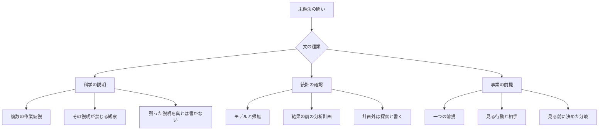
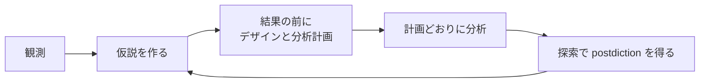
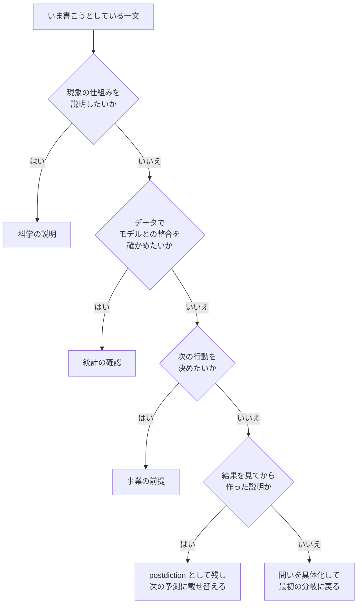

「仮説を立ててから動け」とよく言われます。しかし、科学の論文、A/Bテストの分析計画、新規事業の検証カードでは、同じ「仮説」という語が別の文を指しています。

この記事は、仮説を **科学の説明・統計の確認・事業の前提** の3種類に分けます。そして、それぞれの種類が結果を見る前に何を書かせるかを、一次資料に沿って整理します。対象読者は、技術調査、プロダクトの判断、個人の実験を自分で回す実務者です。

読み終えると、次のことができるようになります。

- いま書こうとしている一文がどの種類かを判定できる
- その種類で、結果を見る前に埋めるべき欄が分かる
- 「p<0.05 なら真」「事前登録すれば再現性が上がる」といった言い回しが、どこまで根拠に支えられているかが分かる

出典は、著者の公開原稿、学会声明、公式のカードとガイド、公的な解説を中心にしています。書籍の本文ではなく公開講演や公式ページで確認した定義は、その旨を本文に書きます。

*この記事の全体像。以下、順に解説します。*

## 仮説の立て方とは

仮説の立て方とは、**結果を見る前に、あとで当たり外れを判定できる一文を残す作業** です。

ポイントは「どの種類の文か」を先に決めることです。種類によって、書くべき欄が変わります。

| 種類 | 何についての文か | 結果を見る前に書くもの |
|---|---|---|
| 科学の説明 | 現象を生む仕組みの候補 | 複数の作業仮説と、各候補が禁じる観察 |
| 統計の確認 | 指定した統計モデルとデータの突き合わせ | 帰無、分析、除外、停止の計画 |
| 事業の前提 | アイデアが成り立つために真である必要がある信念 | 見る相手、見る行動、見る前に決めた分岐 |

### 特徴

- **科学の説明** は、現象を生む仕組みの候補です。複数の作業仮説を同時に置き、各候補が禁じる観察を書きます。
- **統計の確認** は、指定した統計モデルとデータの突き合わせです。帰無、分析、除外、停止を、結果を見る前の計画に残します。
- **事業の前提** は、アイデアが成り立つために真である必要がある信念を、一つに切り出したものです。見る相手、見る行動、見る前に決めた分岐を書きます。
- 探索でデータから作った説明は、次に試す予測とは別のモードです。同じデータに対する確認としては扱いません。
- 目標、機会、施策、指標、質問は、それぞれ別の文です。仮説の欄に混ぜると、外れたときに何が外れたのか分からなくなります。

### 概念構造

一文の種類が先に決まり、種類が欄を決めます。

3種類の欄は、1枚のカードの四隅のように共通化できるものではありません。

- 科学の「禁じる観察」は **予測** です。
- 統計の「分析計画」は **データの扱い** です。
- 事業の「分岐」は **次の行動** です。

### 3種類の書き分け表

| 欄 | 科学の説明 | 統計の確認 | 事業の前提 |
|---|---|---|---|
| 何についての文か | 観察を生む仕組みの候補 | 指定した統計モデル。しばしば効果の不在 | アイデアが成り立つために真である必要がある信念 |
| いつ書くか | 試験の前に予測を出す（Peirce 1878の規則）。仮説の形成そのものは驚きのあとでよい | 結果を観測する前（Nosek 2018、OSF Prereg） | テストの前に仮説、指標、基準を書く（Test Card） |
| 一つに絞るか | 絞らない。合理的な説明を作業仮説として同時に育てる（Chamberlin） | 確認的仮説は方向の有無まで分けて書く。交互作用は別の仮説にする（OSF Prereg） | 一つの前提に切る（Osterwalder、Torres） |
| 何が外れか | その説明が禁じる観察が出ること（Popper） | 計画した分析が、事前の基準でモデルとの不整合を示すこと | 見る前に決めた行動の分岐を外れること。近い値をあとから合格にしない |
| 合格の意味 | その試験では反駁されなかった。候補の外によりよい説明がありうる | 指定モデルと矛盾しにくかった、または矛盾した。仮説が真である確率ではない | その前提について、事前の分岐を越えた。案全体の確定ではない |
| 計画外の発見 | 次の予測の材料 | 探索と明示する。同じデータの確認とは書かない | 学びとして残し、次の仮説か次のテストにする |

### 科学の説明：複数の作業仮説と「禁じる観察」

**Chamberlin の複数の作業仮説（1890）**

Chamberlin は、知的方法を三つに分けました。

1. 支配理論
2. 一つの作業仮説
3. 複数の作業仮説

一つの作業仮説は、事実を確定する手段として支配理論よりは優れています。しかし、気に入った仮説はやがて支配的な位置に戻りやすい、と Chamberlin は書きます。複数の作業仮説では、探究者は仮説の家族の親になり、一つに愛情を固定しません。

例として挙げられているのは五大湖の盆地です。氷期前の谷、氷河による掘削、地殻の撓みを同時に問います。そして、どれか一つでは十分に説明できず、判断の問題は各作用がどの程度関与したかだ、と結論します。

**Platt の強い推論（1964）**

Platt の手順は次のとおりです。

1. 対立仮説を考え出す
2. 可能な結果ができるだけ一つ以上の仮説を排除する実験を考える
3. きれいな結果を得る
4. 残った可能性について、この手順を繰り返す

Platt は、排除以外の結論は不安定で再点検が必要だと書きます。また、何も排除しない理論は、すべてを予測することで何も予測しない、とも書きます。

**Popper の反証可能性**

Popper の公開抜粋は、次のように定式化します。

- 確認は、探せば容易に得られる
- 数えられるのは、危険な予測の結果だけである
- よい科学理論は、何かを禁じる
- 考えうるどんな出来事でも反駁できない理論は、非科学である

ただし Popper は、非科学的だと分かっても、それだけで無意味だとは分からない、とも書いています。

**Peirce の「試験の前に予測を述べる」**

Peirce は1878年の論考で、仮説を同種の事実の一般化とは別の推論として扱いました。そこで次の三つの規則を置きます。

- 試験の前に予測を述べる
- すでに当たると分かっている観点だけを選ばない
- 失敗も記録する

1908年の論考では、探究は驚きから始まります。第一段階の retroduction（仮説の形成）は保証を与えません。演繹が帰結を展開し、帰納がそれを評価します。

つまり、**仮説を思いつくのは驚きのあとでよい** が、**予測は試験の前に書く** という順序です。

### 統計の確認：p値の位置づけと分析計画

**ASA の p 値声明（2016）**

アメリカ統計学会（ASA）の声明は、p 値を「指定した統計モデルの下で、データの統計的要約が観測値と同じか、それより極端になる確率」と説明します。6つの原則を、仮説の文に残すことへ読み替えると次のようになります。

| 原則 | 仮説の文に残すこと |
|---|---|
| 1 | 何の不在を、どの仮定の下のモデルとして試すか。小さい p は、仮定が成り立つときの不整合の大きさであり、仮説の証明ではない |
| 2 | p を、仮説が真である確率とも、データが偶然だけで生じた確率とも書かない |
| 3 | 0.05の片側を真、反対側を偽、と書かない。設計、測定、外部の証拠、仮定を評価に入れる |
| 4 | 探した仮説の数、データ収集の決定、実施した分析、計算した p を隠さない。隠すと、報告された p は実質的に解釈できない |
| 5 | 統計的有意を、科学的・人的・経済的な重要性と同一視しない |
| 6 | 文脈のない p、とくに0.05付近を、単独で証拠の全体にしない。大きい p は帰無を支持する証拠ではない |

**OSF Prereg のフォーム**

事前登録のフォームは、研究の前に次を書くよう求めます。

- 方向の有無まで含む、検定可能な仮説
- デザイン
- サンプルサイズの根拠、または停止規則
- 仮説ごとの統計モデル
- 推論の基準
- 除外の条件

計画に無い検定は、最終論文で探索的と記す、とフォームに書かれています。

**Nosek ほかの事前登録（2018）**

Nosek らは、事前登録を「結果を観測する前に、研究上の問いと分析計画を定義する手続き」と定義します。目的は prediction（予測）を postdiction（後付けの説明）より優遇することではありません。**どちらであるかを明確にすること** です。

理想の循環は次のとおりです。

この点について Ledgerwood は、理論的な方向予測の事前登録と、分析計画の事前登録は別のものだと指摘しました。Nosek らの返答は "a prediction without an analysis plan is inert for falsification" です。**予測の文だけでは、反証の条件を満たしません。**

### 事業の前提：一つの前提と、見る前の分岐

**Strategyzer の Test Card**

2023年版の Test Card の欄は次のとおりです。

| 段 | 公式の書き出し |
|---|---|
| Hypothesis | We believe that |
| Test | To verify that, we will |
| Metric | And measure |
| Criteria | We are right if |

Osterwalder の記事は、この4欄で次を明示させると説明します。

- アイデアが機能するために真でなければならないこと
- その真偽の試し方
- 測るもの
- 成功の閾値

一つのアイデアにはカードが何枚も必要だ、とも書かれています。Strategyzer のアプリ紹介記事は、次の運用を勧めます。

- 最も危ない前提を仮説にする
- アイデアを殺しうるかどうかで並べる
- 安く速いテストから始める
- 状態を Valid / Invalid / Unknown で残す

*Testing Business Ideas* の公式ティーザーは、よい仮説の条件として次を挙げます。

- 証拠で真偽を示せる
- 何を、誰に、いつ見るかと、成功の姿が分かる
- 一つのことだけを含む

また、「We believe that…」だけに揃えると確認バイアスの罠になるため、前提を反証しようとする形の仮説も書ける、としています。

**Teresa Torres の assumption testing**

Torres は、用語を次のように分けます。

- **opportunity**：顧客のニーズ・痛み・欲求
- **assumption**：アイデアが成功するために真である必要がある信念

assumption は desirability、viability、feasibility、usability、ethical の5つに分類されます。実験設計については、次の考え方を示しています。

- 能力から書き始める型は、アイデア全体を試すことになる
- 成果は一つの前提だけでは決まらない
- 実験の前に、**支持・反証・差なし** の3つのときの行動を決める
- 3つが同じ行動なら、実験をせずに今すぐ行動する

合格線についても、Torres は2014年の記事で例を挙げています。変更でコンバージョン率が10%改善すると仮説を立てたなら、9%の改善は不合格です。あとから「9%で十分」と判断を動かさないための線引きです。

assumption testing の記事は、試す単位を一つの前提にし、全部は試さず、重要で証拠が薄いものから試す、と書きます。テストの型は次の4つです。

- その瞬間を模擬するプロトタイプ
- 一問だけの調査
- 既存データの探索
- 実現性のスパイク

**Eric Ries の Lean Startup**

Ries の公式 Methodology は、実験が答えるのは「作れるか」ではなく「作るべきか」だ、と書きます。

value hypothesis と growth hypothesis という語は、2011年の公開講演の書き起こしの範囲では、次のように説明されています。

- **value hypothesis**：顧客が価値を経験したと、どう知るか
- **growth hypothesis**：新規顧客が、過去の顧客の行動からどう来るか

同じ場で、leap-of-faith（信念の跳躍）となる前提の見分け方として、「事業計画のその率を0にすると売上の表全体が0になるセル」が挙げられています。例は無料トライアル登録率10%です。書籍の印刷上の定義ではなく、この講演の範囲の説明です。

**The Mom Test の質問の区別**

Rob Fitzpatrick の2017年の講演は、次の2つの質問を分けます。

- "do you think it's a good idea"：自分の案についての質問
- "how do you currently deal with this"：相手の生活についての質問

顧客に聞くときは、前者ではなく後者で、相手がその問題に実際どう対処しているかを聞きます。

**Effectuation という別の手順**

Sarasvathy（2024）は、Lean Startup と effectuation を次のように分けます。

- **Lean Startup**：市場を外生とみなす仮説検証
- **effectuation**：自分から関わる関係者のコミットメントによって、市場を内生的に作れる方法

市場を自分たちで作る段階では、仮説カードとは別の手順が残る、ということです。

### 日本語の文書での「仮説」の位置

日本語の公的文書や著者の公開記事でも、「仮説」が置かれる位置はそろっていません。

| 系統 | 書くもの | いつ |
|---|---|---|
| 内田和成 | 情報が少ない段階の仮の答え。答えから考える | 分析の前 |
| 安宅和人 | 解くべき課題に対する見立て。進捗に応じて見直す | 分析の前 |
| 科研費（研究活動スタート支援の様式） | 核心をなす学術的「問い」。仮説という語ではない | 応募の計画調書 |
| SSH の応募要領 | 研究開発の仮説。根拠と、指定期間内に検証できるか | 応募の実施計画 |
| 小学校学習指導要領解説 理科編 | 予想や仮説を、検証計画の前に置く | 問題解決の過程 |
| 高等学校学習指導要領解説 理数編 | 検証可能な仮説。時間と環境の中で検証できるか | 課題解決の前 |
| 日本心理学会 執筆・投稿の手びき | 論文の問題欄に仮説を含める | 投稿原稿 |

内田の「仮の答え」は、結果を見る前に分析の方向を決める文です。統計の分析計画や、事業の合格線とは別のものです。

## 注意点

仮説の立て方の周辺では、一次資料の範囲を超えた言い回しがよく見られます。どこまで信じてよいかを整理します。

| よく見る言い方 | 一次資料が実際に言っている範囲 |
|---|---|
| 強い推論を使う分野は一桁速い | Platt は "perhaps by an order of magnitude, if numbers could be put on such estimates" と書いています。「数を置けるなら」という留保付きの見積もりであり、測定値ではありません |
| 公表された知見のほとんどは偽である | Ioannidis（2005）は、事前オッズ、検出力、有意水準、バイアス、チーム数を置いたモデルの中で主張しています。同じ論文で、実施が良く検出力が十分なランダム化比較試験で、事前確率が50%なら、真である確率は約85%になるとも書いています |
| 事前登録をすれば再現性が上がる | Nosek ほか（2018）は、原理としては強いが、再現性の優位を確立する実験的証拠はまだ十分でない、と書いています |
| p<0.05 なら仮説は真である | ASA 声明の原則2は、p 値は仮説が真である確率ではないとしています。原則3は、決定を p が閾値を越えたかだけで行わないよう求めています |
| 帰無仮説を立ててはならない | 同じ声明の原則1は、p 値が統計モデルとデータの不整合を示しうると書いています。帰無を置くことは禁じていません。ASA は2015年に、帰無仮説検定を禁止した雑誌方針に対して、適切な統計的推論を捨てないよう求めるコメントを出しています |
| HARKing は常に禁止される | Kerr（1998）の抄録は、HARKing を「結果から作った仮説を、事前仮説だったかのように書くこと」と定義しています。費用が便益を常に上回るかは、議論として残しています |

### 「知見のほとんどは偽」の条件

Ioannidis（2005）の数値は、条件によって大きく変わります。

| 条件 | 知見が真である確率 |
|---|---|
| 実施が良く検出力が十分な RCT、事前確率50% | 約85% |
| 検出力不足の早期臨床試験 | 約4回に1回 |
| 検出力が十分な探索的疫学、R=1:10 | 5回に1回程度（検出力不足ならさらに低い） |
| 事前オッズが低い遺伝子研究、バイアス u=0.10 | 4.4×10⁻⁴ |

確認的で条件の良い試験の数字を、探索的な試行にそのまま当てはめることはできません。逆も同様です。

### 事前登録の効果の観察

事前登録と結果の関係を調べた研究は、次のように限定して読む必要があります。

- **Kaplan と Irvin（2015）**：米国 NHLBI が支援した大規模 RCT 55件を対象にしています。2000年より前は30件中17件（57%）が主アウトカムで有意な利益を示しましたが、2000年以降は25件中2件（8%）でした。著者は、事前登録が原因だとは言えない、と書いています。標本は成人の心血管試験であり、事業の仮説カードではありません。
- **Claesen ほか（2021）**：*Psychological Science* の事前登録バッジ付き論文27件の抄録です。計画から逸脱しなかったのは2件、逸脱をすべて開示したのは1件、逸脱を一つも開示しなかったのは9件でした。
- **van den Akker ほか（2023）**：事前登録した心理学研究193件と、関連する非事前登録研究193件を比べました。抄録は、事前登録群で陽性率の低さ、効果量の小ささ、統計エラーの少なさを見いだせなかった、と結論しています。

事前登録は、**確認と探索の区別を明確にする手続き** です。事前登録をしたこと自体を、結果が正しいことの証拠として書くことはできません。

### 手順そのものの限界

上で紹介した手順にも、それぞれ限界が指摘されています。

- **候補の外に説明が残る**：検討した集合の外によりよい説明があるなら、集合の最良は "the best of a bad lot" にすぎない、という van Fraassen の批判があります（SEP の Abduction 項目による要約）。
- **一回の排除実験は決定的でない**：O'Donohue と Buchanan（2001）は、対立仮説の完全な列挙は不可能であり、補助仮説があるため一回の実験は論理的に決定的でない、と論じています。生態学のように複数の原因が同時に働く分野では、決定的な実験は原理的に難しいという議論もあります。
- **Popper の反証も一回では決まらない**：SEP の Popper 項目は、論理的には反例一つで普遍言明は偽になるが、方法の上では一つの衝突だけで理論を捨てるとは限らない、と要約しています。
- **成果が前提の連言で決まる**：成果が複数の前提がそろったときにしか出ない場合、一つの前提の合格はアイデアの合格ではありません。
- **一つの仮説を早く置くことの危うさ**：早い段階で全体の結論を仮に置く手順は、Chamberlin が警告した「一つの気に入りが支配理論になる」失敗と隣り合わせです。

### 書籍本文ではなく公開資料の範囲で扱っているもの

次のものは、書籍の印刷上の定義ではなく、公式ページや公開講演の範囲で扱っています。

- Ries の value hypothesis / growth hypothesis の定義（2011年の公開講演の書き起こし）
- Fitzpatrick の質問の区別（2017年の講演）。講演内の「投資家は約5回に1回しか当たらない」は、出典論文の無い講演者の主張です
- Torres、内田、安宅の考え方（公開記事・対談の範囲）

## 結局、どの種類で書けばよいのか

答えは、**文の種類を先に一つ選び、その種類が要求する欄だけを埋める** です。4つの欄を、科学・統計・事業の共通の関門にはしません。

判断のしかたは次のとおりです。

### 科学の説明を書くとき

1. 気に入っている説明のほかに、同じ観察を生みうる説明を少なくとももう一つ書く
2. 各説明について、それが起きたらその説明が困る観察を一行書く
3. 残った説明を真だとは書かない。検討していない説明がありうる、と一行残す
4. 原因が同時に働きうると分かっているときは、一つを残す実験を、度合いを測る問いに変える

**例**：「ページ表示が遅くなったのは DB クエリのせいだ」だけを書かない。次のように並べます。

| 候補 | 禁じる観察 |
|---|---|
| DB クエリの劣化 | DB の応答時間が変わっていないのに遅い |
| CDN のキャッシュミス増加 | キャッシュヒット率が変わっていないのに遅い |
| フロントのバンドル肥大 | バンドルサイズが同じなのに遅い |

### 統計の確認を書くとき

1. 結果を見る前に、モデル、帰無、検定、除外、停止を分析計画として残す
2. 方向がある予測は、その分析計画と組にする。予測だけの文は、反証の条件として未完了のまま残す
3. 計画に無い分析は探索と書き、同じデータの p で確認済みとは書かない
4. p が閾値を越えたことを、仮説が真であること、効果の大きさ、重要性の文にしない
5. 事前登録したこと自体を、再現性が上がった証拠として書かない

**例**：A/B テストなら、「新しいボタン色でクリック率が上がる」だけで終えません。主指標、検定方法、サンプルサイズまたは停止規則、除外するセッションの条件を、配信を始める前に書きます。セグメント別の差は、計画に無ければ探索として報告します。

### 事業の前提を書くとき

1. 目標、機会、作るものから、成り立たなければならない信念を一つ切り出す
2. 誰の、どの行動を見るかと、見る前の合格の分岐を書く
3. 支持・反証・差なしのあとの行動を先に書く。3つが同じなら、その実験はしない
4. 成果が複数の前提の連言でしか出ないと分かっているときは、一つの合格をアイデアの合格と書かない
5. 顧客に聞くときは、案の賛否ではなく、相手が前回その問題にどう対処したかを聞く
6. 市場を自分たちで作る段階では、失ってよい量と、手元にある手段でのコミットメントを、仮説カードとは別の手順として残す

**例**：Test Card の形で書くと次のようになります。

| 段 | 記入例 |
|---|---|
| We believe that | 個人開発者は、毎週の振り返りをテンプレートで済ませたい |
| To verify that, we will | ランディングページにテンプレート配布の登録フォームを置く |
| And measure | 訪問者のうち登録した割合 |
| We are right if | 訪問者500人の時点で、10%以上が登録する |

判定の条件と、3つの結果ごとの行動も先に決めます。

- **支持**（訪問者500人に達し、登録率10%以上）：テンプレートの有料版を試作する
- **反証**（訪問者500人に達し、登録率10%未満）：振り返り以外の課題を探す
- **判定できない**（4週間たっても訪問者が500人に届かない）：集客経路を変えて同じカードをやり直す

訪問者500人で登録率9%なら、反証です。あとから「9%なら十分」と合格に動かしません。

### まだ文にできないとき

データから作った説明は、postdiction と明示して残してかまいません。ただし、そのラベルは次の確認を免除しません。次の予測として、上のいずれかの欄に載せ替えます。

### 個人の調査で今日からできる手順

1. 今日の問いに、科学・統計・事業のいずれかのラベルを一つ付ける
2. そのラベルの欄を、結果を見る前に埋める。埋まらない欄は、実験に欠けている条件として残す
3. 3つの結果が同じ次の行動になる実験は、実行しない
4. 結果が出たあと、計画外に見えた文は、次のカードの予測に移す

### 手順を変えてよい条件

- 候補が排他に近く、補助仮定を先に分けられ、決定的な排除が実際に取れる問題では、Platt の繰り返し手順を科学の説明の中で使ってよい。ただし「速度が一桁上がる」とは書かない
- 検出力と事前の当たりやすさが高く、バイアスが小さい確認的試験では、Ioannidis のモデル上、知見が真である確率は約85%まで上がりうる。その条件を外した探索に、同じ割合を使わない
- 大規模な臨床研究の登録制度で陽性率が下がったことを、個人の事業実験の精度が改善した証拠として使わない

## まとめ

- 「仮説」という語は、科学の説明、統計の確認、事業の前提の3種類の文を指します
- 科学の説明では、複数の作業仮説を並べ、各候補が禁じる観察を書きます
- 統計の確認では、モデル、帰無、分析、除外、停止を結果の前に計画し、計画外は探索と明示します。p 値は仮説が真である確率ではありません
- 事業の前提では、一つの前提、見る行動、見る前の分岐を書き、支持・反証・差なしの各結果のあとの行動を先に決めます
- 事前登録や強い推論には効果を誇張した言い回しが多いため、一次資料が実際に言っている範囲で使います
- まず一文の種類を一つ選び、その種類の欄だけを埋めることが、仮説の立て方の出発点です

この記事が少しでも参考になった、あるいは改善点などがあれば、ぜひリアクションやコメント、SNSでのシェアをいただけると励みになります！

## 参考リンク

- Chamberlin, T. C. "The Method of Multiple Working Hypotheses." *Science*, 148(3671), 754–759, 1965（1890年版の再録）. https://sealevel.info/Chamberlin1890.pdf
- Platt, J. R. "Strong Inference." *Science*, 146(3642), 347–353, 1964. https://www.whoi.edu/cms/files/platt64sci_72743.pdf
- Popper, K. "Science: Conjectures and Refutations"（公開抜粋）. https://tildesites.bowdoin.edu/~j.knockel/falsification/
- Thornton, S. "Karl Popper." *Stanford Encyclopedia of Philosophy*. https://plato.stanford.edu/entries/popper/
- Douven, I. "Abduction." *Stanford Encyclopedia of Philosophy*. https://plato.stanford.edu/entries/abduction/
- Peirce, C. S. "Deduction, Induction, and Hypothesis." *Popular Science Monthly*, 13, 1878. https://en.wikisource.org/wiki/Popular_Science_Monthly/Volume_13/August_1878/Illustrations_of_the_Logic_of_Science_VI
- Peirce, C. S. "A Neglected Argument for the Reality of God." *Hibbert Journal*, 1908. https://en.wikisource.org/wiki/A_Neglected_Argument_for_the_Reality_of_God
- Wasserstein, R. L., and Lazar, N. A. "The ASA's Statement on p-Values: Context, Process, and Purpose." *The American Statistician*, 70(2), 129–133, 2016. https://doi.org/10.1080/00031305.2016.1154108
- Wasserstein, R. "ASA comment on a journal's ban on null hypothesis statistical testing." 2015. https://community.amstat.org/blogs/ronald-wasserstein/2015/02/26/asa-comment-on-a-journals-ban-on-null-hypothesis-statistical-testing
- Ioannidis, J. P. A. "Why Most Published Research Findings Are False." *PLoS Medicine*, 2(8), e124, 2005. https://doi.org/10.1371/journal.pmed.0020124
- Nosek, B. A., et al. "The preregistration revolution." *PNAS*, 115(11), 2600–2606, 2018. https://doi.org/10.1073/pnas.1708274114
- Ledgerwood, A. *PNAS*, 115(45), E10516–E10517, 2018. https://doi.org/10.1073/pnas.1812592115
- Nosek, B. A., et al. Reply. *PNAS*, 115(45), E10518, 2018. https://doi.org/10.1073/pnas.1816418115
- Kaplan, R. M., and Irvin, V. L. *PLOS ONE*, 10(8), e0132382, 2015. https://doi.org/10.1371/journal.pone.0132382
- Claesen, A., et al. *Royal Society Open Science*, 8(10), 211037, 2021. https://doi.org/10.1098/rsos.211037
- van den Akker, O. R., et al. *Behavior Research Methods*, 56(6), 5424–5433. https://doi.org/10.3758/s13428-023-02277-0
- OSF Prereg form (v1). https://preregr.opens.science/articles/form_OSFprereg_v1.html
- Kerr, N. L. "HARKing: Hypothesizing After the Results are Known." 1998. https://kar.kent.ac.uk/41330/
- O'Donohue, W., and Buchanan, J. A. "The Weaknesses of Strong Inference." *Behavior and Philosophy*, 29, 1–20, 2001. http://www.behavior.org/resources/102.pdf
- Osterwalder, A. "Validate your ideas with the Test Card." Strategyzer, 2015. https://www.strategyzer.com/library/validate-your-ideas-with-the-test-card
- Strategyzer. The Test Card (2023). https://cdn.prod.website-files.com/647655122de68d8272dce023/65c35cb382aabab323d94285_The%20Test%20Card%20-%202023.pdf
- Bostelaar, K. Strategyzer, 2015. https://www.strategyzer.com/library/new-in-strategyzer-test-your-business-assumptions-directly-in-our-app
- Torres, T. "The 5 Components of a Good Hypothesis." 2014. https://www.producttalk.org/the-5-components-of-a-good-hypothesis/
- Torres, T. Experiment design. https://www.producttalk.org/experiment-design/
- Torres, T. Assumption testing. https://www.producttalk.org/assumption-testing/
- Torres, T. Glossary: Assumption. https://www.producttalk.org/glossary-discovery-assumption/
- Ries, E. The Lean Startup Methodology. https://theleanstartup.com/principles
- Ries, E. "Three drivers of growth for your business." 2008. https://www.startuplessonslearned.com/2008/09/three-drivers-of-growth-for-your.html
- A Conversation with Eric Ries at the Chicago Lean Startup Circle. 2011. https://orthogonal.io/insights/lean-startup/a-conversation-with-eric-ries-at-the-chicago-lean-startup-circle/
- Sarasvathy, S. D. "Lean Hypotheses and Effectual Commitments." *Journal of Management*, 2024. https://effectuation.org/hubfs/JOM%20-%20Lean%20Hypotheses%20and%20Effectual%20Commitments.pdf
- The five principles of effectuation. https://effectuation.org/the-five-principles-of-effectuation
- 文部科学省『小学校学習指導要領（平成29年告示）解説 理科編』、『高等学校学習指導要領（平成30年告示）解説 理数編』
