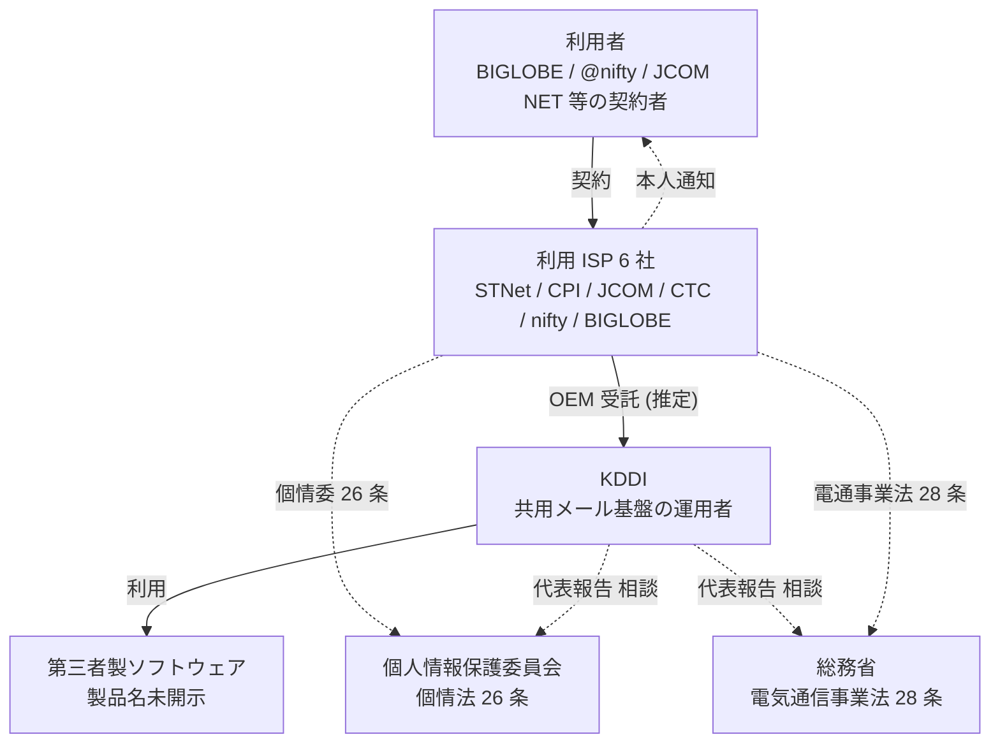

## 概要

KDDIがISP向けに提供する共用メール基盤で不正アクセスが発生しました。メールアドレスとパスワード**最大1,422万件**(休眠・解約済みを含む)に影響した可能性が公表されました(2026年6月23日)。

影響を受けたのは、KDDIがメール基盤を「提供」する6 ISPです(日経は「OEM」と表現、二次情報)。原因はKDDIの公式表現で「**第三者製ソフトウェアの脆弱性**」とされ、製品名・CVEは未開示です。

この事案の本質は「**ブランド数 ≠ 基盤数**」が事故初動で一気に露呈した点にあります。利用者から見るとBIGLOBE / @nifty / J:COM NET / コミュファ光 / ピカラ / CPIはそれぞれ別ISPですが、メール基盤としてはKDDIが運用する単一プラットフォームを共有していました。普段はOEMの裏側として隠れている共有構造が、事故1件で「**説明主体・通知順・鍵保管・監査ログ**」の責任境界を全部表に引きずり出した形です。

本記事の結論は次のとおりです。共有基盤事故の初動は、**平時に作っておく「責任境界表 + DPA条項 + 通知SLA + 合同演習」の組合せ**で**軽減できます**(解消はできません)。AWS Security IRのRACIドキュメントが示すとおり、RACIや責任境界表は**役割整理の一手段**であって、SLA・監査ログ・暗号化等の運用統制を置き換えるものではありません。本稿では、実装可能な責任境界表テンプレ(12項目)、初動RACI(15アクティビティ)、契約必須条項(10項目)、合同演習スケジュールを一通り提示します。

## 特徴

### この事案がガイドライン上で踏んでいる枠

| 規制・ガイドライン | 関連条文 | 本件で発動する論点 |
|---|---|---|
| 個人情報保護法 (令和3年改正) | 第26条 | 漏えい等の報告義務。速報「速やか」(運用3-5日、二次情報)、確報原則30日、不正目的時60日 (施行規則7条3号) |
| 個人情報保護法 | 同26条 | 委託元・委託先が連名で個情委報告できる (個情委FAQ Q5-17-16、一次確認済)。委託先報告義務の振替免除運用は別FAQで別途確認が必要 |
| 電気通信事業法 | 第28条 | 重大事故報告 (利用者数 × 時間の閾値あり) |
| 電気通信事業法 | 第4条 | 通信の秘密保護。メール本文・件名の漏えいは件数閾値とは別論点として違反になりうる |
| 総務省「クラウドサービス提供における情報セキュリティ対策ガイドライン 第3版」 | §I.6 / §I.7 | SaaS/PaaS/IaaSの責任分担図、サプライチェーン4パターン。「利用者との契約者がサプライチェーン全体の管理責任を負う」を明文化 |

総務省ガイドライン §I.7 の明文化は本件で重要です。KDDIが「報告・相談」窓口を引き受けた構図はここに整合します。AWS / Azure / GCPのShared Responsibilityが2軸モデル中心で再委託は契約論に委ねるのに対し、日本の総務省ガイドラインは**多階層共有基盤を直接想定**して書かれており、共用メール基盤の整理には海外モデルより日本ガイドラインのほうが直接適用しやすい構造です。

### 共有メール基盤の構造パターン

| モデル | 概要 | 例 |
|---|---|---|
| A | 自社運用 | 大手ISP自前のメールサーバ |
| B | OEM受託・ホワイトラベル基盤 (本件) | 上位事業者が運用、複数ブランドが利用 |
| C | ホスティングOEM (IaaS / PaaS寄り) | データセンター事業者のメール基盤を借りる |
| D | SaaS型クラウドメール | Google Workspace / Microsoft 365リセール |
| E | 運用BPO委託 | 基盤は自社、運用だけ第三者に委ねる |

au one net自体がDION (DDI起源) とKDD NEWEBを**単一基盤で同時ホスト**してきた歴史を持つため、「単一ブランド = 単一基盤」ではない構造はもともとKDDI内部で常態化していました。今回のメール基盤は**さらにその外周で6社を束ねる**多階層構造です。

### 共有基盤事故の3つの共通論点

ベネッセ、富士通 ProjectWEB、LINE、本件で共通します。

| 共通論点 | 説明 |
|---|---|
| ブランド数 ≠ 基盤数 | 利用者の心象モデルと運用実体がずれる |
| 権限境界が物理境界を超える | テナント分離が論理層だけだと、共通コンポーネント(認証 / ロギング / 運用端末)の脆弱性が全テナント直撃する |
| 共通コンポーネントの脆弱性が全テナント直撃 | 本件「第三者製ソフトウェア」の脆弱性悪用が典型 |

## 概念構造

### 全体構造 (本件の関係者)

| 要素 | 説明 |
|---|---|
| USER | 6 ISPの契約者。各社ブランドの利用者 |
| ISP6 | STNet / CPI / JCOM / 中部テレコミュニケーション / ニフティ / BIGLOBE |
| KDDI | 共用メール基盤の運用者。事故時は「報告・相談」窓口を担う |
| SW | 第三者製ソフトウェア。製品名はKDDI未開示 |
| PPC | 個人情報保護委員会。個情法第26条報告先 |
| SOUMU | 総務省。電気通信事業法第28条報告先 |

利用者から見るとISP 6社が窓口ですが、規制上の報告ラインはKDDIとISP 6社の両方から並走しうる構造です。説明主体について「**誰がいつ何を言う**」を事故前に決めていないと、6社の発表が食い違ったり、利用者通知のタイミングがずれたりします。

### 責任境界表テンプレ (12項目 × 4ロール)

「平時に書いておく最小装備」です。共有基盤事故の最初の30分で「これは誰の責任か」を決める紙として使います。4ロールが最小構成で、必要に応じて利用者を入れて5ロールに拡張できます。

| # | 責任項目 | 委託元ISP | OEM基盤運用者 | 運用受託BPO | SaaS / 第三者SWベンダー |
|---|---|---|---|---|---|
| 1 | 利用者向け窓口・本人通知 | **R** | C | I | I |
| 2 | 個情委への速報・確報 | **A** | R (共同窓口時) | I | I |
| 3 | 総務省への重大事故報告 | **A** | R (基盤側事故時) | I | I |
| 4 | プレスリリース (共同 / 個別の決定) | C | **A** | I | I |
| 5 | 監査ログの取得・保持・提供 | C | **R** | C | I |
| 6 | アクセス鍵・パスワードハッシュの管理 | C | **R** | C | I |
| 7 | 第三者製ソフトウェアの脆弱性管理 | I | **R** | C | A (パッチ提供) |
| 8 | フォレンジック調査 | C | **R** | C | C (技術支援) |
| 9 | 影響範囲確定 (件数・テナント特定) | C | **R** | C | I |
| 10 | パスワードリセット・強制ログアウト | **R** | C | C | I |
| 11 | 代替手段の提供 (臨時メール経路等) | **A** | R | C | I |
| 12 | 平時 / 事故時の合同演習主催 | C | **A** | C | C |

凡例

| 略称 | 意味 |
|---|---|
| R | Responsible (実施) |
| A | Accountable (説明責任) |
| C | Consulted (相談) |
| I | Informed (通知) |

### 事故初動 RACI (15アクティビティ × 5ロール)

| # | アクティビティ | 利用者 | 委託元ISP | OEM運用者 | 運用BPO | SWベンダー |
|---|---|---|---|---|---|---|
| 1 | 検知 (SIEM / EDR) | — | I | **R/A** | C | I |
| 2 | トリアージ (事故認定) | — | C | **A** | R | C |
| 3 | 委託元への速報 (24h SLA) | — | **R** (受) | R (発) | I | I |
| 4 | 個情委速報 (3-5日) | — | **A** | R | I | I |
| 5 | 総務省速報 (遅滞なく) | — | A | **R** | I | I |
| 6 | 利用者影響範囲確定 | — | C | **R/A** | C | I |
| 7 | パスワードリセット決定 | I | **A** | R | R | I |
| 8 | プレスリリース合意 | — | C | **A** | I | I |
| 9 | 同時公表タイミング調整 | — | **A** | R | I | I |
| 10 | 本人通知 | **受** | **R/A** | C | I | I |
| 11 | フォレンジック開始 | — | I | **R** | C | C |
| 12 | パッチ適用・暫定遮断 | — | I | **R/A** | R | A (供給) |
| 13 | 個情委確報 (30 / 60日) | — | **A** | R | I | I |
| 14 | 再発防止策の策定 | — | C | **R/A** | C | C |
| 15 | 事後ふりかえり (Tabletop含む) | — | **A** | A | C | C |

### DPA・委託契約に盛り込む必須10条項

GDPR Art.28(3)(a)-(h)と個情委ガイドラインを合成しました。共有基盤のDPAに最低限書く項目です。

| # | 条項 | 要点 |
|---|---|---|
| 1 | 処理内容の特定 | 目的・種別・カテゴリ・期間 |
| 2 | 再委託の事前承認 | 再委託先一覧の維持 |
| 3 | 委託先 → 委託元 漏えい通知SLA | 24h以内に第一報、72h以内に確報 (法令上の必須ではなく実務推奨。GDPR Art.33(2)はprocessor→controllerを`without undue delay`とのみ規定、72hはcontroller→監督機関の義務) |
| 4 | 本人通知の主体明示 | 委託元 or 委託先のどちらが行うか |
| 5 | 規制当局通知の主体明示 | 同上 |
| 6 | 監査ログの保持期間と提供義務 | 委託元の要請時にN営業日以内提供 |
| 7 | アクセス鍵・パスワードハッシュ管理責任 | ハッシュアルゴリズム指定、鍵ローテーションSLA |
| 8 | 第三者ソフトウェアのパッチ管理 | Critical公表後72h以内に暫定対応着手、N日以内に正規パッチ |
| 9 | インシデント時の合同対応条項 | フォレンジック・広報・法務の役割 |
| 10 | 演習義務 | 年1回以上のTabletop / Red Teamを契約に明記 |

### 反証 — 表だけでは機能しない

責任境界表が形骸化した実例は複数報告されています。本稿の主張を盲信しないため、反対側のエビデンスをそのまま置きます。

| 反証 | 内容 |
|---|---|
| LINEヤフー事案 | 全容把握まで長期化したと業界で指摘されている (二次情報、原典報告書名・日付の一次確認未済)。委託先→委託元の通知SLAが時計を回せなかった |
| ベネッセ判決 | 契約に責任分界が書かれていても、委託元の監督責任は免除されない (裁判所判断)。再々委託までPPC FAQで監督義務が及ぶ |
| クラウド共有責任モデルの理解度ギャップ | クラウド利用企業のCISOで「責任モデルを十分理解している」と答えた割合は限定的で、モデル起因のセキュリティ事故も継続報告されている (二次情報、具体数値の一次確認未済) |
| AWS Security IR RACIページの位置付け | AWSはRACIを「セキュリティ事案対応における役割整理の手段」として示しており、SLA・監査ログ・運用統制の代替ではない前提 |
| 規制上の期限と実運用の乖離 | 業界調査では漏えい検知から通知までの実運用が法定期限より大幅に長くなる傾向が報告されている (二次情報、具体数値の一次確認未済) |
| Single Throat to Chokeの弊害 | ABA Banking Journal「タスクはアウトソースできるがリスクはできない」。「相手が自死」問題で1社集約は別の脆さを生む |

責任境界表は「事故初動の最初の30分を救う最小装備」であり、銀の弾丸ではありません。これを補う指針です。

| # | 補強指針 | 要点 |
|---|---|---|
| 1 | 多層防御 | 表 + DPA + 監査ログ + 暗号化 (鍵分離) + パスワード強度ポリシー |
| 2 | 合同演習を契約義務化 | 年1回以上のTabletop / Red Team。机上演習が"theater"化しないよう、外部監査人を入れる |
| 3 | 表を初動ランブックに紐付ける | 表 → Runbook → Communication Treeの三段で実装 |
| 4 | 未解決グレーゾーンを表に明記する | RACIの最大の弱点は「グレーゾーン処理が苦手」。「不明 / 都度協議」と書いた箱を残す勇気 |
| 5 | Single Throat to Chokeは窓口統一にだけ使う | 「責任の集約」ではなく「コミュニケーションの集約」として運用する |

### 未解決の問い

| ID | 内容 |
|---|---|
| U1 | 本件の脆弱性が CVE-2025-42599 (Active! mail Stack-based Buffer Overflow, CVSS 9.8、NVD / JVN#22348866 / JPCERT注意喚起で実在確認) かどうかは KDDI公式未開示 (未確認)。Active! mailは2025-04公表時点でJVN / JPCERTが悪用確認を記載しており時期は整合するが、製品名はKDDIから公表されていない |
| U2 | 1,422万件のうち平文パスワードとハッシュ化パスワードの内訳 (未確認) |
| U3 | 6社 (STNet / CPI / JCOM / CTC / ニフティ / BIGLOBE) とKDDIの正式契約形態 (OEM / 業務委託 / プラットフォーム提供のどれか) (未確認)。KDDI公式は「提供」とのみ、日経が「OEM」と表現 |
| U4 | 個情委への正式受理日 (未確認)。総務省がKDDIに報告徴収は二次情報 (NHK / 時事報道) のみ |
| U5 | 個情委速報「速やか」の運用日数 (二次情報、3-5日説あるが個情委公式の明示なし) |

## 推奨アクション

実装エンジニア・SRE・PMO向けに、平時・事故時・事故後の3局面で整理します。

### 平時 (今すぐやる)

| # | アクション | 要点 |
|---|---|---|
| 1 | 責任境界表12項目を契約とRunbookの両方に書く | テンプレは上記表をそのまま流用可能。委託元 / OEM運用者 / BPO / SaaSの4軸が最小、必要なら利用者軸を加えて5軸 |
| 2 | DPAに通知SLAを明記 | 24h第一報 / 72h確報 / 規制当局通知主体の明示 |
| 3 | 責任境界表を年1回Tabletopで叩く | 「項目Xの事故が起きた時のCommunication Treeを30分で書け」演習。外部監査人を入れて"theater"化を防ぐ |
| 4 | 共通コンポーネントの脆弱性管理をSLA化 | Critical公表後72h以内の暫定対応、N日以内の正規パッチ |
| 5 | 監査ログを二系統で取り、保持期間を契約に書く | 「テナント別」と「共通レイヤ別」 |

### 事故時 (Day 0-3)

| # | アクション | 要点 |
|---|---|---|
| 1 | 責任境界表を最初の30分で参照 | 全員が同じ表を開く。表で決まっていない項目は「都度協議」と明記してあれば、その場でエスカレーション |
| 2 | 通知SLAに従って24h以内に委託元へ第一報 | 個情委26条速報のトリガー |
| 3 | 広報は「共同 / 個別」をOEM運用者がAccountableで決定 | 食い違いを防ぐ |
| 4 | 本人通知は委託元ISPがR/A | 利用者の窓口はISP |

### 事故後 (Day 4以降)

| # | アクション | 要点 |
|---|---|---|
| 1 | 再発防止策に「責任境界表の更新項目」を必ず含める | 表の改訂をふりかえりの成果物にする |
| 2 | 次年度のTabletopに今回事故シナリオを反映 | 演習が"theater"にならないための具体素材 |
| 3 | 未解決グレーゾーンを埋める | 表で「不明 / 都度協議」になっていた箱を確定させる |

## まとめ

KDDIの共用メール基盤事案は、共有インフラの「ブランド数 ≠ 基盤数」を事故1件で表に出した典型例です。責任境界表 (12項目)、初動RACI (15アクティビティ)、DPA必須10条項、合同演習を平時に整えることで初動の30分を救えますが、銀の弾丸ではないため、多層防御・初動ランブック連携・グレーゾーン明記とセットで運用する必要があります。

この記事が少しでも参考になった、あるいは改善点などがあれば、ぜひリアクションやコメント、SNSでのシェアをいただけると励みになります!

## 参考リンク

- 公式ドキュメント
  - [総務省 クラウドサービス提供における情報セキュリティ対策ガイドライン 第3版](https://www.soumu.go.jp/main_content/000766457.pdf)
  - [NIST SP 800-61 Rev.3](https://csrc.nist.gov/pubs/sp/800/61/r3/final)
  - [個人情報保護委員会 FAQ Q5-17-16](https://www.ppc.go.jp/all_faq_index/faq5-q17-16/)
  - [個人情報保護委員会 漏えい等の報告等](https://www.ppc.go.jp/news/kaiseihou_feature/roueitouhoukoku_gimuka/)
  - [GDPR (EUR-Lex)](https://eur-lex.europa.eu/eli/reg/2016/679/oj/eng)
  - [NVD CVE-2025-42599](https://nvd.nist.gov/vuln/detail/CVE-2025-42599)
  - [JVN#22348866 (Active! mail関連)](https://jvn.jp/jp/JVN22348866/)
  - [JPCERT/CC 注意喚起 (Active! mail)](https://www.jpcert.or.jp/at/2025/at250010.html)
  - [AWS Security IR RACI Matrix](https://docs.aws.amazon.com/security-ir/latest/userguide/raci-matrix.html)
- 記事
  - [Nikkei xTech KDDI共用メール基盤事案報道](https://xtech.nikkei.com/atcl/nxt/news/24/03272/)
