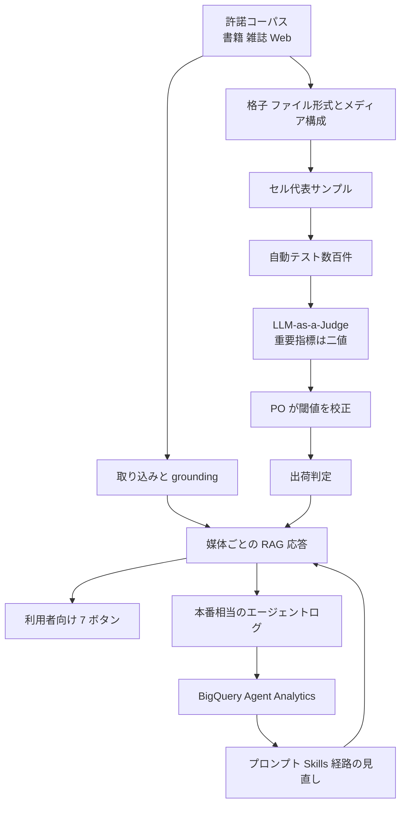

**Buffmee（バフミー）** は、KDDI が 2026年7月28日に提供を開始した消費者向け対話型 AI です。
許諾を得た書籍、雑誌、Web メディアを情報源にし、出典を付けて検索、要約、提案などを行います。
Google Cloud Blog の共同事例は、このサービスを Retrieval-Augmented Generation（RAG）アプリとして位置づけ、Gemini Enterprise Agent Platform の評価サービスと Agent Development Kit（ADK）を使った評価と実行経路の見直しを報告します。
本稿で扱う数値は、KDDI と Google Cloud の共同事例が掲げた到達宣言です。

この記事では、Buffmee の仕組み、評価ループと実行ループの置き方、公式ドキュメントが支える範囲、発注側が評価契約へ落とせる条項を、2026-09-10 時点の公開資料に沿って整理します。

*この記事の全体像。以下、順に解説します。*

## Buffmeeとは

情報源はインターネット全体ではなく、出版社と専門メディアから許諾を得たコンテンツに限定します。
画面は媒体ごとのトークと、検索、要約、分析、画像生成、提案、問題演習、フラッシュカードの 7 ボタンで構成します。
料金は 0 円プラン（トーク 100回/日、画像 10回/日）とプレミアム月額 980 円（税込）です。

著者は KDDI の柏野淳一と Google Cloud Japan の桂木美樹です。
開発には KDDI iret と Google Cloud Consulting が関わりました。
KDDI と Google Cloud の協業契約は 2025-10-27 です。
[KDDI 公式](https://newsroom.kddi.com/news/detail/kddi_nr-1103_4633.html)は提供開始時点を「約150のコンテンツ」と書きます。
共同事例は "over 100 sources" と書きます。

評価は Gemini Enterprise Agent Platform Evaluation Service 上で、LLM-as-a-Judge と大量の自動テストを組み合わせます。
コーパスをファイル形式（Web、EPUB、PDF、構造化）とメディア構成（テキスト中心、画像中心、混在）の格子に分け、セル代表で評価します。
重要指標は 1-5 点から合格/不合格の二値へ選択的に移します。
プロダクト責任者が自動スコアと無作為サンプルを突き合わせ、出荷可能な閾値を決めます。

実行経路は BigQuery Agent Analytics と ADK のログ分析エージェントで本番ログを見、システムプロンプトとサブエージェント経路を見直します。
共同事例は、800 行を超えるシステムプロンプトを機能単位の ADK Skills に分割すると書きます。

対象は「許諾コーパスの RAG」と「評価ループ」と「実行経路の観測」の 3 層です。

評価ループは、格子で対象を選び、自動採点し、人が閾値を決めます。
実行ループは、ログから遅延の詰まりを見て経路を変えます。
共同事例は、この 2 ループを同じリリース作業の中で回したと述べます。

ケータイ Watch（本文表示 2026-07-29）は、書籍ならその内容だけを使う、と書きます。
製品は媒体を混ぜません。
KDDI 公式は、今後の展開に音声、動画、インフォグラフィックを書いています。

## 注意点

共同事例が掲げる数値は次の 4 つです。

| 報告 | 原文の置き方 | 一次で確認できる条件 |
|---|---|---|
| 総応答遅延 38% 削減 | total application response latency by 38% | ベースラインのミリ秒、p50/p95、n、測定区間、キャッシュ、モデル世代は未記載 |
| TTFT ほぼ 18% 改善 | nearly 18% improvement in TTFT | 同上。「nearly」は丸めを含む |
| groundedness 25% 改善 | groundedness scores by 25% | スコア定義、Judge モデル、人間との一致率は未記載 |
| 評価作業量 75% 削減 | evaluation workload by 75% | 削減前の作業量定義とセルごとの標本サイズは未記載 |

この 4 数は [Google Cloud Blog 本文](https://cloud.google.com/blog/topics/customers/how-kddi-optimized-rag-performance-with-agent-development-kit/) に一次で存在します。
[KDDI ニュースルーム（2026-07-28）](https://newsroom.kddi.com/news/detail/kddi_nr-1103_4633.html)には存在しません。
独立した再現実験は、公開資料からは確認できません。
IT Brief Asia（2026-09-09）は同一数値の転載です。

共著者に Google Cloud の AI コンサルタントが入り、本文は Google Cloud Consulting の関与を明記します。
数値は顧客の独立測定というより、共同到達宣言として読むのが安全です。

同一記事の中で、性能節は skills の **inline integration** と書き、原則 4 は **required logic だけ動的ロード** と書きます。
どちらが TTFT 改善に効いたかは分離できません。
二値化、格子サンプリング、PO 閾値、Skills 分割、サブエージェント経路、ログ基盤導入も同時に動いています。
38% を「評価設計だけの成果」や「Skills 分割だけの成果」に帰属させる根拠はありません。

情報源の規模も揃っていません。
共同事例は "over 100 sources"、KDDI 公式は「約150のコンテンツ」です。
インプレス系の説明では、出版社は 1 冊で 1 コンテンツ、Web は 1 媒体で 1 コンテンツ、と単位が分かれます。
評価母集団の「1 セル」が文書なのか媒体なのかは、共同事例だけでは決まりません。

「Rule of Hundreds」は共同事例の固有名詞です。
公式 evaluation ドキュメントに同名の機能は見当たらません。
直前段落の "hundreds of automated evaluation tests" を言い換えた可能性が高いです。
800 行という値は製品上限ではなく、共同事例が観測したプロンプト肥大の目安です。

公式ドキュメント上で名前が出る部品は、次のように置けます。

| 部品 | 公式の位置 | 事例との対応 | 制約 |
|---|---|---|---|
| Gen AI evaluation service | [evaluation-overview](https://docs.cloud.google.com/gemini-enterprise-agent-platform/models/evaluation-overview)（最終更新 2026-09-03） | LLM-as-a-Judge、自動テスト | adaptive rubrics は Pass/Fail。static は 1-5 等。推奨 SDK（GenAI Client）は Preview。EvalTask（GA）は adaptive 非対応 |
| Adaptive rubrics | 同上 | 重要指標の二値化 | プロンプトごとに rubric を生成し Pass/Fail。全体は pass rate |
| GROUNDING メトリクス | [rubric-metric-details](https://docs.cloud.google.com/gemini-enterprise-agent-platform/models/rubric-metric-details) | groundedness 25% | Static、Judge 1 回。ラベルは `supported` / `unsupported` / `contradictory` / `no_rad`。スコアは 0-1。事例の 25% がこのメトリクスかは未記載 |
| 本番ログからの評価データ | overview の dataset 生成 + [Online Monitors](https://docs.cloud.google.com/gemini-enterprise-agent-platform/optimize/evaluation/evaluate-online) | 本番ログ分析 | 約 10 分ループ。sampling % と max samples は UI 項目。既定値は docs に無い |
| ADK | [docs ADK](https://docs.cloud.google.com/gemini-enterprise-agent-platform/build/adk)、[adk.dev/skills](https://adk.dev/skills/) | Skills 分割 | Skills は Experimental。Python v1.25.0 以降。L1 メタ、L2 指示、L3 資源。使用前に `load_skill` が必須 |
| BigQuery Agent Analytics | [Cloud docs](https://docs.cloud.google.com/bigquery/docs/bigquery-agent-analytics)、[ADK plugin](https://adk.dev/integrations/bigquery-agent-analytics/) | ログ分析エージェント | Storage Write API で非同期。TTFT フィールドあり。ログ失敗はユーザーターンを落とさない |
| Agent Search | [Vertex AI Search / App Builder](https://docs.cloud.google.com/generative-ai-app-builder/docs) | grounding | 事例は「inspect your retrieval queries」と誘導するだけ |

クォータ（[Vertex quotas](https://docs.cloud.google.com/vertex-ai/generative-ai/docs/quotas)、2026-09-09）は次のとおりです。

- Evaluation service: 1000 requests/分/プロジェクト/リージョン
- 同時評価実行: 20
- リクエスト timeout: 60 秒
- 初回は最大 2 分のセットアップ遅延があり得る
- 既定 Judge: Gemini 2.5 Flash。組織単位で推論クォータも消費する

SDK 既定（クォータではない。[EvalTask.evaluate](https://docs.cloud.google.com/gemini-enterprise-agent-platform/models/eval-python-sdk/run-evaluation)）では、`retry_timeout` 既定は 600 秒です。

リージョン（evaluation-overview、2026-09-03）の列挙は米国 7、欧州 7、`global` のみです。
`asia-northeast1`（東京）はリストにありません。
`global` は処理地の地域隔離とデータ所在を保証しません（[data residency](https://docs.cloud.google.com/gemini-enterprise-agent-platform/resources/data-residency)）。

Gen AI evaluation service は Vertex AI SLA の Covered Service として列挙されていません（Vertex AI SLA、最終更新 2026-02-12）。

Likert の不安定は一次論文で確認できます。
同一応答の繰り返し採点で、安定モデルでもモード一致は 70〜80%、弱いモデルは 40〜50% です（arXiv:2509.24678 *Reference-Free Rating of LLM Responses via Latent Information* / OpenReview `WoYvrulVOp`）。
Judge は、自身が解けない問いで人間一致が崩れます。
GPT-4o の Self 参照 pairwise κ は、自身が正解できる問いで 0.86、正解できない問いで 0.16 です（[arXiv:2503.05061v3 Table 4](https://arxiv.org/html/2503.05061v3)）。
参照なし（None）は正解 0.78 / 不正解 0.30 です。
全体の groundedness +25% は、難しいセルの失敗を隠せます。

RAG の Judge は、「情報が見つからない」という尤もらしい拒否を成功と採点し得ます。
DataRobot は、この欠陥で結果が 10〜20% 歪んだと報告しています。
Buffmee はコーパス外を答えない設計なので、拒否の上手さが groundedness に混ざる可能性があります。
定義が無いため区別できません。

朝日新聞（2026-08-13）の「今年度内 100 万ダウンロード」は目標です。
達成報告ではありません。
日経クロステック（2026-08-17）の公開見出しは、信頼性重視と幅の両立を課題とします。
評価ループの成功と、消費者向け製品の訴求は別問題です。

## 評価対象はどう層別するか

移植してよいのは 38% という数字ではありません。
移植してよいのは、評価対象を文書の難しさで層別し、出荷判定は二値にし、閾値はプロダクト責任者が持ち、品質と遅延を同じ変更単位で見る、という評価契約です。

格子サンプリングは、全文書を人手で見る代わりに、形式とメディア構成の交点を残します。
媒体を足すときに「どのセルが空か」を先に問えます。
音声や動画を足す前に、格子の軸を増やさないと、カバレッジ主張は維持できません。

全体平均だけで改善を判定する場合と、格子セルごとに品質と遅延を同じ変更単位で見る場合の差は次のとおりです。

| 基準 | 全体平均だけで改善判定 | 格子セルごとに品質と遅延を同じ変更単位で見る |
|---|---|---|
| 媒体追加 | 新しい形式の失敗が平均に溶ける | 空セルが先に見える |
| 出荷判定 | 1-5 のドリフトが残る | 重要指標は二値ゲート。診断用に数値スケールを残せる |
| 遅延 | 体感や別ツールの数字が混ざる | 同一ログスキーマの TTFT / 総遅延 |
| コスト | 全文書人手 | セル代表。75% 削減は事例の自己申告 |
| リスク | Simpson で困難セルを隠す | セル n を公開しないと、代表サンプル自体が偏り得る |

セル n を公開しないと、代表サンプル自体が偏り得ます。
評価作業量 75% 削減を、セル n なしで「包括カバレッジ」と読むのは危険です。

横断クエリの品質は、この製品では測っていません。
評価契約を「媒体追加」に移植するときは、Buffmee が媒体を混ぜない前提を持ち越さないでください。

## 出荷ゲートは何を二値にするか

公式の adaptive rubrics も Pass/Fail を推奨します。
1-5 の静的ルーブリックは「同じ次元を全プロンプトで見る」場合に残します。

二値化は境界事例の情報を捨てます。
公式も static の数値スケールを残します。
Vertex の GROUNDING は `supported` / `unsupported` / `contradictory` / `no_rad` の 4 ラベルです。
これを出荷ゲート用の二値だけにすると、境界が消えます。

実務では次のように分けるのが安全です。

- 出荷ゲート: 重要指標だけ二値にする
- 診断と境界事例: 数値スケールか 3 値（fail / borderline / pass）を残す

プロダクト責任者が無作為サンプルと自動スコアを突き合わせる手順は、Judge を人間の校正なしで出荷ゲートにしない、という点で No Free Labels（arXiv:2503.05061）の勧告と向きが同じです。
参照（人間の正解）は、難問セルに置く必要があります。
Judge が解けない問いでは人間一致が崩れるため、全体平均の pass rate だけでは足りません。

groundedness の式と人間相関は、共同事例にはありません。
自社で同じ語を使うなら、スコア定義、Judge モデル、拒否を成功と数えるかを契約に書いてください。

## 遅延はどのログで比較するか

BigQuery Agent Analytics は TTFT を SQL 可能なログに落とします。
遅延を「体感」ではなく、変更前後の同一スキーマで比較できます。
ログ失敗はユーザーターンを落としません。

ADK Skills は Experimental です。
公式のシステム指示は、使う前に `load_skill` を必須とします。
これは初回応答の前にツール呼び出しを足します。
TTFT を単調に下げる手段ではありません。
遅延クリティカル経路では、`load_skill` の追加ラウンドトリップを実測してください。
インラインと動的ロードを同時に「やった」と書かないでください。

38% がどのボタン経路かの記載はありません。
画像生成とチャットでは TTFT の意味が違います。
ログがローンチ前か後かも、共同事例だけでは決まりません。
自社で比較するときは、ボタン経路と測定区間を先に固定してください。

Vertex の Evaluation Service を日本の出版コンテンツに使うなら、リージョン表に東京が無いことと `global` の所在保証が無いことを、法務と先に合意してください。
Gen AI evaluation service は Vertex AI SLA の Covered Service として列挙されていません。

## 発注契約へ落とすときの条項

発注側の評価契約として、次を採用してよいです。

1. コーパスを「形式 × メディア構成」（必要なら「機能ボタン × 媒体」も）で層別する。媒体や音声動画を足す前に、格子の軸を増やす
2. 出荷ゲートは重要指標だけ二値にする。診断と境界事例は数値スケールか 3 値（fail / borderline / pass）を残す
3. 自動 Judge の閾値は、PO が無作為サンプルと突き合わせて決める。参照（人間の正解）を難問セルに置く
4. 品質（セル別 pass rate）と遅延（同一ログの TTFT と総遅延）を、同じ変更単位で比較する。全体平均だけでは改善としない
5. ADK Skills は Experimental として扱う。`load_skill` の追加ラウンドトリップを、遅延クリティカル経路で実測する。インラインと動的ロードを同時に「やった」と書かない
6. Vertex の Evaluation Service を日本の出版コンテンツに使うなら、リージョン表に東京が無いことと `global` の所在保証が無いことを、法務と先に合意する

やってはいけないことは次の 3 点です。

- 38%、18%、25%、75% を自社目標に転記する
- 共同事例を、手法の因果証明として使う
- 評価作業量 75% 削減を、セル n なしで「包括カバレッジ」と読む

未解決のまま残るのは、4 数値の分母と絶対値、groundedness の定義、変更の因果分解、Rule of Hundreds の定義、本番ログの時期です。
これらは推奨を止めません。
数値を KPI にコピーすることだけを止めてください。

## まとめ

Buffmee は、許諾コーパスに閉じた消費者向け RAG です。
共同事例が示す核は、形式とメディア構成の格子で評価対象を層別し、重要指標を二値の出荷ゲートにし、PO が閾値を持ち、品質と遅延を同じ変更単位で見る、という評価契約です。
38% などの到達宣言は、分母も因果も公開されていないため、自社目標へ転記しないでください。
ADK Skills は Experimental であり、`load_skill` は TTFT を単調に下げません。
日本の出版コンテンツで Vertex の Evaluation Service を使うなら、東京リージョンが表に無いことと `global` の所在保証が無いことを、法務合意の前提にしてください。

この記事が少しでも参考になった、あるいは改善点などがあれば、ぜひリアクションやコメント、SNSでのシェアをいただけると励みになります！

## 参考リンク

1. Junichi Kashino, Miki Katsuragi, “How KDDI built Buffmee, a faster, reliable consumer RAG app,” Google Cloud Blog, datePublished 2026-09-08. https://cloud.google.com/blog/topics/customers/how-kddi-optimized-rag-performance-with-agent-development-kit/
2. KDDI, 「出版・専門メディアと連携し、信頼性の高い情報と対話できるAIサービス『Buffmee（バフミー）』提供開始」, 2026-07-28. https://newsroom.kddi.com/news/detail/kddi_nr-1103_4633.html
3. KDDI, 「Google Cloud と戦略的提携、信頼性の高いAIサービスを本格展開」, 2025-10-28. https://newsroom.kddi.com/news/detail/kddi_nr-796_4172.html
4. Google Cloud, “Gen AI evaluation service overview,” last updated 2026-09-03. https://docs.cloud.google.com/gemini-enterprise-agent-platform/models/evaluation-overview
5. Google Cloud, “Agent evaluation.” https://docs.cloud.google.com/gemini-enterprise-agent-platform/optimize/evaluation/agent-evaluation
6. Google Cloud, “Generative AI quotas” (Gen AI evaluation service). https://docs.cloud.google.com/vertex-ai/generative-ai/docs/quotas
7. Google Cloud, “Use BigQuery agent analytics,” last updated 2026-09-03. https://docs.cloud.google.com/bigquery/docs/bigquery-agent-analytics
8. ADK, “Skills for ADK agents.” https://adk.dev/skills/
9. ADK, “BigQuery Agent Analytics plugin.” https://adk.dev/integrations/bigquery-agent-analytics/
10. Google Cloud, “Data residency,” global endpoints. https://docs.cloud.google.com/gemini-enterprise-agent-platform/resources/data-residency
11. Krumdick, M. et al., “No Free Labels: Limitations of LLM-as-a-Judge Without Human Grounding,” arXiv:2503.05061. https://arxiv.org/html/2503.05061v3
12. “Reference-Free Rating of LLM Responses via Latent Information,” arXiv:2509.24678 / OpenReview `WoYvrulVOp`. https://arxiv.org/html/2509.24678v1
13. DataRobot, “Can You Trust LLM Judges?,” 2025-08-26. https://www.datarobot.com/blog/llm-judges/
14. 日経クロステック, 「KDDIが対話型AI『Buffmee』 情報の信頼性重視、幅広さとの両立が課題」, 2026-08-17（見出しとリード）. https://xtech.nikkei.com/atcl/nxt/column/18/00086/00416/
15. 朝日新聞, 「レシピやビジネスも…新聞や雑誌から回答 KDDIが新AIサービス」, 2026-08-13. https://www.asahi.com/articles/ASV8712HVV87ULFA031M.html
16. ケータイ Watch, 「KDDIの新AIサービス『Buffmee』は既存サービスとどう違う？」, 本文表示 2026-07-29（配信メタデータ 2026-07-28）. https://k-tai.watch.impress.co.jp/docs/news/2128643.html
