> 検証日: 2026-05-23 / 対象: [Kestra](https://kestra.io/)（[GitHub](https://github.com/kestra-io/kestra)）

## 概要

Kestra はオープンソースのイベント駆動・宣言型ワークフローオーケストレーションプラットフォームです。2021 年に設立され、2026 年 5 月時点で GitHub Stars 26,900+、Apache 2.0 ライセンスで公開されています。

Kestra は「データ・AI・インフラ・ビジネスワークフローを一元管理するユニバーサルオーケストレーター」として設計されています。スケジュール実行とイベント駆動実行の両方を宣言型 YAML で記述します。Python・SQL・Bash・R・Node.js・Go・任意のコンテナをタスク単位で混在させられます。Infrastructure as Code のベストプラクティスをワークフローオーケストレーションに適用し、コード・UI・API のいずれからもフローを定義・管理できます。

採用実績として Bloomberg、Toyota、Apple、JPMorgan Chase など 30,000+ 組織が利用しています。2025 年単年で 20 億超のワークフロー実行を記録しました（2024 年の 1 億から増加。出典: [Kestra Series A 発表](https://kestra.io/blogs/kestra-series-a)）。GitHub Stars やプラグイン数は変動するため、最新値は[公式サイト](https://kestra.io/)と[GitHub リポジトリ](https://github.com/kestra-io/kestra)で確認してください。


## 特徴

- **宣言型 YAML によるコード不要の定義**: ワークフロー・タスク・トリガーをすべて YAML で記述します。オーケストレーション層と業務ロジックを分離するため、Python・SQL・Bash・R・Node.js・Go などの既存スクリプトを書き換えずに組み込めます。
- **1,400+ プラグインエコシステム**: データベース・クラウドストレージ・API・メッセージキューなど主要サービスをプラグインで接続します。Twilio・Slack・Databricks・BigQuery・dbt・Terraform・Spark など広範なインテグレーションに対応します。
- **イベント駆動トリガー**: スケジュール・Webhook・API コール・ファイル着荷・Kafka・SQS・Google Pub/Sub・Azure Event Hubs など 15 種類以上のトリガーをサポートします。
- **マルチ言語実行**: Python・Bash・SQL・Node.js・R・Go・コンテナをタスク単位で混在させられます。Kubernetes / AWS Batch / Google Batch などの Task Runner（EE/Cloud）で実行環境を柔軟に選択できます。
- **UI・API・Git 統合**: ブラウザ内コードエディタ・ビジュアルフロービルダー・トポロジービューを提供します。Git・Terraform・CI/CD との統合で GitOps フローに対応します。
- **スタンドアロン〜分散デプロイ**: 単一 Docker コンテナで起動する Standalone モードと、Scheduler・Worker・Executor・Webserver を個別にスケールする Distributed モードを選択できます。
- **OSS で無制限フロー・実行**: コミュニティ版はフロー数・実行数の制限なしで利用できます。AI Copilot も OSS で利用できます。
- **Enterprise Edition（EE）**: SSO・LDAP・SCIM・カスタム RBAC・監査ログ・マルチテナンシー・Worker Groups・外部 Secret Manager・Kafka バックエンドを追加します。
- **Kestra Cloud**: フルマネージド・自動スケーリングのクラウド版を提供します。
- **高い観測性**: Prometheus エンドポイントと Grafana ダッシュボードテンプレートを公式提供します。実行タイムライン・詳細ログ・メトリクスをリアルタイムで確認できます。

### OSS / Enterprise / Cloud の機能境界

導入判断で最初に問題になるのが「どこまで OSS で完結するか」です。主な境界を整理します。

| 機能 | OSS | Enterprise / Cloud |
|---|---|---|
| フロー数・実行数 | 無制限 | 無制限 |
| バックエンド | PostgreSQL / MySQL（H2 は開発用 local 限定） | Kafka + Elasticsearch |
| Task Runner | Process / Docker | + Kubernetes / AWS Batch / Azure Batch / Google Batch / Cloud Run |
| 認証・認可 | Basic 認証 | SSO / LDAP / SCIM / カスタム RBAC |
| マルチテナンシー | なし | あり |
| 監査ログ | なし | あり |
| Worker Group | なし | あり |
| Secret 管理 | 環境変数（`SECRET_` プレフィックス） | 外部 Secret Manager（AWS/GCP/Azure/Vault） |

OSS だけでも、宣言型フロー・1,400+ プラグイン・Docker Task Runner・Prometheus 監視・GitOps まで一通り実用できます。組織横断のガバナンス（RBAC・テナント分離・監査）と Kafka による高スループットが必要になった段階で EE/Cloud を検討する流れになります。

### 類似ツールとの比較

| ツール | 実行方式（言語依存） | 宣言モデル | イベント駆動 | スケーラビリティ | ライセンス／エディション |
|---|---|---|---|---|---|
| **Kestra** | 言語非依存（Python・Bash・SQL・R・Node.js・Go・コンテナ） | YAML 宣言型 | 第一級機能（Kafka・SQS・Webhook 等 15+ トリガー） | OSS: PostgreSQL/MySQL、EE: Kafka + Elasticsearch | Apache 2.0 OSS / EE / Cloud |
| **Apache Airflow** | Python 中心 | Python DAG コード | Asset Watchers を追加（後付け） | スケールアウト可能だがセットアップ複雑 | Apache 2.0 OSS / マネージドサービス各社 |
| **Prefect** | Python 専用 | Python コードが宣言を兼ねる | ポーリング・Automation ルール | エージェントベース、柔軟なスケール | Apache 2.0 OSS / Prefect Cloud |
| **Dagster** | Python 専用 | ソフトウェア定義アセット | データセット変化トリガー | Kubernetes 対応 | Apache 2.0 OSS / Dagster+ Cloud |
| **Argo Workflows** | コンテナ中心（任意言語） | YAML（Kubernetes CRD） | Kubernetes イベント連動 | Kubernetes ネイティブで高スケール | Apache 2.0 OSS |
| **Temporal** | コードベース（Go・Java・Python・TypeScript） | コードが実行可能な仕様を兼ねる | イベントリプレイ（Saga パターン対応） | 分散耐障害性・長時間実行に特化 | MIT OSS / Temporal Cloud |

### ユースケース別推奨

| ユースケース | 推奨ツール | 理由 |
|---|---|---|
| データパイプライン（ETL/ELT）多言語混在 | Kestra | YAML で Python・SQL・Bash を統合でき、1,400+ プラグインでデータソース対応が広い |
| Python 中心の ETL・dbt ランナー | Dagster / Prefect | SDA モデルまたはデコレータ記法で Python チームの生産性が高い |
| Kubernetes ネイティブ CI/CD・ML パイプライン | Argo Workflows | Kubernetes CRD で完結し、追加コンポーネントが不要 |
| マイクロサービスオーケストレーション（Saga・補償トランザクション） | Temporal | イベントリプレイによる耐障害性が高い |
| ビジネスワークフロー（人間介入・承認フロー含む） | Kestra | Pause/Resume・フォーム入力・Webhook が宣言型で組み込める |
| インフラ自動化（クラウドプロビジョニング・GitOps） | Kestra | Terraform / Ansible プラグイン・任意スクリプト実行が YAML から直接呼び出せる |
| マルチチーム・エンタープライズガバナンス重視 | Kestra EE | RBAC・マルチテナンシー・監査ログが組み込まれている |
| Apache Airflow からの移行 | Kestra | Airflow インポートプラグインで DAG を YAML に段階移行できる |

## 構造

### システムコンテキスト図

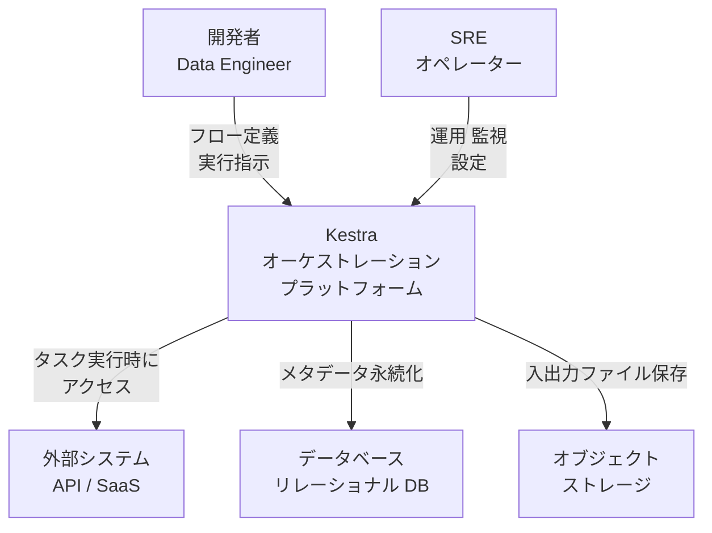

| 要素名 | 説明 |
|---|---|
| 開発者 / Data Engineer | フロー YAML を定義し、実行を指示するユーザー |
| SRE / オペレーター | スケール調整・モニタリング・設定変更を担う運用担当者 |
| 外部システム API / SaaS | Worker がタスク実行時にアクセスする外部サービス |
| データベース | メタデータ（フロー・実行・ログ）を永続化するリレーショナル DB |
| オブジェクトストレージ | タスク間で受け渡すファイルを保持するストレージ |
| Kestra | イベント駆動・宣言型のワークフローオーケストレーションプラットフォーム |

### コンテナ図

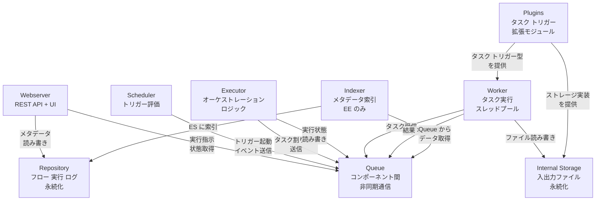

| 要素名 | 説明 |
|---|---|
| Webserver | REST API と Web UI を提供するエントリーポイント。Micronaut フレームワーク上で動作する |
| Scheduler | スケジュール・Webhook・ポーリングトリガーを評価し、Flow 起動イベントを Queue に送信する（Flow Trigger を除く） |
| Executor | 軽量なオーケストレーター。Flow の実行状態を管理し、次に実行すべきタスクを Worker に委譲する。Flow Trigger も担当する |
| Worker | Runnable Task とポーリングトリガーを実際に実行するスレッドプール。外部システムへのアクセスを唯一持つコンポーネント |
| Indexer | Kafka トピックのデータを Elasticsearch にインデックスする（Enterprise Edition のみ） |
| Queue | コンポーネント間の非同期通信バス。JDBC / In-Memory / Kafka の実装から選択する |
| Repository | フロー定義・実行履歴・ログ・テンプレートを永続化する。Queue 実装と対応する実装を選択する |
| Internal Storage | タスク間で受け渡すファイルを保持するオブジェクトストレージ抽象層 |
| Plugins | タスク型・トリガー型・ストレージ実装をコアに追加する拡張モジュール群 |

### コンポーネント図

#### Webserver

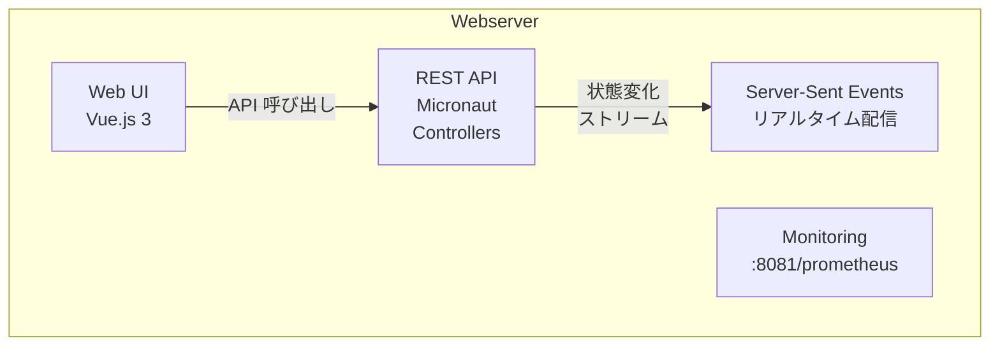

| 要素名 | 説明 |
|---|---|
| REST API - Micronaut Controllers | フロー管理・実行指示・ログ取得などの REST エンドポイント群 |
| Web UI - Vue.js 3 | ブラウザで動作するシングルページアプリケーション。Monaco Editor を内蔵する |
| Server-Sent Events | 実行状態のリアルタイム変化を UI にプッシュ配信する仕組み |
| Monitoring Endpoint | Prometheus メトリクスを公開するエンドポイント（ポート 8081） |

#### Scheduler

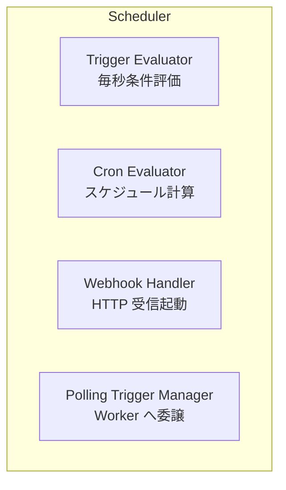

| 要素名 | 説明 |
|---|---|
| Trigger Evaluator | 毎秒トリガー条件を評価し、起動判定を行うメインループ |
| Cron Evaluator | cron 式を解析し、次回起動時刻を算出する |
| Webhook Handler | 外部 HTTP リクエストを受けてフローを即時起動する |
| Polling Trigger Manager | ポーリング型トリガーの実行を Worker に委譲し、結果を受け取る |

#### Executor

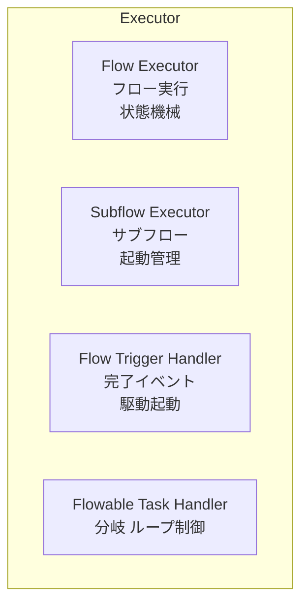

| 要素名 | 説明 |
|---|---|
| Flow Executor | フロー全体のライフサイクルを状態機械として管理し、次のタスクを決定する |
| Subflow Executor | 親フローからサブフローを起動し、完了を待機して結果を返す |
| Flow Trigger Handler | 別フローの完了イベントを受信し、依存フローの起動を行う |
| Flowable Task Handler | 分岐・ループ・並列処理などの制御フロータスクをインプロセスで実行する |

#### Worker

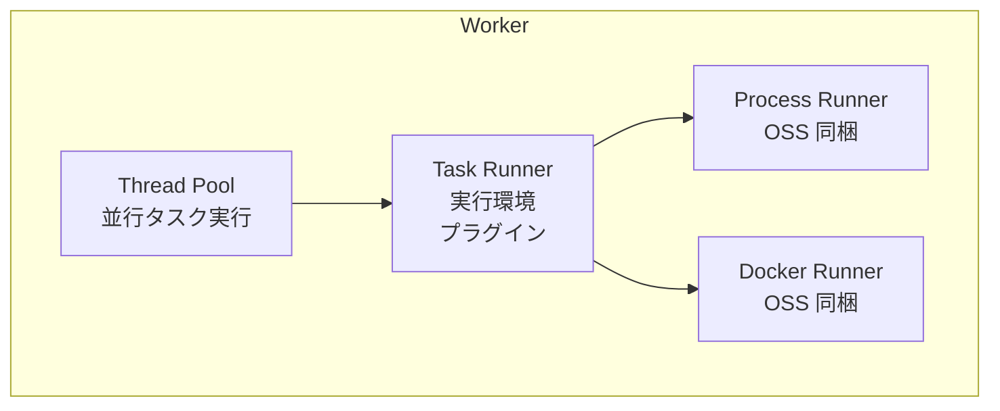

| 要素名 | 説明 |
|---|---|
| Thread Pool | タスクを並行実行するスレッドプール。スレッド数は設定で調整可能 |
| Task Runner | タスクをどの実行環境で動かすかを決めるプラグイン抽象層 |
| Process Runner | ローカルプロセスとしてタスクを実行する（OSS 同梱） |
| Docker Runner | Docker コンテナでタスクを実行する（OSS 同梱） |

#### Indexer（Enterprise Edition）

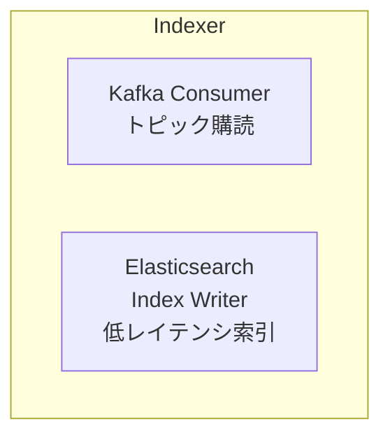

| 要素名 | 説明 |
|---|---|
| Kafka Consumer | フロー・実行などのトピックを購読し、データを取り込む |
| Elasticsearch Index Writer | 取り込んだデータを Elasticsearch にインデックスし、高速検索を実現する |

### ネットワーク構成図

#### JDBC モード（OSS / 分散共通）

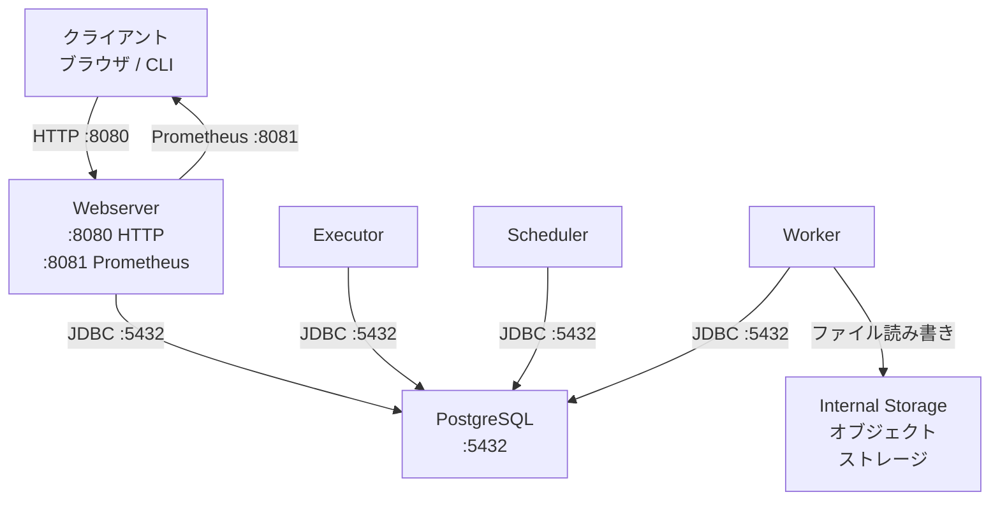

| 通信経路 | プロトコル / ポート | 説明 |
|---|---|---|
| クライアント → Webserver | HTTP :8080 | UI / REST API アクセス |
| 全コンポーネント → PostgreSQL | JDBC TCP :5432 | Queue・Repository として利用 |
| クライアント → Monitoring | HTTP :8081 | Prometheus メトリクス取得 |
| Worker → Internal Storage | HTTPS / S3 互換 | タスク入出力ファイルの読み書き |

#### Kafka モード（Enterprise Edition）

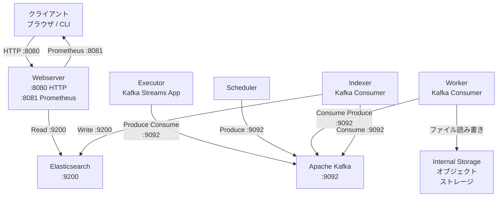

| 通信経路 | プロトコル / ポート | 説明 |
|---|---|---|
| クライアント → Webserver | HTTP :8080 | UI / REST API アクセス |
| Webserver → Elasticsearch | HTTP :9200 | フロー・実行・ログの検索クエリ |
| Executor → Kafka | TCP :9092 | Kafka Streams アプリとして状態管理 |
| Scheduler → Kafka | TCP :9092 | トリガー起動イベントのプロデュース |
| Worker → Kafka | TCP :9092 | タスク受信・結果送信 |
| Indexer → Kafka / ES | TCP :9092 / HTTP :9200 | コンシュームとインデックス書き込み |
| Worker → Internal Storage | HTTPS / S3 互換 | タスク入出力ファイルの読み書き |

## データ

### 概念モデル

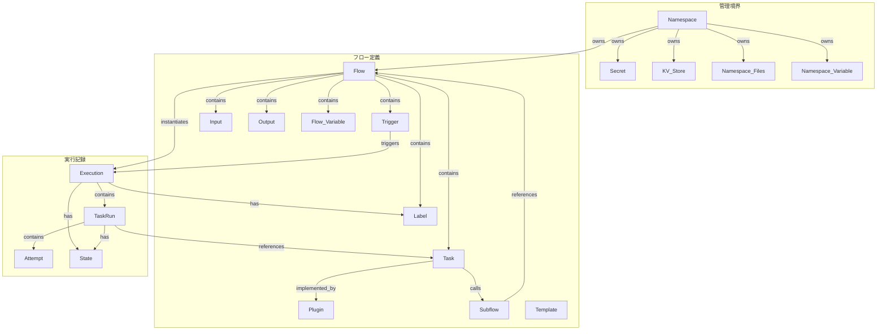

概念モデルは Namespace を頂点とした所有関係と、Flow を起点とした実行関係の 2 層で構成されます。Namespace は Flow・Secret・KV Store・Namespace Files・Namespace Variable を所有します。Flow はタスク・トリガ・入出力・変数・ラベルを内包します。Flow が起動されると Execution が生成され、各 Task の実行ごとに TaskRun が記録されます。

### 情報モデル

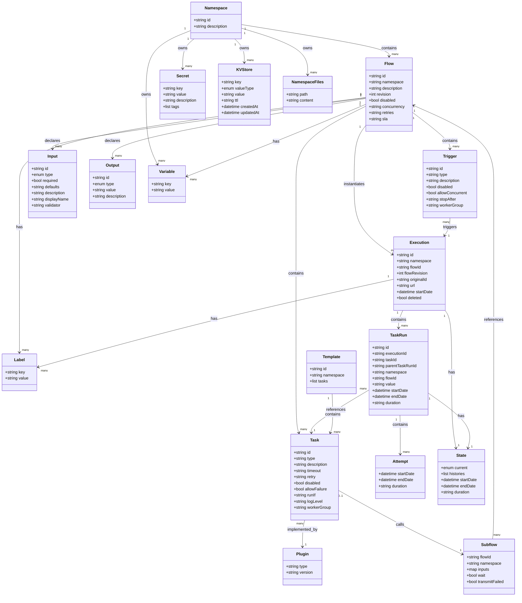

#### エンティティ補足

- **Namespace**: Flow・Secret・KV Store・Namespace Files・Variable のスコープ境界。ドット区切りで階層構造を表現します（例: `company.team.project`）
- **Flow**: `id` と `namespace` の組み合わせで一意に識別されます。変更のたびに `revision` がインクリメントされます
- **Task**: Runnable Task（Worker で実行）と Flowable Task（Executor で実行）の 2 種類があります。`type` は Plugin の完全修飾クラス名（FQCN）です
- **Trigger**: Schedule / Webhook / Flow / Polling / Realtime の 5 種類があります
- **Input**: STRING / INT / FLOAT / BOOLEAN / DATETIME / DATE / TIME / DURATION / FILE / JSON / YAML / URI / SECRET / SELECT / MULTISELECT / ARRAY の型を持ちます
- **Execution**: Flow の 1 回の実行インスタンスです。`originalId` によりリプレイ時の実行系譜を追跡します
- **TaskRun**: Execution 内の Task 単位の実行記録です。`parentTaskRunId` により Flowable Task の入れ子構造を表現します
- **State**: Execution と TaskRun の双方が持ちます。`histories` に状態遷移のタイムスタンプログを保持します
  - Execution の状態: CREATED → QUEUED → RUNNING → SUCCESS / WARNING / FAILED / RETRYING / RETRIED / PAUSED / RESTARTED / KILLING / KILLED / CANCELLED
  - TaskRun の状態: CREATED → SUBMITTED → RUNNING → SUCCESS / WARNING / FAILED / RETRYING / RETRIED / RESTARTED / KILLING / KILLED
- **KV Store**: Namespace スコープで動的な状態を保持します。値の型は String / Number / Boolean / Datetime / Date / Duration / JSON です。TTL（ISO 8601 形式）による自動削除をサポートします
- **Secret**: Namespace スコープの機密値です。OSS 版では環境変数（`SECRET_` プレフィックス）、Enterprise 版では専用マネージャで管理します
- **Template**: 現在は非推奨（Deprecated）です

## 構築方法

### 前提条件

- **Docker インストール**: Docker, Docker Compose（v2 以上）が必要です
- **Kubernetes**: kubectl と Helm（v3 以上）が必要です
- **Standalone JAR**: 実行には JDK が必要です（現行 requirements は Runtime JDK 25 を指定。ソース/ターゲットは 21）
- **推奨リソース**: 現行 requirements は standalone server に 4 GiB / 2 vCPU を要件とします（ローカル検証では 2 GiB でも動く場合があります）

### Docker（単体コンテナ）

H2 組み込みデータベースを使用するため、開発・検証用途に適しています。`server local` サブコマンドが H2 と組み込みストレージで全コンポーネントを一括起動します。

```bash
docker run --pull=always --rm -it \
  -p 8080:8080 \
  --user=root \
  --name kestra \
  -v kestra_data:/app/storage \
  -v kestra_db:/app/data \
  -v /var/run/docker.sock:/var/run/docker.sock \
  -v /tmp:/tmp \
  kestra/kestra:latest server local
```

起動後、`http://localhost:8080` で UI にアクセスします。Docker Hub イメージタグは `latest`（最新安定版）, `latest-lts`（LTS 版）, `v<X.X.X>`（バージョン固定、本番推奨）, `develop`（不安定）から選びます。

### Docker Compose

PostgreSQL をバックエンドとして使用するため、ローカル検証から小規模本番に適しています。

```bash
curl -o docker-compose.yml \
  https://raw.githubusercontent.com/kestra-io/kestra/develop/docker-compose.yml

docker compose up -d
```

設定ファイルを独立させる場合、`application.yaml` を作成して `/etc/config/application.yaml` にマウントし、`command: server standalone --config /etc/config/application.yaml` と指定します。

分散モードへ拡張する場合、各コンポーネントを個別サービスとして定義します。

```yaml
services:
  kestra-executor:
    image: kestra/kestra:latest
    command: server executor
    environment:
      KESTRA_CONFIGURATION: *common_configuration
    depends_on: [postgres]
  kestra-worker:
    image: kestra/kestra:latest
    command: server worker --thread=64
    environment:
      KESTRA_CONFIGURATION: *common_configuration
    depends_on: [postgres]
  kestra-scheduler:
    image: kestra/kestra:latest
    command: server scheduler
    environment:
      KESTRA_CONFIGURATION: *common_configuration
    depends_on: [postgres]
  kestra-webserver:
    image: kestra/kestra:latest
    command: server webserver
    ports: ["8080:8080", "8081:8081"]
    environment:
      KESTRA_CONFIGURATION: *common_configuration
    depends_on: [postgres]
```

### Kubernetes（Helm）

本番環境・大規模展開向けの構成です。評価用の `kestra-starter` チャートは PostgreSQL と Versity（S3 互換ストレージ）を同梱します。

```bash
helm repo add kestra https://helm.kestra.io/
helm repo update

# 評価用（PostgreSQL + Versity 同梱）
helm install my-kestra kestra/kestra-starter

# 本番用（依存なし・設定要）
helm install my-kestra kestra/kestra
```

分散モード向け `values.yaml` の主要設定例:

```yaml
deployments:
  webserver:
    enabled: true
  executor:
    enabled: true
  indexer:
    enabled: true
  scheduler:
    enabled: true
  worker:
    enabled: true
  standalone:
    enabled: false
```

### Standalone JAR

Docker が利用できない環境向けです。実行には JDK が必要です（現行 requirements は Runtime JDK 25）。

```bash
# ローカルモード（H2 DB 使用）
./kestra-<VERSION> server local

# スタンドアロンモード（外部 DB 接続が必要）
./kestra-<VERSION> server standalone

# 設定ファイルを指定する場合
./kestra-<VERSION> server local --config confs/application.yaml
```

### バックエンド DB の選び方と最低設定

| DB | 用途 | エディション |
|---|---|---|
| H2 | 開発・検証（組み込み） | OSS |
| PostgreSQL | 推奨（ローカル〜本番） | OSS |
| MySQL | 代替選択肢 | OSS |
| Kafka + Elasticsearch | 大規模分散・高スループット | Enterprise/Cloud |

PostgreSQL 設定例:

```yaml
kestra:
  queue:
    type: postgres
  repository:
    type: postgres

datasources:
  postgres:
    url: jdbc:postgresql://localhost:5432/kestra
    driver-class-name: org.postgresql.Driver
    username: kestra
    password: k3str4
```

MySQL 設定例:

```yaml
kestra:
  queue:
    type: mysql
  repository:
    type: mysql

datasources:
  mysql:
    url: jdbc:mysql://localhost:3306/kestra
    driver-class-name: com.mysql.cj.jdbc.Driver
    username: kestra
    password: k3str4
    dialect: MYSQL
```

H2 設定例（開発・検証用。本番利用は避けてください）:

```yaml
datasources:
  h2:
    url: "jdbc:h2:mem:public;DB_CLOSE_DELAY=-1;DB_CLOSE_ON_EXIT=FALSE"
    driver-class-name: org.h2.Driver
    username: sa
    password: ""
```

本番では接続プール（HikariCP）のサイズを明示します。

```yaml
datasources:
  postgres:
    url: jdbc:postgresql://localhost:5432/kestra
    driver-class-name: org.postgresql.Driver
    username: kestra
    password: k3str4
    hikari:
      maximum-pool-size: 10
      connection-timeout: 30000
```

## 利用方法

### Flow の YAML 構造

Flow は Kestra のオーケストレーション基本単位です。

| フィールド | 必須 | 説明 |
|---|---|---|
| `id` | 必須 | フローの識別子 |
| `namespace` | 必須 | フローが属する名前空間 |
| `description` | 任意 | Markdown 対応の説明文 |
| `labels` | 任意 | フィルタリング用のキーバリューペア |
| `inputs` | 任意 | 実行時に渡す型付きパラメータ |
| `variables` | 任意 | フローレベルのキーバリュー変数 |
| `tasks` | 必須 | 実行するタスクのリスト（順次実行） |
| `outputs` | 任意 | フロー全体の出力定義 |
| `triggers` | 任意 | 自動起動トリガーの定義 |
| `pluginDefaults` | 任意 | 同タイプのタスクに共通設定を適用 |
| `errors` | 任意 | エラー時に実行するタスク |
| `finally` | 任意 | 成否に関わらず実行するタスク |
| `retries` | 任意 | リトライ設定 |
| `concurrency` | 任意 | 同時実行数の制限 |
| `taskRunner` | 任意 | タスクの実行環境（Process / Docker / K8s 等）の指定 |
| `sla` | 任意 | 実行時間の上限や期待値に基づく SLA 違反時の動作 |

`concurrency` は同時実行数の上限と超過時の動作を指定します。

```yaml
concurrency:
  limit: 3
  behavior: QUEUE   # QUEUE | CANCEL | FAIL
```

Flow の YAML 完全例:

```yaml
id: my-flow
namespace: company.team

description: |
  サンプルフローです。

labels:
  env: dev
  team: data

inputs:
  - id: run_task
    type: BOOLEAN
    defaults: true
  - id: target_date
    type: DATE
    required: false

variables:
  greeting: "Hello"

tasks:
  - id: step1
    type: io.kestra.plugin.core.debug.Return
    format: "{{ vars.greeting }} {{ inputs.target_date }}"

outputs:
  - id: flow_output
    type: STRING
    value: "{{ outputs.step1.value }}"

pluginDefaults:
  - type: io.kestra.plugin.core.log.Log
    values:
      level: INFO

triggers:
  - id: every_hour
    type: io.kestra.plugin.core.trigger.Schedule
    cron: "@hourly"
```

### 主要な Task Type の使い方

#### Return（値を返す）

```yaml
tasks:
  - id: greet
    type: io.kestra.plugin.core.debug.Return
    format: "Hello, {{ inputs.name }}!"
```

#### Log（ログ出力）

```yaml
tasks:
  - id: log_message
    type: io.kestra.plugin.core.log.Log
    message: "Processing {{ taskrun.value }}"
    level: INFO
```

#### Parallel（並列実行）

```yaml
tasks:
  - id: parallel_tasks
    type: io.kestra.plugin.core.flow.Parallel
    tasks:
      - id: task_a
        type: io.kestra.plugin.core.debug.Return
        format: "Task A: {{ taskrun.startDate }}"
      - id: task_b
        type: io.kestra.plugin.core.debug.Return
        format: "Task B: {{ taskrun.id }}"
```

#### ForEach（ループ処理）

```yaml
tasks:
  - id: process_each
    type: io.kestra.plugin.core.flow.ForEach
    values: ["value1", "value2", "value3"]
    tasks:
      - id: process_item
        type: io.kestra.plugin.core.log.Log
        message: "Processing: {{ taskrun.value }}"
```

#### If / Switch（条件分岐）

```yaml
tasks:
  - id: condition_check
    type: io.kestra.plugin.core.flow.If
    condition: "{{ inputs.run_task }}"
    then:
      - id: when_true
        type: io.kestra.plugin.core.log.Log
        message: "条件が true です"
    else:
      - id: when_false
        type: io.kestra.plugin.core.log.Log
        message: "条件が false です"
```

#### Subflow

```yaml
tasks:
  - id: call_subflow
    type: io.kestra.plugin.core.flow.Subflow
    namespace: company.team
    flowId: data_processing
    inputs:
      file: "{{ outputs.upload.uri }}"
      date: "{{ inputs.target_date }}"
```

#### Script（Python/Bash/Node.js）

```yaml
tasks:
  - id: python_task
    type: io.kestra.plugin.scripts.python.Script
    script: |
      print("Hello from Python!")
      result = 1 + 2
      print(f"Result: {result}")

  - id: bash_task
    type: io.kestra.plugin.scripts.shell.Script
    script: |
      echo "Current date: $(date)"
      echo "Files: $(ls -la)"
```

### Task Runner の指定（OSS）

タスクの実行環境は `taskRunner` で切り替えます。OSS では Process Runner（ローカルプロセス）と Docker Runner（コンテナ）を同梱します。

実行イメージはタスク階層の `containerImage` で指定します（`taskRunner` 配下ではありません）。

```yaml
tasks:
  - id: run_in_docker
    type: io.kestra.plugin.scripts.python.Script
    containerImage: python:3.11-slim
    taskRunner:
      type: io.kestra.plugin.scripts.runner.docker.Docker
    script: |
      print("Hello from Docker")
```

`pluginDefaults` で同タイプのタスクすべてに Docker Runner を適用できます。

```yaml
pluginDefaults:
  - type: io.kestra.plugin.scripts.python.Script
    values:
      containerImage: python:3.11-slim
      taskRunner:
        type: io.kestra.plugin.scripts.runner.docker.Docker
```

Kubernetes / AWS Batch / Azure Batch / Google Batch / Google Cloud Run の Task Runner は Enterprise Edition または Kestra Cloud で利用できます。

### Trigger の種類

#### Schedule Trigger

```yaml
triggers:
  - id: daily_schedule
    type: io.kestra.plugin.core.trigger.Schedule
    cron: "0 9 * * 1-5"
    timezone: Asia/Tokyo
    allowConcurrent: false
    recoverMissedSchedules: LAST
```

cron ショートハンドは `@yearly`, `@monthly`, `@weekly`, `@daily`, `@hourly` を利用できます。

#### Webhook Trigger

```yaml
triggers:
  - id: webhook
    type: io.kestra.plugin.core.trigger.Webhook
    key: "{{ secret('WEBHOOK_KEY') }}"
```

#### Flow Trigger

```yaml
triggers:
  - id: upstream_done
    type: io.kestra.plugin.core.trigger.Flow
    preconditions:
      id: my_precondition
      flows:
        - namespace: company.team
          flowId: upstream_flow
          states: [SUCCESS]
      timeWindow:
        type: DAILY_TIME_DEADLINE
        deadline: "09:00:00+09:00"
```

#### Realtime Trigger（Kafka / SQS / MQTT）

```yaml
triggers:
  - id: kafka_trigger
    type: io.kestra.plugin.kafka.RealtimeTrigger
    topic: my-topic
    bootstrapServers: "localhost:9092"
    groupId: kestra-group
```

### インプット型一覧

| 型 | 説明 | 主なバリデーション |
|---|---|---|
| `STRING` | テキスト値 | `validator`（正規表現） |
| `INT` | 整数 | `min`, `max` |
| `FLOAT` | 小数 | `min`, `max` |
| `BOOLEAN` | 真偽値（別名 `BOOL` も受理される） | — |
| `SELECT` | 単一選択 | `allowCustomValue` |
| `MULTISELECT` | 複数選択 | `allowCustomValue` |
| `ARRAY` | リスト型 | `itemType` |
| `DATE` | ISO 8601 日付 | `after`, `before` |
| `TIME` | ISO 8601 時刻 | `after`, `before` |
| `DATETIME` | ISO 8601 日時（UTC） | `after`, `before` |
| `DURATION` | ISO 8601 期間（例: `PT5M`） | `min`, `max` |
| `FILE` | ファイルアップロード | `allowedFileExtensions` |
| `JSON` | JSON 値 | — |
| `YAML` | YAML 値 | — |
| `URI` | URI 文字列 | — |
| `SECRET` | 暗号化済み文字列（UI でマスク） | — |

### CLI 操作

```bash
# namespace 一覧
./kestra namespace list

# flow 一覧（namespace 指定）
./kestra flow list --namespace company.team

# flow の作成・更新（YAML ファイルから）
./kestra flow create --file my-flow.yaml
./kestra flow update --file my-flow.yaml

# flow の実行
./kestra flow execute --namespace company.team --id my-flow

# プラグインのインストール
./kestra plugins install io.kestra.plugin:plugin-script-python:LATEST
```

### REST API による Flow / Execution 操作

現行 1.x 系の API パスはテナントセグメントを含みます。OSS のデフォルトテナントは `main` です。

```bash
# Flow CRUD
GET    /api/v1/main/flows/{namespace}
GET    /api/v1/main/flows/{namespace}/{id}
POST   /api/v1/main/flows
PUT    /api/v1/main/flows/{namespace}/{id}
DELETE /api/v1/main/flows/{namespace}/{id}

# Execution 操作
POST   /api/v1/main/executions/{namespace}/{flowId}
GET    /api/v1/main/executions?namespace={namespace}&flowId={flowId}
GET    /api/v1/main/executions/{executionId}
DELETE /api/v1/main/executions/{executionId}
```

curl によるフロー実行例（inputs は form-data で渡します）:

```bash
curl -X POST \
  "http://localhost:8080/api/v1/main/executions/company.team/my-flow" \
  -F env=prod
```

### Terraform Provider

```hcl
terraform {
  required_providers {
    kestra = {
      source  = "kestra-io/kestra"
      version = "~> 0.19"
    }
  }
}

provider "kestra" {
  url = "http://localhost:8080"
}

resource "kestra_flow" "example" {
  namespace = "company.team"
  flow_id   = "my-flow"
  content   = file("flows/my-flow.yaml")
}
```

管理対象リソースは `kestra_flow`, `kestra_namespace`, `kestra_user`, `kestra_group`, `kestra_role`, `kestra_service_account`, `kestra_api_token`, `kestra_namespace_secret` などです。

### GitOps の概要

代表的なパターンは 2 つです。

- **パターン 1: Terraform + CI/CD**: Git の YAML を Terraform `kestra_flow` リソースに反映し、`terraform apply` でデプロイ
- **パターン 2: Git Sync プラグイン**: `io.kestra.plugin.git.SyncFlows` タスクで Git リポジトリからフローを定期同期

```yaml
id: git-sync
namespace: company.ops
tasks:
  - id: sync
    type: io.kestra.plugin.git.SyncFlows
    url: https://github.com/myorg/kestra-flows
    branch: main
    targetNamespace: company.team
triggers:
  - id: every_5min
    type: io.kestra.plugin.core.trigger.Schedule
    cron: "*/5 * * * *"
```

## 運用

### 起動・停止・状態確認

```bash
# Standalone（全コンポーネント一体起動）
./kestra server standalone --worker-thread=128

# 分散モード（コンポーネント個別起動）
./kestra server webserver   -c ./application.yaml --port=8080
./kestra server executor    -c ./application.yaml
./kestra server scheduler   -c ./application.yaml
./kestra server worker      -c ./application.yaml --thread=64
./kestra server indexer     -c ./application.yaml
```

ヘルスチェックエンドポイント `GET :8081/health` は DB 接続・ディスク容量・サービス可用性を含む JSON を返します。`/worker`・`/scheduler`・`/kafkastreams` でコンポーネント個別状態を確認できます。

```bash
curl -s http://localhost:8081/health | jq .
```

### サーバーライフサイクル

| 状態 | 説明 |
|---|---|
| `RUNNING` | 起動時にハートビートを DB へ送信 |
| `TERMINATING` | 停止シグナル受信後、実行中タスクの完了を待機 |
| `TERMINATED_GRACEFULLY` | `terminationGracePeriod` 内に完了 |
| `TERMINATED_FORCED` | 猶予時間超過でプロセス強制終了 |

### Worker / Scheduler / Executor の個別スケール

```yaml
deployments:
  worker:
    replicaCount: 4
    workerThreads: 64
    resources:
      requests:
        cpu: "4"
        memory: "8Gi"
      limits:
        cpu: "8"
        memory: "16Gi"
  executor:
    replicaCount: 3
    resources:
      requests:
        cpu: "4"
        memory: "4Gi"
  scheduler:
    replicaCount: 2
    resources:
      requests:
        cpu: "2"
        memory: "2Gi"
```

スケール判断の目安:

| スループット | Executor | Worker | Scheduler |
|---|---|---|---|
| ～1,000 タスク/分 | 2 CPU / 2 GB | 2 CPU / 4 GB | 1 CPU / 2 GB |
| ～2,000 タスク/分 | 4 CPU / 4 GB | 4 CPU / 8 GB | 1 CPU / 2 GB |
| 追加 1,000/分ごと | +2 CPU / +2 GB | ワークロード依存 | +1 CPU / +1 GB |

本番環境では各コンポーネント最低 2 ノードを用意します。

### ローリングアップデート手順

コンポーネント停止順序は Executor → Scheduler → Worker → Webserver です。起動はその逆順です。

```bash
helm upgrade kestra kestra/kestra \
  --set image.tag=v0.22.0 \
  -f values.yaml \
  --namespace kestra
```

- Worker は `terminationGracePeriodSeconds`（デフォルト 60 秒）を実行タスクの最長時間に合わせて設定します
- 大規模 DB の場合は事前マイグレーションを実行します:

```bash
./kestra sys database migrate
```

### バックアップ・リストア

メタデータバックアップ（EE v0.19+）:

```bash
# バックアップ作成（フル）
./kestra backups create FULL

# 特定リソースのみバックアップ
./kestra backups create FULL --resources KV_STORE,FLOW,SECRET

# 実行データ・ログ・メトリクスを含む
./kestra backups create FULL --include-data

# リストア
./kestra backups restore kestra:///backups/full/backup-20240917163312.kestra
```

DB バックアップ（PostgreSQL）:

```bash
pg_dump -h localhost -p 5432 -U kestra -d kestra -F tar -f kestra.tar
pg_restore -h localhost -p 5432 -U kestra -d kestra kestra.tar
```

### メトリクス・モニタリング

Prometheus エンドポイント:

```
GET :8081/prometheus
```

主要メトリクス:

| カテゴリ | メトリクス名 | 説明 |
|---|---|---|
| Worker | `kestra_worker_job_running` | 実行中ジョブ数 |
| Worker | `kestra_worker_running_count` | 実行中タスク数 |
| Worker | `kestra_worker_ended_duration_seconds` | タスク実行時間 |
| Worker | `kestra_worker_job_pending` | 待機中ジョブ数 |
| Executor | `kestra_executor_execution_duration` | Execution 処理時間 |
| Executor | `kestra_executor_execution_end_count` | 完了 Execution 数 |
| Scheduler | `kestra_scheduler_trigger_count` | トリガー発火数 |
| Queue | `kestra_queue_produce_count` | キュー投入数 |
| Queue | `kestra_queue_receive_duration` | キュー受信時間 |

Prometheus へエクスポートする際、duration 系メトリクスには `_seconds`、カウンタ系には `_total` のサフィックスが付与されます（例: `kestra_worker_ended_duration_seconds`, `kestra_queue_produce_count_total`）。実際の名称は `:8081/prometheus` の出力で確認してください。

公式 Grafana ダッシュボード JSON テンプレートを提供しており、CPU・メモリ・JVM・Worker ジョブアクティビティ・HTTP リクエストレートを可視化できます。

Worker キューの滞留を検知する Prometheus アラートルール例:

```yaml
groups:
  - name: kestra
    rules:
      - alert: WorkerQueueBacklog
        expr: kestra_worker_job_pending > 100
        for: 5m
        labels:
          severity: warning
        annotations:
          summary: "Worker queue backlog exceeding 100 jobs"
```

フロー個別アラート（errors セクション）:

```yaml
errors:
  - id: alert_on_failure
    type: io.kestra.plugin.notifications.slack.SlackIncomingWebhook
    url: "{{ secret('SLACK_WEBHOOK') }}"
    payload: |
      {"text": "Flow {{ flow.id }} failed: {{ execution.id }}"}
```

### ログ確認

```bash
# /loggers エンドポイントで動的に変更
curl -X POST http://localhost:8081/loggers/io.kestra \
  -H 'Content-Type: application/json' \
  -d '{"level": "TRACE"}'

# スレッドダンプ取得
curl http://localhost:8081/threaddump > threaddump.txt
```

Execution ログは UI（Flows → Executions → Logs タブ）または API（`GET /api/v1/main/logs/{executionId}`）で確認できます。

## ベストプラクティス

### CI/CD / GitOps

| パターン | 用途 |
|---|---|
| `git.SyncNamespaceFiles` | Git から Kestra への自動同期（GitOps） |
| `git.PushFlows` | UI 編集後に自動で Git へコミット・プッシュ |
| GitHub Actions / GitLab CI | 外部 CI でバリデーションとデプロイ |
| Terraform | IaC によるフロー管理 |
| Kubernetes Operator | GitOps ネイティブな K8s デプロイ |

Kestra CLI によるデプロイ:

```bash
./kestra flow validate flows/ \
  --server http://kestra:8080 \
  --api-token "${KESTRA_API_TOKEN}"

./kestra flow namespace update company.team flows/ \
  --no-delete \
  --server http://kestra:8080 \
  --api-token "${KESTRA_API_TOKEN}"
```

GitHub Actions の例:

```yaml
jobs:
  deploy:
    steps:
      - uses: kestra-io/deploy-action@main
        with:
          resource: flow
          namespace: company.team
          directory: flows/
          server: ${{ vars.KESTRA_URL }}
          apiToken: ${{ secrets.KESTRA_API_TOKEN }}
```

本番フローには UI 編集を無効化するラベルを付与します:

```yaml
labels:
  system.readOnly: "true"
```

### マルチ環境管理

- **環境分離**: 環境ごとに Kestra インスタンスを分けます（同一インスタンスの namespace 分離は非推奨）
- **Tenant 活用（EE）**: Business Unit ごとにテナントを分離し、RBAC でアクセス制御します
- **環境差分の吸収**: DB 接続先・S3 バケット等は KV Store または環境変数で吸収します

### セキュリティ

| 手段 | 用途 | 備考 |
|---|---|---|
| KV Store | 実行時状態・設定値 | OSS でも利用可 |
| Secret Manager | 認証情報・パスワード | EE: AWS/GCP/Azure/Vault 連携 |
| RBAC（EE） | アクセス制御 | ネームスペース・フロー単位で権限付与 |
| SSO（EE） | IdP 統合（OIDC/SAML） | - |

シークレット参照の例:

```yaml
tasks:
  - id: query
    type: io.kestra.plugin.jdbc.postgresql.Query
    url: "{{ secret('DB_URL') }}"
    username: "{{ secret('DB_USER') }}"
    password: "{{ secret('DB_PASS') }}"
```

OSS 版では `SECRET_<KEY>` 形式の環境変数に Base64 エンコードした値を渡してシークレットを登録します。`{{ secret('KEY') }}` で参照します。

```bash
# 値を Base64 エンコードして環境変数に設定
export SECRET_DB_PASS=$(echo -n "mysecret" | base64)
```

Enterprise Edition では RBAC により `Admin` / `Editor` / `Viewer` などのロールを Namespace・Flow 単位で割り当てます。Multi-tenancy はテナント単位でフロー・実行・権限を完全分離します。Audit Logs は管理操作の証跡を記録し、UI と API から参照できます。

### リソース制限（Worker Group・Task Runner）

Worker Group（EE）でフロー実行先のワーカープールを指定できます。

```yaml
tasks:
  - id: heavy_job
    type: io.kestra.plugin.scripts.python.Script
    workerGroup:
      key: gpu-workers
    script: |
      import torch
```

Kubernetes Task Runner（EE）でリソース隔離します:

```yaml
tasks:
  - id: isolated_task
    type: io.kestra.plugin.scripts.python.Script
    taskRunner:
      type: io.kestra.plugin.ee.kubernetes.runner.Kubernetes
      namespace: kestra-jobs
      resources:
        request:
          cpu: "2"
          memory: "4Gi"
        limit:
          cpu: "4"
          memory: "8Gi"
    script: |
      print("Isolated in K8s Pod")
```

### パフォーマンスチューニング

JDBC Queue チューニング:

```yaml
kestra:
  jdbc:
    queues:
      minPollInterval: PT0.1S
      maxPollInterval: PT0.5S
      pollSwitchInterval: PT60S
      pollSize: 100
  executor:
    thread-count: 8
```

ポーリング間隔は ISO 8601 期間形式（`PT0.1S`）でもミリ秒表記（`100ms`）でも指定できます。公式ドキュメントの例は `25ms` / `500ms` 形式を用います。

Kafka バックエンドチューニング（EE）:

```yaml
kestra:
  kafka:
    defaults:
      topic:
        partitions: 32
        replication-factor: 3
      stream:
        properties:
          num.stream.threads: "4"
          poll.ms: "25"
          commit.interval.ms: "25"
```

Kafka バックエンド使用時、Worker インスタンス数はパーティション数を超えても効果がありません。

### 命名規約

- Namespace は `company.team.project` 形式を推奨します
- 環境を namespace に含めず、インスタンス分離で表現します
- Flow / Task / Input ID は **snake_case** または **camelCase** を推奨します。kebab-case は参照時に添字記法（`outputs.task_id["your-value"]`）が必要になるため非推奨です

```yaml
# 良い例
id: fetch_customer_data
id: processOrderEvents

# 避けるべき例
id: fetch-customer-data
```

## トラブルシューティング

### 頻出エラー一覧

| 症状 | 原因 | 対処 |
|---|---|---|
| Worker がジョブを取得しない | JDBC `minPollInterval` が長い / Queue が詰まっている | `minPollInterval` を短縮、Queue 状況を `:8081/worker` で確認 |
| Worker がジョブを取得しない | Worker の `--thread` 上限に達している | Worker スレッド数を増加、または Worker レプリカを追加 |
| Queue 詰まり | JDBC `pollSize` が小さい / DB 接続プール枯渇 | `pollSize` を増加、DB 接続プール設定を見直す |
| DB ロック（PostgreSQL） | 大量の concurrent Execution が同一行を更新 | Kafka バックエンドへの移行を検討、Executor スレッド数を調整 |
| Flow がデプロイされない | YAML 構文エラー / ネームスペース権限不足 | `kestra flow validate` で事前チェック、RBAC 設定を確認 |
| Trigger が発火しない | Trigger がロック状態 | UI: Administration → Triggers でロック解除 |
| Trigger が発火しない | `stopAfter` プロパティで無効化済み | フロー定義の `stopAfter` を削除または条件を修正 |
| メモリ不足（OOM） | Worker に大量データが乗る / JVM ヒープ不足 | Worker リソースリミット増加、Internal Storage を活用 |
| Task Runner（Docker）失敗 | DinD 設定ミス / Kernel 権限エラー | `docker logs` で DinD コンテナを確認、`dind.mode: 'insecure'` を試す |
| Task Runner（K8s）失敗 | Pod が Pending のまま / Resource Quota 超過 | `kubectl describe pod` でイベント確認、Namespace の Resource Quota を見直す |
| Plugin 読み込みエラー | JAR ファイルが plugins ディレクトリに未配置 / バージョン非互換 | `--plugins` パスを確認、バージョン互換性を確認 |
| CrashLoopBackoff（K8s） | JVM 起動時 CPU 大量消費でライブネスプローブが失敗 | CPU リミットをリクエストの 2 倍に設定 |

### Worker がジョブを取得しない（詳細手順）

```bash
# 1. Worker の状態確認
curl http://localhost:8081/worker | jq .

# 2. ログで Queue 受信エラーを確認
curl -X POST http://localhost:8081/loggers/io.kestra.core \
  -H 'Content-Type: application/json' -d '{"level": "DEBUG"}'

# 3. JDBC Queue の minPollInterval を短縮
# application.yaml:
# kestra:
#   jdbc:
#     queues:
#       minPollInterval: PT0.05S
```

### メモリ不足

```bash
# スレッドダンプ取得
curl http://localhost:8081/threaddump > threaddump.txt

# Worker JVM ヒープ設定
JVM_OPTS="-Xmx4g -Xms2g" ./kestra server worker
```

### Task Runner（Docker / DinD）の失敗

```bash
# DinD コンテナのログ確認
docker logs kestra-dind 2>&1 | tail -50

# insecure モードへの切り替え（Helm）
helm upgrade kestra kestra/kestra \
  --set dind.mode=insecure \
  --set dind.securityContext.privileged=true
```

ARM Mac（Apple Silicon）では DinD の代わりに Embedded Docker Server を使用します。

### Plugin 読み込みエラー

```bash
# プラグイン一覧確認
./kestra plugins list

# 特定プラグインのインストール
./kestra plugins install io.kestra.plugin:plugin-jdbc-postgresql:LATEST
```

## まとめ

Kestra は宣言型 YAML と分散アーキテクチャ（Webserver・Scheduler・Executor・Worker）によって、言語非依存のワークフローを OSS から大規模 Enterprise まで一貫した枠組みで運用できるオーケストレーターです。OSS では PostgreSQL/MySQL バックエンドと Docker/Process の Task Runner を、EE/Cloud では Kafka バックエンド・Kubernetes Runner・RBAC・マルチテナンシーを利用でき、構造とデータモデルを理解すればスモールスタートからスケールまで設計の見通しが立ちます。

本記事は 2026-05 時点の検証に基づきます。バージョン差分や実装と異なる点を見つけた場合は、ぜひコメントで指摘いただけると助かります。参考になればリアクションや SNS でのシェアもいただけると励みになります！

## 参考リンク

- 公式ドキュメント・サイト
  - [Kestra 公式サイト](https://kestra.io/)
  - [Kestra プラットフォーム概要](https://kestra.io/overview)
  - [Kestra vs Airflow 比較](https://kestra.io/vs/airflow)
  - [Kestra vs Dagster 比較](https://kestra.io/vs/dagster)
  - [Kestra vs. 競合ツール一覧](https://kestra.io/vs)
  - [Kestra 宣言型オーケストレーション機能詳細](https://kestra.io/features/declarative-data-orchestration)
  - [Kestra 料金・エディション比較](https://kestra.io/pricing)
  - [Kestra Architecture Overview](https://kestra.io/docs/architecture)
  - [Kestra Main Components](https://kestra.io/docs/architecture/main-components)
  - [Kestra Server Components](https://kestra.io/docs/architecture/server-components)
  - [Kestra Deployment Architecture - JDBC and Kafka](https://kestra.io/docs/architecture/deployment-architecture)
  - [Size and Scale Kestra Infrastructure](https://kestra.io/docs/performance/sizing-and-scaling-infrastructure)
  - [Kestra 2.0 Engineering Blog](https://kestra.io/blogs/kestra-2-0-engineering)
  - [Kestra Concepts](https://kestra.io/docs/concepts)
  - [Flows in Kestra](https://kestra.io/docs/workflow-components/flow)
  - [Executions in Kestra](https://kestra.io/docs/workflow-components/execution)
  - [Execution States in Kestra](https://kestra.io/docs/workflow-components/states)
  - [Task Runs in Kestra](https://kestra.io/docs/workflow-components/tasks/taskruns)
  - [Flowable Tasks in Kestra](https://kestra.io/docs/workflow-components/tasks/flowable-tasks)
  - [Namespaces in Kestra](https://kestra.io/docs/workflow-components/namespace)
  - [Key Value (KV) Store](https://kestra.io/docs/concepts/kv-store)
  - [Secrets in Kestra](https://kestra.io/docs/concepts/secret)
  - [Kestra インストール概要](https://kestra.io/docs/installation)
  - [Docker インストール](https://kestra.io/docs/installation/docker)
  - [Docker Compose インストール](https://kestra.io/docs/installation/docker-compose)
  - [Kubernetes / Helm インストール](https://kestra.io/docs/installation/kubernetes)
  - [Standalone JAR インストール](https://kestra.io/docs/installation/standalone-server)
  - [ワークフローコンポーネント概要](https://kestra.io/docs/workflow-components)
  - [Trigger 一覧](https://kestra.io/docs/workflow-components/triggers)
  - [Schedule Trigger](https://kestra.io/docs/workflow-components/triggers/schedule-trigger)
  - [Flow Trigger](https://kestra.io/docs/workflow-components/triggers/flow-trigger)
  - [Input 型一覧](https://kestra.io/docs/workflow-components/inputs)
  - [API リファレンス](https://kestra.io/docs/api-reference)
  - [Terraform Provider](https://kestra.io/docs/terraform)
  - [Administrator Guide トップ](https://kestra.io/docs/administrator-guide)
  - [Monitoring & Alerting](https://kestra.io/docs/administrator-guide/monitoring)
  - [Backup and Restore](https://kestra.io/docs/administrator-guide/backup-and-restore)
  - [Upgrade / Rolling Updates / Rollback](https://kestra.io/docs/administrator-guide/upgrades)
  - [High Availability](https://kestra.io/docs/administrator-guide/high-availability)
  - [Server Component Liveness & Heartbeats](https://kestra.io/docs/administrator-guide/servers)
  - [Performance Tuning - Workers, JDBC, Kafka](https://kestra.io/docs/performance/performance-tuning)
  - [Best Practices トップ](https://kestra.io/docs/best-practices)
  - [Naming Conventions](https://kestra.io/docs/best-practices/naming-conventions)
  - [Version Control with Git](https://kestra.io/docs/best-practices/git)
  - [CI/CD Pipelines](https://kestra.io/docs/version-control-cicd/cicd)
  - [Sync Flows from Git Repository](https://kestra.io/docs/how-to-guides/syncflows)
  - [Kubernetes Operator (GitOps)](https://kestra.io/docs/version-control-cicd/cicd/kubernetes-operator)
  - [Troubleshooting - Common Issues and Fixes](https://kestra.io/docs/administrator-guide/troubleshooting)
  - [Workflow Errors Handling](https://kestra.io/docs/workflow-components/errors)
- GitHub
  - [kestra-io/kestra](https://github.com/kestra-io/kestra)
- その他
  - [DeepWiki - kestra-io/kestra](https://deepwiki.com/kestra-io/kestra)
  - [Terraform Registry - kestra-io/kestra](https://registry.terraform.io/providers/kestra-io/kestra/latest)
