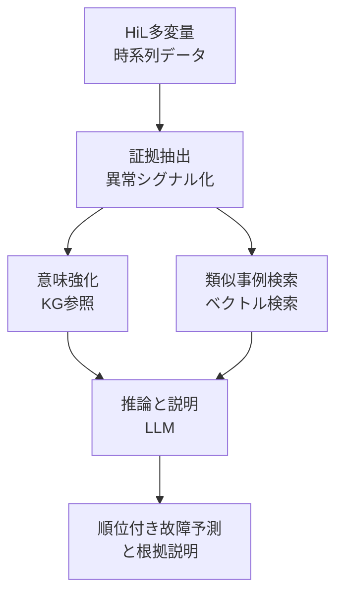

自動車のHardware-in-the-Loop（HiL）テストは、走らせるたびに大量の多変量時系列データを吐き出します。
そこから「どの部品のどの故障が根本原因か」を突き止める作業は、いまも熟練エンジニアの手作業に強く依存しています。

この領域に対して、知識グラフ（Knowledge Graph、以下KG）でドメイン知識を注入し、RAGとLLMを組み合わせて説明可能な根本原因分析（Root Cause Analysis、以下RCA）を行うフレームワークが提案されています（arXiv:2608.11277）。

この記事で扱うのは次の3点です。

- なぜ時系列データを深層学習でそのまま分類する方式が現場で止まるのか
- 提案フレームワークがLLMをどの位置に置き、何を代替させていないのか
- 発注側・導入判断側として、どこまで任せてどこを人が持つべきか

対象読者は、テスト・検証プロセスへのAI導入を判断する立場の方、およびRAGアーキテクチャを設計する方です。

*この記事の全体像。以下、順に解説します。*

## なぜ時系列を直接分類する方式は現場で止まるのか

HiLの不具合解析にAIを入れる素直な発想は、時系列データを入力として故障クラスを出力する分類器を作ることです。
この方式には、精度以前の構造的な問題が2つあります。

| 問題 | 何が起きるか |
| --- | --- |
| ブラックボックス化 | 「この故障です」とだけ出る。エンジニアが検証も反論もできず、判断材料にならない |
| 汎化性能の低さ | 学習時と異なる車両構成・E/Eアーキテクチャに移すと性能が落ちる |

検証工程の成果物は「分類ラベル」ではなく「なぜそう言えるかの説明」です。
説明を返せないモデルは、たとえ精度が高くても、エンジニアの調査工数をそのまま残してしまいます。
ここが、この領域で分類器アプローチが定着しなかった構造的な理由です。

## 提案フレームワークの構造: LLMを推論層に置く

提案手法の設計判断は明快です。
**LLMに時系列を読ませて分類させるのをやめ、証拠を作る工程とLLMに渡す工程を分離する**という役割分担になっています。

### 3つのフェーズ

| フェーズ | 入力 | 処理 | 出力 |
| --- | --- | --- | --- |
| 証拠抽出 | HiLの生時系列 | 異常シグナルを抽出し、コンパクトな証拠へ圧縮 | 診断に有効な証拠データ |
| 意味強化・検索 | 抽出された異常 | KGでセンサーと故障位置の空間的・機能的依存関係、故障の伝播経路を付与。並行して過去のテスト履歴から類似不具合事例をRAGで取得 | 意味づけされた証拠 + 類似事例 |
| 推論・説明 | 証拠 + KGの伝播ルール + 類似事例 | LLMが根本原因を順位付け | 故障ランキングと自然言語の根拠 |

### この分割が効いている理由

読み解くべき要点は、LLMに与えている仕事の中身です。

- **数値処理はLLMにやらせていない**。時系列の圧縮は前段の決定的な処理が担う
- **ドメイン知識は学習ではなくKGで外付けしている**。センサー間の依存や伝播経路は、モデルの重みではなくグラフに置かれる
- **LLMは証拠と知識を突き合わせる推論・説明の層**に限定されている

つまり、LLMを「わからないところを埋める万能装置」ではなく、**構造化済みの材料を人間に読める形へ翻訳する層**として設計しています。
RAGの精度を上げたい場面で、検索前に知識で証拠を強化するという順序は、他ドメインへも移植しやすい設計です。

## 何がどこまで示されたのか

論文が報告している結果は次の通りです。

| ケース | 結果 |
| --- | --- |
| ASMガソリンエンジンシステム | Top-1精度 約90% |
| EVシステム | Top-1精度 約94% |
| 評価対象の部分集合 | ファイルレベルでの故障箇所特定に完全成功 |

これらの数値はarXivの要約に基づく二次情報です。
数値そのものより、**評価対象がどこまでの範囲だったか**を先に読むべき箇所になります。
「評価対象部分集合でのファイルレベル完全特定」は、裏を返せば、その部分集合の外側の挙動は本文の主張範囲に含まれていないという意味です。

## 導入前に見ておくべき4つの弱点

このアーキテクチャは合理的ですが、実運用へ持ち込むときの弱点は明確です。
導入判断では、精度の数字よりこちらを先に潰す必要があります。

### 1. KGの構築と保守がスケール限界になる

E/Eアーキテクチャは急速に変化しています。
内燃機関からEVへ、分散型からドメイン集中型へ。
その都度KGを組み直す必要があり、構築・保守には多大なドメイン知識と手作業が要求されます。
**このフレームワークの実質的なコストは、LLM利用料ではなくKGの維持体制**にあります。

### 2. 未知の故障に対して誤診の方向へ倒れる

既知のオントロジー（KG）と過去事例（RAG）に強く依存する構造のため、KGに定義されていない伝播経路や未見の複合不具合に当たったとき、**誤った既知の故障へ強制的にマッピングしてしまう**リスクがあります。
「わからない」と返さず、それらしい既知の答えを返してしまう方向の失敗です。
検証工程では、この失敗の型が最も高くつきます。

### 3. テキスト化の過程で情報が落ちる

高次元の多変量時系列を、LLMが扱えるテキストへ抽象化する工程では、情報欠落が避けられません。
過渡的な電圧スパイクや微小な位相差といった、まさに原因特定の決め手になる特徴が落ちる可能性があります。
落ちた特徴はRAGの検索キーにも反映されないため、**不適切な過去事例が引かれ、そこから診断全体がずれる**という連鎖が起きます。

### 4. 確率的出力と安全基準が衝突する

複雑なマルチホップ推論では、LLMが因果関係と相関関係を取り違えるリスクがあります。
加えて、出力が確率的であること自体が、ISO 26262のように決定論的な証明を求める自動車の安全基準と衝突します。
ここは精度改善で解ける問題ではなく、**プロセス設計側で扱う問題**です。

## 発注側の判断: どこまで任せ、どこを人が持つか

以上を踏まえると、導入形態の判断はかなり絞り込めます。

- **採るべき役割分担**: LLMを数値処理エンジンではなく説明・推論エンジンとして使う設計は合理的で、RAGの精度を上げる構成として有効
- **採るべきでない運用**: 診断結果をそのまま確定させる自動化。未知故障で誤診方向へ倒れる性質と、安全基準の要求が噛み合わない
- **現実的な着地**: ヒューマンインザループ。エンジニアへ**順位付きの示唆と根拠を提示する道具**として入れ、確定はエンジニアが行う

この結論は「LLMの性能が足りないから人を残す」という話ではありません。
**説明可能性を目的に据えたアーキテクチャなのだから、その説明を読んで判断する人がプロセス上に必要**という、設計の整合性の話です。
説明を出す仕組みを入れておきながら、読み手を工程から外す設計にすると、KGを維持するコストだけが残ります。

## 検証するなら何を測るか

自社のHiLデータで評価する場合、精度の再現より先に測るべき項目があります。

1. **既知故障のTop-1精度**。ベースラインとして必要
2. **未知故障をシミュレートしたときの誤診率**。KGに存在しない伝播経路を意図的に作り、既知の故障へ誤ってマッピングされる割合を見る
3. **ハルシネーションの発生頻度**。特に因果と相関の取り違えを、根拠説明の文面単位で数える
4. **KGの保守工数**。車両構成を1つ増やしたときに必要な編集量を実測する

1だけを測ると導入判断を誤ります。
このアーキテクチャのリスクは2と3に、コストは4に集中しているためです。

未解決の論点として、次の3つが残っています。

- 追加の検証なしに、評価対象外の完全な未知故障へどこまで汎化できるか
- ISO 26262等の安全基準へ、LLMベースのRCAをどう適合させる、あるいは運用上どう妥協するか
- 時系列の微細な位相差を損なわずにテキスト・ベクトル空間へ写す符号化手法は存在するか

## まとめ

- HiLのRCAで時系列を直接分類する方式は、説明できないことと汎化しないことの2点で現場に定着しにくい
- 提案フレームワークは、証拠抽出・KGによる意味強化とRAG検索・LLMによる推論と説明の3層に分け、**LLMを分類器ではなく説明層に置く**
- 報告された精度はエンジン約90%、EV約94%（arXiv要約による二次情報）だが、評価範囲の外側は主張に含まれない
- 実運用の壁は精度ではなく、KG保守コスト、未知故障での誤診方向の失敗、テキスト化による情報欠落、確率的出力と安全基準の衝突
- 導入するならヒューマンインザループ。説明可能性を目的にした設計である以上、説明を読んで確定する人を工程に残すのが構造的に整合する

この記事が少しでも参考になった、あるいは改善点などがあれば、ぜひリアクションやコメント、SNSでのシェアをいただけると励みになります！

## 参考リンク

- Ouarrad, H., Abboush, M., & Rausch, A. (2026). *Knowledge-Graph-Guided Retrieval-Augmented LLMs for Explainable Root Cause Analysis in Automotive HiL Validation*. arXiv:2608.11277. [ICSRS 2026 採録予定] https://arxiv.org/abs/2608.11277
- ISO 26262: Road vehicles / Functional safety（国際標準化機構）
