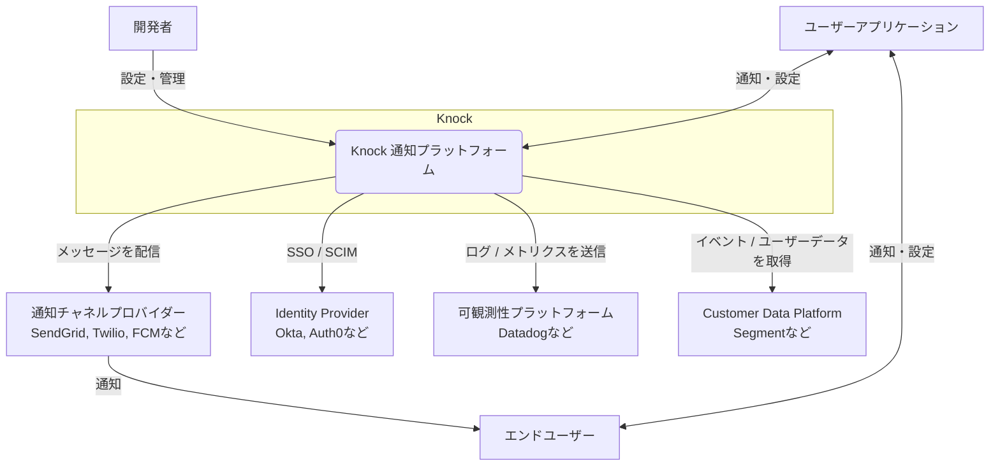
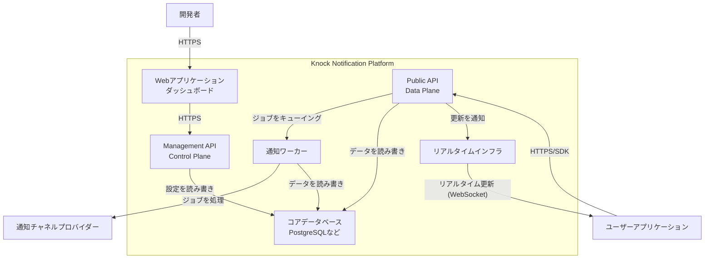
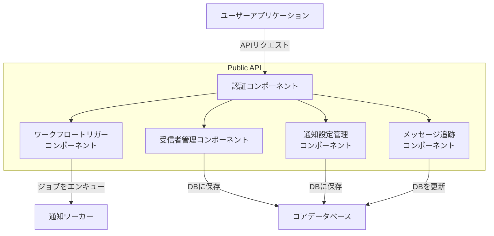
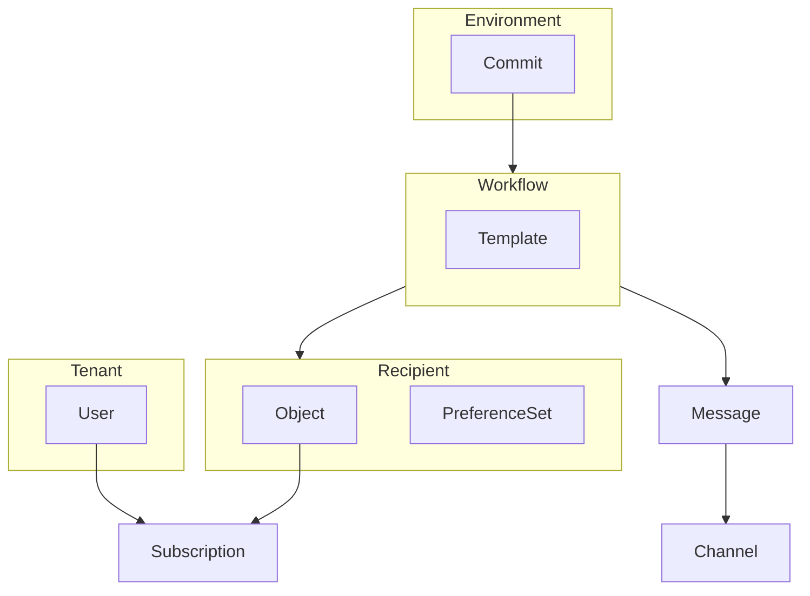
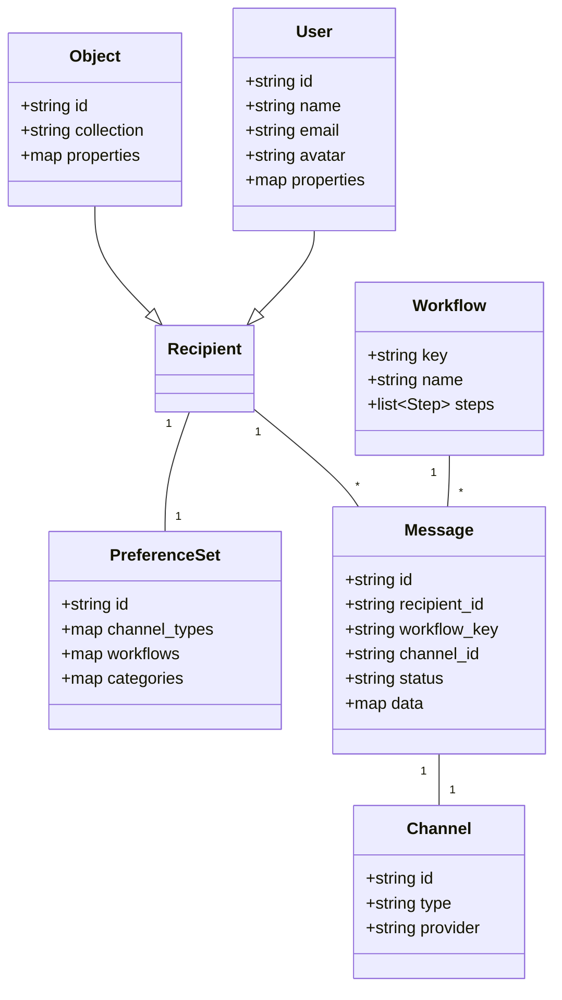

## ■概要

Knockは、開発者向けのAPIファーストな通知基盤プラットフォームです。製品からユーザーへの通知機能（Eメール、SMS、プッシュ通知、Slackなど）の構築、展開、管理を劇的に簡素化します。

信頼性が高くスケーラブルな通知システムの自社開発は、本来多くのリソースを要する複雑な課題です。Knockは、インフラ維持や複雑な配信ロジック（リトライ、流量制御、ユーザー設定など）を抽象化することで、開発者が本来注力すべき製品開発に集中できる環境を提供します。単純な通知APIサービスとは一線を画す「通知エンジン」です。


## ■特徴

  * **クロスチャネル通知配信**
      * 単一のAPI呼び出しで、アプリ内、Eメール、プッシュ通知、SMS、チャットツールなど多様なチャネルへの通知をトリガーできます。
  * **強力なワークフローエンジン**
      * 通知プロセスを「ワークフロー」として視覚的に設計可能です。
      * 遅延、一括配信、条件分岐、流量制御といったステップを組み合わせ、精巧な通知シーケンスを構築できます。
  * **柔軟な通知設定管理**
      * エンドユーザーがワークフロー、カテゴリ、チャネル単位で通知受信を細かく制御できる設定システムを、数行のコードでアプリケーションに組み込めます。
  * **開発者中心のツール群**
      * 主要なプログラミング言語に対応したSDK、ローカル開発を支援するCLI、リソースをコードで管理する管理APIを完備しています。
  * **Infrastructure as Code (IaC) の実践**
      * ワークフローやテンプレートの変更管理に、Gitのような「コミット」と「プロモート」モデルを採用。本番環境への安全なデプロイを実現します。
  * **高度な可観測性（Observability）と分析**
      * 詳細なメッセージログやエンドツーエンドのデバッガーを提供します。
      * DatadogやSegmentなどの外部プラットフォームと連携し、システム監視やエンゲージメント分析が可能です。
  * **マルチテナンシー対応**
      * B2B SaaSで一般的な「テナント」（アカウントや組織）をネイティブにモデル化し、テナントごとの通知ロジックやブランディング管理を容易に実現します。


## ■構造

KnockのシステムアーキテクチャをC4モデルで段階的に解説します。

### ●レベル1: システムコンテキスト図

Knock通知プラットフォームと、関連するアクターや外部システムとの相互作用を示します。



| 要素名 | 説明 |
| :--- | :--- |
| **開発者** | Knockのダッシュボード、API、CLIを利用して、通知ワークフローやテンプレートの設定、運用、管理を行う技術者。 |
| **エンドユーザー** | アプリケーションに組み込まれたUIコンポーネントを通じて通知を受け取り、自身の通知設定を管理する最終的な利用者。 |
| **Knock 通知プラットフォーム** | 通知のオーケストレーションと配信を管理するコアシステム。本記事の主役。 |
| **ユーザーアプリケーション** | Knock SDKを統合し、ワークフローのトリガーや受信者の識別などを行う、あなたが開発するアプリケーション。 |
| **通知チャネルプロバイダー** | Eメール（SendGrid）、SMS（Twilio）、プッシュ通知（APNs/FCM）、チャット（Slack）など、実際のメッセージ配信を担う外部サービス群。 |
| **Identity Provider** | 開発者チームのメンバー認証のために、SSOやSCIMプロビジョニングを提供する外部のID管理サービス（Okta, Auth0など）。 |
| **可観測性プラットフォーム** | Datadogなどの外部監視サービス。Knockはシステムの健全性に関するメトリクスやログを送信する。 |
| **Customer Data Platform** | Segmentなどの顧客データ基盤。ユーザー識別やワークフローのトリガーとなるイベントのソースとして連携する。 |

### ●レベル2: コンテナ図

「Knock 通知プラットフォーム」を構成する主要なコンテナ（独立実行可能な単位）を示します。



| 要素名 | 説明 |
| :--- | :--- |
| **Webアプリケーション (ダッシュボード)** | 開発者がワークフローやテンプレートを管理し、分析結果を閲覧するためのUIを提供するSPA。管理APIと通信する。 |
| **Public API (Data Plane)** | ワークフローのトリガーやユーザー識別など、ランタイム操作を受け付ける主要なREST API。SDKが通信し、高スループット処理が要求される。 |
| **Management API (Control Plane)** | ワークフローやテンプレートなど、Knockリソースを設定・管理するためのREST API。ダッシュボードやCLIから利用される。 |
| **通知ワーカー** | ワークフローで定義されたロジック（遅延、バッチ処理など）を実行し、外部の通知チャネルプロバイダーへAPIコールを行うバックグラウンドサービス群。 |
| **リアルタイムインフラ** | アプリ内通知フィードのライブ更新などを実現するWebSocketベースのサービス。 |
| **コアデータベース** | ワークフロー設定、ユーザーデータ、メッセージログなどを永続化するデータストア（PostgreSQLなどが想定される）。 |

### ●レベル3: コンポーネント図

ここでは「Public API」コンテナを構成する主要なコンポーネントに焦点を当てます。



| 要素名 | 説明 |
| :--- | :--- |
| **認証コンポーネント** | APIキーや署名付きユーザートークン（JWT）を検証し、リクエストの認証と認可を実行する。 |
| **ワークフロートリガーコンポーネント** | ワークフロー実行リクエストを処理し、通知ワーカー用のジョブをメッセージキューに追加する。 |
| **受信者管理コンポーネント** | ユーザーやオブジェクトといった受信者のデータを作成・更新する。 |
| **通知設定管理コンポーネント** | ユーザーの通知設定（どの通知をどのチャネルで受け取るか）の取得や更新を処理する。 |
| **メッセージ追跡コンポーネント** | メッセージのステータス更新（例: 既読、開封、クリック）のリクエストを処理する。 |


## ■データ

Knockのサービス内部で扱うデータ構造を解説します。

### ●概念モデル

Knockの主要なエンティティ（概念）とそれらの関係性を俯瞰的に示します。



| 要素名 | 説明 |
| :--- | :--- |
| **Tenant** | ユーザーが所属するセグメント（B2B SaaSにおけるアカウントや組織など）。 |
| **Recipient** | 通知の「受け手」を表す包括的な概念。UserまたはObjectを指す。 |
| **User** | 通知を受け取る「個人」を表すエンティティ。 |
| **Object** | 通知を受け取る「非ユーザーエンティティ」（例: プロジェクト、ドキュメント、タスクなど）。 |
| **Subscription** | Recipientが特定のObjectを「購読」している関係性を表す。これにより「このプロジェクトの更新をフォローする」といった機能を実現できる。 |
| **PreferenceSet** | Recipientの通知チャネル設定情報。ワークフローごと、チャネルごとのON/OFFを管理する。 |
| **Workflow** | 通知を送信するための一連のロジック定義。 |
| **Template** | 各チャネル（Eメール、SMSなど）で送信されるメッセージの雛形。Liquidテンプレート言語を使用する。 |
| **Message** | 実際にRecipientに配信された通知のインスタンス。 |
| **Channel** | 通知を配信する具体的な手段（Eメール、SMSなど）。 |
| **Environment** | 開発、ステージング、本番といった論理的に分離された環境。 |
| **Commit** | Environment内でのWorkflowやTemplateへの変更を記録するバージョン管理の単位。 |

### ●情報モデル

主要なエンティティが持つ具体的な属性をクラス図形式で示します。




## ■構築方法

Knockをアプリケーションに導入するための基本的な手順を解説します。

### ●前提条件

1.  [Knockの公式サイト](https://knock.app/)でアカウントを作成します。
2.  ダッシュボードの `Developers > API keys` から、利用環境（例: Development）の **Secret Key** (`sk_`で始まるキー) を取得します。
3.  取得したキーは、セキュリティのため環境変数として設定することを強く推奨します。

### ●SDKのインストールと初期化

| 言語 | インストールコマンド | 初期化コード |
| :--- | :--- | :--- |
| **Node.js / TypeScript** | `npm install @knocklabs/node` | `import Knock from '@knocklabs/node';`\<br\>`const knock = new Knock(process.env.KNOCK_API_KEY);` |
| **Python** | `pip install knockapi` | `import os`\<br\>`from knockapi import Knock`\<br\>`client = Knock(api_key=os.environ.get("KNOCK_API_KEY"))` |
| **Ruby** | `Gemfile`に`gem 'knockapi-ruby'`を追加し`bundle install` | `Knock.configure do |config|`\<br\>  `config.api_key = ENV['KNOCK_API_KEY']`\<br\>`end` |


## ■利用方法

SDK初期化後の基本的な操作を解説します。

### ●1. ユーザーの識別 (Identifying Users)

まず、通知の受信者となるユーザーのプロファイルをKnock上に作成または更新し、名前やEメールなどの情報を同期させます。この操作は冪等です。

  * **Node.js / TypeScript**
    ```typescript
    await knock.users.identify('user-1', {
      name: 'John Doe',
      email: 'john.doe@example.com',
    });
    ```
  * **Python**
    ```python
    client.users.identify(
        id="user-1",
        data={
            "name": "John Doe",
            "email": "john.doe@example.com",
        }
    )
    ```
  * **Ruby**
    ```ruby
    Knock::Users.identify(
      id: "user-1",
      data: {
        name: "John Doe",
        email: "john.doe@example.com",
      }
    )
    ```

### ●2. ワークフローのトリガー (Triggering Workflows)

次に、ダッシュボードで定義済みのワークフローを開始させます。誰が（`actor`）、誰に（`recipients`）、どのようなデータ（`data`）で通知するかを指定します。

  * **Node.js / TypeScript**
    ```typescript
    // 例: user-2がuser-1へ新しいコメントを通知する
    await knock.workflows.trigger('new-comment', {
      actor: 'user-2',
      recipients: ['user-1'],
      data: {
        document_name: 'Project Proposal',
      }
    });
    ```
  * **Python**
    ```python
    # 例: user-2がuser-1へ新しいコメントを通知する
    client.workflows.trigger(
        key="new-comment",
        actor="user-2",
        recipients=["user-1"],
        data={
            "document_name": "Project Proposal",
        }
    )
    ```
  * **Ruby**
    ```ruby
    # 例: user-2がuser-1へ新しいコメントを通知する
    Knock::Workflows.trigger(
      key: "new-comment",
      actor: "user-2",
      recipients: ["user-1"],
      data: {
        document_name: "Project Proposal",
      }
    )
    ```


## ■運用

Knock導入後の開発ライフサイクルにおける運用方法を解説します。

### ●環境管理

設定とデータを論理的に分離するため、`Development`、`Staging`、`Production`といった独立した「環境」を使用します。

  * **環境の分離**: 各環境は完全に分離され、データや設定は他の環境からアクセスできません。
  * **APIキー**: 各環境に固有のAPIキーが割り当てられ、リクエストの送信元を識別します。
  * **環境の作成**: ダッシュボードの `Settings > Environments` から追加可能です。

### ●変更管理: コミットとプロモート

Gitに似た変更管理フローを採用し、本番環境への変更を安全に管理します。

1.  **保存とコミット (Commit)**: `Development`環境でワークフローなどを変更後、その変更内容を「コミット」し、バージョンとして記録します。
2.  **プロモート (Promote)**: コミットした変更を、上位の環境（例: `Development` → `Production`）へ「プロモート（昇格）」することで、設定を反映させます。

このプロセスにより、変更履歴が明確に残り、差分確認や意図しない変更の防止が可能です。

### ●CLIによるIaC (Infrastructure as Code)

ワークフロー定義などをコードとして管理するための中心的なツールです。

  * **インストール**: Homebrew (`brew install knock`) または npm (`npm install -g @knocklabs/cli`) でインストールします。
  * **認証**: サービスアカウントトークンを `~/.config/knock/config.json` に設定します。
  * **主要なコマンド**:

| コマンド | 説明 |
| :--- | :--- |
| `knock workflow pull` | Knock上のワークフロー設定（JSON）をローカルにダウンロードします。 |
| `knock workflow push` | ローカルのJSONファイルをKnockにアップロードし、新しいコミットを作成します。 |
| `knock workflow run` | コマンドラインからワークフローをテスト実行できます。 |
| `knock workflow activate` | 特定環境でワークフローを有効化または無効化します。 |


### ■参考リンク

  * **公式サイト & ドキュメント**
      * [Knock.app](https://knock.app/) - 公式サイト
      * [Documentation | Knock Docs](https://docs.knock.app/) - 公式ドキュメント トップ
      * [What is Knock?](https://docs.knock.app/getting-started/what-is-knock) - Knockの概要
      * [Core concepts](https://docs.knock.app/concepts/overview) - コアコンセプト
      * [Get started with Knock](https://docs.knock.app/getting-started/quick-start) - クイックスタート
      * [Pricing](https://knock.app/pricing) - 料金プラン
  * **開発者向けリソース**
      * [API reference](https://docs.knock.app/api-reference) - Public APIリファレンス
      * [Management API](https://docs.knock.app/mapi-reference) - 管理APIリファレンス
      * [CLI reference](https://docs.knock.app/cli) - CLIリファレンス
      * [Commits & Environments](https://docs.knock.app/concepts/commits) - 変更管理の概念
      * [Knock (GitHub Organization)](https://github.com/knocklabs) - 公式GitHub
  * **動画リソース**
      * [Knock - YouTube](https://www.youtube.com/@knocklabs)


この記事が、その技術的な理解の一助となれば幸いです。
少しでも参考になった、あるいは改善点などがあれば、ぜひリアクションやコメント、SNSでのシェアをいただけると励みになります！
