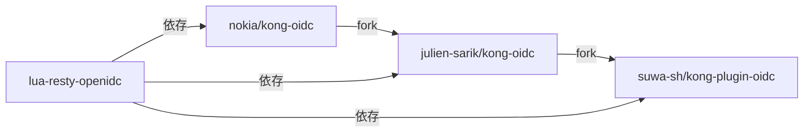
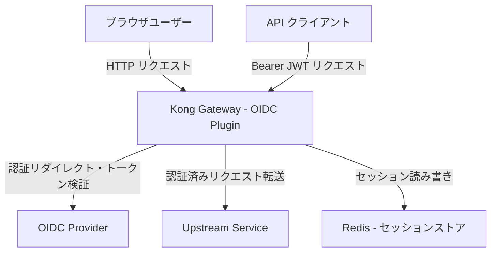
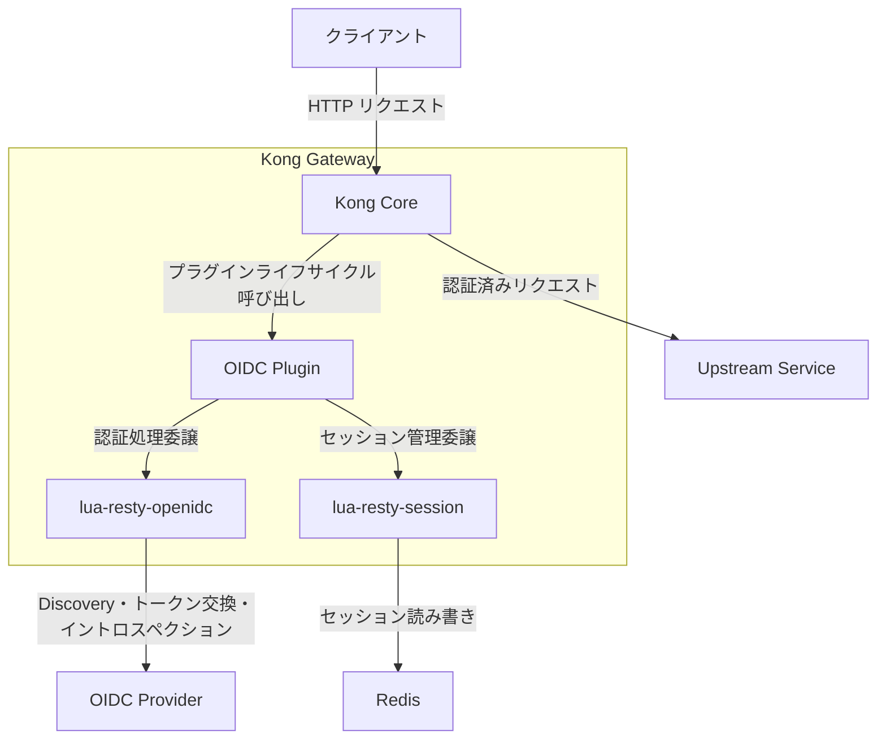
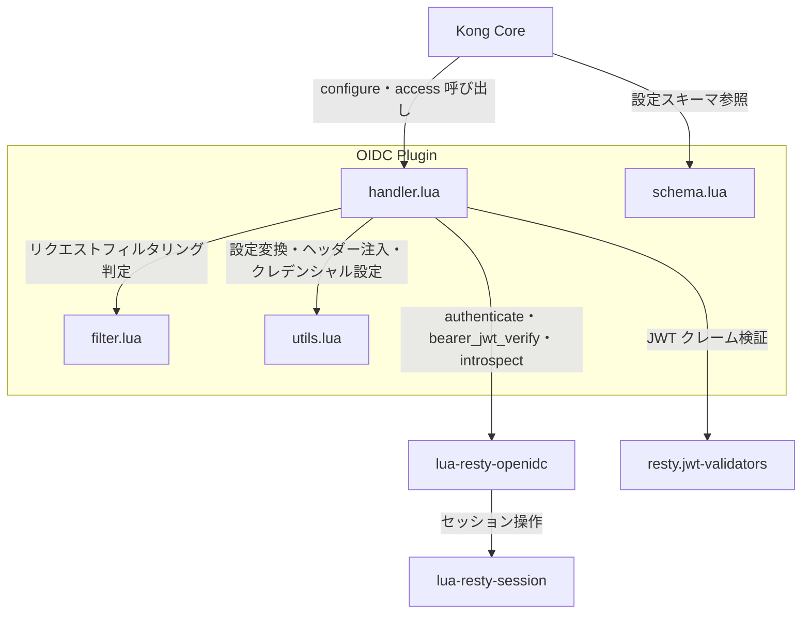
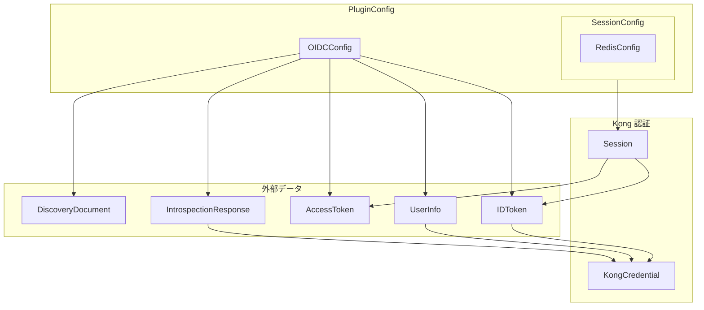
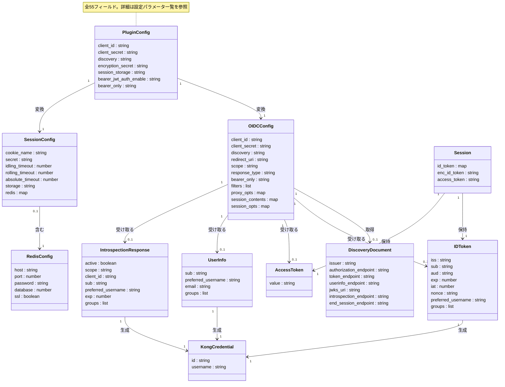
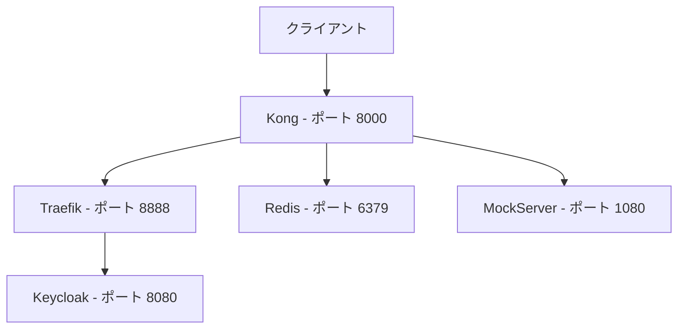
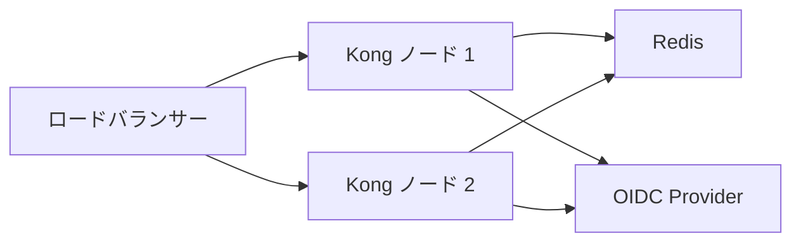
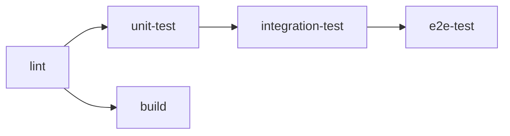
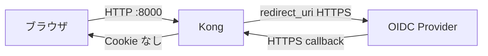

## 概要

suwa-sh/kong-plugin-oidc は、Kong Gateway 向けの OSS OIDC（OpenID Connect）認証プラグインです。Kong Gateway を OpenID Connect Relying Party（RP）として動作させ、バックエンドサービスの認証実装を不要にします。

Authorization Code フローでユーザーを OIDC Provider で認証し、セッションを Cookie または Redis に暗号化保存します。Bearer JWT 検証やトークンイントロスペクションにも対応しています。

### フォーク関係



| 要素名 | 説明 |
|---|---|
| nokia/kong-oidc | 2017年公開のオリジナル実装。lua-resty-openidc ~> 1.6.1 を使用。Kong v2 系対応 |
| julien-sarik/kong-oidc | nokia/kong-oidc の fork。lua-resty-openidc を ~> 1.8.0 に更新し Kong v3 系へ対応 |
| suwa-sh/kong-plugin-oidc | julien-sarik/kong-oidc の fork。Redis セッション、Bearer JWT 検証、カスタムヘッダー注入を追加 |
| lua-resty-openidc | OpenResty 向け OIDC/OAuth2 ライブラリ。OIDC フロー実装の中核 |

suwa-sh/kong-plugin-oidc は `lua-resty-openidc`（zmartzone 製）をラッパーとして利用しています。OIDC プロトコル処理（Discovery、認可コード交換、JWT 検証、セッション管理）は `lua-resty-openidc` と `lua-resty-session` に委譲し、プラグイン本体は Kong との統合（ヘッダー注入、Kong Credential 設定、設定スキーマ定義）を担います。

:::message
**このフォークの経緯**: nokia/kong-oidc は 2019年にメンテナンスが停滞し、lua-resty-session v3 系のまま Kong v3 に対応できませんでした。julien-sarik/kong-oidc が v3 対応を行いましたが、2024年にアーカイブされました。suwa-sh/kong-plugin-oidc はその後継として、Redis セッションの安定化（lua-resty-session v4 採用）、Bearer JWT 検証の追加、カスタムヘッダー注入を実装しています。特に lua-resty-session v4 への移行では、v3 時代の「15分でセッションが切れる」デフォルトタイムアウト問題を、明示的なタイムアウト設定（idling/rolling/absolute の3種）で解消しました。
:::

### 認証フロー選択条件

handler.lua は access フェーズで以下の順序でフローを試行します。

| 優先順位 | フロー | 有効化条件 | 主なユースケース |
|---|---|---|---|
| 1 | Bearer JWT 検証 | `bearer_jwt_auth_enable: "yes"` かつ Authorization: Bearer ヘッダーあり | API クライアント + JWKS 署名検証 |
| 2 | Token Introspection | `introspection_endpoint` 設定あり かつ Authorization: Bearer ヘッダーあり | Opaque Token の検証 |
| 3 | Authorization Code Flow | 上記いずれにも該当しない | ブラウザユーザーのログイン |

`bearer_only: "yes"` の場合、Authorization Code Flow へのフォールバック（ログインページリダイレクト）は行わず 401 を返します。

## 特徴

- **Authorization Code フロー**: OpenID Connect Discovery による IdP 自動設定に対応
- **Redis セッション**: マルチノード Kong 構成でセッション共有が可能
- **Bearer JWT 検証**: JWKS を利用した JWT 署名・クレーム検証をプラグイン内で完結
- **トークンイントロスペクション**: 既存アクセストークンを Resource Server で検証
- **カスタムヘッダー注入**: トークンの任意クレームをバックエンドへ転送
- **Kong Credential 統合**: `kong.client.authenticate()` による Kong 認証基盤との連携
- **グループクレーム転送**: `kong.ctx.shared.authenticated_groups`（request-scoped）経由で Kong 認可プラグインと連携
- **Docker イメージ提供**: GHCR にビルド済みイメージを公開（Kong 3.11 ベース）
- **CI 整備**: GitHub Actions によるユニット・統合・E2E テストを自動実行

### 類似ツールとの比較

| 項目 | suwa-sh/kong-plugin-oidc | Kong OIDC - Enterprise | nokia/kong-oidc | Optum/kong-oidc-auth | Gate1106/kong-oidc-v3 |
|---|---|---|---|---|---|
| Kong バージョン対応 | v3 系（3.11 確認済み） | v1 以降（全バージョン） | v2 系まで | v2 系まで | v3 系 |
| OSS / Enterprise | OSS | Enterprise のみ | OSS | OSS | OSS |
| ライセンス | Apache-2.0 | 商用ライセンス | Apache-2.0 | Apache-2.0 | Apache-2.0 |
| セッション管理 | Cookie / Redis | Cookie / DB | Cookie / shared-memory | Cookie | - |
| Redis 対応 | あり | あり | 不安定 | なし | - |
| Bearer JWT 検証 | あり - JWKS 利用 | あり | なし | なし | なし |
| トークンイントロスペクション | あり | あり | あり | なし | なし |
| カスタムヘッダー注入 | あり | あり | なし | なし | なし |
| メンテナンス状況 | アクティブ - 2026-04 | アクティブ | 停滞 - 2023-06 | 停滞 - 2023-08 | 停滞 - 2022-11 |
| Docker イメージ公開 | あり - GHCR | なし | なし | なし | なし |

### ユースケース別推奨

| ユースケース | 推奨プラグイン | 理由 |
|---|---|---|
| Kong Gateway OSS + Kong v3 + Redis セッション | suwa-sh/kong-plugin-oidc | v3 対応かつ Redis セッションに対応 |
| Kong Gateway Enterprise | Kong 公式 OIDC プラグイン | Enterprise ライセンス保有時は公式が最多機能 |
| Kong v2 系レガシー環境 | nokia/kong-oidc | v2 系の実績が多い |
| IdP 固有機能が不要な軽量構成 | Gate1106/kong-oidc-v3 | v3 対応の最小構成 |
| Ping Federate 特有の要件あり | Optum/kong-oidc-auth | Ping Federate 向け機能を内包 |

## 構造

### システムコンテキスト図



| 要素名 | 説明 |
|---|---|
| ブラウザユーザー | ブラウザ経由で Kong にアクセスするエンドユーザー。Authorization Code Flow で認証 |
| API クライアント | Bearer JWT を Authorization ヘッダーに付与して Kong にアクセスするクライアント |
| Kong Gateway - OIDC Plugin | 認証ゲートウェイ。OIDC RP として認証・認可を一元的に処理 |
| OIDC Provider | OpenID Connect プロバイダー。認証・トークン発行・JWKS 公開・イントロスペクションを担当 |
| Upstream Service | 認証済みリクエストを受け取るバックエンドサービス |
| Redis - セッションストア | マルチノード対応のセッション共有ストア。Cookie サイズ制限の回避にも使用 |

### コンテナ図



#### Kong Gateway 内部

| 要素名 | 説明 |
|---|---|
| Kong Core | Kong の中核エンジン。Nginx ベースのリクエスト処理、プラグインライフサイクル管理、PDK 提供 |
| OIDC Plugin | Kong プラグインとして動作する OIDC 認証モジュール。access フェーズでリクエストを処理 |
| lua-resty-openidc | OIDC プロトコル実装ライブラリ。Discovery・Authorization Code Flow・JWT 検証・イントロスペクション提供 |
| lua-resty-session | セッション管理ライブラリ。Cookie または Redis バックエンドでセッションを永続化 |

#### 外部要素

| 要素名 | 説明 |
|---|---|
| OIDC Provider | Keycloak 等の OpenID Connect プロバイダー |
| Redis | セッションデータの共有ストア |
| Upstream Service | 認証済みリクエストの転送先バックエンド |
| クライアント | ブラウザユーザーまたは API クライアント |

### コンポーネント図



#### OIDC Plugin 内部

| 要素名 | 説明 |
|---|---|
| handler.lua | プラグインエントリーポイント。configure・access を実装し、Bearer JWT 検証・イントロスペクション・Authorization Code Flow を順に試行 |
| filter.lua | リクエストフィルタリングモジュール。設定された URL パターンに一致するリクエストを認証対象外に設定 |
| utils.lua | ユーティリティモジュール。設定変換・クレデンシャル設定・各種ヘッダー注入を担当 |
| schema.lua | 設定スキーマ定義モジュール。Kong DB スキーマとして全フィールドを宣言 |

#### 外部ライブラリ

| 要素名 | 説明 |
|---|---|
| Kong Core | プラグインライフサイクル管理と PDK を提供する Kong 中核エンジン |
| lua-resty-openidc | OIDC プロトコル実装ライブラリ。handler.lua から直接呼び出し |
| lua-resty-session | セッション永続化ライブラリ。lua-resty-openidc 経由で間接的に使用 |
| resty.jwt-validators | JWT クレーム検証ライブラリ。Bearer JWT 検証時に handler.lua から直接呼び出し |

## データ

### 概念モデル



#### PluginConfig

| 要素名 | 説明 |
|---|---|
| PluginConfig | schema.lua で定義されるプラグイン全設定 |
| OIDCConfig | lua-resty-openidc に渡す OIDC 認証オプション |
| SessionConfig | lua-resty-session に渡すセッション管理設定 |
| RedisConfig | Redis バックエンド使用時のセッション保存先設定 |

#### 外部データ

| 要素名 | 説明 |
|---|---|
| DiscoveryDocument | OIDC Provider の .well-known/openid-configuration レスポンス |
| IDToken | OIDC 認証フローで発行される ID トークン |
| AccessToken | OAuth2 アクセストークン |
| UserInfo | OIDC UserInfo エンドポイントのレスポンス |
| IntrospectionResponse | Token Introspection エンドポイントのレスポンス |

#### Kong 認証

| 要素名 | 説明 |
|---|---|
| KongCredential | IDToken / UserInfo から生成するリクエストスコープの Kong 認証情報 |
| Session | lua-resty-session が管理するセッションデータ |

### 情報モデル



| 要素名 | 説明 |
|---|---|
| PluginConfig | schema.lua で定義されるプラグイン設定の全フィールド |
| OIDCConfig | utils.get_options が PluginConfig から生成する lua-resty-openidc 向けオプション |
| SessionConfig | make_oidc が生成する lua-resty-session 向けセッション設定 |
| RedisConfig | session_storage が redis の場合に SessionConfig 内に展開される接続設定 |
| DiscoveryDocument | OIDCConfig.discovery URL から取得する OIDC Provider メタデータ |
| IDToken | OIDC 認証フローで取得する ID トークンのクレームセット |
| AccessToken | OAuth2 フローで取得するアクセストークン文字列 |
| UserInfo | UserInfo エンドポイントから取得するユーザー属性情報 |
| IntrospectionResponse | Token Introspection エンドポイントから取得するトークン検証結果 |
| KongCredential | sub と preferred_username を抽出して生成するリクエストスコープの Kong 認証情報。Kong DB には永続化されない |
| Session | lua-resty-session が管理するセッション。id_token、enc_id_token、access_token を保持 |

### KongCredential マッピングルール

| ソース | ソースフィールド | KongCredential フィールド |
|---|---|---|
| IDToken | sub | id |
| IDToken | preferred_username | username |
| UserInfo | sub | id |
| UserInfo | preferred_username | username |
| IntrospectionResponse | sub | id |
| IntrospectionResponse | preferred_username | username |

`setCredentials()` 関数（utils.lua）が上記のマッピングを実行し、`kong.client.authenticate(nil, credential)` を呼び出します。これはリクエストスコープの credential オブジェクトを設定するだけであり、Kong DB に Consumer/Credential エンティティを永続化するものではありません。

`header_claims` はフラットなクレーム名のみ対応しています。`realm_access.roles` のようなドット区切りのネストパスは解決されません。

## 構築方法

### 前提条件

| 項目 | バージョン |
|---|---|
| Kong Gateway | 3.9 以上 |
| lua-resty-openidc | ~> 1.8.0 |
| lua-resty-session | 4.0.5 |

### Docker イメージの利用

GHCR に公開済みのイメージを利用します。

```bash
docker pull ghcr.io/suwa-sh/kong-plugin-oidc:latest
```

| タグ | 内容 |
|---|---|
| `latest` | 最新ビルド |
| `kong-3.11.0.8-1.6.0` | Kong 3.11.0.8 + プラグイン 1.6.0 |

`KONG_PLUGINS` 環境変数に `oidc` を追加します。

```yaml
environment:
  KONG_PLUGINS: bundled,oidc
```

### Dockerfile からのカスタムビルド

```bash
git clone https://github.com/suwa-sh/kong-plugin-oidc.git
cd kong-plugin-oidc
docker build -t kong:kong-oidc .
```

Kong バージョンを指定してビルドする場合:

```bash
docker build --build-arg KONG_VERSION=3.9.1.2-ubuntu -t kong:kong-oidc .
```

### LuaRocks によるインストール

既存の Kong 環境にプラグインを追加します。

```bash
git clone https://github.com/suwa-sh/kong-plugin-oidc.git
cd kong-plugin-oidc
luarocks make kong-plugin-oidc-1.6.0-1.rockspec
```

### examples ディレクトリの利用



| 要素名 | 説明 |
|---|---|
| クライアント | ブラウザや API クライアント |
| Kong | OIDC 認証を終端するリバースプロキシ |
| Traefik | Keycloak へのリクエストをルーティングするプロキシ |
| Keycloak | OpenID Connect Provider |
| Redis | セッションストレージ |
| MockServer | バックエンドのモックサーバー |

```bash
cd examples
docker compose up -d

# 動作確認: ブラウザで以下にアクセスし、Keycloak のログイン画面へリダイレクトされることを確認
# http://localhost:8000/some/path
#
# Keycloak 管理画面: http://localhost:8080（admin / admin）
# テスト用クライアントとユーザーを作成し、ログイン後にバックエンドのレスポンスが返ることを確認
```

## 利用方法

### 必須パラメータ

| パラメータ | 説明 | 例 |
|---|---|---|
| `config.client_id` | OIDC クライアント ID | `foo` |
| `config.client_secret` | OIDC クライアントシークレット | `fUp4H6418Zt3Zcj1Lxyh3DxrGPs1WE4o` |
| `config.discovery` | OIDC ディスカバリエンドポイント | `https://idp.example.com/.well-known/openid-configuration` |
| `config.encryption_secret` | セッション暗号化キー | `Zm9vb29v` |

### 全設定パラメータ一覧

| カテゴリ | パラメータ | 型 | 必須 | デフォルト |
|---|---|---|---|---|
| OIDC 認証 | client_id | string | 必須 | - |
| OIDC 認証 | client_secret | string | 必須 | - |
| OIDC 認証 | discovery | string | 任意 | .well-known/openid-configuration |
| OIDC 認証 | scope | string | 任意 | openid |
| OIDC 認証 | response_type | string | 任意 | code |
| OIDC 認証 | redirect_uri | string | 任意 | リクエスト URI から動的計算 |
| OIDC 認証 | token_endpoint_auth_method | string | 任意 | client_secret_post |
| OIDC 認証 | ssl_verify | string | 任意 | no |
| OIDC 認証 | realm | string | 任意 | kong |
| フロー制御 | bearer_only | string | 任意 | no |
| フロー制御 | unauth_action | string | 任意 | auth |
| Bearer JWT | bearer_jwt_auth_enable | string | 任意 | no |
| Bearer JWT | bearer_jwt_auth_allowed_auds | list | 任意 | - |
| Bearer JWT | bearer_jwt_auth_signing_algs | list | 任意 | RS256 |
| Bearer JWT | use_jwks | string | 任意 | no |
| Introspection | introspection_endpoint | string | 任意 | - |
| Introspection | introspection_endpoint_auth_method | string | 任意 | - |
| Introspection | introspection_cache_ignore | string | 任意 | no |
| Introspection | validate_scope | string | 任意 | no |
| セッション | encryption_secret | string | 必須 | - |
| セッション | session_storage | string | 任意 | cookie |
| セッション | cookie_name | string | 任意 | - |
| セッション | session_idling_timeout | number | 任意 | 0 |
| セッション | session_rolling_timeout | number | 任意 | 0 |
| セッション | session_absolute_timeout | number | 任意 | 0 |
| セッション | session_remember_rolling_timeout | number | 任意 | 0 |
| セッション | session_remember_absolute_timeout | number | 任意 | 0 |
| Redis | session_redis_host | string | 任意 | 127.0.0.1 |
| Redis | session_redis_port | number | 任意 | 6379 |
| Redis | session_redis_password | string | 任意 | - |
| Redis | session_redis_database | number | 任意 | 0 |
| Redis | session_redis_ssl | string | 任意 | no |
| ヘッダー注入 | userinfo_header_name | string | 任意 | X-USERINFO |
| ヘッダー注入 | id_token_header_name | string | 任意 | X-ID-Token |
| ヘッダー注入 | access_token_header_name | string | 任意 | X-Access-Token |
| ヘッダー注入 | access_token_as_bearer | string | 任意 | no |
| ヘッダー注入 | disable_userinfo_header | string | 任意 | no |
| ヘッダー注入 | disable_id_token_header | string | 任意 | no |
| ヘッダー注入 | disable_access_token_header | string | 任意 | no |
| ヘッダー注入 | header_names | list | 任意 | - |
| ヘッダー注入 | header_claims | list | 任意 | - |
| ヘッダー注入 | groups_claim | string | 任意 | groups |
| フィルター | filters | string | 任意 | - |
| フィルター | ignore_auth_filters | string | 任意 | - |
| フィルター | skip_already_auth_requests | string | 任意 | no |
| ログアウト | logout_path | string | 任意 | /logout |
| ログアウト | redirect_after_logout_uri | string | 任意 | / |
| ログアウト | redirect_after_logout_with_id_token_hint | string | 任意 | no |
| ログアウト | post_logout_redirect_uri | string | 任意 | - |
| ログアウト | revoke_tokens_on_logout | string | 任意 | no |
| エラー処理 | recovery_page_path | string | 任意 | - |
| 接続 | timeout | number | 任意 | - |
| 接続 | http_proxy | string | 任意 | - |
| 接続 | https_proxy | string | 任意 | - |
| デバッグ | openidc_debug_log_level | string | 任意 | ngx.DEBUG |

#### 設定の相互依存

| 条件 | 挙動 |
|---|---|
| `bearer_jwt_auth_enable: "yes"` + Bearer ヘッダーあり | JWKS による JWT 署名検証を実行。introspection_endpoint は不要 |
| `introspection_endpoint` 設定あり + Bearer ヘッダーあり | Token Introspection を実行 |
| `bearer_only: "yes"` | ログインリダイレクトを行わず、Bearer Token がない場合は 401 を返す |
| `bearer_only: "yes"` + `bearer_jwt_auth_enable: "yes"` | JWT 検証を優先する。`introspection_endpoint` が設定されていれば Introspection にフォールバック |
| 上記すべて "no" / 未設定 | Authorization Code Flow のみ動作 |

### 宣言的設定での有効化

```yaml
_format_version: "3.0"
_transform: true

services:
  - name: my-service
    host: upstream-host
    port: 8080
    protocol: http
    routes:
      - name: my-route
        paths:
          - /api
    plugins:
      - name: oidc
        config:
          client_id: my-client                # IdP で発行したクライアント ID
          client_secret: my-secret            # IdP で発行したクライアントシークレット
          discovery: https://idp.example.com/.well-known/openid-configuration  # IdP の Discovery エンドポイント
          encryption_secret: my-encryption-secret  # セッション暗号化キー（全ノード共通）
```

### Admin API での有効化

```bash
curl -X POST http://localhost:8001/services/my-service/plugins \
  --data "name=oidc" \
  --data "config.client_id=my-client" \
  --data "config.client_secret=my-secret" \
  --data "config.discovery=https://idp.example.com/.well-known/openid-configuration" \
  --data "config.encryption_secret=my-encryption-secret"
```

### Authorization Code Flow の設定例

ブラウザアクセスを OIDC でログインページにリダイレクトする構成です。

```yaml
plugins:
  - name: oidc
    config:
      client_id: foo
      client_secret: fUp4H6418Zt3Zcj1Lxyh3DxrGPs1WE4o
      discovery: http://keycloak:8080/realms/master/.well-known/openid-configuration
      redirect_uri: http://localhost:8000/some/path/callback
      post_logout_redirect_uri: http://localhost:8000/some/path
      redirect_after_logout_uri: http://keycloak:8080/realms/master/protocol/openid-connect/logout
      redirect_after_logout_with_id_token_hint: "yes"
      encryption_secret: Zm9vb29v
      scope: openid profile email
      response_type: code
```

### Bearer JWT 認証の設定例

API クライアントが Authorization ヘッダーに JWT を付与する構成です。

```yaml
plugins:
  - name: oidc
    config:
      client_id: my-client
      client_secret: my-secret
      discovery: https://idp.example.com/.well-known/openid-configuration
      encryption_secret: my-encryption-secret
      bearer_jwt_auth_enable: "yes"
      bearer_jwt_auth_allowed_auds:
        - my-client
        - my-api
      bearer_jwt_auth_signing_algs:
        - RS256
```

| パラメータ | 説明 |
|---|---|
| `bearer_jwt_auth_enable` | Bearer JWT 認証を有効化 |
| `bearer_jwt_auth_allowed_auds` | JWT の `aud` 許可値。未指定時は `client_id` を使用 |
| `bearer_jwt_auth_signing_algs` | 許可する署名アルゴリズム。デフォルト `RS256` |

### Token Introspection の設定例

Bearer トークンをイントロスペクションエンドポイントで検証する構成です。

```yaml
plugins:
  - name: oidc
    config:
      client_id: my-client
      client_secret: my-secret
      discovery: https://idp.example.com/.well-known/openid-configuration
      encryption_secret: my-encryption-secret
      bearer_only: "yes"
      introspection_endpoint: https://idp.example.com/oauth2/introspect
      introspection_endpoint_auth_method: client_secret_basic
      introspection_cache_ignore: "no"
```

### セッション設定

#### Cookie セッション（デフォルト）

```yaml
config:
  encryption_secret: Zm9vb29v
  session_storage: cookie
  cookie_name: session
  session_idling_timeout: 1800
  session_absolute_timeout: 86400
```

#### Redis セッション

Cookie の 4KB 制限を回避し、マルチノードでセッションを共有する場合に使用します。

```yaml
config:
  encryption_secret: Zm9vb29v
  session_storage: redis
  session_redis_host: redis
  session_redis_port: 6379
  session_redis_database: 0
  session_idling_timeout: 1800
  session_absolute_timeout: 86400
```

| 項目 | Cookie | Redis |
|---|---|---|
| データ保存場所 | クライアントの Cookie | Redis サーバー |
| Cookie サイズ制限 | ~4KB | セッション ID のみ格納 |
| マルチノード対応 | encryption_secret の一致が必要 | 可能 |
| 追加インフラ | 不要 | Redis サーバーが必要 |

#### セッションタイムアウト

| パラメータ | 起点 | リクエスト時のリセット |
|---|---|---|
| `session_idling_timeout` | 最後のリクエスト | リセットされる |
| `session_rolling_timeout` | セッション作成 | リセットされる |
| `session_absolute_timeout` | セッション作成 | リセットされない |

#### remember パラメータ（長期セッション）

`session_remember_rolling_timeout` と `session_remember_absolute_timeout` は、ユーザーが「ログイン状態を保持する」を選択した場合に適用される長期セッション設定です。通常のタイムアウトとは独立して動作します。

```yaml
config:
  session_remember_rolling_timeout: 604800    # 7日
  session_remember_absolute_timeout: 2592000  # 30日
```

### フィルター設定（認証除外パス）

```yaml
config:
  filters: /health,/metrics
  ignore_auth_filters: /public/.*,/static/.*
```

| パラメータ | 説明 |
|---|---|
| `filters` | 認証をバイパスするパスのパターン（Lua pattern による `string.find` マッチング） |
| `ignore_auth_filters` | 認証をバイパスするエンドポイントのカンマ区切りリスト |
| `skip_already_auth_requests` | 上位プラグインで認証済みのリクエストをスキップ |

### ヘッダーインジェクション設定

#### デフォルトで注入されるヘッダー

| ヘッダー名 | 内容 |
|---|---|
| `X-USERINFO` | ユーザー情報（Base64 エンコード JSON）。Bearer JWT / Introspection 時に注入。Auth Code Flow のデフォルトでは `session_contents.user = false` のため注入されない |
| `X-ID-Token` | ID トークン（Base64 エンコード JSON） |
| `X-Access-Token` | アクセストークン |
| `X-Credential-Identifier` | ユーザーの `preferred_username` クレーム（`setCredentials()` が `credential.username` に設定した値） |

#### カスタムヘッダーのマッピング

`header_claims` と `header_names` は同数の要素で位置対応します。

```yaml
config:
  header_claims:
    - email
    - name
    - groups
  header_names:
    - x-oidc-email
    - x-oidc-name
    - x-oidc-groups
```

#### アクセストークンを Bearer 形式で転送

```yaml
config:
  access_token_header_name: Authorization
  access_token_as_bearer: "yes"
```

## 運用

### プラグインの有効化・無効化

Kong Admin API の `enabled` フィールドを PATCH して切り替えます。

```bash
# 無効化
curl -X PATCH http://localhost:8001/plugins/{plugin-id} \
  -H "Content-Type: application/json" \
  -d '{"enabled": false}'

# 有効化
curl -X PATCH http://localhost:8001/plugins/{plugin-id} \
  -H "Content-Type: application/json" \
  -d '{"enabled": true}'

# 状態確認
curl -s http://localhost:8001/plugins/{plugin-id} | jq '.enabled'
```

### ログレベルの変更

`openidc_debug_log_level` パラメータで lua-resty-openidc のログ出力量を制御します。

| 値 | 用途 |
|---|---|
| `ngx.ERR` | 本番環境（エラーのみ） |
| `ngx.WARN` | 警告以上を記録 |
| `ngx.INFO` | 情報ログを記録 |
| `ngx.DEBUG` | 全詳細ログ（デバッグ用） |

```bash
curl -X PATCH http://localhost:8001/plugins/{plugin-id} \
  -H "Content-Type: application/json" \
  -d '{"config": {"openidc_debug_log_level": "ngx.INFO"}}'
```

### Redis セッションストアの運用

```bash
# 疎通確認
redis-cli -h ${session_redis_host} -p ${session_redis_port} PING

# セッション数の確認
redis-cli DBSIZE

# キースペース統計
redis-cli INFO keyspace

# 特定キーの TTL 確認
redis-cli TTL <session-key>
```

### プラグインバージョンのアップグレード

プラグインは Kong の Docker イメージにバンドルされています。ローリングアップグレード手順（DB レスモード）:

```bash
# 1. 新バージョンイメージをプル
docker pull ghcr.io/suwa-sh/kong-plugin-oidc:kong-3.11.0.8-1.6.0

# 2. ノードを順番に入れ替え
docker stop kong-node-1
docker run -d --name kong-node-1-new \
  -e KONG_PLUGINS=bundled,oidc \
  ghcr.io/suwa-sh/kong-plugin-oidc:kong-3.11.0.8-1.6.0

# 3. 起動確認
curl http://node-1:8001/status
```

### Kong Gateway アップグレード時の注意点

| 項目 | 注意内容 |
|---|---|
| セッション継続性 | Redis セッションストアであれば旧バージョンと新バージョンでセッション共有が可能 |
| encryption_secret | 全ノードで同一の値を維持 |
| lua-resty-session バージョン | v4 系と v3 系の Cookie 形式は互換性なし |
| Cookie モードの新旧混在 | 新旧ノード間でセッションが引き継がれずユーザーが再認証を求められる |

:::message
**lua-resty-session v3→v4 移行時の注意**: Cookie 形式に互換性がないため、Cookie モードではダウンタイムを許容して全ノード同時切り替えが必要です。ダウンタイムを避ける場合は、アップグレード前に `session_storage: redis` に移行してください。
:::

## ベストプラクティス

### マルチノード構成での encryption_secret 統一

`encryption_secret` はセッション Cookie の暗号化鍵の導出に使用します。全ノードで同一の値を設定してください。環境変数や Secret Manager での一元管理を推奨します。

```yaml
plugins:
  - name: oidc
    config:
      encryption_secret: "shared-secret-same-on-all-nodes"
```

### Redis セッションストアの推奨

マルチノード環境では Redis セッションストアを使用します。



| 要素名 | 説明 |
|---|---|
| ロードバランサー | リクエストを複数の Kong ノードに分散 |
| Kong ノード 1 / 2 | OIDC プラグインを実行する Kong Gateway インスタンス |
| Redis | 全ノード共有のセッションストア |
| OIDC Provider | Keycloak 等の認証サーバー |

### SSL 検証の有効化

本番環境では `ssl_verify: yes` を設定します。

```yaml
config:
  ssl_verify: yes
```

Kong サーバーに信頼する CA 証明書の設定が必要です。

```nginx
lua_ssl_verify_depth 5;
lua_ssl_trusted_certificate /etc/ssl/certs/ca-certificates.pem;
```

### セッションタイムアウトの推奨設定

| ユースケース | idling_timeout | absolute_timeout |
|---|---|---|
| 業務アプリ（一般） | 1800（30分） | 28800（8時間） |
| 高セキュリティ要件 | 900（15分） | 3600（1時間） |
| 長時間作業ツール | 3600（1時間） | 86400（24時間） |

### scope の最小化

```yaml
config:
  scope: "openid email"
```

| スコープ | 取得されるクレーム |
|---|---|
| `openid` | `sub`, `iss`, `aud`, `exp`, `iat` |
| `email` | `email`, `email_verified` |
| `profile` | `name`, `preferred_username` 等 |

### フィルター設定によるヘルスチェックパスの除外

```yaml
config:
  filters: "/health,/status,/metrics"
```

### CI/CD パイプラインでのテスト



| 要素名 | 説明 |
|---|---|
| lint | 静的解析（qlty check / luacheck） |
| unit-test | Lua モジュール単体テスト（busted） |
| integration-test | Kong + Plugin + Redis の統合テスト |
| e2e-test | 全スタック（Kong + Keycloak + Redis + Upstream）の E2E テスト |
| build | Docker イメージのビルド |

```bash
# ユニットテスト
busted --coverage spec/unit/

# 統合テスト
bash spec/integration/run-tests.sh

# E2E テスト
bash spec/e2e/run-e2e.sh
```

### OIDC Provider 側の設定

| 設定項目 | 推奨内容 |
|---|---|
| redirect_uri | Kong のサービス URL と正確に一致させる |
| Valid Redirect URIs | ワイルドカードを使わず使用する URI を明示 |
| Client Secret | 十分な長さのランダム文字列を使用 |
| Access Token Lifetime | セキュリティ要件に応じて設定 |

## トラブルシューティング

### エラー一覧

| 症状 | 原因 | 対処 |
|---|---|---|
| session state not found | HTTP/HTTPS スキーム不一致 | redirect_uri と実際のアクセス URL のスキームを統一 |
| session state not found | encryption_secret のノード間不一致 | 全ノードで同一の encryption_secret を設定 |
| session state not found | Cookie サイズ超過 | session_storage を redis に切り替え |
| session state not found | セッションタイムアウト超過 | タイムアウト値を延長 |
| state mismatch | 複数タブの並行認証による state 競合 | 1タブで認証するよう案内 |
| SSL handshake failed | ssl_verify: yes に CA 証明書が未設定 | lua_ssl_trusted_certificate に CA 証明書を設定 |
| OIDC Provider 接続エラー | discovery エンドポイントへの疎通不可 | Kong コンテナから Provider URL への疎通を確認 |
| Token Introspection 失敗 | エンドポイント設定や認証方式の不一致 | URL と introspection_endpoint_auth_method を確認 |
| CORS エラー | OP がリクエストを CORS ブロック | OP の CORS 許可リストに Kong ドメインを追加 |
| 401 が返り続ける | bearer_only: yes で Bearer Token 未送信 | 下記の「401 継続の診断手順」を参照 |
| lua-resty-session v3/v4 非互換 | ローリングアップグレード中の Cookie 形式差異 | 全ノードを v4 系に統一 |

### セッション関連エラーの詳細

#### encryption_secret 不一致

```bash
# 全ノードの encryption_secret を確認
curl -s http://node-1:8001/plugins | jq '.data[] | select(.name=="oidc") | .config.encryption_secret'
curl -s http://node-2:8001/plugins | jq '.data[] | select(.name=="oidc") | .config.encryption_secret'
```

#### Cookie サイズ超過

```bash
# Redis セッションストアに切り替える
curl -X PATCH http://localhost:8001/plugins/{plugin-id} \
  -H "Content-Type: application/json" \
  -d '{
    "config": {
      "session_storage": "redis",
      "session_redis_host": "redis",
      "session_redis_port": 6379
    }
  }'
```

#### Redis 接続エラー

```bash
# Redis への疎通確認
docker exec kong redis-cli -h redis -p 6379 PING

# ログ確認
docker logs kong 2>&1 | grep -i redis
```

### redirect_uri 不一致

| 確認項目 | 内容 |
|---|---|
| redirect_uri 設定値 | Kong プラグイン設定の config.redirect_uri |
| OP の許可 URI | Keycloak 等の Valid Redirect URIs 設定 |
| スキーム | HTTP と HTTPS が混在していないか |
| ポート番号 | ロードバランサー経由時のポートが一致しているか |

### HTTP/HTTPS スキーム不一致



| 要素名 | 説明 |
|---|---|
| ブラウザ | HTTP でフローを開始 |
| Kong | HTTPS の redirect_uri で OP にリダイレクト |
| OIDC Provider | HTTPS で Kong にコールバック |
| Cookie なし | HTTP で作成した Cookie は HTTPS リクエストに付与されないためセッション不整合が発生 |

TLS ターミネーションをロードバランサーで行っている場合は、Kong の redirect_uri に HTTPS を明示的に指定します。

### 401 継続の診断手順

```bash
# 1. ログレベルを DEBUG に変更して詳細確認
curl -X PATCH http://localhost:8001/plugins/{plugin-id} \
  -H "Content-Type: application/json" \
  -d '{"config": {"openidc_debug_log_level": "ngx.DEBUG"}}'

# 2. Kong のエラーログで OIDC の処理結果を確認
docker logs kong 2>&1 | grep -E "(oidc|bearer|introspect|jwt)"

# 3. 確認観点
# - bearer_only: "yes" の場合、Authorization: Bearer ヘッダーが送信されているか
# - bearer_jwt_auth_enable: "yes" の場合、JWT の aud クレームが bearer_jwt_auth_allowed_auds に含まれているか
# - JWT の署名アルゴリズムが bearer_jwt_auth_signing_algs に含まれているか
# - JWKS エンドポイントへの疎通が正常か
# - Token が期限切れ（exp < 現在時刻）でないか
```

### Token Introspection 失敗

```bash
# ログレベルを DEBUG に変更
curl -X PATCH http://localhost:8001/plugins/{plugin-id} \
  -H "Content-Type: application/json" \
  -d '{"config": {"openidc_debug_log_level": "ngx.DEBUG"}}'

# 確認項目:
# - introspection_endpoint の URL が正確か
# - introspection_endpoint_auth_method が OP の要件と一致しているか
# - client_id / client_secret が正しいか
```

## まとめ

kong-plugin-oidc は「Kong OSS + v3 系 + Redis セッション」の組み合わせで OIDC 認証を実現する場合の第一選択肢です。Enterprise ライセンスを保有する場合は公式プラグインを、Kong v2 系レガシー環境では nokia/kong-oidc を選ぶのが適切です。

nokia/kong-oidc が抱えていた「Redis セッションの不安定さ」と「Kong v3 非対応」を解消し、Bearer JWT 検証やカスタムヘッダー注入を追加した点がこのフォークの存在意義です。セッション管理に lua-resty-session v4 系を採用したことで、マルチノード環境での暗号化セッション共有が安定しました。一方、`header_claims` のネストパス非対応など制約もあるため、要件に合うか事前に確認してください。

この記事が少しでも参考になった、あるいは改善点などがあれば、ぜひリアクションやコメント、SNSでのシェアをいただけると励みになります！

## 参考リンク

- GitHub
  - [suwa-sh/kong-plugin-oidc](https://github.com/suwa-sh/kong-plugin-oidc)
  - [nokia/kong-oidc](https://github.com/nokia/kong-oidc)
  - [julien-sarik/kong-oidc](https://github.com/julien-sarik/kong-oidc)
  - [Gate1106/kong-oidc-v3](https://github.com/Gate1106/kong-oidc-v3)
  - [Optum/kong-oidc-auth](https://github.com/Optum/kong-oidc-auth)
  - [lua-resty-openidc](https://github.com/zmartzone/lua-resty-openidc)
  - [handler.lua](https://github.com/suwa-sh/kong-plugin-oidc/blob/main/kong/plugins/oidc/handler.lua)
  - [utils.lua](https://github.com/suwa-sh/kong-plugin-oidc/blob/main/kong/plugins/oidc/utils.lua)
  - [filter.lua](https://github.com/suwa-sh/kong-plugin-oidc/blob/main/kong/plugins/oidc/filter.lua)
  - [schema.lua](https://github.com/suwa-sh/kong-plugin-oidc/blob/main/kong/plugins/oidc/schema.lua)
  - [architecture.md](https://raw.githubusercontent.com/suwa-sh/kong-plugin-oidc/main/docs/architecture.md)
- 公式ドキュメント
  - [OpenID Connect - Plugin | Kong Docs](https://developer.konghq.com/plugins/openid-connect/)
  - [Rolling upgrade for Kong Gateway](https://developer.konghq.com/gateway/upgrade/rolling/)
  - [Plugins - Kong Gateway](https://developer.konghq.com/gateway/entities/plugin/)
