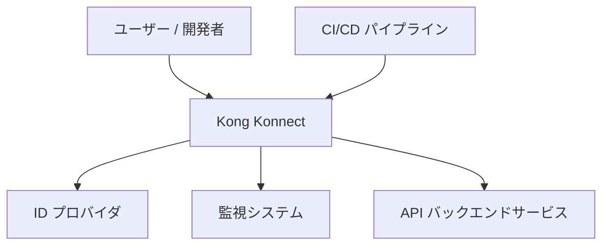
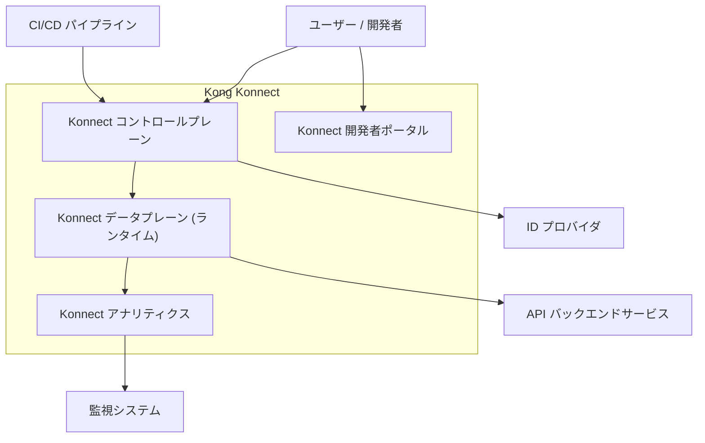
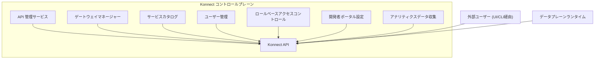
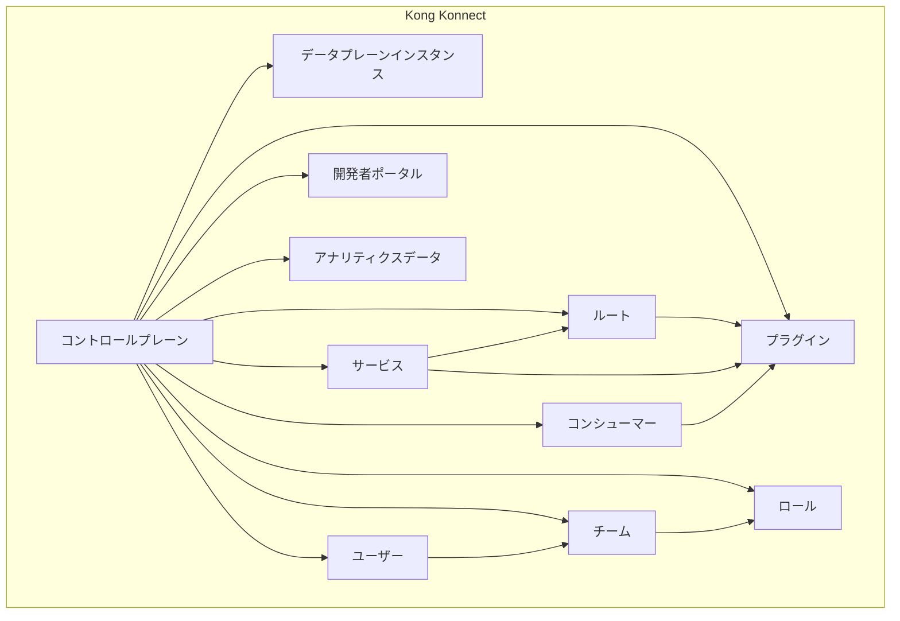

## ■概要

Kong Konnect は、API のライフサイクル全体を管理するためのクラウドネイティブなプラットフォームです。API の設計、テスト、保護、デプロイ、監視、収益化といった機能を提供します。これにより、開発者は複数のクラウド環境やオンプレミス環境にまたがる API を一元的に管理し、運用効率を高めることができます。

利用料も高くないので、先日の「Cloud Runにテナント毎のAPIキー認証を適用するパターン」でお話した、小規模でもテナントAPIをビジネスとして実現する場合 の候補にもなります。

https://zenn.dev/suwash/articles/cloudrun_apikey_20250520

## ■構造

### ●システムコンテキスト図

| 要素名                   | 説明                                                                               |
| ------------------------ | ---------------------------------------------------------------------------------- |
| ユーザー / 開発者        | Kong Konnect プラットフォームを利用して API を管理する人。                         |
| CI/CD パイプライン       | API のデプロイや設定変更を自動化する外部システムです。 (例: Jenkins, GitLab CI)    |
| Kong Konnect             | API のライフサイクル全体を管理する中心的なシステムです。                           |
| ID プロバイダ            | ユーザー認証や認可を管理する外部システムです。 (例: Okta, Azure AD)                |
| 監視システム             | API のメトリクスやログを収集・分析する外部システムです。 (例: Prometheus, Datadog) |
| API バックエンドサービス | Kong Konnect を介して公開される実際の API を提供するサービス群です。               |

### ●コンテナ図

| 要素名                              | 説明                                                                                                            |
| ----------------------------------- | --------------------------------------------------------------------------------------------------------------- |
| ユーザー / 開発者                   | Kong Konnect プラットフォームを利用する主体です。                                                               |
| CI/CD パイプライン                  | コントロールプレーンを通じて API 設定やデータプレーンの構成を自動的にデプロイするシステムです。                 |
| Konnect コントロールプレーン        | API の設定、ポリシー管理、ユーザー管理などを行う中央管理コンポーネントです。クラウドでホストされます。          |
| Konnect データプレーン (ランタイム) | 実際に API トラフィックを処理するコンポーネント群です。顧客の環境 (クラウド、オンプレミス) にデプロイされます。 |
| Konnect アナリティクス              | API のトラフィックデータや利用状況を収集・分析し、可視化するコンポーネントです。                                |
| Konnect 開発者ポータル              | API ドキュメントの公開や開発者登録機能を提供するコンポーネントです。                                            |
| API バックエンドサービス            | データプレーンがリクエストを転送する先のサービスです。                                                          |
| ID プロバイダ                       | コントロールプレーンや開発者ポータルのユーザー認証に利用される外部システムです。                                |
| 監視システム                        | アナリティクスデータを連携したり、データプレーンの稼働状況を監視する外部システムです。                          |

### ●コンポーネント図

ここでは、`Konnect コントロールプレーン` の主要なコンポーネントを例として示します。

| 要素名                           | 説明                                                                                              |
| -------------------------------- | ------------------------------------------------------------------------------------------------- |
| API 管理サービス                 | API、ルート、プラグインなどの設定を管理します。 (例: API Gateway の設定)                          |
| ゲートウェイマネージャー           | データプレーンランタイムの登録、設定同期、状態監視を行います。 (例: ランタイムインスタンスの管理) |
| サービスカタログ                     | API サービスカタログやバージョン管理機能を提供します。 (例: サービスの登録と公開)                 |
| ユーザー管理                     | Konnect プラットフォームのユーザーアカウントを管理します。 (例: 開発者アカウントの作成)           |
| ロールベースアクセスコントロール | ユーザーの権限をロールに基づいて管理します。 (例: 管理者ロール、開発者ロールの設定)               |
| 開発者ポータル設定               | 開発者ポータルの外観、コンテンツ、API ドキュメントの表示設定などを管理します。                    |
| アナリティクスデータ収集         | データプレーンから送信される API トラフィックデータを収集し、アナリティクスシステムに渡します。   |
| Konnect API                      | コントロールプレーンの各機能へアクセスするためのインターフェースを提供します。                    |
| 外部ユーザー (UI/CLI経由)        | Konnect UI や `deck` (CLI ツール) を利用して Konnect API を操作するユーザーです。                 |
| データプレーンランタイム         | コントロールプレーンと通信し、設定情報を受け取り、稼働状況を報告するランタイムです。              |

## ■データ

### ●概念モデル

| 要素名                        | 説明                                                                          |
| ----------------------------- | ----------------------------------------------------------------------------- |
| Kong Konnect プラットフォーム | 全体の管理システムです。                                                      |
| コントロールプレーン          | 設定と管理の中心です。                                                        |
| データプレーンインスタンス    | APIトラフィックを処理するKong Gatewayのランタイムです。                                    |
| サービス                      | 接続するAPIやマイクロサービスを表します。                                     |
| ルート                        | クライアントからのリクエストをサービスにマッピングする方法を定義します。      |
| プラグイン                    | リクエスト/レスポンスのライフサイクルで実行されるポリシーや変換を定義します。 |
| コンシューマー                | API の利用者を表します。                                                      |
| 開発者ポータル                | API ドキュメントやアクセス管理を提供します。                                  |
| アナリティクスデータ          | API の利用状況やパフォーマンスに関するデータです。                            |
| ユーザー                      | Konnect プラットフォームの利用者です。                                        |
| チーム                        | ユーザーをグループ化し、アクセス権限を管理するための単位です。                |
| ロール                        | ユーザーやチームに割り当てる権限の集合です。                                  |

## ■構築方法

Kong Konnect はクラウドサービスとして提供される部分 (コントロールプレーン) と、ユーザー環境にデプロイする部分 (データプレーン) から構成されます。

### ●Konnect アカウントの作成

  - Kong のウェブサイトから Konnect のフリートライアルまたは有料プランにサインアップします。
  - サインアップ後、組織が作成され、Konnect のコントロールプレーンにアクセスできるようになります。

### ●データプレーン (ランタイム) の設定

  - **ゲートウェイマネージャーでランタイムグループを作成:**
      - Konnect UI 上で、データプレーンインスタンスをグループ化するためのランタイムグループを作成します。
  - **データプレーンインスタンスのデプロイ:**
      - サポートされている環境 (Kubernetes, Dedicated Cloud, Serverless など) に Kong Gateway (データプレーン) をデプロイします。
      - デプロイ時には、Konnect コントロールプレーンと通信するための証明書や設定情報が必要になります。これらはランタイムグループ作成時に Konnect UI から提供されます。
      - 例えば
        - Kubernetes であれば Helm チャートを利用してデプロイできます。
        - Dedicated Coloud であれば 画面から、対応するPublic Cloud上にデプロイできます。
        - Serverless であれば、画面から、フルマネージドな環境にデプロイできます。
  - **データプレーンインスタンスの登録:**
      - デプロイされた Kong Gateway インスタンスが起動すると、提供された設定を用いて Konnect コントロールプレーンに接続し、登録されます。
      - 登録されたインスタンスは Konnect UI のゲートウェイマネージャーで確認できます。

### ●初期設定

  - **ユーザーとチームの設定:**
      - 必要に応じて、Konnect にユーザーを招待し、チームを作成して役割に応じた権限 (ロール) を割り当てます。
  - **ID プロバイダの連携 (任意):**
      - Okta や Azure AD などの外部 ID プロバイダと連携して、Konnect へのシングルサインオン (SSO) を設定できます。

## ■利用方法

Kong Konnect は主にウェブベースの UI と CLI (Command Line Interface) ツールである `deck` を通じて利用します。

### ●Konnect UI を利用した API 管理

  - **データプレーンにサービスを紐づけ:**
      - ゲートウェイマネージャーで、Kong Gatewayが接続するサービスのAPI情報を登録します。
  - **ルートの設定:**
      - 公開されたサービスに対して、ホスト名、パス、メソッドなどに基づいてリクエストをルーティングするためのルール (ルート) を設定します。
  - **プラグインの適用:**
      - 認証 (Key Auth, OAuth2)、セキュリティ (Rate Limiting, IP Restriction)、トラフィック制御 (Request Transformer)、ロギング (HTTP Log) などのプラグインをサービスやルートに適用します。
  - **コンシューマーの管理:**
      - API を利用するコンシューマーを登録し、認証情報 (API キーなど) を発行します。
  - **開発者ポータルの設定と公開:**
      - API ドキュメントを整備し、開発者ポータルをカスタマイズして公開します。開発者はポータルを通じて API を発見し、利用申請を行うことができます。
  - **API トラフィックの監視 (Vitals):**
      - API のリクエスト数、エラーレート、レイテンシなどのメトリクスをリアルタイムで監視します。

### ●`deck` (CLI) を利用した設定管理

  - `deck` は Kong Gateway や Kong Konnect の設定を宣言的に管理するためのツールです。
  - **設定のエクスポート (dump):**
      - 現在の Konnect の設定 (サービス、ルート、プラグインなど) を YAML または JSON ファイルとしてエクスポートします。
  - **設定のインポート (sync):**
      - YAML または JSON ファイルに定義された設定を Konnect に適用します。これにより、設定のバージョン管理や CI/CD パイプラインとの連携が容易になります。
  - **差分の確認 (diff):**
      - 現在の Konnect 設定とローカルの YAML/JSON ファイルとの差分を確認できます。

### ●Konnect API の利用

  - Konnect はコントロールプレーンの各機能にアクセスするための REST API を提供しています。
  - これにより、カスタムスクリプトや外部システムからプログラム的に Konnect を操作できます。
  - terraformにも対応しています。

## ■運用

### ●データプレーンの運用と監視

  - **スケーリング:**
      - API トラフィックの増減に応じて、データプレーンインスタンス (Kong Gateway) の数をスケールアップまたはスケールダウンします。Kubernetes などの環境ではオートスケーリング機能を利用できます。
  - **アップグレード:**
      - Kong Gateway の新しいバージョンがリリースされた場合、計画的にアップグレードを実施します。Konnect はランタイムのバージョン管理もサポートします。
  - **ヘルスチェックと監視:**
      - データプレーンインスタンスのヘルスチェックを定期的に行い、正常に稼働していることを確認します。
      - CPU 使用率、メモリ使用量、ネットワークトラフィックなどのシステムメトリクスを監視します。
      - Konnect の Vitals や外部監視システム (Prometheus, Grafana, Datadog など) と連携して API メトリクスを詳細に監視します。

### ●コントロールプレーンの運用

  - Kong Konnect のコントロールプレーンは Kong 社によって管理・運用されるクラウドサービスです。
  - ユーザーはコントロールプレーン自体のインフラ運用を行う必要はありません。
  - Kong 社が可用性、セキュリティ、アップデートなどを管理します。

### ●バックアップとリストア

  - **設定のバックアップ:**
      - `deck dump` コマンドを使用して、定期的に Konnect の設定情報をエクスポートし、安全な場所に保管します。
  - **設定のリストア:**
      - 必要に応じて、バックアップした設定ファイルを `deck sync` コマンドを使用してリストアします。

### ●セキュリティ

  - **アクセス制御:**
      - Konnect のロールベースアクセスコントロール (RBAC) を利用して、ユーザーやチームの権限を適切に管理します。
      - API キーや OAuth トークンなどの認証情報を適切に管理し、定期的にローテーションします。
  - **脆弱性管理:**
      - データプレーンとして利用する Kong Gateway の脆弱性情報を定期的に確認し、必要なパッチを適用します。
  - **監査ログ:**
      - Konnect UI や API を通じた操作の監査ログを確認し、不正なアクセスや操作がないかを監視します。

### ●コスト管理

  - 利用するデータプレーンインスタンスの数や処理するトラフィック量、利用する機能に応じてコストが発生します。
  - 定期的に利用状況を確認し、不要なリソースがないか見直します。

## ■参考リンク

### 概要

  - [Kong Konnect | Cloud Native API Management Platform](https://konghq.com/products/kong-konnect)
  - [What is Kong Konnect? | Kong Docs](https://docs.konghq.com/konnect/)

### 構造

  - [Konnect Architecture | Kong Docs](https://docs.konghq.com/konnect/architecture/)
  - [Control Plane Groups | Kong Docs](https://docs.konghq.com/konnect/gateway-manager/control-plane-groups/)
  - [The Konnect Service Catalog
](https://docs.konghq.com/konnect/service-catalog/)

### 情報

  - [Konnect Control Plane API Reference](https://docs.konghq.com/konnect/api/control-planes/latest/)

### 構築方法

  - [Get Started with Kong Konnect | Kong Docs](https://docs.konghq.com/konnect/getting-started/)
  - [Installation Options | Kong Docs](https://docs.konghq.com/gateway/latest/install/)
  - [About Gateway Manager | Kong Docs](https://docs.konghq.com/konnect/gateway-manager/)

### 利用方法

  - [Learning Center](hhttps://konghq.com/blog/learning-center)
  - [Dev Portal Overview | Kong Docs](https://docs.konghq.com/konnect/dev-portal/)
  - [Konnect Advanced Analytics | Kong Docs](https://docs.konghq.com/konnect/analytics/)
  - [decK | Kong Docs](https://docs.konghq.com/deck/latest/)

### 運用

  - [About Gateway Manager | Kong Docs](https://docs.konghq.com/konnect/gateway-manager/)
  - [Backup and restore | Kong Docs](https://docs.konghq.com/gateway/latest/upgrade/backup-and-restore/)

この記事が少しでも参考になった、あるいは改善点などがあれば、ぜひリアクションやコメント、SNSでのシェアをいただけると励みになります！
