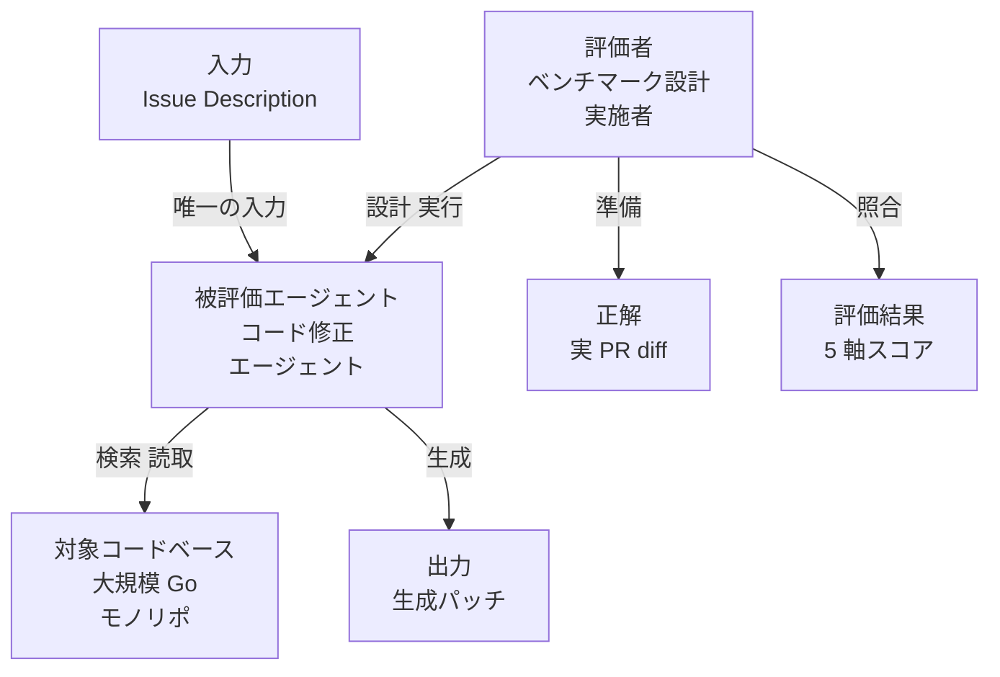
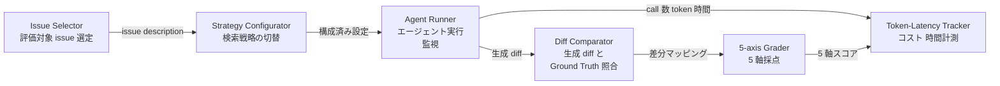
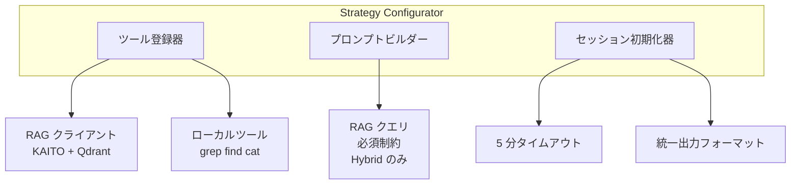
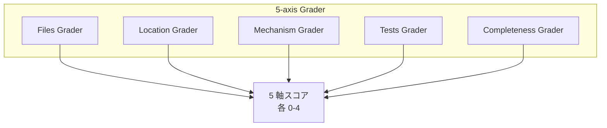
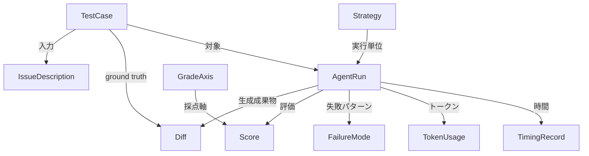
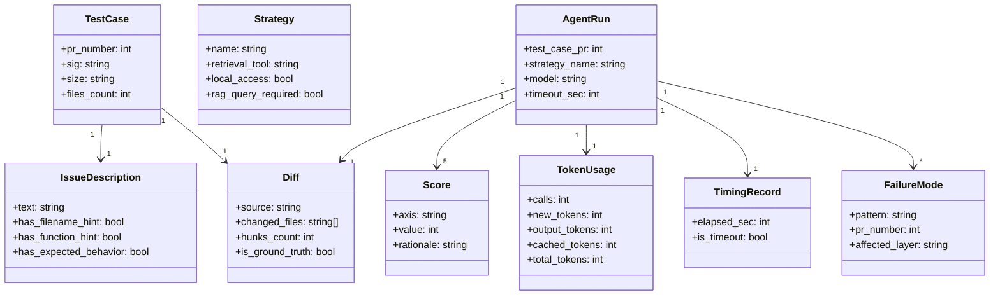

## 概要

CNCF Blog (2026-05-08, Brandon Foley) は、Kubernetes リポジトリの実 in-flight PR 9 件を対象に、AI コード修正エージェントの検索戦略 3 種を比較したベンチマークを報告しています。3 戦略は次のとおりです。

- **RAG only**: KAITO RAG Engine + Qdrant による BM25 + dense embedding ハイブリッド検索
- **Hybrid**: RAG とローカルクローン (grep / find / cat) の併用
- **Local only**: ローカルクローンのみ

エージェントには issue description だけを入力します。PR description や diff は渡しません。生成された diff を実 PR diff と比較し、Files / Location / Mechanism / Tests / Completeness の 5 軸 (各 0–4 点) で採点します。

主な結論は次の 3 点です。

1. CNCF 記事は数値化された最終スコア表を掲載しておらず、検索戦略の違いより scope discovery と systemic reasoning の失敗が目立ったと述べています。明確に差がついたのは処理時間とトークン消費です。RAG が最速 1m16s、Hybrid が最遅 2m25s で、call count がコストを支配します。
2. 最大の失敗モードは検索精度ではなく scope discovery と systemic reasoning です。正しいファイルを見つけても、複数ファイルにまたがる変更の伝播や、既存抽象の再利用ができません。
3. issue の記述品質がツール差を吸収します。ファイル名や関数名を明示した issue では、3 戦略すべてが高スコアに収束しました。

本稿は、この方法論を C4 model と概念モデルで構造化し、再現実装案・運用ベストプラクティス・トラブルシューティングまでを統合します。

## 特徴

CNCF ベンチマークの特徴を一覧で整理します。

- **CNCF 5 軸採点**: スカラー resolve-rate ではなく、5 次元 (Files / Location / Mechanism / Tests / Completeness) で失敗を分析可能
- **issue-only 入力**: PR description・diff は除外し、解答リークを排除した実験設計
- **Claude Opus 4.6 固定**: 3 戦略すべて同一モデル・同一タイムアウト (5 分)
- **KAITO RAG 構成**: BM25 + dense embedding ハイブリッド retrieval、Qdrant をベクターストアとし、KAITO が自動インクリメンタルインデックスを提供
- **n=9 の統計的制約**: Type II error リスクが大きく「差を検出できなかった」と読むべき
- **call count がコスト主因**: Claude API は stateless で毎回フルコンテキストを replay
- **Hybrid の RAG 必須化**: issue にファイル名があると RAG をスキップする現象への対策
- **open / in-flight PR を ground truth に採用**: SWE-bench の merged PR ベースと対照的
- **Kubernetes 固有の難度**: Go の structural typing・staging 分割・codegen・GA API 互換規約
- **実行基盤は OpenClaw**: 完全 isolated subagent で 27 セッション (3 戦略 × 9 PR) を独立実行

## 構造

ベンチマーク方法論を C4 model に読み替えて整理します。

### システムコンテキスト図



| 要素名 | 説明 |
|---|---|
| 評価者 | ベンチマーク全体の設計・実施・採点主体 |
| 被評価エージェント | 検索戦略を切り替えてコード修正を試みる主体 |
| Issue Description | エージェントへの唯一の入力 |
| 対象コードベース | エージェントが検索・参照する大規模リポジトリ |
| 生成パッチ | エージェントが出力するコード変更 |
| 正解 | 人間レビューで収束した実 PR diff |
| 5 軸スコア | Files / Location / Mechanism / Tests / Completeness の各 0–4 点 |

### コンテナ図



| コンテナ名 | 説明 |
|---|---|
| Issue Selector | 評価 issue 選定と入力テキスト抽出 |
| Strategy Configurator | 戦略ごとのツールセットとプロンプト制約設定 |
| Agent Runner | 隔離環境でのエージェント実行とタイムアウト管理 |
| Diff Comparator | 生成 diff と Ground Truth の比較 |
| 5-axis Grader | 5 軸採点の実施 |
| Token-Latency Tracker | 呼び出し回数・トークン・経過時間の記録 |

### コンポーネント図

代表的なコンテナとして Strategy Configurator と 5-axis Grader をドリルダウンします。



| コンポーネント | 説明 |
|---|---|
| ツール登録器 | 戦略ごとに利用ツールを有効化・無効化 |
| RAG クライアント | KAITO 経由で Qdrant に問い合わせ、BM25 と dense embedding の結果を統合・ランキング (RRF の具体的採用は CNCF 本文未記載、Qdrant 標準実装は RRF を提供) |
| ローカルツール | フルクローンに対する直接ファイルシステム探索 |
| プロンプトビルダー | Hybrid 戦略で RAG 先行を強制 |
| セッション初期化器 | タイムアウトと出力フォーマットの統一 |



| 軸 | 評価対象 | 失敗例 |
|---|---|---|
| Files | 正しいファイルを変更しているか | PR #138000: core bug は当たり、proxier.go を見落とし |
| Location | 正しい関数・レイヤーで変更を加えているか | PR #134540: caller 更新を忘れる |
| Mechanism | system レベルの不変条件・layering 規約の保持 (人手評価が主) | PR #134540: `%w` を保持せず error を source で吸収 |
| Tests | 既存テスト更新または新規テスト追加の適切さ | PR #138191: 既存テストを更新せず新規フィールド追加 |
| Completeness | 必要な全 call site への変更の伝播 | PR #138191: RAG only が sort 実装 1 箇所だけ修正 |

## データ

### 概念モデル



| エンティティ | 説明 |
|---|---|
| TestCase | 評価単位、Kubernetes の open PR 1 件に対応 |
| IssueDescription | エージェントへの唯一の入力 |
| Strategy | 検索戦略の定義 |
| AgentRun | TestCase と Strategy の組み合わせ 1 実行セッション |
| Diff | エージェント生成パッチまたは ground truth |
| GradeAxis | 採点軸 |
| Score | 1 つの GradeAxis に対する 0–4 整数スコア |
| FailureMode | 観測された失敗パターン |
| TokenUsage | トークン消費内訳 |
| TimingRecord | 実行時間秒 |

### 情報モデル



CNCF 記事明記の平均値を以下に示します。

| Strategy | Calls | New | Output | Cached | Total | Elapsed |
|---|---|---|---|---|---|---|
| RAG | 4 | 44k | 2k | 141k | 187k | 1m16s |
| Hybrid | 8 | 27k | 3k | 234k | 264k | 2m25s |
| Local | 6 | 23k | 4k | 162k | 189k | 2m24s |

## 構築方法

CNCF 記事には完全な再現コードがありません。以下は論文の意図を反映した実装案です。補完元は KAITO RAG 公式ドキュメントと Qdrant 公式チュートリアルです。

### KAITO RAGEngine のセットアップ

```yaml
# 実装案: RAGEngine CRD の設定例
apiVersion: kaito.sh/v1alpha1
kind: RAGEngine
metadata:
  name: kubernetes-rag-index
  namespace: kaito-system
spec:
  embedding:
    local:
      modelID: "BAAI/bge-small-en-v1.5"
  inferenceService:
    url: "https://api.anthropic.com/v1/messages"
  storage:
    vectorDB:
      type: qdrant
      url: "http://qdrant.kaito-system.svc.cluster.local:6333"
      collectionName: "kubernetes-codebase"
  dataSource:
    git:
      url: "https://github.com/kubernetes/kubernetes"
      branch: "master"
      contextWindowSize: 512
```

### Qdrant Hybrid Search の動作確認

```python
# 実装案: BM25 sparse と dense と RRF の統合
from qdrant_client import QdrantClient
from qdrant_client.models import SparseVector

client = QdrantClient(host="localhost", port=6333)
results = client.query_points(
    collection_name="kubernetes-codebase",
    prefetch=[
        {"query": [0.2, 0.1, 0.3], "using": "dense", "limit": 20},
        {"query": SparseVector(indices=[1, 5, 22], values=[0.1, 0.4, 0.3]),
         "using": "bm25", "limit": 20},
    ],
    query={"fusion": "rrf"},
    limit=10,
)
```

### Kubernetes リポジトリのクローン

```bash
git clone --depth=1 https://github.com/kubernetes/kubernetes.git /workdir/kubernetes
cd /workdir/kubernetes
find . -name "zz_generated_*.go" | wc -l
```

### issue 抽出スクリプト

```python
# 実装案: open PR の issue description のみ抽出 (PR description は除外)
import subprocess, json

TARGET_PRS = [134540, 138211, 138244, 136013, 138269, 138158, 135970, 138000, 138191]
REPO = "kubernetes/kubernetes"

def extract_issue_description(pr_number: int) -> dict:
    result = subprocess.run(
        ["gh", "pr", "view", str(pr_number), "--repo", REPO,
         "--json", "number,title,body,closingIssuesReferences"],
        capture_output=True, text=True
    )
    pr_data = json.loads(result.stdout)
    issues = []
    for issue_ref in pr_data.get("closingIssuesReferences", []):
        issue_num = issue_ref["number"]
        issue_result = subprocess.run(
            ["gh", "issue", "view", str(issue_num), "--repo", REPO,
             "--json", "number,title,body"],
            capture_output=True, text=True
        )
        issues.append(json.loads(issue_result.stdout))
    return {"pr_number": pr_number, "issue_descriptions": issues}
```

### PR diff の取得

```bash
REPO="kubernetes/kubernetes"
PLIST=(134540 138211 138244 136013 138269 138158 135970 138000 138191)
mkdir -p ground_truth
for PR in "${PLIST[@]}"; do
    gh pr diff "${PR}" --repo "${REPO}" > "ground_truth/pr_${PR}.diff"
done
```

### 評価環境の isolation

```yaml
# 実装案: OpenClaw の isolated session 設定
agents:
  rag-only:
    model: claude-opus-4-6
    timeout: 300
    tools:
      - type: kaito_rag
        endpoint: "http://qdrant.kaito-system.svc.cluster.local"
        collection: "kubernetes-codebase"
    local_access: false
  hybrid:
    model: claude-opus-4-6
    timeout: 300
    tools:
      - type: kaito_rag
      - type: local_fs
        allowed_commands: ["cat", "find", "grep"]
    system_prompt_suffix: |
      Before generating any fix, you MUST issue at least one RAG query.
  local-only:
    model: claude-opus-4-6
    timeout: 300
    tools:
      - type: local_fs
        allowed_commands: ["cat", "find", "grep"]
```

## 利用方法

### 27 セッションの起動

```bash
STRATEGIES=("rag-only" "hybrid" "local-only")
PLIST=(134540 138211 138244 136013 138269 138158 135970 138000 138191)
RESULTS_DIR="results/$(date +%Y%m%d_%H%M%S)"
mkdir -p "${RESULTS_DIR}"

for STRATEGY in "${STRATEGIES[@]}"; do
    for PR in "${PLIST[@]}"; do
        START=$(date +%s)
        openclaw run \
            --agent "${STRATEGY}" \
            --input "benchmark_cases/${PR}_issue.txt" \
            --output "${RESULTS_DIR}/${STRATEGY}_${PR}.patch" \
            --log "${RESULTS_DIR}/${STRATEGY}_${PR}.log" \
            --timeout 300
        echo "${STRATEGY},${PR},$(($(date +%s) - START))" >> "${RESULTS_DIR}/timing.csv"
        sleep 2
    done
done
```

### エージェントへのプロンプト生成

```python
def build_agent_prompt(issue_text: str, strategy: str) -> str:
    base = f"""You are a Go engineer familiar with the Kubernetes codebase.
A bug has been reported in the Kubernetes repository. Using only the issue
description below, produce a unified diff patch that fixes the bug.

RULES:
- Output only a unified diff
- Do NOT add explanatory text outside the diff block
- Fix must be complete: propagate changes to all affected call sites

ISSUE DESCRIPTION:
{issue_text}
"""
    if strategy == "hybrid":
        base += "\nIMPORTANT: You MUST run at least one RAG query before generating the fix.\n"
    return base
```

### 5 軸採点の自動化部分

```python
def score_files_axis(agent_patch: str, gt_diff: str) -> int:
    def extract_files(diff: str) -> set:
        return {line[6:].strip() for line in diff.split("\n") if line.startswith("+++ b/")}
    agent_files = extract_files(agent_patch)
    gt_files = extract_files(gt_diff)
    if not gt_files:
        return 0
    overlap = len(agent_files & gt_files) / len(gt_files)
    return min(4, int(overlap * 4))

def score_completeness_axis(agent_patch: str, gt_diff: str) -> int:
    agent_hunks = agent_patch.count("\n@@")
    gt_hunks = gt_diff.count("\n@@")
    if gt_hunks == 0:
        return 0
    return min(4, int(min(1.0, agent_hunks / gt_hunks) * 4))
```

Mechanism 軸と Location 軸は Kubernetes contributor による人手評価が必要です。採点シートを PR ごとに生成し、2 名以上で採点します。Cohen's κ 0.7 以上を担保します。

## 運用

### PR セットの更新戦略

CNCF ベンチマークの 9 PR は 2026 年 4 月時点の snapshot です。定期的な差し替えが必要です。

| 更新タイミング | 基準 |
|---|---|
| 四半期更新 | sig/storage・node・scheduling・network・apps から各 2 件以上 |
| モデル更新時 | 旧 PR セットで再実行して回帰比較 |
| n 拡大時 | 既存 9 件を保持して追加、後方互換のある積み上げ方式 |

PR 抽選条件として、issue description が 150 字以上、ファイル名・関数名の明示「あり / なし」両パターンの混在を意図的に保ちます。issue quality 偏りがスコア差を吸収するためです。

### 結果の保存形式

```
results/
  YYYYMMDD_<model>_<strategy>/
    raw_scores.json
    timing.json
    failure_log.md
    summary.md
```

### CI への組み込み — コスト試算

| 実行単位 | 所要時間 | token 消費 |
|---|---|---|
| 1 PR × 1 戦略 | 1〜2.5 分 | 187k〜264k |
| 9 PR × 3 戦略 | 27〜67 分 | 5M〜7M |
| 30 PR × 3 戦略 | 90〜225 分 | 16M〜24M |

CI 化の制約として、PR あたり 5 分タイムアウト固定、並列 3 以下 (rate limit 対策)、失敗 PR は failure_log.md に記録して継続、index 再利用で週次実行コスト削減を採用します。

### n=9 の限界対応

n=9 は 3〜4 件で 5 軸合計 10pt 動きます。本稿の解釈として「差がない」は「この n では検出できなかった」と同義です (CNCF 記事自体は検定を実施していません)。

n を増やす前に以下の上限分析を実施します。

1. **oracle retrieval 実験**: 正解ファイルパスを事前付与し、L1 (Discovery) を完璧化したときのスコア上限を測定
2. **issue quality 層別分析**: ファイル名明示の有無で PR 群を分けてスコア比較
3. **レイヤー別スコア分解**: 5 軸を L1–L4 に対応付け、どのレイヤーで差が出ているか確認

## ベストプラクティス

CNCF の結論と反証エビデンスを「誤解 → 反証 → 推奨」構造で統合します。

### Issue quality を整える

- **誤解**: 検索戦略さえ良ければ、issue が雑でもエージェントが補完する
- **反証**: CNCF PR #136013 / #138269 ではファイル名・関数名・期待挙動を明示しており、3 戦略すべてが高スコアに収束した。ツール差を吸収したのは issue quality
- **推奨**: issue template に「影響範囲のヒント (任意)」欄を設ける。LLM で issue を自動リライトして明示度スコアを付与する案も検討

### RAG クエリを必須化する (Hybrid)

- **誤解**: Hybrid は RAG と Local の片方が使われれば十分
- **反証**: issue にファイル名が含まれると RAG をスキップして Local 直行する現象が観測された
- **推奨**: システムプロンプトで RAG クエリの先行実行を明示的に強制する

### Skill の継続メンテコストを織り込む

- **誤解**: repo playbook を一度作れば、retrieval 改善より安く L3 (Mechanism reasoning) を改善できる
- **反証**: layering 規約破壊・既存抽象 reuse 失敗・GA API 互換規約見落としは、Kubernetes 固有かつ進化し続けるルール。CNCF 自身が「playbook の継続メンテコストが retrieval 改善より低いか」を未解決の問いとして残す
- **推奨**: 採用前に以下のコストを見積もる

| 手段 | 初期コスト | 継続コスト |
|---|---|---|
| retrieval index 改善 | 中 | 低 (インデックス自動更新) |
| AST/LSP-aware retrieval 追加 | 高 | 中 |
| repo playbook 作成 | 中 | 高 (Kubernetes 変更に追従必要) |
| human review ステップ追加 | 低 | 高 (レビュアー依存) |

### 4 レイヤー分離評価を徹底する

- **誤解**: resolve rate (5 軸合計) が上がれば改善が進んでいる
- **反証**: OrcaLoca は function-level localization match 65.33% に対し resolve 向上が +6.33pt にとどまることを定量化。L1 改善が L2–L4 の成功を保証しない。Agentless は localization / repair / patch validation の 3 フェーズ構成で SWE-bench Lite 32.00% を達成 (agent を使わない構成)
- **推奨**: CNCF 5 軸を 4 レイヤーに対応付けてレイヤー別に改善を管理

| Layer | CNCF 5 軸 | 改善手段 | 担当 |
|---|---|---|---|
| L1 Discovery | Files | retrieval index 改善 / BM25+dense チューニング | retrieval engineer |
| L2 Scope inference | Completeness | call graph 解析 / LSP 統合 / 影響範囲 LLM | platform engineer |
| L3 Mechanism reasoning | Location, Mechanism | repo playbook / human review / architectural constraint | domain expert |
| L4 Verification | Tests | test runner ループ / mutation testing | QA engineer |

レイヤーをまたがる施策は効果の帰属が不明確になります。1 施策 = 1 レイヤー改善を原則とします。

## トラブルシューティング

### Hybrid が RAG をスキップする

- **症状**: Hybrid の実行ログで RAG 呼び出しが 0 件、call 数が Local only と同程度
- **原因**: issue にファイル名が含まれるとエージェントが「場所がわかっている」と判断して RAG をスキップ。stateless API のためシステムプロンプトだけが頼り
- **対処**: RAG 必須化をシステムプロンプトに明示、実行後ログで `rag_call_count == 0` の PR を再実行、ファイル名マスクした難化版 issue で原因記述を特定

### call count が爆発する

- **症状**: Hybrid の call 数が 20 回以上、トークン消費が 500k を超える
- **原因**: stateless API でフルコンテキストを毎回 replay、RAG 結果と Local 内容両方が積み上がる正のフィードバック
- **対処**: call 数上限をシステムプロンプトで明示 (`at most 10 tool calls`)、RAG 結果のトークン数に上限、曖昧 issue は絞り込み質問のプリフライト挿入、RAG 結果のコンテキスト圧縮

### issue が曖昧で 3 戦略が収束しない

- **症状**: 3 戦略のスコアが 5 軸合計で 10pt 以上乖離、partial credit が各戦略で異なり採点解釈が揺れる
- **原因**: issue が L1 結果を戦略間で大きく分散させる。RAG は semantic similarity で別ファイル、Local は grep パターンで別ファイル、Hybrid は両方拾って scope が広がりすぎる
- **対処**: 「quality 低」フラグ付けして層別分析、issue enrichment (LLM でファイルパス候補付与) を実験、3 戦略の Files 軸重複率を「issue quality 指標」として蓄積

### n=9 で差が検出できない

- **症状**: 3 戦略の平均スコア差が 2pt 以内に収まる (仮に検定を行っても有意差が出ない領域)
- **原因**: Type II error。n=9 は中程度〜大きな効果サイズでも検出力が不足し、「差がない」と断定できる条件にない
- **対処**: 差検出を目的とするなら n を 30 以上に増やす。n を増やす前に oracle retrieval で上限スコアを測定する (SWE-bench arXiv 2310.06770 でも Claude 2 が 1.96% に対し oracle retrieval 条件で 4.8% という上限差が報告されている)。「差がない」は「この条件では検出できなかった」と限定する。時間・コスト差は n=9 でも検出可能なので「品質差は検出不能だが効率差は明確」と限定的に結論する

### ground truth の解釈が揺れる

- **症状**: 採点者によって同一エージェント出力に 1〜2pt のずれ、Mechanism / Completeness で基準が曖昧
- **原因**: in-flight PR は iterative review の結果で「正解」は review 時点の最善であって唯一解ではない。Mechanism 軸 (layering / 既存抽象 reuse) は Kubernetes 暗黙知に依存
- **対処**: PR ごとの採点ルーブリックを事前文書化、Mechanism / Completeness は 2 名以上で採点 (Cohen's κ 0.7 未満なら再協議)、in-flight PR の diff snapshot を採点時点で固定、partial credit 基準をガイドラインに明記

## まとめ

CNCF Blog (2026-05-08) は、Kubernetes 実 PR 9 件で AI コード修正エージェントの検索戦略 (RAG / Hybrid / Local) を 5 軸採点した結果、最終スコア差は検出できず、ボトルネックが scope discovery と systemic reasoning にあると示しました。本稿はこの方法論を C4 model と概念モデルで構造化し、Files / Location / Mechanism / Tests / Completeness を L1–L4 の 4 レイヤーに対応付けて、検索戦略改善と systemic 修正能力強化を別レイヤーで管理する運用を提案します。

この記事が少しでも参考になった、あるいは改善点などがあれば、ぜひリアクションやコメント、SNS でのシェアをいただけると励みになります!

## 参考リンク

- 公式ドキュメント
    - [KAITO RAG Engine docs](https://kaito-project.github.io/kaito/docs/rag)
    - [Qdrant Hybrid Search Tutorial](https://qdrant.tech/documentation/tutorials-search-engineering/reranking-hybrid-search/)
- GitHub
    - [KAITO リポジトリ](https://github.com/kaito-project/kaito)
    - [OpenClaw](https://github.com/openclaw/openclaw)
    - [kubernetes/kubernetes](https://github.com/kubernetes/kubernetes)
- 記事
    - [CNCF Blog: Benchmarking AI Agent Retrieval Strategies on Kubernetes Bug Fixes](https://www.cncf.io/blog/2026/05/08/benchmarking-ai-agent-retrieval-strategies-on-kubernetes-bug-fixes/)
    - [SWE-bench (arXiv:2310.06770)](https://arxiv.org/abs/2310.06770)
    - [SWE-bench Multimodal (arXiv:2410.03859)](https://arxiv.org/abs/2410.03859)
    - [Multi-SWE-bench (arXiv:2504.02605)](https://arxiv.org/abs/2504.02605)
    - [Agentless (arXiv:2407.01489)](https://arxiv.org/abs/2407.01489)
    - [AutoCodeRover (arXiv:2404.05427)](https://arxiv.org/abs/2404.05427)
    - [MASAI (arXiv:2406.11638)](https://arxiv.org/abs/2406.11638)
    - [OrcaLoca (arXiv:2502.00350)](https://arxiv.org/abs/2502.00350)
    - [SweRank (arXiv:2505.07849)](https://arxiv.org/abs/2505.07849)
    - [Lost in the Middle (arXiv:2307.03172)](https://arxiv.org/abs/2307.03172)
