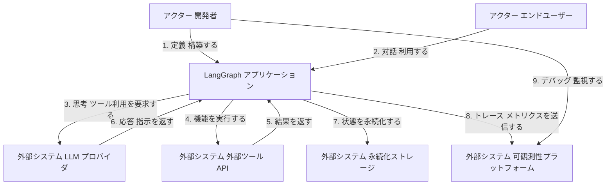
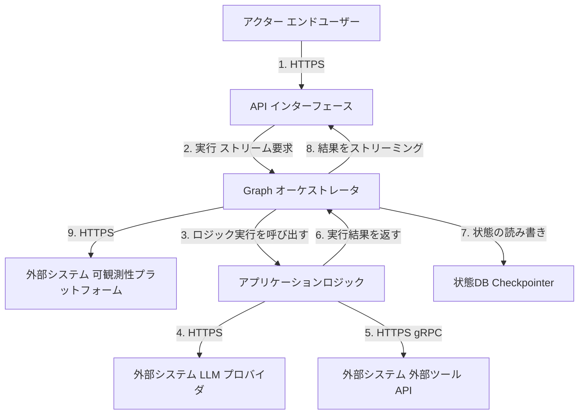
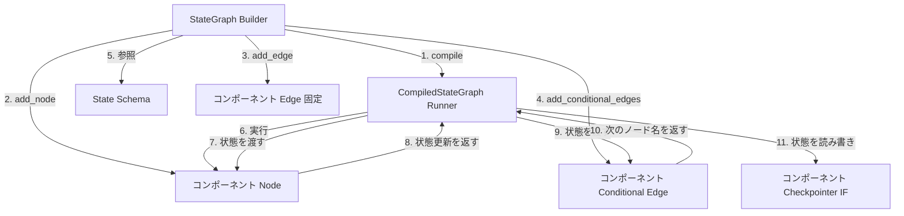
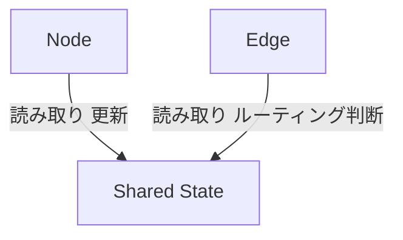
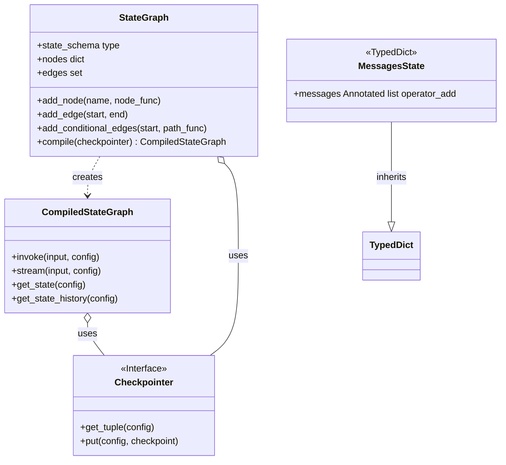

## ■概要

LangGraphは、ステートフルなAIエージェントやマルチエージェントアプリケーションの構築を支援するライブラリです。LangChainのコアライブラリ上で動作します。

従来のLangChainは、タスクが一方向に進むDAGワークフローに特化していました。自律的なエージェントは、計画、行動、評価、修正といったループ処理を必要とします。LangGraphは、周回可能なグラフ構造により、このループ処理を実現します。

開発者は、ツール呼出、結果判断、再実行といった複雑な制御フローを明示的に定義できます。LangGraphは、低レベルなオーケストレーションフレームワークとして機能します。開発者は、エージェントの内部動作ロジックを詳細に制御できます。


## ■特徴

LangGraphは、複雑なエージェントシステムを実現する以下の主要な機能を備えます。

  * **周回可能なグラフ**
    ループを含むグラフ構築。自律的な再試行や修正動作の定義。
  * **状態の永続化**
    実行状態の保存と復元。サーバ再起動後の継続実行や履歴追跡。
  * **ヒューマン・イン・ザ・ループ**
    任意ノードでの一時停止と人間による介入。実行前確認や品質管理。
  * **包括的なメモリ管理**
    グラフ全体で共有する状態管理。短期記憶と長期記憶の実現。
  * **ストリーミング**
    途中結果のリアルタイム取得。思考プロセスの逐次表示。
  * **高度なデバッグと可観測性**
    LangSmithとの統合。実行パスや状態遷移の視覚的追跡。
  * **時間旅行**
    過去の特定ステップへの状態巻き戻し。

これらの機能は、エージェントの制御性と信頼性を高めるために連携します。ヒューマンインザループは一時停止を必要とします。安全な一時停止には永続化が不可欠です。永続化された履歴は時間旅行を実現します。


## ■構造

C4モデルを用いて、LangGraphアプリケーションの構造を段階的に示します。

### ●システムコンテキスト

LangGraphアプリケーションと、関連するアクターおよび外部システムとの関係を示します。



| 要素名 | 説明 |
| :--- | :--- |
| アクター 開発者 | エージェントのロジック定義、システムの構築とデプロイ。 |
| アクター エンドユーザー | アプリケーションとの対話、タスク依頼。 |
| LangGraph アプリケーション | LangGraph上で動作するステートフルなオーケストレータ。 |
| 外部システム LLM プロバイダ | エージェントの思考を担当する中核。 |
| 外部システム 外部ツール API | 現実世界のデータ取得やアクション実行のためのインターフェース。 |
| 外部システム 永続化ストレージ | 実行状態を保存するデータベース。 |
| 外部システム 可観測性プラットフォーム | 実行フローのトレースとデバッグ（主にLangSmith）。 |

### ●コンテナ

LangGraphアプリケーションを構成する実行単位を示します。



| 要素名 | 説明 |
| :--- | :--- |
| API インターフェース | HTTPリクエストを受け付け、グラフ実行をトリガーするエントリーポイント。 |
| Graph オーケストレータ | LangGraphランタイムを実行するプロセス。状態管理、ノード呼出、永続化を担当。 |
| アプリケーションロジック | 具体的なビジネスロジック。LLMコールやツール実行を含む。 |
| 状態DB Checkpointer | グラフの実行状態を永続化するデータストア。 |

### ●コンポーネント

Graphオーケストレータ内部の主要コンポーネントを示します。



| 要素名 | 説明 |
| :--- | :--- |
| StateGraph Builder | グラフ定義用のビルダークラス。 |
| CompiledStateGraph Runner | コンパイル済みの実行時ランタイムクラス。 |
| State Schema | グラフ全体で共有されるデータ構造定義。 |
| Node | 処理を実行し、状態更新を返すPython関数。 |
| Edge 固定 | ノード間の固定的な遷移定義。 |
| Conditional Edge | 状態に基づき次のノードを動的に決定するPython関数。 |
| Checkpointer IF | 永続化処理のためのインターフェース。 |


## ■データ

LangGraphは「State（状態）」を中心的なデータとして扱います。

### ●概念モデル

すべてのコンポーネントが単一の共有状態にアクセスします。



| 要素名 | 説明 |
| :--- | :--- |
| Shared State | グラフの現在状態を保持する共有データ構造。 |
| Node | Stateを読み取り、処理を実行し、更新差分を返すコンポーネント。 |
| Edge | Stateを読み取り、次に実行するNodeを決定するコンポーネント。 |

### ●情報モデル

具体的なクラス構造を示します。



| 要素名 | 説明 |
| :--- | :--- |
| StateGraph | グラフ構築用のビルダークラス。 |
| CompiledStateGraph | 実行可能なランタイムクラス。 |
| Checkpointer | 永続化インターフェース。 |
| MessagesState | メッセージ追記用のリデューサを含むStateスキーマ例。 |


## ■構築方法

LangGraphアプリケーションの構築手順を示します。

### ●1\. 環境構築

必要なパッケージをインストールします。

```bash
pip install -U langgraph langchain_openai
```

### ●2\. 状態スキーマの定義

共有データ構造を定義します。`Annotated`と`operator.add`でリストへの追記を指定します。

```python
from typing import Annotated, TypedDict
import operator
from langchain_core.messages import AnyMessage

class AgentState(TypedDict):
    messages: Annotated[list[AnyMessage], operator.add]
```

### ●3\. ノードの定義

各ステップの処理を関数として定義します。状態を受け取り、更新差分を返します。

```python
from langchain_openai import ChatOpenAI

model = ChatOpenAI(temperature=0)

def call_llm(state: AgentState):
    messages = state['messages']
    response = model.invoke(messages)
    return {"messages": [response]}
```

### ●4\. グラフの定義とコンパイル

ノードとエッジを追加し、アプリケーションをコンパイルします。

```python
from langgraph.graph import StateGraph, END

builder = StateGraph(AgentState)
builder.add_node("llm_call", call_llm)
builder.set_entry_point("llm_call")
builder.add_edge("llm_call", END)

app = builder.compile()
```


## ■利用方法

構築したアプリケーションの実行方法を示します。

### ●同期実行

最終状態を一度に取得します。

```python
initial_state = {"messages": [HumanMessage(content="Hello")]}
final_state = app.invoke(initial_state)
```

### ●ストリーミング実行

中間状態をリアルタイムに取得します。

```python
for step in app.stream(initial_state, stream_mode="values"):
    print(step['messages'][-1])
```

### ●永続化と履歴管理

`Checkpointer`を使用し、スレッドIDで状態を管理します。

```python
from langgraph.checkpoint.memory import InMemorySaver

memory = InMemorySaver()
app_with_memory = builder.compile(checkpointer=memory)

config = {"configurable": {"thread_id": "session_1"}}
app_with_memory.invoke(initial_state, config=config)
```


## ■運用

### ●デバッグと可観測性

LangSmithで実行トレースを取得します。環境変数を設定します。

```bash
export LANGSMITH_TRACING="true"
export LANGSMITH_API_KEY="YOUR_KEY"
```

### ●デプロイ

LangServeでAPIサーバーとして公開します。

```python
from langserve import add_routes
from fastapi import FastAPI

server = FastAPI()
add_routes(server, app, path="/agent")
```

### ●永続化バックエンドの変更

本番環境では、インメモリから外部データベース（Postgresなど）へCheckpointerを切り替えます。

```python
# PostgresSaver.from_conn_string(conn_str) などを利用
app_prod = builder.compile(checkpointer=postgres_checkpointer)
```

## ■まとめ

LangGraphは、LLMアプリケーション開発において、単純なチェーンから高度で自律的なエージェントへとステップアップするための重要な基盤技術です。

循環的なワークフロー、堅牢な状態管理、そして永続化の仕組みは、実用的なAIアシスタントを構築する上で避けては通れない課題を解決します。学習コストは多少かかりますが、複雑なビジネスロジックをLLMに実行させる場合には、その制御性と信頼性が大きなメリットをもたらすでしょう。

まずは本記事のサンプルから、ステートフルなエージェントの挙動を体験してみてください。

この記事が少しでも参考になった、あるいは改善点などがあれば、リアクションやコメント、SNSでのシェアをいただけると励みになります！

-----

## ■参考リンク

### ●公式ドキュメント

  - [LangGraph Overview](https://docs.langchain.com/oss/python/langgraph/overview)
  - [LangGraph Graph API](https://docs.langchain.com/oss/python/langgraph/graph-api)
  - [LangGraph Persistence](https://docs.langchain.com/oss/python/langgraph/persistence)
  - [LangGraph Quickstart](https://docs.langchain.com/oss/python/langgraph/quickstart)
  - [Trace with LangGraph](https://docs.langchain.com/langsmith/trace-with-langgraph)
  - [LangChain Reference: Graphs](https://reference.langchain.com/python/langgraph/graphs/)
  - [LangGraph (LangChain.com)](https://www.langchain.com/langgraph)
  - [Introducing LangServe](https://blog.langchain.com/introducing-langserve/)
  - [LangGraph: Graphs (baihezi mirror)](https://www.baihezi.com/mirrors/langgraph/reference/graphs/index.html)
  - [LangGraph: Persistence (baihezi mirror)](https://www.baihezi.com/mirrors/langgraph/how-tos/persistence/index.html)
  - [LangGraph: Pydantic Base Model as State (baihezi mirror)](https://www.baihezi.com/mirrors/langgraph/how-tos/state-model/index.html)

### ●GitHub

  - [langchain-ai/langgraph](https://github.com/langchain-ai/langgraph)
  - [langchain-ai/langchain](https://github.com/langchain-ai/langchain)
  - [langchain-ai/langgraph-example](https://github.com/langchain-ai/langgraph-example)
  - [Deploy multi agent using Langserve (Discussion)](https://github.com/langchain-ai/langgraph/discussions/2026)

### ●記事

  - [Building AI agent systems with LangGraph (Medium)](https://medium.com/pythoneers/building-ai-agent-systems-with-langgraph-9d85537a6326)
  - [LangGraphとは (TECH BLOG)](https://blog.elcamy.com/posts/136913a3/)
  - [Mastering Persistence in LangGraph (Medium)](https://medium.com/@vinodkrane/mastering-persistence-in-langgraph-checkpoints-threads-and-beyond-21e412aaed60)
  - [LangChain and LangGraph (AWS)](https://docs.aws.amazon.com/prescriptive-guidance/latest/agentic-ai-frameworks/langchain-langgraph.html)
  - [Building Robust Agentic Applications (Medium)](https://jillanisofttech.medium.com/building-robust-agentic-applications-with-langgraph-langchain-and-langsmith-an-end-to-end-guide-d83da85e8583)
  - [Tutorial: Persist LangGraph State with Couchbase](https://developer.couchbase.com/tutorial-langgraph-persistence-checkpoint/)
  - [LangServe + LangGraph (Medium)](https://medium.com/@gaddam.rahul.kumar/langserve-langgraph-a-powerful-agentic-ai-stack-for-full-stack-applications-98931581de2b)
  - [LangGraph とは (SUPINF)](https://www.supinf.co.jp/tech-blog/details/about-langgraph/)
  - [LangGraph Basics (Medium)](https://medium.com/@vivekvjnk/langgraph-basics-understanding-state-schema-nodes-and-edges-77f2fd17cae5)
  - [LangGraph for Beginners, Part 4: StateGraph (Medium)](https://medium.com/ai-agents/langgraph-for-beginners-part-4-stategraph-794004555369)
  - [LangGraph Simplified (Kaggle)](https://www.kaggle.com/code/marcinrutecki/langgraph-simplified)
  - [Built with LangGraph\! \#17: Checkpoints (Medium)](https://medium.com/@okanyenigun/built-with-langgraph-17-checkpoints-2d1d54e1464b)
  - [What is LangGraph? (IBM)](https://www.ibm.com/think/topics/langgraph)
  - [LangGraph for Beginners, Part 3: Conditional Edges (Medium)](https://medium.com/ai-agents/langgraph-for-beginners-part-3-conditional-edges-16a3aaad9f31)
  - [How to deploy langgraph using langserve? (Reddit)](https://www.reddit.com/r/LangChain/comments/1bvy2ws/how_to_deploy_langgraph_using_langserve/)
