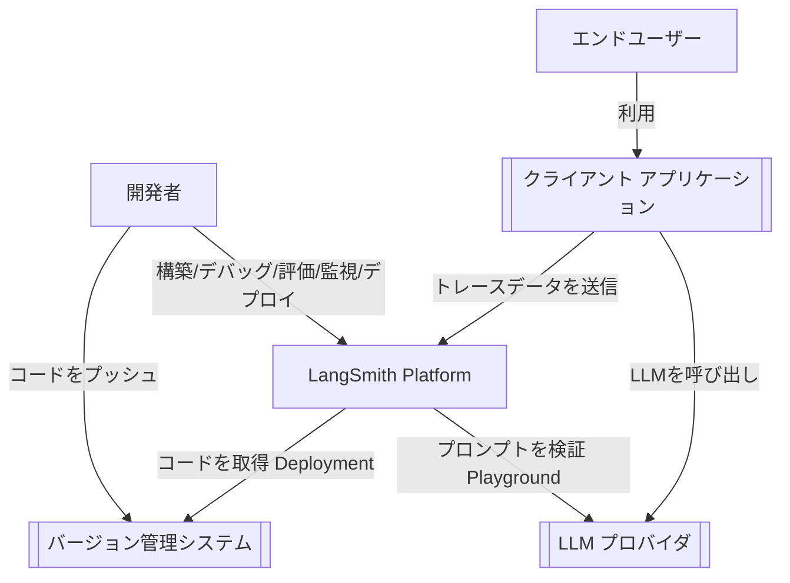
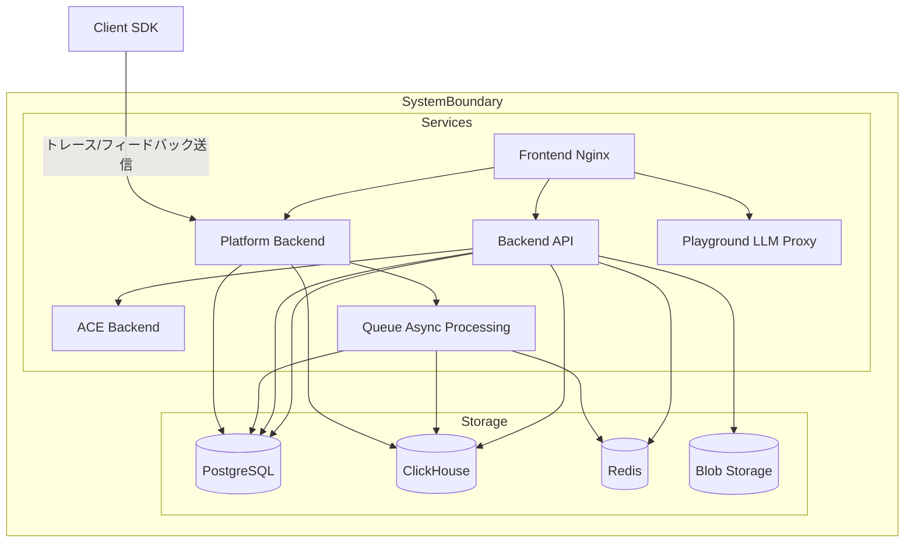
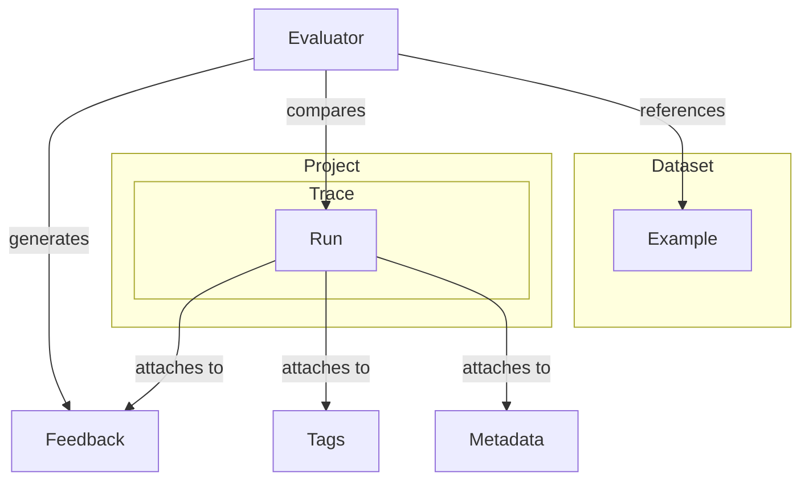

## ■概要

LangSmithは、大規模言語モデル（LLM）アプリケーションの開発ライフサイクル全体を支援する統合プラットフォームです。プロトタイピングから本番運用まで、開発、デバッグ、評価、監視、デプロイの全フェーズをカバーします。

LLMアプリ開発における「非決定的な振る舞い」や「品質の不透明さ」といった課題に対し、詳細なトレースと定量的な評価を提供することで、信頼性の高いアプリケーション構築を可能にします。

**主な利用シーン:**

* **Debugging**: 実行ステップ（Chain/Agent）ごとの入出力を可視化し、ボトルネックやエラーを特定。
* **Evaluation**: データセットを用いた自動テストにより、プロンプト変更時の品質劣化（リグレッション）を防止。
* **Annotation**: Traceログをその場で採点・修正し、高品質なデータセットを構築（Human-in-the-loop）。
* **Monitoring**: 本番環境でのトークン使用量、レイテンシ、エラー率に加え、Online Evaluationによる品質監視。

LangChainやLangGraphとの親和性が高いですが、SDKを利用することでフレームワーク非依存（Framework Agnostic）に利用可能です。

## ■構造

LangSmithのソフトウェアアーキテクチャをC4モデルに基づいて解説します。（構成が明確なセルフホスト版をモデルとしています）

### ●システムコンテキスト図

LangSmithプラットフォームと、開発者や外部システムとの関係性を示します。



| 要素名                            | 説明                                                                     |
| :-------------------------------- | :----------------------------------------------------------------------- |
| **開発者**                        | LangSmithを利用してアプリの品質向上と運用を行うエンジニア。              |
| **LangSmith Platform**            | トレース収集、評価実行、監視ダッシュボードを提供する基盤。               |
| **クライアント アプリケーション** | ユーザーが利用するLLMアプリ。LangSmith SDKを組み込みトレースを送信する。 |

### ●コンテナ図

プラットフォーム内部の主要コンテナ構成です。大量のトレースデータを処理するために、処理系（Queue）と分析系（ClickHouse）が分離されています。



| 要素名               | 説明                                                                             |
| :------------------- | :------------------------------------------------------------------------------- |
| **Platform Backend** | SDKからのログ受信など、高スループットな書き込み処理を担当。                      |
| **Queue**            | データの急増（スパイク）を吸収し、非同期でDBへ書き込むためのバッファ。           |
| **ClickHouse**       | トレースログなどの時系列・分析クエリに最適化されたOLAPデータベース。             |
| **PostgreSQL**       | ユーザー情報、プロジェクト設定、アノテーションなどのトランザクションデータ管理。 |

## ■概念データモデル

LangSmithにおけるデータの階層構造です。



* **Project**: アプリケーション単位のコンテナ。
* **Trace**: 1回のユーザーインタラクション全体。
* **Run**: Traceを構成する最小実行単位（LLM呼び出し、ツール実行、関数など）。
* **Dataset / Example**: 評価のための「入力」と「期待される出力」のペア。
* **Feedback**: 人間またはAI（Evaluator）による評価スコア。

## ■利用方法

LangSmithを実際の開発フローに組み込む手順を解説します。

### 1. セットアップ

SaaS版を利用する場合、APIキーを発行し環境変数に設定するだけで開始できます。

```bash
export LANGSMITH_TRACING=true
export LANGSMITH_API_KEY="lsv2_pt_..."
export LANGSMITH_PROJECT="my-first-project"
```

### 2. トレースのロギング（Tracing）

LangChainを利用している場合、環境変数の設定のみで自動的にトレースが送信されます。

**Python (LangChain) の例:**
```python
from langchain_openai import ChatOpenAI
from langchain_core.prompts import ChatPromptTemplate
from langchain_core.output_parsers import StrOutputParser

# このチェーンの実行は自動的にLangSmithへ記録されます
chain = (
    ChatPromptTemplate.from_template("{topic}について3行で教えて")
    | ChatOpenAI()
    | StrOutputParser()
)

chain.invoke({"topic": "LangSmith"})
```

**Python (OpenAI SDK直接利用) の例:**
LangChainを使わない場合も、ラッパーを利用してトレース可能です。
```python
from langsmith import wrappers
from openai import OpenAI

# OpenAIクライアントをラップ
client = wrappers.wrap_openai(OpenAI())

client.chat.completions.create(
    model="gpt-4o",
    messages=[{"role": "user", "content": "Hello"}]
)
```

### 3. データセットの作成

実際のトレースログから、うまくいった例や失敗した例を抽出し、評価用データセット（Dataset）に追加できます。プログラムコードからも作成可能です。

```python
from langsmith import Client

client = Client()

# データセットの作成
dataset_name = "QA Dataset v1"
if not client.has_dataset(dataset_name=dataset_name):
    dataset = client.create_dataset(dataset_name=dataset_name, description="QAテスト用")
    
    # データの追加
    client.create_examples(
        inputs=[
            {"question": "LangSmithとは？"},
            {"question": "Pythonの学習方法は？"},
        ],
        outputs=[
            {"answer": "LLM開発プラットフォームです。"},
            {"answer": "公式ドキュメントや実践的なコードを書くことです。"},
        ],
        dataset_id=dataset.id,
    )
```

### 4. 評価の実行 (Offline Evaluation)

作成したデータセットに対してアプリケーションを実行し、品質をスコアリングします。

```python
from langsmith.evaluation import evaluate, LangChainStringEvaluator

# 1. 評価対象の関数（チェーンなど）
def target_app(inputs):
    return chain.invoke(inputs)

# 2. 評価基準（Evaluator）の定義
# ここでは「正解との一致度」などをLLM自身に判定させる
evaluators = [
    LangChainStringEvaluator("cot_qa"), # QAの正確性評価
    LangChainStringEvaluator("criteria", config={"criteria": "conciseness"}) # 簡潔さ
]

# 3. 評価の実行
results = evaluate(
    target_app,
    data="QA Dataset v1",
    evaluators=evaluators,
    experiment_prefix="test-experiment",
    metadata={"version": "1.0.0"}
)
```

実行後、LangSmithのUI上で実験結果（Experiment）を確認し、過去のバージョンとスコアを比較できます。

### 5. ヒューマン・イン・ザ・ループ (Annotation Queue)

LLMアプリの改善には、実際の運用ログを目視確認し、フィードバックを行うプロセスが不可欠です。LangSmithの **Annotation Queue** を使うと、特定条件（例: ユーザー評価が低い、エラーが発生など）のログを自動的に抽出し、レビュワーに割り当てることができます。

**主なワークフロー:**
1.  **Queue作成**: 「低評価コメント付きログ」「ハルシネーション疑い」などのキューを作成。
2.  **Add to Queue**: フィルタ条件に合致したRunを自動または手動でキューに追加。
3.  **Review**: レビュワーはキューからアイテムを順次処理し、修正解（Correct Answer）や評価タグを付与。
4.  **Dataset化**: 修正済みの高品質なログをボタン一つでDatasetへ追加。

### 6. オンライン評価 (Online Evaluation)

本番環境（Production）の全トラフィック、またはサンプリングしたトラフィックに対して、バックグラウンドで自動評価を走らせることも可能です。

**利用例 (Automations):**
*   **トピック分類の監視**: ユーザー入力が「不適切なトピック」でないかをLLM-as-a-judgeで全数チェック。
*   **回答品質の計測**: `conciseness`（簡潔さ）や `helpfulness`（有用性）のスコアを継続的に記録し、デプロイ後の品質推移をダッシュボードで監視。

```python
# ※Online Evaluationは主にUI（Automations設定）またはSDKから設定可能です。
# ログ送信時に自動的にサンプリングされ、評価実行コストを制御しながら品質監視ができます。
```

## ■運用

### ●SaaS版のデータ保持
* デフォルトで実行ログ（Trace）は **14日間** 保持されます。
* データセットや重要としてマークされたトレースは無期限に保持可能です。
* チーム開発では、プロジェクトごとにRBAC（Role-Based Access Control）を設定し、閲覧権限を管理します。

### ●セルフホスト版 (Kubernetes)
セキュリティ要件が厳しい組織向けに、Kubernetes上へのデプロイが可能です。
* **メリット**: データが自社インフラから出ない（Data Residency）。
* **考慮点**: ClickHouseやPostgreSQLなどのステートフルなコンポーネントの管理・バックアップ等の運用コストが発生します。

## ■まとめ

LangSmithは単なるロガーではなく、**「試行錯誤の可視化」と「品質の定量化」** を実現するエンジニアリングプラットフォームです。
開発時の評価（Evaluation）に加え、運用時の人間によるフィードバック（Annotation）と自動監視（Online Evaluation）を組み合わせることで、**継続的に精度を向上させるサイクル**を回せる点に最大の本質的価値があります。

少しでも参考になった、あるいは改善点などがあれば、ぜひリアクションやコメント、SNSでのシェアをいただけると励みになります！

## ■参考リンク

* [LangSmith Documentation](https://docs.smith.langchain.com/) - 公式ドキュメント
* [LangSmith Cookbook](https://github.com/langchain-ai/langsmith-cookbook) - 実践的なコードレシピ集
* [LangChain Blog](https://blog.langchain.dev/) - 最新機能やユースケースの紹介