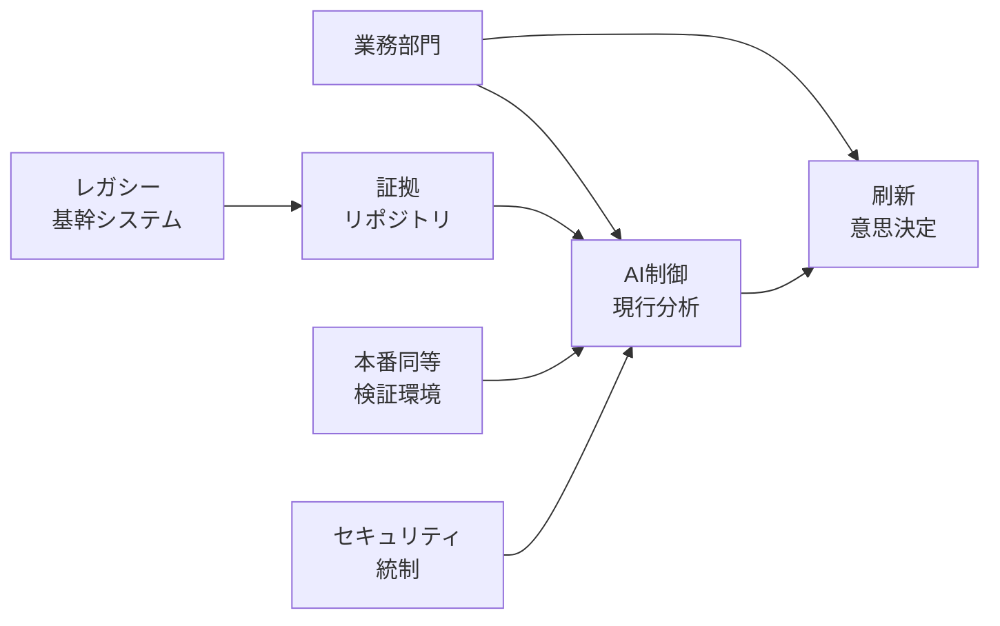
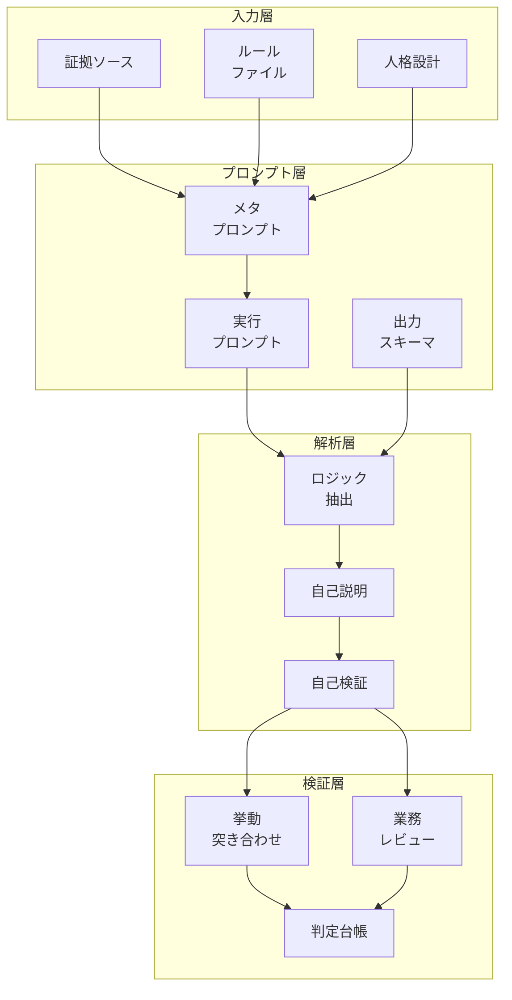
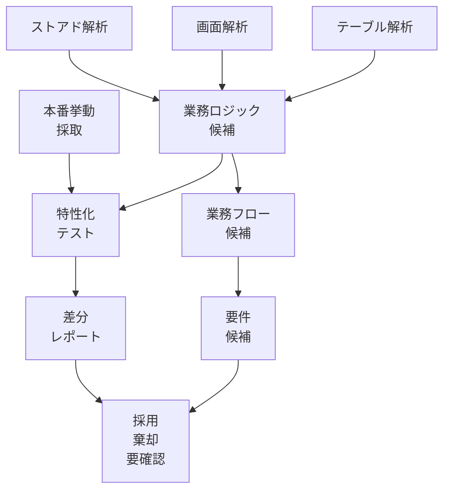
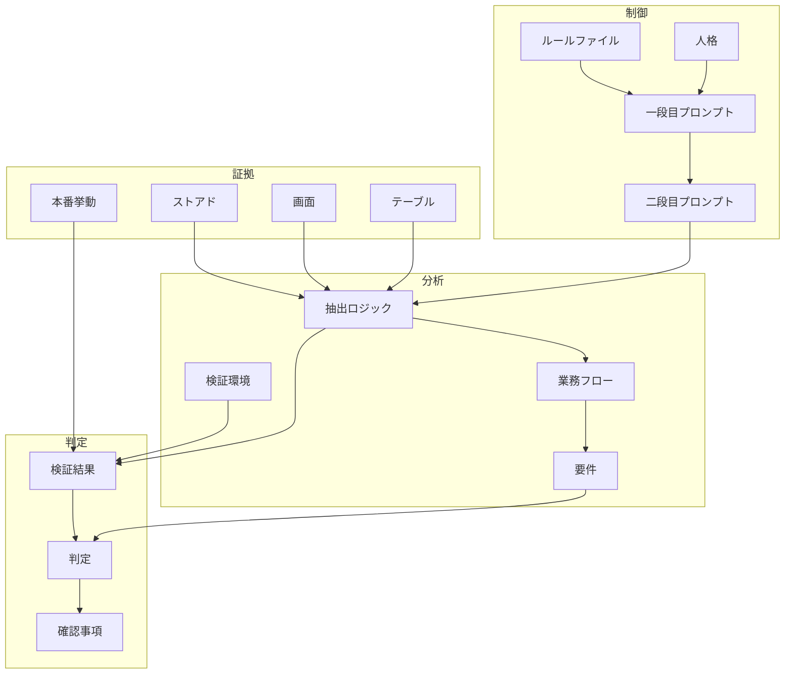
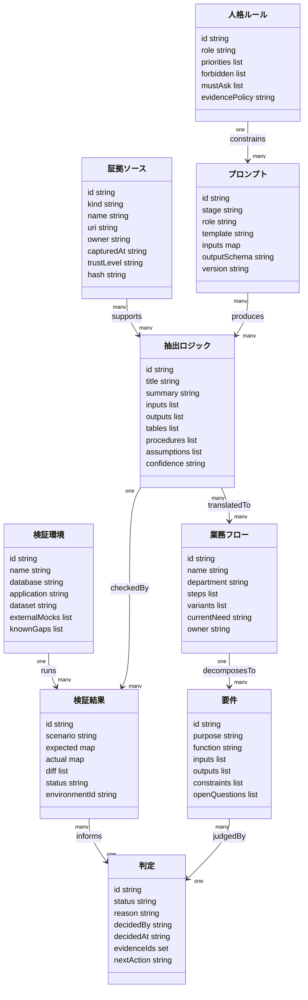

## 概要

この記事では、AIを制御してレガシー基幹システムの現行分析、すなわち as-is 復元を進めるための方法論を整理します。中心に置く事例は、カクヤスグループから社名変更したひとまいるが、AWS Summit Japan 2026 の講演で共有した基幹システム刷新の取り組みです。対象システムは約30年運用された基幹であり、VB.NET画面が約2200、Oracle Databaseのテーブルが約3000、ストアドプロシージャが約1200本ありました。人手で解析すると約450人月かかると試算されていました。設計書やソースの一部が失われ、知識が属人化し、特定ベンダー依存が強まっていた点も重要です。

事例数値は、公開記事で確認できる範囲に限定して扱います。数値はプロジェクト条件や対象範囲で変わるため、この記事では方法論の根拠として使い、一般化した効果保証として扱いません。

| 項目 | 公開記事上の値 | 主な出典 | この記事での扱い |
|---|---|---|---|
| 画面数 | 約2200画面から約800画面 | [キーマンズネット](https://kn.itmedia.co.jp/kn/articles/2607/06/news040.html) | 画面削減判断の規模感 |
| テーブル数 | 約3000テーブル | [キーマンズネット](https://kn.itmedia.co.jp/kn/articles/2607/06/news040.html) | データ構造棚卸しの規模感 |
| ストアドプロシージャ | 約1200本 | [キーマンズネット](https://kn.itmedia.co.jp/kn/articles/2607/06/news040.html) | 業務ロジック抽出の入口 |
| 人手解析見積もり | 約450人月 | [キーマンズネット](https://kn.itmedia.co.jp/kn/articles/2607/06/news040.html) / [PR TIMES](https://prtimes.jp/main/html/rd/p/000000336.000022125.html) | 人手中心方式の限界 |
| AI活用後の解析期間 | 約2カ月 | [キーマンズネット](https://kn.itmedia.co.jp/kn/articles/2607/06/news040.html) | 制御されたAI解析の短期化事例 |
| 検証足場の構築期間 | 約1カ月 | [キーマンズネット](https://kn.itmedia.co.jp/kn/articles/2607/06/news040.html) / [PR TIMES](https://prtimes.jp/main/html/rd/p/000000336.000022125.html) | 挙動突き合わせへの先行投資 |

この記事の主題は、生成AIにコードを丸投げして新システムを作らせることではありません。主題は、AIの推論を証拠、ルール、人格、検証環境、業務レビューで制御しながら、現行システムの意味を復元することです。一般的なAIモダナイゼーション記事との違いは、AI駆動開発、業務駆動開発、本番同等検証環境を同じ判定台帳へ接続する点です。要件定義の前段で、現行像を証拠付きに整える点に焦点を置きます。ひとまいるの事例では、Claude Code on Amazon Bedrock を使ってストアドプロシージャを解析し、AWS上のEC2とRDSを用いてOracle本番相当の検証環境を再現し、抽出した業務ロジックを挙動で突き合わせました。さらに、営業、商品、店舗、物流、経理の各部門が、AIの出力を業務フロー単位で解釈し、「今も必要なもの」と「役割を終えたもの」を仕分けました。この二軸、すなわちAI駆動開発と業務駆動開発の併用が、AI制御による現行分析の中核です。

この方法論は、設計書が古い、コードの全体像が読めない、テストが十分に残っていない、現行ベンダーや一部担当者しか仕様を説明できない、という状況に向きます。特に、画面数、テーブル数、ストアド数、ジョブ数、COBOLプログラム数などの資産規模が大きく、人間が最初から最後まで読む方式では着手前に計画が破綻する案件に向きます。一方で、実行ログ、データベース、画面操作、本番または本番相当の挙動を一切観測できない案件には向きません。AI制御の要点は、AIの言語化能力を使って仮説を高速に作り、AI以外の証拠で仮説を昇格または棄却することだからです。

カクヤスグループから社名変更したひとまいるの事例で特徴的なのは、AI活用を単なる「解析時間の短縮」として扱っていない点です。講演記事では、AI駆動開発だけでなく業務駆動開発も同時に語られています。AIはストアドの中からテーブル間のデータ移動、在庫評価計算、粗利計算、値引計算、在庫引当などのロジック候補を抽出しました。しかし、そのロジックが今後も必要かどうかは、業務部門が業務フローの言葉に翻訳して判断しました。この分担により、2200画面を約800画面へ圧縮し、業務を約200フローへ再定義するという成果につながりました。

この方法論は、レガシー解析の既存知見とも接続できます。Michael Feathersが広めたレガシーコード改善の文脈では、既存システムの挙動を先に固定する characterization testing が重要とされます。この記事では、characterization testing を「現行挙動を固定する考え方」、approval testing と golden master testing を「既存出力を基準値として保存し、変更後の出力と比較する実装パターン」として扱います。AWSのOracle移行やDMS検証のドキュメントは、データベース移行時に行数、値、検証ログを突き合わせる考え方を示します。Oracle Real Application Testing は、本番ワークロードに近い負荷やSQLを再現して影響を見る発想を提供します。AI制御による現行分析は、これらの検証技法を「AIが抽出した仕様候補の真偽判定」に転用します。

プロンプト設計の面では、AnthropicのプロンプトエンジニアリングやClaude Codeのメモリ設計が参考になります。Claude Codeは、プロジェクトのルールや前提を `CLAUDE.md` のようなファイルとして外部化し、作業時に参照できる形を推奨します。これは、ひとまいるの事例で語られた「情報をAIに保持させず、常に参照できる形で外部化する」という設計と対応します。また、Claude Codeのベストプラクティスは、AIに検証可能なチェックを与え、実行結果で反復させることを強調します。これは、生成内容をAI自身に説明させ、さらに本番同等環境や業務レビューで検証するプロセスと対応します。

この記事では、AI制御による現行分析を次のように定義します。

> AI制御による現行分析とは、レガシー資産、実行挙動、業務知識を証拠として外部化し、役割とルールでAIの推論空間を制限し、二段階プロンプトと自己検証で仮説を生成し、本番同等検証環境と業務レビューで仮説を採用、棄却、要確認へ分類する方法論です。

この定義では、AIは「仕様の決定者」ではありません。AIは、散在した証拠から候補を抽出し、説明可能な形に整形し、人間と検証環境が判断できる単位に分解するエージェントです。決定者は、証拠、検証結果、業務責任者です。

類似アプローチと比較すると、この手法の位置づけは次のようになります。

| アプローチ | 解析主体 | 検証根拠 | 主な成果物 | 強み | 破綻リスク |
|---|---|---|---|---|---|
| 人手中心の設計書再作成 | ベテラン技術者と業務有識者 | 記憶、設計書、コード読解 | 現行仕様書、画面一覧、テーブル定義 | 暗黙知を拾いやすいです | 規模が大きいと工数が爆発します |
| 静的解析ツール中心 | 解析ツールとアーキテクト | 呼び出し関係、依存関係、メトリクス | 依存グラフ、影響範囲、棚卸し表 | 網羅的な棚卸しが得意です | 業務意味を説明できないことがあります |
| 生成AI丸投げ | LLM単体 | 生成結果の自然さ | 要約、移行コード、仕様風文書 | 初速が速いです | 幻覚と推測が仕様化されます |
| RAG型コードQ&A | LLMと検索インデックス | 検索されたコード断片 | 質問応答、局所説明 | 局所理解が速いです | 断片最適で全体整合が崩れます |
| 挙動固定テスト中心 | テスト担当と開発者 | 既存出力、ログ、DB差分 | golden master、回帰テスト | 変更の安全性を高めます | 何をテストすべきかの発見が別途必要です |
| 業務ワークショップ中心 | 業務部門 | 現場手順、業務フロー | 業務フロー、To-Be要件 | 不要業務の削減に強いです | コードに残る例外ロジックを見落とします |
| AI制御による現行分析 | 制御されたAI、技術者、業務部門 | コード、DB、実行挙動、検証環境、業務レビュー | 抽出ロジック、証拠付き要件、判定台帳、再定義フロー | 大規模資産を短期に構造化できます | 証拠外部化と検証足場を省くと丸投げ化します |

この比較から分かる通り、この手法は他手法の置き換えではありません。静的解析、characterization testing、業務ワークショップ、要件定義手法を束ね、AIを「構造化と仮説生成の加速器」として配置します。AIの能力を上げることよりも、AIに渡す証拠、AIに守らせるルール、AIに返させる説明、AI出力を昇格させる条件を設計することが重要です。

また、この手法はセキュリティ要件が高い企業でも採用しやすい形を取れます。Claude Code on Amazon Bedrock のように、クラウドアカウント、IAM、VPC、監査ログ、リージョン、モデルアクセスを企業側で管理できる構成を選べば、ソースコードや業務データを無制御に外部サービスへ送る設計を避けやすくなります。Amazon Bedrock Guardrails、VPCエンドポイント（AWS PrivateLink）、AWSの責任共有モデル、Claude Codeの権限管理や監査の考え方を組み合わせると、AI解析を「野良ツール」ではなく、統制された開発基盤として扱えます。

最後に、この方法論の成果物は単なる分析レポートではありません。成果物は、次の刷新判断へつながる構造化資産です。具体的には、証拠ソース、抽出ロジック、業務フロー、要件分解、プロンプト、人格、ルールファイル、検証結果、判定台帳です。これらを残すことで、分析プロセス自体が組織知になります。ひとまいるの事例で示された「プロンプトや分析手法のチーム共有」は、属人化を避けるための重要な設計です。

## 特徴

- AIに仕様を決めさせません。AIには、証拠を読ませ、候補を抽出させ、根拠を説明させ、検証可能な単位へ分解させます。
- 情報をAIの会話記憶に保持させません。ルール、前提、用語、禁止事項、検証基準をファイルとして外部化し、毎回参照させます。
- 業務要件から直接プロンプトを作りません。要件を5W2Hと目的、機能、入出力、制約へ分解し、その分解結果から実行プロンプトを作る二段階方式を使います。
- AIに人格を与えます。人格とはキャラクターではなく、役割、判断基準、優先順位、禁止行為、確認義務を固定する思考基盤です。
- AIに自己検証をさせます。自己検証とは、生成内容について、どの証拠からそう言えるか、どこが推測か、どのテストで確かめるかを説明させることです。
- 挙動突き合わせを必須にします。コード読解だけでなく、本番相当環境、既存ログ、DB差分、画面操作、帳票出力などを使って、抽出ロジックを確認します。
- 業務駆動開発と接続します。AIが抽出したロジックは、営業、商品、店舗、物流、経理などの業務部門が業務フローの言葉で再解釈します。
- 判定を三値で管理します。採用、棄却、要確認の三値にし、AIの推測をそのまま要件へ昇格させません。
- 検証不能領域を隠しません。検証不能なロジック、データ不足、環境差分、外部連携制限は、別管理して刷新リスクへ反映します。
- プロンプトを資産化します。個人の会話履歴ではなく、プロンプト、メタプロンプト、出力スキーマ、レビュー観点をリポジトリで共有します。
- セキュリティ境界を先に設計します。コード、顧客データ、DBダンプ、ログ、プロンプト、モデル出力を分類し、利用可能な環境と持ち出し制限を決めます。
- 解析の完了条件を明文化します。すべてを理解した状態を目指すのではなく、刷新判断に必要な粒度で、証拠付きの現行像を作ることを目指します。

## 論理構造

### コンテキスト相当の論理構造



| 要素名 | 説明 |
|---|---|
| 業務部門 | 現行業務の意味、例外運用、廃止可能性を判断する主体です。ひとまいるの事例では、営業、商品、店舗、物流、経理の部門が該当します。 |
| レガシー基幹システム | 解析対象です。VB.NET画面、Oracleテーブル、ストアドプロシージャ、外部連携、帳票、ジョブなどを含みます。 |
| AI制御現行分析 | AIを証拠、ルール、人格、検証、業務レビューで制御し、現行像を復元する方法論の本体です。 |
| 証拠リポジトリ | コード、DDL、ログ、実行結果、業務資料、質問回答、検証結果を格納する場所です。AIの記憶ではなく外部ファイルを正とします。 |
| 本番同等検証環境 | AIが抽出したロジックを挙動で突き合わせるための環境です。ひとまいるの事例ではAWS上にOracle本番同等環境を再現しました。 |
| セキュリティ統制 | IAM、VPC、監査ログ、アクセス制御、データ分類、プロンプト監査などを含む統制です。高セキュリティ要件下でのAI利用を支えます。 |
| 刷新意思決定 | 画面削減、業務フロー再定義、要件化、移行優先度、廃止判断、To-Be設計への接続を指します。 |

このコンテキストでは、AI制御現行分析は中央の仲介層です。レガシー基幹システムから直接To-Beを作るのではなく、証拠リポジトリと検証環境を通じて現行像を復元します。業務部門は、AIに置き換えられる存在ではありません。業務部門は、AIが抽出した候補を業務価値の観点で判定する存在です。

### 構成相当の論理構造



| 要素名 | 説明 |
|---|---|
| 証拠ソース | ストアド、画面、テーブル、ログ、本番挙動、設計書断片、業務資料などです。証拠の種類と信頼度を持たせます。 |
| ルールファイル | 用語、命名規則、禁止事項、出力形式、検証基準、推測の扱いを記述します。AIの会話履歴ではなくファイルを正とします。 |
| 人格設計 | AIの役割、優先順位、判断基準、確認義務を定めます。例えば「レガシー解析者」「業務翻訳者」「検証者」を分けます。 |
| メタプロンプト | 実行プロンプトを生成するためのプロンプトです。5W2Hや要件分解を使い、依頼内容の欠落を洗い出します。 |
| 実行プロンプト | 実際にコード解析や要件分解を行うプロンプトです。入力範囲、出力形式、根拠提示、禁止事項を含みます。 |
| 出力スキーマ | AI出力を台帳化できる形に固定します。ロジック候補、根拠、推測度、確認事項、検証方法を列として持ちます。 |
| ロジック抽出 | コードやDBから業務ロジック候補を抽出します。単なる要約ではなく、入力、処理、出力、制約、例外を分離します。 |
| 自己説明 | AI自身に、なぜそのロジック候補が妥当と考えたかを説明させます。根拠と推測を分けるための工程です。 |
| 自己検証 | AI自身に反例、未確認事項、必要な挙動確認、業務部門への質問を出させます。ここで採用判定はしません。 |
| 挙動突き合わせ | 本番同等環境、既存ログ、DB差分、帳票出力などで、ロジック候補と現行挙動を照合します。 |
| 業務レビュー | 業務部門が、ロジック候補を業務フローに翻訳し、必要性、廃止可否、例外運用を判断します。 |
| 判定台帳 | 採用、棄却、要確認を記録します。AIの出力をそのまま要件化しないためのゲートです。 |

この構成では、プロンプト層が重要です。業務要件をそのままAIへ投げると、AIは不足情報を補完してしまいます。メタプロンプトを使うと、空欄、曖昧語、未定義の制約を先に抽出できます。これにより、実行プロンプトが「AIに答えを作らせるもの」から「AIに証拠を構造化させるもの」へ変わります。

### コンポーネント相当の論理構造



| 要素名 | 説明 |
|---|---|
| ストアド解析 | SQL、PL/SQL、プロシージャ間呼び出し、テーブル更新、計算式、例外処理を解析します。ひとまいる事例では約1200本が対象でした。 |
| 画面解析 | 入力項目、ボタン、画面遷移、バリデーション、ユーザー操作を解析します。画面削減の根拠になります。 |
| テーブル解析 | テーブル、カラム、キー、コード値、履歴、マスタ、トランザクションを解析します。ロジックの入出力を特定します。 |
| 本番挙動採取 | 本番または本番相当環境で、入力、出力、DB変化、ログ、帳票を採取します。個人情報や機密情報の扱いを制御します。 |
| 業務ロジック候補 | AIが抽出した処理意味です。在庫引当、粗利計算、値引計算、請求締めなどの単位になります。 |
| 業務フロー候補 | ロジック候補を、部門横断の業務手順として再構成したものです。業務部門レビューの単位です。 |
| 要件候補 | 目的、機能、入出力、制約へ分解された候補です。To-Be要件へ昇格する前の状態です。 |
| 特性化テスト | 現行システムの挙動を固定するテストです。golden master や approval testing の発想と接続します。 |
| 差分レポート | 期待挙動と実行挙動、環境差分、データ差分、未確認事項をまとめます。 |
| 採用棄却要確認 | 判定結果です。採用は要件化へ進み、棄却は廃止候補になり、要確認は追加調査へ戻ります。 |

このコンポーネント相当図は、AIが出力したロジック候補を、業務フロー候補と特性化テストの両方へ流す点を示します。片方だけでは不十分です。業務フローだけではコードに潜む例外や副作用を見落とします。テストだけでは業務上不要な機能を温存します。二つの流れを判定台帳で合流させることが、現行分析を刷新判断へ接続する要点です。

## データ

この方法論が扱うデータは、ソースコードそのものより広い範囲を持ちます。重要なのは、すべての成果物に「何を根拠にしたか」と「どの判定状態か」を持たせることです。AI出力は中間生成物です。証拠ソース、検証結果、業務レビューによって裏付けられた時点で、初めて要件や刷新判断へ昇格します。

### 概念モデル



| 要素名 | 説明 |
|---|---|
| ストアド | 主要な業務ロジックの格納先です。SQL、PL/SQL、呼び出し順序、更新対象を証拠として扱います。 |
| 画面 | 入力、操作、表示、画面遷移、権限、バリデーションの証拠です。VB.NET画面のような大規模資産では削減判断の起点になります。 |
| テーブル | データの構造と業務概念を示す証拠です。マスタ、トランザクション、履歴、集計、中間テーブルを区別します。 |
| 本番挙動 | 実行時の入力、出力、DB変化、ログ、帳票です。コード読解の仮説を検証する基準になります。 |
| ルールファイル | AIに守らせる規約です。用語、証拠優先順位、禁止事項、出力形式、推測表記を含みます。 |
| 人格 | AIの役割と判断基準です。解析者、検証者、業務翻訳者などを分けます。 |
| 一段目プロンプト | 要件や依頼を整理し、欠落情報と実行プロンプトを生成するためのプロンプトです。 |
| 二段目プロンプト | 実際の解析や検証を行うプロンプトです。入力、出力、根拠提示、確認事項を明示します。 |
| 検証環境 | 現行挙動を再現するための環境です。DB、アプリ、外部連携代替、テストデータを含みます。 |
| 抽出ロジック | AIが証拠から抽出した業務ロジック候補です。根拠と推測度を持たせます。 |
| 業務フロー | 抽出ロジックを業務部門が理解できる手順へ変換したものです。 |
| 要件 | 目的、機能、入出力、制約へ分解したものです。To-Be要件へ昇格する前に判定を受けます。 |
| 検証結果 | 挙動突き合わせ、差分、未再現、環境差分を記録します。 |
| 判定 | 採用、棄却、要確認の状態です。理由、根拠、責任者、期限を持たせます。 |
| 確認事項 | 未確認の前提、業務部門への質問、追加検証のタスクです。 |

### 情報モデル



| 要素名 | 説明 |
|---|---|
| 証拠ソース | コード、DDL、ログ、画面、帳票、業務資料などです。信頼度、取得時刻、ハッシュを持たせると再現性が上がります。 |
| 検証環境 | 本番同等性を説明できる環境です。既知の差分を明示し、検証結果の解釈に使います。 |
| 抽出ロジック | AIの主要出力です。入力、出力、参照テーブル、手続き、仮定、信頼度を持ちます。 |
| 業務フロー | 業務部門がレビューできる単位です。部門、手順、分岐、現時点の必要性を持ちます。 |
| 要件 | 目的、機能、入出力、制約に分解された単位です。RDRAやUSDMなどの要件定義手法へ接続できます。 |
| プロンプト | 一段目と二段目を区別してバージョン管理します。出力スキーマを固定することで台帳化しやすくします。 |
| 人格ルール | AIの役割と行動制約です。証拠優先、未確認時の質問、禁止される推測を明示します。 |
| 検証結果 | 期待値、実績値、差分、状態を持ちます。golden master や approval testing の結果を格納できます。 |
| 判定 | 採用、棄却、要確認を表します。理由、判定者、証拠ID、次アクションを持たせます。 |

この情報モデルでは、`ExtractedLogic` を中心に関係が広がります。AIが生成する説明は、`EvidenceSource` に支えられている必要があります。`VerificationResult` が存在しないものは、検証済みとは呼びません。`BusinessFlow` と `Requirement` は、業務部門が理解できる言葉へ変換された後の成果物です。`Decision` は、それらを刷新判断へつなぐゲートです。

実務では、最初から完全なデータベースを作る必要はありません。Markdown、CSV、YAML、SQLite、チケット管理ツールでも始められます。ただし、ID、証拠、判定、バージョンの四つは必ず持たせます。これがないと、後から「なぜこの機能を残すことにしたのか」「AIがどの証拠を見てそう言ったのか」を説明できなくなります。

## 構築方法

### 1. 目的と完了条件を定義します

最初に、現行分析の目的を「全部理解すること」から切り離します。目的は、刷新判断に必要な現行像を、証拠付きで復元することです。完了条件は、業務フロー、画面、テーブル、ロジック、外部連携、帳票、ジョブなどの単位ごとに定義します。

例として、次のような完了条件を置きます。

| 領域 | 完了条件 | 未完了の扱い |
|---|---|---|
| ストアド | 更新対象テーブル、入力、出力、計算式、例外処理が抽出されていること | 要確認として台帳化します |
| 画面 | 主要操作、入力項目、参照テーブル、後続処理が紐づいていること | 画面削減判断から除外します |
| 業務フロー | 業務部門が現在必要、不要、要確認を判定していること | To-Be要件へ昇格しません |
| 検証 | 代表シナリオでDB差分または出力差分が確認されていること | 推測のまま扱います |
| セキュリティ | コード、データ、ログ、プロンプトの利用ルールが定義されていること | AI解析の対象外にします |

ここで重要なのは、完了条件をAIに読ませることです。人間だけが完了条件を知っている状態では、AIは出力の粒度を合わせられません。

### 2. 証拠ソースを棚卸しし、優先順位を付けます

証拠には強弱があります。現行分析では、AIの自然な説明よりも、実行挙動とコードを優先します。次のように優先順位を定めます。

| 優先度 | 証拠 | 使い方 | 注意点 |
|---|---|---|---|
| 1 | 本番または本番同等の実行挙動 | 入力、出力、DB差分、ログを基準にします | 個人情報と外部連携制限を管理します |
| 2 | 現行コードとDDL | ロジック、入出力、制約を抽出します | 未使用コードと到達不能コードに注意します |
| 3 | データ実体 | コード値、例外データ、履歴の意味を確認します | サンプル偏りに注意します |
| 4 | 画面操作と帳票 | 業務部門の理解に変換します | 画面にないバッチ処理を見落とさないようにします |
| 5 | 設計書断片 | 用語や歴史的経緯を補います | 現行と不一致の可能性を明記します |
| 6 | 人の記憶 | 例外運用や背景を補います | 属人化した証言として扱い、検証を求めます |
| 7 | AIの推測 | 仮説の候補にします | そのまま仕様化しません |

棚卸しでは、資産の数だけではなく、解析順序を決めます。ひとまいるの事例では、約1200本のストアドが業務ロジック抽出の重要な入口でした。別の企業では、COBOLバッチ、帳票定義、メッセージキュー、ジョブネットが入口になる場合があります。

棚卸し台帳の最小列は次の通りです。

```csv
id,kind,name,path_or_uri,owner,system_area,trust_level,contains_sensitive_data,notes
SP-0001,stored_procedure,CALC_ARARI,db/proc/CALC_ARARI.sql,core-team,pricing,high,false,粗利計算らしい
SCR-0102,screen,受注明細入力,src/forms/OrderDetail.vb,app-team,order,medium,false,画面遷移未確認
LOG-0020,behavior,値引計算ログ,evidence/logs/discount_case01.log,qa-team,pricing,high,true,マスキング済み
```

この台帳をAIに渡すときは、全ファイルを一度に詰め込まないようにします。Claude Codeのベストプラクティスでも、コンテキストが肥大化すると性能が劣化することが指摘されています。大規模なレガシー解析では、資産単位、業務領域単位、依存グラフ単位で分割します。

### 3. セキュリティ境界を設計します

高セキュリティ要件の案件では、AIの導入前にデータ分類を決めます。ソースコード、DBダンプ、ログ、顧客情報、社員情報、取引先情報、プロンプト、AI出力を分類します。Amazon Bedrockを使う場合は、IAM、VPC、CloudTrail、CloudWatch、モデルアクセス、リージョン、Guardrails、VPCエンドポイント（AWS PrivateLink）の設計を確認します。Claude Code on Amazon Bedrockのガイダンスは、企業がBedrock上でClaude Codeを利用する構成や認証、権限管理、ネットワーク境界の考え方を提供します。

最小のセキュリティ設計表は次の通りです。

| データ種別 | 例 | AI投入可否 | 条件 | 保管先 |
|---|---|---|---|---|
| ソースコード | VB.NET、PL/SQL、COBOL | 可 | 契約と社内規程で許可された環境に限定します | 管理リポジトリ |
| DBスキーマ | DDL、ERD | 可 | 機密カラム名の扱いを確認します | 証拠リポジトリ |
| 本番データ | 受注、請求、顧客 | 原則不可 | マスキングまたは合成データにします | 制限領域 |
| 実行ログ | バッチログ、SQLログ | 条件付き可 | 個人情報、取引先情報をマスクします | 証拠リポジトリ |
| プロンプト | 解析指示、ルール | 可 | 機密値を直接埋め込まないようにします | プロンプトリポジトリ |
| AI出力 | ロジック候補、要約 | 可 | 根拠と判定状態を付与します | 判定台帳 |

Claude Codeのセキュリティ文書は、権限ベースの設計、コマンド承認、書き込み制限、ネットワーク要求の承認、監査の重要性を説明しています。レガシー現行分析では、AIにソースを読ませるだけでなく、DBやログも扱うため、通常のコード補完よりも強い統制が必要です。

### 4. 本番同等検証環境を作ります

AI解析の信頼性は、挙動突き合わせの足場に依存します。ひとまいるの事例では、AWS上にOracle本番同等の検証環境を再現し、AIが抽出したストアドの挙動を検証しました。記事では、検証足場の構築に約1カ月を要したとされています。この投資は重要です。検証環境が本番と不一致のままだと、AI出力の誤りと環境差分を人間が切り分けにくくなります。

検証環境を作る手順は次の通りです。

1. 本番構成を論理化します。
2. DBバージョン、文字コード、NLS設定、タイムゾーン、権限、リンク、ジョブ、外部ファイルを確認します。
3. 本番データを使えない場合は、マスキングデータまたは合成データを作ります。
4. 外部連携は、実接続、記録再生、モック、手動投入のどれにするか決めます。
5. 代表シナリオを選び、入力、出力、DB差分、ログを採取します。
6. 環境差分を既知のギャップとして台帳化します。

Oracle系の移行では、AWS Prescriptive Guidance、Amazon RDS for Oracle、AWS DMS validation、Oracle Real Application Testing on RDS の資料が参考になります。DMSの検証は、ソースとターゲットのデータ差分を扱う発想を提供します。Oracle Real Application Testingは、SQLワークロードや性能影響を確認する発想を提供します。現行分析では、これらを「AIが抽出した仕様候補の確認」に応用します。

検証環境のギャップは、次のように明記します。

```yaml
environment_id: env-oracle-asis-001
database: Oracle compatible validation environment
application: partial legacy application runtime
known_gaps:
  - 外部決済連携はモックです
  - 物流会社連携はファイル入出力のみ再現します
  - 本番ピーク負荷は再現しません
  - 顧客データはマスキング済みです
validation_scope:
  - 在庫引当
  - 値引計算
  - 粗利計算
  - 請求締め
```

この `known_gaps` が重要です。AIの出力が検証環境で合っていても、外部連携がモックなら本番完全一致とは言えません。逆に、検証環境で不一致が出ても、環境差分が原因の可能性があります。ギャップを記録すると、判定の説明責任が残ります。

### 5. ルールファイルを外部化します

AI制御の第一原則は、AIに記憶させないことです。ルール、前提、用語、証拠優先順位、出力形式をファイルにします。Claude Codeのメモリ設計では、プロジェクトルールを `CLAUDE.md` のようなファイルで共有できます。同じ考え方を現行分析にも適用します。

ルールファイルの例は次の通りです。

```markdown
# as-is-analysis-rules.md

## 目的
現行システムの業務ロジックを証拠付きで復元します。
To-Be設計や新実装の提案は、明示された場合だけ行います。

## 証拠優先順位
1. 本番または本番同等の実行挙動
2. 現行コードとDDL
3. データ実体
4. 画面操作と帳票
5. 設計書断片
6. 人の記憶
7. AIの推測

## 禁止事項
- 根拠のない断定をしません。
- 推測を仕様として書きません。
- 未確認の外部連携を再現済みと書きません。
- 業務部門の判断なしに不要機能と決めません。

## 出力義務
- 根拠ファイルを列挙します。
- 推測度を high, medium, low で表します。
- 未確認事項を質問として列挙します。
- 検証方法を必ず書きます。
```

このファイルは、プロンプトの一部として毎回読み込ませます。ファイル化しておくと、担当者が変わっても同じ基準を使えます。また、プロンプトや分析手法をチーム共有し、組織知見化するというひとまいるの方針とも合います。

### 6. 人格設計を行います

人格設計は、AIに「専門家らしく振る舞って」と言うことではありません。役割、優先順位、禁止事項、確認義務を定義することです。レガシー現行分析では、少なくとも三つの人格を分けると安定します。

| 人格 | 目的 | 優先する証拠 | してはいけないこと |
|---|---|---|---|
| 解析者 | コードとDBからロジック候補を抽出します | コード、DDL、実行ログ | 業務上の必要性を決めること |
| 検証者 | 抽出ロジックを挙動で確認します | 検証環境、DB差分、出力 | 環境差分を無視すること |
| 業務翻訳者 | ロジックを業務フローと言葉へ変換します | 業務資料、部門レビュー | コードにない業務を補完すること |
| 要件分解者 | 採用候補を目的、機能、入出力、制約に分解します | 判定台帳、業務フロー | 未判定の候補を要件化すること |

人格設計テンプレートは次の通りです。

```markdown
# persona-legacy-logic-analyst.md

## 役割
あなたはレガシー基幹システムの現行分析者です。
コード、DDL、ログから業務ロジック候補を抽出します。

## 優先順位
1. 実行挙動とコードに反する説明をしません。
2. 根拠と推測を分けます。
3. 業務上の必要性は業務部門の判断に委ねます。
4. 不明点を確認事項として残します。

## 入力
- 証拠ソース一覧
- 対象コード
- ルールファイル
- 出力スキーマ

## 出力
- ロジック候補
- 根拠
- 入力
- 出力
- 副作用
- 未確認事項
- 検証方法
```

この人格を、メタプロンプトと実行プロンプトの両方で参照します。人格を固定すると、AIが途中で「新システム提案者」や「楽観的な要約者」に変わるリスクを下げられます。

### 7. 二段階プロンプトを設計します

二段階プロンプト方式では、第一段階で「よい実行プロンプト」を生成します。第二段階で、その実行プロンプトを使って解析します。狙いは、業務要件や調査依頼の曖昧さを、実行前に露出させることです。

第一段階のメタプロンプト例です。

```text
あなたはレガシー基幹システムの現行分析プロンプト設計者です。
次の依頼を、実行可能な解析プロンプトへ変換してください。

依頼:
在庫引当のストアドを解析して、今後も必要な業務ロジックを抽出したい。

必ず行うこと:
1. 5W2Hで依頼を分解してください。
2. 空欄や曖昧な点を確認事項として列挙してください。
3. 要件候補を目的、機能、入力、出力、制約に分けてください。
4. 実行プロンプトを生成してください。
5. 出力スキーマを表形式で定義してください。

禁止事項:
- 未確認の業務判断を補完しないでください。
- コードを読んでいない段階で結論を書かないでください。
```

第一段階の出力は、次のような形にします。

```markdown
## 5W2H分解
- Who: 物流部門、店舗、在庫管理担当
- What: 在庫引当ロジック
- Why: 新基幹でも必要な在庫確保ルールを復元するため
- When: 受注登録時、出荷指示時、在庫更新時
- Where: Oracleストアド、VB.NET画面、在庫テーブル
- How: コード解析と検証環境でのDB差分確認
- How much: 解析対象ストアド数と検証シナリオ数は未確定

## 確認事項
- 対象ストアドの一覧はありますか。
- 外部倉庫連携は検証環境で再現できますか。
- 引当失敗時の業務対応はどの部門が判断しますか。

## 実行プロンプト
次の証拠を読み、在庫引当ロジック候補を抽出してください。
根拠、入力、出力、副作用、未確認事項、検証方法を表で返してください。
```

第二段階の実行プロンプト例です。

```text
あなたはレガシー基幹システムの現行分析者です。
以下のルールファイルと対象ストアドを読み、在庫引当ロジック候補を抽出してください。

参照するルール:
- as-is-analysis-rules.md
- persona-legacy-logic-analyst.md

対象:
- SP_ALLOCATE_STOCK.sql
- T_STOCK.ddl
- T_ORDER_DETAIL.ddl
- validation_case_stock_001.log

出力形式:
| ロジックID | 概要 | 入力 | 出力 | 更新テーブル | 根拠 | 推測度 | 未確認事項 | 検証方法 |

制約:
- 根拠のない業務名を付けないでください。
- コードにない例外処理を補完しないでください。
- 不明な点は未確認事項へ入れてください。
- 本番挙動ログと矛盾する説明があれば、矛盾として書いてください。
```

この方式の利点は、プロンプトの品質をレビューできることです。いきなり解析させると、AIの内部補完が見えません。メタプロンプトで実行プロンプトを先に出させると、人間が依頼の穴を修正できます。

### 8. 5W2Hから要件分解へつなげます

ひとまいるの事例では、5W2Hで依頼を分解し、空欄を確認事項として抽出し、要件を目的、機能、入出力、制約に分けてプロンプト化する設計が語られています。これは、RDRAやUSDMのような要件定義手法とも接続できます。RDRAは、システム価値、外部環境、システム境界、要求、業務などを関係づける考え方を提供します。USDMは、要求と仕様を分け、理由や派生関係を明示する考え方を提供します。

5W2Hテンプレートは次の通りです。

```markdown
# 5W2Hテンプレート

## Who
誰の業務ですか。
誰が入力しますか。
誰が結果を利用しますか。
誰が例外を判断しますか。

## What
何を処理しますか。
何が成果物ですか。
何が変更されますか。
何が参照されますか。

## Why
なぜこの処理が必要ですか。
廃止すると何が困りますか。
法令、契約、会計、物流、顧客体験のどれに関係しますか。

## When
いつ実行されますか。
どのイベントで起動しますか。
締め、日次、月次、リアルタイムのどれですか。

## Where
どの画面、バッチ、DB、外部連携で発生しますか。
どの部門、拠点、チャネルに関係しますか。

## How
どのように処理されますか。
どの入力からどの出力を作りますか。
どのテーブルを参照または更新しますか。

## How much
件数、金額、回数、時間、性能、コスト、影響範囲はどれくらいですか。
```

5W2Hから要件へ変換するテンプレートです。

```yaml
requirement_candidate:
  id: REQ-CAND-001
  source_logic: LOGIC-ALLOCATE-STOCK-003
  purpose: 受注時に出荷可能な在庫を確保する
  function:
    - 注文明細ごとに引当可能数を計算する
    - 引当済み数量を在庫テーブルへ反映する
    - 不足時に例外状態を返す
  inputs:
    - order_id
    - item_id
    - warehouse_id
    - requested_quantity
  outputs:
    - allocated_quantity
    - shortage_flag
    - allocation_status
  constraints:
    - マスキング済みデータで検証する
    - 外部倉庫連携は検証環境ではモックです
    - 業務部門による必要性判定は未完了です
  open_questions:
    - 店舗別優先順位のルールは現在も必要ですか
    - 欠品時の代替商品提案は対象外ですか
```

このように分解すると、AIが出したロジック候補をそのまま仕様書に貼るのではなく、要件定義の形式へ移せます。目的が空欄なら、その機能は「なぜ残すのか」が未確認です。入力や出力が空欄なら、検証シナリオが不足しています。制約が空欄なら、セキュリティ、性能、業務例外が見落とされています。

### 9. 出力スキーマを固定します

AI出力を自由文にすると、後続のレビューと台帳化が難しくなります。現行分析では、出力スキーマを固定します。最小スキーマは次の通りです。

```yaml
logic_extraction_output:
  logic_id: string
  title: string
  summary: string
  evidence:
    - evidence_id: string
      path_or_uri: string
      line_or_object: string
      reason: string
  inputs:
    - name: string
      source: string
  outputs:
    - name: string
      destination: string
  side_effects:
    - table_or_file: string
      operation: string
  assumptions:
    - text: string
      risk: low_or_medium_or_high
  questions:
    - text: string
      owner: string
  verification:
    scenario: string
    expected_observation: string
  decision_hint:
    candidate_status: adopt_or_reject_or_needs_check
    reason: string
```

このスキーマを使うと、AI出力をCSVやデータベースへ変換できます。後で検索、集計、レビューできます。例えば、推測度が高いロジックだけを抽出し、検証環境でのシナリオ作成に回せます。業務部門ごとの未確認事項を一覧化できます。

### 10. 挙動突き合わせのシナリオを作ります

AIが抽出したロジックは、特性化テストへつなげます。ここでのテストは、新実装の正しさを保証するテストではありません。現行システムが今どう動くかを固定するテストです。Approval testing では、出力を承認済みの基準として保存し、次回実行との差分を見る考え方を取ります。golden master testing も同様に、既存挙動を基準として比較します。

シナリオ定義の例です。

```yaml
characterization_scenario:
  id: SCN-DISCOUNT-001
  title: 得意先別値引計算の標準ケース
  purpose: 値引計算ストアドの現行挙動を固定する
  preconditions:
    - 得意先マスタに標準値引率が登録されています
    - 商品マスタに対象商品が登録されています
    - 外部連携は使用しません
  inputs:
    customer_id: CUST-001
    item_id: ITEM-001
    quantity: 10
    order_date: 2026-06-01
  observations:
    - T_ORDER_DETAIL.discount_amount
    - T_ORDER_DETAIL.net_amount
    - application_log.discount_rule_id
  expected_source: current_system_run
  approval_status: pending
```

実行結果は、次のように差分として保存します。

```yaml
verification_result:
  scenario_id: SCN-DISCOUNT-001
  environment_id: env-oracle-asis-001
  status: mismatch
  expected:
    discount_amount: 1200
    net_amount: 18800
  actual:
    discount_amount: 1000
    net_amount: 19000
  diff:
    - field: discount_amount
      expected: 1200
      actual: 1000
    - field: net_amount
      expected: 18800
      actual: 19000
  interpretation:
    - 検証環境の得意先ランクマスタが本番と異なる可能性があります
    - AI抽出ロジックの値引優先順位が不足している可能性があります
  next_action: マスタ差分を確認します
```

この差分をAIに再入力するときは、原因を断定させないようにします。AIには、可能性、追加確認、必要な証拠を列挙させます。

### 11. 業務レビューと合流させます

AI解析と挙動突き合わせだけでは、現行業務として残すべきか判断できません。ひとまいるの事例では、各部門が業務フロー単位でコードの意味を解釈し、「今も必要」と「役割を終えた」を仕分けました。この工程がないと、レガシーの不要機能まで新システムへ持ち込む危険があります。

業務レビューの入力は、コード名やストアド名ではなく、業務フロー候補にします。

```markdown
# 業務レビュー用サマリ

## フロー名
店舗受注時の在庫引当

## 現行で起きていること
受注明細登録時に、倉庫別在庫と店舗別優先順位を参照し、引当数量を決定します。
不足時は欠品状態を登録し、後続の出荷指示で再確認します。

## 根拠
- SP_ALLOCATE_STOCK.sql
- T_STOCK.ddl
- validation_case_stock_001.log

## 検証結果
代表ケース3件は検証環境で一致しました。
外部倉庫連携ケースは未検証です。

## 判断してほしいこと
- 店舗別優先順位は今後も必要ですか。
- 欠品時の再確認フローは今後も必要ですか。
- 外部倉庫連携の例外処理はどの部門が判断しますか。
```

レビュー結果は、判定台帳へ戻します。

```csv
flow_id,logic_id,department,decision,reason,decided_by,next_action
FLOW-STOCK-001,LOGIC-ALLOC-003,物流,adopt,出荷可否判断に必要,物流責任者,要件化する
FLOW-DISCOUNT-004,LOGIC-DISC-009,営業,needs_check,特定得意先の例外が残っている,営業責任者,例外条件を追加確認する
FLOW-REPORT-010,LOGIC-REPORT-002,経理,reject,現行帳票は利用停止済み,経理責任者,廃止候補へ移す
```

業務レビューでは、AI出力の正しさを採点するのではありません。現行業務としての価値を判断します。技術的には正しいロジックでも、業務として不要なら廃止候補です。逆に、コードから読み取りにくいロジックでも、法令、会計、契約、物流上必要なら追加調査が必要です。

## 利用方法

### 日次の解析サイクル

構築した仕組みは、日次または週次の解析サイクルで回します。大規模な現行分析では、一回の巨大な解析よりも、小さな仮説生成と検証を繰り返す方が安定します。

標準サイクルは次の通りです。

1. 解析対象の業務領域を一つ選びます。
2. 対象となる証拠ソースを棚卸し台帳から選びます。
3. 一段目プロンプトで実行プロンプトと確認事項を生成します。
4. 人間が確認事項のうち即答できるものを埋めます。
5. 二段目プロンプトでロジック候補を抽出します。
6. AIに自己説明と自己検証をさせます。
7. 検証環境で代表シナリオを実行します。
8. 差分と未確認事項を台帳化します。
9. 業務レビュー用サマリへ変換します。
10. 業務部門が採用、棄却、要確認を判定します。

このサイクルでは、AIの役割は毎回同じです。AIは候補を作り、説明し、確認事項を出します。人間と検証環境が判定します。

### 解析対象の切り出し方

大規模システムを一括で解析すると、AIのコンテキストが肥大化し、結果が浅くなります。切り出しの単位は、次の順で検討します。

| 切り出し単位 | 向いている状況 | 例 |
|---|---|---|
| 業務フロー | 業務部門レビューを早く回したい場合 | 受注、出荷、請求、入金 |
| ストアド群 | ロジックがDBに集中している場合 | 在庫引当、粗利計算、締め処理 |
| 画面群 | 画面削減が主目的の場合 | 店舗受注画面、商品マスタ画面 |
| テーブル群 | データモデル再設計が主目的の場合 | 在庫、売上、請求、顧客 |
| 外部連携 | 連携リスクが大きい場合 | 物流会社、決済、会計、EDI |
| 帳票群 | 業務利用実態が不明な場合 | 日次帳票、月次帳票、監査帳票 |

ひとまいるの事例では、ストアド解析が重要な入口でした。別案件では、COBOLのジョブネットやJCL、帳票定義が入口になるかもしれません。大切なのは、切り出し単位ごとに、証拠、検証方法、業務レビュー担当を決めることです。

### AIに依頼する時の基本プロンプト

実務では、次の基本形を使います。

```text
あなたは、レガシー基幹システムの現行分析者です。
目的は、現行業務ロジックを証拠付きで復元することです。
新システムの設計提案は行いません。

参照ルール:
- as-is-analysis-rules.md
- persona-legacy-logic-analyst.md

対象証拠:
- evidence/SP_CALC_MARGIN.sql
- evidence/T_SALES.ddl
- evidence/T_ITEM.ddl
- evidence/validation_margin_case01.yaml

タスク:
1. 業務ロジック候補を抽出してください。
2. 入力、出力、参照テーブル、更新テーブル、副作用を分けてください。
3. 根拠ファイルと該当箇所を示してください。
4. 推測を明示してください。
5. 検証方法を提案してください。
6. 業務部門へ確認すべき質問を列挙してください。

出力形式:
| ロジックID | 概要 | 入力 | 出力 | 副作用 | 根拠 | 推測度 | 検証方法 | 確認事項 |
```

悪い依頼は次のようなものです。

```text
このストアドを読んで仕様書を書いてください。
```

この依頼は曖昧です。目的、根拠、出力形式、推測の扱い、検証方法がありません。AIはもっともらしい仕様書を生成しますが、検証できない仕様が混ざります。

### 自己検証を必ず挟みます

ロジック候補を抽出したら、同じAIまたは別人格のAIに自己検証をさせます。自己検証では、正しいかどうかをAIに決めさせません。どの点が怪しいか、何で検証できるかを出させます。

```text
あなたは、先ほどの抽出結果を検証するレビュアーです。
次の観点で自己検証してください。

1. 根拠がコードまたは実行挙動に存在しない記述はありますか。
2. 推測を仕様のように書いている箇所はありますか。
3. 入力、出力、副作用に抜けはありますか。
4. 本番同等検証環境で確認すべきシナリオは何ですか。
5. 業務部門に確認すべき質問は何ですか。
6. 採用、棄却、要確認の仮判定をするなら何ですか。

出力形式:
| 指摘ID | 対象ロジック | 問題 | 根拠 | 必要な追加証拠 | 推奨アクション |
```

この自己検証を挟むと、AIの出力に含まれる推測が見えやすくなります。Claude Codeのベストプラクティスが述べるように、AIには検証できるチェックを与えると反復の質が上がります。現行分析では、そのチェックがDB差分、ログ、画面出力、業務レビューです。

### 挙動突き合わせの実行

挙動突き合わせでは、AIが出した仮説を、実行可能なシナリオへ変換します。DB中心のロジックでは、入力データ、実行手続き、観測対象、期待値の由来を明記します。

```sql
-- 例: 検証用の観測クエリです。
-- 実務では本番データではなく、マスキング済みまたは合成データを使います。
SELECT
  order_id,
  item_id,
  discount_amount,
  net_amount,
  updated_at
FROM T_ORDER_DETAIL
WHERE order_id = 'ORDER-TEST-001';
```

```bash
# 例: golden master 風の比較です。
# 実装案であり、既存環境に合わせて置き換えます。
python compare_result.py \
  --expected evidence/approved/discount_case001.json \
  --actual evidence/run/discount_case001.json \
  --out evidence/diff/discount_case001.diff.json
```

比較結果をAIに渡すときは、次のように依頼します。

```text
次の差分を解釈してください。
原因を断定しないでください。
可能性、追加確認、必要な証拠、業務部門への質問に分けてください。

差分:
- discount_amount が expected 1200 に対して actual 1000 です。
- net_amount が expected 18800 に対して actual 19000 です。

既知の環境差分:
- 得意先ランクマスタは本番から一部マスキングされています。
- 外部キャンペーン連携はモックです。
```

### 判定会議の運営

判定会議では、ロジック候補を一つずつ議論しません。業務フロー単位で議論します。個々のロジックは証拠として添付します。

判定会議の標準アジェンダは次の通りです。

1. 対象業務フローを確認します。
2. AIが抽出した主要ロジックを確認します。
3. 挙動突き合わせの結果を確認します。
4. 未検証領域と環境差分を確認します。
5. 業務上の必要性を判断します。
6. 採用、棄却、要確認を決めます。
7. 次アクションと担当を決めます。

判定の基準は次のように明文化します。

| 判定 | 条件 | 次アクション |
|---|---|---|
| 採用 | 証拠があり、代表シナリオで挙動が確認され、業務部門が必要と判断したもの | 要件化します |
| 棄却 | 現行に存在するが、業務部門が不要と判断し、法令や契約上の制約がないもの | 廃止候補へ移します |
| 要確認 | 証拠不足、環境差分、業務判断未了、外部連携未確認があるもの | 追加調査へ戻します |

ここで採用されたものだけが、To-Be要件へ進みます。要確認を放置すると、後工程で「誰も決めていない仕様」が増えます。

### 成果物の保管と共有

現行分析の成果物は、チームが再利用できる形で保管します。推奨するディレクトリ構成例です。

```text
asis-analysis/
  rules/
    as-is-analysis-rules.md
    persona-legacy-logic-analyst.md
    persona-business-translator.md
  inventory/
    evidence_sources.csv
    system_assets.csv
  prompts/
    meta_prompt.md
    logic_extraction_prompt.md
    self_verification_prompt.md
  evidence/
    stored_procedures/
    ddl/
    logs/
    screenshots/
    approved_outputs/
  outputs/
    extracted_logic.csv
    business_flows.md
    requirements.yaml
    decisions.csv
    open_questions.csv
  validation/
    scenarios.yaml
    results/
    diffs/
```

この構成は一例です。重要なのは、プロンプト、証拠、出力、判定を分けることです。会話履歴だけに成果を残すと、再利用できません。プロンプトを共有し、分析手法をチームの資産にすることが、属人化回避につながります。

## 運用・ベストプラクティス・トラブルシューティング

### ベストプラクティス

| 領域 | ベストプラクティス | 理由 |
|---|---|---|
| 証拠管理 | AI出力には必ず証拠IDを付けます | 出力の由来を追跡できます |
| プロンプト | 一段目で確認事項を抽出します | 曖昧な依頼をそのまま実行しないためです |
| 人格設計 | 解析者、検証者、業務翻訳者を分けます | 役割混在による判断飛躍を防げます |
| 検証 | 代表シナリオをgolden master化します | 現行挙動を固定できます |
| 業務レビュー | コード単位ではなくフロー単位で見せます | 業務部門が判断しやすくなります |
| セキュリティ | データ分類とAI投入可否を先に決めます | 後からの統制やり直しを避けられます |
| 台帳 | 採用、棄却、要確認を三値で管理します | 推測の混入を防げます |
| 組織知 | プロンプトと分析手法をリポジトリで共有します | 属人化とベンダー依存を下げられます |

### AIの推測を昇格させる条件

AIが出した候補は、最初はすべて仮説です。仮説を要件へ昇格させる条件を明文化します。

| 状態 | 条件 | 許される表現 |
|---|---|---|
| 仮説 | AIがコードや資料から推測しただけです | 可能性があります |
| 根拠あり | コード、DDL、ログ、データのいずれかに根拠があります | 根拠に基づく候補です |
| 挙動確認済み | 本番または本番同等環境で代表シナリオが一致しています | 現行挙動として確認済みです |
| 業務承認済み | 業務部門が必要性を判断しました | To-Be要件候補です |
| 要件化済み | 目的、機能、入出力、制約が定義されました | 要件です |

この昇格ルールがないと、AIの自然文がそのまま要件になってしまいます。AI制御とは、AIに何をさせるかだけでなく、AI出力をどの状態に置くかを制御することです。

### 検証不能領域の扱い

外部連携、古い端末、廃止済みバッチ、夜間ジョブ、ピーク負荷、法令帳票などは、検証環境で再現できないことがあります。検証不能領域は、無理に確認済みにしません。次のように分類します。

| 分類 | 例 | 扱い |
|---|---|---|
| 技術的に未再現 | 外部サービスへ接続できない | モックと実接続の差分を明記します |
| データ不足 | 本番データを使えない | 合成データの限界を明記します |
| 時間依存 | 月末締め、年度末処理 | カレンダー条件と再現予定を記録します |
| 負荷依存 | ピーク時だけ起きる性能問題 | 機能要件と非機能要件を分けます |
| 業務判断待ち | 例外運用の担当が不明 | 業務部門への確認事項にします |
| 歴史的残骸 | 使われていない可能性が高い帳票 | 利用実績と責任者確認を取ります |

検証不能領域は、現行分析の失敗ではありません。隠すことが失敗です。検証不能を明示すると、刷新計画でリスクとして扱えます。

### セキュリティ運用

企業環境で生成AIを使う場合は、AI解析基盤を通常の開発基盤と同じように管理します。Amazon Bedrockを使う場合は、共有責任モデル、IAM、VPC、VPCエンドポイント（AWS PrivateLink）、Guardrails、監査ログ、リージョン選択を確認します。Claude Codeを使う場合は、権限、書き込み範囲、コマンド実行、ネットワーク要求、プロジェクト設定、監査を確認します。

最低限の運用ルールは次の通りです。

```markdown
# AI現行分析セキュリティ運用ルール

## データ投入
- 本番個人情報を直接投入しません。
- マスキング済みデータだけを検証に使います。
- 機密値はプロンプトに直接書きません。

## 権限
- AI実行環境のIAM権限を最小化します。
- 書き込み可能な領域を限定します。
- 外部ネットワークアクセスを必要最小限にします。

## 監査
- 実行したプロンプトを保存します。
- 参照した証拠IDを保存します。
- AI出力と判定結果を分けて保存します。

## レビュー
- AI出力を人間の承認なしに要件化しません。
- セキュリティ分類が不明な証拠はAIに投入しません。
```

Amazon Bedrock Guardrailsは、有害コンテンツ、機微情報、コンテキストグラウンディングチェック（contextual grounding checks）などの保護機能を提供します。ただし、Guardrailsを有効にしても、業務データの分類や権限設計が不要になるわけではありません。Guardrailsは統制の一部です。

### 業務駆動との合流

AI駆動開発だけでは、古い業務をきれいに再実装するだけになる危険があります。業務駆動開発だけでは、コードに残る例外処理やデータ制約を見落とす危険があります。両者を合流させる設計が必要です。

合流の単位は、業務フローです。AIはコードからロジック候補を抽出します。業務部門は、それを業務フローの言葉で判断します。判定台帳は、技術根拠と業務判断を同じ行に持ちます。

| フロー | 技術根拠 | 挙動確認 | 業務判断 | 最終判定 |
|---|---|---|---|---|
| 在庫引当 | ストアド、在庫テーブル、ログ | 一部確認済み | 必要 | 要確認 |
| 粗利計算 | ストアド、売上テーブル | 確認済み | 必要 | 採用 |
| 旧帳票出力 | 帳票定義、画面 | 未確認 | 利用停止済み | 棄却 |
| 店舗別例外値引 | ストアド、得意先マスタ | 不一致あり | 継続確認 | 要確認 |

この表では、技術根拠があっても業務判断が不要なら棄却できます。業務判断が必要でも挙動未確認なら要確認です。この分離が、AI出力の過信と業務ヒアリングの思い込みを同時に防ぎます。

### よくある失敗と対処

| 症状 | 原因 | 対処 |
|---|---|---|
| AIがもっともらしい仕様書を大量に出す | 依頼が曖昧で、出力スキーマと証拠提示を指定していません | 一段目プロンプトで5W2H分解と確認事項抽出を行います |
| AIが前に伝えたルールを忘れる | 会話記憶に依存しています | ルールファイルと人格ファイルを外部化し、毎回参照させます |
| 推測が要件として扱われる | 昇格条件がありません | 仮説、根拠あり、挙動確認済み、業務承認済み、要件化済みを分けます |
| 検証結果が合わない | 検証環境が本番と違います | 既知の環境差分を台帳化し、差分原因を分類します |
| 業務部門がレビューできない | コード名やストアド名で説明しています | 業務フロー単位のサマリへ翻訳します |
| 画面削減が進まない | 機能単位でなく画面単位だけで議論しています | 画面、ロジック、業務フローを紐づけて判断します |
| ベンダー依存が残る | 解析手順とプロンプトが共有されていません | プロンプト、台帳、検証シナリオをリポジトリで管理します |
| AIが外部連携の挙動を補完する | 証拠不足時の禁止事項がありません | 未確認の外部連携は要確認へ強制します |
| テストが膨大になりすぎる | すべての組み合わせを検証しようとしています | 業務リスク、金額影響、頻度、例外性で代表シナリオを選びます |
| セキュリティレビューで止まる | データ分類とAI投入可否を後から決めています | 解析開始前に分類表と利用環境を承認します |
| AI出力の品質が担当者でばらつく | 人格、ルール、出力スキーマが個人任せです | 共有テンプレートを使い、プロンプトレビューを行います |
| 解析が終わらない | 完了条件が「全部理解する」になっています | 刷新判断に必要な粒度で完了条件を定義します |

### レガシーコード解析におけるLLM利用の注意

LLMは、COBOL、VB.NET、PL/SQL、JCL、古い帳票定義のようなコードを説明できます。しかし、説明できることと正しいことは別です。近年の研究や実務記事では、LLMを使ったレガシー解析、要件抽出、移行支援が進んでいます。一方で、コンテキスト長の制約、幻覚、言語や業務固有語の不足、呼び出し階層の深さへの弱さ、非機能要件の見落としが課題として示されています。

MicrosoftのCOBOL移行実践記事では、AIエージェントを使った逆解析、依存関係把握、テスト生成の有効性が述べられています。同時に、コンテキストが大きすぎるとエージェントが一貫性を失うこと、テストのような決定的な検証構造が重要であることも述べられています。GitHubのCopilotによるレガシーコード近代化資料も、説明、テスト生成、段階的な変換、レビューの重要性を示しています。Azure SamplesのLegacy Modernization Agentsは、人格を持つ複数エージェント、依存グラフ、リバースエンジニアリング結果の保存という実装パターンを示しています。

これらの実務知見は、ひとまいるの事例と同じ方向を向いています。AIを一人の万能移行担当者にするのではなく、役割を分け、証拠を保存し、検証を組み込み、結果を人間が判断する方向です。

### 要件定義手法との接続

AI制御による現行分析は、要件定義手法の代替ではありません。むしろ、要件定義に入る前の現行像を整える方法です。RDRAは、要求、業務、外部環境、システム境界の関係を整理する枠組みとして使えます。USDMは、要求と仕様を分け、理由や派生を明示する枠組みとして使えます。IPAのシステム要件定義の資料は、企画、要件、設計へ進む際の考え方を整理する参考になります。

接続の例は次の通りです。

| AI制御現行分析の成果物 | RDRAとの接続 | USDMとの接続 |
|---|---|---|
| 業務フロー | 業務モデル、利用シーン | 要求の背景 |
| 抽出ロジック | システム境界、機能要素 | 仕様候補 |
| 証拠ソース | 現状根拠 | 理由、制約 |
| 確認事項 | 未解決課題 | 未決事項 |
| 判定台帳 | 要求採否 | 要求の採否理由 |
| 検証結果 | 現行制約 | 受入条件候補 |

AIが生成した文章をそのままRDRAやUSDMへ流し込むのではなく、証拠と判定を付けた成果物だけを接続します。これにより、要件定義の品質が「実装の上手さ」ではなく、「何を作るかをどれだけ正確に言語化できるか」へ移るという、ひとまいる事例の示唆を実務化できます。

### 導入ロードマップ

この方法論は、最初から全社展開しない方が安全です。ひとまいるの事例でも、検証環境の足場作り、ストアド解析、業務部門との仕分けが段階的に進んでいます。現場に導入する場合は、四つの段階に分けると管理しやすくなります。

| 段階 | 目的 | 期間の目安 | 成果物 | 終了条件 |
|---|---|---|---|---|
| 準備 | セキュリティと証拠管理を整えます | 2週間から4週間 | データ分類表、証拠台帳、ルールファイル | AI投入可能な証拠が明確です |
| パイロット | 小さな業務領域で方法を試します | 2週間から6週間 | 抽出ロジック、検証シナリオ、判定台帳 | 採用、棄却、要確認の判定が回ります |
| 拡大 | 主要業務領域へ横展開します | 1カ月から3カ月 | 業務フロー群、要件候補、未確認事項一覧 | 業務部門レビューが定常化します |
| 定着 | 組織知として運用します | 継続 | プロンプト集、分析パターン、品質指標 | 新規領域でも同じ手順を再現できます |

パイロットでは、難しすぎる領域を選ばないことが重要です。外部連携が多く、データがマスクできず、業務責任者も不在の領域を最初に選ぶと、AIの良し悪しではなく統制と組織調整で止まります。最初は、業務責任者が明確で、代表シナリオが作れ、入出力を観測できる領域を選びます。

一方で、簡単すぎる領域も避けます。単純な参照画面だけを対象にすると、AI制御、挙動突き合わせ、業務判断の価値が見えません。適度にロジックがあり、現行仕様の復元が課題になっている領域を選びます。

### 品質指標

AI制御による現行分析は、成果物の量ではなく、判定可能性で評価します。AIが何ページの仕様書を作ったかではなく、どれだけの候補が証拠付きで判定できたかを見ます。

| 指標 | 定義 | 望ましい方向 |
|---|---|---|
| 証拠付きロジック率 | 抽出ロジックのうち証拠IDが付いている割合 | 高いほどよいです |
| 挙動確認率 | 代表シナリオで検証結果があるロジックの割合 | 高いほどよいです |
| 要確認滞留日数 | 要確認のまま残っている平均日数 | 低いほどよいです |
| 業務判定率 | 業務部門が採用、棄却、要確認を付けたフローの割合 | 高いほどよいです |
| 棄却率 | 現行に存在するが今後不要と判定された候補の割合 | 適正範囲を見ます |
| 推測混入率 | 要件化済みの中に未検証推測が含まれる割合 | 低いほどよいです |
| プロンプト再利用率 | 共有テンプレートから実行された解析の割合 | 高いほどよいです |

棄却率は、単純に高ければよいわけではありません。高すぎる場合は、業務部門が現行制約を十分に理解しないまま廃止判断している可能性があります。低すぎる場合は、レガシーの不要機能を温存している可能性があります。したがって、棄却率は件数だけでなく、金額影響、法令影響、利用実績、例外運用と合わせて見ます。

品質指標を運用するための最小CSVは次のようにできます。

```csv
date,area,logic_total,logic_with_evidence,logic_with_behavior_check,flows_reviewed,decisions_adopt,decisions_reject,decisions_needs_check,open_questions_over_14days
2026-07-01,stock,42,40,18,12,7,2,3,4
2026-07-08,stock,58,56,31,20,12,4,4,2
2026-07-15,billing,35,33,10,8,5,1,2,6
```

この指標は、AIの性能評価だけに使いません。検証環境が足りないのか、業務レビューが詰まっているのか、証拠棚卸しが足りないのかを見分けるために使います。AIが高速に候補を出しても、要確認が滞留するなら、ボトルネックはAIではなく意思決定です。

### チーム体制

AI制御による現行分析は、少人数のAI担当だけでは成立しません。少なくとも、技術解析、検証環境、業務レビュー、セキュリティ、意思決定の役割が必要です。

| 役割 | 主な責任 | 典型的な成果物 |
|---|---|---|
| 現行分析リード | 全体方針、対象領域、完了条件を決めます | 解析計画、優先順位、進捗指標 |
| AIプロンプト設計者 | ルール、人格、二段階プロンプトを整備します | プロンプト集、出力スキーマ |
| レガシー技術者 | コード、DB、ジョブ、外部連携を説明します | 証拠台帳、技術レビュー |
| 検証環境担当 | 本番同等環境とテストデータを管理します | 検証環境、シナリオ、差分結果 |
| 業務部門代表 | 業務フローの必要性を判断します | 採用、棄却、要確認の判定 |
| セキュリティ担当 | データ分類とAI利用統制を確認します | 利用ルール、監査記録 |

この体制で重要なのは、AIプロンプト設計者を孤立させないことです。プロンプトだけを磨いても、証拠が足りなければ品質は上がりません。検証環境だけを作っても、業務判断がなければ刷新判断へ進みません。役割間の接点を、判定台帳と週次レビューで固定します。

## まとめ

AI制御による現行分析は、生成AIを仕様決定者にする方法ではありません。証拠を外部化し、人格と二段階プロンプトで推論を制御し、挙動突き合わせと業務レビューで仮説を昇格させる方法です。

カクヤスグループから社名変更したひとまいるの事例は、レガシー刷新のボトルネックが「コードを読む量」だけではなく、「現行の意味を検証可能な言葉へ戻すこと」にあると示しています。AIの価値は、丸投げではなく、制御された仮説生成と組織知化にあります。

この記事が少しでも参考になった、あるいは改善点などがあれば、ぜひリアクションやコメント、SNSでのシェアをいただけると励みになります！

## 参考リンク

- カクヤス・ひとまいる事例
  - [創業100年の酒屋カクヤスが挑む、生成AIで実現するシステム革命 キーマンズネット](https://kn.itmedia.co.jp/kn/articles/2607/06/news040.html)
  - [株式会社ひとまいる AWS Summit Japan 2026 登壇のお知らせ PR TIMES](https://prtimes.jp/main/html/rd/p/000000336.000022125.html)
- Claude Code と Amazon Bedrock
  - [Claude Code with Amazon Bedrock AWS Solutions](https://docs.aws.amazon.com/solutions/claude-code-with-amazon-bedrock/)
  - [Claude Code deployment patterns and best practices with Amazon Bedrock AWS Blog](https://aws.amazon.com/blogs/machine-learning/claude-code-deployment-patterns-and-best-practices-with-amazon-bedrock/)
  - [Claude in Amazon Bedrock Anthropic Docs](https://platform.claude.com/docs/en/build-with-claude/claude-in-amazon-bedrock)
  - [Guidance for Claude Code with Amazon Bedrock GitHub README](https://github.com/aws-solutions-library-samples/guidance-for-claude-code-with-amazon-bedrock/blob/main/README.md)
  - [Guidance for Claude Code with Amazon Bedrock Architecture](https://github.com/aws-solutions-library-samples/guidance-for-claude-code-with-amazon-bedrock/blob/main/assets/docs/ARCHITECTURE.md)
  - [Claude Code Memory](https://code.claude.com/docs/en/memory)
  - [Claude Code Best Practices](https://code.claude.com/docs/en/best-practices)
  - [Claude Code Security](https://code.claude.com/docs/en/security)
  - [Claude Prompting Best Practices](https://platform.claude.com/docs/en/build-with-claude/prompt-engineering/claude-prompting-best-practices)
  - [Claude Prompting Tools](https://platform.claude.com/docs/en/build-with-claude/prompt-engineering/prompting-tools)
  - [Develop tests Anthropic Docs](https://platform.claude.com/docs/en/test-and-evaluate/develop-tests)
  - [Amazon Bedrock Guardrails](https://docs.aws.amazon.com/bedrock/latest/userguide/guardrails.html)
  - [Protect your data using Amazon VPC and AWS PrivateLink Amazon Bedrock](https://docs.aws.amazon.com/bedrock/latest/userguide/usingVPC.html)
  - [Security Guardrails and Observability in Amazon Bedrock](https://docs.aws.amazon.com/bedrock/latest/userguide/security.html)
- Oracle 検証環境と挙動突き合わせ
  - [Best practices for migrating Oracle databases to AWS](https://docs.aws.amazon.com/prescriptive-guidance/latest/migration-oracle-database/best-practices.html)
  - [Amazon RDS for Oracle](https://docs.aws.amazon.com/AmazonRDS/latest/UserGuide/CHAP_Oracle.html)
  - [AWS DMS data validation](https://docs.aws.amazon.com/dms/latest/userguide/CHAP_Validating.html)
  - [Use Oracle Real Application Testing features with Amazon RDS for Oracle](https://aws.amazon.com/blogs/database/use-oracle-real-application-testing-features-with-amazon-rds-for-oracle/)
- レガシー解析とモダナイゼーション
  - [AWS Transform for mainframe](https://aws.amazon.com/transform/mainframe/)
  - [Transform mainframe applications AWS Docs](https://docs.aws.amazon.com/transform/latest/userguide/transform-app-mainframe.html)
  - [Modernize legacy code with GitHub Copilot](https://docs.github.com/en/copilot/tutorials/modernize-legacy-code)
  - [Asking GitHub Copilot questions in your IDE](https://docs.github.com/en/copilot/how-tos/chat-with-copilot/chat-in-ide)
  - [How GitHub Copilot and AI agents are saving legacy systems](https://github.blog/ai-and-ml/github-copilot/how-github-copilot-and-ai-agents-are-saving-legacy-systems/)
  - [Modernizing legacy code with GitHub Copilot tips and examples](https://github.blog/ai-and-ml/github-copilot/modernizing-legacy-code-with-github-copilot-tips-and-examples/)
  - [Modernizing a COBOL accounting system to Node.js using GitHub Copilot](https://github.com/continuous-copilot/modernize-legacy-cobol-app)
  - [Legacy Modernization Agents Azure Samples](https://github.com/Azure-Samples/Legacy-Modernization-Agents)
  - [How we use AI agents for COBOL migration and mainframe modernization Microsoft DevBlogs](https://devblogs.microsoft.com/all-things-azure/how-we-use-ai-agents-for-cobol-migration-and-mainframe-modernization/)
- Characterization testing と approval testing
  - [Working Effectively with Legacy Code InformIT](https://www.informit.com/store/working-effectively-with-legacy-code-9780131177055)
  - [Legacy Seam Martin Fowler](https://martinfowler.com/bliki/LegacySeam.html)
  - [ApprovalTests](https://approvaltests.com/)
  - [ApprovalTests Python PyPI](https://pypi.org/project/approvaltests/)
  - [ApprovalTests Python GitHub](https://github.com/approvals/ApprovalTests.Python)
  - [Approval Testing Concept Cpp Documentation](https://approvaltestscpp.readthedocs.io/en/latest/generated_docs/ApprovalTestingConcept.html)
- 要件定義と5W2H
  - [RDRA](https://www.rdra.jp/)
  - [RDRA とは](https://www.rdra.jp/article1)
  - [USDM Schema Library](https://affordd.jp/libraries/usdm-schema/)
  - [5W2H Agency for Healthcare Research and Quality](https://digital.ahrq.gov/health-it-tools-and-resources/evaluation-resources/workflow-assessment-health-it-toolkit/all-workflow-tools/5w2h)
  - [システム構築上流工程強化 要件定義 IPA](https://www.ipa.go.jp/digital/kaihatsu/system-youkyu.html)
- 学術・研究
  - [Large Language Models for Legacy Code Modernization arXiv 2411.14971](https://arxiv.org/abs/2411.14971)
  - [Large Language Models for Requirements Engineering arXiv 2509.11446](https://arxiv.org/abs/2509.11446)
  - [Source Code Summarization in the Era of Large Language Models arXiv 2407.07959](https://arxiv.org/abs/2407.07959)
  - [Large Language Models for Source Code Analysis arXiv 2503.17502](https://arxiv.org/html/2503.17502v1)
  - [Code Reborn AI Driven Legacy Systems Modernization from COBOL to Java arXiv 2504.11335](https://arxiv.org/abs/2504.11335)
