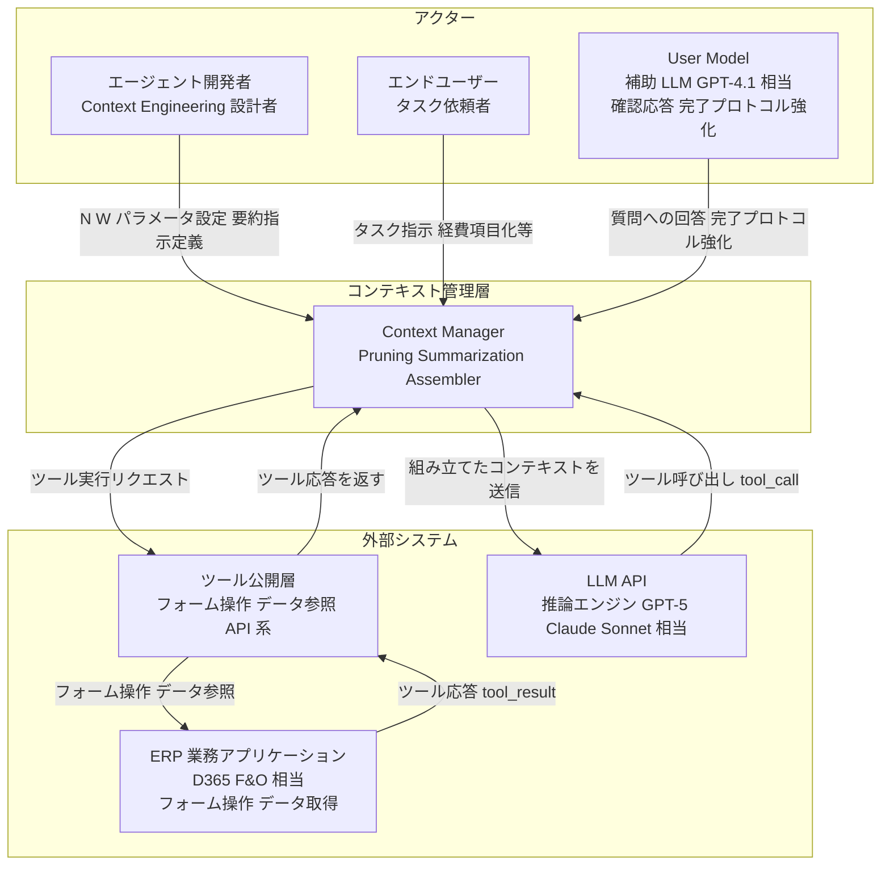
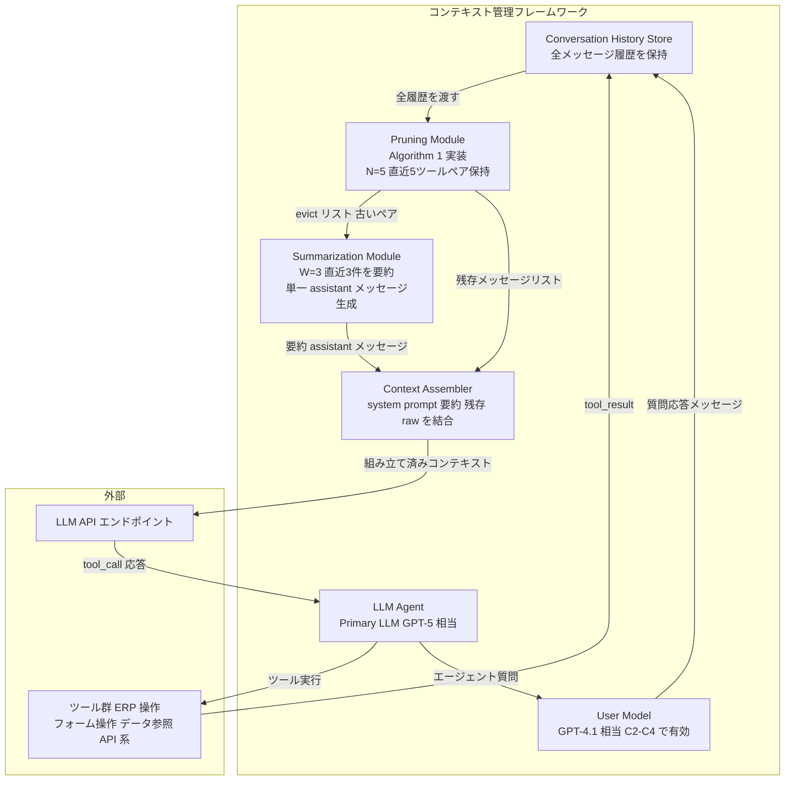
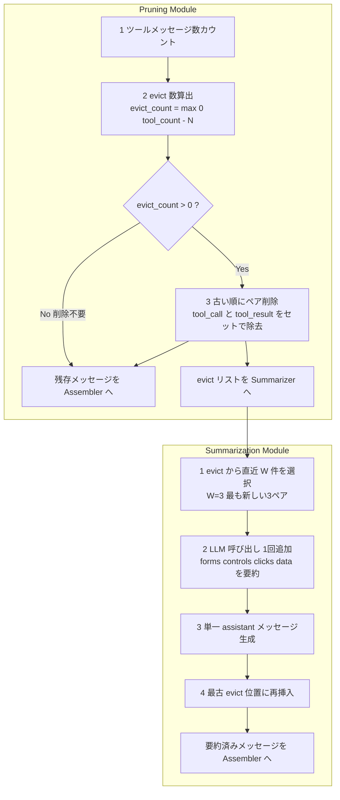
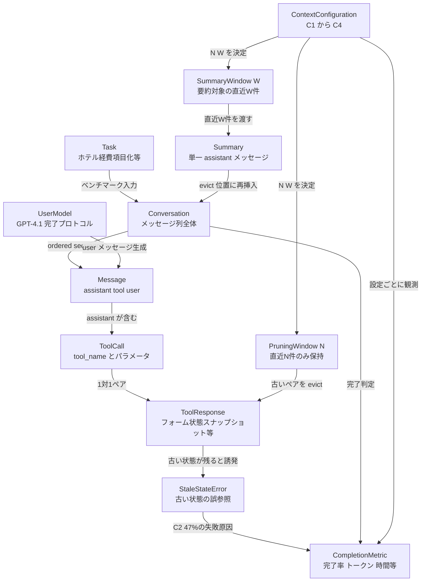
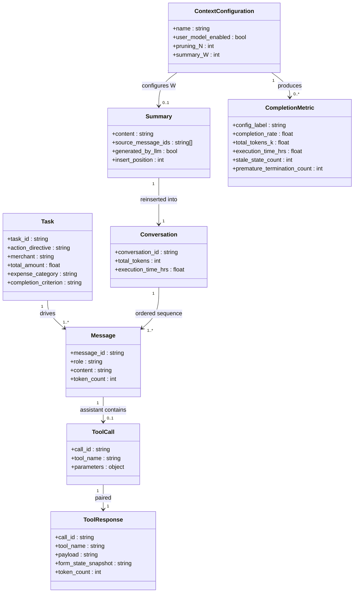

> 調査日: 2026-06-11 / 対象: arXiv 2606.10209 "Less Context, Better Agents: Efficient Context Engineering for Long-Horizon Tool-Using LLM Agents"（Lodha et al., 2026-06-08）

## 概要

長時間にわたってツールを呼び続ける LLM エージェントは、エンタープライズシステム（ERP など）から返る冗長なツール応答をコンテキストウィンドウへ溜め込みます。この蓄積が、次の 3 つの問題を同時に引き起こします。

- 古い画面状態を現在の状態と取り違える stale-state error
- トークン消費の肥大による推論コスト増
- タスク完了率の低下

本論文は、この問題を Microsoft Dynamics 365 Finance & Operations 上の「ホテル経費項目化」タスク 50 件（5 実行平均）というベンチマークで定量化します。エージェントに GPT-5、補助のユーザーモデルに GPT-4.1 を使い、4 種類のコンテキスト設定を比較します。結論は明快です。「直近 5 ツール呼び出しペアだけを残す pruning」と「削除分の直近 3 件を要約して再挿入する auto-summarization」を組み合わせた設定が、完了率・トークン・実行時間を同時に最良化します（完了率 91.6%、トークン 62.7% 削減、実行時間 60.2% 削減）。

意義は「削ると情報が失われて性能が落ちる」という直感を、定量的に覆した点にあります。全履歴をそのまま詰め込む実装は、コストだけでなく完了率まで下げます。この結果は、Anthropic・OpenAI・LangChain などが独立に提案してきた「直近の生データを残す / 古いものは要約する / 重要な詳細は外部へ退避する」という業界の 3 層モデルと一致します。一方で結論は単一ベンチ・単一 ERP・単一モデルでの局所最適です。長距離依存タスクや抽象要約の事実誤りを考えると、そのままの一般化には注意が必要です（後半の反証・限界を参照ください）。

## 特徴

### 4 設定の比較と数値

論文本文で確認した一次の数値です。

| 設定 | 定義 | 完了率 | 総トークン(K) | 実行時間(hrs) |
|---|---|---|---|---|
| C1 | ユーザーモデル無し / 完全履歴 | 8.0% | 532.6 | 3.08 |
| C2 | ユーザーモデル有り / 完全履歴 | 71.0% | 1,481.0 | 14.56 |
| C3 | 直近 5 ツール呼び出しペアのみ（pruning） | 79.0% | 535.3 | 5.39 |
| C4 | C3 + 削除分の直近 3 件を要約（window=3） | 91.6% | 553.4 | 5.79 |

- C1 から C2 への変化: ユーザーモデル（補助 LLM）を足すだけで完了率は 8.0% から 71.0% へ上がります。タスク完了プロトコルを強制する補助 LLM の寄与が大きいです。
- C2 から C4 への変化: pruning と要約でトークンを 62.7%、実行時間を 60.2% 削減しつつ、完了率は 71.0% から 91.6% へ上がります。削っても落ちるどころか上がります。
- ベンチマーク: D365 F&O「ホテル経費項目化」50 タスク × 5 実行平均。エージェントは GPT-5、ユーザーモデルは GPT-4.1、クロスモデル検証に Claude Sonnet 4.5 も使用します。

### stale-state error の定量化

stale-state error は、エージェントが古い時点の画面状態を現在の状態と誤認し、重複行作成などの誤った判断を下すエラーです。トークン上限超過（overflow）とは異なり、上限へ達する手前で起きる context degradation の代表例です。

| 設定 | stale-state 件数 | 失敗中の割合 |
|---|---|---|
| C2（完全履歴） | 34/73 | 47% |
| C3（pruning） | 6/53 | 11% |
| C4（pruning + 要約） | 4/21 | — |

古いコンテキストを切り捨てると、誤参照を抑えられます。ただし pruning 単体（C3）には副作用があります。premature termination（早すぎる打ち切り）が C2 の 9 件から C3 の 18 件へ増えます。要約を足した C4 では 3 件まで下がります。stale-state の抑制と打ち切りの抑制を両立した点が、本論文の核心です。

### 提案手法の要点

- pruning（window N=5）: ツール応答（tool_result）数が N を超えると、`max(0, #tool − N)` 件の古いペアを削除します。N=5 は tool_result を 5 件保持する意味です。削除単位は assistant の tool-call メッセージとツール応答のペアで、片方だけを残しません。論文は「5 件 ≒ 2 完全 itemization cycle 分の working memory」と説明します。
- 差分 summarization（window W=3）: 削除された中から直近 3 件を要約対象とします。要約内容は "forms opened, controls interacted with, buttons clicked, and data entered" です。`Summary of previous tool calls: [...]` という単一 assistant メッセージとして再挿入します。コストは eviction 1 回あたり LLM 呼び出し 1 回の追加のみです。トークンオーバーヘッドは C3 から C4 で約 3.4%（535.3K から 553.4K）に収まります。
- 解釈可能性: 明示的に保持したツール呼び出しと人間可読な要約からなるため、設計上レビューしやすいです。

### 業界の 3 層モデルとの対応

Anthropic Cookbook が示す 3 層メンタルモデルと対応づけると、位置づけが明確になります。

| 層 | 操作対象 | 本論文との対応 |
|---|---|---|
| clearing | window 内の再取得可能な古い tool 結果だけ削除 | C3 の pruning に近い（既定では tool 結果のみ削除。tool 入力まで消すには clear_tool_inputs=true が必要） |
| compaction | window 全体を要約圧縮 | C4 の summarization に近い（論文は差分のみで全体ではない） |
| memory | window 外へ退避（cross-session 永続） | 論文範囲外（将来拡張） |

論文の C4 は「clearing（pruning）と差分 summarization」の組み合わせです。Anthropic の clearing と compaction の中間に位置する設計と言えます。

## 構造

論文・方法論を対象とするため、C4 model を「提案フレームワークの論理構造」に読み替えて適用します。

### システムコンテキスト図



| 要素名 | 説明 |
|---|---|
| エージェント開発者 | Context Engineering のパラメータ（N, W）と要約指示の設計者 |
| エンドユーザー | タスク依頼と完了確認を行う人間 |
| User Model | 質問応答と打ち切り防止を担う補助 LLM（GPT-4.1） |
| コンテキスト管理層 | Pruning・Summarization・組み立てを統括するフレームワーク本体 |
| ERP 業務アプリケーション | 実データを保持するバックエンド（D365 F&O 相当） |
| ツール公開層 | ERP 操作を標準化ツールとして公開するプロキシ |
| LLM API | 推論を実行するモデルエンドポイント |

### コンテナ図



| 要素名 | 説明 |
|---|---|
| Conversation History Store | 全ターンのメッセージを時系列で蓄積する保管庫 |
| Pruning Module | `max(0, #tool − N)` 件の古いツールペアを evict する処理（N=5） |
| Summarization Module | evict された中から直近 W 件を要約し単一メッセージを生成する処理（W=3） |
| Context Assembler | system prompt・要約・残存 raw を結合し送信形式へ整える処理 |
| LLM Agent | 次のツール呼び出しまたは完了判断を行う中心の推論エンジン |
| User Model | 確認応答と完了プロトコルを強化する補助 LLM（C1 無効、C2-C4 有効） |

### コンポーネント図



| 要素名 | 説明 |
|---|---|
| eviction trigger | tool_result 数が N（=5）を超えたときの発火条件 |
| ペア削除 | tool_call と対応 tool_result のセット削除（孤立メッセージを残さない） |
| 削除数 | `max(0, tool_count − N)`。6 件目以降の古いペアから順に削除 |
| summary window 選択 | evict された中から直近 W 件（W=3）を選択 |
| 要約内容 | フォーム名・操作コントロール・クリックボタン・入力データ |
| 再挿入 | `Summary of previous tool calls:` の 1 メッセージを最古 evict 位置へ挿入 |
| 追加コスト | eviction 1 回あたり LLM 呼び出し 1 回（C3 から C4 のトークン増は約 3.4%） |

## データ

論文に明示の ER 図はないため、登場概念を抽出してモデル化します。

### 概念モデル



| 要素名 | 説明 |
|---|---|
| Task | エージェントが達成すべき業務単位（完了基準は remaining_amount = $0.00） |
| Conversation | エージェント・UserModel・ツール間のメッセージ順序列 |
| Message | Conversation の最小単位（assistant / tool / user の 3 種） |
| ToolCall | assistant メッセージ内の操作要求（tool_name とパラメータ） |
| ToolResponse | 外部システムが返す応答（フォーム状態スナップショットを含み肥大化しやすい） |
| UserModel | 完了プロトコルをもつ補助 LLM（GPT-4.1） |
| PruningWindow(N) | 保持するペアの最大数（古いペアは evict 対象） |
| SummaryWindow(W) | 要約に渡す直近 W 件（0 は要約なし、−1 は全件） |
| Summary | evict ペアから生成する単一 assistant メッセージ |
| ContextConfiguration | C1 から C4。N・W と UserModel 有無を決める比較単位 |
| StaleStateError | 古いフォーム状態を現在の状態と取り違える失敗 |
| CompletionMetric | 完了状況・トークン消費・実行時間の評価指標群 |

### 情報モデル



| 要素名 | 説明 |
|---|---|
| ContextConfiguration | C1（N=∞,W=0,UM=false）/ C2（N=∞,W=0,UM=true）/ C3（N=5,W=0）/ C4（N=5,W=3） |
| ToolResponse | `form_state_snapshot` は論文記述からの推測属性 |
| Summary | `source_message_ids` は推測属性。生成は単一 LLM パス |
| CompletionMetric | C2 は 1,481K/14.56h、C4 は 553.4K/5.79h。stale-state は C2 34 / C3 6 / C4 4 |

`form_state_snapshot` と `source_message_ids` は、論文の説明から型と役割を推測した属性です。論文内に明示の属性名はありません。

### ContextConfiguration 詳細

| 設定 | user_model | pruning_N | summary_W | 完了率 | 総トークン(K) | 実行時間(hrs) |
|---|---|---|---|---|---|---|
| C1 | false | ∞ | 0 | 8.0% | 532.6 | 3.08 |
| C2 | true | ∞ | 0 | 71.0% | 1,481.0 | 14.56 |
| C3 | true | 5 | 0 | 79.0% | 535.3 | 5.39 |
| C4 | true | 5 | 3 | 91.6% | 553.4 | 5.79 |

## 構築方法

論文は方法論を提示します。実装は論文の Algorithm 1 と引用ツールの公式ドキュメントから補完します。以下のコードはいずれも実装案であり、論文の主張そのものではありません。

### Algorithm 1（ConstructContext）の構造

```text
Input : history H、pruning window N、summary window W
Output: 新しい context K

1. c ← H 中の tool メッセージ数
2. d ← max(0, c − N)              // evict 数
3. if d = 0: return H
4. K ← [], E ← []                 // 保持リスト K、evict リスト E
5. for m in H:
     if m が tool メッセージ AND まだ evict 枠が残る:
       E.append(m)
       直前の assistant tool-call メッセージも E へ退避（ペア）
     else:
       K.append(m)
6. if W ≠ 0 AND E ≠ []:
     E_W ← E[-W:]（W > 0） または E 全件（W = −1）
     s ← Summarize(E_W)           // LLM 呼び出し 1 回
     K の最古 evict 位置に "Summary of previous tool calls: s" を挿入
7. return K
```

上記は論文の Algorithm 1 を読み下した擬似コードです（変数名と分岐は再構成）。ToolCall と ToolResponse を必ずペアで退避し、孤立した tool-call メッセージがコンテキストに残ってモデルを混乱させる事態を防ぎます。

### pruning と差分要約の実装例

```python
# 実装案: Algorithm 1 ConstructContext を Python で示したもの (arXiv 2606.10209)
#   H: メッセージ履歴 (role="assistant"/"tool"/"user" の dict list)
#   N: pruning window — 保持するツールペア数 (論文 C3/C4 で N=5)
#   W: summary window — 削除分から要約する件数 (C4 で W=3、無効時 0)

def construct_context(H: list[dict], N: int, W: int) -> list[dict]:
    tool_indices = [i for i, m in enumerate(H) if m["role"] == "tool"]
    c = len(tool_indices)
    d = max(0, c - N)              # 削除するペア数
    if d == 0:
        return H

    evict_tool_indices = set(tool_indices[:d])
    evicted: list[dict] = []       # E
    retained: list[dict] = []      # K

    i = 0
    while i < len(H):
        msg = H[i]
        if i in evict_tool_indices:
            evicted.append(msg)                       # tool result を削除
        elif (msg["role"] == "assistant"
              and i + 1 < len(H) and (i + 1) in evict_tool_indices):
            evicted.append(msg)                       # 対応 tool-call をペア削除
        else:
            retained.append(msg)
        i += 1

    if W != 0 and evicted:
        ew = evicted if W == -1 else evicted[-W:]     # 直近 W 件（厳密にはペア単位でスライス）
        summary_text = summarize(ew)                  # LLM 呼び出し 1 回
        summary_msg = {
            "role": "assistant",
            "content": f"Summary of previous tool calls: {summary_text}",
        }
        return [summary_msg] + retained               # 先頭へ挿入する簡略実装（厳密には最古 evict 位置）

    return retained
```

### エージェントループへの組み込み

```python
# 実装案: full history H と context を分離する設計
def agent_loop(task: str, tools: list, N: int = 5, W: int = 3) -> str:
    H = [{"role": "user", "content": task}]
    while True:
        context = construct_context(H, N=N, W=W)      # 毎ターン pruning/要約を再計算
        response = client.messages.create(
            model="claude-opus-4-8", max_tokens=4096,
            messages=context, tools=tools,
        )
        H.append({"role": "assistant", "content": response.content})  # 要約は H に書き戻さない
        if response.stop_reason == "end_turn":
            return extract_text(response)
        for block in response.content:
            if block.type == "tool_use":
                H.append({"role": "tool", "tool_use_id": block.id,
                          "content": execute_tool(block.name, block.input)})
```

組み込みの要点です。

- full history（H）と pruned/summarized な context を分離し、モデルには context のみを渡します。
- `construct_context` は毎ターン呼びます。削除は累積でなく毎回 N 基準で再計算します。
- 要約を H へ書き戻しません（full history の汚染を避けます）。

上記はメッセージのロールを抽象化した簡略な擬似コードです。`role: "tool"` はツール結果を表す代理表現で、実際の Anthropic Messages API ではツール結果を `role: "user"` の content 配列に `{"type": "tool_result", "tool_use_id": ...}` として渡します。本番実装では利用するプロバイダのメッセージ形式に合わせて読み替えてください。

## 利用方法

論文の pruning と差分要約に相当する機能は、主要フレームワークが first-party 実装として提供します。API の field 名やデフォルト値はバージョンで変動するため、利用時は各公式ドキュメントで確認ください。

### Anthropic: clear_tool_uses_20250919（pruning 相当）

サーバーサイドで適用するため、クライアントは full history を保持し続けられます。beta ヘッダは `context-management-2025-06-27` です。

```python
# 実装例: clear_tool_uses_20250919 (公式 Cookbook の設定例)
response = client.beta.messages.create(
    model="claude-opus-4-8", max_tokens=4096,
    messages=[{"role": "user", "content": "Create a command line calculator"}],
    tools=[...],
    betas=["context-management-2025-06-27"],
    context_management={
        "edits": [{
            "type": "clear_tool_uses_20250919",
            "trigger": {"type": "input_tokens", "value": 30000},
            "keep": {"type": "tool_uses", "value": 4},
            "clear_at_least": {"type": "input_tokens", "value": 10000},
        }]
    },
)
```

主な field です。`trigger`（発火閾値、デフォルト 100,000 input tokens）/ `keep`（残す直近ツールペア数、デフォルト 3 tool uses）/ `clear_at_least`（最低削除トークン）/ `exclude_tools`（削除対象外ツール）/ `clear_tool_inputs`（tool call 入力も削除するか）。上記コードはデフォルトより早めに発火させる Cookbook の設定例です。

### Anthropic: compact_20260112（summarization 相当）

論文 C4 の auto-summarization に近い動作です。ただし `compact_20260112` は差分でなく window 全体を要約します。beta ヘッダは `compact-2026-01-12`、デフォルト発火閾値は 150,000 input tokens（最小 50,000）です。

```python
# 実装例: compact_20260112 (公式 Docs)
response = client.beta.messages.create(
    betas=["compact-2026-01-12"],
    model="claude-opus-4-8", max_tokens=4096,
    messages=[{"role": "user", "content": "Help me build a web scraper"}],
    context_management={
        "edits": [{
            "type": "compact_20260112",
            "trigger": {"type": "input_tokens", "value": 100000},
            # "instructions": "Preserve: state, next steps, key data entered.",
        }]
    },
)
```

主な field です。`trigger`（発火閾値、デフォルト 150K）/ `pause_after_compaction`（デフォルト false、true で要約後に一時停止し追記可能）/ `instructions`（要約プロンプト、指定でデフォルト置換）。課金は追加 sampling step として `usage.iterations[]` に別計上されます。

### OpenAI Agents SDK: Sessions + trimming

Sessions が会話履歴をセッションスコープで自動管理し、直近 N 件に限定する deterministic な trimming を提供します（追加 LLM コストなし）。要約は `OpenAIResponsesCompactionSession`（`responses.compact`）を別途利用します。

```python
# 実装例: OpenAI Agents SDK — カスタムフィルタで直近のみ渡す
def keep_recent_history(history, new_input):
    return history[-10:] + new_input

result = await Runner.run(
    agent, "Summarize recent updates.", session=session,
    run_config=RunConfig(session_input_callback=keep_recent_history),
)
```

### LangChain / LangGraph: trim_messages / SummarizationNode

```python
# 実装例: trim_messages (token ベース trimming = pruning 相当)
from langchain_core.messages import trim_messages

trimmer = trim_messages(
    max_tokens=4000, strategy="last", token_counter=model,
    include_system=True, start_on="human",
)
trimmed = trimmer.invoke(messages)
```

```python
# 実装例: SummarizationNode (LangMem — summarization 相当)
from langmem.short_term import SummarizationNode

summarization_node = SummarizationNode(
    token_counter=model.get_num_tokens_from_messages,
    model=summarization_model,
    max_tokens=256,
    max_tokens_before_summary=256,   # この閾値を超えたら要約発火
    max_summary_tokens=128,
)
```

### フレームワーク比較

| フレームワーク | pruning 相当 | summarization 相当 | 特性 |
|---|---|---|---|
| Anthropic | clear_tool_uses_20250919 | compact_20260112 | サーバーサイド自動適用・full history はクライアント保持 |
| OpenAI Agents SDK | SessionSettings / session_input_callback | OpenAIResponsesCompactionSession | deterministic trimming・追加 LLM コストなし |
| LangChain / LangGraph | trim_messages | SummarizationNode / SummarizationMiddleware | OSS・LangGraph checkpoint と統合 |

## 運用

### pruning N と summary W のチューニング

論文の (N=5, W=3) は「2 itemization cycle 分の working memory」という直感で選ばれた値です。Appendix H の感度スイープで近傍値の頑健性を確認します。ただしタスクのツールサイクル長が変われば再チューニングが必要です。

- N の目安: 1 ビジネスフロー完結に必要なツール往復回数を K とし、`N ≥ K` を基準にします。承認ルーティングや多段 API 連鎖などツールサイクルが長いフローでは N=10〜15 から試します。N を大きくするほど stale-state リスクが戻るため、完了率と stale-state 数を同時に観測します。
- W の目安: W が大きいと要約が詳細になりコストが増えます。W が小さいと premature termination リスクが戻ります。実務では W=2〜5 の範囲で premature termination 率を見ながら決めます。
- adaptive window: 論文は「joint tuning and adaptive (per-task) window sizing are natural next steps」と述べます。ツールサイクル長が読めるタスクカテゴリは、種別ごとに N/W を別設定にします。

### 観測ボトルネックの切り分け

overflow・stale-state・long-range miss は症状が似て対策が異なります。観測して判定してから層を選びます。

| 症状 | ボトルネック | 判定方法 | 一次対策 |
|---|---|---|---|
| コンテキスト上限到達・truncation | overflow（トークン超過） | input_tokens が上限へ接近 | compaction（window 全体を要約） |
| 過去の画面・フォーム状態を参照した誤操作 | stale-state（古い tool 結果が混在） | 失敗ログの「前の値を再入力」「存在しないフォームを操作」 | clearing / pruning |
| 初期の制約・スキーマ・ポリシーが後段で欠落 | long-range miss（pruning の副作用） | 失敗ログの「承認済みの予算上限を無視」 | memory / offload（外部退避と ID 復元） |

stale-state と long-range miss が混在する場合は、clearing で stale-state を潰してから long-range miss が残るか確認します。

### 要約の事実性ガード

抽象要約は事実誤りを注入する既知リスクがあります（トラブルシューティングの 2 番目を参照ください）。

- 数値や確定済み制約（承認済み予算上限・入力スキーマ・ポリシー ID など）は要約文に溶かさず、構造化フィールドか外部ストアへ退避し ID で参照します。
- Anthropic compaction の `instructions` で「数値は元の値をそのまま引用」「日付や金額は変換しない」などの制約を要約プロンプトへ追加します。
- `pause_after_compaction: true` を設定し、要約生成後にキー数値を元メッセージと照合してから再開します。
- 要約の多段重ねは事実誤りの複利伝播リスクが大きいです。定期的に重要詳細を外部退避し、要約チェーンを短く保ちます。

### 残未完了への人間レビュー設計

最良設定 C4 でも約 8.4% が未完了です。論文は flagged case への人間レビューを残す方針を推奨します。

- 最終アクションが「タスク完了」以外（エラー終了・タイムアウト・ループ検出）のケースをログへ記録し、ダッシュボードへ集約します。
- 失敗を stale-state / premature termination / long-range miss で分類し、パターン別の再実行戦略（N を一時的に大きくするなど）を定義します。
- 保持したツール呼び出しと要約が人間可読であること（論文の "interpretable by construction"）は、レビュアーの原因特定に本質的です。

## ベストプラクティス

### Anthropic 3 層モデルの使い分け診断

何が問題かを観測してから 1 層を選ぶのが基本です。

```text
ボトルネック診断:
context の大半が何か?
  ├─ 古い tool result（再取得可能）→ [clearing] clear_tool_uses_20250919
  │    例: trigger=input_tokens:30000, keep=tool_uses:4
  ├─ 全会話が混合的に肥大 → [compaction] compact_20260112
  │    デフォルト trigger=150,000 tokens（最小 50,000）
  └─ session をまたいで記憶が必要 → [memory] memory_20250818
```

- clearing と memory を併用する場合は、memory tool を `exclude_tools` で clearing 対象から除外します。
- `compact_20260112` の既知制限です。要約中にツール呼び出しが発生し `content: null` になる場合があります。`instructions` で tool 使用禁止を明示して回避します。

### 冗長なツール応答を生のまま全部渡さない

画面状態・検索結果・ファイル全文のような再取得可能データを毎回 raw で全文渡し続ける動作が、論文の問題設定の本質的な原因です。

- 現在のステップで参照が必要な tool 結果だけを raw で保持し、それ以前は clearing または要約します。
- API から巨大な JSON が返る場合、エージェントへ渡す前にフィールドを絞ります（不要な metadata やネスト配列を除去）。
- 判定基準は Anthropic の "the smallest set of high-signal tokens that maximize the likelihood of your desired outcome" です。

### 重要詳細は外部 ID 復元（Memex 型）

pruning と要約では長距離依存（タスク冒頭の制約を後段で参照）に対応できません。重要詳細は外部へ退避し、ID で復元する設計を用意します。

- Memex（arXiv 2603.04257）のアーキテクチャです。summary を 300 トークンに truncate しつつ、詳細を構造化 `db_blocks` へ退避し、`ReadExperience` で後から復元します。コンテキストには参照キーとサマリだけを残す context offloading です。
- 承認済みポリシー・予算上限・スキーマ定義などタスク全体を通じて参照する制約は、開始時に外部ストアへ保存し、必要時に `lookup(constraint_id)` で参照します。Anthropic の `memory_20250818` をこの役割に使えます。
- サブエージェント構成では「凝縮した要約（1,000〜2,000 tokens）を返す」が基本です。依存距離が長いものは親エージェントの memory へ記録して共有します。

## トラブルシューティング

### 直近 N 件保持は万能という誤解

直近 N ツール呼び出しだけを残せば、いつでも完了率が上がると考えがちです。

反証があります。LooGLE v2（arXiv 2510.22548, 2025-10-26）は、recent-context-only / pruning が文書前半の情報を参照する課題で性能を劣化させると実証します（法務・財務・ソフトウェアリポジトリなどで長距離依存が持続）。本論文の結論は、単一ベンチ・単一 ERP・単一モデルの局所最適である可能性があります。

推奨は次のとおりです。「初期制約の後参照」「複数フェーズにまたがる依存」があるタスクは、pruning 単体でなく memory / offload を組み合わせます。新ドメインへ移植する際は同一 N/W をそのまま使わず、失敗パターンを観測してから調整します。pruning が効くのは「各ツール往復が比較的独立で、初期制約の長距離参照が少ない」フローです。

### 要約で無損失保持できるという誤解

削除した tool 結果を要約に変換すれば、情報を失わず圧縮できると考えがちです。

反証があります。"On Faithfulness and Factuality in Abstractive Summarization"（arXiv 2005.00661, 2020-05）では、抽象要約モデルが単文要約の 70% 超で hallucination を起こし、extrinsic（存在しない事実の付加）の 9 割超が誤りです。"The Factual Inconsistency Problem in Abstractive Text Summarization: A Survey"（arXiv 2104.14839, 2021-04）では、SOTA 出力の約 25〜30% に factual inconsistency が含まれます。長時間タスクでは context poisoning として複利で伝播します。

推奨は次のとおりです。数値・日付・金額・ID・確定済み制約は要約へ溶かさず、構造化フィールドまたは外部退避で保持します。`instructions` で数値の逐語引用を強制し、`pause_after_compaction` で要約後にキー数値を照合します。要約は操作手順やクリック順序や定性的文脈の保持に向き、定量的な制約値の保持には不向きです。

### 単一ベンチの結論を一般化できるという誤解

D365 のホテル経費タスクで完了率 91.6% を達成したから、長時間ツール利用エージェント全般で最良だと考えがちです。

反証があります。"Compression Method Matters"（arXiv 2603.23527, 2026-03-06）は、LLMLingua / RECOMP / SnapKV などを複数ベンチで比較し「圧縮品質は評価文脈間で一様に転移しない」と直接実証します。論文の §6.4 自身も「Broader generalization—to additional ERP domains beyond expense management, and across further model families, deployments, and decoding settings—constitutes a promising line of follow-up work」と限界を明記します。

推奨は次のとおりです。自分のドメイン・モデル・タスク構造で「完全履歴 vs. pruning+要約」を最低 1 サイクル手元で計測してから採用します。「ベンチ上で有効な圧縮手法が自分のユースケースでも有効」という前提を置きません。直接適用できる可能性が高いのは「繰り返し構造を持つフォーム操作型 ERP タスク」かつ「1 タスク内のツール往復が中程度」の設定です。

## まとめ

長時間ツール利用エージェントでは、全履歴を詰め込むよりも「直近のツール応答だけを残す pruning」と「削除分の差分要約」を組み合わせる設計が、完了率・コスト・実行時間を同時に改善します。ただし結論は単一ベンチでの局所最適のため、長距離依存タスクや要約の事実誤りに備え、観測したボトルネックに合わせて「残す / 要約する / 外部退避して ID で復元する」の 3 層を使い分けるのが実務上の落とし所です。

この記事が少しでも参考になった、あるいは改善点などがあれば、ぜひリアクションやコメント、SNSでのシェアをいただけると励みになります！

## 参考リンク

- 一次論文
  - [Less Context, Better Agents: Efficient Context Engineering for Long-Horizon Tool-Using LLM Agents (arXiv 2606.10209)](https://arxiv.org/abs/2606.10209)
- 公式ドキュメント
  - [Effective context engineering for AI agents (Anthropic)](https://www.anthropic.com/engineering/effective-context-engineering-for-ai-agents)
  - [How we built our multi-agent research system (Anthropic)](https://www.anthropic.com/engineering/multi-agent-research-system)
  - [Compaction (Anthropic Claude API Docs)](https://platform.claude.com/docs/en/build-with-claude/compaction)
  - [Context editing (Anthropic Claude API Docs)](https://platform.claude.com/docs/en/build-with-claude/context-editing)
  - [Context engineering: memory, compaction, and tool clearing (Anthropic Cookbook)](https://platform.claude.com/cookbook/tool-use-context-engineering-context-engineering-tools)
  - [Sessions (OpenAI Agents SDK)](https://openai.github.io/openai-agents-python/sessions/)
  - [Short-term memory (LangChain)](https://docs.langchain.com/oss/python/langchain/short-term-memory)
  - [How to Manage Long Context with Summarization (LangMem)](https://langchain-ai.github.io/langmem/guides/summarization/)
- 関連論文（学術系譜）
  - [MemGPT: Towards LLMs as Operating Systems (arXiv 2310.08560)](https://arxiv.org/abs/2310.08560)
  - [LLMLingua: Compressing Prompts for Accelerated Inference (arXiv 2310.05736)](https://arxiv.org/abs/2310.05736)
  - [Memex (RL): Scaling Long-Horizon LLM Agents via Indexed Experience Memory (arXiv 2603.04257)](https://arxiv.org/abs/2603.04257)
  - [ACON: Optimizing Context Compression for Long-Horizon LLM Agents (arXiv 2510.00615)](https://arxiv.org/abs/2510.00615)
- 反証・限界エビデンス
  - [Compression Method Matters: Benchmark-Dependent Output Dynamics in LLM Prompt Compression (arXiv 2603.23527)](https://arxiv.org/abs/2603.23527)
  - [LooGLE v2: Are LLMs Ready for Real World Long Dependency Challenges? (arXiv 2510.22548)](https://arxiv.org/abs/2510.22548)
  - [On Faithfulness and Factuality in Abstractive Summarization (arXiv 2005.00661)](https://arxiv.org/abs/2005.00661)
  - [The Factual Inconsistency Problem in Abstractive Text Summarization: A Survey (arXiv 2104.14839)](https://arxiv.org/abs/2104.14839)
- コンテキスト劣化の研究
  - [Lost in the Middle: How Language Models Use Long Contexts (arXiv 2307.03172)](https://arxiv.org/abs/2307.03172)
  - [Context Rot: How Increasing Input Tokens Impacts LLM Performance (Chroma)](https://www.trychroma.com/research/context-rot)
