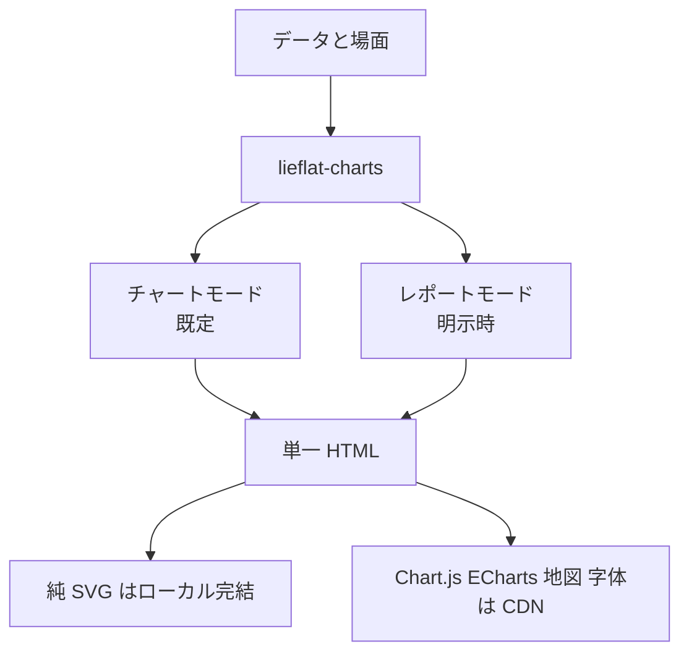
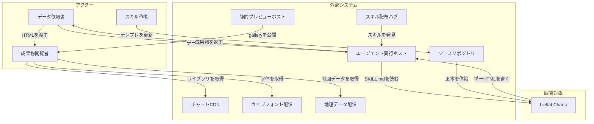
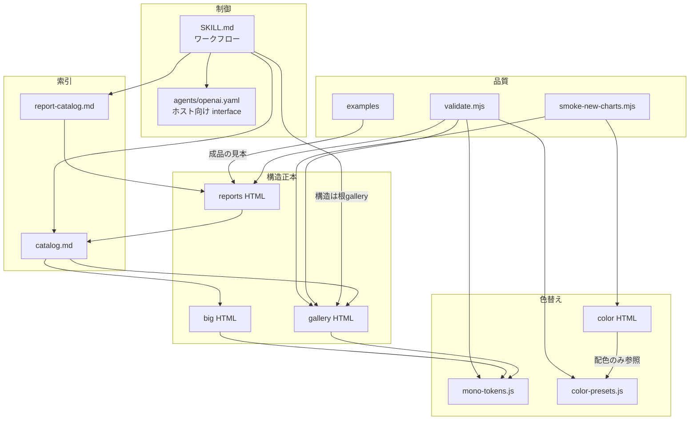
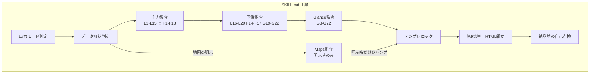
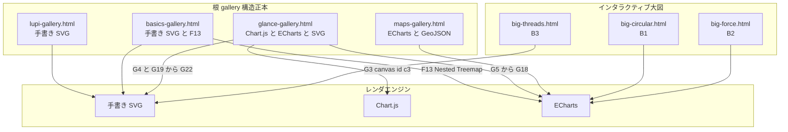
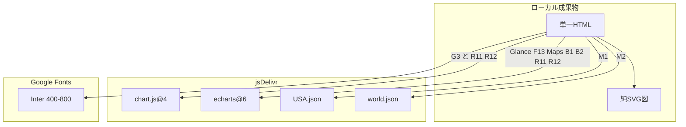
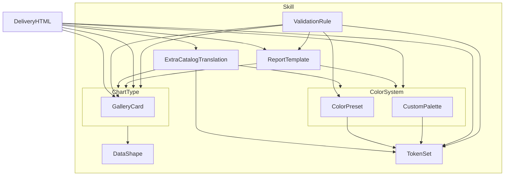
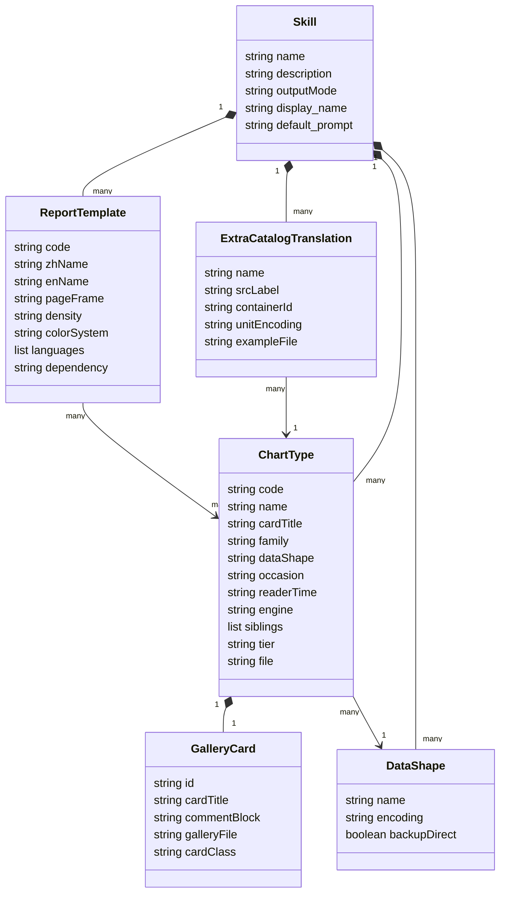
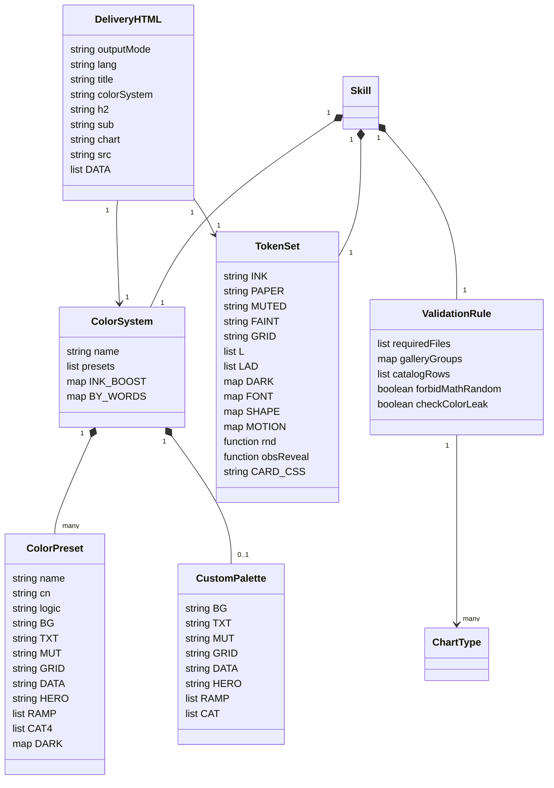

データを渡すと、エージェントがチャートを作ってくれる。ここまではよくある話です。問題は、そのチャートが毎回違う顔をしていることです。今日はドーナツ、明日は 3D 棒グラフ、色は虹色、軸は途中で切られている。数字は合っていても、資料として並べられません。

[Lieflat Charts](https://github.com/larashero3-dotcom/lieflat-charts) は、その「毎回違う」を潰しにきた Agent Skill です。データ形状から使う図型の番号を決め打ちし、リポジトリ内のテンプレートの骨格をそのまま複写して、ビルド不要の単一 HTML を返します。図型の選び方と編集文法をエージェント側に固定する、いわば編集レイヤです。

この記事では、Lieflat Charts の内部構造、参照するカタログとトークンのデータモデル、導入から運用までの手順を扱います。読み終えると、次が分かります。

- どのデータ形状にどの図型番号が割り当てられ、どう絞り込まれるか
- 成果物のどこがローカル完結で、どこが CDN 依存になるか
- 公開ドキュメントと実装のあいだにある差分を、どう読み分けるか

検証は 2026-09-06 時点の `main`（HEAD `eace082`、最終 push 2026-09-05）に対して行っています。


*この記事の全体像。以下、順に解説します。*

## Lieflat Charts とは

Lieflat Charts は、データと場面を渡すと単一 HTML のチャート、または 1 ページ完結のレポートを返す Agent Skill です。成果物はビルド不要で、ブラウザでそのまま開けます。形式は `SKILL.md` 互換なので、制作環境である [Moxt](https://moxt.ai/zh-CN/hub?view=skill&id=lieflat-charts) 以外に、Claude Code や Codex などの `SKILL.md` ホストでも動きます。

想定利用者は非プログラマです。書き手、運用担当、資料作成担当が日常語で依頼し、エージェントがデータ形状から図型番号をロックして、テンプレートの骨格で出図します。既定の成果物はチャートです。年報、月報、白書、ポスター、brief、notebook、dashboard レポートといった「1 ページ完結」を示すキーワードがあるときだけ、レポートテンプレート R01–R12 に入ります。`dashboard` 単独はレポートへの切り替え条件ではなく、Glance の使用を許可する条件です。

| 項目 | 値（2026-09-06 時点） |
|---|---|
| リポジトリ | https://github.com/larashero3-dotcom/lieflat-charts |
| 作成 | 2026-07-16T11:17:49Z |
| 最終 push | 2026-09-05T02:40:41Z |
| Stars | 約 4.7k（日次で動く値） |
| Forks | 281 |
| Open issues | 0（PR 込み。PR を除いた実 issue も 0） |
| 言語 / サイズ | HTML / 27108 KB |
| GitHub Pages | https://larashero3-dotcom.github.io/lieflat-charts/ |
| ライセンス | PolyForm Noncommercial 1.0.0 |

位置づけは、図型の選び方と編集文法をエージェントに固定するスキルです。チャートライブラリそのものとは層が違います。描画エンジンは手書き SVG が主で、Glance の一部、F13 Nested Treemap、地図、B1/B2 の大図、レポート R11/R12 だけが Chart.js または Apache ECharts を CDN 経由で呼びます。B3 は手書き SVG です。フォントは Google Fonts の Inter が基本です（レポートテンプレートはこれに CJK と表示用の書体が加わります）。第三者ライセンスは Chart.js が MIT、ECharts が Apache-2.0、Inter が SIL OFL 1.1 です。



### 図型件数は資料ごとにずれる

最初に注意点をひとつ共有します。「収録図型は何種類か」という基本的な数字が、参照する資料によって変わります。現時点で信頼できる正本は、`catalog.md` の表と `templates/` 配下の gallery 実体です。見出し、README、DeepWiki はそれぞれ別の世代を指しています。

| 資料 | 記載 | どの世代を指すか |
|---|---|---|
| `catalog.md` 見出し / `SKILL.md` 第 6 節本文の「63 张」 | 63 | 63 図型世代（`bdfdca2`、2026-09-03） |
| `catalog.md` 表の実数 | Glance 20 + Lupi 19 + Basics 17 + Maps 2 + Interactive 3 = **61** | 現行 main（`f39283b` 以降）。L18 欠番、Glance は G3–G22 |
| README.md / README.en.md の Templates 表 + Structure 節の「49 个」 | Lupi 15 / Basics 13 / Glance 18 / Interactive 3 = 49 | 49 図型世代（`842d3c7`、2026-08-07） |
| README.md のプレビュー文 | Lupi 19 / Glance 20 / Basics 17 | 現行 61 と一致 |
| README.en.md のプレビュー文 | Lupi 20 / Glance 21 / Basics 17 | 63 図型世代と一致 |
| DeepWiki | 48 図型、F1–F12、G1–G18 | 48 図型世代（`4b847c`、2026-08-06 indexed） |
| `SKILL.md` の残存記述 | G1 を OHLC 代替と Chart.js 骨格で参照 | 現行 catalog 表と glance-gallery は G3–G22 |

README.md と README.en.md は、どちらも同一ファイル内で世代が混在しています。両方とも Templates 表と Structure 節は 49 図型世代のままです。プレビュー文だけが後から更新されており、README.md は現行の 61 に追随、README.en.md は 63 図型世代で止まっています。

差分が生まれた経緯は、2026-09-03 に連続して打たれた 2 つの commit で説明できます。**64 → 63 → 61** と 3 図型が落ち、見出しだけが途中の値で取り残されました。

| commit | 見出し | 表の実数 | 何が起きたか |
|---|---|---|---|
| `bdfdca2~1` | 64 张 | 64 | Glance 22 + Lupi 20 + Basics 17 + Maps 2 + Interactive 3 |
| `bdfdca2` | 63 张 | 63 | `G2 Petal Rose` を削除（Glance 21）。見出しも 63 に更新 |
| `f39283b` | 63 张 | **61** | `G1 Range Capsules` と `L18 Beeswarm` を削除（Glance 20 / Lupi 19）。**見出しは据え置き** |

つまり L18 は「もともと欠番」ではなく、この日に消えたことによる欠番です。現行の見出し「63 张」は `bdfdca2` の値がそのまま残ったものです。

もうひとつ、この 2 コミットで削られた 3 図型（G1 / G2 / L18）は catalog の「已移除图型」リストに載っていません。そこに並ぶのは Polar Line、Punch Card、Release Rings、静的 Thread Triptych、Profile Equalizer、Slope Beads、Meridian Dots の 7 件です。G1 に至っては `SKILL.md` 第 4 節と第 9 節に参照が残っており、OHLC が始値・終値なしの min–max 区間だけのときは G1 を使う、と書かれたままです。

この差分は、開発速度に対してドキュメントの更新が追いついていない状態を示しています。実務上は「`catalog.md` の表と gallery 実体だけを見る」というルールで回避できますし、番号体系そのもの（G/L/F/M/B の接頭辞と主力・予備の区分）は一貫しています。今後、見出しの枚数と已移除リストが表の実体から自動生成されるようになれば、二次情報との照合コストがなくなり、外部ツールからカタログを機械的に読むこともしやすくなります。ここは期待したいポイントです。

## 特徴

- Agent Skills 形式です。`SKILL.md` が図型選定と差し戻し条件の規約になっています。
- 制作の本拠は Moxt です。Claude Code と Codex にも導入できます。
- 成果物はブラウザで直接開ける単一 HTML です。
- 既定はチャートです。1 ページ完結のキーワードがあるときだけ R01–R12 に入ります。
- 視覚を 2 つの速度に分けます。Lupi は 1 件ずつ読ませる細読、Glance は集約を速読させる用途です。Basics は見慣れた輪郭に数えられる単位を載せます。
- 選定順は固定です。Lupi Editorial → Lupi Basics → Glance の順に見ます。地図は明示要求時のみです。
- 主力は L1–L15 と F1–F13、予備は L16–L20、F14–F17、G19–G22 です。
- 点、目盛、ヘアラインは実単位です。面積は平方根で半径に換算します。棒は軸を切らず長さに比例させます。
- カードは結論タイトル、副題、図、出典の 4 点セットです。タイトルには図型名ではなく判断を書きます。
- 色は内蔵 4 系統（既定の Mono + porcelain / palm / wire の 3 プリセット）と、利用者指定の custom の計 5 択です。既定は紙灰と炭黒の Mono で、残る 3 つはデータの意味から自動選択します。custom はブランド色を明示したときだけ作ります。
- 同一 HTML、同一組の成果物では色系統を 1 つに固定します。
- 入場アニメーションは `quarticOut` です。スクロールで画面に入ったときに再生し、クリックで再演します。`prefers-reduced-motion` で縮退します。
- インタラクションは実データの記録にだけ付けます。装飾要素には付けません。
- レポート 12 種は中国語版と英語版が独立ファイルです。同じ版式を別業界のデータにも載せられます。
- ライセンスは学習、改変、共有、非商業までです。商業利用は別途許諾が必要です。

### 関連技術との関係

Lieflat Charts は Chart.js / ECharts の上に載る編集レイヤです。D3 / Observable Plot は図法をその場で組む層なので、目的が違います。姉妹スキルの lieflat-html-design は、プレゼン用デッキと小紅書（Xiaohongshu）向けのカード・長文を扱います。

| 関連技術 | 関係 |
|---|---|
| Chart.js | G3 とレポート R11/R12 が CDN で使う Canvas エンジン。`SKILL.md` は G1 も言及する |
| Apache ECharts | Glance の大半、F13 Treemap、地図 GeoJSON、B1/B2 の大図、R11/R12 が使う |
| 手書き SVG | Lupi Editorial と Basics の主経路。純 SVG はオフラインで開ける |
| D3 / Observable Plot | 文法または低レベル結合で図を組む。lieflat は gallery 骨格の再利用が先 |
| lieflat-html-design | 同一作者の 4 スキル。プレゼン用デッキ 12 組 + 小紅書（Xiaohongshu）長文 11 組 + 同カバー 11 組。MIT。データ契約カタログではない |
| 汎用の charts 系スキル | chart-designer は ECharts/Chart.js の option 生成、d3js-visualization は D3 の単体 HTML、aiz-infographic はインフォグラフィック HTML + PNG。図型ロックと編集規約の厚みは lieflat-charts 側 |

### 類似ツールとの比較

起動速度とリソース消費の定量ベンチマークは一次情報に記載がないため、ここでは扱いません。以下は実行モデルと成果物の差です。

| ツール | 実行方式 | 成果物の形 | 対応機能 |
|---|---|---|---|
| lieflat-charts | エージェントが `SKILL.md` + catalog + gallery を読み、テンプレートの骨格で単一 HTML を書く | ビルド不要の単一 HTML。純 SVG はローカル完結、Glance / 地図 / R11–R12 / フォントは CDN 依存 | 図型 61（うち地図 2 / インタラクティブ 3）、内蔵色 4 系統 + custom、レポート 12×2 言語 |
| Chart.js 直書き | option オブジェクトを埋め込む | 自分のページに埋め込む Canvas | 標準的な図。編集上の注記と図型ロックは利用者側の責務 |
| ECharts 直書き | 宣言的な option | 自分のページに埋め込む Canvas / SVG | 図型が広い。地図、サンキー、ツリー |
| D3 / Observable Plot | データ結合または Plot のマーク文法 | 自分で組む DOM / SVG | 任意の図法 |
| lieflat-html-design | 4 つの Agent Skill。テンプレート複製 | HTML / 画像。主対象は視覚スタイル | プレゼン資料 / 小紅書カード・長文 |

### ユースケース別の推奨

| やりたいこと | 第一候補 | 併記 |
|---|---|---|
| 年報、論文、長文記事、ポスター | Lupi Editorial | 疎なデータで見慣れた輪郭なら Basics |
| 棒、折れ線、ドーナツ、箱ひげ、ローソク足 | Lupi Basics | 同じ結論の粗い描画は Glance |
| 週報、監視、10 秒で順位と異常を見る | Glance | 関係を 1 件ずつ照会するなら Interactive |
| ノード 15 超のネットワーク | Interactive B1–B3 | 小さな模式図は G6 / G11 |
| 米国州または世界各国の塗り分け地図 | Maps M1/M2、明示要求時 | それ以外の地域（中国省級など）は適合データ源と法令要件の確認が先 |
| 調査 1 ページ、月報、dashboard、旅行記 | レポート R01–R12 | ページ内の図は catalog の実体 |
| オフライン配布 | 純 SVG の Lupi / Basics、レポートは R01–R10 | R11/R12 と地図は CDN のインライン化が追加作業 |
| Web アプリの業務ダッシュボード埋め込み | Chart.js または ECharts 直書き | lieflat は単一 HTML の編集成果物 |
| 社内デッキ、小紅書カード | lieflat-html-design | データ契約が主目的なら lieflat-charts |
| 商用プロダクトへの組み込み | MIT / Apache-2.0 の汎用ライブラリ | lieflat の商業利用は別途許諾 |


## 構造

Lieflat Charts はビルド不要の Agent Skills パッケージです。実行時サーバは持たず、エージェントがリポジトリ内のテンプレートを読んで単一 HTML を組み立てます。gallery は複数カードを 1 ページに並べた参照実装です。成果物は `SKILL.md` 第 9 節が定める単一 HTML です。`templates/color/` は配色の見本であり、構造の正本は `templates/` 直下の gallery です。

### システムコンテキスト図

利用者はデータと用途を渡し、単一 HTML を受け取ります。外部システムは、ホスト、配布、正本、そしてブラウザが依存する配信役です。



#### アクター

| 要素名 | 説明 |
|---|---|
| データ依頼者 | 非プログラマの依頼主体です。データと用途を日常語で渡し、チャートまたはレポートの単一 HTML を受け取ります。 |
| スキル作者 | テンプレート、カタログ、トークン、検証を更新する保守主体です。 |
| 成果物閲覧者 | 受け取った単一 HTML をブラウザで開く読者です。依頼者と同一人物のこともあります。 |

#### 調査対象と外部システム

| 要素名 | 説明 |
|---|---|
| Lieflat Charts | テンプレート駆動の可視化と、中英 2 言語の HTML レポートを生成するスキル本体です。既定はチャートです。 |
| エージェント実行ホスト | `SKILL.md` 互換の実行環境です。スキルを読み、HTML を書きます。 |
| スキル配布ハブ | スキルの発見とインストールの入口です。Moxt ハブと `npx skills` が該当します。 |
| ソースリポジトリ | テンプレートと規則の正本を置く公開リポジトリです。 |
| チャート CDN | ブラウザが Chart.js と ECharts を取得する配信役です。 |
| ウェブフォント配信 | ブラウザが Inter を取得する配信役です。 |
| 地理データ配信 | 地図図型が州境、国境の GeoJSON を取得する配信役です。 |
| 静的プレビューホスト | gallery と大図 HTML をそのまま公開する閲覧口です。 |

### コンテナ図

実行時の中核は、ワークフロー文書、2 つのカタログ、gallery、レポート HTML、2 つのトークンです。検証と実例は作者側の品質コンテナです。



| 区分 | 要素名 | 説明 |
|---|---|---|
| 制御 | `SKILL.md` ワークフロー | 出力モード判定、選定順序、描画骨格、納品前の自己点検の正本です。 |
| 制御 | `agents/openai.yaml` | Codex / OpenAI ホスト向けの interface です。表示名と既定プロンプトを渡します。 |
| 索引 | `catalog.md` | 図型番号、カード内タイトル、エンジン、gallery 対応の索引です。 |
| 索引 | `report-catalog.md` | R01–R12 の 1 ページ骨格、版面幅、色系統、依存の索引です。 |
| 構造正本 | gallery HTML | 複数カードを 1 ページに並べた参照実装です。カード構造と `// ════` 描画ブロックの正本です。 |
| 構造正本 | big HTML | 1 ファイル 1 図のインタラクティブ大図です。 |
| 構造正本 | reports HTML | 1 ページ完結レポートの複製元です。言語版は `.zh.html` と `.en.html` です。 |
| 色替え | color HTML | 直下 gallery の色替え見本です。配色照会専用です。 |
| 色替え | `mono-tokens.js` | Mono 視覚トークンの正本です。納品時は HTML へインライン化します。 |
| 色替え | `color-presets.js` | porcelain / palm / wire の色の正本です。フォント、角丸、アニメーションはトークン側です。 |
| 品質 | `validate.mjs` | 必須ファイル、gallery の id、catalog 行、色漏れ、`Math.random` を検査します。 |
| 品質 | `smoke-new-charts.mjs` | 新規図型コンテナの描画をブラウザでスモークテストします。地図系は対象外です。 |
| 品質 | examples | 実データまたは財務化した成果物 HTML です。 |

### コンポーネント図

納品までの経路は、カタログ番号のロック → gallery カードの複写 → 第 9 節の単一 HTML 組み立て、の 3 段です。



| 要素名 | 説明 |
|---|---|
| 出力モード判定 | 既定はチャートです。レポートのキーワードがあるときだけレポートモードです。 |
| データ形状判定 | 分類比較、時系列、構成、帰属、ネットワークなど、形状を選定の主キーにします。 |
| 主力監査 | L1–L15 と F1–F13 を先に比較します。 |
| 予備監査 | 主力で誠実に符号化できないとき L16–L20 / F14–F17 / G19–G22 を使います。F15 / F16 / F17 / L17 / L20 は形状が一致すれば直接使えます。 |
| Glance 監査 | Lupi Editorial と Lupi Basics がどちらも不適合、または速読要求があるときだけ G3–G22 を見ます。 |
| Maps 監査 | 地図、地域分布の明示があるときだけ M1 / M2 を見ます。 |
| テンプレロック | 系統、図型番号、gallery ファイル、カード内タイトルを記録し、そのカードの骨格を保ちます。 |
| 第 9 節単一 HTML 組立 | 複数カードのページを丸写しせず、カード 4 点セットとインライン化したトークンで単図または 1 ページを組む骨格です。 |
| 納品前の自己点検 | 比例、色系統の単一性、文字サイズ、`rnd`、reveal、候補の記録を点検します。 |

gallery とエンジンの対応は次のとおりです。



| 要素名 | 説明 |
|---|---|
| `lupi-gallery.html` | Lupi 系 19 枚のカード一覧ページです。エンジンは手書き SVG です。 |
| `basics-gallery.html` | Basics 系 F1–F17 のカード一覧ページです。F13 以外は手書き SVG です。 |
| `glance-gallery.html` | Glance 系 20 枚のカード一覧ページです。G3 は Chart.js、G5–G18 は ECharts、G4 / G19–G22 は手書き SVG です。 |
| `maps-gallery.html` | M1 / M2 のカード一覧ページです。ECharts の `registerMap` とオンライン GeoJSON を使います。 |
| `big-circular.html` | B1 の環状コード図です。コンテナ id は `ch`、ECharts の graph circular です。 |
| `big-force.html` | B2 の力学配置図です。コンテナ id は `ch`、ECharts の graph force です。 |
| `big-threads.html` | B3 の 3 段経路の糸図です。コンテナ id は `ch`、手書き SVG と透明な双子のヒット領域を使います。 |

エンジンの担当範囲は次のとおりです。手書き SVG が Lupi 全図と Basics の大半、Glance の waffle / violin / gheat / rankstrip / sankey、そして B3 を担います。Chart.js は `SKILL.md` 第 9 節と catalog の脚注が G1 / G3 を対象と記していますが、現行 gallery に実装カードがあるのは G3 Chunky Bars だけです。ECharts は Glance の大半、F13 Nested Treemap、Maps、B1、B2 を担います。

#### ネットワーク構成

純 SVG の図はローカルで完結します。Chart.js、ECharts、フォント、GeoJSON を残したまま納品すると、ブラウザが外部配信へ出ます。



| 要素名 | 説明 |
|---|---|
| 単一 HTML | 第 9 節の骨格による納品物です。トークンはインライン化しますが、ライブラリは CDN の script タグのまま残ることがあります。 |
| 純 SVG 図 | Lupi と Basics の大半です。インライン化していないフォント以外はオフラインで読めます。 |
| `chart.js@4` | `cdn.jsdelivr.net/npm/chart.js@4` です。G3 と R11 / R12 が読みます。 |
| `echarts@6` | `cdn.jsdelivr.net/npm/echarts@6/dist/echarts.min.js` です。 |
| `USA.json` | M1 が `registerMap` する米国州境です。パスは `gh/apache/echarts-examples@gh-pages/public/data/asset/geo/USA.json` です。 |
| `world.json` | M2 が `registerMap` する世界の国境です。パスは `npm/echarts@4.9.0/map/json/world.json` です。 |
| Inter 400-800 | `fonts.googleapis.com/css2?family=Inter:wght@400;500;600;700;800` です。`MONO.FONT.link` と同一で、gallery と単図はこれだけを読みます。レポートテンプレートは追加で書体を読みます（内訳は「成果物の配布」を参照）。 |

## データ

Lieflat Charts が扱う対象は、実行時のデータベースではなく、スキルが参照するカタログとトークンです。

### 概念モデル

所有関係はサブグラフの入れ子、利用関係は矢印で表しています。



| 要素名 | 説明 |
|---|---|
| Skill | Agent Skills 形式の可視化スキルです。frontmatter の name / description と、チャートモード / レポートモードを持ちます。 |
| ChartType | `catalog.md` の図型 1 件です。番号、データ形状、場面、読者の所要時間、エンジン、姉妹図型、主力 / 予備を持ちます。 |
| GalleryCard | gallery HTML 内の 1 カードです。カード内タイトル、`// ════` コメントブロック、コンテナ id で ChartType の実装を指します。 |
| DataShape | 図型選定の主キーです。比較、構成、系列、ネットワーク、OHLC などの契約を表します。 |
| ExtraCatalogTranslation | catalog 番号外の新規作図です。リポジトリ内の近い ChartType と TokenSet を借りて現場で組み立てます。 |
| ReportTemplate | `report-catalog.md` の R01–R12 です。版面幅、密度、色系統、言語 zh / en、依存を持ちます。 |
| ColorSystem | 同一納品に 1 つだけロックする色彩系統です。値は Mono / porcelain / palm / wire / custom です。 |
| ColorPreset | `color-presets.js` の内蔵 3 種です。BG / TXT / DATA / HERO / RAMP / CAT 系キーと DARK を持ちます。 |
| CustomPalette | 利用者が色値を明示したときだけ作る `CUSTOM` です。内蔵プリセットから色を借りません。 |
| TokenSet | `mono-tokens.js` の `window.MONO` です。INK / PAPER / MUTED / FONT / SHAPE / MOTION / rnd / obsReveal が正本です。 |
| ValidationRule | `scripts/validate.mjs` の検査項目です。 |
| DeliveryHTML | ビルド不要の単一ファイル成果物です。カード 4 点セットと単一色系統を守ります。 |

### 情報モデル

概念モデルと同じ 12 エンティティです。これは実装のクラス構造そのものではなく、カタログとトークンの関係を読み解くために再構成した説明用のモデルです。型名は string / number / boolean / list / map に限り、実際には関数である `rnd` と `obsReveal` だけ注記を添えています。図が大きいので、カタログ側とスタイル側の 2 枚に分けています。まずカタログ側です。



次にスタイルと検証と納品物です。



#### Skill と出力モード

| 属性 | 型 | 根拠 |
|---|---|---|
| name | string | `SKILL.md` frontmatter。値は `lieflat-charts` |
| description | string | 同 frontmatter。チャートと 12 種の中英レポート、単一色系統を述べる |
| outputMode | string | 第 0 節 0.1。既定はチャートモード。レポートのキーワードがあるときだけレポートモード |
| display_name | string | `agents/openai.yaml` の `Lieflat Charts` |
| default_prompt | string | 同 YAML。既定は HTML チャート。レポートキーワード時のみレポート |

#### ChartType の番号体系

| family | 番号 | 枚数 | 主力 / 予備 |
|---|---|---|---|
| Glance | G3–G22 | 20 | G3–G18 は降格候補。G19–G22 は予備 |
| Lupi Editorial | L1–L17, L19, L20 | 19 | L1–L15 主力。L16–L20 予備。L18 欠番 |
| Lupi Basics | F1–F17 | 17 | F1–F13 主力。F14–F17 予備 |
| Maps | M1–M2 | 2 | 明示時のみ |
| Interactive | B1–B3 | 3 | ノード 15 超、多段経路 |

データ形状から候補への圧縮は次のとおりです。矢印の順序は優先度ではありません。実際の選択は Lupi Editorial と Lupi Basics を先に見ます。

| データ形状 | Lupi / Basics 候補 | Glance へ降格した場合 |
|---|---|---|
| 少数分類の比較（8 以下） | F1 Rung Bars、F5 Tick Rows、L2 Dot Cascade | G3 Chunky Bars |
| 複数選択の百分率 | L15 Ballot Tally | G3 |
| 100% 構成 | L14 Hundred Field、F4 Tick Donut | G4 Dot Waffle |
| 日次系列 | F2 Hairline Line、F3 Hairline Area、L3 Barcode Lollipop | — |
| 正負の分類 | — | G10 Diverging Bar |
| ファネル | L13 Hourglass Stream | — |
| 多対一の帰属 | L5 Radial Convergence、L12 Type Colonnade | — |
| ネットワーク | L6 Cluster Field | G6 / G11。15 超は B1 / B2 |
| OHLC 4 値 | F17 を直接 | min–max のみは G1 の残存記述 |
| 五数要約 | F15 を直接 | G19 Violin は予備 |
| 年間カレンダー | L17 を直接 | — |
| 平行座標 | L20 を直接 | G9 Scatter Morph はデモ |
| 構成の連続時間変化 | F16 を直接 | — |
| 地図 | — | M1 / M2 は明示時のみ |

Glance のトリガーである「週報」は、第 0 節 0.1 のレポートキーワードではありません。週報で 10 秒の速読を求めれば Glance、1 ページ完結の週報レポートを求めれば R12 になります。

#### 図型契約インベントリ

`catalog.md` の表は 61 行です。姉妹図型は同じ主題を別構造で表す候補であり、両方を同時に生成することはしません。

| code | name | dataShape | engine | siblings | tier |
|---|---|---|---|---|---|
| G3 | Chunky Bars | 少数分類の順位 6 以下 | Chart.js | L2、複数選択は L15 | Glance 降格 |
| G4 | Dot Waffle | 100% 構成 | 手書き SVG | L14 | Glance 降格 |
| G5 | Pictorial Bar | 年次カウント | ECharts | なし | Glance 降格 |
| G6 | Circular Graph 小 | ネットワーク 12 以下 | ECharts 暗色カード | B1 | Glance 降格 |
| G7 | Tree LR | 階層 2–3 | ECharts | なし | Glance 降格 |
| G8 | Rainfall Dual Area | 二系列の因果 | ECharts | なし | Glance 降格 |
| G9 | Scatter Morph | 三次元の輪番表示 | ECharts universalTransition | なし | Glance 降格 |
| G10 | Diverging Bar | 正負の分類 | ECharts | Equalizer、Meridian Dots は削除済み | Glance 降格 |
| G11 | Force Graph 小 | 中心 + 衛星 15 以下 | ECharts 暗色カード | B2、L6 | Glance 降格 |
| G12 | Stagger Wave | 多分類 30–60 | ECharts | なし | Glance 降格 |
| G13 | Big Slice | 占有率 × 強度 | ECharts custom | なし | Glance 降格 |
| G14 | Single Axis | 曜日 × 時間 × 量 | ECharts | Punch Card は削除済み | Glance 降格 |
| G15 | Jitter Strip | 数百点の 1 件ずつ表示 | ECharts | なし | Glance 降格 |
| G16 | Bar Race | 順位の時間変化 | ECharts realtimeSort | なし | Glance 降格 |
| G17 | Dynamic Stream | 実時間スクロール | ECharts | なし | Glance 降格 |
| G18 | Draw-in + Counter | 累計増加 | ECharts | Release Rings は削除済み | Glance 降格 |
| G19 | Violin | 密度輪郭 + 中央値 | SVG | F15、L19 | 予備 |
| G20 | Matrix Heat Glance | 2 離散 × 数値 60 以下 | SVG | L16 | 予備 |
| G21 | Rank Strip | 静的な順位フィルム | SVG | G16 | 予備 |
| G22 | Aggregate Sankey | 両端集約の流量 | SVG | B3 | 予備 |
| L1 | Launch Fan | 誕生時期 + 現在規模 | SVG | なし | 主力 |
| L2 | Dot Cascade | 数えられる単位の順位 | SVG 暗色カード | G3 | 主力 |
| L3 | Barcode Lollipop | 90 日規模の日次系列 | SVG 全幅 | なし | 主力 |
| L4 | Arc Matrix | 分類 × 分類 + 量 | SVG | L9 | 主力 |
| L5 | Radial Convergence | 多対一の帰属 60 以下 | SVG | L12 | 主力 |
| L6 | Cluster Field | ポスター版ネットワーク | SVG 全幅 | B2 | 主力 |
| L7 | Brand Spectrum | 両極の尺度 | SVG | Equalizer は削除済み | 主力 |
| L8 | Dotty Matrix | 多グループ × 格子 | SVG | 読み取りは G14 | 主力 |
| L9 | Bubble Almanac | 分類 × 年 | SVG 全幅 | L4 | 主力 |
| L10 | Radial Patchwork | 時刻 × 規模の重ね | SVG | Polar Line は削除済み | 主力 |
| L11 | Trend Lineage | 事象の生涯 | SVG | なし | 主力 |
| L12 | Type Colonnade | 帰属 + 名簿 | SVG | L5 | 主力 |
| L13 | Hourglass Stream | 段階的な減少 | SVG | なし | 主力 |
| L14 | Hundred Field | 100% 構成 6 以下 | SVG | G4 | 主力 |
| L15 | Ballot Tally | 複数選択の百分率 6 以下 | SVG | G3 | 主力 |
| L16 | Matrix Heat | 2 離散 × 数値 100 以下 | SVG | G20 | 予備 |
| L17 | Calendar Heat | 52 週 × 7 日 | SVG 全幅 | F10 | 予備・直接可 |
| L19 | Ridgeline | 3–8 グループの密度 | SVG | G19 | 予備 |
| L20 | Parallel Coordinates | 3–6 連続次元 | SVG | G9 | 予備・直接可 |
| F1 | Rung Bars | 少数分類の比較 8 以下 | SVG | G3 | 主力 |
| F2 | Hairline Line | 日次系列 30 以下 | SVG | なし | 主力 |
| F3 | Hairline Area | 日次系列 30–60 | SVG | L3 | 主力 |
| F4 | Tick Donut | 100% 構成 6 以下 | SVG | G4 ⇄ L14 | 主力 |
| F5 | Tick Rows | 横並びの計数バー 8 以下 | SVG | L2 | 主力 |
| F6 | Paired Rungs | 今昔の対比はしご | SVG | なし | 主力 |
| F7 | Stacked Rungs | 積み上げ構成 | SVG | なし | 主力 |
| F8 | Plumb Scatter | 二次元散布 20 以下 | SVG | G15 | 主力 |
| F9 | Rung Waterfall | 増減分解 6 以下 | SVG | なし | 主力 |
| F10 | Dot Heat | 曜日 × 時間 × 量 | SVG | G14 | 主力 |
| F11 | Tick Gauge | 単一値の進捗 | SVG | G18 | 主力 |
| F12 | Dumbbell Queue | 前後対比 6 以下 | SVG | Slope Beads は削除済み | 主力 |
| F13 | Nested Treemap | 2 階層 + 正数の重み | ECharts SVG | G7 | 主力 |
| F14 | Rung Histogram | 度数分布 | SVG | G19、F15 | 予備 |
| F15 | Tick Box | 五数要約 + 外れ値 | SVG | G19、F14 | 予備・直接可 |
| F16 | Stream Ribbon | 多系列の連続構成流 | SVG 全幅 | F7 | 予備・直接可 |
| F17 | Candlestick | OHLC 4 値 | SVG | なし | 予備・直接可 |
| M1 | US Choropleth | 米国州 + 非負数値 | ECharts + GeoJSON | 明示時 | Maps |
| M2 | World Choropleth | 世界の国 + 非負数値 | ECharts + GeoJSON | 明示時 | Maps |
| B1 | `big-circular.html` | ネットワーク 60 ノードの環 | ECharts | G6 | Interactive |
| B2 | `big-force.html` | ネットワーク 180 ノードの力学配置 | ECharts | G11 / L6 | Interactive |
| B3 | `big-threads.html` | 3 段経路 100 本超の糸 | 手書き SVG | G22 | Interactive |

主力を検討せずに予備を直接使ってよいのは、次の 5 形状だけです。

| データ形状 | 直接指定できる ChartType |
|---|---|
| OHLC 4 値の相場 | F17 |
| 五数要約 + 外れ値 | F15 |
| 同一実体の 3–6 連続次元 | L20 |
| 通年 52 週 × 7 日の日付ヒートマップ | L17 |
| 多系列構成が連続時間で変化し、同時に総量も見る | F16 |

#### GalleryCard の必須 id

`validate.mjs` が必須とする id は、新規図型の分だけです。

| group | 必須 id |
|---|---|
| basics | treemap、histo、boxplot、stream、candle |
| lupi | matheat、calheat、ridge、parallel |
| glance | violin、gheat、rankstrip、sankey |
| maps | mapus、mapworld |

B 系は 1 ファイル 1 図なので、コンテナ id はどれも `ch` です。Glance の G17 と Basics の F16 は別ファイルでどちらも id `stream` ですが、同一 HTML 内の重複ではありません。

#### ExtraCatalogTranslation

catalog 番号の外にある図です。`SKILL.md` 第 6 節の翻案フローで作ります。`examples/lenny-2026-survey.html` の Hundred Faces と Ballot Rings が実例です。同ファイル内の他 6 図は L12、L15、F5、L13、L7、L5 に対応します。

| 属性 | 例 |
|---|---|
| name | Hundred Faces、Ballot Rings |
| containerId | `faces`、`rings` |
| unitEncoding | 1 顔 = 100 人中 1 人。1 目盛 = 100 人中 1 人 |
| exampleFile | `examples/lenny-2026-survey.html` |

#### ReportTemplate

| code | 中文名 / English name | 版面幅 | 密度 | 色系統 | 依存 |
|---|---|---|---|---|---|
| R01 | 调研一页纸 / Survey One-Pager | 1080 | 3 図、中 | Porcelain | フォント通信 |
| R02 | 年度里程碑 / Annual Milestones | 980 | 3 図、中 | Palm | フォント通信 |
| R03 | 年度数据海报 / Year in Data | 1080 | 4 図、やや高 | Wire | フォント通信 |
| R04 | 月度运营 / Monthly Ops | 1080 | 4 図、やや高 | Porcelain | フォント通信 |
| R05 | 影响力故事 / Impact Story | 760 | 2 図、低 | Mono | フォント通信 |
| R06 | 产品八年年鉴 / Eight-Year Product Almanac | 980 | 4 図、高 | Palm | フォント通信 |
| R07 | 调研拼贴海报 / Survey Collage Poster | 980 | 5 図、非常に高 | Palm | フォント通信 |
| R08 | 单位人群一页 / Population One-Pager | 880 | 2 図、低 | Wire | フォント通信 |
| R09 | 数据故事仪表盘 / Data Story Dashboard | 1080 | 4 図 + KPI、高 | Porcelain | フォント通信 |
| R10 | 旅行手记 / Travel Notebook | 980 | 4 図 + 表、中 | Palm | フォント通信 |
| R11 | 研究简报卡 / Research Brief Card | 600×1000 | 2 図、定尺 | Mono | Chart.js + ECharts CDN |
| R12 | 周报速览 / Weekly Glance | 1080 | 4 図、高 | Palm | Chart.js + ECharts CDN |

スロットに入る図は `catalog.md` の ChartType を再利用します。レポートテンプレートのレイアウトがデータ契約を迂回することはありません。


#### ColorPreset の実キー

`CAT` という単一キーはありません。実在するのは CAT4 / CAT3 / CAT3L です。porcelain に `CAT3L` はありません。

| キー | porcelain | palm | wire |
|---|---|---|---|
| 名称 | 青瓷蓝 | 椰林绿 | 编辑部红 |
| logic | ordinal | categorical | mono+accent |
| BG | `#F7F2EB` | `#F0EFEB` | `#F0F0EE` |
| TXT | `#081F5C` | `#58402E` | `#1F1E1C` |
| MUT | `rgba(8,31,92,.60)` | `rgba(88,64,46,.60)` | `rgba(31,30,28,.60)` |
| GRID | `rgba(8,31,92,.16)` | `rgba(88,64,46,.16)` | `rgba(31,30,28,.16)` |
| DATA | `#334EAC` | `#43593B` | `#22211F` |
| HERO | `#081F5C` | `#D4A017` | `#F5572F` |
| CAT4 | `#081F5C` `#334EAC` `#7096D1` `#BAD6EB` | `#43593B` `#77835A` `#ACAD79` `#F2D17E` | `#F5572F` `#22211F` `#8F8E86` `#C0BFB7` |
| RAMP | `#D0E3FF` `#BAD6EB` `#7096D1` `#334EAC` `#081F5C` | `#F2D17E` `#ACAD79` `#929960` `#77835A` `#43593B` | `#DBDAD3` `#C0BFB7` `#8F8E86` `#22211F` `#F5572F` |
| CAT3L | キーなし | `#43593B` `#77835A` `#ACAD79` | `#F5572F` `#22211F` `#6E6D66` |
| DARK | あり | あり | キーなし |

`INK_BOOST` は `strokeScale` が `1.8`、`opacityFloor` が `0.85`、例外は `dot heat` です。wire の HERO は蛍光オレンジ `#F5572F` で、1 図に 1 要素だけ使います。wire のインタラクティブ大図は用意されておらず、大図の彩色は porcelain / palm のみで、wire の場合は元の Mono を使います。なお porcelain のコメントは「分類 4 超で Mono へ戻す」、第 6.5 節は「分類 6 超で Mono」と書いています。運用の正本は `SKILL.md` 側です。


#### TokenSet の主要値

| 属性 | 値 |
|---|---|
| INK | `#1C1C1A` |
| PAPER | `#F0EFEB` |
| MUTED | `#8F8E88` |
| FAINT | `#C6C5BF` |
| GRID | `#DEDDD6` |
| L | `#1C1C1A` `#4A4944` `#6A6963` `#8F8E88` `#B0AFA9` `#C6C5BF` `#D8D7D1` |
| FONT.family | Inter |
| FONT.minHalf / minWide | 6.5 / 5.5 |
| SHAPE.cardRadius | 24 |
| SHAPE.barRadius | 99 |
| MOTION.enter | 900 |
| MOTION.easing | quarticOut |
| rnd | 決定論的 PRNG。`Math.random` は禁止 |
| obsReveal | 交差監視で描画し、クリックで再生 |

custom の必須ロールは `BG` `TXT` `MUT` `GRID` `DATA` です。HERO / RAMP / CAT は条件付きです。成果物へ `CUSTOM` としてインライン化し、`color-presets.js` へは書き戻しません。

#### DeliveryHTML のカード 4 点セット

| 属性 | 根拠 |
|---|---|
| h2 | 結論を述べるタイトル。図型名は禁止 |
| sub | 副題。凡例と時間範囲を `·` 区切りで書く |
| chart | ECharts は `.ch`、SVG は `svg`、Chart.js は `wrap > canvas` |
| src | 出典行。全大文字、字間あり |

1 図は 1 つの独立した結論です。1 ページの既定上限は 6 枚です。

## 導入方法

Lieflat Charts は npm ライブラリではありません。ルートに `SKILL.md` を置く Agent Skills なので、ビルド工程はありません。

### 前提

- Agent Skills 対応ホストが必要です。README が挙げる対象は Moxt、Claude Code、Codex、その他 `SKILL.md` 互換エージェントです。
- 推奨経路の Moxt はハブからスキルを読むため、ローカルへの clone は必須ではありません。
- `npx skills add` を使う場合は Node.js と npm が必要です。
- CLI の npm パッケージ名は `skills` で、リポジトリは [vercel-labs/skills](https://github.com/vercel-labs/skills) です。
- 公開パッケージ `skills@1.5.23` の `engines` 宣言は `node: ">=22.20.0"` です。ドキュメントの Installation は「Node.js 18 or higher」と書いており、記述が食い違っています。ただし npm の `engines` は既定では警告（`EBADENGINE`）止まりなので、これより古い Node でも実行自体は通ります（v22.17.0 で `npx skills --version` と `--list` が動くことを確認）。挙動が怪しいときに最初に疑う箇所として覚えておく程度で十分です。
- ライセンスは PolyForm Noncommercial 1.0.0 です。

```text
ホスト
  ├─ Moxt（推奨・制作環境。ローカル clone 不要）
  ├─ Claude Code（~/.claude/skills/lieflat-charts）
  ├─ Codex（~/.codex/skills/lieflat-charts）
  └─ その他 SKILL.md 互換エージェント
インストール手段
  ├─ npx skills add（vercel-labs/skills CLI）
  └─ git clone + 必須ファイル検査
```

### バージョン確認

GitHub には Release `v1.1.0`（2026-08-05、彩色対応）と `v1.2.0`（2026-08-14、レポートモード）があります。HEAD `eace082`（2026-09-05）はタグより新しいので、日常の確認は `git log -1` で行います。Skills CLI は `npx skills --version` です。調査時点の npm latest は `1.5.23` でした。

```bash
node --version
npx skills --version
npm info skills version
```

```bash
git -C ~/.claude/skills/lieflat-charts log -1 --oneline
```

### Moxt での利用

README は Moxt を「ネイティブな制作環境」かつ「手順がより短い推奨利用方法」としています。ハブの URL は [中国語版](https://moxt.ai/zh-CN/hub?view=skill&id=lieflat-charts)と[英語版](https://moxt.ai/hub?view=skill&id=lieflat-charts)があります。

| 作業 | 通常の一問一答 | Moxt |
|---|---|---|
| 設計言語の理解 | スキルファイルから都度再構築 | 同じエージェント環境で設計・検証済み |
| 規則・テンプレート・データ | 毎回アップロードやパス指定 | 同一ワークスペースに残る |
| 複数ターンでの図の入れ替え | 会話が変わると背景の再説明が必要 | 既存ファイルと文脈を継続 |
| 最終成果 | チャットや一時ディレクトリに残りやすい | HTML をデータ・テンプレートと同居させて改稿 |


### npx skills add

README が示す 1 行コマンドです。パッケージの解決先は npm の `skills` です。CLI はリポジトリ内の `SKILL.md` を発見するので、`--skill lieflat-charts` でその 1 件に絞ります。

```bash
npx skills add https://github.com/larashero3-dotcom/lieflat-charts --skill lieflat-charts
```

README の 1 行には `-g` がありません。既定はプロジェクト配下の `./<agent>/skills/` です。ホームの Claude / Codex 経路と揃えるときは `-g` を足します。

| オプション | 意味 |
|---|---|
| `-g, --global` | ユーザーディレクトリへ入れる |
| `-a, --agent` | 例: `claude-code`、`codex` |
| `-s, --skill` | スキル名。本リポジトリは `lieflat-charts` |
| `-l, --list` | 入れずに一覧表示 |
| `-y, --yes` | 確認を省略 |
| `--copy` | symlink ではなくコピー |

```bash
npx skills add https://github.com/larashero3-dotcom/lieflat-charts --skill lieflat-charts -g -a claude-code -a codex -y
npx skills list
npx skills ls -g
```

### git clone で入れる

README はエージェントに次の文面を渡す方法も示しています。パスは Skills CLI の Claude Code グローバル経路と一致します。

```text
帮我安装 lieflat-charts。请把 https://github.com/larashero3-dotcom/lieflat-charts
克隆到 ~/.claude/skills/lieflat-charts，安装完成后检查 SKILL.md、templates/、
catalog.md 和 mono-tokens.js 是否存在。
```

同じことをシェルで行うなら次のとおりです。

```bash
git clone https://github.com/larashero3-dotcom/lieflat-charts.git ~/.claude/skills/lieflat-charts
test -f ~/.claude/skills/lieflat-charts/SKILL.md \
  && test -d ~/.claude/skills/lieflat-charts/templates \
  && test -f ~/.claude/skills/lieflat-charts/catalog.md \
  && test -f ~/.claude/skills/lieflat-charts/mono-tokens.js \
  && echo OK
```

| パス | 役割 |
|---|---|
| `SKILL.md` | ワークフローと強い制約 |
| `templates/` | gallery / インタラクティブ大図 / 色見本 / レポートテンプレート |
| `catalog.md` | 図型のデータ契約索引 |
| `mono-tokens.js` | 共有の視覚トークン |

Codex は同じ手順でパスだけ差し替えます。プロジェクトスコープの Codex は `.agents/skills/` ですが、README の clone 文はグローバル側の `~/.codex/skills/` を指しています。

```bash
git clone https://github.com/larashero3-dotcom/lieflat-charts.git ~/.codex/skills/lieflat-charts
```

### 更新

clone した場合はディレクトリで `git pull` します。`npx skills add` で入れた場合の公式手順は `npx skills update` です。

```bash
git -C ~/.claude/skills/lieflat-charts pull
git -C ~/.claude/skills/lieflat-charts log -1 --oneline
npx skills update lieflat-charts -g -y
```

## 利用方法

スキルに CLI 引数はありません。エージェントへの依頼文がそのまま入力です。

### 必須パラメータ

| パラメータ | 必須 | 既定 | 説明 |
|---|---|---|---|
| データ | 必須 | なし | 表、CSV、論文、指標。形状が図型選定の主キー |
| 出力モード | 暗黙的に必須 | チャート | レポートキーワードがない限りチャート。「分析」だけではレポートに上げない |
| 言語 | 任意 | 入力言語 | レポートテンプレートは `.zh.html` と `.en.html` の 2 言語のみ。混ぜない |
| 図数 | 任意 | 独立した結論の数 | 明示時は遵守。重複する結論は削る |
| 色 | 任意 | 自動。不明確なら Mono | porcelain / palm / wire / custom。同一 HTML は 1 色系統 |
| 系統指定 | 任意 | Lupi Editorial → Lupi Basics → Glance | Glance / dashboard / 3 秒速読は明示時のみ |
| 地図 | 任意 | 使わない | 「地図」「地域分布」などの明示時のみ Maps |

### 毎回たどる 6 ステップ

1. データ形状を判定します。
2. 主力の L1–L15 と F1–F13 を先に監査します。少なくとも 3 候補を比較します。
3. Lupi と Basics が全滅したとき、または Glance の明示があるときだけ Glance を見ます。
4. catalog の番号と gallery の実体をロックしてから 1 ページを組みます。
5. 図数ルールで回数を決めます。テンプレートは重複させません。
6. テンプレートの骨格で描き、色系統を 1 つにロックして自己点検します。

```text
依頼
  ├─ レポートキーワードなし → チャートモード
  │     Lupi Editorial → Lupi Basics → Glance
  │     Maps は明示時のみ
  └─ レポートキーワードあり → レポートモード
        report-catalog.md で R01–R12 を 1 つ選び、スロットは catalog の実図型
```

### チャートモードの依頼例

README が示す例はいずれも中国語です。各例の下に意味を添えます。

```text
把这份调研数据做成适合公众号长文的 5 张中文版图表。
默认先比较 Lupi Editorial 和 Lupi Basics 候选；两组都不适配时，再使用 Glance。
```

この調査データを、長文記事に合う中国語版のチャート 5 枚にしてください。まず Lupi Editorial と Lupi Basics の候補を比較し、どちらも合わないときだけ Glance を使ってください。

```text
帮我用 lieflat charts 给这些数据做个彩色风格的图表。
```

lieflat charts で、このデータを彩色スタイルのチャートにしてください。

```text
这是一份周报数据，要求 10 秒内看懂排名、变化和异常。
```

これは週報のデータです。10 秒で順位、変化、異常が読み取れるようにしてください。

```text
用青瓷蓝预设重做这张图，用明度深浅表示数值大小，不改变原图的结构。
```

このチャートを porcelain（青瓷蓝）プリセットで作り直してください。数値の大小は明度で表し、元の構造は変えないでください。

日本語で依頼した場合、`SKILL.md` は「利用者が言語を指定しないときは入力言語に従う」と定めています。ただしレポートテンプレートに実在するのは `report-NN.zh.html` と `report-NN.en.html` だけなので、レポートモードでは版面として中国語版か英語版のどちらかを選ぶことになります。

### レポートモードへの切り替えキーワード

既定はチャートです。`SKILL.md` 第 0 節 0.1 は、レポートキーワードがない依頼をレポートへ格上げすることを禁じています。曖昧なときはチャートの最も強い 1 枚、または 2–3 枚の根拠図を出し、いきなりレポートにはしません。

第 1.1 節が定めるレポートモードの 7 手順は次のとおりです。

1. `report-catalog.md` で少なくとも 3 候補を比較します。
2. 言語と R0N ファイルを 1 つに固定します。
3. 主結論を既存のタイトル、リード文、KPI、図表、注記、末尾のスロットへ割り当てます。
4. スロットごとに `catalog.md` で図型を選定します。
5. 対応する HTML を複製し、デモデータ、デモ出典、Moxt リンク、元の結論をすべて置換します。
6. 色系統はテンプレートの現行色、または全体を Mono / 単一プリセット / custom へ置換します。部分的な混在はしません。
7. 版面幅、章順、定尺、中英フォントを点検します。

| 言語 | キーワード |
|---|---|
| 中文 `SKILL.md` | 报告 / 报告模板 / 年报 / 月报 / 白皮书 / 调研一页纸 / 海报 / brief / notebook / dashboard 报告 |
| English README | report / annual report / monthly report / white paper / poster / brief / similar narrative deliverable |

### 図数ルール

枚数は独立した結論の数です。データの列数ではありません。

| リクエスト | 既定枚数 | 規則 |
|---|---:|---|
| 単一の問い / 単表 / 単指標 | 1 | 最も強い 1 枚だけ |
| 2〜3 の明確な結論 | 2–3 | 1 図 1 結論 |
| 記事・論文・完成した事例 | 4–6 | 総覧、構成、比較、関係、変化など形状を分ける |
| 利用者が枚数を指定 | その数 | 重複は削除 |

1 ページの既定上限は 6 枚です。超えたら分割するか章単位にします。`examples/lenny-2026-survey.html` は規則が確定する前の 8 図構成で、現行のスキルは同種の記事を 4–6 枚に絞ります。

### 単一 HTML の骨格

納品物は常に単一 HTML です。gallery はカードを並べた参照実装なので、丸ごとコピーしません。ここで踏みやすいのがコンテナの取り違えです。Chart.js は `<canvas>`、ECharts は `<div class="ch">` です。次は第 9 節の骨格の抜粋で、警告コメントは原文どおり残しています。

```html
<!doctype html>
<html lang="en">
<head>
<meta charset="utf-8" />
<meta name="viewport" content="width=device-width,initial-scale=1" />
<title>Mono — {図名}</title>
<script src="https://cdn.jsdelivr.net/npm/echarts@6/dist/echarts.min.js"></script>
<link rel="preconnect" href="https://fonts.googleapis.com">
<link href="{MONO.FONT.link}" rel="stylesheet">
<style>/* MONO.CARD_CSS をインライン化 */</style>
</head>
<body>
<div class="grid2">
  <div class="card">
    <h2>{結論を述べるタイトル}</h2>
    <div class="sub">{説明} · {凡例} · {時間範囲}</div>
    <div class="ch" id="ch"></div>
    <!-- ⚠️ Chart.js 必须挂 <canvas>，套 <div class="ch"> 会报 can't acquire context -->
    <div class="src">{図型名} · {系統} · {データ出典}</div>
  </div>
</div>
<script>
const DATA = [ /* ... */ ];
MONO.obsReveal('ch', el => { /* ... */ });
</script>
</body>
</html>
```

Chart.js のコンテナは次のとおりです。

```html
<div class="wrap"><canvas id="ch"></canvas></div>
<style>.wrap{position:relative;height:320px}</style>
```

### 図型の探し方

1. `catalog.md` で図型番号をロックします。
2. 対応する gallery を開きます。
3. カード内タイトルで `<div class="card">` を探します。
4. `<script>` 内の同名の `// ════` コメントブロックから描画コードを取ります。

```text
catalog.md の番号
  → templates/{lupi|basics|glance|maps}-gallery.html または big-*.html
    → <div class="card">（カード内タイトル）
      → // ════ 図型名 ════
```

`templates/color/` は配色見本であり、構造の正本ではありません。

### 色の指定

利用者が「彩色」と言わなくても、データの意味から自動選択します。不明確なら Mono です。同一 HTML または同一組では 1 色系統だけを使います。

| 指定 | いつ使うか | 役割 |
|---|---|---|
| 自動 / Mono | 既定の保険。関係が不明、分類 6 超 | 紙灰と炭黒、7 段階のグレースケール |
| porcelain | 順序あり・単系列。「青 / 寒色 / 学術」 | 単一色相の明度階調。DATA は `#334EAC` |
| palm | 順序なしの分類 4 以下 | 色相で分類。DATA `#43593B`、HERO `#D4A017` |
| wire | 視線の落としどころを 1 つに制御 | グレースケール + 蛍光オレンジ HERO `#F5572F` |
| custom | ブランド色・色値の明示時のみ | 成果物にインライン化。`color-presets.js` には戻さない |

```javascript
// 役割キーは SKILL.md 第 6.5 節の必須セット。色値は一次情報に無い実装例
const CUSTOM = {
  BG: '#FAF7F2',
  TXT: '#1A1814',
  MUT: 'rgba(26,24,20,.60)',
  GRID: 'rgba(26,24,20,.16)',
  DATA: '#3D5A3A',
  HERO: '#B85C38'
};
```

### テンプレートをブラウザで開く

ローカルでは `templates/` の HTML を直接開きます。ビルドは不要です。インタラクティブな公開例は GitHub Pages にあります。

```text
https://larashero3-dotcom.github.io/lieflat-charts/templates/big-force.html
https://larashero3-dotcom.github.io/lieflat-charts/templates/lupi-gallery.html
https://larashero3-dotcom.github.io/lieflat-charts/templates/reports/index.html
```

### agents/openai.yaml の default_prompt

```yaml
interface:
  display_name: "Lieflat Charts"
  short_description: "Template-driven charts and bilingual HTML reports"
  default_prompt: "Use $lieflat-charts to turn this data into polished HTML charts by default. Only generate a complete bilingual-ready report when the user explicitly asks for a report, annual/monthly report, white paper, poster, brief, or similar narrative deliverable. Reuse the closest chart or report templates with one coherent color system."
```

## 運用

### テンプレートの更新

更新方法は導入経路で分かれます。`git clone` で入れた場合は再インストールではなく `git pull` です。`npx skills add` で入れた場合、Skills CLI はコピー時に `.git` を除外するため `git pull` は使えず、`npx skills update lieflat-charts -g -y` を使います。更新後は必須ファイルの確認に加えて、公開前検証を回します。図型数は README の表、`catalog.md` の見出し、gallery 実体で食い違うため、二次情報の古い件数は判断材料にしません。

```bash
cd ~/.claude/skills/lieflat-charts
git pull
git log -1 --oneline
node scripts/validate.mjs
```

### 公開前検証

入口は `scripts/validate.mjs` だけです。GitHub Actions のワークフローは 2026-09-06 時点で存在しないため、検証は手元で回す前提になります。失敗時は `process.exit(1)` です。`.git`、`.playwright-cli`、`node_modules`、`output` は走査対象外です。

| 区分 | 何を見るか |
|---|---|
| 必須ファイル | README、LICENSE、`SKILL.md`、catalog、mono-tokens、color-presets、openai.yaml、report-catalog、reports index |
| 色板テンプレート 19 | color の README と 4 gallery × 3 色、および big-* の porcelain / palm |
| レポートテンプレート | `report-NN.{zh,en}.html` × 12 と `docs/assets/reports/report-NN.png` × 12 |
| 必須 id | treemap / histo / boxplot / stream / candle、matheat / calheat / ridge / parallel、violin / gheat / rankstrip / sankey、mapus / mapworld |
| 番号の文言 | Basics は `F1–F17\|17 张`、Lupi は `L1–L19\|19 张`、Glance は `20 张\|Glance 20` |
| SKILL の強い制約 | 「L1–L15 与 F1–F13」、予備の例外 5 件、custom のロール BG TXT MUT GRID DATA |
| PRESETS | `PRESETS.get('porcelain'/'palm'/'wire')` が対応する定数を返すか |
| インライン JS | 全 HTML の `<script>` を `vm.Script` で構文検査 |
| 重複 id | 同一 HTML 内の `id` 重複を行番号付きで検出 |
| レポート契約 | 各 HTML が `<!doctype html>` と `<title>` を持つか |
| Math.random | 実行コード中の検出を禁止 |
| 色漏れ | 色板 HTML は所属プリセット以外の hex/rgba を検出。非色板は RGB 差 18 超の hex を検出。`color-presets.js` と `templates/reports/` は対象外 |

```bash
node scripts/validate.mjs
```

### スモークテスト

Playwright はリポジトリに同梱されていません。グローバルの `npm root -g` 配下の `playwright` を ESM から明示的に import します。対象は gallery / porcelain / palm / wire の 4 サフィックス、つまり元の gallery と色板 3 種です。basics / lupi / glance で合計 12 gallery を回します。maps は対象外です。

各ページは初期状態で 2.5 秒待ちます。gallery は IntersectionObserver による遅延描画なので、各 id へ `scrollIntoView({ block: 'center' })` してから 1.2 秒待ちます。失敗条件はコンテナ不在、幅 50 未満または高さ 30 未満、描画された子要素 3 未満、`console.error` / `pageerror` の発生です。

```bash
npm install -g playwright
npx playwright install chromium
node scripts/smoke-new-charts.mjs
```

### 成果物の配布

納品物はビルド不要の単一 HTML です。オープンな配布時は `mono-tokens.js` の全文と、選んだ 1 種の `color-presets.js` を HTML へインライン化します。既定テンプレートはフォントをインライン化しません。純 SVG は依存をインライン化するか除去すればオフラインで動きます。レポートでオフラインを優先するなら R01–R10 です。R11/R12 は Chart.js + ECharts の CDN 対応が追加で必要になります。ただし R01–R10 もチャートライブラリが不要なだけで、CJK フォントの通信は残ります（`report-catalog.md` の依存欄が「字体联网」と書いているのはこれです）。R04 は Oswald、R05 / R08 / R09 は Inter + Noto Sans SC のみと、テンプレートによって読む書体の数が違います。唯一 R11 だけがフォントの `<link>` を持たず、ローカル書体の指定だけで組まれています。完全オフラインにするならフォントもインライン化するか、ローカル書体に差し替えます。

| 依存 | 既定の読み込み先 | 必要な図 |
|---|---|---|
| Inter | Google Fonts css2 Inter 400-800 | gallery と単図。レポートも基本書体として読む（R11 を除く） |
| ECharts 6 | jsDelivr `echarts@6` | Glance の大半、F13、B1/B2、M1/M2、R11/R12 |
| Chart.js 4 | gallery / R11 / R12 は `https://cdn.jsdelivr.net/npm/chart.js@4`。`SKILL.md` 第 9 節は `.../chart.js@4/dist/chart.umd.min.js` | G3、R11/R12 |
| Noto Sans SC | Google Fonts css2 | レポート**中国語版**の R01–R10、R12（英語版と R11 は読まない） |
| Noto Serif SC | Google Fonts css2 | 中国語版の R01、R02、R03、R06、R07、R10 |
| 表示用書体 | Google Fonts css2 | R01 Source Serif 4 / R02 Playfair Display / R03 Fraunces / R04 Oswald / R07 JetBrains Mono / R10 Roboto Slab。中英とも読む |
| USA GeoJSON | echarts-examples の `USA.json` | M1 |
| World GeoJSON | `echarts@4.9.0` の `world.json` | M2 |

```html
<link href="https://fonts.googleapis.com/css2?family=Inter:wght@400;500;600;700;800&display=swap" rel="stylesheet">
<script src="https://cdn.jsdelivr.net/npm/echarts@6/dist/echarts.min.js"></script>
<script src="https://cdn.jsdelivr.net/npm/chart.js@4/dist/chart.umd.min.js"></script>
```

### GitHub Pages での gallery 閲覧

Pages は `main` のリポジトリルートを legacy ビルドしています。公開 URL は `https://larashero3-dotcom.github.io/lieflat-charts/` です。gallery は IntersectionObserver による遅延描画なので、画面外のカードはスクロールするまで空に見えます。

### ライセンス運用

本リポジトリの正本は PolyForm Noncommercial License 1.0.0 です。GitHub API の `license` は Other / NOASSERTION を返すので、MIT ではありません。許可されるのは非営利目的、個人の研究、学習、趣味、および慈善、教育、公的研究、公衆安全・公衆衛生の組織、環境保護、政府機関の利用です。商業利用は README のとおり別途許可が必要です。

Chart.js は MIT、Apache ECharts は Apache-2.0、Inter は SIL OFL 1.1 で、これらは PolyForm の対象外です。`THIRD_PARTY_NOTICES.md` に同じ 3 件と、jsDelivr / Google Fonts 経由の読み込みが記載されています。署名は推奨扱いで、納品成功時に作者名への言及を促しますが、成果物への強制挿入はしません。

## ベストプラクティス

### 納品前の自己点検

納品前に次を全部通します。1 つでも落ちたら差し戻しです。

- 数値と視覚が比例しているか。面積は平方根か。棒の軸を切っていないか。
- 色板が 1 系統か。
- ラベルが重なっていないか。
- 最小文字サイズを割っていないか（半幅 6.5px、全幅 5.5px）。
- デモデータが `rnd` の決定論的な値か。
- reveal がスクロールで再生され、クリックで再演し、タイマーが重ならず、`prefers-reduced-motion` で縮退するか。
- カード 4 点セットが揃っているか。タイトルが図型名になっていないか。
- 副題だけで凡例が読めるか。
- `<script>` を抜き出して `node --check` 相当の構文検査が通るか。
- 全候補の監査を書いたか。少なくとも 3 候補と、それぞれの不採用理由があるか。
- 1 ページ多図ならテンプレートを全体に配分したか。同形の繰り返しや暗色カードの多用がないか。
- 各図に図型番号、gallery ファイル、カード内タイトルを記録し、中核構造がそのテンプレート由来か。
- Glance を使うなら、Lupi Editorial と Lupi Basics が不適合な理由を書いたか。
- 最後に、gallery の対応カードの隣に置いて同じ家族に見えるか。

### 断る依頼のリスト

受けない方が信頼できる依頼があります。断ったら代替案を出します。

- 軸を切った棒グラフ → 突き抜け / 拡大鏡 / 棒だけ切って軸は切らない、の 3 案
- 発光、ガラス質、3D → 既存の視覚文法を維持
- 多色相で単系列を塗る → porcelain / wire / Mono
- 分類 6 超で彩色 → Mono のグレースケール
- 利用者が地図を明示していない → 地域フィールドがあっても M1/M2 を自動起動しない
- 地図範囲が M1/M2 の外 → 誤った境界を流用しない
- 純装飾要素への hover → 断って理由を説明する
- レーダーチャートの再発明 → ECharts 標準のレーダー + Mono トークンで着せ替え
- データが図型を支えられない → より単純な図へ落とす

### 同一納品は単一色系統

1 つの HTML、または同一組の姉妹図は Mono / porcelain / palm / wire / custom のどれか 1 つだけを使います。ある 1 枚が選んだ系統をサポートしないときでも、その 1 枚だけ色を変えることはしません。custom は利用者が色値やブランド色を明示したときだけ作ります。`big-circular` / `big-force` / `big-threads` の彩色は porcelain と palm だけです。

### 棒の軸切り禁止、面積は平方根

棒の契約は「長さ ∝ 数値」です。軸切りは契約破壊なので第 7 節で拒否します。面積エンコードは `Math.sqrt(v)` で半径にします。例外は F13 Nested Treemap だけで、面積は ECharts の treemap に任せ、値を再度平方根にしません。その場合は副題に `area = ...` を書きます。

### デモデータは rnd

デモデータは `mono-tokens.js` の `rnd(i, k)` だけを使います。`validate.mjs` は実行コード中の `Math.random()` を検出して落とします。実データを納品するときは `rnd` の残留を切ります。

```javascript
const rnd = (i, k) => Math.abs(((i * 73856093) ^ (k * 19349663)) % 1000) / 1000;
```

### レポートはテンプレートの骨格を維持

レポートモードは利用者がレポートキーワードを明示したときだけ入ります。1 つの言語版と 1 つの R0N ファイルを複製し、版面幅、章順、スロットの関係を保ちます。デモデータ、デモ出典、Moxt リンク、テンプレート元の結論は残しません。ページ内のチャートは `catalog.md` で別途選定します。R04 の財務化見本は `examples/reports/r04-financial-report.zh.html` です。

### 主力と予備と Glance 降格

主力は L1–L15 と F1–F13 で、既定はここから出します。予備は L16–L20、F14–F17、G19–G22 です。「新しい方が綺麗」は採用理由になりません。Glance は降格であり、Lupi Editorial と Lupi Basics が両方不適合なとき、または利用者が Glance / dashboard / 3 秒速読を明示したときだけ使います。Maps は明示要求時のみです。

### 実例から読み取れる運用規約

`examples/lenny-2026-survey.html` は現行の図数ルールより前の 8 枚構成ですが、運用の勘所が詰まっています。

- 端数処理は認めます。掲載値を整数に丸めて合計が 100 に届かないとき、この例は脚注で `rounding ate 2 people` と断り、辻褄合わせの単位を足しません。丸めだけで差が埋まらない場合もあるので、実データで使うときは元の集計範囲まで確認します。
- 無いデータは作りません。Brand Spectrum の競合対照点は元データに無いので空にします。
- 正確なシェアを示す図では `rnd` の残留を切ります。Radial Convergence にあった約 8% の hub 誤差は、調査データでは無効にします。
- Dot Cascade の縦組みは長いラベルが読めません。該当データは Dot Cascade をやめ、横並びの Tick Rows（F5）へ替えます。
- `prefers-reduced-motion` の縮退を落としません。

### reduced-motion の現状

ここは 2 層に分けて理解する必要があります。

**納品物側は、CSS アニメーションだけ縮退が入ります。** `mono-tokens.js` の `CARD_CSS` は末尾で `MOTION.css` を連結しており、その中に `@media (prefers-reduced-motion: reduce)` で `.pop` / `.fade` / `.draw` を止める指定が入っています。`SKILL.md` 第 9 節の骨格どおり `MONO.CARD_CSS` をインライン化して納品すれば、ここまでは自動でついてきます。

**逆に、CSS 以外は縮退しません。** `obsReveal` の ECharts 版である `eReveal` は `matchMedia` を見ず、`animationDuration: 900` をそのまま ECharts へ渡します。Glance のタイマー駆動の更新（race / stream）も同様です。つまり Chart.js / ECharts / タイマーで動く部分は、利用者側で個別に止めるか、静的な図型へ差し替える必要があります。

**落ちているのは gallery の参照実装側です。** 各 gallery は `mono-tokens.js` を読み込まず CSS を自前で展開しているため、`prefers-reduced-motion` を持つのは `lupi-gallery.html` と `maps-gallery.html` の 2 つだけです。`basics-gallery.html`、`glance-gallery.html`、`big-circular.html`、`big-force.html`、`big-threads.html` には縮退指定がありません。`.pop` を使っている basics-gallery でも入っていないので、ギャップは「Glance の動的 3 図」より広い範囲に及びます。

そのうえで、Glance の morph / race / stream については、reduced-motion 対応の PR #4 が「最終状態だけ出すと意味が変わる」という理由で未マージのまま閉じられています。これは放置ではなく設計判断です。アニメーションが情報の一部になっている図で「最終状態だけ見せる」のが正解とは限らない、という指摘には筋があります。

実務としては、アクセシビリティ要件のある納品なら、まず gallery のコードをそのまま流用せず `MONO.CARD_CSS` 経由の骨格に載せ替え、そのうえで手書き SVG の図型を選ぶのが安全です。ライブラリ描画やタイマー駆動の図を使うなら、縮退は自前で用意することになります。今後、参照実装側にもトークンの縮退が行き渡り、`eReveal` が `prefers-reduced-motion` を見るようになり、Glance の動的図には静的代替（G21 Rank Strip のような）と組み合わせた縮退が用意されると、使える場面が広がります。ここも今後に期待したいところです。

## トラブルシューティング

まず要点です。Chart.js は `<canvas>` に掛けます。`<div class="ch">` は ECharts 専用です。彩色後のヘアラインは `INK_BOOST` の線幅 1.8 と不透明度の下限 0.85 を守ります。地図の空白は GeoJSON のネットワーク依存です。gallery の下側が空なのは IntersectionObserver の遅延描画です。ライセンスは PolyForm Noncommercial であり、MIT ではありません。

### Chart.js のコンテナ取り違え

| 症状 | 原因 | 対処 |
|---|---|---|
| Chart.js の図が `Failed to create chart: can't acquire context from the given item` | `SKILL.md` 第 9 節の骨格をそのまま使い、G3 を `<div class="ch">` に掛けた | `<div class="wrap"><canvas id="ch"></canvas></div>` にし、`.wrap{position:relative;height:320px}` を付ける。PR #1 で骨格の注釈が補完済み |

```html
<div class="wrap"><canvas id="ch"></canvas></div>
<style>.wrap{position:relative;height:320px}</style>
```

### 彩色後にヘアラインが消える

| 症状 | 原因 | 対処 |
|---|---|---|
| 彩色後にヘアラインが消える | グレースケール前提の 0.5px 線は、淡い色に置き換えると視認できなくなる | `INK_BOOST.strokeScale = 1.8`、`opacityFloor = 0.85`。例外は `dot heat` だけ |

```javascript
const INK_BOOST = {
  strokeScale: 1.8,
  opacityFloor: 0.85,
  exempt: ['dot heat'],
};
```

### 地図と GeoJSON

| 症状 | 原因 | 対処 |
|---|---|---|
| 地図が空白、コンソールに fetch 失敗 | M1 は ECharts 公式の `USA.json`、M2 は ECharts 4.9 の `world.json` を参照する。オフラインでは GeoJSON が取得できない | ネットワークを許可するか、利用者がオフラインを明示したときだけ合法なソースをインライン化する。スモークテスト成功は地図成功を意味しない |
| 他地域の地図を M1/M2 の改名で出そうとする | M1 は米国州、M2 は世界の国。境界、投影、法令上の要件が違う | 流用しない。`SKILL.md` は中国地図を名指しで禁じ、当期の地図法令に適合したデータ源と審図情報（原文は「审图信息」。中国で地図を公開するために必要な審査手続きの情報）が揃ってから個別に制作するよう定めている |

```javascript
fetch('https://cdn.jsdelivr.net/gh/apache/echarts-examples@gh-pages/public/data/asset/geo/USA.json')
fetch('https://cdn.jsdelivr.net/npm/echarts@4.9.0/map/json/world.json')
```

### 遅延描画と検証失敗

| 症状 | 原因 | 対処 |
|---|---|---|
| Dot Cascade の縦組みで長いラベルが読めない | L2 Dot Cascade は分類名を縦に並べる。4 文字超や長い名前は潰れる | F5 Tick Rows へ替える。実例でも 2 回の指摘を経て F5 に置換された。Issue #2 の G3b 提案は catalog に図型として残っていない |
| `validate.mjs` が突然失敗する | 重複 id、`Math.random()`、色板外の hex、主力/予備の文言欠落、gallery の id 欠落 | 失敗行をそのまま直す。透明ヒット領域の `#000` は除外済み |
| gallery を開くと下の図が空 | `obsReveal` が IntersectionObserver でスクロールされるまで描画しない。しきい値は Lupi gallery が `0.3`、Glance gallery と R11/R12 が `0.35`、Basics が `0.3` で F13 付近は `0.25` | カードを画面中央までスクロールする |

```javascript
document.getElementById(chartId)?.scrollIntoView({ block: 'center' });
```

### 二次情報とライセンスの取り違え

| 症状 | 原因 | 対処 |
|---|---|---|
| DeepWiki が「48 张」「L1–L15 / F1–F12 / G1–G18」と書く | DeepWiki の最終索引は 2026-08-06、commit `4b847c` の 48 図型世代 | 正本は `catalog.md` の表と gallery 実体。世代ごとの差分は前掲の一覧を参照 |
| ライセンスを MIT と書いて再配布する | GitHub API が Other / NOASSERTION を返す | LICENSE を読む。PolyForm Noncommercial であり、営利利用は別途許可が必要 |
| `open_issues_count` が 0 なので議論が無いと思い込む | GitHub の open count は PR を含む | `pull_request == null` で除外して数える。2026-09-06 時点で実 issue は open 0 / closed 2 |

```bash
gh api "repos/larashero3-dotcom/lieflat-charts/issues?state=all&per_page=100" \
  --jq '{open:[.[]|select(.pull_request==null and .state=="open")]|length,
         closed:[.[]|select(.pull_request==null and .state=="closed")]|length}'
```

PR を除いた実 issue は次の 2 件です。

| # | 状態 | 題 | 運用上の含意 |
|---|---|---|---|
| [#2](https://github.com/larashero3-dotcom/lieflat-charts/issues/2) | closed | 横並び太棒 G3b の提案 | オーナーは対応済みと回答。catalog に G3b は無い。長い分類名は F5 へ逃がす |
| [#7](https://github.com/larashero3-dotcom/lieflat-charts/issues/7) | closed | レポートモードについて | 財務系プリセットの追加要望。オーナーは追加済みと回答。R04 の財務例が正本 |

## まとめ

Lieflat Charts は、チャート生成を「何を描くか」ではなく「どの番号の図型をロックするか」の問題に置き換えた Agent Skill です。要点を 3 つに絞ります。

- **選定順が固定されている**。Lupi Editorial → Lupi Basics → Glance の順で監査し、Glance は降格扱い、Maps は明示要求時のみです。少なくとも 3 候補を比較して不採用理由を残すところまでが手順に入っています。
- **納品物は単一 HTML で、依存の境界が明確**。純 SVG の Lupi / Basics はローカル完結、Glance / F13 / 地図 / B1・B2 / R11・R12 は CDN 依存です。オフライン配布を狙うなら図型の選択段階で決まります。
- **公開ドキュメントと実装には差分がある**。運用ルールとしては「正本は `catalog.md` の表と gallery 実体、納品物の骨格は `MONO.CARD_CSS` 経由」の 2 つを押さえれば実務は回ります。差分の解消は今後に期待したい部分です。

導入は `npx skills add` か git clone の 2 択で、ビルド工程はありません。まずは GitHub Pages の gallery を開いて、L 系・F 系・G 系がそれぞれどんな見え方をするか確かめるのが早いと思います。ライセンスは PolyForm Noncommercial なので、商用利用を考えている場合は最初に確認してください。

この記事が少しでも参考になった、あるいは改善点などがあれば、ぜひリアクションやコメント、SNSでのシェアをいただけると励みになります！

## 参考リンク

- [larashero3-dotcom/lieflat-charts](https://github.com/larashero3-dotcom/lieflat-charts)
- [README.md](https://github.com/larashero3-dotcom/lieflat-charts/blob/main/README.md)
- [README.en.md](https://github.com/larashero3-dotcom/lieflat-charts/blob/main/README.en.md)
- [Moxt ハブ](https://moxt.ai/zh-CN/hub?view=skill&id=lieflat-charts)
- [作者 GitHub](https://github.com/larashero3-dotcom)
- [lieflat-html-design](https://github.com/larashero3-dotcom/lieflat-html-design)
- [SKILL.md](https://github.com/larashero3-dotcom/lieflat-charts/blob/main/SKILL.md)
- [catalog.md](https://github.com/larashero3-dotcom/lieflat-charts/blob/main/catalog.md)
- [report-catalog.md](https://github.com/larashero3-dotcom/lieflat-charts/blob/main/report-catalog.md)
- [agents/openai.yaml](https://github.com/larashero3-dotcom/lieflat-charts/blob/main/agents/openai.yaml)
- [templates/lupi-gallery.html](https://github.com/larashero3-dotcom/lieflat-charts/blob/main/templates/lupi-gallery.html)
- [templates/basics-gallery.html](https://github.com/larashero3-dotcom/lieflat-charts/blob/main/templates/basics-gallery.html)
- [templates/glance-gallery.html](https://github.com/larashero3-dotcom/lieflat-charts/blob/main/templates/glance-gallery.html)
- [templates/maps-gallery.html](https://github.com/larashero3-dotcom/lieflat-charts/blob/main/templates/maps-gallery.html)
- [templates/big-force.html](https://github.com/larashero3-dotcom/lieflat-charts/blob/main/templates/big-force.html)
- [GitHub Pages Force Graph](https://larashero3-dotcom.github.io/lieflat-charts/templates/big-force.html)
- [mono-tokens.js](https://github.com/larashero3-dotcom/lieflat-charts/blob/main/mono-tokens.js)
- [color-presets.js](https://github.com/larashero3-dotcom/lieflat-charts/blob/main/color-presets.js)
- [templates/color/README.md](https://github.com/larashero3-dotcom/lieflat-charts/blob/main/templates/color/README.md)
- [examples/README.md](https://github.com/larashero3-dotcom/lieflat-charts/blob/main/examples/README.md)
- [examples/lenny-2026-survey.html](https://github.com/larashero3-dotcom/lieflat-charts/blob/main/examples/lenny-2026-survey.html)
- [vercel-labs/skills README](https://github.com/vercel-labs/skills/blob/main/README.md)
- [npm package skills](https://www.npmjs.com/package/skills)
- [Skills CLI Installation](https://vercel-labs-skills.mintlify.app/installation)
- [Agent Skills 仕様](https://agentskills.io)
- [scripts/validate.mjs](https://github.com/larashero3-dotcom/lieflat-charts/blob/main/scripts/validate.mjs)
- [scripts/smoke-new-charts.mjs](https://github.com/larashero3-dotcom/lieflat-charts/blob/main/scripts/smoke-new-charts.mjs)
- [LICENSE](https://github.com/larashero3-dotcom/lieflat-charts/blob/main/LICENSE)
- [THIRD_PARTY_NOTICES.md](https://github.com/larashero3-dotcom/lieflat-charts/blob/main/THIRD_PARTY_NOTICES.md)
- [PolyForm Noncommercial 1.0.0](https://polyformproject.org/licenses/noncommercial/1.0.0)
- [DeepWiki](https://deepwiki.com/larashero3-dotcom/lieflat-charts)
- [Issue #2](https://github.com/larashero3-dotcom/lieflat-charts/issues/2)
- [Issue #7](https://github.com/larashero3-dotcom/lieflat-charts/issues/7)
- [PR #1](https://github.com/larashero3-dotcom/lieflat-charts/pull/1)
- [PR #4](https://github.com/larashero3-dotcom/lieflat-charts/pull/4)
