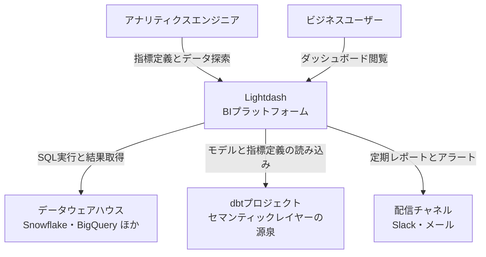
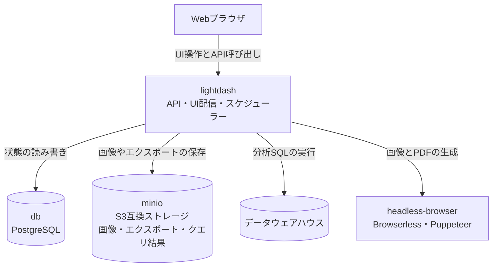
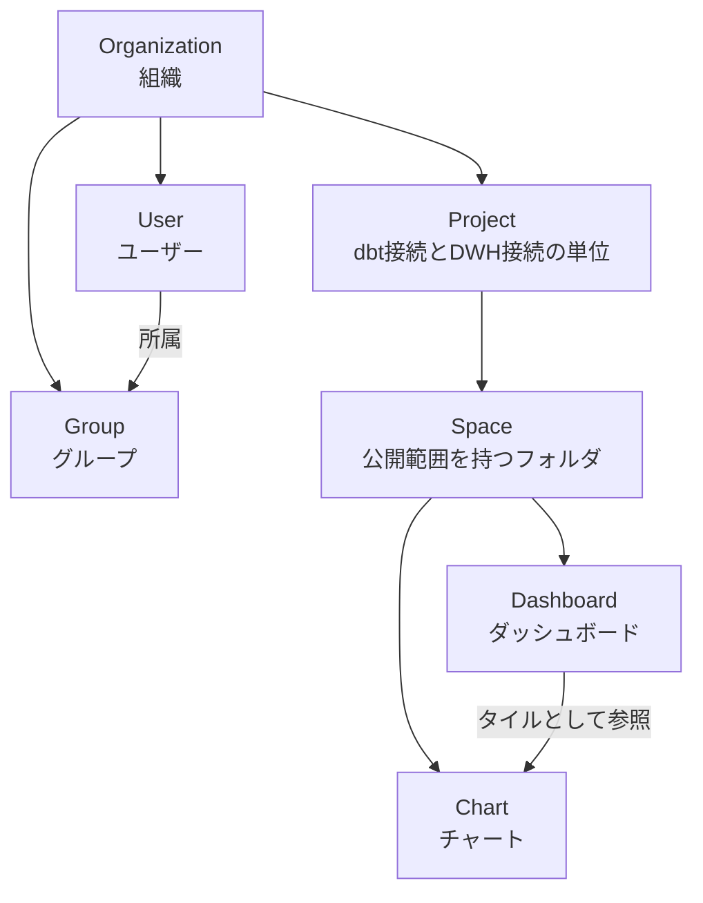

BIツールを導入すると、dbtで整えたモデルとは別に、BI側でもう一度メトリクスを定義することになりがちです。同じ「売上」が2箇所にあると、片方だけ直された瞬間に、どちらが正しいのか誰にも判断できなくなります。

[Lightdash](https://github.com/lightdash/lightdash) は、この二重定義をなくす方向に振り切ったオープンソースのBIツールです。dbtプロジェクトのYAMLに書いた定義をセマンティックレイヤーとして読み込み、ダッシュボードもYAMLとしてGitに載せられます。

本記事では、2026年7月31日時点の[公式ドキュメント](https://docs.lightdash.com)を一次情報として、次の観点を整理します。「dbtの定義をそのまま可視化できる」という紹介はすでに多くありますが、ここではその先の運用に踏み込みます。

- ダッシュボードをYAMLとして入出力する`Dashboards as Code`
- プルリクエストごとのプレビュー環境と`validate`による破壊的変更の検出
- dbt 1.10以降の`config.meta`への移行、およびdbtを使わない構成
- セルフホストの実コンテナ構成とバックアップ対象

## Lightdashの位置づけ

Lightdashは「開発者ファースト」を掲げるBIツールです。BI専用のモデリング言語を新設せず、dbtのYAMLをセマンティックレイヤーの源泉として扱います。

この設計から、次の性質が生まれます。

- 共有指標の定義変更は、リポジトリへのプルリクエストとして表現される
- レビュー、履歴、ロールバックは、既存のGitワークフローがそのまま使える
- Exploreは、`dbt list`または`dbt compile`から得たmanifestとウェアハウスのカタログ情報をもとに構築される

補足として、次の2点は「すべてがdbtのYAML経由」という理解の行き過ぎを防ぐために押さえておきます。

- チャートとダッシュボードはdbtの管理外で、Lightdash側のコンテンツとして保存される（後述のとおりYAMLとして入出力できる）
- 探索中に使うチャート固有のカスタムディメンション・カスタムメトリクスは、UIからも作成できる。共有・再利用する指標をYAMLに置き、その場限りの計算はUIで済ませる、という切り分けになる

なお、dbtプロジェクトが無くても導入は可能です。[Lightdash YAML](https://docs.lightdash.com/guides/lightdash-yaml)を使うと、`lightdash.config.yml`と`lightdash/models/*.yml`にセマンティックレイヤーを直接定義できます。既存のdbtプロジェクトがある場合に統合の利点が最大になる、という位置づけです。

## 他のBIツールとの使い分け

代表的なOSS・商用BIとの位置づけの違いを整理します。

| 項目 | Lightdash | Metabase | Apache Superset | Looker |
|---|---|---|---|---|
| 主な対象 | dbt中心のデータチーム | 非エンジニアを含む全社利用 | 大規模環境・可視化重視 | エンタープライズのガバナンス要件 |
| モデリング | dbtのYAML定義を利用 | GUI中心（SQLも可） | SQL中心 | LookML（独自言語） |
| 定義の置き場所 | データ変換基盤と同じリポジトリ | BIツール内部 | BIツール内部 | LookMLリポジトリ |
| 学習コスト | dbt統合ならdbtの知識、単独利用ならYAMLでのモデリング知識 | 低い | 中程度 | LookMLの学習が必要 |

選定の目安は次のとおりです。

| 状況 | 向いている選択 | 理由 |
|---|---|---|
| dbtでデータ基盤を組んでいる | Lightdash | 指標定義を二重管理せずに済む |
| dbtは未導入だが定義をコード管理したい | Lightdash（Lightdash YAML） | dbtなしでもYAMLでセマンティックレイヤーを定義できる |
| 非エンジニアがすぐ探索したい | Metabase | 導入が速く、操作の敷居が低い |
| 高度な可視化を数多く使いたい | Apache Superset | 可視化の種類とスケーラビリティに強い |
| 全社の指標を厳密に統制したい | Looker | LookMLによる厳格なモデリングと権限管理 |

## 構造

### システムの外側

Lightdashはデータ本体を複製せず、UI操作から生成したSQLをデータウェアハウスへ直接発行します。



### コンテナ構成

公式の`docker-compose.yml`が定義するサービスは、`lightdash`・`db`・`minio`・`headless-browser`の4つです。フロントエンドとバックエンドは別コンテナではなく、`lightdash`ひとつにまとまっています。



| サービス | 役割 |
|---|---|
| `lightdash` | API、UI配信、dbtメタデータの解析、SQL生成。既定で`SCHEDULER_ENABLED=true`のため、スケジューラーも同一プロセスで動く |
| `db` | ユーザー、権限、スペース、チャート、ダッシュボード、スケジュール設定の永続化 |
| `minio` | 画像、配信・エクスポートファイル、クエリ結果の保存先。本番ではS3などに置き換える（クエリ結果は`RESULTS_S3_*`で別バケットにもできる） |
| `headless-browser` | チャート・ダッシュボード画像のレンダリング |

2点補足します。

- **スケジューラーの分離は任意**: 既定では`lightdash`内で動きます。負荷が高い環境向けに、独立したワーカーとして切り出す構成も用意されています
- **ヘッドレスブラウザの用途**: 定期配信だけでなく、Slackにリンクを貼ったときのunfurl画像生成にも使われます。どちらも使わない構成では省けます

### データの持ち方

Lightdashが管理するコンテンツは、組織を頂点に、プロジェクト、スペース、チャート・ダッシュボードという階層です。アクセス制御はスペース単位で効くため、公開範囲の設計はスペース設計とほぼ同義になります。



一方、ExploreとDimension・Metricは、この階層とは別にYAMLの定義から生成されます。共有する指標を変えたいときは、UIではなくYAMLを直します。

## dbtでの定義

`columns`に宣言した列は、そのままディメンションとして表示されます。`meta.dimension`は型やラベルを上書きするための設定で、集計指標は`meta.metrics`で定義します。

```yaml
# dbt 1.9 以前の記法
models:
  - name: orders
    columns:
      - name: order_date
        meta:
          dimension:
            type: date
            label: '注文日'
            time_intervals: ['DAY', 'WEEK', 'MONTH']

      - name: amount
        meta:
          metrics:
            total_revenue:
              type: sum
              label: '売上合計'
```

:::message
dbt 1.10以降では、同じ構造を`meta`ではなく`config.meta`の下に置きます。アップグレード後に「指標が消えた」ように見える場合は、まずこの階層を疑ってください。
:::

## 構築方法

### Docker Compose

ローカル検証や小規模構成向けの手順です。

```bash
git clone https://github.com/lightdash/lightdash
cd lightdash

# .env を編集し、少なくとも LIGHTDASH_SECRET と PGPASSWORD を設定する

docker compose -f docker-compose.yml --env-file .env up --detach --remove-orphans
```

`LIGHTDASH_SECRET`はデータベース内の保存データを暗号化する鍵です。紛失すると既存の暗号化データを復号できなくなるため、バックアップと同じ厳密さで管理します。

### Kubernetes（Helm）

本番構成として推奨されるのはKubernetesです。ネームスペースは事前に作成します。

```bash
helm repo add lightdash https://lightdash.github.io/helm-charts
kubectl create namespace lightdash
helm install lightdash lightdash/lightdash -n lightdash -f values.yaml
```

`values.yaml`には、少なくとも暗号化用のシークレットとオブジェクトストレージの設定、Serviceの公開方法を書きます。

```yaml
secrets:
  LIGHTDASH_SECRET: "生成したランダムな文字列"

configMap:
  SITE_URL: "https://bi.example.com"
  S3_REGION: "ap-northeast-1"
  S3_BUCKET: "lightdash-assets"
  S3_ENDPOINT: "https://s3.ap-northeast-1.amazonaws.com"

service:
  type: ClusterIP
```

シークレットは`secrets`、非機密の設定値は`configMap`に置きます。`name`と`value`の組で任意の環境変数を追加したい場合は`extraEnv`を使います。S3のアクセスキーは、IAMロールで認証する場合は不要です。Enterprise版の機能を使う場合のみ、`LIGHTDASH_LICENSE_KEY`にライセンスキーを設定します（任意）。

アップグレードは次の手順です。

```bash
helm repo update lightdash
helm upgrade lightdash lightdash/lightdash -n lightdash -f values.yaml
```

## 利用方法

### CLIのインストールと認証

```bash
# npm
npm install -g @lightdash/cli

# Homebrew (macOS) は tap の追加が必要
brew tap lightdash/lightdash
brew install lightdash
```

ログインと対象プロジェクトの指定は次のとおりです。`config set-project`は`--uuid`または`--name`で指定します。

```bash
lightdash login <your-lightdash-url> --token <personal-access-token>
lightdash config set-project --uuid <project-uuid>
```

### dbtプロジェクトの反映

```bash
# 既存プロジェクトへ反映する
lightdash deploy

# dbtモデルから新規プロジェクトを作る
lightdash deploy --create "Your Project Name"

# 一時的なプレビュー環境を立てる
lightdash preview

# 名前付きの永続プレビューを立てる
lightdash start-preview --name "review-x"
```

`--create`はローカルの`profiles.yml`の認証情報を使ってプロジェクトを作ります。ただしdbt Cloud CLIを使う場合や`--no-warehouse-credentials`を付けた場合は接続情報が空になるため、作成後にUIから設定します。`preview`はコマンドの実行中だけ存在する一時プロジェクト、`start-preview`は明示的に`stop-preview`するまで残るプレビューです。

### ダッシュボードのコード管理

チャートとダッシュボードは、CLIでYAMLとして手元に取り出せます。

```bash
# lightdash/ 配下へ YAML を書き出す
lightdash download

# 変更を反映する。新規作成を含む場合は --force が必要
lightdash upload --force
```

出力されるディレクトリ構成は次のとおりです。

```text
lightdash/
├── spaces/
│   └── *.space.yml
├── charts/
│   └── *.yml
├── dashboards/
│   └── *.yml
└── .lightdash-metadata.json
```

`.lightdash-metadata.json`はローカルの変更追跡に使うファイルで、公式ドキュメントは`.gitignore`への追加を求めています。運用上は次の2点を先に共有しておくと事故を防げます。

- `lightdash download`を再実行すると、未アップロードのローカル変更は上書きされる
- アップロード対象は変更のあったファイルだけであり、同じファイルを更新するとUI側の編集は上書きされる

## CI/CD連携

プルリクエストごとにプレビュー環境を作り、マージ時に本番へ反映する構成が基本形です。

```yaml
name: lightdash

on:
  pull_request:
    branches: [main]
  push:
    branches: [main]

jobs:
  lightdash:
    runs-on: ubuntu-latest
    env:
      CI: 'true'
      LIGHTDASH_API_KEY: ${{ secrets.LIGHTDASH_API_KEY }}
      LIGHTDASH_URL: ${{ secrets.LIGHTDASH_URL }}
      DBT_PROFILES: ${{ secrets.DBT_PROFILES }}
    steps:
      - uses: actions/checkout@v4
      - uses: actions/setup-node@v4
        with:
          node-version: '20'
      - uses: actions/setup-python@v5
        with:
          python-version: '3.11'
      - name: Install Lightdash CLI and dbt
        run: |
          npm install -g @lightdash/cli
          pip install dbt-bigquery
      - name: Write dbt profiles
        run: echo "$DBT_PROFILES" > profiles.yml
      - name: Start preview for pull request
        if: github.event_name == 'pull_request'
        env:
          LIGHTDASH_PROJECT: ${{ secrets.LIGHTDASH_PROJECT }}
        run: lightdash start-preview --profiles-dir . --name "pr-${{ github.event.number }}"
      - name: Upload content to preview
        if: github.event_name == 'pull_request'
        run: |
          lightdash upload --force
          lightdash validate --preview
      - name: Deploy on main
        if: github.ref == 'refs/heads/main'
        env:
          LIGHTDASH_PROJECT: ${{ secrets.LIGHTDASH_PROJECT }}
        run: |
          lightdash deploy --profiles-dir .
          lightdash upload --force
```

押さえておく点は4つあります。

- **dbtが必要**: Lightdash CLIは`dbt`コマンドに依存します。利用するアダプター（例では`dbt-bigquery`）もあわせてインストールします
- **`upload --force`まで実行する**: `deploy`と`start-preview`が同期するのはセマンティックレイヤーです。チャートとダッシュボードのYAML変更を反映するには、その後の`lightdash upload --force`が必要です
- **`LIGHTDASH_PROJECT`はステップ単位で渡す**: この環境変数は対象プロジェクトの指定を上書きします。`start-preview`はコピー元となる本番プロジェクトを知る必要があるため、そのステップでは設定します。一方、直後の`upload`で同じ値が残っていると、作成したプレビューではなく本番へ書き込みかねません。ジョブ全体ではなくステップに限定して渡します
- **プレビューの後片付け**: プルリクエストのクローズ時に`lightdash stop-preview`を実行するジョブを別に用意します

`CI=true`を設定しておくと、対話プロンプトでジョブが停止しません。公式には[cli-actions](https://github.com/lightdash/cli-actions)にテンプレートがあるため、実際にはこれを起点にすると早いです。

`lightdash validate`をプルリクエスト時に挟むと、dbt側の列名変更や削除で既存チャートが壊れるケースを、反映前に検出できます。UIからも同じ検証をContent Validatorとして実行できます。

## 運用

### ログ

ログは既定で標準出力に出ます。環境変数で挙動を変えられます。

| 環境変数 | 既定値 | 内容 |
|---|---|---|
| `LIGHTDASH_LOG_LEVEL` | `INFO` | `DEBUG` / `AUDIT` / `HTTP` / `INFO` / `WARN` / `ERROR` |
| `LIGHTDASH_LOG_FORMAT` | `pretty` | `PLAIN` / `PRETTY` / `JSON` |
| `LIGHTDASH_LOG_OUTPUTS` | `console` | 出力先。`file`を含めるとファイル出力が有効になる |
| `LIGHTDASH_LOG_FILE_PATH` | `./logs/all.log` | ファイル出力先 |

集約基盤へ送るなら`LIGHTDASH_LOG_FORMAT=JSON`にしておくと扱いやすくなります。

### バックアップ

復旧対象になるのは次の2種類です。

- メタデータ（ユーザー、権限、チャート、ダッシュボード、スケジュール）: PostgreSQL
- 画像や配信・エクスポートファイル: S3互換のオブジェクトストレージ（`S3_REGION`・`S3_BUCKET`・`S3_ENDPOINT`など）

同じストレージにはクエリ結果も置かれますが、こちらは再実行すれば作り直せる一時データです。バックアップ設計では、失うと戻せないメタデータと永続アセットを優先します。

PostgreSQLのバックアップはマネージドサービスの機能や定期ダンプで確保します。あわせて`LIGHTDASH_SECRET`を安全に保管しておかないと、リストアしても暗号化データを復号できません。

### 権限

権限は組織・プロジェクト・スペースの三層です。

| 層 | ロール |
|---|---|
| 組織 | Member / Viewer / Interactive Viewer / Editor / Developer / Admin |
| プロジェクト | Viewer / Interactive Viewer / Editor / Developer / Admin |
| スペース | Full Access / Can Edit / Can View |

組織のMemberはそれ自体では権限を持たず、プロジェクト側の割り当てで実際のアクセス範囲が決まります。プロジェクトを作成できるのは組織Adminのみです。

スペースロールは、プロジェクトから継承した権限をスペース単位で制限・拡張します。たとえばプロジェクトのEditorを、特定のスペースでは`Can View`に絞れます。実効権限はプロジェクトロールとスペースロールの組み合わせで決まる、と理解しておくと設計を誤りません。

## つまずきやすい点

| 症状 | 主な原因 | 確認する場所 |
|---|---|---|
| ウェアハウスへ接続できない | SSL設定の不一致、IP制限 | 接続文字列の`sslmode`、ウェアハウス側の許可IP |
| `Refresh dbt`が失敗する | `dbt compile`の失敗、Gitリポジトリへのアクセス権不足 | ローカルでの`dbt compile`、`manifest.json`の参照設定 |
| ディメンションが表示されない | dbt側の列定義漏れ、メタデータが古い | dbtのYAML、Project Settingsの`Refresh dbt` |
| ダッシュボードが壊れる | dbt側での列のリネーム・削除 | Content Validator、CIでの`lightdash validate` |
| CLIのエラー内容がわからない | ログレベルが足りない | `--verbose`付きでの再実行 |

導入判断の段階では、次の3点も見ておくと後戻りが減ります。

- **正本がコード側に寄る**: 共有指標を増やすたびにリポジトリへのプルリクエストが必要です。ビジネス側が自分で指標を追加したい組織では、この運用が受け入れられるか、あるいはUIのカスタムフィールドで足りるかを先に確認します
- **dbtのバージョン差**: 1.10以降は`config.meta`が前提です。既存の記事やサンプルの多くは旧記法のままです
- **編集経路の一本化**: UIとコードの両方から同じダッシュボードを編集できるため、どちらを正とするか決めないと上書き事故が起きます

## まとめ

Lightdashは、「dbtに書いた定義を正本にする」という一点を軸に構成されたBIツールです。

- 共有指標の定義はYAML（dbt統合なら1.10以降は`config.meta`）に集約し、BI側との二重管理を避けられる。dbtが無くてもLightdash YAMLで同じ形を取れる
- ダッシュボードとチャートは`lightdash download` / `upload --force`でYAML化し、Gitのレビュー経路に乗せられる
- `start-preview`と`validate`により、定義変更が既存チャートを壊さないかを反映前に確認できる
- セルフホストではPostgreSQLとS3互換ストレージのバックアップ、`LIGHTDASH_SECRET`の保管が運用の要になる
- 共有指標の追加がリポジトリのレビュー経路に乗るため、その運用を受け入れられるかが選定の分かれ目になる

BIの資産をコードとして扱い、変更をレビューしてから反映したい場合には、有力な選択肢になります。

この記事が少しでも参考になった、あるいは改善点などがあれば、ぜひリアクションやコメント、SNSでのシェアをいただけると励みになります！

## 参考リンク

- [Lightdash 公式ドキュメント](https://docs.lightdash.com)
- [Lightdash GitHubリポジトリ](https://github.com/lightdash/lightdash)
- [CLIのインストール](https://docs.lightdash.com/guides/cli/how-to-install-the-lightdash-cli)
- [Lightdash CLI リファレンス](https://docs.lightdash.com/references/lightdash-cli)
- [Dashboards as code](https://docs.lightdash.com/guides/developer/dashboards-as-code)
- [Dimensions リファレンス](https://docs.lightdash.com/references/dimensions)
- [Metrics リファレンス](https://docs.lightdash.com/references/metrics)
- [Roles と権限（組織・プロジェクト・スペース）](https://docs.lightdash.com/references/workspace/roles)
- [Lightdash YAML（dbtなしでの定義）](https://docs.lightdash.com/guides/lightdash-yaml)
- [Custom fields（UIでのカスタム指標）](https://docs.lightdash.com/guides/custom-fields)
- [Self-host Lightdash](https://docs.lightdash.com/self-host/self-host-lightdash)
- [Environment variables](https://docs.lightdash.com/self-host/customize-deployment/environment-variables)
- [CI/CD テンプレート（cli-actions）](https://github.com/lightdash/cli-actions)
