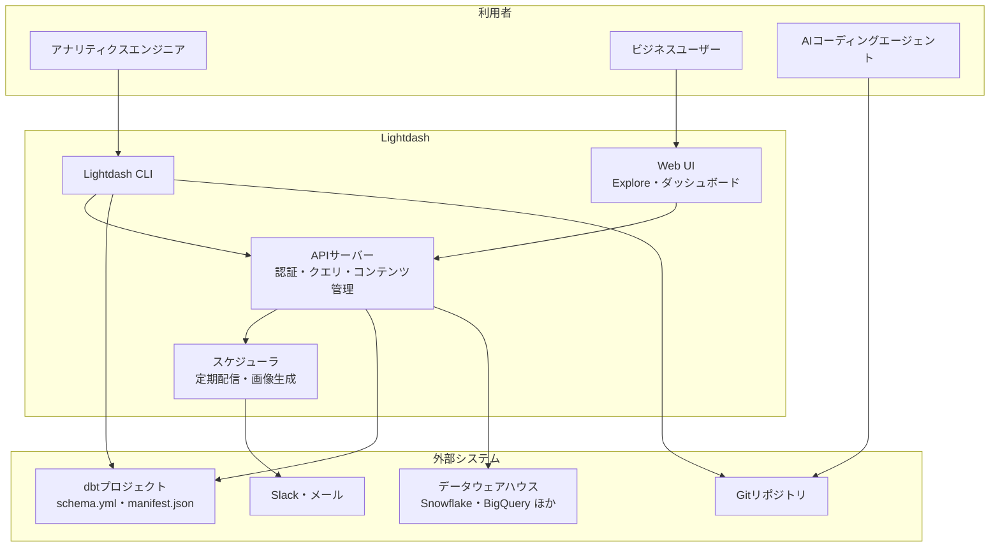
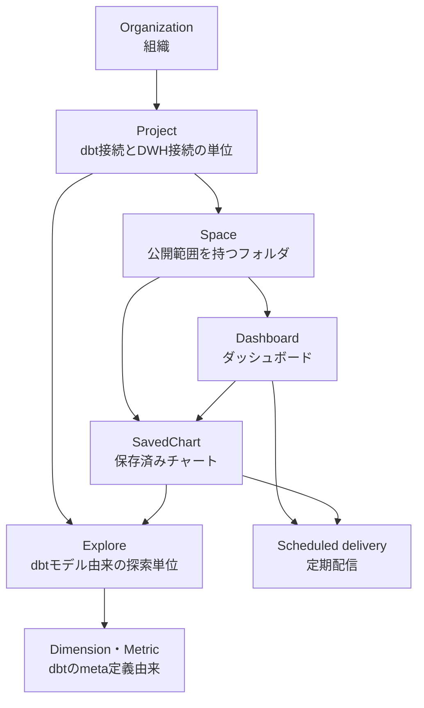

dbtでモデルを整備しても、BIツール側で「売上」の定義をもう一度書き直していないでしょうか。同じ指標が2箇所にあると、定義がずれた瞬間にどちらが正しいのか誰にも判断できなくなります。

[Lightdash](https://github.com/lightdash/lightdash) は、この二重管理をなくすことを出発点にしたOSSのBIプラットフォームです。dbtの`schema.yml`に書いた`meta`定義をそのままディメンション・メトリクスとして読み込み、逆にダッシュボードやチャートをYAMLとしてGitに書き出せます。

本記事では、2026年7月31日時点の[公式ドキュメント](https://docs.lightdash.com)を一次情報として、Lightdashの構造、dbtでの定義方法、BI-as-Codeの運用、AIエージェント連携、セルフホスト時の設定項目を整理します。


## Lightdashが解く問題

一般的なBIツールでは、データウェアハウス上のテーブルとは別に、BIツール側でデータモデルと指標を定義します。この構成には次の問題があります。

- 同じ指標の定義がdbtとBIの2箇所に存在する
- BI側の定義はGitの外にあり、変更履歴もレビューもない
- 定義変更の影響範囲を、事前に確認する手段がない

Lightdashは、再利用する指標定義の正本をdbtプロジェクト側へ集約できます。BIツールが読むのはdbtのコンパイル成果物であり、指標を増やす操作はdbtのYAML変更として表現されます。さらにダッシュボード自体もYAMLとして出力できるため、指標もダッシュボードも同じGitのレビュー経路に乗ります。

ただし、BI層に一切の定義を置けないわけではありません。次の経路も用意されています。

- 探索中に作るテーブル計算やカスタムフィールド（アドホックな計算）
- dbtを使わずに直接セマンティックレイヤーを書く[Lightdash YAML](https://docs.lightdash.com/guides/lightdash-yaml)（`lightdash.config.yml`と`./lightdash/models/*.yml`）
- 環境変数`EDIT_YAML_IN_UI_ENABLED`（既定`false`）で有効化するUI内のYAMLエディター

「共有する正式な指標はコード管理し、その場限りの計算はUIで済ませる」という切り分けが、実際の運用像になります。


## 全体構造

Lightdashは、Web UI、API、スケジューラ、CLIから構成され、dbtプロジェクトとデータウェアハウスの間に立ちます。データ本体はコピーせず、UIの操作から生成したSQLをウェアハウスへ直接発行します。



利用者から見た入口は3つあります。ビジネスユーザーはWeb UIでSQLを書かずに探索し、アナリティクスエンジニアはCLIでdbt定義を検証・反映し、AIエージェントはGit上のYAMLを直接編集します。

| 構成要素 | 役割 |
|---|---|
| Web UI | Exploreによる探索、ダッシュボード編集、Ask AIの利用 |
| APIサーバー | 認証・認可、dbtメタデータの取り込み、SQL生成とクエリ実行 |
| スケジューラ | Slack・メールへの定期配信、チャート画像やPDFの生成 |
| CLI | dbt定義の検証、プレビュー環境作成、本番反映、コンテンツの入出力 |

## 中心となるデータの考え方

Lightdashが扱う対象は、大きく「dbt由来の定義」と「Lightdashが持つコンテンツ」に分かれます。前者は正本がdbtリポジトリにあり、後者はプロジェクト・スペース・チャート・ダッシュボードという階層で管理されます。



ExploreとDimension・Metricは、通常のUI操作からは編集しません。これらを変えたいときはYAML（dbt統合ならdbt側の`schema.yml`）を直し、再度反映します。アクセス制御はSpace単位で効くため、ダッシュボードの公開範囲はSpaceの設計とほぼ同義になります。

## dbtでの定義

:::message
以降のYAML例は、読みやすさのためdbt 1.9以前の記法（`meta`直下）で書いています。dbt 1.10以降では、いずれも`config.meta`の下に同じ構造を置きます。詳細は後述の「dbt 1.10以降は`config.meta`」を参照してください。
:::

### ディメンションとメトリクス

dbtの`columns`に宣言した列は、そのままディメンションとして表示されます。`meta.dimension`は、型・ラベル・書式・時間粒度などを上書きするための設定です。一方、集計指標は`meta.metrics`で明示的に定義します。

```yaml
# dbt 1.9 以前の記法
models:
  - name: orders
    columns:
      - name: order_date
        meta:
          dimension:
            type: date
            label: '注文日'
            time_intervals: ['DAY', 'WEEK', 'MONTH', 'QUARTER', 'YEAR']

      - name: amount
        meta:
          dimension:
            type: number
            format: '[$]#,##0.00'
          metrics:
            total_revenue:
              type: sum
              label: '売上合計'
```

ディメンションの`type`は`string`・`number`・`timestamp`・`date`・`boolean`から選びます。`format`はスプレッドシート形式の書式指定で、通貨や桁区切りをここで統一できます。

メトリクスの型は集計系（`count`・`count_distinct`・`sum`・`average`・`median`・`percentile`・`min`・`max`など）、非集計系（`number`・`boolean`・`date`・`string`）、集計後計算系（`percent_of_previous`・`percent_of_total`・`running_total`）に分かれます。集計後計算系は公式ドキュメントでExperimentalとされており、`filters`プロパティが使えない、他の集計後計算メトリクスを参照できないといった制約があります。本番で使う前に、この扱いを確認してください。

複数列を参照する指標は、列ではなくモデルの`meta.metrics`に置きます。

```yaml
# dbt 1.9 以前の記法
models:
  - name: orders
    meta:
      metrics:
        revenue_per_user:
          type: number
          sql: ${sum_revenue} / ${distinct_user_ids}
```

### dbt 1.10以降は`config.meta`

ここが最初の落とし穴です。dbt 1.10以降では、同じ定義を`meta`ではなく`config.meta`の下に書きます。

```yaml
models:
  - name: orders
    config:
      meta:
        metrics:
          revenue_per_user:
            type: number
            sql: ${sum_revenue} / ${distinct_user_ids}
```

dbtをアップグレードしたあとに「指標が消えた」ように見える場合、この階層の違いを最初に疑うと早く切り分けられます。

### 結合

モデル間の結合は`meta.joins`で宣言します。UIで選ばれたフィールドに応じて、必要な結合だけがSQLに含まれます。

```yaml
# dbt 1.9 以前の記法
models:
  - name: accounts
    meta:
      primary_key: id
      joins:
        - join: deals
          type: left
          sql_on: ${accounts.id} = ${deals.account_id}
          relationship: one-to-many
          label: Deal Information
          always: true
```

`type`を省略した場合は`left join`になります。`always: true`は、そのテーブルのフィールドが選ばれていなくても常に結合する指定で、後述する行レベルセキュリティの条件を確実に効かせたいときに使います。

同じモデルを複数回結合する場合は`alias`を使いますが、そのときは`sql_on`の参照側もaliasへ切り替えます。元のモデル名を参照したままだとコンパイルに失敗します。

```yaml
# dbt 1.9 以前の記法
models:
  - name: messages
    meta:
      joins:
        - join: users
          alias: sender
          sql_on: ${messages.sent_by} = ${sender.user_id}
        - join: users
          alias: recipient
          sql_on: ${messages.sent_to} = ${recipient.user_id}
```

## BI-as-Code

ダッシュボードとチャートは、CLIでYAMLとして手元に取り出せます。

```bash
# 全チャート・ダッシュボードをYAMLとして書き出す
lightdash download

# 特定のダッシュボードだけを対象にする
lightdash download -d my-dashboard-slug

# 変更をLightdashへ戻す。新規作成は --force が必要
lightdash upload --force
```

生成されるディレクトリ構成は次のとおりです。

```text
lightdash/
├── spaces/
│   └── *.space.yml
├── charts/
│   └── *.yml
├── dashboards/
│   └── *.yml
└── .lightdash-metadata.json
```

`spaces/*.space.yml`はSpaceの名前とアクセス方針を保持するファイルで、チャートやダッシュボードの配置先を往復で再現するために出力されます。`.lightdash-metadata.json`はローカルの変更追跡に使うファイルで、公式ドキュメントは`.gitignore`への追加を求めています。

運用上、次の2点は事前に共有しておくと事故を防げます。

- `lightdash download`を再実行すると、未アップロードのローカル変更は上書きされる
- アップロード対象は変更のあったファイルだけであり、UI側で別途加えた編集は同じファイルを更新したときに上書きされる

つまりコードとUIの両方から同じダッシュボードを触れますが、同じ資産に対する編集経路はチームで一本化しておくのが安全です。

## CLIとCI/CD

CLIは、dbtの変更を本番へ反映する前に検証するための道具立てが揃っています。

| コマンド | 用途 |
|---|---|
| `lightdash login` | インスタンスへのログイン。`--token`でトークン認証も可能 |
| `lightdash config set-project` | 操作対象プロジェクトの切り替え |
| `lightdash compile` | dbtのコンパイルとLightdash定義の検証 |
| `lightdash preview` | 一時的なプレビュープロジェクトの作成 |
| `lightdash start-preview` / `stop-preview` | 名前付きの永続プレビューの作成と削除 |
| `lightdash deploy` | 本番プロジェクトへの反映 |
| `lightdash validate` | チャート・ダッシュボードが定義変更で壊れていないかの検証 |
| `lightdash download` / `upload` | コンテンツのYAML入出力 |

`lightdash deploy`は本番プロジェクトへ直接反映されるため、CIではブランチに応じて実行を分けます。プルリクエストでは`start-preview`で名前付きプレビューを立て、レビュー後に`stop-preview`で片付ける流れが扱いやすい構成です。

```yaml
name: lightdash

on:
  pull_request:
    branches: [main]
  push:
    branches: [main]

jobs:
  lightdash:
    runs-on: ubuntu-latest
    env:
      LIGHTDASH_API_KEY: ${{ secrets.LIGHTDASH_API_KEY }}
      LIGHTDASH_URL: ${{ secrets.LIGHTDASH_URL }}
      DBT_PROFILES: ${{ secrets.DBT_PROFILES }}
    steps:
      - uses: actions/checkout@v4
      - uses: actions/setup-node@v4
        with:
          node-version: '20'
      - uses: actions/setup-python@v5
        with:
          python-version: '3.11'
      - name: Install Lightdash CLI and dbt
        run: |
          npm install -g @lightdash/cli
          pip install dbt-bigquery
      - name: Write dbt profiles
        run: echo "$DBT_PROFILES" > profiles.yml
      - name: Preview for pull request
        if: github.event_name == 'pull_request'
        run: |
          lightdash start-preview --profiles-dir . --name "pr-${{ github.event.number }}"
          lightdash upload --force
      - name: Deploy on main
        if: github.ref == 'refs/heads/main'
        env:
          LIGHTDASH_PROJECT: ${{ secrets.LIGHTDASH_PROJECT }}
        run: |
          lightdash deploy --profiles-dir .
          lightdash upload --force
```

押さえておく点は3つあります。

- **dbtが必要**: Lightdash CLIは`dbt`コマンド（dbt Coreまたはdbt Cloud CLI）に依存します。利用するアダプター（例では`dbt-bigquery`）をあわせてインストールします
- **`upload --force`まで実行する**: `deploy`と`start-preview`が同期するのはセマンティックレイヤーです。チャートとダッシュボードのYAML変更を反映するには、その後に`lightdash upload --force`が必要です
- **`LIGHTDASH_PROJECT`をジョブ全体に置かない**: この環境変数は設定ファイルのプロジェクト指定を上書きします。ジョブ全体に本番UUIDを置くと、プレビュー作成後の`upload --force`まで本番へ向かいかねません。本番デプロイのステップに限定して渡します
- **プレビューの後片付け**: プルリクエストのクローズ時に`lightdash stop-preview`を実行するジョブを別に用意します

認証に使う環境変数は`LIGHTDASH_API_KEY`（個人アクセストークン）、`LIGHTDASH_URL`、`LIGHTDASH_PROJECT`（プロジェクトのUUID）の3つで、加えてウェアハウス接続を渡す`DBT_PROFILES`が必要です。公式には[cli-actions](https://github.com/lightdash/cli-actions)にプレビュー作成・削除・デプロイのテンプレートが用意されているため、実際にはこれを起点にすると早いです。

`lightdash validate`をプルリクエスト時に挟むと、指標名の変更で既存チャートが壊れるケースを反映前に検出できます。

## AIエージェントとの接続

Lightdashは、AI連携を2つの層に分けて提供します。

1つ目は、Lightdash内部の**Ask AI**です。組織管理者がSettings → Ask AI → Generalで**Enable AI features for users**を有効にすると、ホーム画面とナビゲーションバーにAsk AIが表示されます。エージェント単位でInstructions（業務文脈の指示）、Tags（参照可能なフィールドの限定）、Data Access（実データを見るかメタデータのみか）、ユーザー・グループ単位のアクセス範囲を設定できます。Slackチャンネルに接続すれば、Slackから直接質問できます。

2つ目は、手元のコーディングエージェントへLightdashの作法を教える**agent skills**です。CLIから配布します。

```bash
# グローバルへインストール
lightdash install-skills --global

# エージェントを指定する場合
lightdash install-skills --agent cursor --global

# 対象プロジェクトのみに入れる場合
lightdash install-skills
```

公式ドキュメントが対応として挙げているのは、Claude Code、Cursor、Codex、Antigravity、GitHub Copilotです。`.claude/skills/`に入れたスキルはGitHub Copilotからも利用されます。

BI-as-CodeとAsk AIは相性がよく、YAMLで書かれたダッシュボードはエージェントが読み書きしやすい対象になります。一方で、生成された変更を無検証で本番へ流さないよう、前節の`validate`とプレビューを経路に挟んでおくのが現実的です。

## 運用時の設定

### ロール

権限は組織レベルとプロジェクトレベルの二層です。

| 層 | ロール |
|---|---|
| 組織 | Member / Viewer / Interactive Viewer / Editor / Developer / Admin |
| プロジェクト | Viewer / Interactive Viewer / Editor / Developer / Admin |

組織のMemberは、それ自体では権限を持たず、プロジェクト側の割り当てで実際のアクセス範囲が決まります。プロジェクトを作成できるのは組織Adminのみです。プロジェクトDeveloperはコンパイル・デプロイ・検証まで可能ですが、プロジェクトの削除や設定変更はAdminの範囲です。

### 行レベルセキュリティ

ユーザー属性（User Attributes）を`sql_filter`に埋め込むと、ウェアハウスへ発行するSQLの段階で行を絞り込めます。

```yaml
# dbt 1.9 以前の記法
models:
  - name: my_model
    meta:
      sql_filter: ${TABLE}.sales_region IN (${lightdash.attributes.sales_region})
```

属性は複数値を持ち得るため、公式ドキュメントは`=`ではなく`IN`の利用を推奨しています。dbt 1.10以降では、こちらも`config.meta`の下に置きます。

列単位では、`required_attributes`（すべての条件を満たす場合に表示）と`any_attributes`（いずれかを満たす場合に表示）を使います。

```yaml
# dbt 1.9 以前の記法
columns:
  - name: salary
    meta:
      dimension:
        required_attributes:
          is_admin: 'true'
```

非表示になった列は、その列から派生するメトリクスもあわせて見えなくなります。なお公式ドキュメントは「チャートやダッシュボードのフィルターはセキュリティ境界ではない」と明記しています。実際に守りたい範囲は`sql_filter`側で表現します。

### キャッシュとスケジューラ

セルフホスト時に把握しておきたい環境変数は次のとおりです。

| 環境変数 | 既定値 | 内容 |
|---|---|---|
| `RESULTS_CACHE_ENABLED` | `false` | チャート結果のキャッシュを有効にする（Enterpriseライセンスが必要） |
| `CACHE_STALE_TIME_SECONDS` | `86400` | キャッシュ結果を有効とみなす時間（Enterpriseライセンスが必要） |
| `SCHEDULER_ENABLED` | `true` | 定期配信ワーカーの有効化 |
| `SCHEDULER_CONCURRENCY` | `3` | 同時実行ジョブ数 |
| `SCHEDULER_JOB_TIMEOUT` | `600000` | ジョブのタイムアウト（ミリ秒） |
| `SCHEDULER_SCREENSHOT_TIMEOUT` | 記載なし | チャート・ダッシュボードのスクリーンショット取得の上限（ミリ秒） |

結果キャッシュは既定で無効で、公式ドキュメントによればEnterprise License Keyが必要な機能です。ウェアハウスのクエリ課金を抑える目的でこれを当てにする場合は、ライセンス条件を先に確認してください。キャッシュを有効にしている環境で「更新したのに古い値が出る」場合は、`CACHE_STALE_TIME_SECONDS`（既定24時間）が第一の確認先になります。

定期配信はチャート画像を生成するため、ヘッドレスブラウザ（Browserless）を伴います。タイル数の多いダッシュボードで画像が欠ける場合、タイムアウトは複数の層にあることに注意します。Lightdash側はスクリーンショット単位の`SCHEDULER_SCREENSHOT_TIMEOUT`とジョブ全体の`SCHEDULER_JOB_TIMEOUT`、Browserless側はセッション上限の`TIMEOUT`（既定`30000`ミリ秒）です。あわせてワーカーのメモリ割り当ても調整対象になります。

### 監視

Prometheusメトリクスは既定で無効です。有効化と公開先は次の変数で制御します。

| 環境変数 | 既定値 |
|---|---|
| `LIGHTDASH_PROMETHEUS_ENABLED` | `false` |
| `LIGHTDASH_PROMETHEUS_PORT` | `9090` |
| `LIGHTDASH_PROMETHEUS_PATH` | `/metrics` |

アプリケーション本体とは別ポートで公開されるため、Kubernetes上で収集する場合はService定義とScrape設定の両方に反映します。

## セルフホストの構築

公式が推奨するのはKubernetesとHelmの組み合わせです。

```bash
helm repo add lightdash https://lightdash.github.io/helm-charts
kubectl create namespace lightdash
helm install lightdash lightdash/lightdash -n lightdash -f values.yaml
```

Namespaceは事前に作成します（`helm install`に`--create-namespace`を付けても構いません）。Helmを使わない場合は、テンプレートを展開して`kubectl`で適用できます。

```bash
helm template lightdash lightdash/lightdash -n lightdash -f values.yaml > lightdash.yaml
kubectl apply -f lightdash.yaml
```

小さく試すだけならDocker Composeの手順も用意されています。いずれの構成でも、最低限次の設定が必要です。

- `LIGHTDASH_SECRET`: データベース上の保存データを暗号化する鍵。失うと復号できないため、確実に保管する（必須）
- `S3_REGION`・`S3_BUCKET`・`S3_ENDPOINT`: 画像やエクスポートファイルの外部保存先
- `S3_ACCESS_KEY`・`S3_SECRET_KEY`: アクセスキー方式で認証する場合に設定する。IAMロールを使う場合は不要
- `SITE_URL`: 公開URL（既定は`http://localhost:8080`）。共有リンクやスケジュール配信の宛先生成に影響するため、本番では実際のURLへ設定する

CLIは各自の端末にインストールします。

```bash
npm install -g @lightdash/cli
lightdash login https://bi.example.com
lightdash config set-project
```

## 導入前に見ておきたい点

- **正本はコード側に寄る**: 共有指標を増やすたびにリポジトリへのプルリクエストが必要になります。ビジネス側が自分で指標を追加したい組織では、この運用が受け入れられるか、あるいはテーブル計算やUI内YAMLエディターで足りるかを先に確認します
- **dbtのバージョン差**: 1.10以降は`config.meta`が前提です。既存の記事やサンプルは`meta`直下の記法が多く、そのままでは反映されません
- **編集経路の一本化**: UIとコードの両方から同じダッシュボードを編集できるため、どちらを正とするかを決めないと上書き事故が起きます
- **結果キャッシュはEnterprise機能**: 既定で無効なうえ、有効化にはEnterpriseライセンスが必要です。コスト削減の前提に置く場合は先に条件を確認します
- **Ask AIは有料プラン前提**: AI機能は組織管理者による有効化が必要で、公式ドキュメントでは有料プランの機能として案内されています

## まとめ

Lightdashは、「dbtに書いた定義を正本にする」という一点を軸に、BIツールの構成を組み替えたプロダクトです。

- ディメンションはdbtの`columns`宣言から自動生成され、指標はdbtの`meta.metrics`（1.10以降は`config.meta.metrics`）で定義するため、BI側との二重定義を避けられる
- ダッシュボードとチャートは`lightdash download` / `upload --force`でYAML化し、Gitのレビュー経路に乗せる
- `preview`と`validate`により、定義変更が既存チャートを壊さないかを反映前に確認できる
- 行レベルセキュリティは`sql_filter`で表現し、UIのフィルターには依存しない
- セルフホストではPrometheusが既定で無効、結果キャッシュは既定で無効かつEnterpriseライセンスが前提

BIの資産をコードとして扱いたい、あるいはAIエージェントにダッシュボードを触らせたい場合、選択肢として検討する価値があります。

この記事が少しでも参考になった、あるいは改善点などがあれば、ぜひリアクションやコメント、SNSでのシェアをいただけると励みになります！

## 参考リンク

- [Lightdash 公式サイト](https://www.lightdash.com)
- [Lightdash GitHubリポジトリ](https://github.com/lightdash/lightdash)
- [Lightdash 公式ドキュメント](https://docs.lightdash.com)
- [Dimensions リファレンス](https://docs.lightdash.com/references/dimensions)
- [Metrics リファレンス](https://docs.lightdash.com/references/metrics)
- [Joins リファレンス](https://docs.lightdash.com/references/joins)
- [Dashboards as code](https://docs.lightdash.com/guides/developer/dashboards-as-code)
- [Lightdash YAML（dbtなしでのセマンティックレイヤー定義）](https://docs.lightdash.com/guides/lightdash-yaml)
- [CI/CD テンプレート（cli-actions）](https://github.com/lightdash/cli-actions)
- [Lightdash CLI リファレンス](https://docs.lightdash.com/references/lightdash-cli)
- [User attributes とアクセス制御](https://docs.lightdash.com/references/workspace/user-attributes)
- [Roles と権限](https://docs.lightdash.com/references/roles)
- [Agent skills](https://docs.lightdash.com/guides/developer/agent-skills)
- [AI agents の利用開始](https://docs.lightdash.com/guides/ai-agents/getting-started)
- [Environment variables](https://docs.lightdash.com/self-host/customize-deployment/environment-variables)
- [Self-host Lightdash](https://docs.lightdash.com/self-host/self-host-lightdash)
