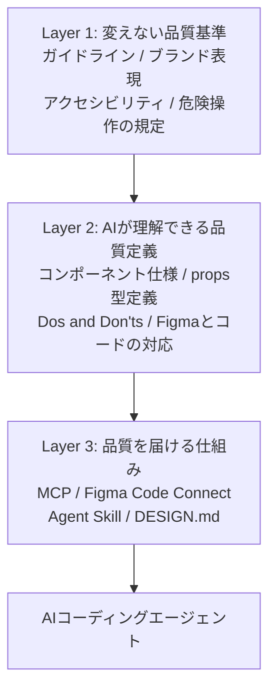

*この記事の全体像。以下、順に解説します。*

## この記事の対象と得られるもの

LINEヤフーが2026年8月3日に公開した「社内向けデザインシステムを「AI-Ready」へ」というnote記事をもとに、AIがコードを生成する前提でデザインシステムをどう再設計するかを整理します。

- 対象: デザインシステムの運用者、フロントエンド基盤の担当者、AI活用の投資判断をする立場の方
- 得られるもの: 「AIの出力品質が低い」を情報設計の問題として捉え直す視点と、複数システム併存環境でAIに選択ルールを渡す設計パターン

結論を先に置きます。AIによるUI生成の精度は、LLMの世代交代ではなく**デザインシステム側の情報構造**で決まります。LINEヤフーはこの前提に立ち、Figmaのデザインからマークアップまでの工程で約80%の工数削減を確認したと報告しています。

## なぜ「AI-Ready」が必要になったのか

LINEヤフーには、旧ヤフーの「SAYA」と旧LINEの「LandPress UI」という出自の異なるUIライブラリが併存していました。100を超えるサービスを支える社内システム群で、UIライブラリも操作ルールも揃っていない状態です。

この不整合を解消するために生まれたのが統合デザインシステム「LEAN UI」です。ただし、LEAN UIが人間向けドキュメントにとどまらず「AI-Ready」を目指した理由は、統合そのものとは別のところにあります。

**人間が迷う箇所で、AIも同じように間違えるからです。**

具体的には次のような症状が現れます。

| 人間が困ること | AIで起きること |
| --- | --- |
| Storybookのprops/handlerの意図が読み取れない | 存在しないpropsを生成する |
| Figmaのパーツとコードの対応が分からない | 別コンポーネントを当ててくる |
| 使ってよい/いけないの基準が書かれていない | `Flex`や`div`で独自スタイリングして崩れる |

3つ目は特に厄介です。`ButtonGroup`のような専用コンポーネントが存在しても、LLMは汎用要素での自前実装に逃げます。これは「エスケープハッチへの逃避」と呼べる挙動で、生成物は一見動くのにデザインシステムの資産を使っていない状態になります。

つまり、AI向けの整備は人間向けドキュメントの品質改善とほぼ同じ作業です。「AIが読めない」ドキュメントは、たいてい人間にとっても読みにくい状態にあります。

## 3層アーキテクチャ: 何を固定し、何を交換可能にするか

LEAN UIの設計で最も参考になるのは、システムを3つのレイヤーに分離している点です。



各層の性質を整理します。

| 層 | 内容 | 変化速度 | 資産としての寿命 |
| --- | --- | --- | --- |
| Layer 1 | 守るべき品質基準。ブランド表現、アクセシビリティ、破壊的アクションの扱い | 遅い | 長い |
| Layer 2 | Layer 1をAIが解釈できる形式にしたメタデータ。仕様、型、推奨/禁止、置換ルール | 中程度 | 長い |
| Layer 3 | Layer 2をAIに届ける手段。MCP、Code Connect、Agent Skill、DESIGN.md | 速い | 短い |

### Layer 3を「交換可能」と定義した意味

判断としてもっとも効いているのは、Layer 3を可変レイヤーとして明示的に切り離したことです。

MCPもCode Connectも、登場して間もない技術です。フレームワーク（React / Vue）もツール（Figma）も、数年単位で前提が変わります。ここに品質基準そのものを埋め込むと、ツールを乗り換えるたびに定義をゼロから書き直すことになります。

逆に、Layer 1に「変えない基準」を、Layer 2に「AIが解釈可能な形式の定義」を置いておけば、Layer 3が入れ替わっても蓄積は残ります。デザインシステムへの投資が特定ベンダーの寿命に縛られない構造です。

この切り分けは、AI関連の投資判断を求められたときの実用的な問いにもなります。「その投資はLayer 1〜2に積み上がるのか、それともLayer 3に消えるのか」という問いです。

## 複数システム併存環境で、AIに選択ルールをどう渡すか

統合が完了するまでの過渡期には、新旧のシステムが同居します。この状態でAIにコードを書かせると、旧システムの命名規則を新システムのコードに混ぜる、といった事故が起きます。

AIに選択判断をさせるための情報設計は、次の4パターンに整理できます。

### 1. スコープ別コンテキストの強制分離

プロジェクトやリポジトリのルートに「このリポジトリで適用するデザインシステムはこれ」と宣言する構成ファイル（`DESIGN.md` など）を置き、AIが参照する範囲を単一システムに限定します。

複数システムの仕様を同時に読ませない、という制約が要点です。AIに選ばせるのではなく、選択肢を先に絞ります。

### 2. Dos and Don'tsによるネガティブ制約

推奨コンポーネントを並べるだけでは足りません。禁止事項と置換テーブルを併記します。

```markdown
## Button

### Do
- 複数ボタンの横並びには `ButtonGroup` を使う
- 破壊的操作には `variant="danger"` を指定する

### Don't
- `Flex` や `div` にボタンを並べて独自の余白を指定しない
- 旧ライブラリの `LegacyButton` を新規実装で使わない

### 置換ルール
| 旧 | 新 |
| --- | --- |
| `LegacyButton` | `Button` |
| `BtnRow` | `ButtonGroup` |
```

LLMは「やってはいけないこと」を書かないと、もっともらしい代替実装を作ります。禁止の明文化は、そのまま生成品質の底上げになります。

### 3. コンポーネント選択マトリクス

画面の役割ごとに、使うべきコンポーネントの優先順位を表にしてプロンプトやAgent Skillに埋め込みます。

| 画面の役割 | 第一選択 | 使ってはいけないもの |
| --- | --- | --- |
| 一覧表示 | `DataTable` | 生の `table` |
| 入力フォーム | `Form` + `Field` | `input` の直接配置 |
| 破壊的操作の確認 | `ConfirmDialog`（danger指定） | 汎用 `Modal` の流用 |

「どう書くか」ではなく「どの状況でどれを選ぶか」を与えるのが要点です。

### 4. 例外申請とエスケープハッチのルール化

デザインシステムに該当パターンが存在しない場合、AIが勝手に野良コンポーネントを作らないようにします。

具体的には、例外である旨のコメントを必ず出力させる、あるいはデザイナー/リードエンジニアへの確認を促す出力をさせます。「例外を禁止する」のではなく「例外を可視化する」設計です。禁止だけにすると、AIは無理やり既存コンポーネントを歪めて使います。

## 限界とリスク: 80%削減をそのまま期待しない

報告されている約80%の工数削減は魅力的な数字ですが、適用範囲を正しく読む必要があります。これは**初動のたたき台生成**における数値であり、最終品質の担保には人間の検品とチューニングが前提です。

導入前に見積もっておくべきリスクを3点挙げます。

### 1. FigmaとコードのSyncボトルネック

Code ConnectやDESIGN.mdの対応表は、更新され続けて初めて機能します。デザイナーのUI変更速度に対応表の更新が追いつかないと、AIは古い仕様や存在しないpropsを出力します。この状態は「AIがない場合より修正工数が増える」という最悪の結果を招きます。

対応表の更新をレビュー必須項目に組み込めるか、が導入可否の分かれ目です。

### 2. コンテキストウィンドウの過大消費

コンポーネント仕様とDos/Don'tsをすべてプロンプトやMCP経由で投入すると、コンテキスト上限を圧迫します。上限に達しなくても、情報量が増えるほどモデルは制約を取りこぼします。アクセシビリティ規定のような、目立たないが重要な制約ほど落ちやすい部分です。

前述の「スコープ別コンテキストの強制分離」は、この問題への対処でもあります。全部渡すのではなく、その画面に必要な範囲だけを渡す設計が要ります。

### 3. レイアウトとドメインロジックは解決しない

Code Connectなどが補正するのは「コンポーネント単体の参照の正しさ」です。画面全体の動的なレスポンシブレイアウトや、業務ドメインロジックを含むステート管理はカバー範囲の外にあります。

削減効果が効くのはマークアップ工程であって、設計工程ではありません。

## 発注側・運用側で今日から着手できること

この事例から取り出せる、環境を選ばないアクションを3つ挙げます。

1. **既存ドキュメントの「AI参照可能性」を診断する**
   StorybookやWikiを開いて、型定義・Dos/Don'ts・FigmaとコードのMapping が揃っているかを確認します。揃っていなければ、それはAIの性能問題ではなく自社の情報設計の問題です。
2. **Layer 1とLayer 3を切り分けて言語化する**
   特定のAIツールやMCP実装への対応を検討する前に、「自社が守るべきUI/UX・アクセシビリティの基準」を文書として切り出します。ツールが変わっても残る資産はここだけです。
3. **人とAIの検品ワークフローを先に決める**
   AIにマークアップの大部分を任せる前提で、人間が最終判断する項目（業務要件への適合、アクセシビリティ、破壊的アクションの扱い）を定義します。生成の高速化より、検品の設計が律速になります。

## 残る問い

この事例を読んでも解けない問いが2つ残ります。

- **Layer 2の保守コストと純ROI**: AI向けの定義・対応表を更新し続ける工数と、マークアップ削減効果が釣り合う閾値はどこか。全社スケールで正の収支を維持できる運用条件はまだ言語化されていません。
- **コンテキスト・ルーターの標準化**: 巨大なレガシー環境で、AIが画面文脈から適切なデザインシステムを自動選択・切替する仕組みは、現状では各社の個別実装です。ここが標準化されるまでは、スコープの手動宣言が現実解になります。

## まとめ

- LEAN UIは、旧ヤフー「SAYA」と旧LINE「LandPress UI」の併存を統合しつつ、AIが読める共通基盤へ再編した事例
- 生成品質を決めるのはLLMの性能ではなく、デザインシステム側の情報構造
- Layer 1（変えない品質基準）/ Layer 2（AIが読める品質定義）/ Layer 3（届ける仕組み）の分離により、ツールの世代交代から資産を守る
- 併存環境では、スコープ分離・禁止事項の明示・選択マトリクス・例外の可視化の4点でAIに選択ルールを渡す
- 約80%の工数削減はたたき台生成の数値。対応表の更新遅延、コンテキスト圧迫、レイアウト・ドメインロジックは残課題

この記事が少しでも参考になった、あるいは改善点などがあれば、ぜひリアクションやコメント、SNSでのシェアをいただけると励みになります！

## 参考リンク

- [LINEヤフーDESIGN公式note「社内向けデザインシステムを「AI-Ready」へ」（2026-08-03公開）](https://lydesign.jp/n/n75576fb2d210)
- [LINEヤフー株式会社 公式デザインポータル](https://design.lycorp.co.jp/)
- Figma Code Connect 公式ドキュメント（Code Connect Integration Guides & Specifications）
