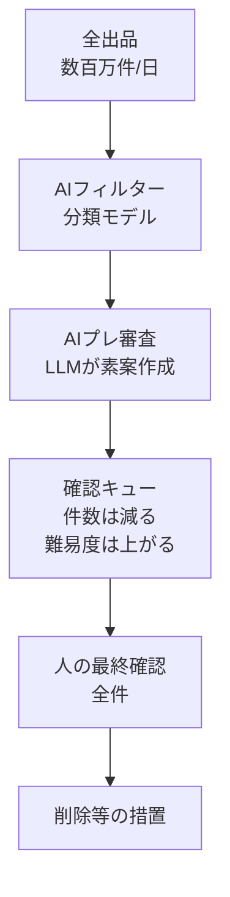

## この記事で扱うこと

LINEヤフーが Tech Blog で公開した、Yahoo!オークション・Yahoo!フリマの商品パトロール事例を題材にします。この事例には、AI導入プロジェクトを発注・承認する立場の人が知っておくべき数字の組み合わせが出てきます。

- 審査効率は最大で約50倍になった
- しかし人の審査時間はほとんど変わらなかった

「モデルの精度が足りないから」ではありません。原因は**業務の確認構造**にあります。この記事では、なぜこの2つが同時に起きるのかを分解し、自分の業務で同じ罠を避けるための判断材料を整理します。

対象読者は、AI活用の投資判断をする人、業務プロセスを設計する人、そして「AIを入れたのに人が減らない」という報告を受け取る立場の人です。

*この記事の全体像。以下、順に解説します。*

## 何が起きたのか

Yahoo!オークションとYahoo!フリマには、毎日数百万件の出品があります。その中から規約違反の商品を見つけて削除するのが商品パトロールです。

この業務は3段階で進化してきました。

| 段階 | やり方 | 審査効率(指数) |
|---|---|---|
| クエリ時代 | 1000種類以上の検索クエリで違反候補を抽出 | 1 |
| AIフィルター | 分類モデルが違反可能性をスコアリングして絞り込み | 約26 |
| AIプレ審査 | LLMが「どこが・どの基準で・なぜ」の素案を作成 | 約50 |

ここでの審査効率とは、**審査した商品のうち削除等の措置につながった割合**です。クエリ時代を1とした指数で表されています。26倍・50倍という数字は、無駄な確認がそれだけ減ったことを意味します。

ところが同じ発表資料の中で、人の審査時間を示すグラフは3段階ともほぼ同じ高さで、キャプションには「Almost unchanged」と書かれています。

さらに発表資料では、ボトルネックが「not AI quality / HITL structure」と明示されています。つまりAIの品質ではなく、Human-in-the-loop（人が最終確認に入る）という構造そのものが原因だと、当事者自身が特定しているわけです。

## なぜ効率と時間が別々に動くのか

この現象は、2つの指標が測っているものが違うと理解すると腑に落ちます。

- **審査効率** = 見た1件あたりの措置率
- **業務時間** = 確認キューの件数 × 1件あたりの判断コスト

AIフィルターとAIプレ審査は、キューの**件数**を劇的に減らします。明らかに問題のない商品が人の目に届かなくなるからです。しかし同時に、キューに残るのは「AIでも判断が割れる難しい商品」ばかりになります。1件あたりの判断コストが上がるのです。

そして最後に全件を人が確認する構造が残っている限り、この2つは相殺します。

加えて、AIプレ審査を入れると人の仕事に新しい作業が1つ増えます。**AIが出した素案が妥当かどうかの検証**です。商品そのものを見る作業に、AI出力をレビューする作業が重なります。

この構図は新しいものではありません。Lisanne Bainbridge が1983年に「Ironies of Automation（自動化の皮肉）」として指摘した現象と同型です。自動化しやすい部分を機械に渡すと、人に残るのは自動化できなかった最も難しい部分になります。しかも出番が減るぶん、その難しい判断をこなす技能は錆びていきます。

## AIと人をどう分担させたのか

LINEヤフーは、商品パトロールという仕事を2つに割っています。

- **Find** — 大量の出品から違反候補を見つける
- **Judge** — 見つけた候補がガイドラインに違反しているか判断する

そして、それぞれに向いた技術を当てています。

| 工程 | 担当技術 | 出力 |
|---|---|---|
| Find | 分類モデル | 違反可能性スコア、確認すべき観点の上位3件 |
| Judge | LLM | 問題箇所のハイライト、関連する基準へのリンク、判断理由の素案 |

発表資料の画面例では、審査担当者の画面に「Needs Review」というステータス、問題箇所としてハイライトされた語句、そして「Related Policy」のリンクが表示されています。

この分担は「精度の高いモデルに一本化する」という発想ではありません。**探索範囲の削減（Find）と、判断作業の認知負荷削減（Judge）を別々の問題として扱っている**点が要点です。

- 大量かつ日々変化する出品から候補を絞る作業は、過去の審査結果から学習した分類モデルが向いている
- 300を超える基準と商品の文脈を読み分けて説明する作業は、LLMが向いている

これを支えるのが AutoLearning という社内ツールです。分類モデルの学習・評価・推論と、プレ審査のワークフローやプロンプトを、同じ現場サイクルで回せるようにしてあります。PoCを作って現場に渡し切る形ではなく、現場が継続的に改善する前提の基盤です。

なお、使用モデル名、特徴量、LLMのベンダー、各段階の精度は公開されていません。

## 業務を「AI-Ready」にする5条件

ここからが、この事例の最も移植しやすい部分です。

LINEヤフーは、人向けに書かれた審査指示書をそのままAIに渡しても機能しないと述べています。指示書には3つの課題があるからです。

1. **曖昧さ** — 人なら文脈で補える表現が、そのまま残っている
2. **暗黙知** — ベテランの頭の中にあり、文書化されていない
3. **手順の継ぎ足し** — 例外対応を継ぎ足した結果、分岐が複雑化している

そこで、AIが処理できる状態を5つの条件として定義しています。

| # | 条件 | 人向け指示書での欠落例 |
|---|---|---|
| 1 | 目的やゴールが明確 | サービスとして守りたい状態が、AIへの達成目標になっていない |
| 2 | 判断基準が明文化 | 「出品物と関係のないカテゴリ」の「関係がない」が未定義。ルールが優先順位なく並記されている |
| 3 | 必要な情報が構造化 | 商品情報・画像・カテゴリ・関連ガイドラインが、AIへの入力として揃っていない |
| 4 | 例外や境界が定義 | ローカルルールが文書の外にある。AIは与えられないルールを参照できない |
| 5 | 業務フローが単純 | 継ぎ足した分岐と、複数文書を行き来する手順をそのまま移そうとしている |

注目したいのは、この5条件が**AIの話ではなく業務設計の話**である点です。1から5のどれも、AIを導入しなくても業務の質を上げる項目です。逆に言えば、AI-Ready化とは「曖昧なまま回してきた業務を、曖昧でなくする」作業だということになります。

プロンプトの位置づけも、これに沿って整理されています。プロンプトは命令文ではなく、**何を見て・どの基準で・どう判断し・どう説明するかの設計図**として扱われます。運用面では2層に分けます。

- **共通規約** — 少人数で管理する。全カテゴリに効く土台
- **カテゴリ固有の規約** — 各カテゴリの担当者が並行して更新する

規約全体を一人がプロンプト化できる規模ではないため、体制のほうを先に設計しているわけです。

## 人の役割をどこへ動かすのか

業務時間を実際に減らすには、AIだけで完結する領域を作るしかありません。LINEヤフーは判断権限を3つに区分しています。

| 区分 | 対象 | 人の関与 |
|---|---|---|
| Human-only | 影響が大きい、基準が不定、新しい手口 | 人が判断する |
| Human-in-the-loop | 現在の本流 | AI素案を人が確認する |
| AI-only | 基準・例外・情報が構造化された領域 | 人が介在せず完結する |

そして人の役割を、商品の全件確認から次へ移す方針を示しています。

| 時点 | 人の役割 | AIの役割 |
|---|---|---|
| HITL前提 | 商品を監視し、最終判断する | 人を支援する（絞り込みと素案作成） |
| AI-Ready方針 | AIを運用・改善する（基準設計、品質管理、プロンプト改善） | 商品を監視し、定義済み領域では判断を完結する |

関係部門への説明材料として挙げられているのは3点です。

1. 全件人確認では全体時間が減らないという業務データ
2. AIと人の判断が食い違ったケースの検証（人の側の見落としも含む）
3. 人向け指示書がAI-Readyになっていないという指摘

2点目は特徴的です。AIの誤りだけでなく、人の見落としも同じ土俵で検証しています。ただし公開されているのは「そうしたケースが存在した」という水準までで、件数や割合は示されていません。

## 人の確認を外すときに設計すべきもの

ここは、公開情報だけでは埋まらない部分です。**人確認を外す定量的なゲート（精度目標、誤削除率の上限、対象カテゴリ、スコアしきい値）は公開されていません。** 誤判定が起きたときに誰が名義人になるのか（現場、CAP部門、サービス事業部、AI倫理ガバナンス部門）も記載がありません。

同社は「AIに判断を任せても、組織としての責任がなくなるわけではない」と述べ、設計対象として次を挙げています。

- どの領域をAIに委ねるか
- 判断権限と責任の分担
- 誤りが起きたときのリカバリー
- パトロールの前後フロー

責任あるAIの全社的な枠組み（ハイリスク案件はAI倫理ガバナンス部門とCxOが連携して決定、ローリスクは教育済み社員の自律）は存在しますが、この商品パトロールへの適用手順は接続されていません。

外部の知見を突き合わせると、設計すべき論点が見えてきます。

**規制の観点。** EU AI Act 第14条は、ハイリスクAIに実効的な人の監督、automation bias（自動化への過信）への意識、そして上書きと停止の手段を求めています。GDPR 第22条は、重大な影響を持つ「自動化のみの決定」に対して人の介入と異議申立を求めます。出品削除は出品者にとって営業上の不利益なので、該当しうる領域です。

ただし、これらは「人を消すな」という要求ではありません。**全件承認キューをやめてよいが、監督・異議・例外は別経路で設計せよ**と読むのが妥当です。全件を機械的に承認する運用は、規制が求める「実効的な監督」を満たしているとは言い難いからです。

**例外処理の観点。** DiSorbo らの研究（arXiv:2503.02976）は、既製のLLMがポリシーの例外処理で人より厳格に振る舞うことを示しています。シャツの返品シナリオでは人間の72.7%が返品を受け付けた一方、LLMは規定文言どおりに拒否する回答が大多数でした。境界を定義しないままAI-onlyにすると、**過剰削除の側に振れる**リスクがあります。

**運用の観点。** 人の確認を残していても、rubber stamp（形式的な承認）と責任の空洞化は起こります。そして同じ欠陥は、人を外したあとのサンプリング監査にもそのまま移ります。監査を「置いた」だけでは機能しません。

**実装の観点。** プロンプトは提案であり、強制力を持つのはコードです。公開されている範囲ではプロンプト設計図の段階までで、出品文がプロンプトを汚染する経路（プロンプトインジェクション）への対策は記載されていません。悪意ある出品者が説明文に指示を仕込む攻撃面は、この業務に固有のリスクです。

なお、同社のフリマ・オークションの安全説明（2025年7月時点）は「AIチェック＋専門チームの目視」の併用のままです。AI-only は検証と合意のフェーズであり、稼働している事実ではない点は押さえておく必要があります。

## 自分の業務に当てはめる

この事例を「自動化率の成功談」として使うと読み違えます。持ち帰るべきは次の3点です。

### 1. 指標を分けて測る

審査効率（見た1件あたりの措置率）と業務時間（キュー件数 × 1件コスト）は別物です。前者だけが改善しても後者は動きません。

自分の業務では、工程ごとに次を測るところから始めます。この事例は、これらの実数を公開していません。

- 確認件数
- 例外率
- 1件あたりの判断時間
- 差し戻し率

### 2. 手順書を5条件で点検する

AIに渡す前に、人向け手順書の曖昧語、優先順位の欠落、文書外ルール、継ぎ足された分岐を直します。この作業はAI導入の可否と関係なく効きます。

プロンプトは共通規約と個別規約に分け、**変更権限を先に決めます**。現場が個別規約を更新でき、かつ共通規約を壊せない形にするのが要点です。

### 3. AI-only の候補を絞る

人を外す領域は、次の3条件を満たす範囲に限定します。

- 影響が小さい
- 基準が明文化できる
- 誤りが取り消せる

そのうえで、精度目標だけでなく、例外定義・上書き経路・異議申立・リカバリーの所有者を同時に設計します。

### この事例と逆に振れる業務

なお、次のような業務では結論が変わります。自分の業務がどちら側かを先に確かめてください。

- 残る案件が簡単で、1件あたりのコストが下がる業務（この事例と逆）
- 誤処理が可逆で、事後訂正のコストが小さい業務
- 出力が重大な不利益処分になり、自動化のみの決定が規制上許されない業務

## まとめ

- 審査効率は約26倍から約50倍まで上がったが、人の審査時間はほぼ変わらなかった
- 原因はモデル精度ではなく、全件を人が最終確認する構造にある
- 前段のAIはキュー件数を減らすが、残る案件が難化して1件コストが上がり、相殺される
- 業務時間を動かすレバーは、AI-only領域の切り出しと、基準・例外・責任分界の再設計にある
- AI-Ready化の5条件（目的、基準、情報構造、例外境界、フロー単純化）は、AI導入と関係なく業務設計として効く
- 人確認を外す定量ゲートと誤判定時の責任者は公開されていない。規制文献は「全件承認キューをやめ、監督・異議・例外を別経路で設計せよ」と読むべき

AIを入れる前に、まず自分の業務で確認件数・例外率・1件判断時間・差し戻し率を測ってみてください。効率指標と業務時間が別々に動く構造が見えるはずです。

この記事が少しでも参考になった、あるいは改善点などがあれば、ぜひリアクションやコメント、SNSでのシェアをいただけると励みになります！

## 参考リンク

1. LINEヤフー「AIを入れても、なぜ業務量は思ったほど減らないのか」Tech Blog, 2026-08-19. https://techblog.lycorp.co.jp/ja/20260819a
2. Tech-Verse 2026 Session 17. https://tech-verse.lycorp.co.jp/2026/ja/sessions/17.html
3. Nishimura, T., Onishi, K. "Why doesn't AI reduce the workload as much as expected" Speaker Deck, 2026-06-29. https://speakerdeck.com/lycorptech_jp/why-doesnt-ai-reduce-the-workload-as-much-as-expected-the-limits-of-human-in-the-loop-and-ai-ready-workflow-design
4. LINEヤフー「責任あるAIへの取り組み」 https://www.lycorp.co.jp/ja/sustainability/esg/social/responsible-ai/
5. Yahoo!フリマ・オークション 安全・安心レポート（2025年7月） https://guide-ec.yahoo.co.jp/safety/report/
6. LINEヤフー「AI Readyな開発環境の整え方」Tech Blog, 2026-07-23. https://techblog.lycorp.co.jp/ja/20260723a
7. Regulation (EU) 2024/1689, Article 14 Human Oversight. https://artificialintelligenceact.eu/article/14/
8. GDPR Article 22. https://gdpr-info.eu/art-22-gdpr/
9. Bainbridge, L. "Ironies of Automation." *Automatica* 19(6), 1983. https://ckrybus.com/static/papers/Bainbridge_1983_Automatica.pdf
10. DiSorbo, M. D., Ju, H., Aral, S. "Teaching AI to Handle Exceptions." arXiv:2503.02976. https://arxiv.org/abs/2503.02976
11. Huk, A. "From Capabilities to Responsibilities." O'Reilly Radar, 2026-05-11. https://www.oreilly.com/radar/from-capabilities-to-responsibilities/
12. Bloomberg, J. "Why 'human in the loop' falls short." SiliconANGLE, 2026-05-31. https://siliconangle.com/2026/05/31/human-loop-falls-short/
