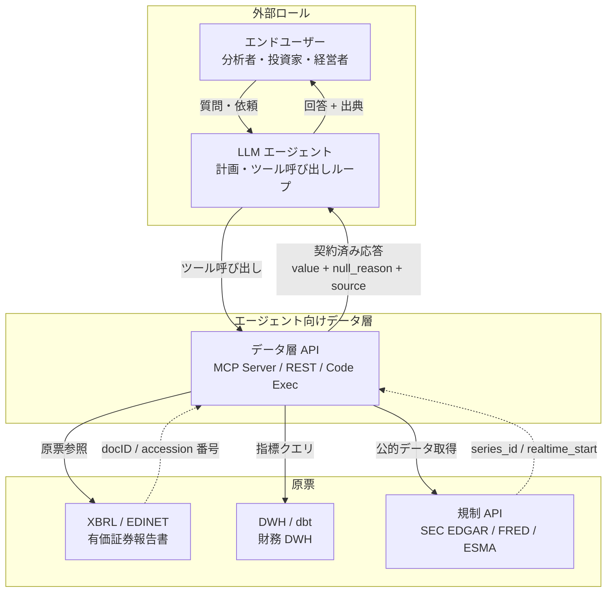
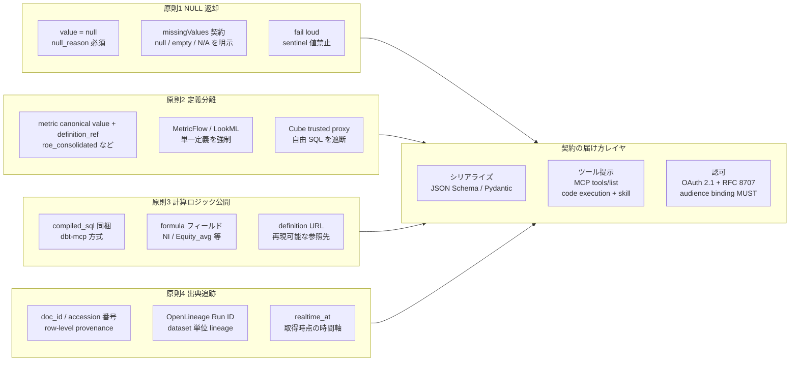
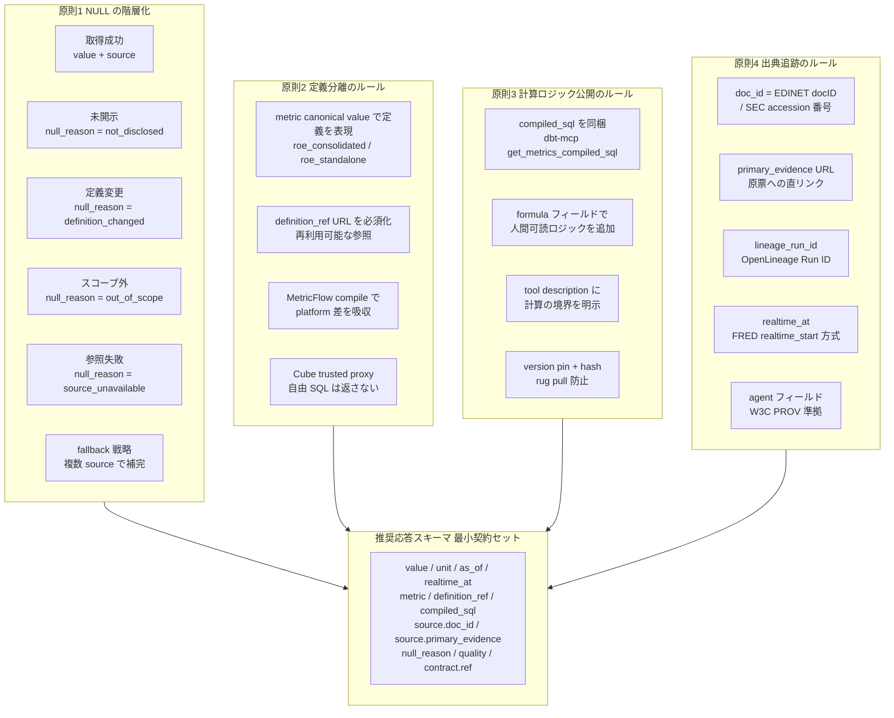
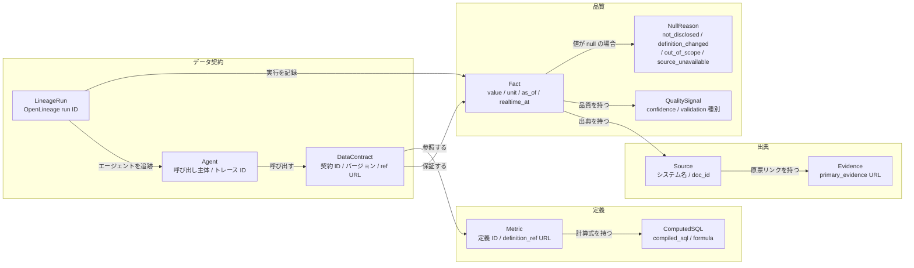
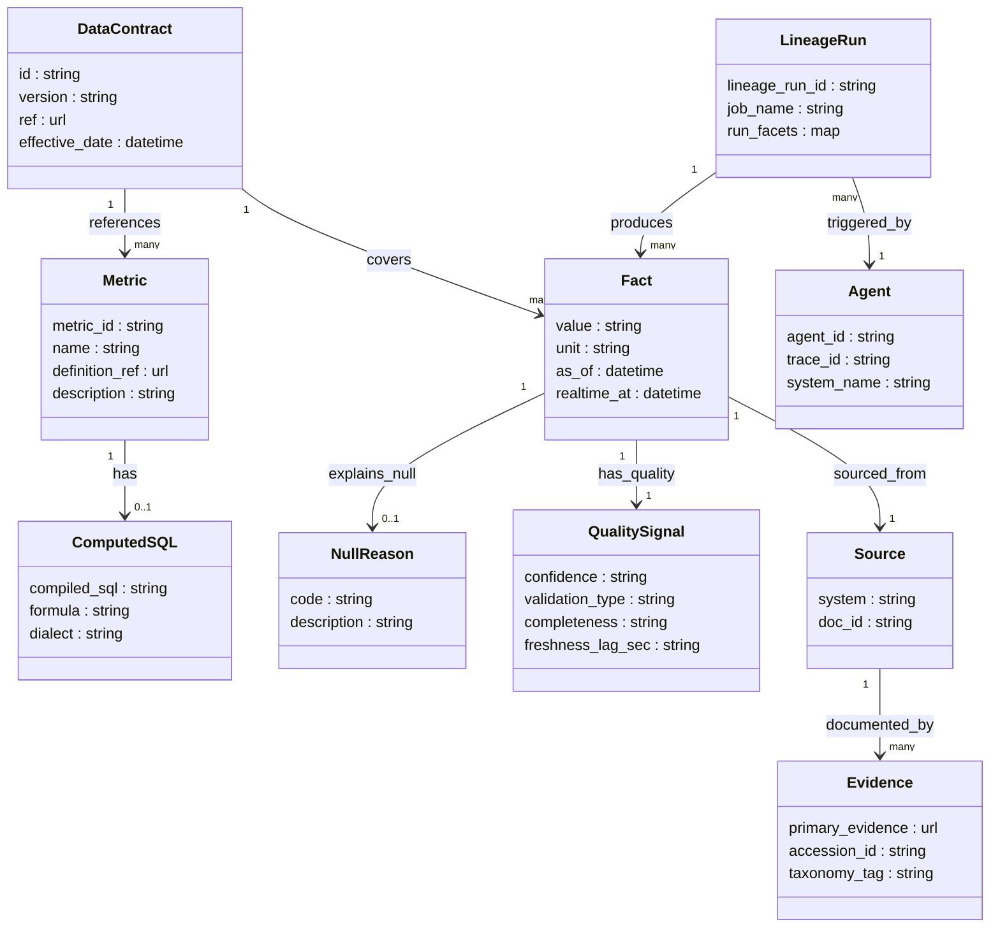
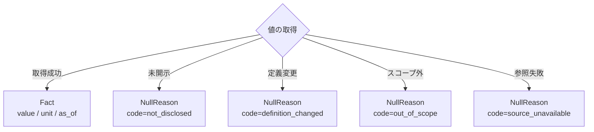

## 概要

### この方法論が解く問題

LLM エージェントがデータの主要消費者になったことで、データ基盤に求められる設計要件が変わりました。従来の REST API 設計は「人間の開発者が読む OpenAPI ドキュメント」を前提としていました。LLM エージェントは実行時に tool 定義を読み込み、自律的にツールを呼び出します。この根本的な消費者の違いが、新しい設計原則を必要とする背景です。

| 軸 | 人間向け API 設計 | エージェント向けデータ層設計 |
|---|---|---|
| ドキュメントの読者 | 人間の開発者 | LLM（実行時にトークン単位で読む） |
| 欠損値の扱い | 慣習的なセンチネル値（`-1`、`N/A`） | 明示的 NULL + 欠損理由フィールド |
| 値の定義 | 暗黙の合意（README 参照） | 定義 URL を応答に同梱 |
| 計算ロジック | ブラックボックス | SQL/数式を応答に含めて検証可能にする |
| 出典 | 記載なし | 原票 ID + URL を値ごとに返す |
| エラー | HTTP ステータスコード | プロトコルエラーと論理エラーの二層分離 |

EDINET DB が実装した上場企業財務データ API は、この移行の実例です。同 API は金融庁の法定電子開示（XBRL）を機械読み取りし、LLM が幻覚を起こしにくい応答形式で返します。

### 位置づけ

本方法論は特定ツールやプロトコルへの依存なしに成立する設計原則の体系です。実装手段として MCP（Model Context Protocol）を採用する場合も、REST API に留まる場合も、あるいは Anthropic が推奨する code execution パターンを選ぶ場合も、原則は共通して適用できます。

```
[方法論の射程]

  データ契約 4 原則          ← 安定。規制業界 API の延長線上
       ↓ 適用
  シリアライズ・届け方       ← 流動。MCP / REST / code execution が競合
       ↓ 選択
  LLM エージェント           ← 消費者
```

### なぜ今必要か

三つの変化が同時に起きています。

1. **LLM の普及**: ChatGPT 以降、LLM がデータ API を直接呼び出すユースケースが急増しました。
2. **ハルシネーションの実害**: LLM は構造的に「答えを返す」方向に訓練されており、欠損値を勝手に補完する傾向があります。財務データの誤引用は法的・信用リスクに直結します。
3. **規制の強化**: EU AI Act（2024-08 発効）は high-risk AI system に対してデータガバナンス・ロギング・透明性を義務化しました。エージェント API が「何のデータを参照したか」を記録しない設計は規制リスクを抱えます。

## 特徴

### 契約 4 原則

本方法論の中核は以下の 4 原則です。これらは独立した主張ではなく、LLM の失敗モードに対応した防衛レイヤです。

| 原則 | 防いでいる失敗モード | 実装の核心 |
|---|---|---|
| **1. NULL 返却** | LLM が欠損を「それらしい数字」で補完する幻覚 | `value: null` に加え `null_reason` フィールドで欠損理由を構造化する |
| **2. 定義分離** | 連結/単独、IFRS/JGAAP など同名異義の値を混在させた誤答 | `metric` の canonical value に定義を含める（例: `metric="roe_consolidated"`）、`definition_ref` URL を応答に同梱する |
| **3. 計算ロジック公開** | エージェントが値を検算・再現できない不透明さ | `compiled_sql` または `formula` フィールドを応答に添付する |
| **4. 出典追跡** | 引用後に誤りが判明しても原票まで遡れない | 原票識別子（`doc_id`）と証拠 URL を値ごとに付与する |

#### 補足: NULL の階層化

NULL を返すだけでは LLM が補完を試みます。欠損理由を構造化することで、エージェント側のプロンプトが「この理由があれば補完せずユーザーに伝える」と処理できるようになります。

| null_reason | 意味 |
|---|---|
| `not_disclosed` | 法定開示義務なし、または未開示 |
| `definition_changed` | 期中に会計基準が変わり比較不可 |
| `out_of_scope` | この API のスコープ外 |
| `source_unavailable` | 原票の取得に失敗 |

### 関連手法との関係

| 要素名 | 説明 |
|---|---|
| **FAIR 原則** | 学術データ管理の Findable / Accessible / Interoperable / Reusable 原則。本方法論の「定義分離」と「出典追跡」は FAIR の Reusable 要件に直接対応する |
| **W3C PROV** | ドメイン非依存の出典データモデル（entity / activity / agent の三概念）。出典追跡原則の抽象基盤 |
| **HL7 FHIR Provenance** | W3C PROV を医療 API に実装したリソース形式。`target / agent / entity / signature` の構造が本方法論の `source` フィールド設計の参照モデル |
| **FRED / SEC EDGAR** | 米連邦準備銀行・SEC の公開 API。`series_id + originating_source + as_of` や XBRL `accession` 番号で出典を必須化しており、規制業界における先行実装 |
| **OpenLineage** | パイプライン間の lineage を標準化するオープン仕様（LF AI & Data）。column-level lineage facet が出典追跡の実装標準 |
| **Data Contract Specification（ODCS）** | データの生産者・消費者間の合意インターフェースを YAML で定義する標準（Bitol Foundation）。`missingValues` / `nullValues` フィールドで欠損ポリシーを契約化する |
| **dbt Semantic Layer / MetricFlow** | 指標定義を YAML に集約し、どの DWH でも同じ数字を返す仕組み。dbt-mcp の `get_metrics_compiled_sql` ツールが「値 + コンパイル済み SQL」を返すパターンを具現化 |
| **Cube（Agentic Analytics Platform）** | すべてのクエリを定義済みメトリックに通す "trusted proxy" アーキテクチャ。エージェントが自由 SQL を組むことを禁止し、定義逸脱を構造的に防ぐ |
| **MCP（Model Context Protocol）** | Anthropic が策定したエージェント向けツール標準。Tools / Resources / Prompts を制御モデルで分離し、`inputSchema` + `outputSchema` + OAuth 2.1 認可を規定する。本方法論では「契約原則のシリアライズ形式の一つ」と位置づける |

### 類似手法との比較

本方法論が「契約 4 原則」を通じて何を達成するかを、近隣手法と対比します。

| 比較軸 | 本方法論（契約 4 原則） | Data Contracts 1.0（DCS/ODCS） | dbt-mcp | Cube |
|---|---|---|---|---|
| **主な対象読者** | LLM エージェント | データエンジニア・消費者チーム | LLM エージェント + アナリスト | LLM エージェント + BI |
| **定義する範囲** | API 応答スキーマの原則 | データセット全体の品質・SLA・サービスレベル | Semantic Layer のメトリック定義 | Semantic Layer + クエリ制御 |
| **欠損値の扱い** | `null` + `null_reason` 必須 | `missingValues: [null, '', 'N/A']` で契約 | null の扱いは DWH 依存 | 返却する指標を限定し欠損を減らす |
| **定義分離** | `metric` 名 + `definition_ref` URL | モデル定義 + `definitions` ブロック | `list_metrics` + `get_dimensions` | data model の `view` / `measure` |
| **計算ロジック公開** | `compiled_sql` / `formula` を応答に同梱 | 仕様に含まれない（オプション記述のみ） | `get_metrics_compiled_sql` ツール | `/sql` エンドポイントで SQL 返却 |
| **出典追跡** | 値ごとに `doc_id` + `primary_evidence` | リネージ仕様は別途 OpenLineage に委ねる | ジョブ run ID は返さない | 原票 ID を返す標準設計なし |
| **MCP 依存** | なし（原則は実装非依存） | なし | MCP サーバとして提供 | REST / GraphQL / SQL（MCP は別途） |
| **セキュリティ考慮** | 原則レベルでは明示なし | 契約レベルの SLA に留まる | OAuth 2.1（MCP 仕様に依存） | trusted proxy で SQL 注入を遮断 |
| **ステータス** | 実装原則（2024-2026 実例） | ODCS v3 へ移行中（DCS は 2026 末 deprecated 予定） | v1.18.0（2026-05-08 最新） | 現行メンテナンス中 |

### MCP 採用判断との関係

本方法論は MCP を否定しません。ただし MCP の役割を「契約原則のシリアライズ形式と配布規約」として限定的に定義します。

```
エージェント呼び出し
      │
      ├─ 社外配布 + ツール数安定 → MCP Server（契約 4 原則を outputSchema に反映）
      │
      ├─ 社内専用 / トークン効率重視 → Code Execution + Skill Loading
      │    （コミュニティ討議で 150K → 2K tokens 程度の削減が報告された例あり）
      │
      └─ 既存 REST が安定している → REST API + 応答フィールドに 4 原則を追加
```

契約原則の安定性と、ツール提示レイヤの流動性を切り分けることが、本方法論の核心的な設計判断です。

## 構造

### システムコンテキスト図



| ロール | 説明 | 参照規格 |
|---|---|---|
| LLM エージェント | 計画フェーズとツール呼び出しループを持つ自律主体。ツール定義（description / inputSchema）を runtime に読む | Anthropic ACI、MCP spec Tools |
| エージェント向けデータ層 | 4 原則を実装した API 境界。MCP Server、REST、code execution いずれかで届ける | MCP specification 2025-06-18 |
| XBRL / EDINET | 金融庁が管轄する法定電子開示。docID で原票を特定可能。2024-04 以降 v2 API で機械可読を全面化 | EDINET v2 API、XBRL Japan |
| DWH / dbt | MetricFlow で指標を単一定義化。dbt-mcp 経由で compiled_sql を返却できる | dbt Semantic Layer、dbt-mcp |
| 規制 API | SEC EDGAR（accession#）、FRED（series_id + source_id）、ESMA（FIRDS）、BIS/SDMX。出典が設計上必須 | SEC EDGAR API、FRED API |
| エンドユーザー | 分析者・投資家・経営者。LLM を経由して質問し、出典付き回答を受け取る | — |

### コンテナ図



| コンテナ | 役割 | 安定性 |
|---|---|---|
| 原則1 NULL 返却 | 欠損を欠損として届ける。`null_reason` で LLM が「諦める」ための理由を提供 | 高い（変化少ない） |
| 原則2 定義分離 | 同名異義の指標を分離。`definition_ref` URL + MetricFlow / Cube で単一定義を保証 | 高い |
| 原則3 計算ロジック公開 | `compiled_sql` または `formula` を応答に同梱。エージェントが検算・定義差異を診断できる | 高い（ただしセキュリティ制約要） |
| 原則4 出典追跡 | row-level で docID / accession# を返す。`realtime_at` で「いつ取得した版か」を追跡可能に | 高い |
| シリアライズ | JSON Schema / Pydantic で strict 化。nullable を明示。deep nest 回避 | 中（ODCS v3 へ統合中） |
| ツール提示 | MCP `tools/list` または code execution + skill loading。2024 → 2026 で後者に分岐 | 流動（Anthropic が方針転換中） |
| 認可 | OAuth 2.1 + RFC 8707 audience binding MUST。token passthrough 禁止（confused deputy 対策） | 高い |

### コンポーネント図



#### 原則1: NULL の具体ルール

| ルール | 内容 | 根拠 |
|---|---|---|
| `null_reason` 必須化 | value が null のとき `not_disclosed / definition_changed / out_of_scope / source_unavailable` の enum を返す | LLM は NULL を見ても「I don't know」を返さず幻覚で埋める傾向がある。理由を明示することで「諦めの根拠」を与える |
| sentinel 値禁止 | `0 / -1 / N/A / 9999` での欠損表現を禁止し、`value: null` に統一 | Great Expectations `missingValues` 契約。sentinel が混在するとモデルが誤った数字を事実として扱う |
| `missingValues` 契約 | Data Contract Specification で `missingValues: [null, '', 'N/A']` を明示。生産者・消費者・エージェントが同じ定義を共有 | ODCS v3 / datacontract-specification |
| fallback 戦略 | 単一 source の NULL を複数 source の fallback で補完する場合は補完元 source を `source.fallback_from` に記録 | EDINET 文脈では IFRS / US GAAP で NULL 集合が異なる。NULL 単独では retry 無限ループを誘発する実例あり |

#### 原則2: 定義分離の具体ルール

| ルール | 内容 | 根拠 |
|---|---|---|
| `metric` の canonical value に定義を含める | `metric="roe_consolidated"` / `"roe_standalone"` / `"roe_ifrs"` のように命名。同名異義を排除 | dbt MetricFlow「one definition, one source of truth」 |
| `definition_ref` を必須フィールドに | `https://example.com/metrics#ROE_consolidated` 形式で永続 URL を返す | OpenAI の「semantic, stable identifiers」推奨 |
| MetricFlow でプラットフォーム差を吸収 | YAML 定義から Redshift / Snowflake / BigQuery 向け SQL をコンパイル。どの環境でも同じ数字 | dbt Semantic Layer |
| Cube trusted proxy | エージェントが自由 SQL を組むのを禁止し、定義済みメトリックを経由させる | Cube「all queries must pass through this deterministic runtime」 |

#### 原則3: 計算ロジック公開の具体ルール

| ルール | 内容 | 根拠 |
|---|---|---|
| `compiled_sql` を応答に同梱 | 値だけでなく「この値を出した SQL」を返す。エージェントが検算・定義差異の診断に使える | dbt-mcp `get_metrics_compiled_sql` |
| `formula` フィールドで人間可読ロジックを追加 | `"NI / Equity_avg"` のような記述を補足として載せる | エージェントのプロンプト上での文脈補強 |
| tool description に計算の境界を明示 | 「この指標は連結 ROE のみ。単独 ROE は別ツールを使え」のような境界を description に書く | Anthropic「junior developer doc」比喩、境界明示が "諦め" の精度を上げる |
| version pin + hash 検証 | tool description のバージョンと hash を契約に含め、rug pull（silent redefinition）を検知する | Invariant Labs PoC: tool 定義の改竄が攻撃面になる |

#### 原則4: 出典追跡の具体ルール

| ルール | 内容 | 根拠 |
|---|---|---|
| `doc_id` を row-level で返す | EDINET docID または SEC accession 番号。値ごとに原票を特定できる | FHIR Provenance `entity[]`、OpenLineage column-level facet と同構造 |
| `primary_evidence` に原票 URL を返す | `https://disclosure.edinet-fsa.go.jp/...` の直リンク。エージェントが回答で引用できる | FRED series の `link`、FORCE11 Data Citation Principles |
| `lineage_run_id` で OpenLineage と接続 | Dataset レベルの lineage を OpenLineage Run ID で参照可能にする | OpenLineage spec、Atlan / Collibra のカタログ連携 |
| `realtime_at` で取得時点を管理 | FRED の `realtime_start/end` 方式。「いつ時点でデータベースに入っていた値か」を別軸で保持。過去の意思決定を再現可能にする | FRED API、ESMA FIRDS、BIS/SDMX の共通設計 |
| `agent` フィールドで処理エンティティを記録 | W3C PROV の `agent` 概念。`system: "edinet-mcp/0.3.1"` 形式 | FHIR Provenance `agent`、W3C PROV-Overview |

#### アンチパターン対比表

| アンチパターン | 起こる失敗モード | 対応する原則 |
|---|---|---|
| 欠損を `0 / -1 / 平均値` で埋めて返す | LLM が誤った数字をそのまま使い幻覚が見えない | 原則1 |
| `null_reason` なしの `null` | LLM が NULL を無視して推測補完。または empty response で retry 無限ループ | 原則1 |
| 同名異義の指標を単一フィールドで返す | 連結 / 単独、IFRS / JGAAP 混在。「どの数字が正しいか」問題が応答に転写 | 原則2 |
| `definition_ref` なし | エージェントが指標の意味を自己解釈してサマリーを誤る | 原則2 |
| 計算 SQL を隠す | エージェントが結果を検算できない。中間推論の検証不能 | 原則3 |
| tool description に境界を書かない | エージェントが類似ツールを取り違える。呼び出し回数が増加 | 原則3 |
| 数字だけ返して出典を持たない | 監査・規制対応で破綻。誤りの追跡不能 | 原則4 |
| `realtime_at` を持たない | 過去の応答を再現できない。時間軸の provenance 喪失 | 原則4 |
| ツール定義を全部 MCP に積む | コミュニティ討議で 150K トークン消費・ツール選択精度 43% → 14% 低下の報告例あり | 届け方レイヤ |

## データ

### 概念モデル

エージェント向けデータ契約を構成する 4 つの関心領域と、エンティティ間の依存関係を示します。



| エンティティ | 説明 |
|---|---|
| DataContract | 契約責任の中心。定義・出典・品質の各サブグラフを参照・保証する |
| Fact | 値の実体。NULL の場合は NullReason に委譲することで LLM の補完幻覚を構造的に防ぐ |
| LineageRun | OpenLineage の Run エンティティに対応し、値の来歴を実行単位で記録する |
| Agent | W3C PROV / FHIR Provenance の `agent` 概念に対応し、呼び出し主体の責任を明示する |

### 情報モデル



#### 属性設計の根拠

| エンティティ | 主要属性 | 引用元標準 |
|---|---|---|
| `Fact.realtime_at` | 取得時点の記録（vintage） | FRED `realtime_start/end` — 過去の意思決定を再現可能にする |
| `Fact.as_of` | データの観測時点 | FRED `observation_date`、FHIR `Provenance.recorded` |
| `NullReason.code` | `not_disclosed / definition_changed / out_of_scope / source_unavailable` | LLM の NULL 補完幻覚の抑止原則（Anthropic Building Effective Agents） |
| `Source.doc_id` | 原票の一意識別子 | EDINET `docID`、SEC EDGAR `accession number` |
| `Evidence.primary_evidence` | 原票への直リンク URL | SEC EDGAR `data.sec.gov` API、EDINET v2 API |
| `Evidence.accession_id` | 開示書類固有 ID | SEC EDGAR `accn`、EDINET ドキュメント ID |
| `Evidence.taxonomy_tag` | 会計概念の標準タグ | SEC EDGAR `us-gaap:Revenues`、EDINET XBRL タクソノミー |
| `Metric.definition_ref` | 指標定義への参照 URL | dbt Semantic Layer MetricFlow、Cube Meta API |
| `ComputedSQL.compiled_sql` | 計算に使った SQL | dbt-mcp `get_metrics_compiled_sql`、Cube `/sql` エンドポイント |
| `QualitySignal.confidence` | 信頼度 | Vertex AI `groundingSupports.confidenceScores`、DCS `quality.nullValues` |
| `LineageRun.lineage_run_id` | 実行追跡 ID | OpenLineage Run エンティティ |
| `Agent.trace_id` | 呼び出しトレース ID | W3C PROV `agent`、FHIR Provenance `agent[]` |
| `DataContract.ref` | 契約定義の URL | Data Contract Specification（ODCS v3）、Bitol Foundation |

#### NULL 設計の補足

`Fact.value` が null のとき、`NullReason` が必須になります。`NullReason.code` の許容値と対応する失敗モードを次に示します。



LLM はシステムプロンプトで「`NullReason` が存在する場合は補完せず、理由をユーザーに伝える」と明記することで、NULL の握りつぶし幻覚を防げます。

## 構築方法

### 既存 REST API への「最小差分フィールド」適用

既存の REST API に対してゼロから再設計するのではなく、以下の差分フィールドを追加することで、LLM エージェント対応の最小契約を達成できます。段階 1（必須 4 フィールド）から開始し、段階 2 で計算ロジック公開用の `compiled_sql` / `formula` を追加するのが推奨手順です。

**段階 1（必須）**

| フィールド | 追加理由 | 参考原則 |
|---|---|---|
| `null_reason` | 欠損を sentinel value（`0`、`-1`）で埋めず、欠損の理由を明示 | Great Expectations "missingness as first-class citizen" |
| `source.primary_evidence` | 原票（XBRL accession number / EDINET docID 等）への直リンク | SEC EDGAR / EDINET API 設計 |
| `definition_ref` | 指標の定義 URL を返し、"which number is right?" を解消 | dbt Semantic Layer / ODCS |
| `as_of` | データの観測時点を ISO 8601 で明示し、vintage 問題を回避 | FRED `observation_date` / ESMA `realtime_start` |

**段階 2（計算ロジック公開）**

| フィールド | 追加理由 | 参考原則 |
|---|---|---|
| `compiled_sql` | エージェントが計算根拠を検算できるよう SQL を返す | dbt-mcp `get_metrics_compiled_sql` |
| `formula` | SQL が利用できない場合に人間可読の計算式を補足する（例: `"NI / Equity_avg"`） | エージェントのプロンプト上での文脈補強 |

**差分適用例（Before / After）**

既存 REST レスポンス:

```json
{
  "company": "7203",
  "net_sales": 45095000000000,
  "period": "2025-03"
}
```

最小 4 原則適用後:

```json
{
  "company": "7203",
  "net_sales": 45095000000000,
  "unit": "JPY",
  "as_of": "2025-03-31T23:59:59Z",
  "null_reason": null,
  "definition_ref": "https://edinet.fsa.go.jp/taxonomies/jpcrp_cor/NetSalesSummaryOfBusinessResults",
  "source": {
    "primary_evidence": "edinet://docID=S100RABCD#jpcrp_cor:NetSalesSummaryOfBusinessResults",
    "retrieved_at": "2026-05-11T08:00:00Z"
  }
}
```

### Pydantic / JSON Schema で契約スキーマを定義する

API 応答スキーマを Pydantic で定義することで、（a）バリデーション、（b）JSON Schema 自動生成、（c）FastMCP / OpenAI Agents SDK との接続が一括で得られます。

```python
from __future__ import annotations
from pydantic import BaseModel, Field, model_validator
from typing import Optional, Literal
from datetime import datetime

class SourceInfo(BaseModel):
    """データ出典メタデータ"""
    system: str = Field(
        description="取得元システム識別子 (例: 'snowflake://analytics.prod.fact_financials')"
    )
    doc_id: Optional[str] = Field(
        None,
        description="原票の一意識別子 (EDINET docID / SEC accession number 等)"
    )
    primary_evidence: Optional[str] = Field(
        None,
        description="原票への直リンク URL (EDINET / SEC EDGAR 等)"
    )
    retrieved_at: datetime = Field(
        description="取得時刻 (ISO 8601)"
    )

class FinancialMetricResponse(BaseModel):
    """財務指標応答の契約スキーマ (LLM エージェント向け)

    null_reason の扱い:
      - value != null の場合: null_reason は None（フィールドは常に存在する）
      - value == null の場合: null_reason は enum 必須（None は不可）
    """
    metric: str = Field(
        description=(
            "指標の canonical 名（定義を含める命名推奨: 例 'roe_consolidated'）。"
            "dbt Semantic Layer 等で単一定義されている識別子を使う"
        )
    )
    value: Optional[float] = Field(
        None,
        description="指標値。データ取得不能な場合は null を返す (sentinel value 禁止)"
    )
    unit: str = Field(
        description="単位 (例: 'JPY', '%', 'shares')"
    )
    as_of: datetime = Field(
        description="データの観測時点 (ISO 8601)。FRED の observation_date に相当"
    )
    null_reason: Optional[Literal[
        "not_disclosed",
        "definition_changed",
        "out_of_scope",
        "source_unavailable"
    ]] = Field(
        None,
        description=(
            "フィールドは常に存在する。"
            "value != null のときは None。"
            "value == null のときは enum 必須（省略不可）。"
            "エージェントへの補完禁止シグナル"
        )
    )
    definition_ref: Optional[str] = Field(
        None,
        description="指標定義 URL。エージェントが定義を照合するためのアンカー"
    )
    compiled_sql: Optional[str] = Field(
        None,
        description="計算に使用した SQL (dbt-mcp get_metrics_compiled_sql 方式)"
    )
    source: SourceInfo
    confidence: float = Field(
        ge=0.0, le=1.0,
        description="値の信頼度スコア (Vertex AI groundingSupports.confidenceScores に相当)"
    )

    @model_validator(mode="after")
    def null_reason_required_when_value_is_null(self) -> "FinancialMetricResponse":
        """value が null のとき null_reason は必須"""
        if self.value is None and self.null_reason is None:
            raise ValueError(
                "null_reason は value=null のとき必須です。"
                "not_disclosed / definition_changed / out_of_scope / source_unavailable のいずれかを指定してください。"
            )
        return self
```

JSON Schema の自動生成（FastAPI / FastMCP への組み込み）:

```python
import json
print(json.dumps(FinancialMetricResponse.model_json_schema(), indent=2))
# → MCP Tool の outputSchema にそのまま渡せる
```

### dbt-mcp の `list_metrics` / `get_metrics_compiled_sql` を使った metric 定義の露出

`dbt-labs/dbt-mcp` は MCP サーバとして Semantic Layer のメトリック定義を LLM エージェントに露出します。

**インストール（Local モード）**

```bash
uvx dbt-mcp
```

**MCP クライアント設定例**

```json
{
  "mcpServers": {
    "dbt": {
      "command": "uvx",
      "args": ["dbt-mcp"],
      "env": {
        "DBT_HOST": "your-dbt-cloud-host",
        "DBT_TOKEN": "${DBT_SERVICE_TOKEN}",
        "DBT_ENVIRONMENT_ID": "12345"
      }
    }
  }
}
```

**エージェントからの呼び出しフロー**

```python
# 1. メトリック一覧を取得 (エージェントが最初に呼ぶ)
#    Tool: list_metrics
#    → MetricToolResponse[] { name, type, label, description, metadata }

# 2. 特定メトリックのコンパイル済み SQL を取得
#    Tool: get_metrics_compiled_sql
#    Input: { metrics: ["net_sales"], group_by: ["company_id", "fiscal_year"] }
#    → { sql: "SELECT company_id, fiscal_year, SUM(...) FROM ..." }

# 3. メトリックの次元を確認
#    Tool: get_dimensions
#    Input: { metrics: ["net_sales"] }
#    → ["company_id", "fiscal_year", "segment", ...]

# 4. 実際のクエリ実行 (フィルタ付き)
#    Tool: query_metrics
#    Input: {
#      metrics: ["net_sales"],
#      group_by: ["company_id"],
#      where: "{{ Entity('company_id') }} = '7203'",
#      order_by: ["-net_sales"]
#    }
```

このコンパイル済み SQL を `compiled_sql` フィールドに同梱して応答することで、エージェントが「数字の計算根拠」を検証可能な形で提示できます。

### MCP サーバ実装最小例（FastMCP / Python）

FastMCP はデコレータで型アノテーションから自動的に inputSchema / outputSchema を生成します。以下は財務指標 MCP サーバの最小実装例です。

**インストール**

```bash
pip install fastmcp pydantic
```

**最小実装**

```python
from fastmcp import FastMCP
from pydantic import BaseModel, Field
from typing import Optional, Literal
from datetime import datetime

mcp = FastMCP(
    name="financial-data-mcp",
    instructions=(
        "上場企業の財務データを返す MCP サーバ。"
        "値が取得できない場合は value=null + null_reason を返す。"
        "エージェントは null_reason があるフィールドを補完してはならない。"
    )
)

class GetFinancialInput(BaseModel):
    company_id: str = Field(
        description="企業識別子 (EDINET 証券コード or CIK)"
    )
    metric: Literal["net_sales", "operating_income", "total_assets"] = Field(
        description="取得する財務指標名"
    )
    fiscal_year: int = Field(
        ge=2000, le=2030,
        description="会計年度 (例: 2025 = 2025年3月期)"
    )

@mcp.tool(
    name="get_financial_metric",
    description=(
        "上場企業の単一財務指標を取得する。"
        "返値は契約スキーマ準拠: value (null 可) + null_reason + source.primary_evidence + definition_ref + compiled_sql を含む。"
        "null_reason が非 null の場合、エージェントは推測による補完を禁止する。"
        "boundary: 四半期データは含まない。連結財務のみ。"
    )
)
def get_financial_metric(params: GetFinancialInput) -> FinancialMetricResponse:
    try:
        value, sql = _fetch_from_dbt_semantic_layer(
            company_id=params.company_id,
            metric=params.metric,
            fiscal_year=params.fiscal_year
        )
        return FinancialMetricResponse(
            metric=params.metric,
            value=value,
            unit="JPY",
            as_of=datetime(params.fiscal_year, 3, 31),
            null_reason=None,
            definition_ref=f"dbt://semantic_models/financials.yml#{params.metric}",
            compiled_sql=sql,
            source=SourceInfo(
                system="snowflake://analytics.prod.fact_financials",
                primary_evidence=_get_edinet_doc_id(params.company_id, params.fiscal_year),
                retrieved_at=datetime.utcnow()
            ),
            confidence=0.98
        )
    except DataUnavailableError as e:
        return FinancialMetricResponse(
            metric=params.metric,
            value=None,
            unit="JPY",
            as_of=datetime(params.fiscal_year, 3, 31),
            null_reason="source_unavailable",
            source=SourceInfo(
                system="snowflake://analytics.prod.fact_financials",
                retrieved_at=datetime.utcnow()
            ),
            confidence=0.0
        )

if __name__ == "__main__":
    mcp.run()
```

### Code Execution + Skill loading 構成への移行

MCP サーバを別プロセスで立てる代わりに、Anthropic Agent Skills を使うと Claude の code execution コンテナ内でスキルをファイルシステムベースで動的ロードできます。

**Agent Skills のアーキテクチャ（3 段階の progressive disclosure）**

| レベル | ロード契機 | トークンコスト | 内容 |
|---|---|---|---|
| Level 1: メタデータ | 常時（起動時） | ~100 tokens/スキル | YAML frontmatter の `name` と `description` |
| Level 2: 指示 | スキルが triggered されたとき | ~5k tokens 以下 | SKILL.md 本文（ワークフロー・ベストプラクティス） |
| Level 3: リソース/コード | 参照時 | 実質無制限（コンテキスト汚染なし） | scripts/*.py、REFERENCE.md 等 |

**API 呼び出し例（Agent Skills + code execution）**

```python
import anthropic

client = anthropic.Anthropic()

response = client.beta.messages.create(
    model="claude-opus-4-5",
    max_tokens=4096,
    betas=[
        "code-execution-2025-08-25",
        "skills-2025-10-02",
        "files-api-2025-04-14"
    ],
    container={
        "type": "persistent",
        "skill_ids": ["financial-data-fetcher"]
    },
    tools=[{"type": "code_execution_20250825"}],
    messages=[{
        "role": "user",
        "content": "トヨタ自動車 (7203) の FY2025 売上高を EDINET から取得してください"
    }]
)
```

## 利用方法

### エージェント側プロンプトでの契約の活かし方

**システムプロンプトへの埋め込みテンプレート**

```text
あなたは上場企業の財務データを分析するアナリストエージェントです。

## データ取得ルール
1. 財務指標は必ず get_financial_metric ツールを使って取得すること
2. ツール応答に `null_reason` が含まれる場合:
   - そのフィールドを推測・補完してはならない
   - ユーザに「{metric} は {null_reason} のため取得できませんでした」と正確に伝える
   - 代替データソースを提案する場合は、そのソースも同様に出典を明示する
3. `definition_ref` が存在する場合:
   - 応答に指標の定義 URL を引用する
   - 「{指標名}」の定義は {definition_ref} に基づく、と明示する
4. `compiled_sql` が存在する場合:
   - 数値の根拠として SQL ロジックをユーザに開示できる
   - 再現性が必要なユーザには SQL を提示する

## ハルシネーション防止
- ツール外から財務数値を生成することを厳禁とする
- "approximately", "roughly" などの曖昧表現で数値を出力しない
- 不確かな場合は「データが確認できません。ツールを再試行してください」と返す
```

**null_reason 対応の応答パターン**

```python
tool_result = call_tool("get_financial_metric", {
    "company_id": "7203",
    "metric": "net_sales",
    "fiscal_year": 2025
})

if tool_result["null_reason"] is not None:
    return f"""
net_sales は取得できませんでした。
理由: {tool_result['null_reason']}
定義参照: {tool_result.get('definition_ref', 'N/A')}
代替手段: EDINET API (https://disclosure2dl.edinet-fsa.go.jp/) で直接検索することを推奨します。
"""
else:
    return f"""
{tool_result['metric']}: {tool_result['value']:,} {tool_result['unit']}
観測時点: {tool_result['as_of']}
定義: {tool_result['definition_ref']}
出典: {tool_result['source']['primary_evidence']}
"""
```

### bulk endpoint 設計

単発リクエストを繰り返すとエージェントのループ回数が増大し、トークンコストが線形増加します。bulk endpoint を設計することで、複数年・複数指標を 1 ツール呼び出しで取得できます。

Anthropic の実測データによれば「Token usage alone explains 80% of the performance variance」であり、ループ回数の削減がコスト最適化の最重要施策です。

**bulk endpoint ツール定義**

```python
from pydantic import BaseModel, Field
from typing import Optional

class BulkFinancialRequest(BaseModel):
    company_id: str = Field(
        description="企業識別子 (証券コード)"
    )
    metrics: list[Literal["net_sales", "operating_income", "total_assets", "net_income"]] = Field(
        description="取得する指標リスト (最大 10 指標)"
    )
    fiscal_years: list[int] = Field(
        description="取得する会計年度リスト (最大 5 年)",
        min_length=1,
        max_length=5
    )

class BulkFinancialResponse(BaseModel):
    company_id: str
    results: list[FinancialMetricResponse]
    partial_failure: bool = Field(
        description="一部取得失敗がある場合 True。results 内の null_reason を確認"
    )

@mcp.tool(
    name="get_financials_bulk",
    description=(
        "上場企業の財務指標を複数年・複数指標で一括取得する。"
        "単発呼び出しの繰り返しを避け、ツール呼び出し回数を削減する。"
        "取得できない指標は value=null + null_reason で返す (補完禁止)。"
        "boundary: 最大 10 指標 × 5 年 = 50 行。超過する場合は分割して呼ぶ。"
    )
)
def get_financials_bulk(params: BulkFinancialRequest) -> BulkFinancialResponse:
    results = []
    has_failure = False
    for year in params.fiscal_years:
        for metric in params.metrics:
            result = _fetch_single(params.company_id, metric, year)
            if result.null_reason is not None:
                has_failure = True
            results.append(result)
    return BulkFinancialResponse(
        company_id=params.company_id,
        results=results,
        partial_failure=has_failure
    )
```

**呼び出し例**

```python
# 3 年分 × 3 指標 = 9 データポイントを 1 ツール呼び出しで取得
result = call_tool("get_financials_bulk", {
    "company_id": "7203",
    "metrics": ["net_sales", "operating_income", "net_income"],
    "fiscal_years": [2023, 2024, 2025]
})
# → results[9], partial_failure: false
```

### response の検算（compiled_sql を実行して再現）

`compiled_sql` を応答に含めることで、エージェントまたはユーザーが数値の独立検証（検算）を行えます。

```python
import duckdb

def verify_metric_response(response: FinancialMetricResponse) -> dict:
    if response.compiled_sql is None:
        return {"verified": False, "reason": "compiled_sql not provided"}

    conn = duckdb.connect()
    result = conn.execute(response.compiled_sql).fetchone()
    recalculated_value = result[0] if result else None

    if recalculated_value is None:
        return {"verified": False, "reason": "SQL returned no rows"}

    tolerance = 0.0001
    delta = abs(recalculated_value - response.value) / abs(response.value)

    if delta > tolerance:
        return {
            "verified": False,
            "reported": response.value,
            "recalculated": recalculated_value,
            "delta_pct": delta * 100,
            "action": "数値差異を検出。source.primary_evidence を直接参照することを推奨"
        }

    return {"verified": True, "delta_pct": delta * 100}
```

### Vertex AI grounding との組み合わせ

Vertex AI の Grounding API は応答テキストの位置インデックス単位で出典 URI と信頼度スコアを返します。MCP tool response の `confidence` フィールドとこの `groundingSupports.confidenceScores` を組み合わせることで、二層の信頼度検証を実現できます。

**エージェントパイプライン全体像**

```
User Query
    │
    ▼
[1] dbt-mcp: list_metrics + get_metrics_compiled_sql
    │  → metric 定義・計算 SQL を取得
    ▼
[2] MCP Tool: get_financials_bulk
    │  → value + null_reason + compiled_sql + source.primary_evidence
    ▼
[3] Vertex AI Grounding (オプション)
    │  → groundingChunks (EDINET URL) + groundingSupports (テキスト位置 + confidence)
    ▼
[4] enrich_with_grounding()
    │  → MCP response + grounding evidence を統合
    ▼
[5] エージェント応答生成
       「FY2025 売上高: 45,095,000 百万円
        出典: EDINET S100RABCD (信頼度 94%)
        定義: dbt://semantic_models/financials.yml#net_sales
        SQL: SELECT SUM(net_sales_amount) FROM ...」
```

## 運用

### 契約品質の観測指標

LLM エージェントが参照するデータ契約の健全性は、4 種類の指標で継続的に計測します。

#### null_reason_coverage_rate（付与率）

```
null_reason_coverage_rate = (null_reason が付与された null 件数) / (value == null の全件数)
```

目標値は 100%。`null_reason` が省略されると LLM がその欠損を補完し、誤値が無音で流通します。

#### null_reason_distribution（内訳率）

付与率が 100% を達成したうえで、各 enum 値の内訳比率を計測します。

| レベル | enum 値 | 意味 |
|---|---|---|
| L1 | `source_unavailable` | 上流ソース（EDINET 等）が未応答、または取得失敗 |
| L2 | `definition_changed` | IFRS / US GAAP の違いや会計基準変更で同名比較が成立しない |
| L3 | `out_of_scope` | 対象期間または取得対象が API のスコープ外 |
| L4 | `not_disclosed` | 法定開示義務外、または企業が任意開示していない |

`null_reason_distribution` をダッシュボード化し、`L1 (source_unavailable)` が増加傾向にある場合は上流ソースの可用性とリトライ・バースト対策を優先します。

#### definition_ref ヒット率

```
definition_ref ヒット率 = (HTTP 200 が返ったリクエスト数) / (definition_ref を含む全応答数)
```

URL が 404 / タイムアウトになる場合、エージェントは定義を参照できずハルシネーションが増加します。ヒット率の低下は契約バージョニングの問題を示すことが多いです。

#### agent tool call count 分布

1 タスクあたりのツール呼び出し回数の分布（中央値・P95・最大値）を計測します。

| タスク種別 | 目安ツール呼び出し回数 |
|---|---|
| ファクト検索（単一指標） | 3〜10 回 |
| 複数銘柄比較 | 10〜15 回 × 2〜4 サブエージェント |
| 深い調査（deep research） | 10+ サブエージェントを並列起動 |

P95 が各カテゴリの上限を大きく超えている場合、bulk endpoint の未使用や計算済み指標の未活用が疑われます。SWE-bench の実測では 49 呼び出しが事実上の上限として観測されており、それを超えているタスクは ReAct ループの無限化を疑います。

#### hallucination 率

```
hallucination 率 = (検算不一致の応答件数) / (検算対象の全応答件数)
```

検算は `compiled_sql` を直接実行する自動テスト、または `groundingChunks` / `groundingSupports` の信頼スコアで近似できます。hallucination 率が上昇した場合は definition_ref ヒット率と null_reason 内訳率を同時に確認します。

### 契約バージョニング

#### contract.ref のバージョン管理

データ契約は `id@version` 形式で識別します。

```json
"contract": {
  "id": "monthly_revenue",
  "version": "3.1.0",
  "ref": "https://contracts.example.com/monthly_revenue/v3.1.0"
}
```

バージョン管理は **SemVer（MAJOR.MINOR.PATCH）** を適用します。

| 変更内容 | バージョン変位 |
|---|---|
| 計算ロジックの意味的変更（分母変更・対象期間変更） | MAJOR++ |
| フィールド追加・null_reason 種別追加 | MINOR++ |
| ドキュメント修正・誤字訂正 | PATCH++ |

#### 互換性方針

- **後方互換変更（MINOR / PATCH）**: 既存エージェントはそのまま動作する。新フィールドは optional として追加する。
- **破壊的変更（MAJOR）**: 旧バージョンのエンドポイントを最低 30 日間並行稼働させ、migration period を設ける。
- **廃止通知**: `Deprecation` ヘッダまたは契約メタデータに `deprecated_at` / `sunset_at` を付与し、コンシューマへ伝達する。

### 定義変更時の運用（rug pull 対策）

MCP 仕様はツール定義（`tools/list` の内容）が実行中に変更されることをプロトコルレベルでブロックしません。Invariant Labs の PoC（2025 年 4 月）では「random fact of the day」を装ったサーバが 2 日目に挙動を変え、同一エージェントに接続された WhatsApp MCP サーバからチャット履歴を抽出する攻撃（rug pull / silent redefinition）が実証されています。

MCPTox ベンチマーク（AAAI 採録）では 7 つの MCP クライアントのうち 5 つがサーバ提供メタデータを検証しないことも確認されており、クライアント側の対策は期待できません。

#### 対策: 契約ハッシュ + audit log

ツール定義を受信するたびに SHA-256 ハッシュを計算し、前回値と比較します。

```python
import hashlib, json

def check_tool_integrity(tool_list: list[dict], stored_hash: str) -> bool:
    current = hashlib.sha256(
        json.dumps(tool_list, sort_keys=True).encode()
    ).hexdigest()
    if current != stored_hash:
        audit_log.warning("tool definition changed", hash=current, prev=stored_hash)
        return False
    return True
```

audit log には以下を必ず記録します。

| フィールド | 内容 |
|---|---|
| `timestamp` | ISO 8601 |
| `tool_name` | 変更が検出されたツール名 |
| `hash_before` / `hash_after` | SHA-256（短縮可） |
| `session_id` | エージェントセッション識別子 |
| `action` | `approved` / `blocked` / `pending_review` |

### レート制御

#### MCP 仕様上の位置づけ

MCP 仕様 2025-06-18 では「Servers MUST rate limit tool invocations」と規定されていますが、上限値・アルゴリズム・ヘッダ形式は仕様化されていません。HTTP transport では `429 Too Many Requests` + `Retry-After` ヘッダが業界標準です。

#### OAuth + RFC 8707 audience binding

HTTP transport の認可は **OAuth 2.1 + RFC 8707 Resource Indicators** が MUST です。`resource` パラメータを認可リクエストとトークンリクエストの両方に含めることで、「このトークンはどのリソースに対して発行されたか」を明示的に縛ります。

```http
POST /token HTTP/1.1
Content-Type: application/x-www-form-urlencoded

grant_type=authorization_code
&code=...
&resource=https://data-api.example.com/mcp
```

MCP サーバはアクセストークンが自サーバ向けに発行されたことを検証しなければなりません（MUST）。上流 API への転送時は別途取得したトークンを使い、受け取ったトークンをそのまま転送することは MUST NOT（confused deputy 問題の防止）。

EDINET は 3〜5 秒のレートリミットを設けており、エージェントが 10〜30 回素直に呼び出すと 1 タスクで 30〜150 秒の待機が発生します。bulk endpoint と計算済み指標のキャッシュを組み合わせて呼び出し回数自体を削減することが根本解です。

## ベストプラクティス

### BP-1: 「MCP を使えばエージェント向けデータ層は完成する」への反証

**誤解**

MCP server を立てて tools を公開すれば、エージェントが適切にデータを取得・解釈できる状態が完成する。

**反証**

- MindStudio の調査報告では、GitHub 公式 MCP server はツール定義だけで **17,600 tokens / リクエスト** 程度を消費するとされている。複数 MCP server を接続すると **30,000 tokens 超** がユーザー入力前に消費されるという報告もある。
- MCPGauge フレームワークの研究では MCP のコンテキスト取得がトークン予算を最大 **236 倍** 程度に膨らませ、精度はむしろ低下するという結果が示されている。ツール選択精度は **43% → 14%** に 3 倍劣化した事例がコミュニティ討議で報告されている。
- MCP コミュニティ討議（GitHub Discussions）では、MCP ツール直接呼び出しから code execution パターンへ移行することで **150,000 tokens → 2,000 tokens 程度（98.7% 削減）**、レイテンシ 30〜40% 改善が達成された事例がコミュニティ討議で報告されている。

**推奨**

MCP は「データ契約のシリアライズ形式の 1 つ」と位置づける。エージェントの呼び出し経路は用途で使い分ける。

| 配布形態 | 推奨アーキテクチャ |
|---|---|
| 社内エージェント | code execution パターン（LLM がコードを書いてツールを呼ぶ） |
| 外部配布・エコシステム連携 | MCP server（ただしツール数を最小化し、Tool Search Tool を活用） |

MCP server を公開する場合でも、ツール定義の総トークン数を定期計測し、文脈汚染の上限（例: 8,000 tokens）を超えたら動的ローディングや namespace 分割を導入します。

### BP-2: 「NULL を返せば幻覚は止まる」への反証

**誤解**

データが存在しない場合に `value: null` を返すことで、エージェントが「値が不明」と正しく判断し、幻覚が発生しなくなる。

**反証**

- Lakera の研究では「instruction-following と answer-generation は明示的に報酬付きで訓練されており、モデルが沈黙を選ぶことは極めて稀」と指摘されている。
- `null` / 空応答はエージェントフレームワークの無限 retry ループのトリガーになることが複数のフレームワークで報告されている。
- EDINET は IFRS / US GAAP の証券報告書で operating income が構造的に `null` になるケースを公式に認めており、エージェントから見ると「source によって null の集合が異なる」ため、どの source の null なのかが不明なまま補完が発生しやすい。

**推奨**

NULL 返却は以下の 3 層と組み合わせて初めて機能します。

1. **null_reason の階層化**: 欠損理由を `not_disclosed / definition_changed / out_of_scope / source_unavailable` の 4 値で明示し、「なぜ null か」をエージェントが判断できるようにする。
2. **システムプロンプトへの明示指示**: `"null_reason フィールドが存在する場合、その値を補完・推測してはならない。必ず null_reason の内容をそのまま報告すること。"` を system プロンプトに含める。
3. **複数 source の fallback 統合**: EDINET + TDNet + 有報 PDF など、null の集合が異なる source を fallback チェーンで繋ぎ、いずれかが返せる場合は `null` を回避する。それでも null の場合のみ `null_reason` を返す。

### BP-3: 「ツール呼び出し 10〜30 回が普通」への反証

**誤解**

LLM エージェントが 1 タスクで 10〜30 回ツールを呼び出すのは標準的な動作であり、これを前提にシステムを設計してよい。

**反証**

- **Programmatic Tool Calling**: 「Claude が 1 ツールずつリクエストする代わりに、複数ツールを呼ぶコードを書いて出力を制御する」アーキテクチャが公式ブログで推奨された。これは ping-pong ループモデルへの公式なアンチテーゼである。
- **Effort パラメータ**: 「Lower effort = fewer tool calls」として、呼び出し回数を明示的に制限するモードが提供されている。
- ReAct の 200 タスク実験では構造化ワークフロー（呼び出し回数削減）が ReAct 多発呼び出しより精度で上回り、ハルシネーションが 155 件 vs 0 件という大差がついた。

**推奨**

設計の起点を「何回呼ぶか」から「何を 1 回で返すか」に変える。

- **bulk endpoint**: 複数銘柄・複数期間のデータを 1 回のツール呼び出しで取得できるエンドポイントを提供する。
- **計算済み指標**: エージェントが自前で計算しなくて済むよう、ratio / YoY / CAGR 等の派生指標をあらかじめ計算してデータ層で返す。
- **呼び出し回数のアラート**: P95 が想定上限を超えたタスクに自動フラグを立て、bulk 化の候補として優先改修する。

### BP-4: 「計算ロジック公開はリスク」への反証

**誤解**

ツール定義や SQL を外部に公開すると競合に模倣され、または攻撃者に悪用されるため、ロジックは隠蔽すべきである。

**反証**

- 「計算ロジック公開で競合が事業を奪った」具体的な公開事例は調査範囲では見つかっていない（反証の不在も情報価値として記録）。
- 学術引用・規制準拠（EU AI Act Art.13 透明性要件）では計算根拠の開示が実質的に要求される方向にある。
- SEC EDGAR / EDINET は accession number + XBRL タグで計算根拠をそのまま公開する設計を採用しており、これが規制業界の標準として定着している。
- 一方で、rug pull 攻撃（silent redefinition）が実証されており、「公開 = 改竄リスク増加」は事実である（Invariant Labs PoC）。

**推奨**

公開しつつ改竄を検知する。「隠す」のではなく「変化を検知して通知する」が正しいリスク対処。

- **ETag / 契約ハッシュ**: `definition_ref` URL に ETag を付与し、エージェントが前回取得値と一致するかを検証する。
- **ツール定義の変更検知**: 契約ハッシュ + audit log でカバーする。
- **IP 保護が必要な場合**: `compiled_sql` は内部エージェントのみに返し、外部向けには `definition_ref` URL のみを返す 2 階層構成にする。

### BP-5: 「定義分離は overkill」への反証

**誤解**

小規模チームや初期フェーズでは semantic layer の構築はコストが高すぎ、エンジニアリングリソースを正当化できない。

**反証**

dbt は 2023 年末に元の metrics layer を公式に deprecated にした。理由は「バージョン管理とコード定義に最適化されたが、ユーザーが求めたのは高速なクエリ・正確な結果・使いやすさだった。クエリ時計算はスケールしない」というものだった。YAML 数千行の semantic layer が「resume-driven complexity（履歴書映えのための複雑性）」への反動を生み、Boring Semantic Layer（FastAPI + Pydantic の 3 エンドポイント）というムーブメントが台頭しています。

**推奨**

「Boring Semantic Layer」で始め、必要に応じて拡張する段階的アプローチを採ります。

- **Phase 1（初期）**: FastAPI + Pydantic で 3 エンドポイント（`/dimensions`、`/measures`、`/query`）
- **Phase 2（成長期）**: dbt MetricFlow で YAML 定義を中央管理し、dbt-mcp で `get_metrics_compiled_sql` を公開
- **Phase 3（エンタープライズ）**: Cube.dev の「all queries must pass through this deterministic runtime」アーキテクチャでガバナンスを強化

YAML 数千行からではなく、**Pydantic モデル数十行から始める**のが 2026 年時点での費用対効果最良の出発点です。

## トラブルシューティング

| # | 症状 | 根本原因 | 対処 |
|---|---|---|---|
| T-1 | エージェントが NULL を勝手に埋め、それらしい数値を応答する | `null_reason` フィールドが未付与 / システムプロンプトに補完禁止指示がない | `null_reason` を `not_disclosed / definition_changed / out_of_scope / source_unavailable` の 4 値で明示し、システムプロンプトに「null_reason が存在する場合は補完禁止」を明示する |
| T-2 | 同じ指標名なのに呼び出しタイミングで値が異なり、検算が一致しない | 複数のソースや定義が同じ `metric` 名を使っており `definition_ref` が未付与 | metric 命名規約の整備 + `definition_ref` を必須フィールドに昇格させる |
| T-3 | エージェントが計算の根拠を説明できない / 検算できない | `compiled_sql` が応答に含まれていない | dbt-mcp の `get_metrics_compiled_sql` を採用し、応答スキーマに `compiled_sql` を必須化する |
| T-4 | 「この数値はどこから来たか」が監査で説明できない | 行レベルの lineage がなく、aggregate 値の原票が特定できない | OpenLineage の column facet を採用し、`source.primary_evidence` に原票 ID（EDINET docID / SEC accession number）を含める |
| T-5 | ツール定義でコンテキストウィンドウが埋まり、肝心のタスクが処理できない | MCP の tools を全件コンテキストにロードしている | code execution パターンへ移行（社内エージェント）または Tool Search Tool による動的ローディング（外部エージェント）を導入する |
| T-6 | ツール定義が気づかないうちに変わっており、エージェントの動作が変化した（rug pull） | `contract.ref` のバージョン管理と定義ハッシュの検証が未実装 | 契約ハッシュ + audit log を導入し、定義変更時に再承認フローを強制する |
| T-7 | エージェントが空応答・NULL に対して無限リトライを繰り返し、コストが爆発する | フレームワーク側の no-progress 検知が未実装 | エージェントループに「連続 N 回 null/empty の場合は停止」ルールを組み込む。`max_iterations` ハードキャップを設定する |
| T-8 | OAuth が 1〜2 時間で切れてエージェントが認証エラーになる | MCP の OAuth トークンリフレッシュに実装バグがある | 認証エラーをエージェントが検知したら自動再認証フローを起動する。MCP OAuth が不安定な環境では REST + Bearer token へのフォールバックを検討する |
| T-9 | EDINET への呼び出しがタイムアウトし、タスクが失敗する | 3〜5 秒のレートリミットに引っかかっている / 呼び出し回数が多すぎる | bulk endpoint に切り替え、計算済み指標をキャッシュして呼び出し回数自体を削減する |

## まとめ

LLM エージェントがデータの主要消費者になった今、API 設計は「NULL 返却・定義分離・計算ロジック公開・出典追跡」の 4 原則を実装することで、ハルシネーション・規制リスク・監査不能という三つの課題を構造的に解消できます。MCP は「契約原則のシリアライズ形式の一つ」に過ぎず、社内エージェントでは code execution パターン、外部配布では MCP server と使い分けることがトークン効率と精度の両立につながります。

この記事が少しでも参考になった、あるいは改善点などがあれば、ぜひリアクションやコメント、SNSでのシェアをいただけると励みになります！

## 参考リンク

- 公式ドキュメント
  - [Anthropic: Building Effective Agents](https://www.anthropic.com/research/building-effective-agents)
  - [Anthropic: Code execution with MCP](https://www.anthropic.com/engineering/code-execution-with-mcp)
  - [Anthropic: How we built our multi-agent research system](https://www.anthropic.com/engineering/multi-agent-research-system)
  - [Anthropic: Advanced tool use](https://www.anthropic.com/engineering/advanced-tool-use)
  - [Anthropic: Equipping agents for the real world with agent skills](https://www.anthropic.com/engineering/equipping-agents-for-the-real-world-with-agent-skills)
  - [Agent Skills 概要](https://platform.claude.com/docs/en/agents-and-tools/agent-skills/overview)
  - [Agent Skills API ガイド](https://platform.claude.com/docs/en/build-with-claude/skills-guide)
  - [Model Context Protocol Specification](https://modelcontextprotocol.io/specification)
  - [MCP spec Tools (2025-06-18)](https://modelcontextprotocol.io/specification/2025-06-18/server/tools)
  - [MCP Authorization (OAuth 2.1 + RFC 8707)](https://modelcontextprotocol.io/specification/draft/basic/authorization)
  - [RFC 8707 Resource Indicators](https://www.rfc-editor.org/rfc/rfc8707.html)
  - [dbt Semantic Layer / MetricFlow](https://docs.getdbt.com/docs/use-dbt-semantic-layer/dbt-sl)
  - [dbt MCP 利用可能ツール](https://docs.getdbt.com/docs/dbt-ai/mcp-available-tools)
  - [MetricFlow コマンド](https://docs.getdbt.com/docs/build/metricflow-commands)
  - [Cube Agentic Analytics Platform](https://cube.dev/)
  - [SEC EDGAR APIs](https://www.sec.gov/search-filings/edgar-application-programming-interfaces)
  - [FRED API documentation](https://fred.stlouisfed.org/docs/api/fred/)
  - [EDINET v2 API](https://disclosure2dl.edinet-fsa.go.jp/guide/static/disclosure/WEEK0060.html)
  - [EDINET DB API Documentation](https://edinetdb.com/docs/api)
  - [ESMA Databases and Registers](https://www.esma.europa.eu/publications-and-data/databases-and-registers)
  - [W3C PROV-Overview](https://www.w3.org/TR/prov-overview/)
  - [OpenLineage specification](https://openlineage.io/)
  - [HL7 FHIR Provenance Resource](https://build.fhir.org/provenance.html)
  - [Vertex AI Grounding 概要](https://docs.cloud.google.com/vertex-ai/generative-ai/docs/grounding/overview)
  - [OpenAI Structured Outputs](https://developers.openai.com/api/docs/guides/structured-outputs)
  - [OpenAI Agents SDK Tools](https://openai.github.io/openai-agents-python/tools/)
  - [Data Contract Specification (Bitol Foundation)](https://datacontract-specification.com/)
  - [Great Expectations, Manage missing data](https://docs.greatexpectations.io/docs/reference/learn/data_quality_use_cases/missingness/)

- GitHub
  - [FastMCP](https://github.com/jlowin/fastmcp)
  - [dbt-mcp](https://github.com/dbt-labs/dbt-mcp)
  - [datacontract-specification](https://github.com/datacontract/datacontract-specification)
  - [OpenLineage spec](https://github.com/OpenLineage/OpenLineage/blob/main/spec/OpenLineage.md)

- 記事
  - [EDINET DB Blog: LLM エージェント時代の上場企業データインフラ設計](https://edinetdb.jp/blog/llm-agent-listed-company-data-infrastructure)
  - [Andrew Jones: Data Contracts 101](https://andrew-jones.com/data-contracts-101/)
  - [dltHub: Autofiling the Boring Semantic Layer](https://dlthub.com/blog/building-semantic-models-with-llms-and-dlt)
  - [Medium: The dbt Metrics Layer Is Dead](https://medium.com/@reliabledataengineering/the-dbt-metrics-layer-is-dead-heres-what-actually-replaced-it-1cfcba419cfb)
  - [FastMCP Tools ドキュメント](https://gofastmcp.com/servers/tools)
  - [EDINET-Bench (Sakana AI / ICLR 2026)](https://arxiv.org/abs/2506.08762)
  - [mini-swe-agent trace analysis](https://arxiv.org/html/2511.02230v1)
  - [MCPGauge (token bloat)](https://news.ycombinator.com/item?id=46552254)
  - [MCP token accuracy 43%→14%](https://www.agentpmt.com/articles/thousands-of-mcp-tools-zero-context-left-the-bloat-tax-breaking-ai-agents)
  - [Anthropic 150K→2K tokens 削減事例](https://github.com/orgs/modelcontextprotocol/discussions/629)
  - [MCP Token Optimization](https://www.stackone.com/blog/mcp-token-optimization/)
  - [WorkOS MCP vs REST 300-800ms overhead](https://workos.com/blog/mcp-vs-rest)
  - [Invariant Labs: MCP Tool Poisoning](https://invariantlabs.ai/blog/mcp-security-notification-tool-poisoning-attacks)
  - [PolicyLayer: MCP Rug Pull](https://policylayer.com/attacks/mcp-rug-pull)
  - [Acuvity: Rug Pulls / Silent Redefinition](https://acuvity.ai/rug-pulls-silent-redefinition-when-tools-turn-malicious-over-time/)
  - [MCPTox: AAAI Benchmark](https://ojs.aaai.org/index.php/AAAI/article/view/40895/44856)
  - [authzed: Timeline of MCP Security Breaches](https://authzed.com/blog/timeline-mcp-breaches)
  - [Simon Willison: MCP prompt injection](https://simonwillison.net/2025/Apr/9/mcp-prompt-injection/)
  - [OWASP LLM01:2025 Prompt Injection](https://genai.owasp.org/llmrisk/llm01-prompt-injection/)
  - [Lakera: Guide to Hallucinations](https://www.lakera.ai/blog/guide-to-hallucinations-in-large-language-models)
  - [Agent Patterns: Infinite Agent Loop](https://www.agentpatterns.tech/en/failures/infinite-loop)
  - [TDS: Your ReAct Agent Is Wasting 90% of Retries](https://towardsdatascience.com/your-react-agent-is-wasting-90-of-its-retries-heres-how-to-stop-it/)
  - [OpenAI o-series prompting guide](https://developers.openai.com/cookbook/examples/o-series/o3o4-mini_prompting_guide)
  - [Google Search grounding](https://docs.cloud.google.com/vertex-ai/generative-ai/docs/grounding/grounding-with-google-search)
  - [Vertex AI ADK Grounding](https://google.github.io/adk-docs/grounding/vertex_ai_search_grounding/)
  - [EDINET v2 API (IFRS paper)](https://www.ifrs.org/content/dam/ifrs/meetings/2025/october/itcg/ap5-jicpa-activities-electronic-disclosures-edinet.pdf)
