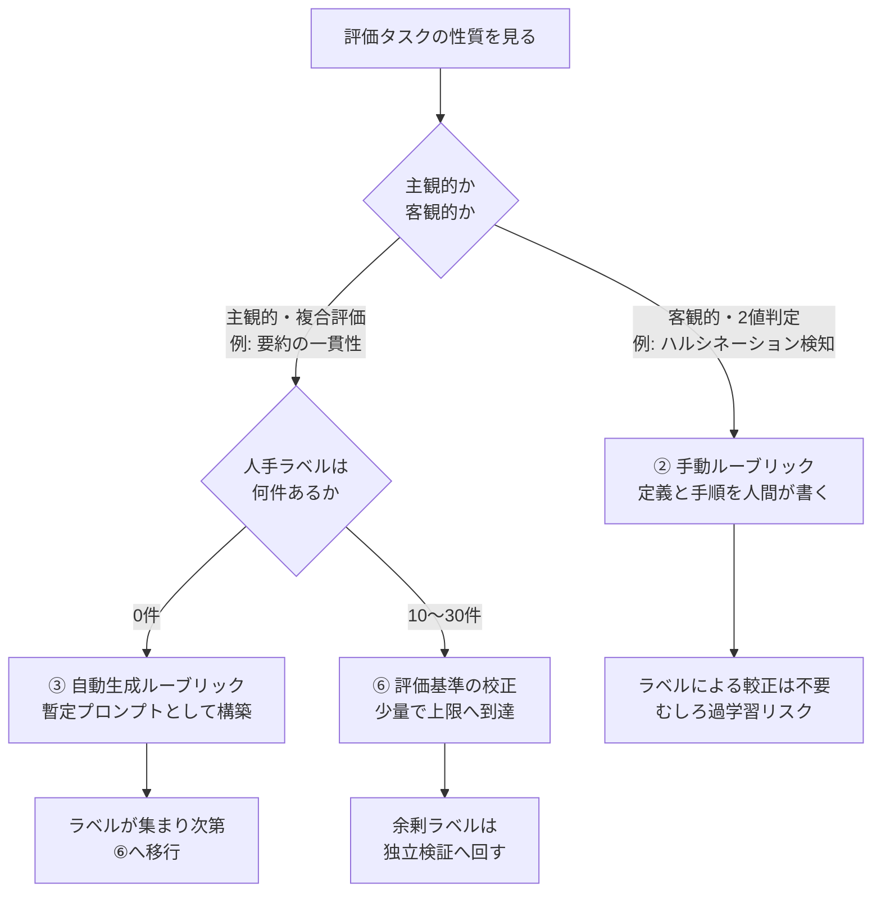
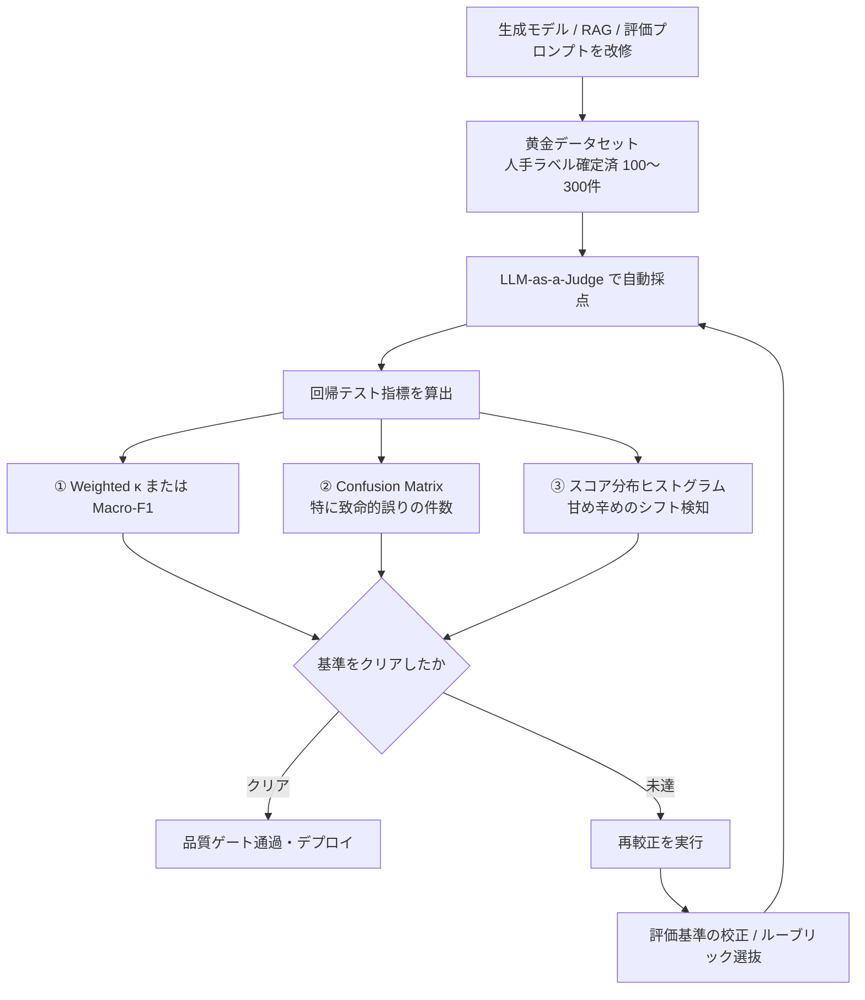

LLM-as-a-Judge を導入すると、最初に必ず「この評価器は人間の判断と同じことを言っているのか」という問いにぶつかります。答え合わせには人手ラベルが要りますが、実務で用意できるのはせいぜい数十〜数百件です。

この記事では、**極小量の人手ラベルで LLM 評価器を人間の判断へ寄せる（較正する）8つの手法**を、公開された比較実験の結果をもとに整理します。読み終えると、次の3点を自分のプロジェクトで判断できる状態になります。

- 自分の評価タスクにラベルが必要か、そもそも不要か
- ラベルが手に入ったとき、10件・30件・100件をどう配分するか
- 較正した評価器を本番の品質ゲートに置くとき、何を監視して、いつ較正をやり直すか

前提となる実験は AI Shift Tech Blog が2026年7月31日に公開した検証記事です。評価器モデルは `gpt-5.4-mini`（temperature=0）、データセットは SummEval と RAGTruth の2種類、ラベル件数は 0 / 10 / 30 / 100 件で比較されています。

## なぜ「較正」という工程が必要なのか

LLM-as-a-Judge は、人手評価をスケールさせる代わりに、系統的な誤判定を持ち込みます。代表的なものは3つです。

| バイアス | 内容 | 出典 |
|---|---|---|
| 位置バイアス | 比較評価で提示順が先か後かでスコアが動く | Wang et al., 2023 |
| 冗長性バイアス | 長い出力を無条件に高く評価する | Saito et al., 2023 |
| 自己選好バイアス | 自分自身が生成した文章を高く評価する | Panickssery et al., 2024 |

厄介なのは、これらが**ランダムな誤差ではなく一方向のズレ**である点です。ランダム誤差はサンプル数を増やせば平均化されますが、系統的なズレは件数を増やしても消えません。だからプロンプト側で補正する、つまり較正するという工程が要ります。

較正の方法は、必要な人手ラベル数で大きく2群に分かれます。

```
LLM-as-a-Judge アラインメント手法
│
├── ラベル0件群
│   ├── ① Zero-shot ................. 評価軸名とスケールだけを渡す
│   ├── ② ルーブリック評価(手動) .... 定義・判断手順・スコアアンカーを人間が書く
│   └── ③ ルーブリック評価(自動) .... 基準そのものを LLM に書かせる
│
└── 少量ラベル群 (10〜100件)
    ├── ④ Few-shot (ランダム選択) ... 手元の事例を任意に選んで例示
    ├── ⑤ Few-shot (層化+多様性) .... 各スコアから均等に、かつ似た事例を避けて選ぶ
    ├── ⑥ 評価基準の校正 ............ 人間と食い違った事例から LLM に基準を書き直させる
    ├── ⑦ プロンプト最適化 (MIPROv2)  指示文と事例の組合せをベイズ最適化
    └── ⑧ プロンプト最適化 (GEPA) ... 失敗理由の反省文でプロンプトを進化させる
```

⑥は AutoCalibrate（Liu et al., 2023）の簡易版にあたる手法です。人間ラベルと評価器の出力が食い違った事例を LLM に見せ、基準文を改善させ、一致度の高い候補を選抜します。

## 実験結果 - 8手法の比較

2つのデータセットは性質が対照的です。

- **SummEval**: 要約の Coherence（一貫性）・Consistency（整合性）・Fluency（流暢さ）・Relevance（関連性）を1〜5点で評価する、主観的でグラデーションのあるタスク。指標は Quadratic Weighted Cohen's $\kappa$
- **RAGTruth**: 参照文書に対して応答がハルシネーションを含むかを 0/1 で判定する、客観的な2値タスク。指標は Macro-F1

結果は次のとおりです。

| 手法 | 必要ラベル | 主観的タスク (Coherence / Relevance) | 客観的タスク (RAGTruth) |
|---|---|---|---|
| ① Zero-shot | 0件 | 低〜中 ($\kappa \approx 0.2 \sim 0.3$) | 極めて低い (F1 $\approx 0.49$) |
| ② ルーブリック評価(手動) | 0件 | ①を下回ることがある | **最高精度 (F1 $\approx 0.76$)** |
| ③ ルーブリック評価(自動) | 0件 | 中程度 ($\kappa \approx 0.35$) | 中程度 |
| ④ Few-shot (ランダム) | 10件〜 | 中程度、事例次第でぶれる | 低〜中 |
| ⑤ Few-shot (層化+多様性) | 10件〜 | 良好 ($\kappa \approx 0.40$) | 低〜中 |
| ⑥ 評価基準の校正 | 10件〜 | **最高精度 ($\kappa = 0.438 \sim 0.514$)** | 改善なし（②を下回る） |
| ⑦ プロンプト最適化 (MIPROv2) | 10件〜 | 中程度 | 変化なし（出力が元と同一） |
| ⑧ プロンプト最適化 (GEPA) | 10件〜 | 偏りデータで見かけ上の高スコア | 変化は微小 |

読み取れる結論は1つです。**タスクの性質によって最適解が入れ替わる**。汎用のベストプラクティスは存在しません。

### 主観的タスク - 10件で人間相関の8割に届く

SummEval の主観軸では、評価基準の校正（⑥）が突出しました。

- **10件**のラベルで Weighted $\kappa = 0.438$。これは人間の評価者同士の一致度 0.544 の約80%にあたります
- **30件**で $\kappa = 0.514$。人間同士の相関 0.504 と同水準、つまり実質的な上限です

30件で上限に届くという事実は、リソース配分の判断を変えます。主観軸の較正のために数百件のラベルを集める計画があるなら、多くは過剰投資です。少量で上限へ達したあとの余剰ラベルは、較正ではなく**独立検証**に回したほうが価値が出ます。

### 客観的タスク - ラベルより「定義」が効く

RAGTruth では逆に、ラベルを使う手法がどれも効きませんでした。勝ったのは人間が書いた手動ルーブリック（②）です。

Zero-shot（①）は F1 が 0.49 まで落ちますが、内訳を見ると理由は明快で、**全体の91%を誤って「ハルシネーション無し」と判定**していました。評価軸の名前とスケールだけを渡されても、モデルは「参照文書と矛盾する」という条件を十分に厳しく解釈しません。

ここで必要だったのは事例ではなく、判断基準そのものの言語化です。何をハルシネーションと呼ぶか、どの手順で参照文書と突き合わせるか、境界事例をどちらに倒すか。これらを人間が明示的に書き下すだけで F1 は 0.76 まで上がり、その後にラベルで較正しても伸びませんでした。

つまり、**客観的な2値判定タスクでは、タスク定義を丁寧に書けば人手ラベルは不要**です。ラベル収集の前に、まず定義を書く工程を置くべきです。

### タスク性質から手法を選ぶ

以上を選定フローにまとめます。



## 較正で踏みやすい2つの罠

### 罠1 - 実データを見ずに書いたルーブリックは逆転負けする

手動ルーブリック（②）は客観的タスクで最強でしたが、主観的タスクでは Zero-shot（①）より一致率が下がる現象が起きました。原因はスコア分布の崩壊です。

SummEval の Coherence では、専門家が「5点」を付けたデータが51件ありました。ところが手動ルーブリックを与えた評価器が出した「5点」は**わずか5件**です。

人間が「完璧な5点とはこうあるべき」と厳格なアンカーを書き込みすぎた結果、評価器が過度に辛口になり、実データの分布とミスマッチを起こしました。基準の品質を上げたつもりが、実データとの整合性を下げていたわけです。

> **原則**: ルーブリックを人間が固定で書き切ってよいのは客観的タスクのみ。グラデーションのある主観的タスクでは、必ず実データによる校正（⑥）を経由させる。

### 罠2 - Weighted κ はラベルが偏ると意味を失う

SummEval の Consistency は人手ラベルの86%が5点、Fluency は79%が5点に集中しています。このように分布が偏ったデータでは、Weighted $\kappa$ は「評価器が人間と同じ割合で5点を出せたか」というマージナル分布の一致でほぼ決まります。

実験では GEPA（⑧）が Consistency で高い $\kappa$ を示しましたが、中身は「評価器が甘くなって5点を出す割合が74%になり、人間の86%に近づいた」だけでした。**個別の問題サンプルを見分ける識別能力が上がったわけではありません**。

この状態で「$\kappa$ が改善したので較正成功」と報告すると、本番で致命的な出力を見逃す評価器を通してしまいます。

> **原則**: 較正の効果検証では、まず人手ラベルのスコアヒストグラムを確認する。偏りがあれば $\kappa$ 単体で判断せず、Confusion Matrix と False Positive / False Negative の実件数を直接監査する。

## 100件のラベルをどう分けるか

較正には過学習がつきまといます。ラベルが少ないほどリスクは高いので、分割ルールを先に決めます。$N = 100$ 件が手元にある場合の配分は次のとおりです。

| 用途 | 件数 | 使い方 |
|---|---|---|
| 調整・校正用 (Train / Dev) | 10〜30件 | 評価基準の校正（⑥）の不一致例抽出、Few-shot（⑤）の事例選定 |
| 独立検証用 (Eval / Test) | 70〜90件 | 調整に一切使わず、最終的な $\kappa$ と Confusion Matrix を測る不可侵領域 |

**避けるべき進め方**は、100件すべてでプロンプトを校正・最適化し、その同じ100件に対する一致率を成果として報告することです。過学習が完全に隠れます。前節で見たとおり主観軸は30件で上限に達するので、70件を検証に回しても較正性能は落ちません。

調整用の10〜30件を選ぶときは、2段構えにします。

1. **層化抽出**: 全スコア階層（1〜5点）から均等に件数を取る。偏ったデータをそのまま使うと、較正後の評価器も同じ偏りを学習します
2. **多様性選択**: 同一スコア内では、テキスト埋め込みモデル（実験では `sentence-transformers/all-MiniLM-L6-v2`）でコサイン類似度の最大値を最小化する Greedy 選択を行い、似た表現の重複を避けます

## 本番の品質ゲートとして運用する

較正した評価器を CI/CD や本番品質監視に組み込む場合、評価器そのものを回帰テストの対象にします。評価器は固定部品ではなく、劣化しうる構成要素だからです。

### 回帰テストのワークフロー



指標を3つ並べているのは、罠2への対策です。$\kappa$ 単体では偏りに騙されるため、Confusion Matrix と分布ヒストグラムを常にセットで見ます。

### 誤判定の「方向」でゲートを制御する

相関係数の閾値だけでは、致命的な見逃しと軽微なズレが同じ重みで扱われてしまいます。誤判定の方向にハード制約を分けて置きます。

| 誤判定の種別 | 定義 | 制御 |
|---|---|---|
| Critical False Positive | 本来1点（致命的欠陥・ハルシネーションあり）を、評価器が4点以上（合格）と判定 | **1件でも発生したら品質ゲートを Block** |
| Minor Error | 本来4点を5点、本来3点を4点と判定 | 許容し、Weighted $\kappa$ の全体閾値で管理 |

Critical False Positive をゼロ件で縛るのは、この誤りが「壊れた出力を本番へ通す」経路そのものだからです。全体の相関がどれだけ良くても、この1件が通れば品質ゲートは機能していません。

### 再較正のトリガー

較正は一度やって終わりではありません。次のいずれかが起きたら、再較正を自動実行します。

1. **Judge LLM の変更・バージョンアップ**: コスト削減や高速化でモデルを差し替えると、評価器の甘さ・辛さのバイアスが変わります。同系列の小型モデルへの変更でも必須です
2. **評価対象システムの変更**: 生成側の文体・長さ・構造が変わると、既存ルーブリックとミスマッチを起こします
3. **データドリフト・コンセプトシフトの検知**: ユーザー入力のドメインやトピックが変化し、黄金データセットとの乖離（Embedding 距離など）が一定以上になったとき

1つ目が見落とされがちです。生成モデルを変えていないから評価は据え置きでよい、という判断は成り立ちません。評価器側のモデルが変われば、同じプロンプトでも分布が動きます。

## まとめ

少量ラベルによる LLM-as-a-Judge 較正の要点は次のとおりです。

- **タスク性質で最適解が入れ替わる**。主観的・複合評価なら評価基準の校正（AutoCalibrate 系）、客観的・2値判定なら手動ルーブリック
- **主観軸は10件で人間相関の8割、30件で実質上限**に届く。それ以上のラベルは較正ではなく独立検証へ回す
- **客観軸ではラベルより定義が効く**。ハルシネーション検知は Zero-shot が91%を見逃したが、定義と手順を書くだけで F1 0.49 → 0.76
- **実データを見ずに書いたルーブリックは逆転負けする**。主観軸では基準を厳しくしすぎてスコア分布が崩れる
- **偏ったラベルでは Weighted $\kappa$ が指標として機能しない**。Confusion Matrix と分布ヒストグラムを併せて監査する
- **評価器自体を回帰テストの対象にする**。Critical False Positive はゼロ件で縛り、Judge LLM を差し替えたら必ず再較正する

評価器の品質は、生成側の品質と同じ重みで管理される必要があります。較正のコストは想像より小さく、放置したときの見逃しコストは想像より大きい、というのがこの比較実験から得られる実務的な結論です。

この記事が少しでも参考になった、あるいは改善点などがあれば、ぜひリアクションやコメント、SNSでのシェアをいただけると励みになります！

## 参考リンク

- u-hyszk, "【LLM-as-a-Judge】少量のデータでジャッジを人手評価に近づける手法を比較する", AI Shift Tech Blog, 2026-07-31. https://zenn.dev/aishift/articles/08bbe9ec0a4b3b
- Zheng et al., "Judging LLM-as-a-Judge with MT-Bench and Chatbot Arena", NeurIPS 2023. https://arxiv.org/abs/2306.05685
- Wang et al., "Large Language Models are not Fair Evaluators", 2023. https://arxiv.org/abs/2305.17926
- Saito et al., "Verbosity Bias in Preference Labeling by Large Language Models", 2023. https://arxiv.org/abs/2310.10076
- Panickssery et al., "LLM Evaluators Recognize and Favor Their Own Generations", 2024. https://arxiv.org/abs/2404.13076
- Liu et al., "Calibrating LLM-Based Evaluator" (AutoCalibrate), 2023. https://arxiv.org/abs/2309.13308
- Agrawal et al., "GEPA: Reflective Prompt Evolution Can Outperform Reinforcement Learning", 2025. https://arxiv.org/abs/2507.19457
- Opsahl-Ong et al., "Optimizing Instructions and Demonstrations for Multi-Stage Language Model Programs" (MIPROv2), 2024. https://arxiv.org/abs/2406.11695
- DSPy ドキュメント. https://dspy.ai/
- Fabbri et al., "SummEval: Re-evaluating Summarization Evaluation", TACL 2021. https://arxiv.org/abs/2007.12626
- Niu et al., "RAGTruth: A Hallucination Corpus for Developing Trustworthy Retrieval-Augmented Language Models", 2024. https://arxiv.org/abs/2401.00396
- Liu et al., "What Makes Good In-Context Examples for GPT-3?", 2021. https://arxiv.org/abs/2101.06804
- Su et al., "Selective Annotation Makes Language Models Better Few-Shot Learners", 2022. https://arxiv.org/abs/2209.01975
- Min et al., "Rethinking the Role of Demonstrations: What Makes In-Context Learning Work?", 2022. https://arxiv.org/abs/2202.12837
