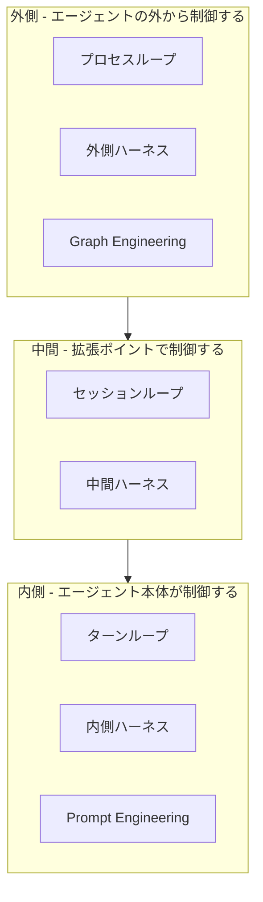
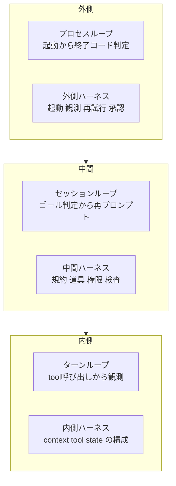
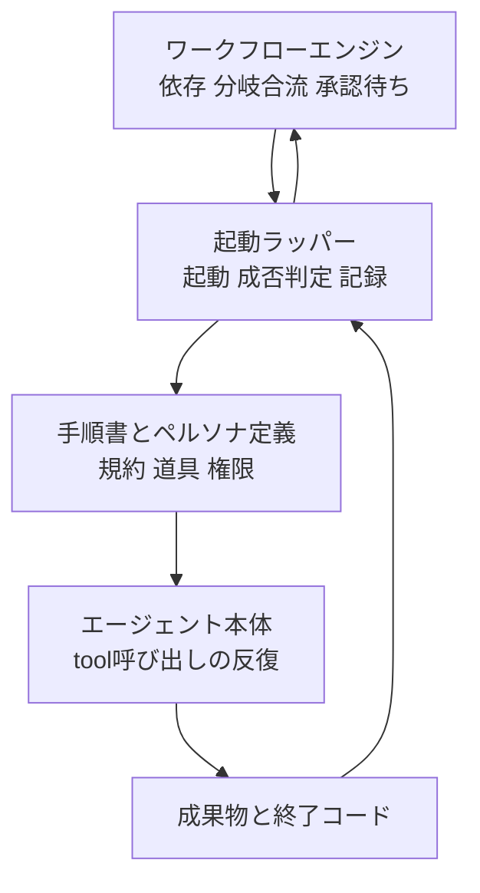

AIエージェントの記事を読むと「◯◯エンジニアリング」が次々に出てきます。Prompt、Context、Loop、Harness、Graph。どれも「次はこれだ」と書いてあります。

しかし5つは競合していません。**1つのシステムに重なった、別々の設計関心です。**

この記事は、筆者が過去に書いた5本の解説記事を並べ直し、それぞれの特徴と違いを整理します。結論を先に言うと、5つに共通するのは「目的達成のためにLLMをどう制御するか」という問いであり、違いは**制御の粒度**と**明示度**の2軸に、**何を設計対象にするか**を加えた3点で説明できます。

> 整理日: 2026-08-18
> 対象: Prompt / Context / Loop / AI Harness / Graph Engineering の5概念

用語の関係だけ知りたい方は「概要」と「統一軸」を読んでください。自分の実装がどの層にいるか判定したい方は「3階層モデル」から「外側の構造例」を読んでください。この整理を疑いたい方は「反証・限界・適用条件」から読んでください。

## 概要

### この記事の結論

| 問い | 答え |
|---|---|
| 5つは競合するか | 競合しません。1つのシステムに重なった別々の設計関心です |
| 共通する問いは何か | 目的達成のためにLLMをどう制御するか |
| 何が違うのか | 制御の粒度（1回の呼び出し → 複数の実行単位）、明示度（暗黙 → 明示）、設計対象（指示・情報・反復・実行基盤・トポロジー）の3点 |
| 実務でどう使うか | 5つは1つのシステムに同居します。1つを選ぶのではなく、いま扱っている制御をどの層に置くかを決めます |

### 扱う5つの概念

それぞれの詳細は元記事に譲り、この記事は関係の整理に集中します。

| 概念 | 設計対象 | 元記事 |
|---|---|---|
| Prompt Engineering | 1回のモデル呼び出しへ与える指示 | [プロンプトエンジニアリングの進化](https://zenn.dev/suwash/articles/prompt_engneering_20250529) |
| Context Engineering | モデルが各ターンで読む情報、圧縮、記憶 | [Context Engineering入門](https://zenn.dev/suwash/articles/context_engineering_20250719) |
| Loop Engineering | エージェントを反復させる制御 | [Loop Engineering入門](https://zenn.dev/suwash/articles/loop-engineering_20260610) |
| AI Harness Engineering | エージェントを包む実行層 | [AI Harness Engineering入門](https://zenn.dev/suwash/articles/ai-harness-engineering_20260515) |
| Graph Engineering | 実行単位間の依存、遷移、合流、承認 | [Graph Engineering入門](https://zenn.dev/suwash/articles/graph-engineering_20260727) |

### 全体像

先に地図を示します。以降の章で、この図の各要素を順に説明します。

*3階層。外側ほど明示度が高く、内側ほど粒度が細かい。*

この図に**Context Engineering はありません**。どの層にも属さず、3階層すべてを縦に貫くためです。理由は「Context Engineering は層をまたぐ」で説明します。

:::message
この3階層への分割は、本記事の独自の整理です。後述する各出典に、同じ3分割は存在しません。出典が何をどう定義しているかは「なぜ混乱するのか」で、この整理の限界は「反証・限界・適用条件」で扱います。
:::

## なぜ混乱するのか

用語が5つあることが問題なのではありません。**同じ語が出典によって別の層を指していること**が問題です。3つの具体例を示します。

### 1. Loop Engineering は出典によって外と内が逆になる

これが最も混乱を生みます。

| 出典 | Loop Engineering の定義 | 指している層 |
|---|---|---|
| Loop Engineering の解説記事（Addy Osmani らの系譜） | エージェントへ指示するシステムそのものを設計する。人間はスケジュールと承認ゲートにだけ関与する | **外側** |
| Graph Engineering の解説記事にある比較表 | 1エージェントの think-act-observe、tool、停止条件、compaction | **内側** |

前者では Loop Engineering は「コンテキストとプロンプトを包含する最上位層」と位置づけられます。後者では「graph の node の内部で継続するもの」と位置づけられます。

**どちらも間違っていません。**ループという語が、実行単位の異なる2つの反復を同時に指しているだけです。この記事が loop を3段階に割るのは、この曖昧さを解消するためです。

### 2. harness が指す範囲は、出典と日常用法でズレる

AI Harness Engineering の論文（arXiv:2605.13357）は、harness を次のように定義しています。

- プロンプトでもエージェントフレームワークでもない
- foundation-model agent を包む**実行層（runtime substrate）**である
- context / tools / project memory / task state / observability / failure attribution / verification / permissions を媒介する11の責務を持つ
- 成熟度は H0（タスク記述とファイルのみ）から H3（観測と検証まで）の4段階

境界の引き方が2箇所あります。

| 境界 | 論文の扱い |
|---|---|
| Foundation Model | harness の**外**。harness が包む対象であり、harness の一部ではない |
| DevOps / プラットフォームエンジニアリング | harness の**外**。人間のワークフロー向け基盤として明示的に区別される |

つまり論文の harness は、**モデル自体も、CIやスケジューラのような起動側も含みません**。その中間にある「モデルへの入力を組み立て、道具を登録し、権限を切り、記録を取る層」を指しています。

一方、日常の会話で「ハーネス」と言うとき、多くの場合はエージェントを起動して回す仕組み全体を指します。**論文の定義のほうが狭い**、というズレがここにあります。

### 3. Context Engineering はすべてを含むように読める

Context Engineering の解説は「モデルに渡すものすべてを設計する」と説明されます。この定義は正しいのですが、範囲が広すぎて他の概念との境界が消えます。

実際、モデルを呼び出す経路に限れば、ループもハーネスもグラフも、最終的にモデルへ渡る情報に影響します。だから「全部コンテキストエンジニアリングだ」という主張は成立してしまいます。成立してしまうがゆえに、設計の役に立ちません。

### 混乱の構造

3つの例に共通するのは、**語が指す実行単位が明示されていない**ことです。

| 混乱の原因 | 具体例 |
|---|---|
| 同じ語が別の実行単位を指す | Loop が「1ターン」と「1プロセス」の両方を指す |
| 出典の定義範囲が限定的 | harness は実行層のみで、起動側を含まない |
| 定義が広すぎて境界が消える | Context がすべてを包含してしまう |

したがって、整理に必要なのは新しい用語ではありません。**実行単位を明示する軸**です。

## 統一軸 — 粒度、明示度、設計対象

5つの概念は、次の3点で区別できます。前の2つは軸として順序を持ち、最後の1つは種類を表します。

### 軸1: 制御の粒度

何を1つの制御単位として扱うかです。5段階に分けます。

1. **1回のモデル呼び出し**
2. **1ターン**（呼び出しと観測の1往復）
3. **1セッション**（1つのゴールに向かう連続した文脈）
4. **1プロセス実行**（起動から終了コードを返すまで）
5. **複数の実行単位**（独立に起動、失敗、再開しうるものの集合）

### 軸2: 明示度

制御をモデルの判断に委ねるか、外部の構造として書き出すかです。

- **暗黙**: 次に何をするかをモデルが決める。人間は指示と情報だけを与える
- **明示**: 遷移条件、許可される副作用、失敗時の扱いを型や契約として外に出す

### 観点: 主な設計対象

粒度と明示度が近くても、主に何を設計しているかが違えば別の概念です。

| 設計対象 | 意味 |
|---|---|
| 指示 | モデルに何をどう伝えるか |
| 情報 | どの情報を読ませ、どれを捨てるか |
| 反復 | 何回繰り返し、いつ止めるか |
| 実行基盤 | 何を使わせ、何を禁じ、何を記録するか |
| トポロジー | 何の後に何が動き、どこで待ち合わせるか |

**これは排他的な分類ではありません。**同じものが複数の概念の設計対象になります。典型はツールです。

| 同じ対象 | Context から見ると | Harness から見ると |
|---|---|---|
| ツール | モデルにどの定義をどう見せるか | 何を登録し、どの権限で実行し、何を記録するか |

対象が重なるとき、違うのは**設計する面**です。

### 5概念のプロット

| 概念 | 制御の粒度 | 明示度 | 主な設計対象 |
|---|---|---|---|
| Prompt Engineering | 1回のモデル呼び出し | 低（次の行動はモデルが決める） | 指示 |
| Context Engineering | 注入は1ターン。情報源と保持期間は全粒度をまたぐ | 低〜中（入れる情報は設計するが遷移は委ねる） | 情報 |
| Loop Engineering | 1ターン / 1セッション / 1プロセス実行 | 低〜高（段階で変わる） | 反復 |
| AI Harness Engineering | 1ターン 〜 1プロセス実行 | 中〜高（責務を契約として書く） | 実行基盤 |
| Graph Engineering | 複数の実行単位 | 高（node、edge、state を型で書く） | トポロジー |

この表から3つのことが読み取れます。

1. **粒度が粗くなるほど、明示度を上げる必要がある**。実行単位が独立して失敗しうるなら、遷移と回復を外に書かないと再開できません
2. **Loop Engineering は、同じ「loop」という語が3つの粒度すべてに使われる**。Harness も複数粒度にまたがりますが、その段階を表す H0–H3 は成熟度であって粒度ではありません。ループだけが、1つの語で3つの粒度を指すため命名上とくに曖昧になります
3. **粒度が重なっても、設計する面で区別できる**。Context と Harness はどちらも1ターンに関与しますが、前者は何を見せるか、後者は何を許し何を記録するかを決めます

## 3階層モデル

:::message alert
この章の3階層は、本記事の独自の整理です。arXiv:2605.13357 の harness は起動側を含まない狭い範囲を指し、Loop Engineering は出典によって「外」と「内」の逆を指します。出典の定義そのものではない点に注意してください。
:::

3階層は、**制御が効く実行スコープ**で引きます。つまり「何の1周に対して効く仕組みか」です。

| 階層 | 実行スコープ | そのスコープで制御が効く形 |
|---|---|---|
| 内側 | 1ターン（tool呼び出しから観測まで） | モデルが選ぶ。ランタイムの context / tool 構成が、その選択肢を成立させる |
| 中間 | 1セッション（ゴール判定から自己再プロンプトまで） | 拡張ポイントが選択肢を制約し、イベントで介入する |
| 外側 | 1実行以上（起動から終了コード、および実行間） | 監督者が起動し、判定し、再試行する |

2つ補足します。

- **中間層は「次の行動を決める」層ではありません。**決めるのはモデルのままで、選べる範囲を狭め、特定のイベントで割り込む層です。この区別があるので、規約を読んだモデルが行動を選ぶケースを「内側と中間の両方」として扱えます
- **階層は制御主体で分けているのではありません。**器（ハーネス）はどの階層でもモデル以外の仕組みです。分けているのは、その仕組みが効く実行スコープです

### ループの3段階

| 段階 | 名称 | 1周の単位 | 代表例 |
|---|---|---|---|
| 内 | **ターンループ** | tool呼び出しから観測まで | ReAct、think-act-observe |
| 中 | **セッションループ** | ゴール判定から自己再プロンプトまで | ゴール達成まで自分にプロンプトを出し続ける仕組み |
| 外 | **プロセスループ** | プロセス起動から終了コード判定まで | 定期起動、CI、ワークフローエンジン |

セッションループには、もう1つ別種があります。**一定間隔でプロンプトを再実行する**タイプです。ゴール判定型は「達成したら止まる」、間隔実行型は「時間が来たらまた動く」で、停止条件がまったく違います。同じセッション内の反復でも、混同しないでください。

3段階を分ける実益は、**終了の決め方をどこに書くべきかが決まる**ことです。

その際、終了の決め方は3種類に分かれます。**混ぜると事故になります。**

| 種類 | 誰が出すか | 例 |
|---|---|---|
| **完了シグナル** | その1周を回している主体が「終わった」と示す | モデルの最終応答、セッションの完了条件、プロセスの終了コード |
| **強制上限** | ランタイムや外部が問答無用で打ち切る | tool呼び出し回数、タイムアウト、トークン予算、リトライ上限 |
| **終了後の評価** | 監督者が、終わった結果を見て成否を判定する | 成果物の検査、テストの通過判定 |

3つ目は停止条件ではありません。**すでに止まったものを評価する仕組み**です。「成果物を見て成否を決める」は、動いている最中の暴走を止めません。

よくある失敗は次の3つです。

- ターンループの暴走を**完了シグナルだけ**で抑えようとする。モデルが判断を誤れば止まりません。強制上限が要ります
- セッションループの停止を外部スケジューラに委ねる。プロセスごと落とすため、途中経過が失われます
- プロセスループの停止をセッション内に書く。プロセスが死んだとき、誰も再開できません

### ハーネスの3段階

ハーネスは、そのループを走らせる「器」です。ループが動きなら、ハーネスは構造です。

| 段階 | 名称 | 実体 | 責務 |
|---|---|---|---|
| 内 | **内側ハーネス** | ランタイム内の context / tool / state を扱う構成 | tool呼び出しの解釈、コンテキストウィンドウの管理 |
| 中 | **中間ハーネス** | 拡張ポイント | 規約の読み込み、道具の登録、権限の境界、イベントでの検査 |
| 外 | **外側ハーネス** | 起動と観測の仕組み | 起動、成否判定、記録、再試行、人間へのエスカレーション |

ここで、隣接するものとの境界を明示します。

| 対象 | ハーネスか |
|---|---|
| Foundation Model | いいえ。ハーネスが**包む対象**です |
| エージェントフレームワーク全体 | いいえ。論文は harness を「エージェントへ公開するランタイム支援の構成」とし、フレームワーク自体とは別に扱います |
| ランタイム内の context / tool / state / verification の構成 | はい（内側ハーネス） |
| 拡張ポイント | はい（中間ハーネス） |
| CI、スケジューラ、DevOps 基盤 | 論文の定義では外。本記事は外側ハーネスとして階層に含めます |

この区別により、arXiv:2605.13357 の harness は**内側ハーネスと中間ハーネスの双方にまたがる**と位置づけられます。

### ループとハーネスは同じ階層の表裏

同じ階層に、動き（ループ）とそれを支える器（ハーネス）があります。

| 階層 | 動き（ループ） | 器（ハーネス） | この層で設計する問い |
|---|---|---|---|
| 内側 | ターンループ | ランタイム内の context / tool 構成 | どう考えさせるか |
| 中間 | セッションループ | 拡張ポイント | 何を使わせ、何を守らせるか |
| 外側 | プロセスループ | 起動と観測の仕組み | いつ動かし、成否をどう判定するか |

**この対応は1対1ではありません。**1つの器が複数の粒度に効きます。例えば hooks は `PreToolUse` のようなターン粒度のイベントと、`SessionStart` / `Stop` のようなセッション粒度のイベントの両方を持ちます。逆に、セッションループは拡張ポイントを使わずランタイム内で完結させることもできます。

表が示しているのは「その階層の動きを主に支えるのはどの器か」であって、排他的な割り当てではありません。

*各階層で、左が動き、右が器。上ほど明示度が高く、下ほど粒度が細かい。器と動きの対応は排他ではない。*

## 各概念の特徴と違い

2軸と3階層をふまえて、5概念を横並びで比較します。

| 観点 | Prompt | Context | Loop | Harness | Graph |
|---|---|---|---|---|---|
| 主な設計対象 | 1回の指示 | 読ませる情報とその供給経路 | 反復と停止 | 実行の器 | 実行単位間の関係 |
| 1周の単位 | なし（単発） | 注入は1ターン。情報源は全粒度をまたぐ | ターン / セッション / プロセス | 各階層の器 | 実行単位 |
| 主な成果物 | プロンプト文 | 検索と圧縮の仕組み | 停止条件と再起動の仕組み | 規約、権限、記録の定義 | node、edge、state の定義 |
| 状態の置き場 | なし | セッション内、または外部ストア | 段階により内部または外部 | 記録と検証の層 | checkpoint された state |
| 人間の関与 | 毎ターン | 設計時と評価時。実行時は自動化可能 | 例外と承認ゲート | 権限設計時と例外時 | 承認 node |
| 主な失敗モード | 指示の曖昧さ | 情報過多と欠落 | 止まらない、暴走する | 権限逸脱、記録の欠落 | 依存の誤り、合流待ち、状態の不整合 |
| 該当する階層 | 内側（最内） | 全層を貫く | 3階層すべて | 内側と中間が中心 | 外側 |

**列を右へ行くほど、扱う不確実性が増えます。**プロンプトは1回の出力品質だけを心配すればよいのに対し、グラフは「独立に失敗しうる複数の実行単位をどう合流させるか」まで心配する必要があります。

逆に言えば、**右の概念が左を不要にすることはありません**。グラフの node の中では相変わらずプロンプトが動いています。ループの中のずさんなプロンプトは、ずさんな作業を速く大量に生産するだけです。

## 中間ハーネスの実装例

3階層のうち、**中間だけは手元ですぐ確かめられます**。エージェントの拡張ポイントがそれです。

中間ハーネスの実体は、次の6つの振る舞い契約に整理できます。

| 維持したい振る舞い | 代表的な拡張ポイント |
|---|---|
| どのエージェントでも同じ規約を守る | Instructions / Rules |
| 同じ作業を同じ手順で進める | Skills / Commands |
| 調査やレビューを別の役割へ委譲する | Custom Agents |
| 特定イベントで検査や通知を呼び出す | Hooks |
| 同じ外部システムへ同じ権限で接続する | MCP / Tools |
| 拡張一式をチームへ配布する | Plugins |

ここで重要なのは、**この6契約が製品共通である一方、置き場と読み込み規則は製品ごとに違う**ことです。ファイル名も、階層の優先順位も、連結かマージか上書きかも揃っていません。特に hooks は最も移植しにくい部分です。

6製品（Claude Code、Codex CLI、GitHub Copilot CLI、Antigravity CLI、Grok Build、Cursor Agent CLI）を対象に、この差分を具体的に比較した記事を別に書いています。

- [Claude Code や Codex などのコーディングエージェントをまたいで同じ動きをさせる拡張設計 - 6製品比較](https://zenn.dev/suwash/articles/agentic-coding-clis_20260807)

中間ハーネスを設計するとは、**製品名の設定ファイルを書くこと**ではなく、**この6契約を決めてから各製品へ変換すること**です。移植の成否は「同じファイルを読めたか」ではなく「同じ入力に対して許容範囲内の行動になったか」で判定します。

## Graph Engineering が足したもの

Graph Engineering は、3階層のうち**外側**に位置します。複数の実行単位の関係を、暗黙のループから明示的なグラフへ引き上げます。

主要な構成要素は3つです。

| 要素 | 内容 |
|---|---|
| 単一責務の node | エージェント、決定的関数、evaluator、人間承認を、それぞれ1つの node として置く |
| typed edge | 単なる矢印ではなく、入出力スキーマ、遷移条件、許可される副作用、失敗時の扱いを含む境界契約 |
| checkpointed state | スキーマを持ち、中断と再開が可能な状態 |

**ループは消えません。**node の内部で継続します。Graph Engineering が扱うのは、ループ間の依存、受け渡し、ゲート、合流です。

外側でこれを明示する実益は、次の4つが可能になることです。

1. **再開**: どこまで終わったかが state に残るため、途中から再開できる
2. **監査**: どの node が何を根拠に次へ進んだかを後から追える
3. **並列**: 独立した branch を同時に走らせ、合流点で待ち合わせられる
4. **段階的承認**: 人間の承認を node として置き、そこで止められる

代償もあります。overhead は node 数そのものより、**node 境界での永続化、シリアライズ、スキーマ検証、ルーティング、合流、記録、再試行**に生じます。依存が密なタスク、レート制限が厳しいツール、共有コンテキストが大きいタスクでは、この投資が回収できません。

## Context Engineering は層をまたぐ

「結局すべてコンテキストの話ではないか」という指摘は、半分正しく、半分間違っています。

その前に、混同しやすい2つを分けます。

| 用語 | 意味 |
|---|---|
| **Context Engineering** | 情報とツールを適時に届けるシステムを設計する活動。他の層と並ぶ設計関心のひとつ |
| **runtime context** | 実行時に組み上がった実際のトークン列。各層の制御によって変化する状態 |

「従属変数」と呼べるのは後者です。設計活動そのものは、どの層にも従属しません。

### 正しい部分

**モデルを呼ぶ node に限れば、すべての層が runtime context を動かしています。**

- プロンプトは、その1回の内容を決める
- 中間ハーネスは、どの規約と道具が読まれるかを決める
- セッションループは、何回積み増すかを決める
- 外側のグラフは、どの node にどの state が渡るかを決める

収束先が同じなので、Context Engineering はどの層とも接続します。

ただし全部ではありません。グラフの node には決定的関数や人間承認も含まれます。**それらの遷移と副作用は、モデルの入力トークンには収束しません。**

### 間違っている部分

**収束先が同じことと、扱う制約が同じことは別です。**Context Engineering の語彙では説明できないものがあります。

| Context では扱えないもの | どの概念が扱うか |
|---|---|
| 独立 branch の並列実行と合流待ち | Graph |
| トークンと金額の予算上限 | Loop（外）と Graph |
| 権限境界と人間の承認ゲート | Harness と Graph |
| 失敗の帰属と段階的回復、再開 | Harness と Graph |
| いつ止めるか、誰が成否を判定するか | Loop |

したがって、Context Engineering は3階層のどれかに属す概念ではありません。**全層を縦に貫く横断的な設計関心**です。全体像の図で階層の外に置いたのは、上位でも下位でもなく直交するためです。

## 外側の構造例

外側は最も語られない層です。そこで、実際に組んだ自動化基盤を**役割名だけに抽象化した参照構造**として示します。

:::message
以下は特定の製品構成の紹介ではありません。「例えばこういう構造になる」という型の提示です。成果や規模については触れません。読者が自分の構成へ読み替えられることだけを目的としています。
:::

### 4つの部品

| 部品 | 役割 | 対応する概念 |
|---|---|---|
| ワークフローエンジン | 定期起動、ジョブ間の依存、分岐と合流、人間承認の待ち合わせ | 明示グラフ層（Graph） |
| 起動ラッパー | 1回の実行を起動し、終了コードと成果物で成否を判定し、記録する | プロセスループ＋外側ハーネス |
| 手順書とペルソナ定義 | 何をどの順で行うか、どの役割として振る舞うかを読ませる。これ自体は実行単位ではなく、実行への入力 | 中間ハーネス |
| エージェント本体 | tool を選び、観測し、次を決める | ターンループ＋内側ハーネス |

*外側から内側へ起動が降り、成果物と終了コードが外へ戻る。*

### この構造から見えること

**5つの概念が1つのシステムに同居しています。**どれか1つを選ぶ設計判断は発生しませんでした。発生したのは「この制御をどの層に置くか」という判断だけです。

例えば次のような割り振りになります。

| 決めたいこと | 置いた層 | 理由 |
|---|---|---|
| 毎日決まった時刻に動かす | 外側（ワークフローエンジン） | セッションが死んでも次回が動く |
| 前のジョブが成功したら次を動かす | 外側（ワークフローエンジン） | 依存を宣言として外に出せる |
| 失敗したら記録して人へ通知する | 外側（起動ラッパー） | エージェント自身は自分の死を報告できない |
| 手順を毎回同じにする | 中間（手順書） | プロンプトに毎回書くと揺れる |
| 危険なコマンドを実行させない | 中間（拡張ポイントの検査） | モデルの自制に依存させない |
| どの tool を何回使うか | 内側（モデルの判断） | ここまで外から決めると硬直する |

**下の2行が重要です。**外側の明示度を上げすぎると、エージェントを使う意味が失われます。明示度は高ければよいものではありません。

### 一方で明示できていない部分

この参照構造は、Graph Engineering の3要素をすべて満たしてはいません。

| 要素 | この構造での実装 | 充足度 |
|---|---|---|
| 単一責務の node | 1つの手順書を読み込んで起動される1回の実行＝1つの node | 満たしている |
| typed edge | 成否のみで繋ぐ。入出力スキーマは持たない | 部分的 |
| checkpointed state | グラフの state ではなく、日付をキーにしたファイル | 部分的 |
| human gate | 承認待ちで停止し、応答で再開する | 満たしている |

つまり、**外側に明示グラフを置いたからといって、自動的に Graph Engineering になるわけではありません。**typed edge と checkpointed state を持たないグラフは、依存を宣言できるだけのスケジューラです。それで足りるなら、それでよいという判断もあります。

## 反証・限界・適用条件

### 反証1: 既存概念の再命名にすぎない

最も強い批判です。Graph Engineering に対しては「loop も graph も有用なパターンだが、古典的な workflow、state machine、分散システムの再命名でもある」という反論が公開されています。長期的な価値は topology ではなく、worker、function、trigger、queue、trace といった substrate 側にある、という主張です。

**この批判は、本記事の3階層モデルにもそのまま当たります。**内側・中間・外側という分割は、OSレイヤやミドルウェアの議論で繰り返し使われてきた形です。新しい発見ではありません。

それでも整理する価値があるとすれば、次の2点です。

1. 用語の混乱によって、**実務者が自分の問題をどの層で解くべきか判断できない**状態が実在する
2. 3階層は結論ではなく**判定手順**として使える。新しい理論を提供するものではない

### 反証2: 3階層は本記事の独自拡張である

繰り返しになりますが、この3分割はどの出典にも存在しません。

| 出典 | その出典が定義している範囲 |
|---|---|
| AI Harness Engineering（arXiv:2605.13357） | 内側と中間にまたがる。モデル自体と、DevOps・プラットフォームエンジニアリングは harness の外と明示 |
| Loop Engineering の解説 | 外側寄り。ただし内側の推論サイクルにも言及する |
| Graph Engineering の解説 | 外側。node 内部のループは対象外 |

「論文が3階層を定義している」と読まないでください。定義しているのは筆者です。

### 反証3: 構造例は検証できない1事例である

「外側の構造例」は匿名化した参照構造であり、読者が検証する手段がありません。一般性の主張でもありません。

**検証可能な裏づけは中間層だけ**です。6製品の拡張ポイントは公式ドキュメントで確認できます。外側の記述は型の提示として読んでください。

### 適用条件: 層を分けるべきでない場合

3階層は常に必要ではありません。次の場合は分けないほうが速く進みます。

| 状況 | 適した層 |
|---|---|
| 1回の要約、分類、抽出 | プロンプトのみ |
| 手順が未知で、人間が横にいる | 内側のターンループのみ |
| 手順が決まっていて、毎回同じ結果がほしい | 中間の手順書まで |
| 人間が見ていない時間に動かしたい | 外側が必要になる |
| 途中で中断し、後から再開したい | 外側で明示グラフを検討する |
| 決定的な処理と人間の承認が混ざる | 外側で明示グラフを検討する |
| 独立に失敗しうる作業が複数あり、合流点がある | 外側で明示グラフを検討する |

**外側を作る主な動機は「人間が見ていないこと」です。**見ているうちは、成否判定も再試行も人間が担えます。

なお、明示グラフの動機は並列だけではありません。**1回の仕事の中でも、長期の再開、人間承認、決定的処理と非決定的処理の混在があれば、明示する価値があります。**

### この記事の限界

- 一次資料の主張は、筆者の既存記事を経由した整理です。原典の細部は各記事と原典URLを参照してください
- Multi-agent orchestration と durable execution は扱っていません。前者はエージェント数に、後者は障害後の replay に注目する軸で、本記事の粒度軸とは直交します
- 各製品の拡張ポイントは更新が速く、記載時点の情報です

## まとめ

### 5つの関係

- 5つは競合しません。**1つのシステムに重なった、別々の設計関心です**
- 共通する問いは「目的達成のためにLLMをどう制御するか」です
- 違いは**制御の粒度**、**明示度**、**設計対象**の3点で説明できます
- Context Engineering だけは階層に属さず、**全層を縦に貫く横断的な関心**です

### いま扱っている問題を切り分けるチェックリスト

層は排他ではありません。1つの実行では、ターンもセッションもプロセスも順に発生します。したがって「どの層か」を1つに決めるのではなく、**いま困っていることがどの関心に属すか**を切り分けます。

該当するものすべてにチェックを付けてください。

**1. 何を変えようとしているか**

| 変えたいもの | 該当する関心 |
|---|---|
| 出力の質や形式 | Prompt |
| 読ませる情報の過不足 | Context |
| 繰り返しの回数、止まらなさ | Loop |
| 使える道具、禁止事項、記録 | Harness |
| 実行の順序、待ち合わせ、承認位置 | Graph |

**2. 制御がどこで効いているか**

| 効き方 | 階層 |
|---|---|
| モデルが選んでいる | 内側 |
| 実行中の規約や検査が選択肢を狭めている、イベントで割り込んでいる | 中間 |
| 実行の外から起動され、判定され、再試行されている | 外側 |

規約を読んだモデルが選ぶ場合、**内側と中間の両方**が該当します。その場合は「どこまでを規約で縛り、どこからモデルに委ねるか」が設計点です。

**3. 完了シグナルと強制上限が、スコープごとに揃っているか**

| スコープ | 完了シグナル | 強制上限 |
|---|---|---|
| 1ターン | モデルの最終応答 | tool呼び出し回数、1回あたりのトークン上限 |
| 1セッション | セッション内の完了条件 | 反復回数、経過時間、セッション累計トークン |
| 1プロセス実行 | プロセスの終了コード | タイムアウト、リトライ上限 |
| 実行をまたぐ | グラフの終端 node への到達 | 総予算、総実行回数 |

**強制上限が空欄の行があれば、そこが暴走の入口です。**なお、成果物を見て成否を判定する仕組みは終了後の評価であり、この表の停止条件とは別に用意します。

**4. 状態、再開、権限、予算を誰が保証しているか**

誰も保証していない項目があれば、それが次に設計すべきものです。項目ごとに担い手が違います。

| 保証したいもの | まず検討する層 |
|---|---|
| 権限、禁止事項、記録 | 中間ハーネス |
| 1ターンと1セッションの停止 | 内側と中間（強制上限を置く） |
| 1実行の停止と予算 | 外側のプロセスループ |
| 実行の順序と依存 | 外側のスケジューラで足りることも多い |
| 承認の位置 | 外側。承認を実行の一部として残すなら明示グラフ |
| 中断後の再開、実行をまたぐ状態 | 明示グラフ（typed edge と checkpointed state） |

**外部保証がすべて明示グラフを必要とするわけではありません。**依存の宣言だけならスケジューラで足ります。グラフが要るのは、状態を型付きで受け渡し、途中から再開したいときです。

用語が5つあることに悩む必要はありません。**いま困っていることがどの関心に属すかを言えれば十分です。**

## 参考リンク

### 本記事が整理した5記事

- [プロンプトエンジニアリングの進化 - 人間中心からAIエージェントへ](https://zenn.dev/suwash/articles/prompt_engneering_20250529)
- [Context Engineering入門：AIに何を渡すかをシステムとして設計する](https://zenn.dev/suwash/articles/context_engineering_20250719)
- [AI Harness Engineering入門：エージェントを包む実行層を契約として設計する](https://zenn.dev/suwash/articles/ai-harness-engineering_20260515)
- [Loop Engineering入門：AIコーディングエージェントを動かすシステムを設計する](https://zenn.dev/suwash/articles/loop-engineering_20260610)
- [Graph Engineering入門：AIエージェントのループを明示グラフへ変える](https://zenn.dev/suwash/articles/graph-engineering_20260727)

### 中間ハーネスの実装例

- [Claude Code や Codex などのコーディングエージェントをまたいで同じ動きをさせる拡張設計 - 6製品比較](https://zenn.dev/suwash/articles/agentic-coding-clis_20260807)

### 一次資料

- [Josh C. Simmons, We Are Entering the Graph Engineering Phase](https://www.drjoshcsimmons.com/writing/we-are-entering-the-graph-engineering-phase)
- [iii, Loops, Graphs, and the Layer That Matters](https://iii.dev/blog/loops-graphs-and-the-layer-that-matters/)
- [Anthropic, Building effective agents](https://www.anthropic.com/engineering/building-effective-agents)
- [arXiv:2605.13357, AI Harness Engineering: A Runtime Substrate for Foundation-Model Software Agents](https://arxiv.org/abs/2605.13357)
- [arXiv:2604.11378, From Agent Loops to Structured Graphs](https://arxiv.org/abs/2604.11378)
