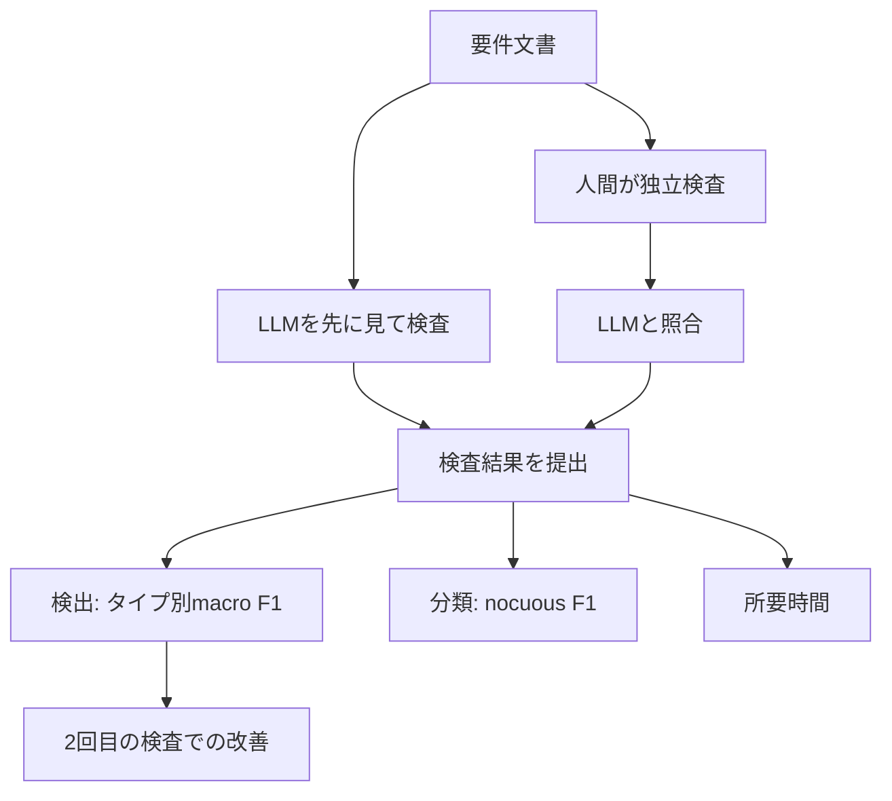

要件レビュー（Requirements Inspection、以下 RI）に ChatGPT を持ち込むと、欠陥は見つけやすくなるのでしょうか。

Broccia らが 2026-08-21 に公開した [arXiv:2608.21298](https://arxiv.org/abs/2608.21298) は、学部生 34 名を対象にした交差実験でこの問いを直接測っています。結果は、検出精度が上がらないどころか点推定では下がる、というものでした。

この記事では、その実験が何を測ったのか、公開されている複製データから何が読み取れるのか、そして「どこまでを自分の現場に持ち帰ってよいか」を整理します。ツールの良し悪しではなく、**人間と LLM のどちらを先に読ませるかという提示順の設計問題**として読むのが本題です。

*この記事の全体像。以下、順に解説します。*

## 結論を先に

- 検査中に ChatGPT を使ってよい群は、使わない群より検出のマクロ平均 F1 が約 8 ポイント低い（調整後の点推定）。ただし 95% 信用区間は重なる
- 所要時間は短くならない
- nocuous / innocuous の分類精度に LLM の効果は見られない
- 2 回目の検査では学習による改善が出る。著者は、最初から LLM を使った群のほうが改善幅が小さいと報告する
- 公開データを要件単位で集計すると、**見逃し（FN）はほぼ同じで、誤検出（FP）が増えている**

現場への含意はひとつに絞れます。**AI を検査の第一読者にしない**。

## 実験はどう組まれたか

| 項目 | 内容 |
|---|---|
| デザイン | 交差デザイン、1 週間の washout |
| 群 | Group1: noGPT → GPT / Group2: GPT → noGPT |
| 被験者 | フィレンツェ大学の学部生 34 名（各群 17 名）。RI と LLM の自己申告習熟で割付 |
| 文書 | Arkanoid（40 要件 / 21 smell）と Snake（39 要件 / 19 smell） |
| 制約 | 1 要件あたり smell は高々 1 個。9 タイプを事前提示 |
| モデル | ChatGPT の GPT-4o または GPT-4.1（課金枠で分岐） |
| 正解 | 著者 3 名の合議。形式的な一致度指標は提示されていない |
| 実施 | 2025-05 |

タスクは「smell があるかどうかの検出」と「その smell が有害（nocuous）か無害（innocuous）かの分類」です。開かれた欠陥探索ではなく、**タイプが事前に決まった検査**である点は押さえておく必要があります。

成果指標は、所要時間、タイプ横断のマクロ平均 F1（検出）、正しく検出した smell に対する nocuous F1（分類）の 3 つ。分析は交差デザインの period と sequence を入れた Bayesian 回帰なので、後述する生の平均値とは数値がずれます。

### 実験が測ったもの / 測っていないもの

この実験が比較したのは「**検査中に ChatGPT を使ってよいか**」の 1 点だけです。図の左側にある「人間が独立検査してから LLM と照合する」二段階レビューは、著者が実践として推奨しているものであって、実験条件ではありません。ここを混同すると、結論を過大に受け取ることになります。

## 数字をどう読むか

### 著者が報告する効果

| 問い | 主張 | 不確実性 |
|---|---|---|
| 時間 | LLM による有意差なし。Period 2 で約 5 分短いが有意ではない | 95% CI が重複 |
| 検出 | noGPT が平均で約 8% 高い F1（ΔF1≈−8%） | 95% CI が重複 |
| 学習 | Period 2 は両系列で 10% 超改善。Group1 約 12%、Group2 約 7% | 論文中の要約 box は「半減（12% ではなく 6%）」と記載され、本文の約 7% と一致しない |
| 分類 | LLM の効果なし。学習は Group1 約 +5%、Group2 約 +3% | — |

被験者の英語習熟の自己申告平均は 5 段階で 3.5。教室外で ChatGPT を使い続けた人は 2 名にとどまり、全検査実行の 2.9% です。

### 公開データを再計算するとどう見えるか

複製パッケージは Zenodo（[10.5281/zenodo.18360108](https://doi.org/10.5281/zenodo.18360108)）で公開されています。ここに含まれる集計ファイルを論文と同じ 34 名に限定して数え直すと、論文本文とは別の角度が見えてきます。

まず、検出のマクロ平均 F1 の生の平均値です。

| 系列 | Period 1 | Period 2 | 生の改善 |
|---|---|---|---|
| Group1（noGPT → GPT） | 0.272（noGPT） | 0.384（GPT） | +0.112 |
| Group2（GPT → noGPT） | 0.239（GPT） | 0.356（noGPT） | +0.118 |

**生の学習効果は両群とも約 +11〜12 ポイントで、ほぼ同じ**です。論文が言う「12% vs 7%」や box の「12% vs 6%」は、period と sequence を固定した条件付き効果として読む必要があります。生データを見て「学習が半減している」と読むことはできません。

条件ごとの生の対平均も、noGPT 0.314 に対して GPT 0.311 とほとんど差がありません。悪化した被験者 17 名、改善した被験者 17 名で真っ二つです。公式の ΔF1≈−8% は、あくまで回帰で調整したあとの点推定です。

### 誤検出が増えている

論文の公式成果はタイプ別のマクロ平均 F1 で、TP/FP/FN の表はありません。複製パッケージの要件レベル集計を条件ごとに合算すると、次のようになります。

| 条件 | TP | FP | FN | プール精度 | プール再現率 |
|---|---|---|---|---|---|
| GPT | 150 | 304 | 530 | 0.330 | 0.221 |
| noGPT | 145 | 234 | 535 | 0.383 | 0.213 |

見逃しは 530 対 535 でほぼ同じ。差が出ているのは誤検出で、GPT 条件が +70（約 30% 増）です。つまり **LLM を併用した被験者は、欠陥を見落とさなくなったのではなく、欠陥でないものを欠陥と呼ぶようになった**という読みが立ちます。

自己申告データでは 34 名中 24 名が 36〜40 要件で LLM を使い、8 名は誤った LLM 提案をそのまま提出したフラグが立っています。過検出という説明と整合的です。

なお、この集計は公式成果とは指標が違います（要件レベルのプール集計 vs タイプ別マクロ平均）。本文の −8% と同じものとして扱わないでください。

### 熟練度で逆転するか

自己申告の RI 習熟度（1〜5）別に検出 F1 を並べると、次のようになります。

| 習熟度 | n | noGPT | GPT |
|---|---|---|---|
| 1 | 19 | 0.291 | 0.316 |
| 2 | 11 | 0.345 | 0.327 |
| 3 | 4 | 0.342 | 0.247 |

「習熟度が上がると LLM が足を引っ張る」ように見えますが、習熟度 3 は 4 名しかいません。論文自身も共変量の効果はなしと述べ、尺度が粗いことを制限として挙げています。**熟練度別の逆転は、このデータからは主張できません。**

「初心者に害がある」という言い方が成立するのは、被験者が学生であるという事実に依っています。産業の熟練検査官に同じことが起きるかどうかは、この実験の射程外です。

## なぜ第一読者にしてはいけないのか

データから読める因果の候補は、アンカリングです。

LLM の出力を先に見ると、検査者の注意はその候補リストに固定されます。リストに載ったものを確認する作業に変わり、載っていない箇所は独立に読まれなくなる。結果として、再現率は上がらないまま精度だけが落ちる。上の FP/FN の非対称は、この筋書きと矛盾しません。

隣接する報告もあります。Jin と Chen の [arXiv:2603.00539](https://arxiv.org/abs/2603.00539) は、LLM が正しい実装を欠陥と誤分類しやすく、説明や修正を求める詳細なプロンプトを与えるほど誤判定が増えると要旨で述べています（要旨に数値の記載はありません）。「丁寧に聞くほど何かを見つけてくる」性質は、レビュー用途では過検出に直結します。

論文の著者自身も、初期検出の主たる補助として LLM を使うことを避け、**検査後の正当化に用途を限定せよ**と書いています。

## 反証としての産業研究

ここで打ち消しておくべき対立証拠があります。LLM を**単独の検出器**として評価した産業研究は、改善を報告しています。

Bashir らの ICSME 2025 Industry Track の[プログラム要旨](https://conf.researchr.org/details/icsme-2025/icsme-2025-industry-track/8/Requirements-Ambiguity-Detection-and-Explanation-with-LLMs-An-Industrial-Study)によれば、3 つの産業データセットで 10-shot は 0-shot より曖昧さ分類を平均 20.2% 改善し、専門家 8 名による説明の評価は 5 点満点で 3.84 でした。

これは矛盾ではありません。**測っている対象が違います。**

| | Broccia et al. | Bashir et al. |
|---|---|---|
| 評価対象 | 人間 + LLM の協働成果 | LLM 単独の分類性能 |
| 被験者 | 学部生 34 名 | 産業データ + 専門家評価 |
| 問い | 検査中にチャットを使ってよいか | LLM は曖昧さを検出できるか |

LLM が検出器として有用であることと、人間の検査プロセスに混ぜたときに全体の精度が上がることは、別の命題です。前者を根拠に後者を主張しないことが、この 2 本を並べたときの正しい態度になります。

## 現場と教育への落とし込み

実験が直接支持するのは 1 番だけです。2 番以降は工学的な外挿であることを明示しておきます。

1. **教育・オンボーディングでは手動検査を先に置く**。LLM は事後の突き合わせに限定する。これは実験結果が直接支持する運用です
2. **レビュー工程で AI 出力を先に配らない**。人間が独立に注釈してから差分を見る。ただしこの二段階レビュー自体は当該実験では未検証です
3. **精度と再現率を分けて観測する**。公開データで見えた害は主に FP 側でした。「AI を入れたらレビュー指摘が増えた」を成果と読まない
4. **一般化を急がない**。熟練者、ドメイン固有文書、チェックリスト強制下では再実験が必要です

逆転しうる条件も見当がついています。検査者がドメイン熟練者で、LLM が独立した検出器として走り人間が採点する側に回る構成（Bashir 型）。あるいは、過検出を抑える強制チェックリストがある場合です。いずれも「LLM を第一読者にする」構成とは別物です。

## この結果が言えないこと

過大解釈を避けるために、限界を明示します。

- 検出効果の 95% 信用区間は重なり、生の平均差はほぼ 0。「LLM が有害と証明された」とは言えない
- 学習効果の「半減」は、論文本文の数値と要約 box の数値が食い違う。生平均では半減していない
- 外部妥当性の制約が強い。学生、ゲームの要件文書、1 要件 1 smell、事前定義された 9 タイプ
- 人間先行 → LLM 照合の二段階レビューは実験されていない
- 再現率を最適化したい現場では、この集計の FN 差は実質ゼロに近い
- GPT-4o と GPT-4.1 の混在が効果を薄めた可能性は、公開データからは分離できない

意思決定を止める必要はありません。**初心者教育と、検査中チャットを第一読者に据える運用は、現時点では採用しない**。熟練者向けの検出器パイプラインは、別問題として残しておく。この 2 つに切り分けておけば十分です。

## まとめ

- 学部生 34 名の交差実験で、検査中の ChatGPT 併用は要件 smell の検出精度を押し上げず、点推定では約 8 ポイント下がった。ただし信用区間は重なる
- 時間短縮も分類精度の向上も観測されていない
- 公開データを要件単位で数え直すと、見逃しは横ばいで誤検出が約 30% 増えている。害は過検出側にある
- LLM を単独検出器として評価した産業研究は改善を報告しており、矛盾ではなく測定対象の違いとして扱う
- 実務の指針は「AI を第一読者にしない」。人間の独立判断を先に置き、LLM は照合と正当化に回す

要件レビューに限らず、コードレビューでも設計レビューでも同じ構造が起きます。AI をどこに置くかは、性能の問題ではなく**順序の設計**の問題です。

この記事が少しでも参考になった、あるいは改善点などがあれば、ぜひリアクションやコメント、SNSでのシェアをいただけると励みになります！

## 参考リンク

- [Human-AI Collaboration in Requirements Engineering: Evidence of the Negative Effect of LLMs on Requirements Inspection (arXiv:2608.21298)](https://arxiv.org/abs/2608.21298) — Broccia G, Frattini J, Arora C, ter Beek MH, Fantechi A, Vogelsang A, Ferrari A. 2026-08-21
- [複製パッケージ (Zenodo 10.5281/zenodo.18360108)](https://doi.org/10.5281/zenodo.18360108) — Broccia et al. 2026-01-24
- [Requirements Ambiguity Detection and Explanation with LLMs: An Industrial Study (ICSME 2025 Industry Track)](https://conf.researchr.org/details/icsme-2025/icsme-2025-industry-track/8/Requirements-Ambiguity-Detection-and-Explanation-with-LLMs-An-Industrial-Study) — Bashir S, Ferrari A, et al.
- [Are LLMs Reliable Code Reviewers? Systematic Overcorrection in Requirement Conformance Judgement (arXiv:2603.00539)](https://arxiv.org/abs/2603.00539) — Jin H, Chen H. 2026-02-28
