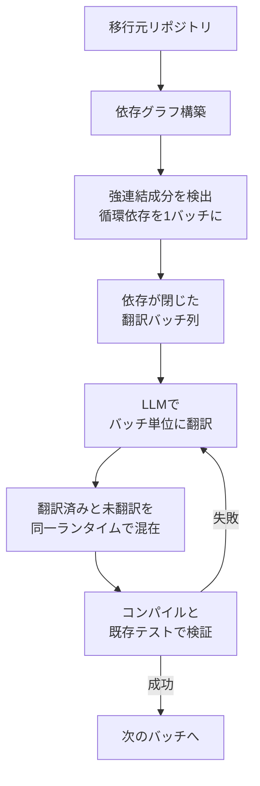

既存システムを別の言語へ移行する作業に、LLM を使う話が増えました。小さなユーティリティなら 1 ファイル投げれば動くコードが返ってきます。ところがリポジトリ全体に広げた瞬間、コンパイルすら通らなくなる。この落差は現場でよく観測されます。

arXiv に投稿された論文 "DepWareTrans: Dependency-Aware Incremental Repository Migration across Co-executable Languages"（arXiv:2608.14128）は、この落差の原因を **ファイル間の依存不整合** と特定し、移行の単位を作り変えることで 51K LOC・1,470 ファイルの Java → Kotlin 移行を全コンパイル・全テスト成功まで運んだと報告しています。

この記事では次の 3 点を扱います。

- ファイル単位の LLM 移行が崩れる構造的な理由
- 「依存グラフの閉包」を移行単位に置き換えると何が変わるか
- 自分のプロジェクトでこの手法が使えるか / 使えないかの判断基準

移行プロジェクトの計画を立てる立場の方、あるいは「LLM で移行できませんか」と聞かれて答えに詰まった方を想定しています。

*この記事の全体像。以下、順に解説します。*

## ファイル単位の移行は、なぜ 9 割落ちるのか

論文が報告している数字は極端です。同一プロジェクトに対する 2 つの分割戦略の比較です。

| 移行単位 | コンパイル成功率 | テスト成功率 |
|---|---|---|
| ファイル単位（フィードバックループあり） | 38.16% | 9.39% |
| 依存整合バッチ（DepWareTrans） | 100% | 100% |

ファイル単位でもフィードバックループ、つまりコンパイルエラーを LLM に返して直させる工程は回しています。それでもテストが通るのは 1 割未満です。

理由は、LLM の翻訳能力ではなく **参照先が翻訳の途中にある** ことにあります。ファイル A が参照するファイル B を、A の翻訳時点ではまだ触っていない。あるいは B は翻訳済みだが、翻訳の過程でシグネチャや null 許容性が変わっている。A の中身がどれだけ正しく訳されていても、境界が合わなければビルドは落ちます。

さらに厄介なのが循環依存です。A が B を参照し、B も A を参照する場合、どちらを先に訳しても相手の確定を待つことになります。ファイルを 1 つずつ処理する限り、この待ち合わせは原理的に解けません。

つまりファイル単位の失敗は、個々の翻訳品質の問題ではなく **分割の仕方が依存構造と噛み合っていない** ことによる失敗です。ここを取り違えると、対策としてプロンプトを磨いたりモデルを上げたりする方向に進んでしまい、成功率は大きくは動きません。

## 移行単位を「依存グラフの閉包」に置き換える

DepWareTrans の中身は、手法名の通り依存グラフの扱いに尽きます。

1. リポジトリの依存グラフを構築する
2. 循環依存を持つファイル群を **強連結成分（SCC）** として 1 つのバッチに束ねる
3. 依存が閉じたバッチ単位で LLM にコンテキストを渡し、まとめて翻訳する
4. 翻訳済みコードと未翻訳コードを同一ランタイム上で混在させたまま、ビルドとテストを回す
5. 失敗したらそのバッチに対してフィードバックし、通ったら次のバッチへ進む

ポイントは 2 つあります。

**バッチの中で依存が閉じている。** 相互に参照し合うファイルは同じバッチに入るので、LLM は「相手がこの後どう訳されるか」を推測せずに済みます。シグネチャの整合を、翻訳と同時に決められる状態を作っているわけです。論文では 1 バッチあたり最大 25 ファイル程度を目安としています。

**検証が毎バッチ走る。** 移行元と移行先が同じランタイムで共存できるため、リポジトリ全体を訳し終える前にビルドとテストを回せます。既存のテストスイートがそのまま合否判定に使えるので、誤りが混入したバッチをその場で検出でき、後段のバッチに欠陥が伝播しません。全部訳し終えてから初めてテストする方式とは、デバッグの難易度が桁で違います。

「機能ごと」「ドメインごと」という直感的な分け方が効かないのはここです。機能の境界と依存の境界は一致しません。1 つの機能を切り出したつもりでも、その内側から共通基盤クラスへの参照が伸びていれば、そのバッチは閉じていません。

## この手法が使える条件、使えない条件

数字が良いからといって、あらゆる移行に持ち込めるわけではありません。論文が挙げている前提と限界は、そのまま適用判断のチェックリストになります。

### 前提: 移行元と移行先が共存実行できること

最大の前提が **Co-executable**、つまり移行元と移行先の言語が同一ランタイム上で共存し相互運用できることです。JVM 上の Java と Kotlin、.NET 上の C# と F# がこれに当たります。

この前提が成り立つからこそ、翻訳途中の半分だけ移行した状態でビルドとテストが回せます。逆に C++ から Rust のように実行基盤もテスト資産も共有できない組み合わせでは、この段階的検証ループが成立しません。手法の中核が「毎バッチ検証」である以上、ここは代替が効きにくい部分です。

自分のプロジェクトを評価するときは、まずこの一点を確認してください。ここが No なら、報告された成功率はそのまま期待できません。

### 限界 1: ハブクラスが SCC を肥大化させる

循環依存をまとめる方式の弱点は、循環が大きいとバッチも大きくなることです。論文では `commons-csv` のような約 3K LOC の巨大クラスや、システム中核のハブクラスが存在するケースを問題として挙げています。

こうしたクラスが循環の中に入ると、SCC が芋づる式に膨らみます。膨らんだ SCC は LLM のコンテキスト制限を超え、一括翻訳そのものが破綻します。**手法の適用可能性が、既存コードの構造の悪さに直接左右される** という性質です。

したがって移行前に見るべきは LOC の総量ではなく、SCC のサイズ分布です。最大の SCC がコンテキストに収まらないなら、そこは移行作業ではなく事前リファクタリングの対象になります。

### 限界 2: 構造的負債はそのまま引き継がれる

依存関係を維持したまま訳すため、密結合や循環依存といった構造の問題は、新しい言語にそのまま持ち越されます。Kotlin になっただけの、同じ形をした密結合が手に入る、という状態です。

これは欠陥ではなく設計上の割り切りです。移行の成功率を上げるために「構造を変えない」ことを選んでいるので、当然の帰結といえます。ただし、移行の目的が言語の刷新ではなくアーキテクチャの改善だった場合、この手法単体ではゴールに届きません。**言語移行とモダナイゼーションは別の作業として見積もる** 必要があります。

## 現場でどう判断するか

以上を、着手前に決めるべきことへ落とします。

**移行単位の定義を、依存グラフの閉包に置き換える。** WBS を機能単位で切ってしまうと、そのまま作業計画が破綻します。タスク分割の前に依存グラフを取り、SCC を数えるところから始めます。バッチ数が見積もりの単位になります。

**ハブクラスの解消を移行の前工程に置く。** SCC のサイズ分布を見て、コンテキストに収まらない塊があれば、そこだけは人手のリファクタリングで循環を切ります。この作業は移行の一部ではなく前提条件です。工数を移行本体と混ぜないほうが、進捗が読めます。

**段階的検証の CI を先に組む。** バッチごとにコンパイルと自動テストを通すパイプラインが、この手法の中核です。裏を返せば **既存テストスイートの網羅性が移行の品質上限を決めます**。テストが薄い領域は、翻訳が壊れていても 100% パスします。移行前にテストの空白地帯を把握しておくことが、報告された数字を自分の環境で再現する条件になります。

### 数字の受け取り方について

コンパイル 100%・テスト 100% は強い結果ですが、報告されているのは 1 プロジェクトでの結果です。対象は Java → Kotlin という、言語間の意味論的な距離が比較的近く、かつ既存テストスイートが機能していた環境でした。

同じ数字が別の言語ペア、別のテスト成熟度、別の依存構造で出るとは限りません。移植可能なのは 100% という数字ではなく、**分割の単位を依存構造に合わせ、共存実行できる性質を使って毎バッチ検証する** という設計方針のほうです。判断材料として使うなら、こちらを持ち帰るのが妥当だと考えます。

## まとめ

- ファイル単位の LLM 移行が崩れるのは翻訳品質ではなく、分割が依存構造と噛み合っていないため。フィードバックループを付けてもテスト成功率は 9.39% にとどまった
- 循環依存を強連結成分としてまとめ、依存が閉じたバッチ単位で翻訳・検証する方式で、51K LOC・1,470 ファイルの Java → Kotlin 移行がコンパイル 100%・テスト 100% に到達した
- 前提は移行元と移行先が同一ランタイムで共存実行できること。C++ → Rust のように基盤を共有できない組み合わせには持ち込めない
- 巨大なハブクラスは SCC を肥大化させ、コンテキスト制限で破綻する。事前リファクタリングは移行の前工程として別に見積もる
- 依存構造を維持して訳すため、密結合などの構造的負債は移行先にそのまま残る。アーキテクチャ改善は別作業
- 検証の土台は既存テストスイートなので、テストの網羅性が移行品質の上限になる

この記事が少しでも参考になった、あるいは改善点などがあれば、ぜひリアクションやコメント、SNS でのシェアをいただけると励みになります！

## 参考リンク

- [arXiv:2608.14128 — DepWareTrans: Dependency-Aware Incremental Repository Migration across Co-executable Languages](https://arxiv.org/abs/2608.14128)
